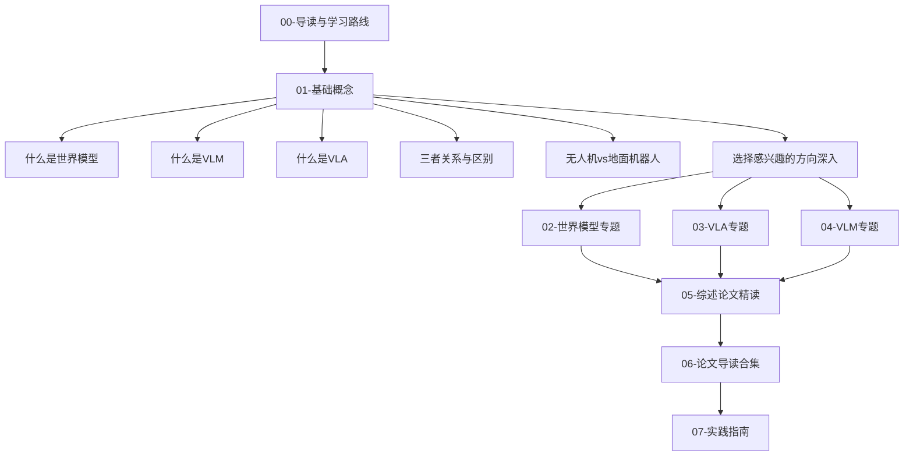

# UAV World Model & VLA & VLM Learning

<p align="center">
  <b>无人机领域的世界模型、视觉语言动作模型(VLA)、视觉语言模型(VLM) — 从认知到理解的完整学习项目</b>
</p>

<p align="center">
  
  
  
  
  
</p>

<p align="center">
  <a href="#项目简介">简介</a> •
  <a href="#学习路线">学习路线</a> •
  <a href="#文档目录">目录</a> •
  <a href="#核心论文">论文</a> •
  <a href="#如何使用">使用</a> •
  <a href="#引用">引用</a> •
  <a href="CONTRIBUTING.md">贡献</a>
</p>

---

## 项目简介

> 当无人机学会"看"、"说"、"想"、"飞" — 它就不再只是飞行器，而是一个空中智能体。

本项目是一个**面向无人机领域的 VLA/VLM/世界模型综述学习项目**，基于以下核心参考资料：

- [arXiv:2605.00080](https://arxiv.org/abs/2605.00080) — *"World Model for Robot Learning: A Comprehensive Survey"*（43页，6图，2026年最新综述）
- [NTUMARS/Awesome-World-Model-for-Robotics-Policy](https://github.com/NTUMARS/Awesome-World-Model-for-Robotics-Policy) — 机器人策略学习世界模型论文合集

**本项目的独特价值**：

| 维度 | 说明 |
|------|------|
| **聚焦无人机** | 不是通用机器人，专门针对 UAV/无人机领域的 VLA、VLM、世界模型 |
| **保姆级教学** | 每篇文档配有阅读时间、前置知识、核心内容、思考题，适合零基础入门 |
| **认知导向** | 不跑代码，重点理解原理、架构、演进脉络和论文思想 |
| **系统化梳理** | 从基础概念到前沿论文，从理论到实践指南，完整学习路径 |
| **论文精读** | 30+ 篇关键论文逐篇解读，含一句话总结、核心贡献、方法分析 |

### 三大核心概念

```
VLM (视觉语言模型)          VLA (视觉语言动作模型)        World Model (世界模型)
"看图说话"                   "看图说话+动手"               "预测未来"
┌─────────────┐            ┌─────────────┐            ┌─────────────┐
│  图像 + 文本 │            │ 图像+文本+动作│            │ 当前状态+动作 │
│      ↓      │            │      ↓      │            │      ↓      │
│  理解/描述   │            │  理解+执行   │            │  预测下一状态 │
└─────────────┘            └─────────────┘            └─────────────┘
   "前方有障碍物"            "左转避开障碍物"             "左转后会看到什么"
```

---

## 学习路线

建议按以下顺序阅读，每阶段约 1-2 周：



**推荐路径**：
- **快速入门**（1周）：00-导读 → 01-基础概念（5篇）→ 04-三者关系
- **深入方向**（2-3周）：选择 02/03/04 中一个专题深入
- **综述精读**（2周）：05-综述论文精读 + 06-论文导读
- **动手实践**（持续）：07-实践指南，按兴趣复现项目

---

## 文档目录

### Part 1: 基础概念
| 文档 | 内容 | 推荐度 |
|------|------|--------|
| [什么是世界模型](docs/01-基础概念/01-什么是世界模型.md) | 定义、发展脉络、核心思想 | ★ 必读 |
| [什么是VLM](docs/01-基础概念/02-什么是VLM.md) | 视觉语言模型架构与训练 | ★ 必读 |
| [什么是VLA](docs/01-基础概念/03-什么是VLA.md) | 从VLM到VLA的演进 | ★ 必读 |
| [三者关系与区别](docs/01-基础概念/04-三者关系与区别.md) | VLM→VLA→世界模型关系图谱 | ★ 必读 |
| [无人机vs地面机器人](docs/01-基础概念/05-无人机vs地面机器人.md) | 无人机领域的特殊挑战 | ● 推荐 |

### Part 2: 世界模型专题
| 文档 | 内容 | 推荐度 |
|------|------|--------|
| [世界模型发展史](docs/02-世界模型专题/01-世界模型发展史.md) | 从Ha/Schmidhuber到现代 | ★ 必读 |
| [生成式世界模型](docs/02-世界模型专题/02-生成式世界模型.md) | ANWM、AirScape、FlightDiffusion | ● 推荐 |
| [模型强化学习世界模型](docs/02-世界模型专题/03-模型强化学习世界模型.md) | Dreamer系列、Dream to Fly | ● 推荐 |
| [3D场景世界模型](docs/02-世界模型专题/04-3D场景世界模型.md) | NeRF、3DGS作为世界模型 | ○ 了解 |
| [无人机世界模型综述](docs/02-世界模型专题/05-无人机世界模型综述.md) | 无人机专属世界模型论文解读 | ● 推荐 |
| [关键数据集与基准](docs/02-世界模型专题/06-关键数据集与基准.md) | MotionScape、AeroVerse等 | ○ 了解 |

### Part 3: VLA 专题
| 文档 | 内容 | 推荐度 |
|------|------|--------|
| [VLA架构演进](docs/03-VLA专题/01-VLA架构演进.md) | 从RT-2到OpenVLA到pi-0 | ★ 必读 |
| [无人机VLA模型](docs/03-VLA专题/02-无人机VLA模型.md) | VLA-AN、CognitiveDrone、UAV-TrackVLA | ● 推荐 |
| [语言条件飞行控制](docs/03-VLA专题/03-语言条件飞行控制.md) | UAV-Flow、VLN-Pilot | ● 推荐 |
| [基础模型辅助规划](docs/03-VLA专题/04-基础模型辅助规划.md) | CoDrone、FM-Planner、NavFoM | ○ 了解 |
| [机载部署与优化](docs/03-VLA专题/05-机载部署与优化.md) | 推理加速、边缘计算、安全约束 | ● 推荐 |

### Part 4: VLM 专题
| 文档 | 内容 | 推荐度 |
|------|------|--------|
| [遥感VLM](docs/04-VLM专题/01-遥感VLM.md) | GeoChat、RSGPT、SkySenseGPT | ● 推荐 |
| [无人机场景理解](docs/04-VLM专题/02-无人机场景理解.md) | UAVBench、BEDI基准 | ○ 了解 |
| [LLM驱动的无人机Agent](docs/04-VLM专题/03-LLM驱动的无人机Agent.md) | CityNavAgent、ACDC等 | ○ 了解 |
| [边缘VLM部署](docs/04-VLM专题/04-边缘VLM部署.md) | 轻量化、知识蒸馏、BLIP-2 | ○ 了解 |

### Part 5: 综述论文精读
| 文档 | 内容 | 推荐度 |
|------|------|--------|
| [综述概览与结构](docs/05-综述论文精读/01-综述概览与结构.md) | arXiv:2605.00080 整体框架 | ★ 必读 |
| [世界模型作为策略](docs/05-综述论文精读/02-世界模型作为策略.md) | 综述第二部分精读 | ● 推荐 |
| [世界模型作为模拟器](docs/05-综述论文精读/03-世界模型作为模拟器.md) | 综述第三部分精读 | ● 推荐 |
| [视频生成世界模型](docs/05-综述论文精读/04-视频生成世界模型.md) | 综述第四部分精读 | ● 推荐 |
| [基准与评估](docs/05-综述论文精读/05-基准与评估.md) | 综述第五部分精读 | ○ 了解 |

### Part 6: 论文导读合集
| 文档 | 内容 |
|------|------|
| [世界模型论文卡片](docs/06-论文导读合集/world-model-papers.md) | 15+ 篇世界模型关键论文逐篇解读 |
| [VLA论文卡片](docs/06-论文导读合集/vla-papers.md) | 10+ 篇VLA关键论文逐篇解读 |
| [VLM论文卡片](docs/06-论文导读合集/vlm-papers.md) | 10+ 篇VLM关键论文逐篇解读 |
| [基准与数据集论文](docs/06-论文导读合集/benchmark-papers.md) | 基准测试与数据集论文解读 |

### Part 7: 实践指南
| 文档 | 内容 |
|------|------|
| [环境搭建](docs/07-实践指南/01-环境搭建.md) | CUDA、PyTorch、ROS2 环境配置 |
| [UAV-Flow 复现指南](docs/07-实践指南/02-复现指南-UAV-Flow.md) | 语言条件无人机控制 |
| [CognitiveDrone 复现指南](docs/07-实践指南/03-复现指南-CognitiveDrone.md) | 认知无人机VLA模型 |
| [FlightDiffusion 复现指南](docs/07-实践指南/04-复现指南-FlightDiffusion.md) | 扩散模型生成FPV视频 |
| [MotionScape 复现指南](docs/07-实践指南/05-复现指南-MotionScape.md) | 无人机视频数据集 |
| [GeoChat 复现指南](docs/07-实践指南/06-复现指南-GeoChat.md) | 遥感VLM |
| [DreamerV3-Drone 复现指南](docs/07-实践指南/07-复现指南-DreamerV3-Drone.md) | 模型强化学习无人机飞行 |

### 思维导图 & 参考资料
| 文档 | 内容 |
|------|------|
| [领域全景图](mindmaps/field-overview.md) | VLA/VLM/世界模型全景关系图 |
| [世界模型分类学](mindmaps/world-model-taxonomy.md) | 世界模型分类体系 |
| [VLA演进路线](mindmaps/vla-evolution.md) | VLA模型发展时间线 |
| [推荐阅读顺序](mindmaps/reading-order.md) | 论文阅读顺序建议 |
| [完整论文列表](references/paper-list.md) | 50+ 篇论文分类汇总 |
| [Awesome List 注释](references/awesome-annotations.md) | 对 NTUMARS 仓库的补充 |

---

## 核心论文

### 世界模型（无人机方向）
| 论文 | 年份 | 核心贡献 | 推荐度 |
|------|------|----------|--------|
| [ANWM](https://arxiv.org/abs/2512.21887) | 2025 | 航空导航世界模型，FFP模块提供几何先验 | ★★★ |
| [Dream to Fly](https://arxiv.org/abs/2501.14377) | 2025 | DreamerV3用于无人机竞速，ICRA 2026 | ★★★ |
| [FlightDiffusion](https://arxiv.org/abs/2509.14082) | 2025 | 扩散模型生成FPV视频用于策略学习 | ★★☆ |
| [MotionScape](https://arxiv.org/abs/2604.07991) | 2026 | 30+小时4K无人机视频数据集 | ★★☆ |
| [AeroVerse](https://arxiv.org/abs/2408.15511) | 2024 | 航空航天世界模型基准套件 | ★★☆ |

### VLA（无人机方向）
| 论文 | 年份 | 核心贡献 | 推荐度 |
|------|------|----------|--------|
| [VLA-AN](https://arxiv.org/abs/2512.15258) | 2025 | 机载VLA框架，98.1%成功率，8.3x加速 | ★★★ |
| [CognitiveDrone](https://arxiv.org/abs/2503.01378) | 2025 | 认知无人机VLA，实时4D动作输出 | ★★★ |
| [UAV-TrackVLA](https://arxiv.org/abs/2604.02241) | 2026 | 基于pi-0.5的无人机跟踪VLA | ★★☆ |
| [UAV-Flow](https://arxiv.org/abs/2505.15725) | 2025 | 语言条件细粒度无人机控制基准 | ★★☆ |
| [VLN-Pilot](https://arxiv.org/abs/2602.05552) | 2026 | VLM作为室内无人机操作员 | ★★☆ |

### VLM（无人机/遥感方向）
| 论文 | 年份 | 核心贡献 | 推荐度 |
|------|------|----------|--------|
| [GeoChat](https://arxiv.org/abs/2311.15826) | 2024 | 首个遥感VLM，CVPR 2024 | ★★★ |
| [CoDrone](https://arxiv.org/abs/2512.19083) | 2025 | 云边端基础模型无人机导航 | ★★☆ |
| [FM-Planner](https://arxiv.org/abs/2505.20783) | 2025 | 基础模型路径规划，8种LLM/VLM对比 | ★★☆ |
| [NavFoM](https://arxiv.org/abs/2509.12129) | 2025 | 跨形态导航基础模型，含无人机 | ★★☆ |
| [UAVBench](https://arxiv.org/abs/2603.14336) | 2026 | 无人机VLM基准，966K样本 | ★★☆ |

---

## 无人机领域关键挑战

| 挑战 | 地面机器人 | 无人机 |
|------|-----------|--------|
| **动作空间** | 2D (x, y, θ) | 4D (roll, pitch, yaw, thrust) + 6-DoF |
| **安全约束** | 碰撞可恢复 | 坠机不可逆 |
| **视觉挑战** | 固定视角 | 快速视角变化、俯视/斜视、变高度 |
| **计算限制** | 可携带更多算力 | 严格机载算力限制 |
| **仿真难度** | 2.5D运动 | 全3D动力学，sim-to-real差距大 |
| **数据稀缺** | 大量公开数据集 | 无人机视角数据集稀缺 |

---

## 如何使用

### 快速开始
1. 阅读 [00-导读与学习路线](docs/00-导读与学习路线.md) 了解整体结构
2. 从 [基础概念](docs/01-基础概念/) 开始建立认知框架
3. 选择感兴趣的方向深入（世界模型 / VLA / VLM）
4. 查阅 [论文导读合集](docs/06-论文导读合集/) 了解前沿工作
5. 按需参考 [实践指南](docs/07-实践指南/) 动手复现

### 推荐阅读顺序
```
第1周: 00-导读 → 01-基础概念(5篇) → 04-三者关系
第2周: 02-世界模型专题(6篇) 或 03-VLA专题(5篇)
第3周: 05-综述精读(5篇)
第4周: 06-论文导读(4篇) → 07-实践指南(按兴趣选)
```

---

## 引用

如果本项目对你的学习有帮助，欢迎引用：

```bibtex
@misc{uav-wm-vla-learning,
  title={UAV World Model \& VLA \& VLM Learning},
  author={Qxy661},
  year={2026},
  howpublished={\url{https://github.com/Qxy661/UAV-WM-VLA-Learning}},
  note={A comprehensive learning project for World Models, VLA, and VLM in the UAV domain}
}
```

---

## 致谢

- 感谢 [arXiv:2605.00080](https://arxiv.org/abs/2605.00080) 的作者们提供了高质量的综述
- 感谢 [NTUMARS](https://github.com/NTUMARS/Awesome-World-Model-for-Robotics-Policy) 维护的 awesome list
- 感谢所有被引用论文的作者们

---

<p align="center">
  <i>如果觉得有用，请给个 Star!</i>
</p>
