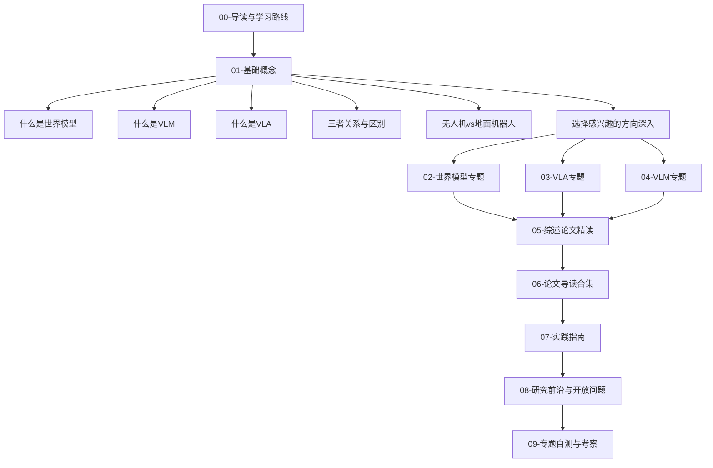

# UAV World Model & VLA & VLM Learning

<p align="center">
  <b>无人机领域的世界模型、视觉语言动作模型(VLA)、视觉语言模型(VLM) — 从认知到理解的完整学习项目</b>
</p>

<p align="center">
  
  
  
  
  
  
</p>

<p align="center">
  <a href="https://arxiv.org/abs/2605.00080"></a>
  <a href="https://github.com/NTUMARS/Awesome-World-Model-for-Robotics-Policy"></a>
  <a href="docs/00-导读与学习路线.md"></a>
</p>

<p align="center">
  <a href="#项目简介">简介</a> •
  <a href="#学习路线">学习路线</a> •
  <a href="#文档目录">目录</a> •
  <a href="#核心论文">论文</a> •
  <a href="#可运行代码">代码</a> •
  <a href="#引用">引用</a> •
  <a href="CONTRIBUTING.md">贡献</a>
</p>

---

<a id="项目简介"></a>

## 项目简介

> 当无人机学会"看"、"说"、"想"、"飞" — 它就不再只是飞行器，而是一个空中智能体。

本项目是一个**面向无人机领域的 VLA/VLM/世界模型综述学习项目**，基于以下核心参考资料：

- [arXiv:2605.00080](https://arxiv.org/abs/2605.00080) — *"World Model for Robot Learning: A Comprehensive Survey"*（43 页，6 图，2026 年最新综述）
- [NTUMARS/Awesome-World-Model-for-Robotics-Policy](https://github.com/NTUMARS/Awesome-World-Model-for-Robotics-Policy) — 机器人策略学习世界模型论文合集

**本项目的独特价值**：

| 维度 | 说明 |
|------|------|
| **聚焦无人机** | 不是通用机器人，专门针对 UAV/无人机领域的 VLA、VLM、世界模型 |
| **保姆级教学** | 每篇文档配有阅读时间、前置知识、核心内容、思考题与参考答案，适合零基础入门 |
| **认知优先，代码可选验证** | 主线是把原理、架构、演进脉络和论文思想讲清楚；关键结论另配**可运行的迷你 demo**（[`code/`](code/)），跑不跑都不影响阅读 |
| **系统化梳理** | 从基础概念到前沿论文，从理论到实践指南，完整学习路径 |
| **论文精读** | 81 篇关键论文逐条核对 arXiv 编号与标题，见 [`references/paper-list.md`](references/paper-list.md) |
| **结论可复跑** | 每个重要结论尽量附一条能重跑的验证路径；量不出来的地方**明说不作为结论** |

### 三大核心概念

```
VLM (视觉语言模型)          VLA (视觉语言动作模型)        World Model (世界模型)
"看图说话"                   "看图说话+动手"               "预测未来"
┌─────────────┐            ┌─────────────┐            ┌─────────────┐
│  图像 + 文本 │            │ 图像+文本+动作│            │ 当前状态+动作 │
│      ↓      │            │      ↓      │            │      ↓      │
│  理解/描述   │            │  理解+执行   │            │  预测下一状态 │
└─────────────┘            └─────────────┘            └─────────────┘
   "前方有障碍物"            "左转避开障碍物"             "左转后会看到什么"
```

---

<a id="学习路线"></a>

## 学习路线

建议按以下顺序阅读，每阶段约 1-2 周：


```mermaid
graph TD
    A[00-导读与学习路线] --> B[01-基础概念]
    B --> B1[什么是世界模型]
    B --> B2[什么是VLM]
    B --> B3[什么是VLA]
    B --> B4[三者关系与区别]
    B --> B5[无人机vs地面机器人]

    B --> C[选择感兴趣的方向深入]
    C --> D[02-世界模型专题]
    C --> E[03-VLA专题]
    C --> F[04-VLM专题]

    D --> G[05-综述论文精读]
    E --> G
    F --> G

    G --> H[06-论文导读合集]
    H --> I[07-实践指南]
    I --> J[08-研究前沿与开放问题]
    J --> K[09-专题自测与考察]
```

**推荐路径**：

- **快速入门**（1 周）：00-导读 → 01-基础概念（5 篇）→ 04-三者关系
- **深入方向**（2-3 周）：选择 02/03/04 中一个专题深入
- **综述精读**（2 周）：05-综述论文精读 + 06-论文导读
- **动手实践**（持续）：07-实践指南，按兴趣复现项目
- **科研入门**（持续）：08-研究前沿与开放问题，从学习者过渡到研究者
- **自测与考察**（随时，不必等前六阶段走完）：09-专题自测与考察，VLA / 世界模型 / VLM 三卷各一篇，读完哪一卷就做哪一篇，答不上来的顺着指针回读

---

<a id="文档目录"></a>

## 文档目录

[`docs/`](docs/) 下共 53 篇学习文档，另有 4 篇思维导图与 4 篇参考资料。推荐度：★ 必读 · ● 推荐 · ○ 了解。

### 导读

| 文档 | 内容 | 推荐度 |
|------|------|--------|
| [导读与学习路线](docs/00-导读与学习路线.md) | 项目定位、前置知识、七阶段学习路线、术语表 | ★ 必读 |

### Part 1 · 基础概念

| 文档 | 内容 | 推荐度 |
|------|------|--------|
| [什么是世界模型](docs/01-基础概念/01-什么是世界模型.md) | 定义、发展脉络、核心思想 | ★ 必读 |
| [什么是VLM](docs/01-基础概念/02-什么是VLM.md) | 视觉语言模型架构与训练 | ★ 必读 |
| [什么是VLA](docs/01-基础概念/03-什么是VLA.md) | 从VLM到VLA的演进 | ★ 必读 |
| [三者关系与区别](docs/01-基础概念/04-三者关系与区别.md) | VLM→VLA→世界模型关系图谱 | ★ 必读 |
| [无人机vs地面机器人](docs/01-基础概念/05-无人机vs地面机器人.md) | 无人机领域的特殊挑战 | ● 推荐 |

### Part 2 · 世界模型专题

| 文档 | 内容 | 推荐度 |
|------|------|--------|
| [世界模型发展史](docs/02-世界模型专题/01-世界模型发展史.md) | 从 Ha/Schmidhuber 到现代 | ★ 必读 |
| [生成式世界模型](docs/02-世界模型专题/02-生成式世界模型.md) | ANWM、AirScape、FlightDiffusion | ● 推荐 |
| [模型强化学习世界模型](docs/02-世界模型专题/03-模型强化学习世界模型.md) | Dreamer 系列、Dream to Fly | ● 推荐 |
| [3D场景世界模型](docs/02-世界模型专题/04-3D场景世界模型.md) | NeRF、3DGS 作为世界模型 | ○ 了解 |
| [无人机世界模型综述](docs/02-世界模型专题/05-无人机世界模型综述.md) | 无人机专属世界模型论文解读 | ● 推荐 |
| [关键数据集与基准](docs/02-世界模型专题/06-关键数据集与基准.md) | MotionScape、AeroVerse 等 | ○ 了解 |

### Part 3 · VLA 专题

| 文档 | 内容 | 推荐度 |
|------|------|--------|
| [VLA架构演进](docs/03-VLA专题/01-VLA架构演进.md) | 从 RT-2 到 2026 年：五个方向各自独立，按消融轴而非时间切 | ★ 必读 |
| [无人机VLA模型](docs/03-VLA专题/02-无人机VLA模型.md) | VLA-AN、CognitiveDrone、UAV-TrackVLA、AutoFly | ● 推荐 |
| [语言条件飞行控制](docs/03-VLA专题/03-语言条件飞行控制.md) | UAV-Flow、VLN-Pilot、2026 年两份空中 VLN 路线图 | ● 推荐 |
| [基础模型辅助规划](docs/03-VLA专题/04-基础模型辅助规划.md) | CoDrone、FM-Planner、NavFoM、FlyMirage | ○ 了解 |
| [机载部署与优化](docs/03-VLA专题/05-机载部署与优化.md) | 推理加速、边缘计算、动作年龄的下限而非均值 | ● 推荐 |
| [动作头与动作分块](docs/03-VLA专题/06-动作头与动作分块.md) | 离散 token → 回归 → 扩散 → 流匹配，以及分块长度怎么选 | ★ 必读 |
| [数据、预训练与跨具身](docs/03-VLA专题/07-数据、预训练与跨具身.md) | OXE/DROID、协同训练、潜在动作；飞行数据稀缺是第一约束 | ● 推荐 |
| [强化学习后训练与自我改进](docs/03-VLA专题/08-强化学习后训练与自我改进.md) | GRPO/PPO、奖励从哪来、自我改进飞轮与奖励钻空子 | ● 推荐 |
| [评测基准与报告口径](docs/03-VLA专题/09-评测基准与报告口径.md) | LIBERO→RoboArena、过程指标、均值/回合数/独立单元 | ● 推荐 |
| [世界模型增强VLA](docs/03-VLA专题/10-世界模型增强VLA.md) | 世界模型当数据源 / 策略的一部分 / 模拟器 / 评测代理，以及想象 rollout 的共同上限 | ● 推荐 |

### Part 4 · VLM 专题

| 文档 | 内容 | 推荐度 |
|------|------|--------|
| [遥感VLM](docs/04-VLM专题/01-遥感VLM.md) | GeoChat、RSGPT、SkySenseGPT | ● 推荐 |
| [无人机场景理解](docs/04-VLM专题/02-无人机场景理解.md) | UAVBench、BEDI 基准 | ○ 了解 |
| [LLM驱动的无人机Agent](docs/04-VLM专题/03-LLM驱动的无人机Agent.md) | CityNavAgent、ACDC 等 | ○ 了解 |
| [边缘VLM部署](docs/04-VLM专题/04-边缘VLM部署.md) | 轻量化、知识蒸馏、BLIP-2 | ○ 了解 |

### Part 5 · 综述论文精读

| 文档 | 内容 | 推荐度 |
|------|------|--------|
| [综述概览与结构](docs/05-综述论文精读/01-综述概览与结构.md) | arXiv:2605.00080 整体框架 | ★ 必读 |
| [世界模型作为策略](docs/05-综述论文精读/02-世界模型作为策略.md) | 综述第二部分精读 | ● 推荐 |
| [世界模型作为模拟器](docs/05-综述论文精读/03-世界模型作为模拟器.md) | 综述第三部分精读 | ● 推荐 |
| [视频生成世界模型](docs/05-综述论文精读/04-视频生成世界模型.md) | 综述第四部分精读 | ● 推荐 |
| [基准与评估](docs/05-综述论文精读/05-基准与评估.md) | 综述第五部分精读 | ○ 了解 |

### Part 6 · 论文导读合集

| 文档 | 内容 |
|------|------|
| [世界模型论文卡片](docs/06-论文导读合集/world-model-papers.md) | 13 篇世界模型关键论文逐篇解读 |
| [VLA论文卡片](docs/06-论文导读合集/vla-papers.md) | 11 篇 VLA 关键论文逐篇解读 |
| [VLM论文卡片](docs/06-论文导读合集/vlm-papers.md) | 12 篇 VLM 关键论文逐篇解读 |
| [基准与数据集论文](docs/06-论文导读合集/benchmark-papers.md) | 9 篇基准测试与数据集论文解读 |

### Part 7 · 实践指南

| 文档 | 内容 |
|------|------|
| [环境搭建](docs/07-实践指南/01-环境搭建.md) | CUDA、PyTorch、ROS2 环境配置 |
| [UAV-Flow 复现指南](docs/07-实践指南/02-复现指南-UAV-Flow.md) | 语言条件无人机控制 |
| [CognitiveDrone 复现指南](docs/07-实践指南/03-复现指南-CognitiveDrone.md) | 认知无人机 VLA 模型 |
| [FlightDiffusion 复现指南](docs/07-实践指南/04-复现指南-FlightDiffusion.md) | 扩散模型生成 FPV 视频 |
| [MotionScape 复现指南](docs/07-实践指南/05-复现指南-MotionScape.md) | 无人机视频数据集 |
| [GeoChat 复现指南](docs/07-实践指南/06-复现指南-GeoChat.md) | 遥感 VLM |
| [DreamerV3-Drone 复现指南](docs/07-实践指南/07-复现指南-DreamerV3-Drone.md) | 模型强化学习无人机飞行 |
| [可复现项目候选清单](docs/07-实践指南/08-可复现项目候选清单.md) | 22 个可单机复现的无人机 AI 项目 |
| [DeepDrone 复现指南](docs/07-实践指南/09-复现指南-DeepDrone.md) | LLM 自然语言控制无人机 |
| [RemoteCLIP 复现指南](docs/07-实践指南/10-复现指南-RemoteCLIP.md) | 遥感视觉语言基础模型 |
| [Flightmare 复现指南](docs/07-实践指南/11-复现指南-Flightmare.md) | 高保真无人机仿真器 |

### Part 8 · 研究前沿与开放问题

| 文档 | 内容 |
|------|------|
| [研究路线图](docs/08-研究前沿与开放问题/01-研究路线图.md) | 从学习到研究的五步法、FINER 标准 |
| [研究空白与机会](docs/08-研究前沿与开放问题/02-研究空白与机会.md) | 无人机 VLA/VLM/世界模型的开放问题 |
| [论文批判性阅读](docs/08-研究前沿与开放问题/03-论文批判性阅读.md) | CRITIC 方法、阅读笔记模板 |
| [最新进展与团队追踪](docs/08-研究前沿与开放问题/04-最新进展与团队追踪.md) | 浙大高飞团队、北航 Colab，2025–2026 进展与追踪方法 |

### Part 9 · 专题自测与考察

| 文档 | 内容 | 推荐度 |
|------|------|--------|
| [VLA专题自测](docs/09-专题自测与考察/01-VLA专题自测.md) | 三层考察（知识体系自测 / 高频考察点 / 前沿修正）+ 无人机专场 12 问；正文只给指针，末尾 3 道跨篇综合题带答案 | ● 推荐 |
| [世界模型专题自测](docs/09-专题自测与考察/02-世界模型专题自测.md) | 六篇各带一个动手验证，第三层把"加了那个东西反而更差"的三段实测单列出来；无人机专场 12 问 | ● 推荐 |
| [VLM专题自测](docs/09-专题自测与考察/03-VLM专题自测.md) | 遥感、空中场景理解、空中 Agent、机载部署四篇；第三层集中在量化与延迟两个被量反的说法上 | ● 推荐 |

### 思维导图 & 参考资料

| 文档 | 内容 |
|------|------|
| [领域全景图](mindmaps/field-overview.md) | VLA/VLM/世界模型全景关系图 |
| [世界模型分类学](mindmaps/world-model-taxonomy.md) | 世界模型分类体系 |
| [VLA演进路线](mindmaps/vla-evolution.md) | VLA 模型发展时间线 |
| [推荐阅读顺序](mindmaps/reading-order.md) | 论文阅读顺序建议 |
| [完整论文列表](references/paper-list.md) | 81 篇论文分类汇总，逐条核对 arXiv 编号与标题 |
| [自动追踪台账](references/vla-watch-2026-10.md) | 按专题分节的 arXiv 检索记录 |
| [Awesome List 注释](references/awesome-annotations.md) | 对 NTUMARS 仓库的补充 |
| [引用核查报告](references/citation-audit.md) | 全仓 arXiv 编号与标题的一致性核查 |
| [加粗密度实测](references/bold-density.md) | 正文段落加粗密度的逐篇实测，口径见 [`tools/bold_density.py`](tools/bold_density.py) |

---

<a id="核心论文"></a>

## 核心论文

「资源」列只收**已逐条访问确认可打开的**项目页与代码库，其余记 —（**不等于**没有代码）。
按此口径，下面 15 篇里 8 篇带得出来链接，7 篇是 —，而**这 7 篇全部落在无人机方向的论文**：
**空中方向的公开项目页，比地面方向稀疏得多**——这和下面「数据稀缺」一行是同一个约束的两种表现。

### 世界模型（无人机方向）

| 论文 | 年份 | 核心贡献 | arXiv | 资源 | 推荐度 |
|------|:---:|------|------|------|:---:|
| **ANWM** — Aerial World Model | 2025 | 航空导航世界模型，FFP 模块提供几何先验 | [2512.21887](https://arxiv.org/abs/2512.21887) | — | ★★★ |
| **Dream to Fly** | 2025 | DreamerV3 用于无人机竞速，ICRA 2026 | [2501.14377](https://arxiv.org/abs/2501.14377) | — | ★★★ |
| **FlightDiffusion** | 2025 | 扩散模型生成 FPV 视频用于策略学习 | [2509.14082](https://arxiv.org/abs/2509.14082) | — | ★★☆ |
| **MotionScape** | 2026 | 动作分层的无人机视频基准，用于世界建模与未来视频生成 | [2604.07991](https://arxiv.org/abs/2604.07991) | [代码](https://github.com/Thelegendzz/MotionScape) | ★★☆ |
| **AeroVerse** | 2024 | 航空航天世界模型基准套件 | [2408.15511](https://arxiv.org/abs/2408.15511) | — | ★★☆ |

### VLA（无人机方向）

| 论文 | 年份 | 核心贡献 | arXiv | 资源 | 推荐度 |
|------|:---:|------|------|------|:---:|
| **VLA-AN** | 2025 | 机载 VLA 框架，98.1% 成功率，8.3× 加速 | [2512.15258](https://arxiv.org/abs/2512.15258) | — | ★★★ |
| **CognitiveDrone** | 2025 | 认知无人机 VLA，实时 4D 动作输出 | [2503.01378](https://arxiv.org/abs/2503.01378) | [主页](https://cognitivedrone.github.io) | ★★★ |
| **UAV-TrackVLA** | 2026 | 基于 π₀.₅ 的无人机跟踪 VLA | [2604.02241](https://arxiv.org/abs/2604.02241) | [代码](https://github.com/Hub-Tian/UAV-Track_VLA) | ★★☆ |
| **UAV-Flow** | 2025 | 语言条件细粒度无人机控制基准 | [2505.15725](https://arxiv.org/abs/2505.15725) | [代码](https://github.com/buaa-colalab/UAV-Flow) | ★★☆ |
| **VLN-Pilot** | 2026 | VLM 作为室内无人机操作员 | [2602.05552](https://arxiv.org/abs/2602.05552) | — | ★★☆ |

### VLM（无人机 / 遥感方向）

| 论文 | 年份 | 核心贡献 | arXiv | 资源 | 推荐度 |
|------|:---:|------|------|------|:---:|
| **GeoChat** | 2024 | 首个遥感 VLM，CVPR 2024 | [2311.15826](https://arxiv.org/abs/2311.15826) | [代码](https://github.com/mbzuai-oryx/geochat) | ★★★ |
| **CoDrone** | 2025 | 云边端基础模型无人机导航 | [2512.19083](https://arxiv.org/abs/2512.19083) | — | ★★☆ |
| **FM-Planner** | 2025 | 基础模型路径规划，8 种 LLM/VLM 对比 | [2505.20783](https://arxiv.org/abs/2505.20783) | [代码](https://github.com/NTU-ICG/FM-Planner) | ★★☆ |
| **NavFoM** | 2025 | 跨形态导航基础模型，含无人机 | [2509.12129](https://arxiv.org/abs/2509.12129) | [主页](https://pku-epic.github.io/NavFoM-Web/) | ★★☆ |
| **UAVBench** | 2026 | 无人机 VLM 基准，966K 样本 | [2603.14336](https://arxiv.org/abs/2603.14336) | [主页](https://UAVBench.github.io/) | ★★☆ |

> 完整的 81 篇分类列表（含作者、会议/期刊、推荐等级）见 [`references/paper-list.md`](references/paper-list.md)。

---

<a id="关键挑战"></a>

## 无人机领域关键挑战

| 挑战 | 地面机器人 | 无人机 |
|------|-----------|--------|
| **动作空间** | 2D (x, y, θ) | 4D (roll, pitch, yaw, thrust) + 6-DoF |
| **安全约束** | 碰撞可恢复 | 坠机不可逆 |
| **视觉挑战** | 固定视角 | 快速视角变化、俯视/斜视、变高度 |
| **计算限制** | 可携带更多算力 | 严格机载算力限制 |
| **仿真难度** | 2.5D 运动 | 全 3D 动力学，sim-to-real 差距大 |
| **数据稀缺** | 大量公开数据集 | 无人机视角数据集稀缺 |
| **复现成本** | 桌面实验可快速迭代 | 真机评测昂贵，大样本评测难做 |

---

<a id="如何使用"></a>

## 如何使用

### 快速开始

1. 阅读 [00-导读与学习路线](docs/00-导读与学习路线.md) 了解整体结构
2. 从 [基础概念](docs/01-基础概念/) 开始建立认知框架
3. 选择感兴趣的方向深入（世界模型 / VLA / VLM）
4. 查阅 [论文导读合集](docs/06-论文导读合集/) 了解前沿工作
5. 按需参考 [实践指南](docs/07-实践指南/) 动手复现

### 推荐阅读顺序

```
第1周: 00-导读 → 01-基础概念(5篇) → 04-三者关系
第2周: 02-世界模型专题(6篇) 或 03-VLA专题(10篇)
第3周: 05-综述精读(5篇)
第4周: 06-论文导读(4篇) → 07-实践指南(按兴趣选)
持续: 08-研究前沿与开放问题 → 从学习者过渡到研究者
```

---

<a id="可运行代码"></a>

## 可运行代码（可选）

[`code/`](code/) 下 19 个脚本，**纯 CPU 即可**，合计约十七分钟，出图落在 [`figures/`](figures/)。
每个脚本只验证一件事，结论量不出来时会直接写明「不作为结论」。

| 脚本 | 验证的结论 |
|------|------|
| [Demo A：RSSM 世界模型](code/a_worldmodel_rssm.py) | 潜空间"想象"能多准地预测回报 |
| [Demo B：语言条件策略](code/b_lang_cond_policy.py) | 模仿损失低 ≠ 闭环飞得好 |
| [Demo C：动作头对比](code/c_action_heads.py) | MSE 回归塌到模态平均，扩散头能采样出两个模态 |
| [Demo D：团队追踪](code/d_track_papers.py) | 从 arXiv 号解析年月画研究时间线，可选联网核对元数据 |
| [Demo E：几何安全校正](code/e_gsc_safety.py) | 同一个过滤器，凸形障碍上把碰撞率压到 0，凹形上反而抬高 |
| [Demo F：外环延迟](code/f_control_loop.py) | 外环慢 1 秒，闭环跟踪误差从 12 cm 涨到 1.62 m |
| [Demo G：导航指标](code/g_eval_metrics.py) | 七个指标排出七套名次：动作 MSE 上随机策略与高增益几乎并列，换到偏航误差它又升到第二 |
| [Demo H：symlog 尺度统一](code/h_symlog.py) | 不加 symlog 时总体 MSE 更小，那是被大尺度组独占的假象 |
| [Demo I：Plücker 坐标](code/i_plucker.py) | 纯前向平移下中心射线严格不动，透视扩张全由边缘贡献 |
| [Demo J：体渲染 vs 溅射](code/j_render_cost.py) | 同一条前向合成公式，残差不随采样密度收敛，只随深度次序收敛 |
| [Demo K：物理残差先验](code/k_physics_prior.py) | 只对它写死的那几路管用；单步精度不等于长期精度 |
| [Demo L：ATE / RPE / SSIM / FID](code/l_seq_metrics.py) | 全局错位对齐后两个指标都归零；尺度慢漂移只有 ATE 看得见 |
| [Demo M：误差累积](code/m_exposure_bias.py) | 喂自己的输出后第 60 步误差是第 1 步的 1084 倍 |
| [Demo N：量化位宽](code/n_quant_bits.py) | 位宽不是均匀打折：基准波动就能淹掉高位量化的效应 |
| [Demo O：显存预算](code/o_budget.py) | 三项精确算术 + 一项实测，反解出九张表都没写的那个自变量 |
| [Demo P：分块提交长度](code/p_chunk_horizon.py) | 提交越长，基于旧状态开环执行越久，闭环误差越大 |
| [Demo Q：奖励加权后训练](code/q_rl_posttrain.py) | 奖励加权把坏数据的影响压掉三分之一（3.86 → 2.54 m），但压不到干净数据的 1.37 m |
| [Demo R：评测报告口径](code/r_eval_protocol.py) | 同一批回合，换汇总方式名次会翻转；独立单元从回合换成训练，区间宽 2.8 倍 |
| [Demo S：世界模型当数据源](code/s_wm_data_source.py) | 单步 0.0058 m 的模型开环 60 步放大 16.1 倍；想象数据先救的是训崩的种子，不是均值 |

完整对应表与运行说明见 [`code/README.md`](code/README.md)。

---

<a id="引用"></a>

## 引用

如果本项目对你的学习有帮助，欢迎引用：

```bibtex
@misc{uav-wm-vla-learning,
  title={UAV World Model \& VLA \& VLM Learning},
  author={Qxy661},
  year={2026},
  howpublished={\url{https://github.com/Qxy661/UAV-WM-VLA-Learning}},
  note={A comprehensive learning project for World Models, VLA, and VLM in the UAV domain}
}
```

---

<a id="致谢"></a>

## 致谢

- 感谢 [arXiv:2605.00080](https://arxiv.org/abs/2605.00080) 的作者们提供了高质量的综述
- 感谢 [NTUMARS/Awesome-World-Model-for-Robotics-Policy](https://github.com/NTUMARS/Awesome-World-Model-for-Robotics-Policy) 维护的 awesome list，本项目的条目标签与分节判据参考了它的组织方式
- 感谢所有被引用论文的作者们

---

<p align="center">
  <i>如果觉得有用，请给个 Star!</i>
</p>
