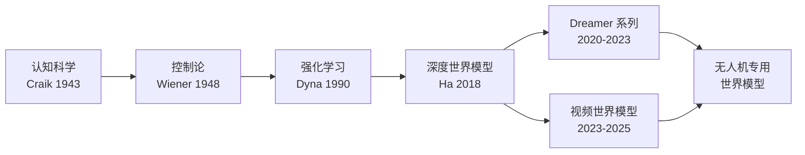
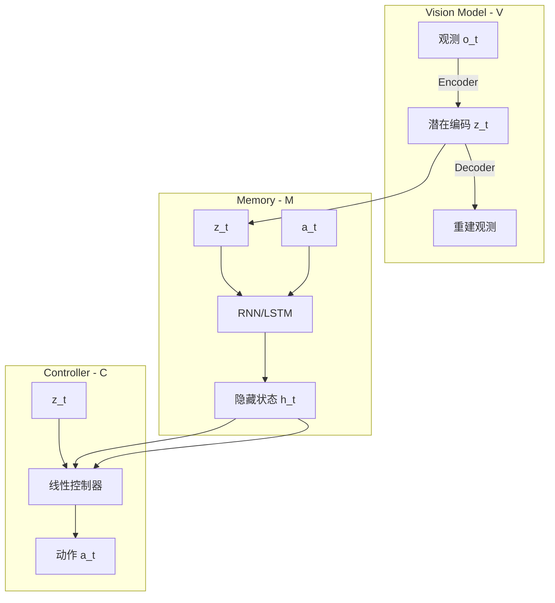
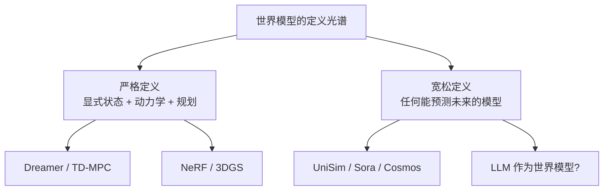
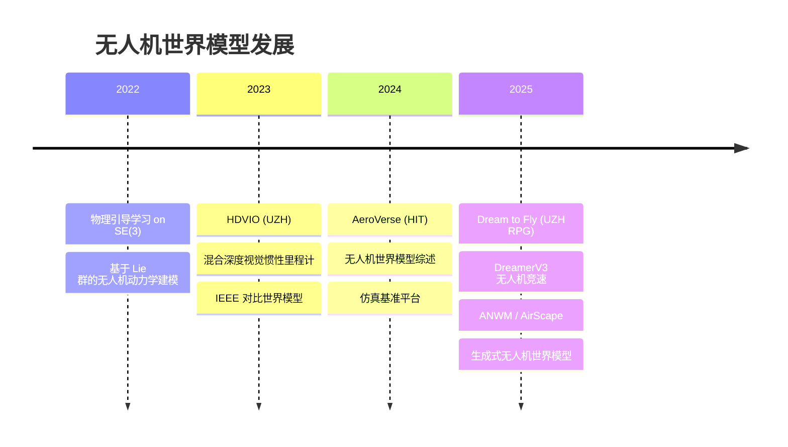

# 世界模型发展史：从 Ha/Schmidhuber 到视频世界模型

> **预计阅读：20 分钟 | 前置知识：深度学习基础、强化学习基本概念、VAE 原理**

---

## 1. 引言：什么是世界模型？

世界模型（World Model）是智能体对环境动态的内部表征。它允许智能体在"心智模拟"（mental simulation）中预测未来状态，从而在不与真实环境交互的情况下进行规划和决策。对于无人机系统而言，世界模型意味着 UAV 可以在脑海中"预演"飞行轨迹、预测障碍物运动、评估不同机动动作的后果，而无需真正执行这些动作。

这一概念最早可追溯到认知科学领域 Kenneth Craik (1943) 提出的"内部模型"假说，而在人工智能领域，其现代形式的发展始于 2018 年。



---

## 2. 前深度学习时代（1990-2017）

### 2.1 Dyna 架构（Sutton, 1990）

Richard Sutton 提出的 Dyna 架构是 Model-Based RL 的开山之作。Dyna 的核心思想极为优雅：智能体不仅从真实交互中学习，还利用学到的模型生成虚拟经验进行策略改进。

```
Dyna 循环：
1. 真实交互 → 更新策略
2. 模型学习 → 环境转移函数 T(s'|s,a) 和奖励函数 R(s,a)
3. 模型规划 → 从模型中采样虚拟经验 → 更新策略
```

Dyna 的局限在于它使用表格形式表示模型，无法处理高维连续状态空间。

### 2.2 线性动力学模型

在深度学习兴起之前，研究者使用线性动力学模型（如卡尔曼滤波、线性时变系统）来建模环境动态。这些方法在无人机的低层控制中有广泛应用（如 PX4 飞控中的 EKF），但在复杂视觉环境中表现有限。

### 2.3 瓶颈与挑战

| 挑战 | 描述 |
|------|------|
| 维度灾难 | 高维观测（如图像）难以用传统方法建模 |
| 复合误差 | 多步预测的误差累积导致模型不可用 |
| 泛化能力 | 模型难以泛化到未见过的状态 |
| 计算效率 | 实时规划需要高效的模型查询 |

---

## 3. 深度世界模型的诞生（2018）

### 3.1 Ha & Schmidhuber: "World Models"

2018 年，David Ha 和 Jürgen Schmidhuber 发表了里程碑式的论文 *"World Models"*，首次将 VAE 和 RNN 结合构建端到端的世界模型。这篇论文不仅在技术上有突破，更以其独特的风格（论文采用漫画叙事）引发了广泛关注。

**架构设计：**



**三大组件：**

| 组件 | 网络结构 | 功能 |
|------|---------|------|
| Vision (V) | Convolutional VAE | 将高维图像压缩为低维潜在编码 z |
| Memory (M) | MDN-RNN (混合密度网络 + LSTM) | 预测下一时刻的潜在状态分布 p(z_{t+1}\|z_t, a_t, h_t) |
| Controller (C) | 线性层 | 根据 z_t 和 h_t 输出动作 |

**关键创新：**

1. **潜在空间建模**：不在像素空间预测，而在 VAE 的潜在空间中预测，大幅降低计算复杂度
2. **混合密度网络 (MDN)**：用高斯混合模型建模状态转移的概率分布，处理环境的随机性
3. **在"梦境"中训练**：智能体完全在模型生成的虚拟轨迹中训练策略，无需真实环境交互

**实验成果：**

在 VizDoom 和 Car Racing 两个环境中，Ha 的世界模型实现了：
- Car Racing：完全在梦境中训练的策略获得了平均 906 分（满分 1000）
- VizDoom：在梦境中训练的策略在真实环境中表现良好

**局限性：**
- MDN-RNN 在长期预测中容易出现误差累积
- 梦境训练存在"模型利用"（model exploitation）问题：策略可能找到模型中的漏洞
- 仅在简单环境中验证

### 3.2 同期工作：PlaNet

Danijar Hafner 等人在 2019 年初提出了 **PlaNet**（Deep Planning Network），进一步推进了深度世界模型的研究。PlaNet 引入了：

- **循环状态空间模型 (RSSM)**：结合确定性路径和随机性路径，更准确地建模环境动态
- **潜在动态预测**：在潜在空间中进行多步预测
- **CEM 规划**：使用交叉熵方法 (Cross-Entropy Method) 在模型中搜索最优动作序列

PlaNet 的 RSSM 架构成为后续 Dreamer 系列的基础。

---

## 4. Dreamer 系列：世界模型的三次飞跃（2020-2023）

Dreamer 系列由 Danijar Hafner 领导，是世界模型研究最具影响力的系列工作，每一版都在架构设计和训练范式上有重大突破。

### 4.1 DreamerV1（2020）

**论文：** *"Dream to Control: Learning Behaviors by Latent Imagination"*（ICLR 2020）

DreamerV1 在 PlaNet 的基础上增加了**行为学习**模块，实现了端到端的"想象-决策"流水线。

**核心架构：**

```mermaid
graph TB
    subgraph 世界模型 World Model
        A[观测 o_t] -->|CNN Encoder| B[潜在状态 s_t]
        B -->|RSSM| C[s_{t+1} 预测]
        C -->|Reward Head| D[奖励预测 r_t]
        C -->|Continue Head| E[终止预测 c_t]
        C -->|Decoder| F[观测重建]
    end

    subgraph Actor-Critic
        C -->|想象轨迹| G[Actor 网络]
        G --> H[动作 a_t]
        C -->|想象轨迹| I[Critic 网络]
        I --> J[价值估计 V]
    end

    J -->|梯度更新| G
```

**RSSM 的双路径设计：**

| 路径 | 功能 | 优势 |
|------|------|------|
| 确定性路径 h_t | GRU 递归更新，捕捉时序依赖 | 短期预测准确 |
| 随机路径 s_t | 随机变量，建模环境不确定性 | 处理多模态未来 |
| 融合 | h_t 和 s_t 拼接作为完整状态 | 兼顾确定性与随机性 |

**关键成果：**
- 在 DeepMind Control Suite 的 20 个连续控制任务中，平均性能超过 model-free 方法（如 D4PG）
- 在 Atari 100k 基准上，仅用 100k 环境步数就达到人类水平的 50% 任务
- 首次证明纯想象训练（imagination training）可以在复杂任务中产生有效策略

### 4.2 DreamerV2（2021）

**论文：** *"Mastering Atari with Discrete World Models"*（ICLR 2022）

DreamerV2 的核心创新是**离散化表征**，用分类分布（categorical distribution）替代连续高斯分布。

**架构改进：**

```
DreamerV1: s_t ~ N(μ, σ²)      # 连续高斯分布
DreamerV2: s_t ~ Cat(K=32, N=32)  # 32 个类别，每类 32 个 bins
```

**离散表征的优势：**

| 方面 | 连续表征 (V1) | 离散表征 (V2) |
|------|-------------|-------------|
| 模式覆盖 | 容易模式坍缩 | 更好的多样性 |
| 多模态建模 | 困难 | 自然支持 |
| 计算效率 | 需要重参数化 | 直接采样 |
| 与 Transformer 兼容性 | 较差 | 天然兼容 |

**突破性成果：**
- 在 Atari 200M 基准上，首次以世界模型方法超越人类中位数水平
- 在 DeepMind Control Suite 上无需任何超参数调整即可工作
- 证明离散表征在世界模型中的优越性

### 4.3 DreamerV3（2023）

**论文：** *"Mastering Diverse Domains through World Models"*（arXiv 2023）

DreamerV3 是该系列的巅峰之作，实现了**单一算法、固定超参数**跨域泛化。

**核心创新：**

1. **Symlog 预测**：对观测和奖励使用对称对数变换，统一不同尺度的信号
2. **自由比特正则化 (Free Bits)**：防止 KL 散度崩溃为零，确保表征的信息量
3. **比例不变的优化**：使用 Adam 优化器的改进版本，自动适应不同尺度的梯度

```python
# Symlog 变换（概念代码）
def symlog(x):
    return torch.sign(x) * torch.log(1 + torch.abs(x))

def symexp(x):
    return torch.sign(x) * (torch.exp(torch.abs(x)) - 1)
```

**DreamerV3 的统一能力：**

| 领域 | 任务数 | 表现 |
|------|--------|------|
| DeepMind Control | 28 | 全部达到 SOTA |
| Atari | 55 | 超越人类中位数 |
| Minecraft | 探索 + 攻击 | 从零开始收集钻石 |
| 网页导航 | MiniWoB++ | 首次以世界模型方法完成 |
| 机器人操作 | 12 个任务 | 泛化到新物体和场景 |

**对无人机研究的启示：**

DreamerV3 的跨域能力使其成为无人机世界模型的有力候选。其固定超参数特性意味着无需针对每个飞行场景单独调参，这对 UAV 应用尤为重要——不同任务（悬停、跟踪、避障）的动力学差异巨大。

---

## 5. TD-MPC 系列：模型预测控制的复兴（2022-2023）

### 5.1 TD-MPC（2022）

**论文：** *"Temporal Difference Learning for Model Predictive Control"*（ICML 2022）

TD-MPC 由 Nicklas Hansen 等人提出，将时序差分学习（TD Learning）与模型预测控制（MPC）结合。

**核心思路：**

```
传统 MPC: 学习环境模型 → 在模型中规划 → 执行最优动作
TD-MPC:   学习编码器 + 环境模型 + 价值函数 → 在潜在空间中 MPC 规划
```

**关键组件：**

| 组件 | 作用 |
|------|------|
| Encoder h(o) | 将观测编码为潜在状态 |
| Latent Dynamics Model d(z, a) | 预测下一状态 |
| Reward Prediction r(z, a) | 预测即时奖励 |
| Terminal Value Q(z, a) | 估计长期价值（TD 目标） |

**TD-MPC 的独特之处：**

- 不需要解码器：不重建观测，只关注对决策有用的信息
- 联合训练：编码器、动态模型和价值函数联合优化
- CEM 规划：在潜在空间中使用交叉熵方法搜索最优动作序列

### 5.2 TD-MPC2（2023）

**论文：** *"Scaling Temporal Difference Learning for World Models"*

TD-MPC2 将 TD-MPC 扩展到：
- 104 个任务（跨 DMControl、Meta-World、ManiSkill2、MyoSuite）
- 单一模型处理多个任务
- 参数量从 1M 扩展到 300M+

---

## 6. 视频世界模型的崛起（2023-2025）

随着视频生成模型的快速发展，一种全新的世界模型范式出现了——直接学习视频帧的生成模型，将其作为隐式的世界模型。

### 6.1 UniSim（2023）

**论文：** *"Learning Interactive Real-World Simulators"*（Google DeepMind, 2023）

UniSim 的核心理念：**视频生成模型就是世界模型**。


**关键特性：**
- 基于扩散模型（Diffusion Model）的视频预测
- 支持文本和动作条件控制
- 可以模拟真实世界的物理交互
- 用于机器人策略的离线训练

### 6.2 Cosmos（NVIDIA, 2025）

NVIDIA 的 Cosmos 项目将世界模型定位为**物理世界的基础模拟器**：

- 大规模视频预训练
- 物理一致性约束
- 面向机器人和自动驾驶的应用
- 支持多种条件控制（文本、动作、深度图等）

### 6.3 Sora 与世界模型的讨论

OpenAI 的 Sora（2024）引发了关于"视频生成模型是否是世界模型"的广泛讨论：

**支持观点：**
- Sora 能够生成物理上大致合理的视频
- 隐式建模了物体运动、光照变化等物理规律
- 可以作为模拟器的替代

**反对观点：**
- 缺乏精确的物理推理能力
- 无法保证长期一致性
- 没有显式的状态表征，难以进行精确规划



---

## 7. 世界模型发展时间线

| 年份 | 里程碑 | 核心贡献 | 影响 |
|------|--------|---------|------|
| 1990 | Dyna | 模型辅助强化学习 | 奠定 Model-Based RL 理论基础 |
| 2018 | World Models (Ha) | VAE + RNN + Controller | 首个端到端深度世界模型 |
| 2019 | PlaNet | RSSM + CEM 规划 | 潜在空间规划范式 |
| 2020 | DreamerV1 | RSSM + Actor-Critic 想象训练 | 世界模型可用于行为学习 |
| 2021 | DreamerV2 | 离散表征 | 在 Atari 上超越人类 |
| 2022 | TD-MPC | TD + MPC 联合 | 更高效的规划范式 |
| 2023 | DreamerV3 | 跨域统一算法 | 固定超参数泛化所有领域 |
| 2023 | UniSim | 视频扩散世界模型 | 视频生成 = 世界模型？ |
| 2024 | Sora | 大规模视频生成 | 引发世界模型定义讨论 |
| 2024 | Cosmos (NVIDIA) | 物理世界模拟器 | 面向机器人和自动驾驶 |
| 2024 | TD-MPC2 | 规模化 TD-MPC | 单一模型跨 104 任务 |

---

## 8. 无人机领域的世界模型发展

世界模型在 UAV 领域的应用相对较新，但发展迅速：



**无人机世界模型的独特挑战：**

| 挑战 | 与通用世界模型的区别 |
|------|---------------------|
| 6-DoF 运动 | 需要在 SE(3) 群上建模，不仅仅是 2D 平面 |
| 快速动态 | 无人机运动速度快，需要高频预测 |
| 感知-动作耦合 | 视觉输入与飞行控制紧密耦合 |
| 安全约束 | 不可行的预测可能导致坠机 |
| 计算资源 | 机载计算能力有限 |
| 环境多样性 | 室内外、城市森林、不同光照条件 |

---

## 9. 世界模型的分类体系

根据不同的维度，世界模型可以进行如下分类：

### 9.1 按表征方式分类

| 类型 | 代表方法 | 优势 | 劣势 |
|------|---------|------|------|
| 潜在状态模型 | Dreamer, TD-MPC | 紧凑、高效 | 可能丢失视觉细节 |
| 视频预测模型 | UniSim, Sora | 丰富视觉信息 | 计算成本高 |
| 3D 场景表示 | NeRF, 3DGS | 几何精确 | 难以建模动态物体 |
| 符号/结构化模型 | 场景图 | 可解释性强 | 难以端到端学习 |

### 9.2 按训练范式分类

| 类型 | 代表方法 | 特点 |
|------|---------|------|
| 无监督学习 | VAE-based | 学习环境的压缩表征 |
| 监督学习 | 视频预测 | 直接预测未来观测 |
| 强化学习集成 | Dreamer, TD-MPC | 世界模型与策略联合优化 |
| 基础模型 | Cosmos, UniSim | 大规模预训练，下游适配 |

---

## 10. 关键论文列表

| 论文 | 作者 | 年份 | 会议/平台 | 关键词 |
|------|------|------|----------|--------|
| World Models | Ha & Schmidhuber | 2018 | NeurIPS | VAE + RNN, 梦境训练 |
| Learning Latent Dynamics | Hafner et al. | 2019 | ICML (PlaNet) | RSSM, CEM 规划 |
| Dream to Control | Hafner et al. | 2020 | ICLR (DreamerV1) | RSSM + Actor-Critic |
| Mastering Atari | Hafner et al. | 2022 | ICLR (DreamerV2) | 离散表征 |
| Mastering Diverse Domains | Hafner et al. | 2023 | arXiv (DreamerV3) | 跨域泛化 |
| TD-MPC | Hansen et al. | 2022 | ICML | TD + MPC |
| TD-MPC2 | Hansen et al. | 2023 | arXiv | 规模化 |
| UniSim | Yang et al. | 2023 | arXiv | 视频扩散世界模型 |
| Sora | OpenAI | 2024 | 技术报告 | 大规模视频生成 |
| Cosmos | NVIDIA | 2025 | 技术报告 | 物理世界模拟 |

---

## 11. 延伸阅读

- [02-生成式世界模型](./02-生成式世界模型.md) — 生成式世界模型在无人机中的应用
- [03-模型强化学习世界模型](./03-模型强化学习世界模型.md) — Dreamer 系列详解及无人机竞速应用
- [04-3D场景世界模型](./04-3D场景世界模型.md) — NeRF 和 3DGS 作为世界模型
- [05-无人机世界模型综述](./05-无人机世界模型综述.md) — 无人机专用世界模型的全景综述
- [06-关键数据集与基准](./06-关键数据集与基准.md) — 评估世界模型的基准与数据集

---

## 12. 思考题

### 题目 1：潜在状态 vs. 视频预测

Dreamer 系列使用潜在状态模型（latent state model），而 UniSim 使用视频预测模型。分析这两种范式在无人机应用中的优劣。

<details>
<summary>参考答案</summary>

**潜在状态模型（Dreamer 风格）的优势：**
- 计算高效：潜在空间维度远低于像素空间，规划速度更快
- 适合机载部署：模型体积小，可在嵌入式设备运行
- 端到端优化：状态表征直接为决策服务，不浪费容量在无关细节上

**潜在状态模型的劣势：**
- 视觉信息损失：压缩可能丢失对安全关键的细节（如细小障碍物）
- 难以与人类交互：无法直接可视化预测结果

**视频预测模型（UniSim 风格）的优势：**
- 信息丰富：保留完整的视觉信息
- 可与预训练视觉模型结合：利用大规模视觉基础模型
- 可解释性：预测结果直观可理解

**视频预测模型的劣势：**
- 计算成本高：视频生成需要大量算力，难以机载实时运行
- 物理一致性：可能生成视觉上合理但物理上不可行的场景
- 长期预测：误差累积在像素空间更严重

**无人机应用的权衡：**
- 对于实时避障：潜在状态模型更合适（需要快速规划）
- 对于任务预览/调试：视频预测模型更有用（可视化效果好）
- 混合方案可能是最优解：用潜在状态做实时规划，用视频预测做离线验证
</details>

### 题目 2：DreamerV3 的跨域能力

DreamerV3 使用固定超参数在多个领域取得 SOTA。分析 Symlog 变换和自由比特正则化如何实现这一成就。

<details>
<summary>参考答案</summary>

**Symlog 变换的作用：**
- 不同任务的奖励和观测尺度差异巨大（Atari 奖励 0-100，DMControl 奖励 0-1000，Minecraft 更大）
- Symlog: f(x) = sign(x) * log(1 + |x|) 将任意尺度压缩到对称范围
- 逆变换 Symexp 恢复原始尺度
- 效果：网络输出层不需要针对不同任务调整，统一了优化难度

**自由比特正则化的作用：**
- 问题：KL 散度项在总损失中占比不当可能导致两个问题
  - 过大：表征被压缩到先验，丢失信息（posterior collapse）
  - 过小：表征过于复杂，过拟合
- 自由比特：设定 KL 散度的最小值（如 1 nat/维度），低于此值时不施加 KL 惩罚
- 效果：确保每个潜在维度至少编码一定量信息，防止信息丢失

**两者的协同：**
- Symlog 统一了损失函数的尺度
- 自由比特确保表征的信息量
- 两者共同使得单一超参数配置适应不同领域的不同信号尺度和信息密度
</details>

### 题目 3：视频生成模型是否是世界模型？

围绕 Sora 等视频生成模型是否构成"世界模型"展开讨论，结合无人机应用场景给出你的观点。

<details>
<summary>参考答案</summary>

**正方观点（视频生成是世界模型）：**
- 世界模型的核心功能是"预测未来状态"，视频生成模型正是如此
- 大规模视频预训练隐式学习了物理规律（重力、碰撞、运动学）
- 可以作为训练数据生成器（sim-to-real 的新范式）
- 不需要显式物理引擎即可产生物理上大致合理的预测

**反方观点（视频生成不是世界模型）：**
- 世界模型的关键是"可控性"和"一致性"，视频生成模型缺乏保证
- 无法进行精确的状态估计和规划（如：精确的 6-DoF 位姿）
- 物理一致性是"学到的"而非"保证的"，可能在分布外失败
- 无人机安全关键应用需要可验证的模型

**对无人机的具体分析：**
- 任务规划层：视频世界模型可以用于粗粒度的任务预演
- 运动规划层：需要精确的状态预测，视频模型不够
- 控制层：需要精确的动力学模型，视频模型完全不适用
- 结论：视频世界模型可以作为辅助工具，但不能替代结构化的动力学世界模型

**折中观点：**
- "世界模型"是一个光谱，不是二元分类
- 视频生成模型是"弱世界模型"，在某些维度（视觉真实性）上强，在其他维度（精确可控性）上弱
- 未来方向：将视频生成与结构化状态表征结合
</details>

### 题目 4：RSSM 设计选择

分析 Dreamer RSSM 中确定性路径和随机性路径各自的作用。如果去掉其中一个会怎样？

<details>
<summary>参考答案</summary>

**确定性路径（GRU h_t）的作用：**
- 捕捉时序依赖和序列模式
- 提供稳定的隐状态，作为随机路径的"锚点"
- 类似于 RNN 的记忆功能
- 适合建模可预测的环境动态

**随机性路径（s_t）的作用：**
- 建模环境的内在随机性（如对手行为、环境噪声）
- 支持多模态预测（未来有多种可能）
- 提供不确定性估计（可用于探索）
- 防止确定性路径过拟合单一轨迹

**去掉确定性路径（纯随机模型）：**
- 失去时序记忆能力
- 多步预测退化为独立的单步预测
- 类似于非递归的 VAE，无法建模长程依赖

**去掉随机性路径（纯确定性模型）：**
- 无法建模多模态未来
- 预测结果趋向"平均"（blurry predictions）
- 在随机环境中表现极差
- 类似于确定性 RNN，容易在分布外失败

**双路径的协同效应：**
- 确定性路径处理"可预测的部分"（如惯性、重力）
- 随机性路径处理"不可预测的部分"（如风扰动、其他智能体行为）
- 两者融合提供准确且鲁棒的状态预测
</details>

---

> **下一篇：** [02-生成式世界模型](./02-生成式世界模型.md) -- 了解生成式世界模型如何为无人机创建逼真的飞行场景预测。
