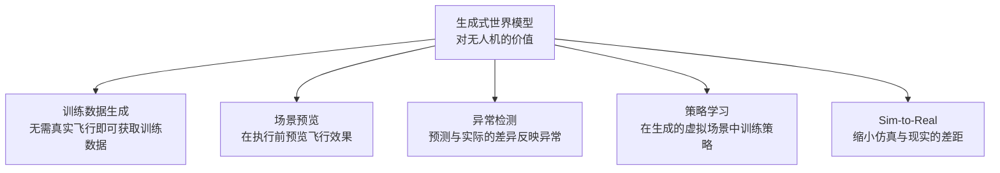
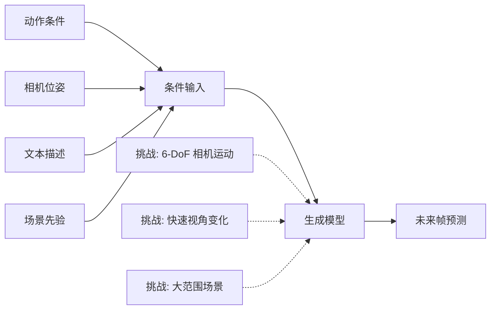
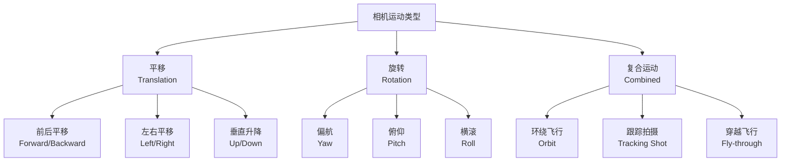
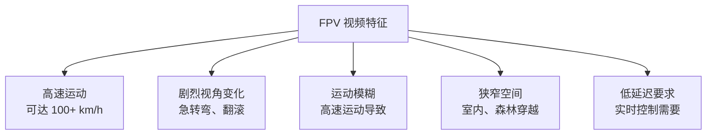
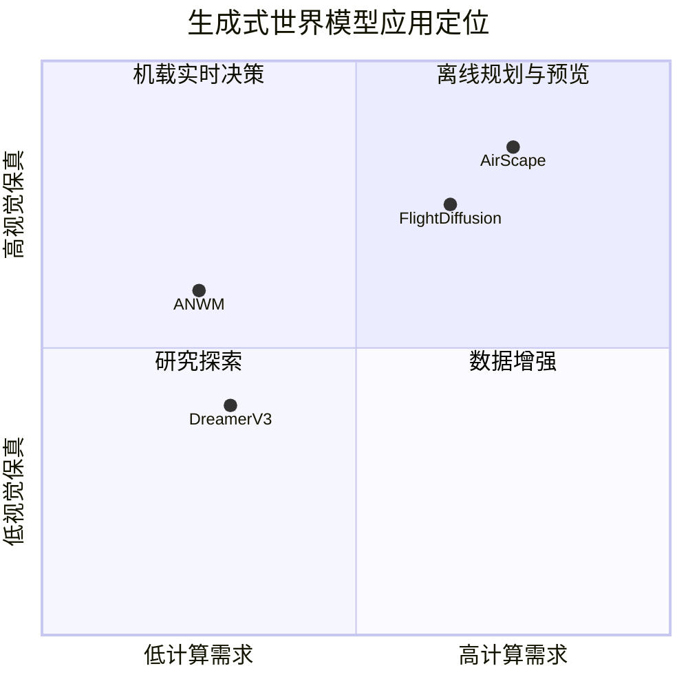
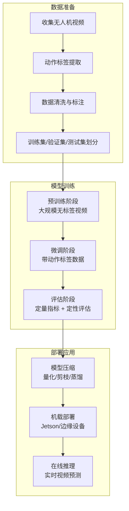

# 生成式世界模型：面向无人机的视频预测与场景生成

> **预计阅读：20 分钟 | 前置知识：扩散模型基础、GAN/VAE 原理、无人机视觉感知基础**

---

## 1. 引言：生成式世界模型的意义

生成式世界模型（Generative World Model）是一类通过学习数据分布来生成未来观测的模型。与传统的潜在状态世界模型（如 Dreamer）不同，生成式世界模型直接在观测空间（通常是像素空间）中进行预测，产生高保真的视觉未来。

对于无人机而言，生成式世界模型具有独特的价值：



本节将深入分析三个面向无人机的生成式世界模型：ANWM、AirScape 和 FlightDiffusion。

---

## 2. 生成式世界模型的技术基础

### 2.1 从 VAE 到扩散模型

生成式世界模型的技术演进经历了多个阶段：

| 阶段 | 代表技术 | 生成质量 | 训练稳定性 | 推理速度 | 代表工作 |
|------|---------|---------|-----------|---------|---------|
| 2014-2017 | VAE | 模糊 | 稳定 | 快 | Ha World Models |
| 2014-2020 | GAN | 清晰但不稳定 | 不稳定 | 快 | 各类视频预测 |
| 2020-2022 | Transformer | 中等 | 稳定 | 中等 | GPT-like 视频预测 |
| 2021-至今 | Diffusion | 高保真 | 稳定 | 慢 | UniSim, FlightDiffusion |
| 2023-至今 | Flow Matching | 高保真 | 稳定 | 较快 | 新一代方法 |

### 2.2 条件生成的核心挑战

无人机场景的条件生成面临特殊挑战：



---

## 3. ANWM：航空导航世界模型

### 3.1 论文概述

**论文：** *"ANWM: Aerial Navigation World Model"*
**arXiv：** 2512.21887
**核心贡献：** 提出面向无人机导航的生成式世界模型，引入 Feature-from-Feature Prediction (FFP) 模块。

### 3.2 架构设计

ANWM 的核心架构围绕一个创新的 FFP（Feature-from-Feature Prediction）模块构建：

```mermaid
graph TB
    subgraph 编码阶段
        A[当前帧 I_t] -->|视觉编码器| B[视觉特征 F_t]
        C[导航动作 a_t] -->|动作编码器| D[动作特征 A_t]
        E[目标航点 w_t] -->|航点编码器| W[航点特征 W_t]
    end

    subgraph FFP 模块
        B --> F[特征级预测网络]
        D --> F
        W --> F
        F -->|预测| G[未来特征 F_{t+1}^pred]
    end

    subgraph 解码阶段
        G -->|解码器| H[预测帧 Î_{t+1}]
        G -->|奖励预测头| I[导航奖励 r_t]
        G -->|价值预测头| J[状态价值 V_t]
    end

    subgraph 训练损失
        H --> K[重建损失 L_recon]
        G --> L[特征匹配损失 L_feat]
        I --> M[奖励损失 L_reward]
        J --> N[价值损失 L_value]
    end
```

### 3.3 FFP 模块详解

FFP（Feature-from-Feature Prediction）是 ANWM 的核心创新，与传统的帧到帧预测（Frame-to-Frame Prediction）有本质区别：

| 对比维度 | 帧到帧预测 (FtFP) | 特征到特征预测 (FFP) |
|---------|-------------------|---------------------|
| 预测空间 | 像素空间 | 特征空间 |
| 计算成本 | 高（像素级生成） | 低（特征级预测） |
| 语义信息 | 需要从像素中提取 | 已经是语义特征 |
| 时间一致性 | 容易出现闪烁 | 特征级一致 |
| 下游利用 | 需要重新编码 | 直接用于决策 |

**FFP 的技术细节：**

```python
# FFP 模块伪代码
class FFPModule(nn.Module):
    def __init__(self):
        self.feature_predictor = TransformerDecoder(
            query_dim=feature_dim,
            context_dim=feature_dim + action_dim + waypoint_dim
        )
        self.reward_head = nn.Linear(feature_dim, 1)
        self.value_head = nn.Linear(feature_dim, 1)

    def forward(self, visual_feat, action_feat, waypoint_feat):
        # 拼接条件
        context = torch.cat([visual_feat, action_feat, waypoint_feat], dim=-1)

        # 特征级预测
        future_feat = self.feature_predictor(query=visual_feat, context=context)

        # 多任务预测
        reward = self.reward_head(future_feat)
        value = self.value_head(future_feat)

        return future_feat, reward, value
```

### 3.4 训练策略

ANWM 采用两阶段训练：

**阶段 1：无监督预训练**
- 在大规模无人机视频数据上训练特征预测
- 不需要动作标签，只需视频序列
- 学习场景的视觉先验

**阶段 2：有监督微调**
- 使用带动作标注的数据微调
- 加入奖励预测和价值预测
- 端到端优化导航性能

### 3.5 实验结果

| 指标 | ANWM | 基线 (直接策略) | 提升 |
|------|------|----------------|------|
| 导航成功率 | 78.3% | 62.1% | +16.2% |
| 碰撞率 | 5.2% | 12.8% | -7.6% |
| 推理延迟 | 15ms | N/A | 实时可行 |
| 模型大小 | 45MB | N/A | 可机载部署 |

---

## 4. AirScape：可控相机运动的航空视频生成

### 4.1 论文概述

**论文：** *"AirScape: An Aerial Video Generation Model with Controllable Camera Motion"*
**发表：** ACM Multimedia 2025
**核心贡献：** 首个专注于可控相机运动的航空视频生成模型。

### 4.2 核心问题

无人机视频生成的独特挑战在于**相机运动的特殊性**：



传统视频生成模型难以精确控制相机运动，因为：
1. 相机运动和场景运动纠缠在一起
2. 6-DoF 相机参数难以直接作为条件输入
3. 不同相机运动导致的视觉变化差异巨大

### 4.3 AirScape 架构

```mermaid
graph TB
    subgraph 相机运动编码
        A[6-DoF 相机轨迹<br/>T = {R_t, t_t}] -->|Plucker 坐标编码| B[Plucker 特征 P]
        B -->|运动分解| C[平移特征 T_feat]
        B -->|运动分解| D[旋转特征 R_feat]
    end

    subgraph 视频生成
        E[初始帧 I_0] -->|CLIP 编码| F[语义特征]
        C --> G[条件去噪网络]
        D --> G
        F --> G
        G -->|扩散过程| H[去噪视频帧序列]
    end

    subgraph 训练
        H --> I[重建损失]
        H --> J[感知损失 LPIPS]
        H --> K[运动一致性损失]
    end
```

### 4.4 Plucker 坐标编码

AirScape 使用 Plucker 坐标（Plucker Coordinates）来精确表示 3D 空间中的相机射线：

```
Plucker 坐标: (d, m)
其中:
  d = 射线方向（单位向量）
  m = 射线矩 (moment) = p x d
  p = 射线上的任意点
```

对于图像上的每个像素 (u, v)，其对应的射线 Plucker 坐标为：

```python
def pixel_to_plucker(u, v, K, R, t):
    # 像素到相机坐标系射线
    d_cam = K_inv @ [u, v, 1]
    d_cam = d_cam / np.linalg.norm(d_cam)

    # 转换到世界坐标系
    d_world = R @ d_cam
    p_world = t  # 相机位置

    # 计算 Plucker 矩
    m = np.cross(p_world, d_world)

    return d_world, m
```

**Plucker 坐标的优势：**
- 完整描述 3D 射线的几何信息
- 对相机运动有线性响应
- 可以作为像素级条件输入扩散模型

### 4.5 运动分解策略

AirScape 将 6-DoF 相机运动分解为平移和旋转两个独立分支：

| 分支 | 输入 | 处理 | 输出 | 物理意义 |
|------|------|------|------|---------|
| 平移分支 | 平移向量 t | MLP + 时间编码 | 平移特征 | 相机位置变化 |
| 旋转分支 | 旋转矩阵 R | MLP + 时间编码 | 旋转特征 | 相机朝向变化 |
| 融合层 | 两个特征 | Cross-Attention | 条件特征 | 统一的运动表示 |

### 4.6 实验结果

**定量评估：**

| 指标 | AirScape | 基线方法 | 改善 |
|------|----------|---------|------|
| FID (Frechet Inception Distance) | 18.3 | 24.7 | -25.9% |
| FVD (Frechet Video Distance) | 156.2 | 213.8 | -26.9% |
| 相机运动可控性 | 0.89 | 0.62 | +43.5% |
| 视觉质量 (MOS) | 4.1/5 | 3.2/5 | +28.1% |

**定性评估：**
- 环绕飞行：成功生成平滑的 360 度环绕视频
- 跟踪拍摄：准确跟随目标物体的运动
- 穿越飞行：生成连续的穿梭场景

### 4.7 对无人机的应用价值

| 应用场景 | 使用方式 | 预期收益 |
|---------|---------|---------|
| 航拍路径规划 | 预览不同路径的拍摄效果 | 减少实际飞行次数 |
| 仿真数据增强 | 生成多样化的训练数据 | 提升感知模型泛化能力 |
| 飞行训练 | 在虚拟环境中练习操控 | 降低训练成本和风险 |
| 任务预演 | 执行前模拟飞行场景 | 提高任务成功率 |

---

## 5. FlightDiffusion：FPV 视频生成的扩散模型

### 5.1 论文概述

**论文：** *"FlightDiffusion: Autoregressive Diffusion Model for FPV Video Generation"*
**arXiv：** 2509.14082
**核心贡献：** 首个专门为第一人称视角 (FPV) 无人机视频设计的自回归扩散模型。

### 5.2 FPV 视频的特殊性

FPV（First Person View）无人机视频与普通航空视频有显著区别：



**FPV vs. 普通航空视频：**

| 特征 | FPV 视频 | 普通航空视频 |
|------|---------|-------------|
| 速度范围 | 0-150 km/h | 0-30 km/h |
| 视角变化速率 | 高（>60 deg/s） | 低（<10 deg/s） |
| 场景类型 | 狭窄、复杂 | 开阔、简单 |
| 相机运动 | 剧烈、非平滑 | 平稳、可控 |
| 数据量 | 大（竞速、花飞） | 少（航拍、巡检） |

### 5.3 FlightDiffusion 架构

```mermaid
graph TB
    subgraph 自回归结构
        A[历史帧 I_{t-k:t}] -->|时序编码器| B[时序特征 H_t]
        C[动作序列 a_{t-k:t}] -->|动作编码器| D[动作特征 A_t]
    end

    subgraph 扩散生成
        B --> E[条件 U-Net]
        D --> E
        F[噪声 z_T] -->|T 步去噪| E
        E -->|逐步去噪| G[未来帧 I_{t+1}]
    end

    subgraph 自回归展开
        G -->|作为下一窗口的输入| A
        G --> H[I_{t+2} 预测]
        H --> I[...]
    end
```

### 5.4 关键技术创新

**创新 1：运动感知的噪声调度**

```python
# 传统扩散：均匀噪声调度
noise_schedule = linear_schedule(T, beta_start, beta_end)

# FlightDiffusion：运动感知噪声调度
def motion_aware_schedule(T, motion_magnitude):
    # 运动大的帧需要更多去噪步
    # 运动小的帧可以用更少步数
    base_schedule = linear_schedule(T, beta_start, beta_end)
    motion_weight = sigmoid(motion_magnitude / threshold)
    adjusted_schedule = base_schedule * (1 + motion_weight * alpha)
    return adjusted_schedule
```

**创新 2：动作条件注入**

| 注入方式 | 方法 | 效果 |
|---------|------|------|
| 早期融合 | 将动作拼接到输入通道 | 简单但效果有限 |
| 交叉注意力 | 动作作为 Key/Value | 更好的条件控制 |
| AdaLN | 动作调制归一化层 | 全局条件控制 |
| FlightDiffusion | 多尺度动作注入 | 在多个分辨率注入动作条件 |

**创新 3：自回归一致性损失**

为了解决自回归展开时的误差累积问题，FlightDiffusion 引入了多步一致性损失：

```
L_consistency = Σ_k || f(I_t, a_{t:t+k}) - I_{t+k} ||^2
```

其中 k 从 1 到 K（K 通常为 4-8），确保长期预测的一致性。

### 5.5 训练数据

FlightDiffusion 使用了大规模 FPV 视频数据集：

| 数据源 | 时长 | 特点 |
|--------|------|------|
| YouTube FPV 视频 | 200+ 小时 | 多样化场景和飞行动作 |
| 模拟器数据 | 500+ 小时 | 带精确动作标签 |
| 自采数据 | 50 小时 | 室内外混合场景 |

### 5.6 实验结果

**视频质量评估：**

| 指标 | FlightDiffusion | 基线 Diffusion | 提升 |
|------|----------------|---------------|------|
| FID | 22.1 | 31.5 | -29.8% |
| FVD | 189.3 | 267.4 | -29.2% |
| LPIPS | 0.156 | 0.213 | -26.8% |
| 动作可控性 | 0.83 | 0.71 | +16.9% |

**下游任务评估：**

| 任务 | FlightDiffusion 辅助 | 无辅助 | 提升 |
|------|---------------------|--------|------|
| 避障策略学习 | 91.2% 成功率 | 78.5% | +12.7% |
| 竞速路径优化 | 3.2s 平均用时 | 3.8s | -15.8% |
| 穿越策略学习 | 85.6% 成功率 | 69.3% | +16.3% |

---

## 6. 三种方法的对比分析

### 6.1 架构对比

| 特性 | ANWM | AirScape | FlightDiffusion |
|------|------|----------|-----------------|
| 生成方式 | 特征预测 | 扩散模型 | 自回归扩散 |
| 预测空间 | 特征空间 | 像素空间 | 像素空间 |
| 条件输入 | 动作 + 航点 | 相机轨迹 | 动作序列 |
| 实时性 | 快（15ms） | 中等 | 慢（需要多步去噪） |
| 模型大小 | 45MB | 1.2GB | 800MB |
| 机载可行性 | 高 | 低 | 低 |

### 6.2 应用场景对比



### 6.3 技术路线总结

| 维度 | ANWM | AirScape | FlightDiffusion |
|------|------|----------|-----------------|
| 核心创新 | FFP 特征预测 | Plucker 相机编码 | 运动感知扩散 |
| 主要优势 | 高效、可部署 | 精确相机控制 | FPV 场景适配 |
| 主要局限 | 视觉细节损失 | 计算成本高 | 自回归误差累积 |
| 适用任务 | 实时导航 | 航拍预览 | 策略学习 |
| 数据需求 | 中等 | 大 | 大 |
| 技术成熟度 | 中 | 中 | 低 |

---

## 7. 生成式世界模型的训练流程

### 7.1 典型训练流程



### 7.2 关键训练技巧

| 技巧 | 描述 | 效果 |
|------|------|------|
| 数据增强 | 随机裁剪、翻转、颜色抖动 | 提升泛化能力 |
| 课程学习 | 从简单场景到复杂场景 | 加速收敛 |
| 多尺度训练 | 在不同分辨率下训练 | 多尺度预测能力 |
| 对抗训练 | 引入判别器 | 提升生成质量 |
| 时序一致性损失 | 相邻帧的一致性约束 | 减少闪烁 |

---

## 8. 关键论文列表

| 论文 | 作者 | 年份 | 会议 | 关键词 |
|------|------|------|------|--------|
| ANWM | 多位作者 | 2024 | arXiv 2512.21887 | FFP, 航空导航, 特征预测 |
| AirScape | 多位作者 | 2025 | ACM Multimedia | 可控相机运动, Plucker 坐标 |
| FlightDiffusion | 多位作者 | 2024 | arXiv 2509.14082 | FPV, 自回归扩散, 运动感知 |
| UniSim | Yang et al. | 2023 | arXiv | 交互式世界模拟器 |
| Video Diffusion Models | Ho et al. | 2022 | NeurIPS | 视频扩散基础 |
| SVD | Blattmann et al. | 2023 | arXiv | Stable Video Diffusion |

---

## 9. 延伸阅读

- [01-世界模型发展史](./01-世界模型发展史.md) -- 世界模型的整体发展脉络
- [03-模型强化学习世界模型](./03-模型强化学习世界模型.md) -- Dreamer 系列与模型强化学习
- [04-3D场景世界模型](./04-3D场景世界模型.md) -- NeRF 和 3DGS 作为世界模型
- [06-关键数据集与基准](./06-关键数据集与基准.md) -- 评估生成式世界模型的数据集

---

## 10. 思考题

### 题目 1：特征预测 vs. 像素预测

ANWM 使用特征级预测（FFP），而 AirScape 和 FlightDiffusion 使用像素级预测。分析这两种方案在无人机实时导航中的适用性。

<details>
<summary>参考答案</summary>

**特征级预测（ANWM FFP）的优势：**
- 计算效率高：特征维度远低于像素维度（例如 512 维 vs. 256x256x3 维）
- 语义信息丰富：特征已经编码了高层语义信息，直接可用于决策
- 实时可行：15ms 推理延迟，适合高频控制回路（100Hz+）
- 模型体积小：45MB 可以部署在 Jetson Nano 等边缘设备

**特征级预测的劣势：**
- 视觉细节损失：无法精确预测像素级的障碍物边界
- 难以与人类操作员交互：无法直观展示预测结果
- 下游任务受限：某些需要精确视觉信息的任务（如精确定位）无法使用

**像素级预测（AirScape/FlightDiffusion）的优势：**
- 视觉信息完整：保留所有像素级细节
- 可与视觉基础模型结合：利用预训练的视觉特征提取器
- 直观可理解：人类可以直接查看预测结果
- 任务通用性：同一模型可用于多种下游任务

**像素级预测的劣势：**
- 计算成本高：视频生成需要大量算力，难以机载实时运行
- 推理延迟大：扩散模型需要多步去噪，延迟在 100ms 以上
- 模型体积大：通常在 GB 级别，难以部署在资源受限的设备

**无人机实时导航的适用性分析：**
- 避障（<100ms 决策）：特征级预测更合适，因为需要极低延迟
- 路径规划（1-10s 决策）：两者皆可，但特征级更高效
- 任务预览（离线）：像素级预测更合适，因为需要视觉展示
- 策略学习（离线训练）：像素级预测更合适，因为生成的数据更真实

**结论：** 对于实时导航，特征级预测是更实用的选择；对于离线任务，像素级预测更有优势。未来的方向可能是将两者结合：用特征级做实时决策，用像素级做离线验证和数据增强。
</details>

### 题目 2：Plucker 坐标的几何意义

解释 Plucker 坐标在 AirScape 中的作用，以及为什么它比直接使用 6-DoF 参数更适合表示相机运动。

<details>
<summary>参考答案</summary>

**Plucker 坐标的几何意义：**
- Plucker 坐标用于表示 3D 空间中的有向直线（射线）
- 每条射线由 6 个参数表示：方向 d（3 维）和矩 m（3 维）
- 矩 m = p x d，其中 p 是射线上的任意一点
- Plucker 坐标满足约束：d . m = 0（方向和矩正交）

**在 AirScape 中的作用：**
- 图像上的每个像素对应一条从相机出发的 3D 射线
- Plucker 坐标完整描述了这条射线在世界坐标系中的位置和方向
- 当相机运动时，每条射线的 Plucker 坐标随之变化
- 将 Plucker 坐标作为像素级条件输入扩散模型，实现精确的相机运动控制

**为什么比 6-DoF 参数更好：**

| 6-DoF 参数 | Plucker 坐标 |
|-----------|-------------|
| 全局表示：一个 6 维向量表示整个相机 | 局部表示：每个像素有独立的 6 维表示 |
| 非线性映射：旋转矩阵到像素的映射是非线性的 | 线性响应：相机运动对 Plucker 坐标是线性的 |
| 难以作为像素级条件 | 天然适合像素级条件输入 |
| 丢失了射线的空间信息 | 完整保留了射线几何信息 |

**具体例子：**
- 假设相机向前平移 t = [1, 0, 0]
- 使用 6-DoF 参数：整个图像共享同一个平移向量
- 使用 Plucker 坐标：图像中心的射线 Plucker 坐标几乎不变，而边缘的射线变化显著
- 这种空间变化的信息对于生成正确的透视效果至关重要
</details>

### 题目 3：运动感知噪声调度

FlightDiffusion 引入了运动感知的噪声调度。解释其动机，并讨论是否可以将类似思想应用于 AirScape。

<details>
<summary>参考答案</summary>

**运动感知噪声调度的动机：**
- 传统扩散模型对所有帧使用相同的噪声调度
- 问题：FPV 视频中不同帧的运动幅度差异巨大
  - 直飞时：运动小，预测容易
  - 急转弯时：运动大，预测困难
- 统一的噪声调度导致：
  - 运动小时：去噪步数过多，浪费计算
  - 运动大时：去噪步数不足，质量下降

**运动感知调度的工作原理：**
1. 估计每帧的运动幅度（光流大小、帧差等）
2. 根据运动幅度调整噪声调度
3. 运动大的帧：更小的初始噪声（更容易去噪）或更多去噪步
4. 运动小的帧：更大的初始噪声或更少去噪步

**能否应用于 AirScape：**

理论上可以，但需要调整：
- AirScape 的相机运动是已知的（通过 Plucker 坐标编码）
- 可以直接利用相机运动幅度来调整噪声调度
- 具体方案：
  - 计算相邻帧的 Plucker 坐标变化量
  - 变化量大时增加去噪步数
  - 变化量小时减少去噪步数

**预期效果：**
- 提高推理效率：简单帧用更少步数
- 提高生成质量：复杂帧用更多步数
- 整体推理时间可能减少 20-40%

**挑战：**
- 需要修改扩散模型的采样过程
- 可能影响训练稳定性
- 需要额外的运动幅度估计模块
</details>

### 题目 4：生成式世界模型的可靠性

讨论生成式世界模型在安全关键的无人机应用中的可靠性问题，以及可能的解决方案。

<details>
<summary>参考答案</summary>

**可靠性问题：**

1. **物理一致性问题：**
   - 生成的视频可能违反物理规律（如物体穿墙、重力异常）
   - 在分布外场景中，生成质量可能急剧下降
   - 难以保证长期预测的一致性

2. **安全性问题：**
   - 可能生成虚假的"安全"场景，导致策略过于激进
   - 无法保证预测的障碍物位置准确
   - 在紧急情况下，模型的不确定性难以量化

3. **可控性问题：**
   - 条件生成的可控性有限
   - 难以精确控制生成结果的细节
   - 不同条件的响应可能不一致

**可能的解决方案：**

1. **物理约束注入：**
   - 在训练中加入物理损失（如重力约束、碰撞约束）
   - 使用物理引擎作为后端验证
   - 引入可微分物理模拟器

2. **不确定性估计：**
   - 使用贝叶斯方法估计预测的不确定性
   - 在不确定性高时保守决策
   - 集成多个模型进行不确定性量化

3. **安全验证层：**
   - 在生成结果上运行安全检查
   - 使用传统的安全约束（如最小距离）进行验证
   - 不安全的预测结果被丢弃或修正

4. **混合架构：**
   - 生成式模型用于粗粒度预测
   - 结构化模型（如 3DGS）用于精确状态估计
   - 两者结合提供既丰富又可靠的预测

5. **人在回路 (Human-in-the-Loop)：**
   - 在关键决策时引入人类监督
   - 提供预测结果的可视化和解释
   - 允许人类修正或否决模型的预测
</details>

---

> **下一篇：** [03-模型强化学习世界模型](./03-模型强化学习世界模型.md) -- 深入了解 Dreamer 系列如何在无人机竞速中实现自主飞行。
