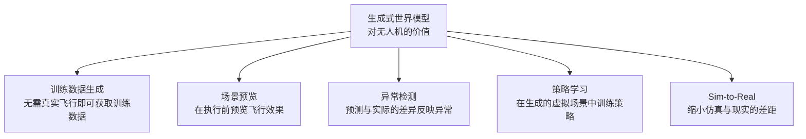
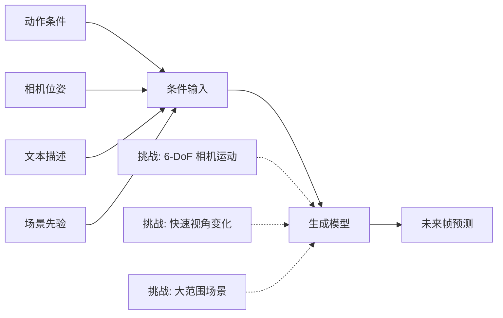
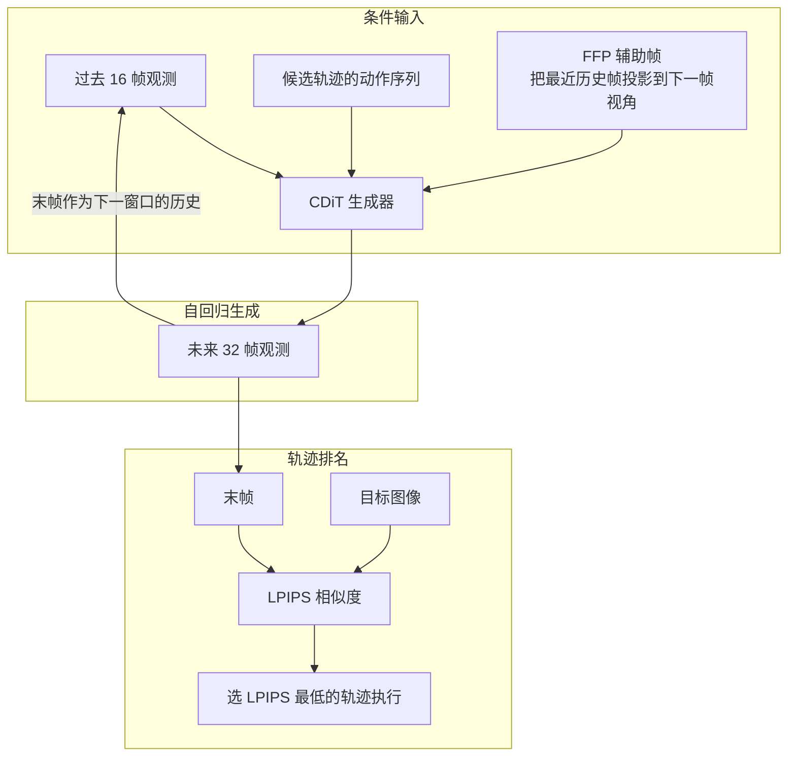
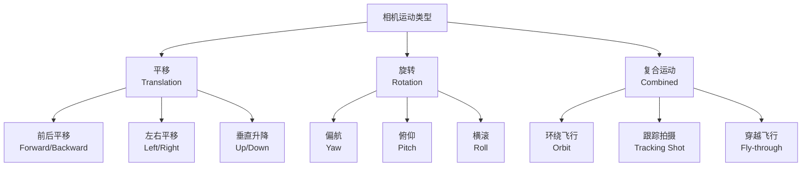
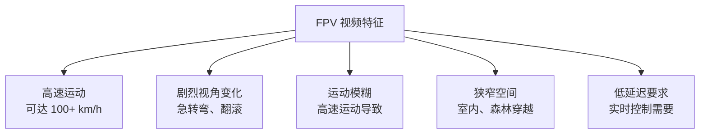
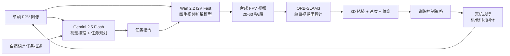
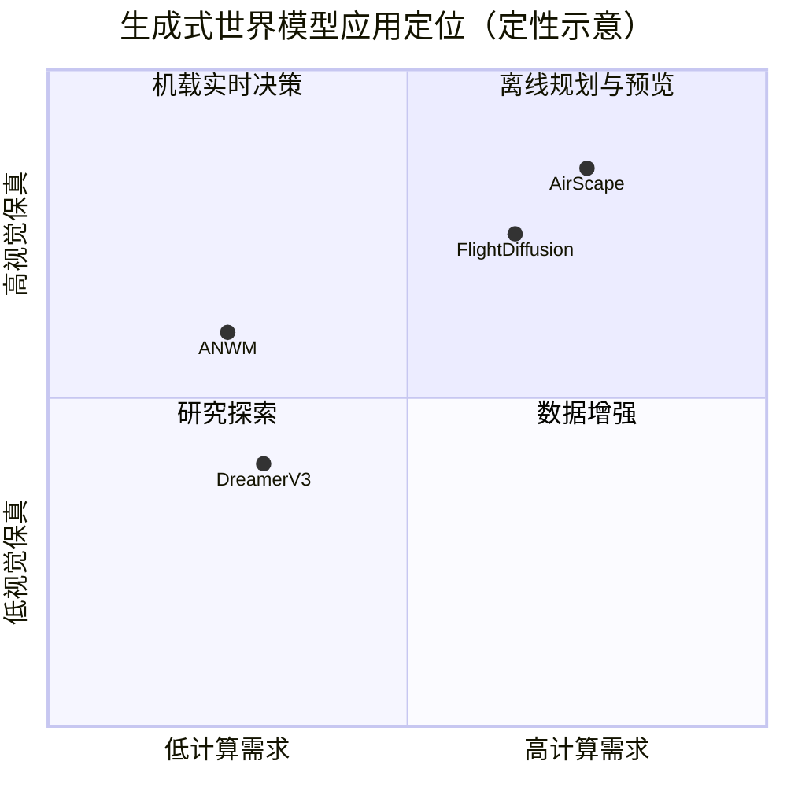
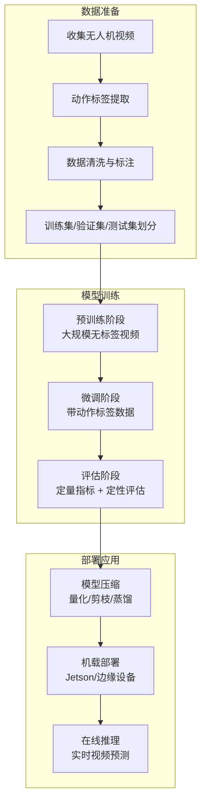
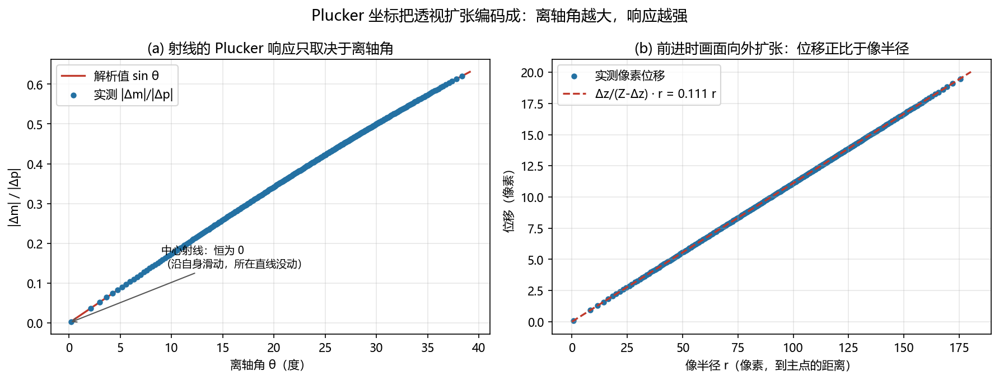

# 生成式世界模型：面向无人机的视频预测与场景生成

> **预计阅读：20 分钟 | 前置知识：扩散模型基础、GAN/VAE 原理、无人机视觉感知基础**

---

## 1. 生成式世界模型的意义

生成式世界模型（Generative World Model）是一类通过学习数据分布来生成未来观测的模型。与传统的潜在状态世界模型（如 Dreamer）不同，生成式世界模型直接在观测空间（通常是像素空间）中进行预测，产生高保真的视觉未来。

对于无人机而言，生成式世界模型具有独特的价值：


```mermaid
graph TB
    A[生成式世界模型<br/>对无人机的价值] --> B[训练数据生成<br/>无需真实飞行即可获取训练数据]
    A --> C[场景预览<br/>在执行前预览飞行效果]
    A --> D[异常检测<br/>预测与实际的差异反映异常]
    A --> E[策略学习<br/>在生成的虚拟场景中训练策略]
    A --> F[Sim-to-Real<br/>缩小仿真与现实的差距]
```

面向无人机的生成式世界模型有三个代表：ANWM、AirScape 和 FlightDiffusion。

---

## 2. 生成式世界模型的技术基础

### 2.1 从 VAE 到扩散模型

生成式世界模型的技术演进经历了多个阶段：

| 阶段 | 代表技术 | 生成质量 | 训练稳定性 | 推理速度 | 代表工作 |
|------|---------|---------|-----------|---------|---------|
| 2014-2017 | VAE | 模糊 | 稳定 | 快 | Ha World Models |
| 2014-2020 | GAN | 清晰但不稳定 | 不稳定 | 快 | 各类视频预测 |
| 2020-2022 | Transformer | 中等 | 稳定 | 中等 | GPT-like 视频预测 |
| 2021-至今 | Diffusion | 高保真 | 稳定 | 慢 | UniSim, FlightDiffusion |
| 2023-至今 | Flow Matching | 高保真 | 稳定 | 较快 | 新一代方法 |

### 2.2 条件生成的核心挑战

无人机场景的条件生成面临特殊挑战：


```mermaid
graph LR
    A[条件输入] --> B[生成模型]
    B --> C[未来帧预测]

    D[动作条件] --> A
    E[相机位姿] --> A
    F[文本描述] --> A
    G[场景先验] --> A

    H[挑战: 6-DoF 相机运动] -.-> B
    I[挑战: 快速视角变化] -.-> B
    J[挑战: 大范围场景] -.-> B
```

---

## 3. ANWM：航空导航世界模型

### 3.1 论文概述

**论文：** *"Aerial World Model for Long-horizon Visual Generation and Navigation in 3D Space"*（[arXiv:2512.21887](https://arxiv.org/abs/2512.21887)，2025-12）
**系统名：** ANWM（Aerial Navigation World Model）
**核心贡献：** 让无人机在三维大场景里「先想象、再选路」——世界模型按候选轨迹生成未来观测，用**最终一帧与目标图像的 LPIPS 相似度**给轨迹排名，选相似度最高的执行。

> **勘误（2026-10）**：本节早先按 *"ANWM: Aerial Navigation World Model"* 收录，并把 FFP 展开为「Feature-from-Feature Prediction」。两处都不是论文原话：正式题名如上（arXiv API 返回），FFP 是 **Future Frame Projection**。相应的小节已重写。

### 3.2 架构设计

ANWM 的用法与传统「世界模型 + 策略网络」不同：它不直接输出动作，而是**当轨迹评估器用**。流程是「候选轨迹 → 轨迹条件生成未来观测 → 与目标图像比对 → 选最优」。


```mermaid
graph TB
    subgraph 条件输入
        A[过去 16 帧观测] --> D[CDiT 生成器]
        B[候选轨迹的动作序列] --> D
        C[FFP 辅助帧<br/>把最近历史帧投影到下一帧视角] --> D
    end
    subgraph 自回归生成
        D --> E[未来 32 帧观测]
        E -->|末帧作为下一窗口的历史| A
    end
    subgraph 轨迹排名
        E --> F[末帧]
        G[目标图像] --> H[LPIPS 相似度]
        F --> H
        H --> I[选 LPIPS 最低的轨迹执行]
    end
```

### 3.3 FFP 模块详解

FFP（Future Frame Projection，未来帧投影）要解决的是「长距离生成时条件信息不足」：

- 只给历史帧的潜码，模型对下一帧该长什么样没有几何先验，距离一远生成就发散
- FFP 借 3D 视觉里的视图变换（view transformation），把**最近一帧历史图像投影到下一帧的相机视角**，得到一张粗糙的未来帧
- 这张辅助帧与历史帧一样经 VAE 编码成潜码、拼进条件输入，生成过程于是被约束在「与历史帧在重叠视场内保持一致」上

```python
# FFP 的作用一句话说清：投影出的准未来帧提供粗几何先验
# 论文原型：8 个 CDiT 块，输入输出 224x224，默认上下文帧数 m = 4
aux_frame = project_to_view(last_frame, R_delta, t_delta)  # 视图变换
cond = vae_encode(aux_frame)                              # 与历史帧同样处理
future = cdit_generate(cond, past_latents, actions)       # 逐航点自回归生成
```

**FFP 的上下文消融（论文 Table 3，上下文帧数 m → 生成质量）：**

| 上下文帧数 m | MSE ↓ | SSIM ↑ | PSNR ↑ |
|:---:|:---:|:---:|:---:|
| 1 | 0.287 | 0.449 | 5.63 |
| 2 | 0.262 | 0.464 | 6.13 |
| 4 | 0.249 | 0.568 | 6.36 |
| 8 | 0.236 | 0.627 | 6.59 |
| 16 | 0.217 | 0.651 | 6.90 |

值得看的是曲线的形状：m 从 1 加到 16 翻了 16 倍，MSE 只降 24%、SSIM 只涨 0.20。收益主要来自「有投影」这件事本身，而不是「给更多帧」。

### 3.4 训练与评测设置

| 项 | 设置 |
|:---|:---|
| 数据 | 自建 3D 视觉导航基准：1.1k 条 2D + 1.1k 条 3D 轨迹段；2D/3D 各取 1000 段测生成、100 段测导航（与 NWM 的设置对齐） |
| 片段 | 每段 48 帧，前 16 帧作历史 → 预测后 32 帧 |
| 模型与训练 | 8 个 CDiT 块，300k 步，4 × NVIDIA A800 40GB，AdamW lr 8e-5，默认 m = 4 |
| 分辨率 | 输入输出统一 224×224 |
| 基线 | NWM、Matrix-Game、YUME；后两者源码不公开，只在 2D 上比，3D 上把 NWM 的动作接口扩到 3D 并重训 |

### 3.5 实验结果

**生成质量（论文 Table 1，摘 4s 与 32s 两端；LPIPS / DreamSim / FID，越低越好）：**

| 时长 | 方法 | 2D LPIPS | 2D DreamSim | 2D FID | 3D LPIPS | 3D DreamSim | 3D FID |
|:---:|:---|:---:|:---:|:---:|:---:|:---:|:---:|
| 4s | NWM | 0.377 | 0.259 | 38.5 | 0.376 | 0.247 | 39.9 |
| 4s | **ANWM** | **0.184** | **0.125** | **19.2** | **0.192** | **0.143** | **22.6** |
| 32s | NWM | 0.524 | 0.400 | 61.0 | 0.535 | 0.377 | 47.6 |
| 32s | **ANWM** | **0.433** | **0.294** | **32.5** | **0.389** | **0.271** | **36.1** |

论文自己点出的规律比单点数字更重要：**所有基线随轨迹变长一起退化**，YUME 与 NWM 在 16s/32s 上掉得尤其快。长时程生成比的不是「谁更好」，而是「谁掉得慢」。

**导航（论文 Table 2，ATE / RPE / NE 越低越好，SR 越高越好）：**

| 方法 | 2D ATE | 2D RPE | 2D SR | 2D NE | 3D ATE | 3D RPE | 3D SR | 3D NE |
|:---|:---:|:---:|:---:|:---:|:---:|:---:|:---:|:---:|
| YUME | 15.92 | 1.80 | 0.0 | 24.32 | — | — | — | — |
| Matrix-Game | 14.75 | 1.53 | 16.0 | 20.98 | — | — | — | — |
| NWM | 7.72 | 0.89 | 63.0 | 12.71 | 8.52 | 1.03 | 58.0 | 14.51 |
| **ANWM** | **6.30** | **0.78** | **73.0** | **10.30** | **8.13** | 1.06 | **60.0** | **14.12** |

一处要留意的细节：3D 那一栏里 ANWM 的 RPE（1.06）比 NWM（1.03）**略差**，但论文正文写的是「2D 和 3D 都最优」。表格与自述不一致时以表格为准——这是读论文时反复会遇到的情况，也是 [08-研究前沿与开放问题](../08-研究前沿与开放问题/03-论文批判性阅读.md) 讲的「自述与证据分开看」。

## 4. AirScape：可控相机运动的航空视频生成

### 4.1 论文概述

**论文：** *"AirScape: An Aerial Generative World Model with Motion Controllability"*（[arXiv:2507.08885](https://arxiv.org/abs/2507.08885)，2025-07）
**核心贡献：** 首个面向 6-DoF 航空体的世界模型：给定当前视觉输入与**运动意图**，预测未来观测序列。
**数据：** 自建 11k 视频-意图对，第一人称视角、覆盖多种无人机动作；运动意图标注耗时超过 1000 小时。
**训练：** 两阶段——先取一个不含具身空间知识的基础模型，再调成受运动意图控制、遵守物理时空约束的世界模型。
**项目页：** <https://embodiedcity.github.io/AirScape/>

> **勘误（2026-10）**：本节早先题名为 *"AirScape: An Aerial Video Generation Model with Controllable Camera Motion"*并标注「ACM Multimedia 2025」，两处都不是该论文的正式信息，现按 arXiv API 返回更正。

### 4.2 核心问题

无人机视频生成的独特挑战在于**相机运动的特殊性**：


```mermaid
graph TB
    A[相机运动类型] --> B[平移<br/>Translation]
    A --> C[旋转<br/>Rotation]
    A --> D[复合运动<br/>Combined]

    B --> B1[前后平移<br/>Forward/Backward]
    B --> B2[左右平移<br/>Left/Right]
    B --> B3[垂直升降<br/>Up/Down]

    C --> C1[偏航<br/>Yaw]
    C --> C2[俯仰<br/>Pitch]
    C --> C3[横滚<br/>Roll]

    D --> D1[环绕飞行<br/>Orbit]
    D --> D2[跟踪拍摄<br/>Tracking Shot]
    D --> D3[穿越飞行<br/>Fly-through]
```

传统视频生成模型难以精确控制相机运动，因为：
1. 相机运动和场景运动纠缠在一起
2. 6-DoF 相机参数难以直接作为条件输入
3. 不同相机运动导致的视觉变化差异巨大

### 4.3 AirScape 架构

```mermaid
graph TB
    subgraph 相机运动编码
        A[6-DoF 相机轨迹<br/>T = {R_t, t_t}] -->|Plucker 坐标编码| B[Plucker 特征 P]
        B -->|运动分解| C[平移特征 T_feat]
        B -->|运动分解| D[旋转特征 R_feat]
    end

    subgraph 视频生成
        E[初始帧 I_0] -->|CLIP 编码| F[语义特征]
        C --> G[条件去噪网络]
        D --> G
        F --> G
        G -->|扩散过程| H[去噪视频帧序列]
    end

    subgraph 训练
        H --> I[重建损失]
        H --> J[感知损失 LPIPS]
        H --> K[运动一致性损失]
    end
```

### 4.4 Plucker 坐标编码

AirScape 使用 Plucker 坐标（Plucker Coordinates）来精确表示 3D 空间中的相机射线：

```
Plucker 坐标: (d, m)
其中:
  d = 射线方向（单位向量）
  m = 射线矩 (moment) = p x d
  p = 射线上的任意点
```

对于图像上的每个像素 (u, v)，其对应的射线 Plucker 坐标为：

```python
import numpy as np

def pixel_to_plucker(u, v, K, R, t):
    """u, v 像素坐标；K 内参；R, t 相机位姿（相机 -> 世界）。返回 (d_world, m_world)。"""
    K_inv = np.linalg.inv(K)
    d_cam = K_inv @ np.array([u, v, 1.0])
    d_cam = d_cam / np.linalg.norm(d_cam)

    # 方向是向量，只转不平移
    d_world = R @ d_cam
    # 矩 m = p x d，p 取相机光心 t
    m = np.cross(t, d_world)

    return d_world, m
```

**Plucker 坐标的优势：**
- 完整描述 3D 射线的几何信息
- 对相机运动有线性响应
- 可以作为像素级条件输入扩散模型

### 4.5 运动分解策略

AirScape 将 6-DoF 相机运动分解为平移和旋转两个独立分支：

| 分支 | 输入 | 处理 | 输出 | 物理意义 |
|------|------|------|------|---------|
| 平移分支 | 平移向量 t | MLP + 时间编码 | 平移特征 | 相机位置变化 |
| 旋转分支 | 旋转矩阵 R | MLP + 时间编码 | 旋转特征 | 相机朝向变化 |
| 融合层 | 两个特征 | Cross-Attention | 条件特征 | 统一的运动表示 |

### 4.6 实验结果

**定量评估（论文表格的平均列；IAR 为运动意图对齐率，越高越好）：**

| 方法 | 平均 FID ↓ | 平均 FVD ↓ | 平均 IAR ↑ |
|:---|:---:|:---:|:---:|
| HunyuanVideo-I2V | 225.26 | 1222.05 | 22.01% |
| Cosmos-Predict1-7B-Video2World | 172.90 | 2737.54 | 31.81% |
| CogVideoX-i2v-5B | 131.50 | 2401.16 | 24.14% |
| **AirScape** | **111.89** | **1043.24** | **84.51%** |

按运动类型分（平移 / 旋转 / 复合）时结论不变：AirScape 的 IAR 分别为 84.44% / 81.82% / 87.27%，三条都远高于任何基线。

**该看哪一列：**三个基线里 CogVideoX 的 FID 最好（131.50），而 AirScape 是 111.89 —— 差距不到一倍；但 IAR 是 84.51% 对 24.14%，差了三倍以上。论文摘要里说的「运动对齐指标提升超过 50%」，指的就是这一列。**画面好看（FID/FVD）与运动听话（IAR）是两件事**，这也是这一节最该带走的一句。

> **勘误（2026-10）**：本节早先列过一张「FID 18.3 vs 24.7、FVD 156.2 vs 213.8、MOS 4.1/5 vs 3.2/5」的表，那些数字不在该论文中，已按论文表格替换。

### 4.7 对无人机的应用价值

| 应用场景 | 使用方式 | 预期收益 |
|---------|---------|---------|
| 航拍路径规划 | 预览不同路径的拍摄效果 | 减少实际飞行次数 |
| 仿真数据增强 | 生成多样化的训练数据 | 提升感知模型泛化能力 |
| 飞行训练 | 在虚拟环境中练习操控 | 降低训练成本和风险 |
| 任务预演 | 执行前模拟飞行场景 | 提高任务成功率 |

---

## 5. FlightDiffusion：把现成模型串成一条 FPV 数据流水线

### 5.1 论文概述

**论文：** *"FlightDiffusion: Revolutionising Autonomous Drone Training with Diffusion Models Generating FPV Video"*（[arXiv:2509.14082](https://arxiv.org/abs/2509.14082)，2025-09）
**核心贡献：** 它**不训新的扩散模型**，而是把三个现成部件串成一条流水线：单帧 FPV 图像 → 多模态大模型拆任务 → 现成图生视频扩散模型生成视频 → 视觉里程计把视频还原成轨迹 → 用这条合成轨迹训无人机控制策略。

> **勘误（2026-10）**：本节早先按 *"FlightDiffusion: Autoregressive Diffusion Model for FPV Video Generation"* 收录，并据此写了「自回归 U-Net 架构」「运动感知的噪声调度」「多尺度动作注入」「自回归一致性损失」与一张数据集规模表。这些都**不在论文里**——论文用的是现成模型，没有自研生成架构、没有噪声调度改动、也没有基线对比。整节已按论文正文重写。

这条流水线的定位值得先摆明：它是一篇**系统工程**论文，贡献在「怎么把闲置的通用模型拼成可用的合成数据源」，不在「世界模型本身」的架构创新。

### 5.2 FPV 视频的特殊性

FPV（First Person View）无人机视频与普通航空视频有显著区别：


```mermaid
graph TB
    A[FPV 视频特征] --> B[高速运动<br/>可达 100+ km/h]
    A --> C[剧烈视角变化<br/>急转弯、翻滚]
    A --> D[运动模糊<br/>高速运动导致]
    A --> E[狭窄空间<br/>室内、森林穿越]
    A --> F[低延迟要求<br/>实时控制需要]
```

**FPV vs. 普通航空视频：**

| 特征 | FPV 视频 | 普通航空视频 |
|------|---------|-------------|
| 速度范围 | 0-150 km/h | 0-30 km/h |
| 视角变化速率 | 高（>60 deg/s） | 低（<10 deg/s） |
| 场景类型 | 狭窄、复杂 | 开阔、简单 |
| 相机运动 | 剧烈、非平滑 | 平稳、可控 |
| 数据量 | 大（竞速、花飞） | 少（航拍、巡检） |

### 5.3 系统流水线


```mermaid
graph LR
    A[单帧 FPV 图像] --> B[Gemini 2.5 Flash<br/>视觉推理 + 任务规划]
    P[自然语言任务描述] --> B
    B --> C[任务指令]
    A --> D[Wan 2.2 I2V Fast<br/>图生视频扩散模型]
    C --> D
    D --> E[合成 FPV 视频<br/>20-60 秒/段]
    E --> F[ORB-SLAM3<br/>单目视觉里程计]
    F --> G[3D 轨迹 + 速度 + 位姿]
    G --> H[训练控制策略]
    H --> I[真机执行<br/>机载相机闭环]
    I --> A
```

三个部件的选型全都不是自己训的，这既决定了它的能力上限，也决定了复现成本：

| 阶段 | 用了什么 | 角色 |
|:---|:---|:---|
| 视觉推理与任务规划 | Gemini 2.5 Flash（多模态大模型） | 从单帧图像 + 提示词产出高层任务描述 |
| 视频生成 | Wan 2.2 I2V Fast（现成图生视频扩散模型） | 图像 + 文本 → 短 FPV 视频，平均 20-60 秒一段 |
| 轨迹恢复 | ORB-SLAM3（单目） | 视频 → 3D 轨迹、速度、位姿 |

### 5.4 三个可迁移的设计点

**① 把多模态大模型放在「拆任务」而不是「生成」的位置。** 长时程任务先被拆成「穿过拱门 1」「避开黄色障碍」「右转」「穿过广场」这类子任务，每个子任务单独生成一段视频、执行完再拍一帧重新规划。这是它处理长时程的**全部**机制——不是让世界模型一次预测到底，而是让规划器反复重启生成。

**② 用视觉里程计给生成视频「上锁」。** 生成的视频本身没有动作标签，ORB-SLAM3 把像素轨迹反解成位姿序列，合成数据才有监督信号可用。这一步也意味着：**上游生成视频的视觉质量直接决定下游训练标签的质量**，生成里那些「不该存在的物体」会原样变成轨迹误差，论文自己也把它列为扩散模型的预期局限。

**③ 用一次「不该有差异」的检验来验证仿真到现实。** 九种机动（前进、穿隧道、避障、降落等）各在仿真与真机各飞 20 次，做双因素 ANOVA，结论是环境这个因素**没有显著主效应**。这是个便宜又好用的验收方式：与其证明「我们的方法更好」，不如先证明「仿真和真机没有系统性差别」。

### 5.5 实验结果

**轨迹精度（论文 Table I，三次实验平均）：**

| 指标 | 平移 (m) | 旋转 (rad) |
|:---|:---:|:---:|
| 平均误差 | 0.25 | 0.19 |
| 最大误差 | 0.44 | 0.51 |
| RMSE | 0.28 | 0.24 |

（论文正文把姿态 RMSE 写成 0.23 rad，表 I 写 0.24 rad，此处以表为准。）

**仿真 vs. 真机（9 种机动 × 各 20 次）：**

| 环境 | 成功率 | 标准差 | 检验 |
|:---|:---:|:---:|:---|
| 仿真 | 0.628 | 0.162 | F(1,16) = 0.394 |
| 真机 | 0.617 | 0.177 | p = 0.541，无显著差异 |

**这张表该怎么读，比数字本身更重要。** 论文**没有基线对比**：它比的是「生成轨迹 vs. 真值轨迹」和「仿真里飞 vs. 真机里飞」，不是「FlightDiffusion vs. 别的生成模型」。所以这些数字能回答「这套流水线能不能用」，不能回答「它比谁好」。要做后者，得自己补一个「不用生成数据、直接真机采数据」的对照组。

## 6. 三种方法的对比分析

### 6.1 架构对比

| 特性 | ANWM | AirScape | FlightDiffusion |
|------|------|----------|-----------------|
| 生成方式 | 条件扩散 Transformer（CDiT）自回归生成观测 | 扩散模型，两阶段训练 | **不训生成模型**，用现成 I2V 模型 |
| 生成目标 | 未来观测帧 | 未来观测序列（受运动意图控制） | 短视频 + 由里程计反解的轨迹 |
| 条件输入 | 历史帧 + 候选轨迹动作 | 当前视觉 + 6-DoF 运动意图 | 单帧图像 + 自然语言任务 |
| 怎么用 | 给候选轨迹排名的评估器 | 3D 空间想象 | 合成训练数据 → 训策略 |
| 机载可行性 | 论文未报告推理开销 | 论文未报告推理开销 | 每段视频 20-60 秒、需外部 API，只能离线 |
| 训练成本 | 4 × A800 40GB、300k 步 | 11k 视频-意图对、超 1000 小时标注 | 不训生成模型，只训下游策略 |

> **一句话**：ANWM 和 AirScape 都在做「自己造一个世界模型」，FlightDiffusion 是「把现成的拼起来用」。三者的对比表若只填「快/慢」「大/小」，就掉进了**用没有实测的数比较实测的数**的坑——所以上表只写论文里真有的东西，推理开销一栏三篇都没报。

### 6.2 应用场景对比


```mermaid
quadrantChart
    title 生成式世界模型应用定位（定性示意）
    x-axis 低计算需求 --> 高计算需求
    y-axis 低视觉保真 --> 高视觉保真
    quadrant-1 离线规划与预览
    quadrant-2 机载实时决策
    quadrant-3 研究探索
    quadrant-4 数据增强
    ANWM: [0.25, 0.60]
    AirScape: [0.75, 0.85]
    FlightDiffusion: [0.65, 0.75]
    DreamerV3: [0.30, 0.40]
```

> 坐标是**定性示意，不是实测开销**：横轴按「自训小型生成器 < 自训大型扩散 < 需在线调用外部模型」排，纵轴按各自论文里报告的视觉指标排。要拿它当选型依据，得自己补一组统一硬件上的延迟与显存实测。

### 6.3 技术路线总结

| 维度 | ANWM | AirScape | FlightDiffusion |
|------|------|----------|-----------------|
| 核心创新 | FFP 未来帧投影 | 运动可控的 6-DoF 世界模型 | 大模型规划 + 现成 I2V + 里程计的组装 |
| 主要优势 | 长时程生成退化最慢，可直接给轨迹排名 | 运动对齐指标大幅领先（IAR 84.51%） | 不用训生成模型就能合成带标签数据 |
| 主要局限 | 3D 上 RPE 未超过 NWM；训练成本高 | 论文未报告机载可行性 | 无基线对比；每段视频 20-60 秒 |
| 适用任务 | 大场景导航 | 3D 空间想象 | 合成训练数据 |
| 自训生成模型 | 是 | 是 | **否** |

---

## 7. 生成式世界模型的训练流程

### 7.1 典型训练流程


```mermaid
graph TB
    subgraph 数据准备
        A[收集无人机视频] --> B[动作标签提取]
        B --> C[数据清洗与标注]
        C --> D[训练集/验证集/测试集划分]
    end

    subgraph 模型训练
        D --> E[预训练阶段<br/>大规模无标签视频]
        E --> F[微调阶段<br/>带动作标签数据]
        F --> G[评估阶段<br/>定量指标 + 定性评估]
    end

    subgraph 部署应用
        G --> H[模型压缩<br/>量化/剪枝/蒸馏]
        H --> I[机载部署<br/>Jetson/边缘设备]
        I --> J[在线推理<br/>实时视频预测]
    end
```

### 7.2 关键训练技巧

| 技巧 | 描述 | 效果 |
|------|------|------|
| 数据增强 | 随机裁剪、翻转、颜色抖动 | 提升泛化能力 |
| 课程学习 | 从简单场景到复杂场景 | 加速收敛 |
| 多尺度训练 | 在不同分辨率下训练 | 多尺度预测能力 |
| 对抗训练 | 引入判别器 | 提升生成质量 |
| 时序一致性损失 | 相邻帧的一致性约束 | 减少闪烁 |

---

## 8. 关键论文

- **[arXiv'25.12] Aerial World Model for Long-horizon Visual Generation and Navigation in 3D Space** — *Zhang et al.*  
  [](https://arxiv.org/abs/2512.21887)
  FFP 未来帧投影, 轨迹排名

- **[arXiv'25.07] AirScape** — *AirScape: An Aerial Generative World Model with Motion Controllability*  
  [](https://arxiv.org/abs/2507.08885)
  运动可控, 6-DoF, Plucker 坐标

- **[arXiv'25.09] FlightDiffusion** — *FlightDiffusion: Revolutionising Autonomous Drone Training with Diffusion Models Generating FPV Video*  
  [](https://arxiv.org/abs/2509.14082)
  FPV, 组合式流水线, 合成训练数据

- **[arXiv'23.10] UniSim** — *UniSim: Learning Interactive Real-World Simulators*  
  [](https://arxiv.org/abs/2310.06114)
  交互式世界模拟器

- **[NeurIPS'22] Video Diffusion Models** — *Ho et al.*  
  [](https://arxiv.org/abs/2204.03458)
  视频扩散基础

- **[arXiv'23.11] SVD** — *Stable Video Diffusion: Scaling Latent Video Diffusion Models to Large Datasets*  
  [](https://arxiv.org/abs/2311.15127)
  Stable Video Diffusion


---

> **本章只覆盖「生成/重建像素」这一派。** 另有一条不重建输入、直接在表征空间预测未来的路线（JEPA 派），判据与本章不同，见 [08-联合嵌入预测与潜空间世界模型](./08-联合嵌入预测与潜空间世界模型.md)；把 horizon 从几步拉到上百步之后才显形的三种失效（漂移、遗忘、恒存性缺失），见 [09-长时程世界模型与交互式生成](./09-长时程世界模型与交互式生成.md)。

---

## 9. 动手验证：Plucker 坐标到底编码了什么？

4.4 节说 Plucker 坐标"对相机运动有线性响应"，4.5 节紧接着把 6-DoF 运动拆成平移与旋转两个独立分支。这两句话是有因果的，本节把它们量出来：线性响应只对平移成立，旋转不成立，所以才需要拆。

### 9.1 一个像素网格的射线响应

在 256×256、60° 视场角的针孔相机上造出全部像素的射线，让相机纯前向平移，量每条射线的 Plucker 矩变了多少。矩的定义是 `m = p × d`，`p` 取光心，方向 `d` 在纯平移下不变，所以 `Δm = Δp × d`。

```python
import numpy as np
W = H = 256; FOV_DEG, DZ, Z_PLANE = 60.0, 0.5, 5.0
def intrinsics(w, h, fov):
    """针孔内参：主点在图像中心，焦距由视场角反推。"""
    f = (w / 2) / np.tan(np.radians(fov) / 2)
    return np.array([[f, 0, w / 2 - 0.5], [0, f, h / 2 - 0.5], [0, 0, 1.0]])
def pixel_rays(K, w, h):
    """每个像素在相机坐标系下的单位方向，(w*h, 3)。相机朝 +z 看。"""
    u, v = np.meshgrid(np.arange(w), np.arange(h))
    pix = np.stack([u.ravel(), v.ravel(), np.ones(u.size)], -1)
    d = pix @ np.linalg.inv(K).T
    return d / np.linalg.norm(d, axis=-1, keepdims=True)
def project(pts, K):
    """相机坐标系三维点 -> 像素坐标：先按 z 透视除法，再过内参。"""
    return (pts[:, :2] / pts[:, 2:3]) @ K[:2, :2].T + K[:2, 2]
K = intrinsics(W, H, FOV_DEG)
d = pixel_rays(K, W, H)
p1 = np.array([0.0, 0.0, DZ])                            # 纯前向平移量
theta = np.degrees(np.arccos(np.clip(d[:, 2], -1, 1)))   # 离轴角
ratio = np.linalg.norm(np.cross(p1, d), axis=-1) / DZ    # |Δm| / |Δp|
print(f"|Δm|/|Δp| 与 sin θ 的最大偏差 {np.abs(ratio - np.sin(np.radians(theta))).max():.2e}")
for q in (10, 20, 30):                                   # 抽几个离轴角看
    i = np.argmin(np.abs(theta - q))
    print(f"  离轴角 {theta[i]:5.1f}°   |Δm|/|Δp| = {ratio[i]:.4f}"
          f"   sin θ = {np.sin(np.radians(theta[i])):.4f}")
pts = d * (Z_PLANE / d[:, 2:3])                          # 正对平面上各像素对应的三维点
pix0 = project(pts, K)
move = np.linalg.norm(project(pts - p1, K) - pix0, axis=-1)
radius = np.linalg.norm(pix0 - K[:2, 2], axis=-1)
print(f"位移/半径 实测均值 {np.mean(move / np.maximum(radius, 1e-9)):.4f}"
      f"   理论 Δz/(Z-Δz) = {DZ / (Z_PLANE - DZ):.4f}")
```

### 9.2 本地实测结果

```text
|Δm|/|Δp| 与 sin θ 的最大偏差 2.45e-14
  离轴角  10.0°   |Δm|/|Δp| = 0.1738   sin θ = 0.1738
  离轴角  20.0°   |Δm|/|Δp| = 0.3420   sin θ = 0.3420
  离轴角  30.0°   |Δm|/|Δp| = 0.5000   sin θ = 0.5000
位移/半径 实测均值 0.1111   理论 Δz/(Z-Δz) = 0.1111
```

矩的变化量与平移量之比正好是 `sin θ`，θ 是这条射线偏离光轴的角度。严格沿光轴的那条射线（θ = 0）**变化量恒等于 0**：相机前进时它沿自身滑动，所在的直线根本没动。边缘射线则按 `sin θ` 增长，30° 处的响应是 0.5，也就是说平移 0.5 m 会让它的矩改变 0.25。

这件事在图像上就是透视扩张。把相机正对的一面墙放在 5 m 外，前移 0.5 m，像素位移与像半径的比值恒为 0.1111，与理论值 `Δz/(Z-Δz)` 分毫不差——像半径 40 px 处位移 4.45 px，160 px 处位移 17.78 px，比例完全一致。**中心不动，边缘被推得最狠**，这就是前进时画面向外"涌"出来的全部来源。

回到"线性响应"这句话。平移时 `Δm = Δp × d`，对 `Δp` 严格线性：平移量翻倍，矩的变化量精确翻倍（比值 2.000000，与离轴角无关）。旋转不是这样。绕 y 轴转 20° 和转 40°，`|Δd|` 的比值是 1.969616，明显小于 2，解析值 `sin20°/sin10°` 与之吻合。旋转在角度上是非线性的，转得越多，单位角度的响应越弱。

这正是 4.5 节要把运动拆成两个分支的原因：AirScape 让平移和旋转各自编码。若混在一起用一组参数表示 6-DoF，平移那部分线性、旋转那部分非线性，同一个网络很难同时拟合两种截然不同的响应规律；分开之后每个分支内部的映射都规整得多。

> **限制**：本节是解析性质的数值验证，不涉及任何学习过程。它证明的是编码本身的数学性质，不构成"Plucker 比 6-DoF 参数更适合当条件输入"的证据——后者要靠 4.4 节引的生成质量对比实验来判断。



### 9.3 运行完整脚本

```bash
py -3.9 code/i_plucker.py     # 约 1 秒，CPU 即可，只需 numpy
```

完整脚本在 [`code/i_plucker.py`](../../code/i_plucker.py)，额外打印线性叠加验证（`Δm(a+b)` 与 `Δm(a)+Δm(b)` 的最大偏差 2.22e-16）和旋转分支的对照，并输出上面这张两面板的图。

---

## 10. 延伸阅读

- [01-世界模型发展史](./01-世界模型发展史.md) — 世界模型的整体发展脉络
- [03-模型强化学习世界模型](./03-模型强化学习世界模型.md) — Dreamer 系列与模型强化学习
- [04-3D场景世界模型](./04-3D场景世界模型.md) — NeRF 和 3DGS 作为世界模型
- [05-无人机世界模型综述](./05-无人机世界模型综述.md) — 生成式方法在无人机中的应用
- [06-关键数据集与基准](./06-关键数据集与基准.md) — 评估生成式世界模型的数据集

---

## 11. 思考题

### 题目 1：画面好看就等于导航可用吗？

本章三篇都报告了「生成质量」类指标（LPIPS / FID / FVD），其中两篇还报告了任务指标。请只用本章的数字，说明「生成指标」与「任务可用性」是什么关系。

<details>
<summary>参考答案</summary>

**证据一：AirScape 说明两条轴可以严重脱钩。** AirScape 与最好的基线 CogVideoX 在 FID 上只差 15%（111.89 对 131.50），却在运动意图对齐率上差了 3.5 倍（84.51% 对 24.14%）。也就是说，一个 FID 略好的模型完全可能在「有没有按你说的动」上差得很远。

**证据二：ANWM 说明两条轴通常同向，但不处处同向。** 32s 时 ANWM 的 LPIPS 0.433 优于 NWM 的 0.524，2D 导航成功率 73.0 也优于 63.0——同向。但在 3D 上，ANWM 的 RPE 是 1.06，反而比 NWM 的 1.03 略差。

**证据三：FlightDiffusion 绕开了这个问题。** 它没有基线对比，只比「生成轨迹 vs 真值」和「仿真 vs 真机」，所以严格说它没有提供任何「生成指标预测任务表现」的证据。

**判据：** 生成指标是**必要条件**，用来筛掉明显不能用的模型；它不是**充分条件**。要判「能不能用」，必须有一条把生成结果接进闭环的指标——ANWM 的 SR/ATE/NE、FlightDiffusion 的成功率都算，而且这类指标必须明确报告它接的是哪条闭环（开环重放还是真机执行）。

**由此推出一条读论文的习惯：** 只看 FID/FVD 决定用不用一个世界模型，等价于只看画质决定用不用一个控制器。
</details>

### 题目 2：Plucker 坐标的几何意义

解释 Plucker 坐标在 AirScape 中的作用，以及为什么它比直接使用 6-DoF 参数更适合表示相机运动。

<details>
<summary>参考答案</summary>

**Plucker 坐标的几何意义：**
- Plucker 坐标用于表示 3D 空间中的有向直线（射线）
- 每条射线由 6 个参数表示：方向 d（3 维）和矩 m（3 维）
- 矩 m = p x d，其中 p 是射线上的任意一点
- Plucker 坐标满足约束：d . m = 0（方向和矩正交）

**在 AirScape 中的作用：**
- 图像上的每个像素对应一条从相机出发的 3D 射线
- Plucker 坐标完整描述了这条射线在世界坐标系中的位置和方向
- 当相机运动时，每条射线的 Plucker 坐标随之变化
- 将 Plucker 坐标作为像素级条件输入扩散模型，实现精确的相机运动控制

**为什么比 6-DoF 参数更好：**

| 6-DoF 参数 | Plucker 坐标 |
|-----------|-------------|
| 全局表示：一个 6 维向量表示整个相机 | 局部表示：每个像素有独立的 6 维表示 |
| 非线性映射：旋转矩阵到像素的映射是非线性的 | 线性响应：相机运动对 Plucker 坐标是线性的 |
| 难以作为像素级条件 | 天然适合像素级条件输入 |
| 丢失了射线的空间信息 | 完整保留了射线几何信息 |

**具体例子：**
- 假设相机向前平移 t = [1, 0, 0]
- 使用 6-DoF 参数：整个图像共享同一个平移向量
- 使用 Plucker 坐标：图像中心的射线 Plucker 坐标几乎不变，而边缘的射线变化显著
- 边缘射线变化大、中心几乎不变，透视效果就来自这个差异
</details>

### 题目 3：里程计给生成视频「上锁」时，哪些缺陷会被吸收、哪些不会？

FlightDiffusion 用 ORB-SLAM3 把生成的 FPV 视频反解成 3D 轨迹，再拿这条轨迹当监督信号。请分析：生成视频里的哪几类缺陷会被里程计吸收掉，哪几类会原样传进训练标签。

<details>
<summary>参考答案</summary>

**会被吸收掉的（不影响轨迹）：**
- 纹理、光照、色调上的不真实——里程计只追踪特征点的运动，不关心画面好不好看
- 局部遮挡、少量噪点——鲁棒估计（RANSAC 之类的内点筛选）会把明显偏离的点剔掉
- 论文自己提到的「生成画面里出现了真环境里没有的物体」——只要它不显著改变相机相对运动，位姿估计基本不受影响

**会原样传进去的（污染轨迹）：**
- **运动学不一致**：生成的视频呈现的相机运动如果本身不是刚体运动（比如物体在动而相机不动，或出现尺度跳变），里程计解出来的位姿就是错的
- **时序抖动**：帧间不连续会被理解为相机的往复抖动，直接变成轨迹噪声
- **尺度歧义**：单目 SLAM 本质上是尺度盲的，尺度必须由外部信息定；生成模型并不会给出物理尺度
- **闭环失败**：长序列里一旦丢掉跟踪，SN 累计误差会整段偏掉

**判据：**「视觉上假」和「几何上假」是两回事。里程计只把前者挡在外面，后者会被它忠实翻译成轨迹误差——而下游策略学的正是这个轨迹。所以对这条流水线来说，**该重点评的不是 FID，而是生成视频的运动学自洽性**（比如相邻帧的位姿变化是否平滑、是否与输入任务描述的方向一致）。

**可验证的做法：** 拿同一段真实飞行、同一段生成视频，分别过一遍 ORB-SLAM3，比两者解出的轨迹与 Vicon 真值的误差谱——差在哪里，就说明是哪一类缺陷漏了过来。
</details>

### 题目 4：生成式世界模型的可靠性

讨论生成式世界模型在安全关键的无人机应用中的可靠性问题，以及可能的解决方案。

<details>
<summary>参考答案</summary>

**可靠性问题：**

1. **物理一致性问题：**
   - 生成的视频可能违反物理规律（如物体穿墙、重力异常）
   - 在分布外场景中，生成质量可能急剧下降
   - 难以保证长期预测的一致性

2. **安全性问题：**
   - 可能生成虚假的"安全"场景，导致策略过于激进
   - 无法保证预测的障碍物位置准确
   - 在紧急情况下，模型的不确定性难以量化

3. **可控性问题：**
   - 条件生成的可控性有限
   - 难以精确控制生成结果的细节
   - 不同条件的响应可能不一致

**可能的解决方案：**

1. **物理约束注入：**
   - 在训练中加入物理损失（如重力约束、碰撞约束）
   - 使用物理引擎作为后端验证
   - 引入可微分物理模拟器

2. **不确定性估计：**
   - 使用贝叶斯方法估计预测的不确定性
   - 在不确定性高时保守决策
   - 集成多个模型进行不确定性量化

3. **安全验证层：**
   - 在生成结果上运行安全检查
   - 使用传统的安全约束（如最小距离）进行验证
   - 不安全的预测结果被丢弃或修正

4. **混合架构：**
   - 生成式模型用于粗粒度预测
   - 结构化模型（如 3DGS）用于精确状态估计
   - 两者结合提供既丰富又可靠的预测

5. **人在回路 (Human-in-the-Loop)：**
   - 在关键决策时引入人类监督
   - 提供预测结果的可视化和解释
   - 允许人类修正或否决模型的预测
</details>

---

> **下一节**：[03-模型强化学习世界模型](./03-模型强化学习世界模型.md) — 深入了解 Dreamer 系列如何在无人机竞速中实现自主飞行。
