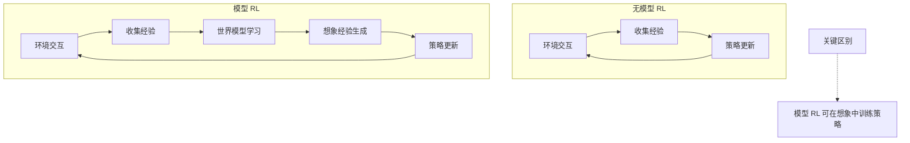
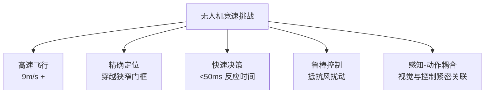
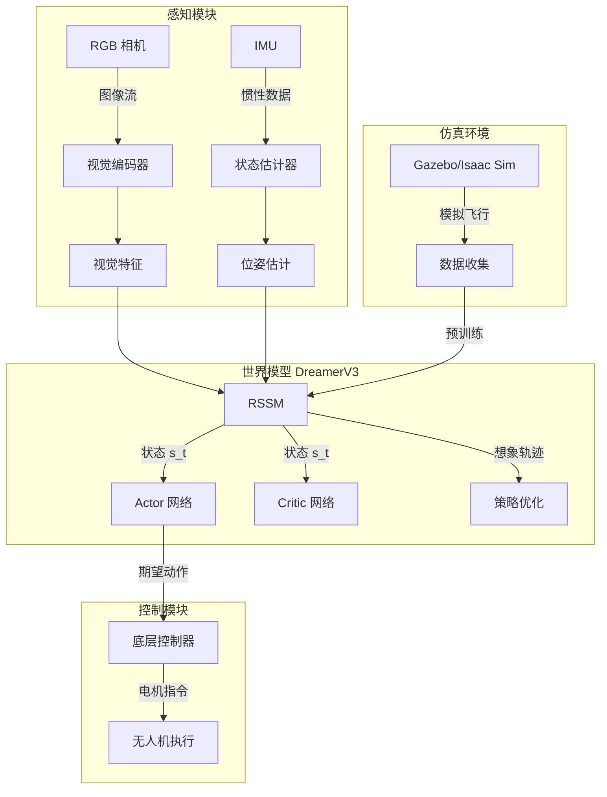
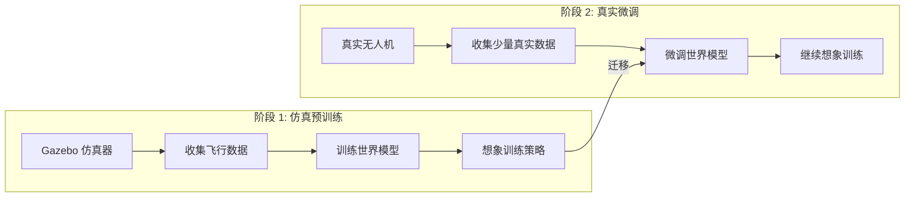
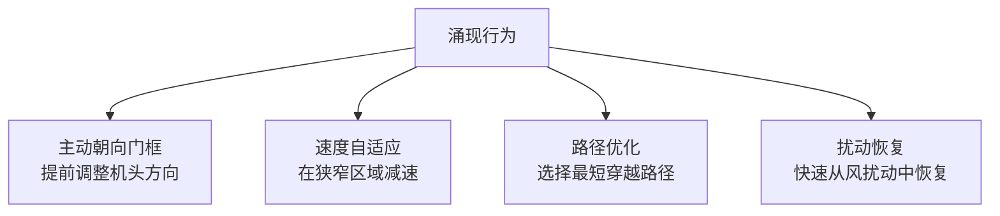
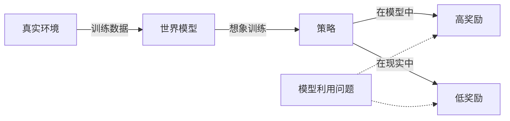
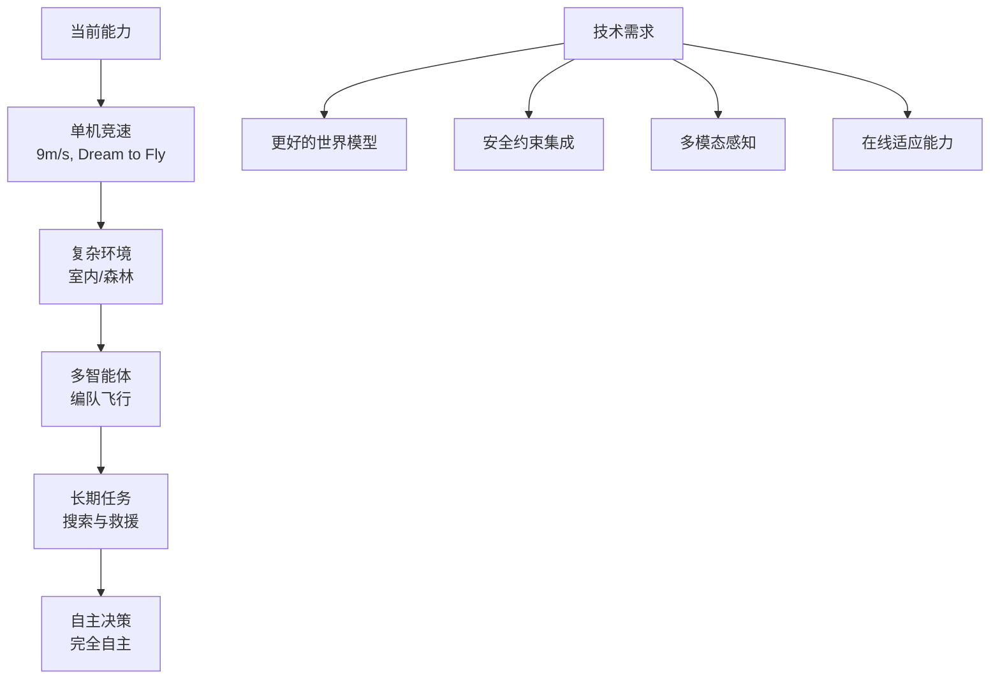

# 模型强化学习世界模型：从 Dreamer 到无人机自主飞行

> **预计阅读：22 分钟 | 前置知识：强化学习基础、策略梯度方法、VAE 原理、循环神经网络**

---

## 1. 引言：模型强化学习中的世界模型

模型强化学习（Model-Based Reinforcement Learning, MBRL）的核心思想是：先学习环境的动态模型（世界模型），再利用该模型进行策略优化。与无模型方法（Model-Free RL）相比，MBRL 可以大幅减少真实环境交互次数，因为它利用模型生成的"想象经验"（imaginary experience）来补充真实经验。



本节将深入解析 Dreamer 系列的核心技术，并重点介绍 "Dream to Fly" 如何将 DreamerV3 应用于无人机竞速。

---

## 2. Dreamer 系列核心技术解析

### 2.1 RSSM：循环状态空间模型

RSSM（Recurrent State-Space Model）是 Dreamer 系列的核心架构，它巧妙地结合了确定性和随机性动态建模。

```mermaid
graph LR
    subgraph RSSM 状态更新
        A[s_{t-1}<br/>随机状态] --> B[GRU]
        C[h_{t-1}<br/>确定性状态] --> B
        D[a_{t-1}<br/>动作] --> B
        B --> E[h_t<br/>新确定性状态]
        E --> F[先验网络]
        F --> G[s_t^prior<br/>先验随机状态]
        A_obs[观测 o_t] -->|编码器| H[z_t<br/>观测编码]
        E --> I[后验网络]
        H --> I
        I --> J[s_t^post<br/>后验随机状态]
    end
```

**RSSM 的数学表述：**

```
确定性路径: h_t = f(h_{t-1}, s_{t-1}, a_{t-1})          # GRU 更新
先验:       p(s_t | h_t) = N(μ_prior, σ_prior)           # 先验网络
后验:       q(s_t | h_t, o_t) = N(μ_post, σ_post)        # 后验网络（训练时使用）
完整状态:   s_t = [h_t; s_t]                               # 确定性 + 随机性
```

**先验 vs. 后验的作用：**

| 概念 | 训练时 | 推理时 |
|------|--------|--------|
| 先验 (Prior) | 用于 KL 散度正则化 | 用于多步预测（无观测） |
| 后验 (Posterior) | 用于状态估计（有观测） | 不使用（无观测可用） |
| 损失函数 | KL[q(s_t\|h_t,o_t) \|\| p(s_t\|h_t)] | N/A |

### 2.2 想象训练（Imagination Training）

想象训练是 Dreamer 的核心范式：在世界模型中生成虚拟轨迹，用于策略优化。

```mermaid
sequenceDiagram
    participant 真实环境
    participant 世界模型
    participant Actor
    participant Critic

    Note over 真实环境: 真实交互阶段
    loop 每个真实步
        真实环境->>世界模型: 观测 o_t, 动作 a_t
        世界模型->>世界模型: 更新状态 s_t
        世界模型->>世界模型: 存储经验 (s_t, a_t, r_t)
    end

    Note over 世界模型: 想象训练阶段
    loop N 条想象轨迹
        世界模型->>世界模型: 采样初始状态 s_0
        loop H 步想象
            Actor->>世界模型: 动作 a_t = π(s_t)
            世界模型->>世界模型: 预测 s_{t+1}, r_t
            世界模型->>Critic: 价值估计 V(s_t)
        end
        Critic->>Actor: 梯度更新
    end
```

**想象训练的详细步骤：**

1. **状态采样**：从经验回放中采样起始状态 s_0
2. **轨迹展开**：使用当前策略 π 在模型中生成 H 步轨迹
3. **奖励预测**：模型预测每步的奖励 r_t
4. **价值估计**：Critic 网络估计每步的价值 V(s_t)
5. **策略更新**：使用 Actor-Critic 方法更新策略

**关键公式：**

```
想象轨迹: τ = {(s_0, a_0, r_0), (s_1, a_1, r_1), ..., (s_H, a_H, r_H)}

λ-return: V_t^λ = (1-λ) Σ_{n=1}^{H-t} λ^{n-1} G_t^{t+n} + λ^{H-t} V(s_H)
          其中 G_t^{t+n} = Σ_{k=0}^{n-1} γ^k r_{t+k} + γ^n V(s_{t+n})

Actor 损失: L_actor = -E[V_t^λ] + β * H[π(·|s_t)]
Critic 损失: L_critic = E[(V(s_t) - sg(V_t^λ))^2]
```

### 2.3 世界模型损失函数

Dreamer 的世界模型损失函数由多个部分组成：

```python
# 世界模型总损失（概念代码）
def world_model_loss(model, data):
    # 1. 重建损失：观测的负对数似然
    recon_loss = -log p(o_t | s_t)  # 解码器重建

    # 2. 奖励预测损失
    reward_loss = MSE(r_t_pred, r_t)

    # 3. 继续预测损失（episode 是否结束）
    continue_loss = BCE(c_t_pred, c_t)

    # 4. KL 散度正则化
    kl_loss = KL[q(s_t|h_t,o_t) || p(s_t|h_t)]
    # 自由比特：每维度至少 1 nat
    kl_loss = max(kl_loss, free_bits * latent_dim)

    # 5. 总损失
    total = recon_loss + reward_loss + continue_loss + kl_coeff * kl_loss
    return total
```

**各损失项的作用：**

| 损失项 | 数学形式 | 作用 | 权重 |
|--------|---------|------|------|
| 重建损失 | -log p(o\|s) | 确保状态包含观测信息 | 1.0 |
| 奖励损失 | (r_pred - r)^2 | 学习奖励函数 | 1.0 |
| 继续损失 | BCE(c_pred, c) | 学习 episode 终止条件 | 1.0 |
| KL 散度 | KL[q\|\|p] | 正则化先验/后验 | 0.1-1.0 |

### 2.4 从 DreamerV1 到 DreamerV3 的演进

| 特性 | DreamerV1 | DreamerV2 | DreamerV3 |
|------|-----------|-----------|-----------|
| 状态表征 | 连续高斯 | 离散分类 | 连续高斯 |
| 预测头 | 直接预测 | 直接预测 | Symlog 预测 |
| KL 正则化 | 标准 KL | 标准 KL | 自由比特 |
| 优化器 | Adam | Adam | Adam + 梯度裁剪 |
| 超参数 | 任务相关 | 任务相关 | **固定超参数** |
| 适用领域 | DMControl | Atari + DMControl | 全领域 |
| 特殊设计 | 无 | 离散 bottleneck | Symlog + 自由比特 |

**DreamerV3 的关键创新详解：**

**1. Symlog 预测**

```python
# 问题：不同任务的奖励/观测尺度差异巨大
# Atari: 奖励 0-100
# DMControl: 奖励 0-1000
# Minecraft: 奖励范围更大

# 解决：对称对数变换
def symlog(x):
    return torch.sign(x) * torch.log(1 + torch.abs(x))

def symexp(x):
    return torch.sign(x) * (torch.exp(torch.abs(x)) - 1)

# 效果：所有信号被压缩到相似的范围
# 网络预测 symlog(x)，推理时用 symexp 恢复
```

**2. 自由比特正则化**

```python
# 问题：KL 散度可能崩溃为 0（posterior collapse）
# 或者过大（信息丢失）

# 解决：设定每维度的最小 KL 值
free_bits = 1.0  # 每维度至少 1 nat
kl_per_dim = KL[q(s_t|h_t,o_t) || p(s_t|h_t)]
kl_loss = torch.sum(torch.max(kl_per_dim, free_bits))
```

---

## 3. Dream to Fly：DreamerV3 无人机竞速

### 3.1 论文概述

**论文：** *"Dream to Fly: Model-Based Aerial Drone Racing with Latent Imagination"*
**arXiv：** 2501.14377
**会议：** ICRA 2026
**机构：** UZH RPG (Robotics and Perception Group)
**核心贡献：** 首次将 DreamerV3 成功应用于真实无人机竞速，达到 9m/s 的竞赛速度。

### 3.2 问题定义

无人机竞速面临的核心挑战：



**竞速任务的特殊要求：**

| 要求 | 具体指标 | 挑战 |
|------|---------|------|
| 速度 | 9 m/s | 需要快速准确的状态估计 |
| 延迟 | <50ms | 端到端决策延迟必须极低 |
| 定位精度 | <10cm | 穿越门框需要厘米级精度 |
| 鲁棒性 | 光照、风扰 | 模型必须对扰动鲁棒 |
| 安全性 | 不坠机 | 在高速下避免碰撞 |

### 3.3 系统架构

Dream to Fly 的完整系统架构：



### 3.4 关键设计决策

**决策 1：状态表征的选择**

Dream to Fly 使用 DreamerV3 的连续高斯表征，而非 DreamerV2 的离散表征：

| 选择 | 原因 |
|------|------|
| 连续表征 | 无人机状态（位置、速度）天然是连续的 |
| 高斯分布 | 自然表达不确定性（如风扰动） |
| Symlog | 统一不同尺度的信号（速度 0-10 m/s，角度 0-180°） |

**决策 2：观测空间设计**

```python
# 观测空间定义
observation_space = {
    'image': gym.spaces.Box(0, 255, (64, 64, 3)),  # RGB 图像（下采样）
    'velocity': gym.spaces.Box(-10, 10, (3,)),       # 三轴速度
    'angular_velocity': gym.spaces.Box(-10, 10, (3,)),  # 角速度
    'gate_relative_pose': gym.spaces.Box(-10, 10, (7,)),  # 门框相对位姿
}

# 动作空间定义
action_space = gym.spaces.Box(-1, 1, (4,))  # roll, pitch, yaw_rate, thrust
```

**决策 3：奖励函数设计**

```python
def compute_reward(state, action, next_state, gate_info):
    # 1. 进度奖励：沿赛道方向的速度分量
    progress_reward = dot(velocity, gate_direction) * progress_coeff

    # 2. 门框穿越奖励
    if crossed_gate(next_state, gate_info):
        gate_reward = 10.0

    # 3. 朝向奖励：机头朝向下一个门框
    heading_reward = dot(heading, gate_direction) * heading_coeff

    # 4. 安全惩罚：离障碍物太近
    safety_penalty = -safety_coeff * max(0, min_dist_threshold - min_dist)

    # 5. 能量惩罚：鼓励高效飞行
    energy_penalty = -energy_coeff * norm(action)

    return progress_reward + gate_reward + heading_reward + safety_penalty + energy_penalty
```

### 3.5 训练流程

Dream to Fly 采用两阶段训练：



**阶段 1：仿真预训练**

| 参数 | 值 | 说明 |
|------|-----|------|
| 仿真步数 | 10M | Gazebo 中的交互次数 |
| 想象 horizon | 15 | 每次想象展开 15 步 |
| batch size | 50 | 50 条并行想象轨迹 |
| 学习率 | 3e-4 | DreamerV3 默认 |
| 训练时间 | 12 小时 | 单 GPU (RTX 3090) |

**阶段 2：真实微调**

| 参数 | 值 | 说明 |
|------|-----|------|
| 真实交互步数 | 50K | 约 2 小时飞行数据 |
| 微调学习率 | 1e-4 | 降低学习率防止灾难性遗忘 |
| 微调时间 | 2 小时 | 单 GPU |
| 数据收集方式 | 混合策略 | 80% 学习策略 + 20% 随机探索 |

### 3.6 涌现的感知感知行为（Emergent Perception-Aware Behavior）

Dream to Fly 最令人惊讶的发现是：**无需显式设计，智能体自发涌现了感知感知行为（Perception-Aware Behavior）**。



**涌现行为的分析：**

| 行为 | 传统方法需要 | Dreamer 涌现 | 原因分析 |
|------|-------------|-------------|---------|
| 主动朝向 | 显式设计 heading reward | 自动出现 | 模型学到朝向门框可获得更高奖励 |
| 速度自适应 | 显式设计速度约束 | 自动出现 | 模型学到高速碰撞的负面后果 |
| 路径优化 | 显式设计路径代价 | 自动出现 | 模型学到更短路径 = 更快完成 |
| 扰动恢复 | 显式设计鲁棒性损失 | 自动出现 | 模型在训练中见过各种扰动 |

**为什么涌现行为重要：**
- 减少了手工设计奖励函数的需求
- 行为更加自然和灵活
- 可能发现人类未考虑到的策略
- 表明世界模型确实学到了有意义的环境动态

### 3.7 实验结果

**仿真环境结果：**

| 指标 | Dream to Fly | 无模型 SAC | 传统 PPO | 提升 |
|------|-------------|-----------|---------|------|
| 完赛率 | 94.3% | 71.2% | 65.8% | +23.1% |
| 平均用时 | 12.4s | 15.8s | 17.2s | -21.5% |
| 最快用时 | 9.8s | 12.1s | 13.5s | -19.0% |
| 碰撞率 | 2.1% | 8.7% | 12.3% | -6.6% |

**真实环境结果：**

| 指标 | Dream to Fly | 人工飞手 | 差距 |
|------|-------------|---------|------|
| 平均速度 | 9.2 m/s | 12.5 m/s | -26.4% |
| 完赛率 | 89.7% | 97.2% | -7.5% |
| 平均用时 | 14.1s | 10.8s | +30.6% |
| 稳定性 | 高 | 中 | Dream to Fly 更稳定 |

**样本效率对比：**

| 方法 | 达到 80% 完赛率所需真实交互 |
|------|--------------------------|
| Dream to Fly | 50K 步（~2 小时） |
| 无模型 SAC | 500K 步（~20 小时） |
| 传统 PPO | 1M 步（~40 小时） |

---

## 4. 模型强化学习的关键技术细节

### 4.1 Actor-Critic 在想象中的训练

Dreamer 使用的 Actor-Critic 方法与传统方法有本质区别：

| 方面 | 传统 Actor-Critic | Dreamer 想象训练 |
|------|-------------------|-----------------|
| 训练数据 | 真实环境交互 | 模型生成的想象轨迹 |
| 价值函数 | 在真实状态上训练 | 在想象状态上训练 |
| 策略梯度 | 来自真实奖励 | 来自想象奖励 |
| 样本效率 | 低（需要大量真实交互） | 高（想象无限） |
| 偏差来源 | 无模型偏差 | 模型偏差 |

**λ-return 的作用：**

```
λ-return 平衡了偏差和方差：
- λ=0: 只用一步 TD 估计（低方差，高偏差）
- λ=1: 用完整的 Monte Carlo 回报（高方差，低偏差）
- λ=0.95: Dreamer 使用的默认值（平衡）
```

### 4.2 模型利用问题（Model Exploitation）

模型强化学习面临的核心挑战之一是"模型利用"：策略可能找到世界模型中的漏洞，获得模型中高但现实中低的奖励。



**缓解策略：**

| 方法 | 原理 | 效果 |
|------|------|------|
| 数据多样化 | 收集更多样的训练数据 | 模型更准确 |
| 模型集成 | 使用多个模型，取保守估计 | 降低过度乐观 |
| 正则化 | KL 正则化防止状态空间塌缩 | 保持表征质量 |
| 混合训练 | 结合真实和想象经验 | 锚定在真实分布 |
| 模型不确定性 | 在不确定性高的区域保守 | 避免不可靠预测 |

### 4.3 探索与利用的平衡

在 MBRL 中，探索有两层含义：

1. **环境探索**：收集更多样的环境数据以改进模型
2. **策略探索**：在想象中尝试新的策略

**Dreamer 的探索机制：**

```python
# Actor 损失中加入熵正则化
actor_loss = -value_loss + entropy_coeff * entropy

# 熵正则化鼓励策略探索
# 在想象中尝试更多样的动作
```

---

## 5. 其他模型 RL 世界模型工作

### 5.1 MuZero（DeepMind, 2020）

MuZero 将世界模型与 MCTS（蒙特卡洛树搜索）结合：

| 特性 | Dreamer | MuZero |
|------|---------|--------|
| 规划方式 | Actor-Critic | MCTS |
| 状态空间 | 连续 | 离散 |
| 适用领域 | 连续控制 | 棋类、Atari |
| 模型学习 | 端到端 | 联合学习动态和价值 |

### 5.2 SimPLe（Kaiser et al., 2020）

SimPLe（Simple Planning with Learned Models）专注于 Atari 100k 基准：

- 使用视频预测模型作为世界模型
- 在模型中训练策略
- 仅用 100k 环境步数达到合理性能

### 5.3 IRIS（Vincent et al., 2023）

IRIS 使用 Transformer 作为世界模型：

- 将观测和动作 token 化
- 使用 GPT 风格的自回归预测
- 在 Atari 100k 上超越 DreamerV2

---

## 6. 模型 RL 世界模型在无人机中的应用前景

### 6.1 应用场景

| 场景 | 模型 RL 优势 | 挑战 |
|------|-------------|------|
| 竞速 | 样本效率高，可涌现高级行为 | 高速下的精确建模 |
| 避障 | 可在想象中测试危险场景 | 安全关键，模型误差不可容忍 |
| 编队飞行 | 多智能体模型学习 | 交互复杂，建模困难 |
| 任务规划 | 在想象中预演不同方案 | 长期预测的准确性 |

### 6.2 技术路线图



---

## 7. 关键论文列表

| 论文 | 作者 | 年份 | 会议 | 关键词 |
|------|------|------|------|--------|
| Dream to Control | Hafner et al. | 2020 | ICLR (DreamerV1) | RSSM, 想象训练 |
| Mastering Atari | Hafner et al. | 2022 | ICLR (DreamerV2) | 离散表征 |
| Mastering Diverse Domains | Hafner et al. | 2023 | arXiv (DreamerV3) | Symlog, 跨域泛化 |
| Dream to Fly | 多位作者 | 2025 | ICRA 2026, arXiv 2501.14377 | 无人机竞速, 涌现行为 |
| MuZero | Schrittwieser et al. | 2020 | Nature | MCTS + 世界模型 |
| SimPLe | Kaiser et al. | 2020 | ICML | 视频预测 MBRL |
| IRIS | Vincent et al. | 2023 | ICML | Transformer 世界模型 |

---

## 8. 延伸阅读

- [01-世界模型发展史](./01-世界模型发展史.md) -- Dreamer 系列在世界模型发展中的位置
- [02-生成式世界模型](./02-生成式世界模型.md) -- 生成式方法与模型 RL 方法的对比
- [04-3D场景世界模型](./04-3D场景世界模型.md) -- 3D 场景表示作为世界模型
- [05-无人机世界模型综述](./05-无人机世界模型综述.md) -- 无人机专用世界模型全景
- [06-关键数据集与基准](./06-关键数据集与基准.md) -- 评估世界模型的基准

---

## 9. 思考题

### 题目 1：RSSM 的先验与后验

解释 RSSM 中先验（prior）和后验（posterior）的区别。为什么训练时使用后验，推理时使用先验？

<details>
<summary>参考答案</summary>

**先验（Prior）：**
- 定义：p(s_t | h_t)，仅基于确定性状态 h_t 预测随机状态 s_t
- 输入：只有历史信息（通过 GRU 传递）
- 用途：推理时的多步预测（因为没有真实观测可用）
- 特点：不依赖当前观测，只能基于历史推断

**后验（Posterior）：**
- 定义：q(s_t | h_t, o_t)，基于确定性状态和当前观测预测随机状态
- 输入：历史信息 + 当前观测
- 用途：训练时的状态估计
- 特点：利用了当前观测，估计更准确

**为什么训练时用后验？**
- 后验利用了更多信息（观测），估计更准确
- 准确的状态估计有助于学习更好的动态模型
- 后验作为"教师"，指导先验的学习方向

**为什么推理时用先验？**
- 推理时（想象阶段）没有真实观测可用
- 先验是唯一的预测手段
- 如果先验足够好，想象的轨迹就足够准确

**KL 散度的作用：**
- KL[q(s_t|h_t,o_t) || p(s_t|h_t)] 惩罚后验偏离先验的程度
- 效果：迫使先验向后验靠拢，提高先验的预测能力
- 如果没有 KL 惩罚，后验可能忽略先验，导致先验无法用于推理

**直观类比：**
- 后验像是"带答案做题"（有观测，可以验证）
- 先验像是"不带答案做题"（无观测，只能预测）
- KL 散度像是"监督"：确保"不带答案"的能力向"带答案"看齐
</details>

### 题目 2：涌现行为的机制

Dream to Fly 中涌现了感知感知行为（如主动朝向门框）。分析这种涌现行为的可能机制，以及是否可以显式设计来获得类似效果。

<details>
<summary>参考答案</summary>

**涌现行为的机制分析：**

1. **隐式奖励塑造：**
   - 世界模型学到了"朝向门框 → 更容易穿越 → 更高奖励"的因果关系
   - 虽然奖励函数没有直接奖励朝向，但模型理解了这个间接关系
   - Actor 在想象中发现：提前调整机头方向的轨迹获得更高回报

2. **模型的物理理解：**
   - 世界模型学到了无人机动力学：朝向错误 → 需要更大修正 → 耗时更多
   - 模型理解了"预防胜于治疗"：提前调整比临时修正更高效
   - 这种理解通过想象训练传递给了策略

3. **价值函数的引导：**
   - Critic 学到了：朝向门框的状态有更高价值
   - Actor 被训练朝高价值状态行动
   - 价值函数隐式编码了"好的朝向"

**是否可以显式设计：**

| 方法 | 优点 | 缺点 |
|------|------|------|
| 显式 heading reward | 直接、可控 | 可能不自然，需要调参 |
| 显式速度约束 | 安全保证 | 可能过于保守 |
| Dreamer 涌现 | 自然、灵活 | 不可控，依赖模型质量 |

**显式设计的挑战：**
- 难以预见所有需要的高级行为
- 奖励函数设计是"黑艺术"
- 可能遗漏重要的行为模式

**结论：**
- 涌现行为是世界模型的重要优势
- 它减少了手工设计的需求
- 但也带来了可控性的挑战
- 理想方案：基础行为显式设计，高级行为允许涌现
</details>

### 题目 3：样本效率对比

Dream to Fly 使用 50K 真实交互步数达到 89.7% 完赛率，而无模型 SAC 需要 500K 步。分析 MBRL 为何如此高效。

<details>
<summary>参考答案</summary>

**MBRL 样本效率高的原因：**

1. **想象训练的杠杆效应：**
   - 每个真实样本被用于更新世界模型
   - 世界模型可以生成无限的想象样本
   - 想象样本用于策略优化
   - 效果：1 个真实样本 ≈ 100+ 个想象样本

2. **结构化学习：**
   - 世界模型学习环境的结构（动力学、奖励函数）
   - 结构化知识可以泛化到未见过的状态
   - 无模型方法只能从访问过的状态学习

3. **时序抽象：**
   - 世界模型学习了多步转移
   - 策略可以在想象中进行长期规划
   - 无模型方法只能从单步奖励学习

**具体计算：**

```
Dream to Fly:
- 50K 真实步 + 10M 想象步
- 每个真实步产生 ~200 个想象步
- 有效样本：~10M

无模型 SAC:
- 500K 真实步
- 每个真实步只用 1 次
- 有效样本：~500K

比率：10M / 500K = 20x
```

**为什么无模型方法需要更多样本：**
- 只能从真实交互中学习
- 无法进行长期规划
- 策略改进依赖于密集的真实反馈
- 探索效率低（需要大量试错）

**MBRL 的代价：**
- 需要训练世界模型（额外计算）
- 模型误差可能导致次优策略
- 需要平衡模型准确性和策略优化
</details>

### 题目 4：安全关键应用的挑战

将 DreamerV3 应用于安全关键的无人机任务（如载人飞行、城市巡检）面临哪些挑战？如何应对？

<details>
<summary>参考答案</summary>

**挑战分析：**

1. **模型误差的不可容忍性：**
   - 竞速任务：碰撞 → 重新开始
   - 安全任务：碰撞 → 严重后果
   - 世界模型的预测误差可能在安全关键区域被放大

2. **想象训练的局限性：**
   - 想象中"成功"的策略可能在现实中失败
   - 模型可能无法准确预测边缘情况（如设备故障）
   - 缺乏真实世界的安全反馈

3. **可解释性不足：**
   - 神经网络的决策过程是黑盒
   - 难以验证策略的安全性
   - 监管机构可能不接受不可解释的系统

4. **分布外泛化：**
   - 训练数据可能不覆盖所有安全关键场景
   - 模型在分布外可能产生不可预测的行为
   - 安全关键系统需要在所有情况下工作

**应对策略：**

1. **安全层叠加：**
   - 在学习策略上叠加安全层
   - 安全层使用传统控制理论（如 CBF - Control Barrier Functions）
   - 学习策略负责性能，安全层负责安全

2. **模型不确定性感知：**
   - 使用模型集成估计不确定性
   - 在不确定性高时保守行动
   - 不确定性超阈值时切换到安全模式

3. **形式化验证：**
   - 对关键组件进行形式化验证
   - 使用可验证的网络架构（如线性区域网络）
   - 建立安全边界和保证

4. **人在回路：**
   - 关键决策引入人类监督
   - 提供预测结果的可视化
   - 允许人类否决或修正策略

5. **渐进式部署：**
   - 从低风险场景开始
   - 逐步增加任务复杂度
   - 建立信任和验证历史
</details>

---

> **下一篇：** [04-3D场景世界模型](./04-3D场景世界模型.md) -- 了解 NeRF 和 3DGS 如何为无人机提供精确的 3D 世界模型。
