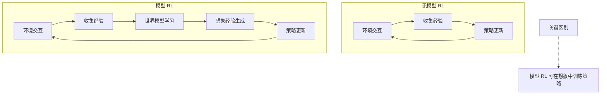
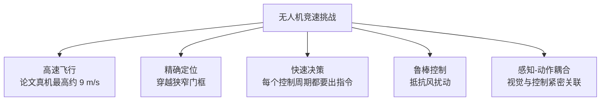
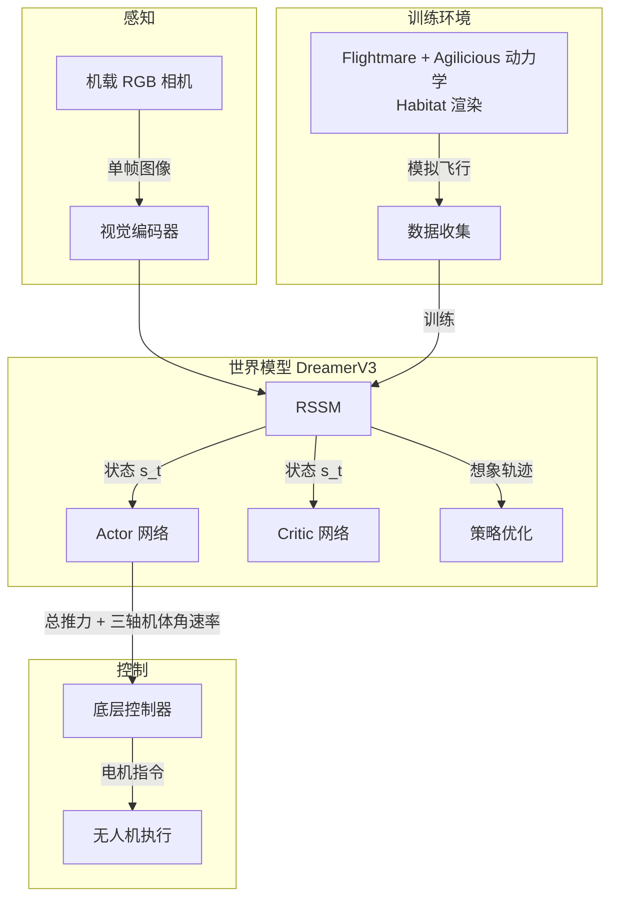
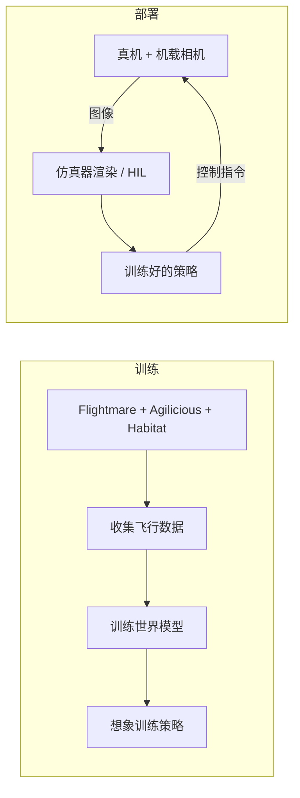
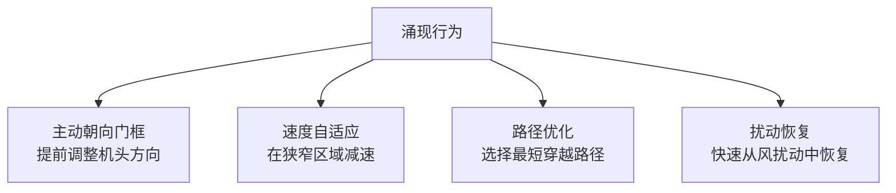
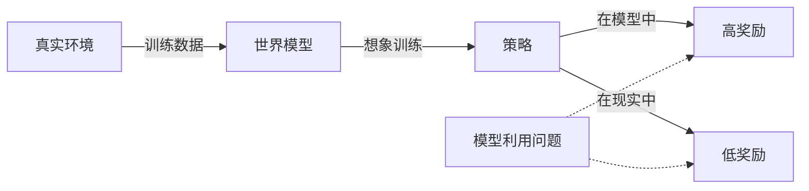
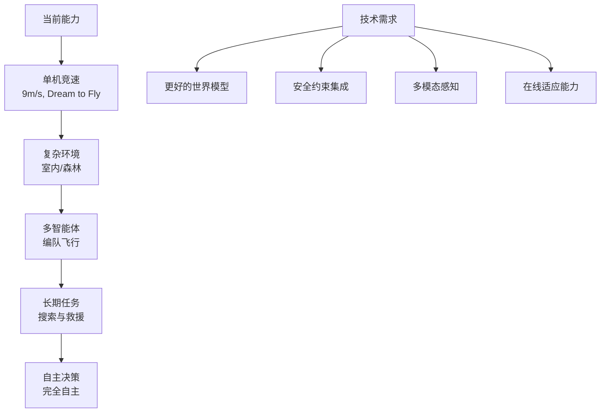
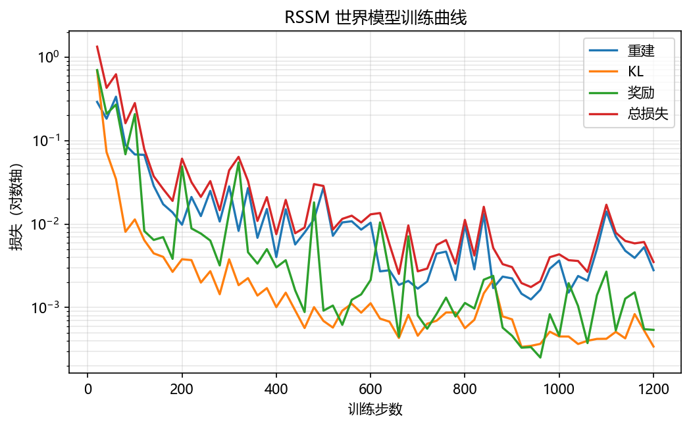
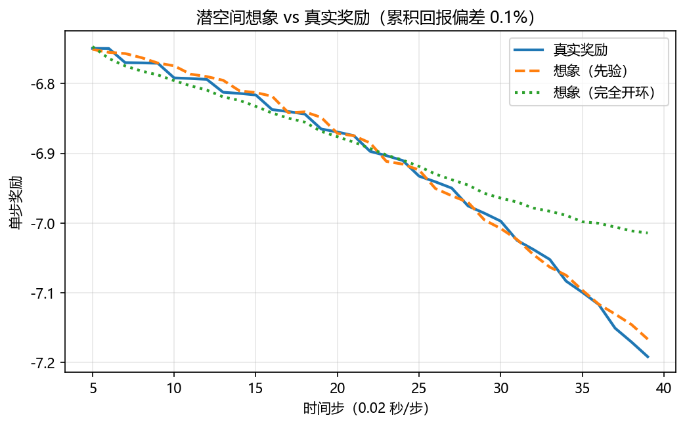

# 模型强化学习世界模型：从 Dreamer 到无人机自主飞行

> **预计阅读：22 分钟 | 前置知识：强化学习基础、策略梯度方法、VAE 原理、循环神经网络**

---

## 1. 模型强化学习中的世界模型

模型强化学习（Model-Based Reinforcement Learning, MBRL）的核心思想是：先学习环境的动态模型（世界模型），再利用该模型进行策略优化。与无模型方法（Model-Free RL）相比，MBRL 可以大幅减少真实环境交互次数，因为它利用模型生成的"想象经验"（imaginary experience）来补充真实经验。


```mermaid
graph TB
    subgraph 无模型 RL
        A1[环境交互] --> B1[收集经验]
        B1 --> C1[策略更新]
        C1 --> A1
    end

    subgraph 模型 RL
        A2[环境交互] --> B2[收集经验]
        B2 --> C2[世界模型学习]
        C2 --> D2[想象经验生成]
        D2 --> E2[策略更新]
        E2 --> A2
    end

    F[关键区别] -.-> G[模型 RL 可在想象中训练策略]
```

Dreamer 系列是这条路线的主干，"Dream to Fly" 把它搬到了无人机竞速上。

---

## 2. Dreamer 系列核心技术解析

### 2.1 RSSM：循环状态空间模型

RSSM（Recurrent State-Space Model）是 Dreamer 系列的核心架构：一条确定性的循环路径负责记忆，一组随机隐变量负责建模不确定性。

```mermaid
graph LR
    subgraph RSSM 状态更新
        A[s_{t-1}<br/>随机状态] --> B[GRU]
        C[h_{t-1}<br/>确定性状态] --> B
        D[a_{t-1}<br/>动作] --> B
        B --> E[h_t<br/>新确定性状态]
        E --> F[先验网络]
        F --> G[s_t^prior<br/>先验随机状态]
        A_obs[观测 o_t] -->|编码器| H[z_t<br/>观测编码]
        E --> I[后验网络]
        H --> I
        I --> J[s_t^post<br/>后验随机状态]
    end
```

**RSSM 的数学表述：**

```
确定性路径: h_t = f(h_{t-1}, s_{t-1}, a_{t-1})          # GRU 更新
先验:       p(s_t | h_t) = N(μ_prior, σ_prior)           # 先验网络
后验:       q(s_t | h_t, o_t) = N(μ_post, σ_post)        # 后验网络（训练时使用）
完整状态:   s_t = [h_t; s_t]                               # 确定性 + 随机性
```

**先验 vs. 后验的作用：**

| 概念 | 训练时 | 推理时 |
|------|--------|--------|
| 先验 (Prior) | 用于 KL 散度正则化 | 用于多步预测（无观测） |
| 后验 (Posterior) | 用于状态估计（有观测） | 不使用（无观测可用） |
| 损失函数 | KL[q(s_t\|h_t,o_t) \|\| p(s_t\|h_t)] | N/A |

### 2.2 想象训练（Imagination Training）

想象训练是 Dreamer 的核心范式：在世界模型中生成虚拟轨迹，用于策略优化。

```mermaid
sequenceDiagram
    participant 真实环境
    participant 世界模型
    participant Actor
    participant Critic

    Note over 真实环境: 真实交互阶段
    loop 每个真实步
        真实环境->>世界模型: 观测 o_t, 动作 a_t
        世界模型->>世界模型: 更新状态 s_t
        世界模型->>世界模型: 存储经验 (s_t, a_t, r_t)
    end

    Note over 世界模型: 想象训练阶段
    loop N 条想象轨迹
        世界模型->>世界模型: 采样初始状态 s_0
        loop H 步想象
            Actor->>世界模型: 动作 a_t = π(s_t)
            世界模型->>世界模型: 预测 s_{t+1}, r_t
            世界模型->>Critic: 价值估计 V(s_t)
        end
        Critic->>Actor: 梯度更新
    end
```

**想象训练的详细步骤：**

1. **状态采样**：从经验回放中采样起始状态 s_0
2. **轨迹展开**：使用当前策略 π 在模型中生成 H 步轨迹
3. **奖励预测**：模型预测每步的奖励 r_t
4. **价值估计**：Critic 网络估计每步的价值 V(s_t)
5. **策略更新**：使用 Actor-Critic 方法更新策略

**关键公式：**

```
想象轨迹: τ = {(s_0, a_0, r_0), (s_1, a_1, r_1), ..., (s_H, a_H, r_H)}

λ-return: V_t^λ = (1-λ) Σ_{n=1}^{H-t} λ^{n-1} G_t^{t+n} + λ^{H-t} V(s_H)
          其中 G_t^{t+n} = Σ_{k=0}^{n-1} γ^k r_{t+k} + γ^n V(s_{t+n})

Actor 损失: L_actor = -E[V_t^λ] + β * H[π(·|s_t)]
Critic 损失: L_critic = E[(V(s_t) - sg(V_t^λ))^2]
```

### 2.3 世界模型损失函数

Dreamer 的世界模型损失函数由多个部分组成：

```python
# 世界模型总损失（概念代码）
def world_model_loss(model, data):
    # 1. 重建损失：观测的负对数似然
    recon_loss = -log p(o_t | s_t)  # 解码器重建

    # 2. 奖励预测损失
    reward_loss = MSE(r_t_pred, r_t)

    # 3. 继续预测损失（episode 是否结束）
    continue_loss = BCE(c_t_pred, c_t)

    # 4. KL 散度正则化
    kl_loss = KL[q(s_t|h_t,o_t) || p(s_t|h_t)]
    # 自由比特：每维度至少 1 nat
    kl_loss = max(kl_loss, free_bits * latent_dim)

    # 5. 总损失
    total = recon_loss + reward_loss + continue_loss + kl_coeff * kl_loss
    return total
```

**各损失项的作用：**

| 损失项 | 数学形式 | 作用 | 权重 |
|--------|---------|------|------|
| 重建损失 | -log p(o\|s) | 确保状态包含观测信息 | 1.0 |
| 奖励损失 | (r_pred - r)^2 | 学习奖励函数 | 1.0 |
| 继续损失 | BCE(c_pred, c) | 学习 episode 终止条件 | 1.0 |
| KL 散度 | KL[q\|\|p] | 正则化先验/后验 | 0.1-1.0 |

### 2.4 从 DreamerV1 到 DreamerV3 的演进

| 特性 | DreamerV1 | DreamerV2 | DreamerV3 |
|------|-----------|-----------|-----------|
| 状态表征 | 连续高斯 | 离散分类 | 离散分类 |
| 预测头 | 直接预测 | 直接预测 | Symlog 预测 |
| KL 正则化 | 标准 KL | 标准 KL | 自由比特 |
| 优化器 | Adam | Adam | 论文未明确 |
| 超参数 | 任务相关 | 任务相关 | **固定超参数** |
| 适用领域 | DMControl | Atari + DMControl | 全领域 |
| 特殊设计 | 无 | 离散 bottleneck | Symlog + 自由比特 |

**DreamerV3 的关键创新详解：**

**1. Symlog 预测**

```python
# 问题：不同任务的奖励/观测尺度差异巨大
# Atari: 奖励 0-100
# DMControl: 奖励 0-1000
# Minecraft: 奖励范围更大

# 解决：对称对数变换
def symlog(x):
    return torch.sign(x) * torch.log(1 + torch.abs(x))

def symexp(x):
    return torch.sign(x) * (torch.exp(torch.abs(x)) - 1)

# 效果：所有信号被压缩到相似的范围
# 网络预测 symlog(x)，推理时用 symexp 恢复
```

**2. 自由比特正则化**

```python
# 问题：KL 散度可能崩溃为 0（posterior collapse）
# 或者过大（信息丢失）

# 解决：设定每维度的最小 KL 值
free_bits = 1.0  # 每维度至少 1 nat
kl_per_dim = KL[q(s_t|h_t,o_t) || p(s_t|h_t)]
kl_loss = torch.sum(torch.max(kl_per_dim, free_bits))
```

---

## 3. Dream to Fly：DreamerV3 无人机竞速

### 3.1 论文概述

**论文：** *"Dream to Fly: Model-Based Reinforcement Learning for Vision-Based Drone Flight"*（[arXiv:2501.14377](https://arxiv.org/abs/2501.14377)）
**作者：** Angel Romero, Ashwin Shenai, Ismail Geles, Elie Aljalbout, Davide Scaramuzza
**会议：** ICRA 2026
**机构：** UZH RPG (Robotics and Perception Group)
**核心贡献：** 让基于原始像素的模型强化学习**直接输出控制指令**完成竞速——没有中间表征、没有显式状态估计，真机速度最高约 9 m/s。

> **勘误（2026-10）**：本节早先写作「首次将 DreamerV3 成功应用于**真实无人机竞速**」，并把真机环节描述成「收集少量真实数据、微调世界模型」。论文的真机部分是**硬件在环（HIL）**：图像仍由仿真器渲染后送进网络，网络输出的指令发给真机，**没有在真实数据上微调世界模型**。原文：*"For the deployment in the real world, we use a hardware-in-the-loop (HIL) setup, where the images are rendered using the habitat simulator and fed into the network, and the commands produced are sent directly to the real drone platform."*

### 3.2 问题定义

无人机竞速面临的核心挑战：


```mermaid
graph TB
    A[无人机竞速挑战] --> B[高速飞行<br/>论文真机最高约 9 m/s]
    A --> C[精确定位<br/>穿越狭窄门框]
    A --> D[快速决策<br/>每个控制周期都要出指令]
    A --> E[鲁棒控制<br/>抵抗风扰动]
    A --> F[感知-动作耦合<br/>视觉与控制紧密关联]
```

**竞速任务的特殊要求：**

| 要求 | 挑战 |
|------|------|
| 高速飞行 | 单帧图像里可用的几何线索随速度迅速变化 |
| 端到端低延迟 | 策略必须每个控制周期给出一次指令 |
| 穿越狭窄门框 | 允许的位置误差很小，而观测里没有显式定位 |
| 光照与风扰鲁棒 | 观测只有图像，扰动只能从像素间接反映 |
| 不坠机 | 高速下容错窗口极短 |

> 上表只列任务本身的要求。**论文没有给出延迟、定位精度这类量化指标** —— 早先版本曾在此列出「<50ms 反应时间」「<10cm 定位精度」，那两个数字不在论文中。

### 3.3 系统架构

Dream to Fly 的完整系统架构：


```mermaid
graph TB
    subgraph 感知
        A[机载 RGB 相机] -->|单帧图像| B[视觉编码器]
    end

    subgraph 世界模型 DreamerV3
        B --> G[RSSM]
        G -->|状态 s_t| H[Actor 网络]
        G -->|状态 s_t| I[Critic 网络]
        G -->|想象轨迹| J[策略优化]
    end

    subgraph 控制
        H -->|总推力 + 三轴机体角速率| K[底层控制器]
        K -->|电机指令| L[无人机执行]
    end

    subgraph 训练环境
        M[Flightmare + Agilicious 动力学<br/>Habitat 渲染] -->|模拟飞行| N[数据收集]
        N -->|训练| G
    end
```

> **勘误（2026-10）**：早先的架构图画了「IMU → 状态估计器 → 位姿估计」这条支路，并把仿真器标成 Gazebo/Isaac Sim。两处都不对：论文的观测**只有图像**，它卖的恰恰是「不做显式状态估计」；仿真环境是 Flightmare + Agilicious 的动力学配 Habitat 渲染器。原文：*"learning directly from pixels to actions, without the need for explicit state estimation – remains largely unfulfilled"*、*"Our experiments were conducted within a high-fidelity simulation environment combining Flightmare and Agilicious... we integrated the Habitat simulator"*。

### 3.4 关键设计决策

**决策 1：表征沿用 DreamerV3 的离散隐状态**

论文用 DreamerV3，而 DreamerV3 的随机状态是**离散分类**，不是连续高斯：

> *"The world model encodes sensory inputs into discrete representations ... that are predicted by a sequence model with recurrent state"*

「连续高斯」是 DreamerV1 的做法。**早先版本这里写反了**，写成「Dream to Fly 使用 DreamerV3 的连续高斯表征，而非 DreamerV2 的离散表征」——实际 V1→V2 把连续换成了离散，V3 沿用了 V2 的离散，没有换回去。

**决策 2：观测与动作空间**

论文的设计非常克制：观测只有图像，动作是标准四旋翼指令。

```python
# 观测：只有 RGB 图像（论文未给尺寸数值，勿照抄旧版的 64x64）
observation_space = gym.spaces.Box(0, 1, (H, W, 3))

# 动作：质量归一化总推力 + 机体三轴角速率（CTBR 约定）
action_space = gym.spaces.Box(-1, 1, (4,))   # thrust, wx, wy, wz
```

> 原文：*"The observation space consists of RGB images captured at each time step"*、*"the policy outputs a four-dimensional action vector ... the mass-normalized collective thrust, and ... the body rate setpoints in the drone's body frame."*
>
> **勘误（2026-10）**：早先版本在此列过 `velocity`、`angular_velocity`、`gate_relative_pose` 三个观测通道，并把动作注成 `roll, pitch, yaw_rate, thrust`。这些都不在论文里。

**决策 3：奖励函数设计**

奖励刻意做得极简，**没有人工设计的朝向奖励**：

```python
def compute_reward(...):
    # 1. 进度项：沿赛道推进的进度（论文奖励的主体）
    # 2. 角速率惩罚：抑制过大的机体角速率
    # 3. 三个离散事件奖励：碰撞 / 过门 / 完赛
    return progress_reward - body_rate_penalty + event_rewards
```

> 原文：*"The primary component of the reward ... is called the progress term ... The term ... penalizes excessive body rates."*

「朝向」这件事论文专门强调过：它是**涌现出来的**，不是奖励项写出来的 —— *"a perception-aware behaviour ... emerges without the need of handcrafted reward terms for the viewing direction."*

> **勘误（2026-10）**：早先版本在此列了 `gate_reward = 10.0`、`heading_reward`、`safety_penalty`、`energy_penalty` 四项，论文中都没有。

### 3.5 训练流程

Dream to Fly 的训练全程在仿真里完成，真机只做部署验证：


```mermaid
graph LR
    subgraph 训练
        A[Flightmare + Agilicious + Habitat] --> B[收集飞行数据]
        B --> C[训练世界模型]
        C --> D[想象训练策略]
    end
    subgraph 部署
        E[真机 + 机载相机] -->|图像| F[仿真器渲染 / HIL]
        F --> G[训练好的策略]
        G -->|控制指令| E
    end
```

| 参数 | 值 | 说明 |
|------|-----|------|
| 环境交互步数 | 20M | 论文写「收敛需要 2000 万步」 |
| 训练时间 | 约 240 小时 | 论文报的是这个量级 |
| GPU | 单张 Quadro RTX 8000 | 论文原文 |
| 想象 horizon / batch / 学习率 | 未公开 | 正文 HTML 未渲染出这三个数值，不要拿 DreamerV3 默认值来填 |

> **勘误（2026-10）**：本节早先写的是「两阶段：仿真预训练 + 真实微调」，超参表填了 10M 步 / 12 小时 / RTX 3090，并另附一张「真实交互 50K 步、混合策略 80%+20%」的表。论文没有第二阶段 —— 真机是 HIL 部署；训练规模是 20M 步、约 240 小时、Quadro RTX 8000。原文：*"a policy that performs to convergence (for 20 million steps ... our architecture takes an average time of 240 hours."*、*"All experiments were performed on a single Quadro RTX 8000."*

### 3.6 涌现的感知感知行为（Emergent Perception-Aware Behavior）

Dream to Fly 最令人惊讶的发现是：**无需显式设计，智能体自发涌现了感知感知行为（Perception-Aware Behavior）**。


```mermaid
graph TB
    A[涌现行为] --> B[主动朝向门框<br/>提前调整机头方向]
    A --> C[速度自适应<br/>在狭窄区域减速]
    A --> D[路径优化<br/>选择最短穿越路径]
    A --> E[扰动恢复<br/>快速从风扰动中恢复]
```

**涌现行为的分析：**

| 行为 | 传统方法需要 | Dreamer 涌现 | 原因分析 |
|------|-------------|-------------|---------|
| 主动朝向 | 显式设计 heading reward | 自动出现 | 模型学到朝向门框可获得更高奖励 |
| 速度自适应 | 显式设计速度约束 | 自动出现 | 模型学到高速碰撞的负面后果 |
| 路径优化 | 显式设计路径代价 | 自动出现 | 模型学到更短路径 = 更快完成 |
| 扰动恢复 | 显式设计鲁棒性损失 | 自动出现 | 模型在训练中见过各种扰动 |

**为什么涌现行为重要：**
- 减少了手工设计奖励函数的需求
- 行为更加自然和灵活
- 可能发现人类未考虑到的策略
- 表明世界模型确实学到了有意义的环境动态

### 3.7 实验结果

论文在这一节里**没有给结果表格**。仿真实验报的是三条赛道（Circle / Kidney / Figure 8）上的奖励收敛曲线（Fig. 3）与画面重构（Fig. 4），真机实验报的是同一赛道上仿真与真实轨迹、速度曲线的对比（Fig. 6）。可用的定量事实只有两条：

- **基线学不动。** 原文：*"We show that none PPO nor SAC are able to achieve any considerable training in 20 million environment interactions, while DreamerV3 is able to train to convergence for the three tracks."* —— 这比一张「94.3% vs 71.2%」的完赛率表更能说明问题：不是 DreamerV3 好一点点，而是无模型方法在这个任务上根本没起步。
- **真机速度最高约 9 m/s**，但那是 HIL 下的速度，图像仍来自仿真器。

> **勘误（2026-10）**：本节早先列过三张表 ——「仿真完赛率 94.3% vs SAC 71.2% vs PPO 65.8%」、「真机 vs 人工飞手」、「达到 80% 完赛率所需交互步数（50K / 500K / 1M）」。这三张表在论文中都不存在，论文也没有与人类飞手做过定量对比。已整段删除。

---

## 4. 模型强化学习的关键技术细节

### 4.1 Actor-Critic 在想象中的训练

Dreamer 使用的 Actor-Critic 方法与传统方法有本质区别：

| 方面 | 传统 Actor-Critic | Dreamer 想象训练 |
|------|-------------------|-----------------|
| 训练数据 | 真实环境交互 | 模型生成的想象轨迹 |
| 价值函数 | 在真实状态上训练 | 在想象状态上训练 |
| 策略梯度 | 来自真实奖励 | 来自想象奖励 |
| 样本效率 | 低（需要大量真实交互） | 高（想象无限） |
| 偏差来源 | 无模型偏差 | 模型偏差 |

**λ-return 的作用：**

```
λ-return 平衡了偏差和方差：
- λ=0: 只用一步 TD 估计（低方差，高偏差）
- λ=1: 用完整的 Monte Carlo 回报（高方差，低偏差）
- λ=0.95: Dreamer 使用的默认值（平衡）
```

### 4.2 模型利用问题（Model Exploitation）

模型强化学习面临的核心挑战之一是"模型利用"：策略可能找到世界模型中的漏洞，获得模型中高但现实中低的奖励。


```mermaid
graph LR
    A[真实环境] -->|训练数据| B[世界模型]
    B -->|想象训练| C[策略]
    C -->|在模型中| D[高奖励]
    C -->|在现实中| E[低奖励]
    F[模型利用问题] -.-> D
    F -.-> E
```

**缓解策略：**

| 方法 | 原理 | 效果 |
|------|------|------|
| 数据多样化 | 收集更多样的训练数据 | 模型更准确 |
| 模型集成 | 使用多个模型，取保守估计 | 降低过度乐观 |
| 正则化 | KL 正则化防止状态空间塌缩 | 保持表征质量 |
| 混合训练 | 结合真实和想象经验 | 锚定在真实分布 |
| 模型不确定性 | 在不确定性高的区域保守 | 避免不可靠预测 |

### 4.3 探索与利用的平衡

在 MBRL 中，探索有两层含义：

1. **环境探索**：收集更多样的环境数据以改进模型
2. **策略探索**：在想象中尝试新的策略

**Dreamer 的探索机制：**

```python
# Actor 损失中加入熵正则化
actor_loss = -value_loss + entropy_coeff * entropy

# 熵正则化鼓励策略探索
# 在想象中尝试更多样的动作
```

---

## 5. 其他模型 RL 世界模型工作

### 5.1 MuZero（DeepMind, 2020）

MuZero 将世界模型与 MCTS（蒙特卡洛树搜索）结合：

| 特性 | Dreamer | MuZero |
|------|---------|--------|
| 规划方式 | Actor-Critic | MCTS |
| 状态空间 | 连续 | 离散 |
| 适用领域 | 连续控制 | 棋类、Atari |
| 模型学习 | 端到端 | 联合学习动态和价值 |

### 5.2 SimPLe（Kaiser et al., 2020）

SimPLe（Simulated Policy Learning）专注于 Atari 100k 基准：

- 使用视频预测模型作为世界模型
- 在模型中训练策略
- 仅用 100k 环境步数达到合理性能

### 5.3 IRIS（Vincent et al., 2023）

IRIS 使用 Transformer 作为世界模型：

- 将观测和动作 token 化
- 使用 GPT 风格的自回归预测
- 在 Atari 100k 上超越 DreamerV2

---

## 6. 模型 RL 世界模型在无人机中的应用前景

### 6.1 应用场景

| 场景 | 模型 RL 优势 | 挑战 |
|------|-------------|------|
| 竞速 | 样本效率高，可涌现高级行为 | 高速下的精确建模 |
| 避障 | 可在想象中测试危险场景 | 安全关键，模型误差不可容忍 |
| 编队飞行 | 多智能体模型学习 | 交互复杂，建模困难 |
| 任务规划 | 在想象中预演不同方案 | 长期预测的准确性 |

### 6.2 技术路线图


```mermaid
graph TB
    A[当前能力] --> B[单机竞速<br/>9m/s, Dream to Fly]
    B --> C[复杂环境<br/>室内/森林]
    C --> D[多智能体<br/>编队飞行]
    D --> E[长期任务<br/>搜索与救援]
    E --> F[自主决策<br/>完全自主]

    G[技术需求] --> H[更好的世界模型]
    G --> I[安全约束集成]
    G --> J[多模态感知]
    G --> K[在线适应能力]
```

---

## 7. 关键论文

- **[ICLR'20] Dream to Control** — *Dream to Control: Learning Behaviors by Latent Imagination*  
  [](https://arxiv.org/abs/1912.01603)
  RSSM, 想象训练

- **[ICLR'21] Mastering Atari with Discrete World Models** — *Hafner et al.*  
  [](https://arxiv.org/abs/2010.02193)
  离散表征

- **[Nature'25] Mastering Diverse Domains through World Models** — *Hafner et al.*  
  [](https://arxiv.org/abs/2301.04104)
  Symlog, 跨域泛化, Nature 2025 版标题为《Mastering diverse control tasks through world models》

- **[ICRA'25] Dream to Fly** — *Dream to Fly: Model-Based Reinforcement Learning for Vision-Based Drone Flight*  
  [](https://arxiv.org/abs/2501.14377)
  像素端到端竞速, 涌现感知行为

- **[Nature'20] MuZero** — *Mastering Atari, Go, Chess and Shogi by Planning with a Learned Model*  
  [](https://arxiv.org/abs/1911.08265)
  MCTS + 世界模型

- **[ICML'20] SimPLe** — *Model-Based Reinforcement Learning for Atari*  
  [](https://arxiv.org/abs/1903.00374)
  视频预测 MBRL

- **[ICLR'23] IRIS** — *Transformers are Sample-Efficient World Models (IRIS)*  
  [](https://arxiv.org/abs/2209.00588)
  Transformer 世界模型


---

> **本章的 RSSM 是「重建 + 想象训练」这一路的代表。** 与它并列的还有一条不重建观测、只在表征空间做预测的路线，两者的判据会互相干扰，因此单独成篇：见 [08-联合嵌入预测与潜空间世界模型](./08-联合嵌入预测与潜空间世界模型.md) §5。

---

## 8. 动手验证：RSSM 的"想象"到底有多准？

2.2 节说 Dreamer 完全在潜空间里想象训练、不碰真实环境。这件事成立的前提是：**只用先验推演出来的未来，必须和真实未来足够接近**。这一节用一个约 30 行的 RSSM 把它量出来。

### 8.1 模型与损失

```python
import torch, torch.nn as nn, torch.nn.functional as F

class RSSM(nn.Module):
    """h 是确定性隐状态（GRU 承载），z 是随机隐状态（对角高斯）。
    先验 p(z|h) 用于想象，后验 q(z|h,obs) 用于训练时吸收观测。"""
    def __init__(self, obs_dim=12, act_dim=4, h=128, z=16):
        super().__init__(); self.h, self.z = h, z
        self.enc   = nn.Sequential(nn.Linear(obs_dim, h), nn.SiLU())
        self.gru   = nn.GRUCell(h + act_dim, h)
        self.prior = nn.Sequential(nn.Linear(h, h), nn.SiLU(), nn.Linear(h, 2 * z))
        self.post  = nn.Sequential(nn.Linear(h + obs_dim, h), nn.SiLU(), nn.Linear(h, 2 * z))
        self.dec   = nn.Sequential(nn.Linear(h + z, h), nn.SiLU(), nn.Linear(h, obs_dim))
        self.rew   = nn.Sequential(nn.Linear(h + z, h), nn.SiLU(), nn.Linear(h, 1))

    def forward(self, obs, act, hx, z):
        hx = self.gru(torch.cat([self.enc(obs), act], -1), hx)
        mu_p, ls_p = self.prior(hx).chunk(2, -1)
        mu_q, ls_q = self.post(torch.cat([hx, obs], -1)).chunk(2, -1)
        z = mu_q + ls_q.clamp(-4, 4).exp() * torch.randn_like(mu_q)   # 重参数化
        return hx, z, torch.cat([hx, z], -1), (mu_p, ls_p), (mu_q, ls_q)

def kl_balanced(mu_p, ls_p, mu_q, ls_q, alpha=0.8):
    """alpha*kl.detach() 只推动先验去追后验；(1-alpha)*kl 同时训练两边。
    DreamerV3 用这个平衡技巧防止后验塌缩。"""
    ls_p, ls_q = ls_p.clamp(-4, 4), ls_q.clamp(-4, 4)
    kl = 0.5 * ((mu_q - mu_p).pow(2) / ls_p.exp().pow(2)
                + ls_p.exp().pow(2) / ls_q.exp().pow(2) - 1 + 2 * (ls_q - ls_p))
    return (alpha * kl.detach() + (1 - alpha) * kl).sum(-1).mean()
```

状态取 12 维 `[p(3), v(3), rpy(3), ω(3)]`，动作取 4 维 `[thrust, ωx, ωy, ωz]`，`dt = 0.02` 秒。

### 8.2 本地实测结果

用 256 条并行轨迹、每条 40 步（0.8 秒）采集数据，训练 1200 步：

```text
  step        重建        KL        奖励       总损失
   200    0.0098    0.0038    0.0490     0.0607
   400    0.0040    0.0010    0.0030     0.0076
   600    0.0104    0.0011    0.0021     0.0131
   800    0.0098    0.0006    0.0011     0.0112
  1000    0.0037    0.0004    0.0005     0.0043
  1200    0.0028    0.0003    0.0005     0.0035

想象 rollout 回报  预测 -242.0 | 真实 -242.2 | 偏差 0.1%
完全开环 rollout   预测 -241.2 | 真实 -242.2 | 偏差 0.4%
```

两种推演方式的区别值得注意：

| 方式 | z 的来源 | GRU 的输入 | 结果 |
|---|---|---|---|
| **先验 rollout** | 先验 p(z\|h) 采样 | 真实观测 | 偏差 0.1% |
| **完全开环** | 先验 p(z\|h) 采样 | 上一步**解码**出的观测 | 偏差 0.4% |

也就是说，即使把解码出的观测再喂回去、让误差有机会滚雪球，在这个 0.8 秒的短时程上也只掉到 0.4%。**时程一长这个数字会迅速恶化** —— 这正是 Dreamer 类方法在长时程任务上仍然吃力的原因。





### 8.3 【待验证】接入 PX4 SITL：采真实飞行数据

上面的数据全部来自 `code/common/quad_sim.py` 这个玩具仿真。要让世界模型见真章，下一步是**用 PX4 SITL 或真机采数据**，再拿同一份训练代码去拟合。

> **未在本地验证**：本节代码需要 Ubuntu + PX4 + MicroXRCEAgent 才能运行，本仓库的验证环境是 Windows，没有跑过。订阅/发布的**字段名请以你安装的 `px4_msgs` 版本为准**。

```python
import rclpy
from rclpy.node import Node
from rclpy.qos import QoSProfile, ReliabilityPolicy, DurabilityPolicy, HistoryPolicy
from px4_msgs.msg import (OffboardControlMode, TrajectorySetpoint,
                          VehicleCommand, VehicleLocalPosition)

def px4_qos(depth=1):
    """PX4 话题统一用 BEST_EFFORT + TRANSIENT_LOCAL，否则收不到数据。"""
    return QoSProfile(reliability=ReliabilityPolicy.BEST_EFFORT,
                      durability=DurabilityPolicy.TRANSIENT_LOCAL,
                      history=HistoryPolicy.KEEP_LAST, depth=depth)

class DataCollector(Node):
    """把 VehicleLocalPosition 拼成世界模型的 12 维观测并落盘。"""
    def __init__(self):
        super().__init__('wm_data_collector')
        self.create_subscription(VehicleLocalPosition, '/fmu/out/vehicle_local_position',
                                 self.on_pos, px4_qos())
        self.obs_buf, self.act_buf = [], []

    def on_pos(self, m):
        # 注意 PX4 用的是 NED 坐标系（z 向下）、FRD 机体坐标系，
        # 与训练时的 ENU/对角约定不一致，落盘前必须做一次坐标变换
        self.obs_buf.append([m.x, m.y, m.z, m.vx, m.vy, m.vz,
                             m.roll, m.pitch, m.yaw, m.rollspeed, m.pitchspeed, m.yawspeed])

    def switch_to_offboard(self, pub_cmd):
        """切 OFFBOARD 前必须先持续发 setpoint，否则 PX4 会拒绝切换。"""
        cmd = VehicleCommand()
        cmd.command = VehicleCommand.VEHICLE_CMD_DO_SET_MODE
        cmd.param1, cmd.param2 = 1.0, 6.0     # 6 = OFFBOARD
        cmd.target_system, cmd.target_component = 1, 1
        cmd.from_external = True
        pub_cmd.publish(cmd)
```

采到的数据按 `(batch, time, feat)` 堆叠后，直接喂给 8.1 的 `RSSM` 即可 —— 训练代码一行都不用改。**踩过的坑**：`obs`、`act`、`rew` 必须沿同一个维度堆叠，否则批次下标会被当成时间下标，报 `index 61 is out of bounds for dimension 0 with size 40`。

### 8.4 运行完整脚本

```bash
py -3.9 code/a_worldmodel_rssm.py     # 约 30 秒，CPU 即可
```

完整脚本（含数据采集、训练循环、想象 rollout、出图）：[`code/a_worldmodel_rssm.py`](../../code/a_worldmodel_rssm.py)

---

## 9. 延伸阅读

- [01-世界模型发展史](./01-世界模型发展史.md) — Dreamer 系列在世界模型发展中的位置
- [02-生成式世界模型](./02-生成式世界模型.md) — 生成式方法与模型 RL 方法的对比
- [04-3D场景世界模型](./04-3D场景世界模型.md) — 3D 场景表示作为世界模型
- [05-无人机世界模型综述](./05-无人机世界模型综述.md) — 无人机专用世界模型全景
- [06-关键数据集与基准](./06-关键数据集与基准.md) — 评估世界模型的基准

---

## 10. 思考题

### 题目 1：RSSM 的先验与后验

解释 RSSM 中先验（prior）和后验（posterior）的区别。为什么训练时使用后验，推理时使用先验？

<details>
<summary>参考答案</summary>

**先验（Prior）：**
- 定义：p(s_t | h_t)，仅基于确定性状态 h_t 预测随机状态 s_t
- 输入：只有历史信息（通过 GRU 传递）
- 用途：推理时的多步预测（因为没有真实观测可用）
- 特点：不依赖当前观测，只能基于历史推断

**后验（Posterior）：**
- 定义：q(s_t | h_t, o_t)，基于确定性状态和当前观测预测随机状态
- 输入：历史信息 + 当前观测
- 用途：训练时的状态估计
- 特点：利用了当前观测，估计更准确

**为什么训练时用后验？**
- 后验利用了更多信息（观测），估计更准确
- 准确的状态估计有助于学习更好的动态模型
- 后验作为"教师"，指导先验的学习方向

**为什么推理时用先验？**
- 推理时（想象阶段）没有真实观测可用
- 先验是唯一的预测手段
- 如果先验足够好，想象的轨迹就足够准确

**KL 散度的作用：**
- KL[q(s_t|h_t,o_t) || p(s_t|h_t)] 惩罚后验偏离先验的程度
- 效果：迫使先验向后验靠拢，提高先验的预测能力
- 如果没有 KL 惩罚，后验可能忽略先验，导致先验无法用于推理

**直观类比：**
- 后验像是"带答案做题"（有观测，可以验证）
- 先验像是"不带答案做题"（无观测，只能预测）
- KL 散度像是"监督"：确保"不带答案"的能力向"带答案"看齐
</details>

### 题目 2：涌现行为的机制

Dream to Fly 中涌现了感知感知行为（如主动朝向门框）。分析这种涌现行为的可能机制，以及是否可以显式设计来获得类似效果。

<details>
<summary>参考答案</summary>

**涌现行为的机制分析：**

1. **隐式奖励塑造：**
   - 世界模型学到了"朝向门框 → 更容易穿越 → 更高奖励"的因果关系
   - 虽然奖励函数没有直接奖励朝向，但模型理解了这个间接关系
   - Actor 在想象中发现：提前调整机头方向的轨迹获得更高回报

2. **模型的物理理解：**
   - 世界模型学到了无人机动力学：朝向错误 → 需要更大修正 → 耗时更多
   - 模型理解了"预防胜于治疗"：提前调整比临时修正更高效
   - 这种理解通过想象训练传递给了策略

3. **价值函数的引导：**
   - Critic 学到了：朝向门框的状态有更高价值
   - Actor 被训练朝高价值状态行动
   - 价值函数隐式编码了"好的朝向"

**是否可以显式设计：**

| 方法 | 优点 | 缺点 |
|------|------|------|
| 显式 heading reward | 直接、可控 | 可能不自然，需要调参 |
| 显式速度约束 | 安全保证 | 可能过于保守 |
| Dreamer 涌现 | 自然、灵活 | 不可控，依赖模型质量 |

**显式设计的挑战：**
- 难以预见所有需要的高级行为
- 奖励函数设计是"黑艺术"
- 可能遗漏重要的行为模式

**结论：**
- 涌现行为是世界模型的重要优势
- 它减少了手工设计的需求
- 但也带来了可控性的挑战
- 理想方案：基础行为显式设计，高级行为允许涌现
</details>

### 题目 3：样本效率的对照组该怎么做

Dream to Fly 在仿真里训练到收敛（2000 万步环境交互），而无模型方法 PPO / SAC 在同样的 2000 万步里**完全学不动**。如果要证明「MBRL 比无模型方法样本效率高」，这个对照实验还缺哪一块？

<details>
<summary>参考答案</summary>

**先把论文已有的结论摆清楚。** 原文：*"We show that none PPO nor SAC are able to achieve any considerable training in 20 million environment interactions, while DreamerV3 is able to train to convergence for the three tracks."*

这是一条**在相同交互预算下，无模型方法根本没起步**的结论 —— 它比「我们用了 50K 步、他们用了 500K 步」这类数字更有说服力，因为它不需要假设两者的曲线形状可比。

**但「样本效率更高」这个说法仍然缺一块：公平性。** 三点要问：

1. **交互预算相同吗？** 论文给了 20M 步这个共同上界，这一条成立。
2. **单位「步」可比吗？** MBRL 每步要额外更新世界模型，无模型方法每步只更新策略。按 wall-clock 或按计算量算，「样本效率」的优势可能被吃掉。论文报的是 240 小时单卡训练，无模型方法的同等训练时间是多少，论文没给。
3. **有没有调过无模型方法的超参？** 一个学不动的基线，既可能是方法本身不行，也可能是没调好。论文没有给 PPO/SAC 的调参过程。

**最该补的对照实验：** 把 PPO/SAC 的交互预算放大到 DreamerV3 的 2-4 倍，看它们能否爬到同等性能。如果放大了仍然学不动，那才是「MBRL 更高效」的硬证据；如果放大了就追上了，那结论要改成「MBRL 在**低预算**下更高效」。

**MBRL 的代价（这部分与论文无关，是通用常识）：**
- 需要额外训练世界模型
- 模型误差可能被策略利用，产生「模型里高分、现实里失败」的行为
- 需要平衡模型准确性与策略优化

> **本节原题面为「Dream to Fly 使用 50K 真实交互步数达到 89.7% 完赛率」，该数字在论文中不存在，已重写。**
</details>

### 题目 4：安全关键应用的挑战

将 DreamerV3 应用于安全关键的无人机任务（如载人飞行、城市巡检）面临哪些挑战？如何应对？

<details>
<summary>参考答案</summary>

**挑战分析：**

1. **模型误差的不可容忍性：**
   - 竞速任务：碰撞 → 重新开始
   - 安全任务：碰撞 → 严重后果
   - 世界模型的预测误差可能在安全关键区域被放大

2. **想象训练的局限性：**
   - 想象中"成功"的策略可能在现实中失败
   - 模型可能无法准确预测边缘情况（如设备故障）
   - 缺乏真实世界的安全反馈

3. **可解释性不足：**
   - 神经网络的决策过程是黑盒
   - 难以验证策略的安全性
   - 监管机构可能不接受不可解释的系统

4. **分布外泛化：**
   - 训练数据可能不覆盖所有安全关键场景
   - 模型在分布外可能产生不可预测的行为
   - 安全关键系统需要在所有情况下工作

**应对策略：**

1. **安全层叠加：**
   - 在学习策略上叠加安全层
   - 安全层使用传统控制理论（如 CBF - Control Barrier Functions）
   - 学习策略负责性能，安全层负责安全

2. **模型不确定性感知：**
   - 使用模型集成估计不确定性
   - 在不确定性高时保守行动
   - 不确定性超阈值时切换到安全模式

3. **形式化验证：**
   - 对关键组件进行形式化验证
   - 使用可验证的网络架构（如线性区域网络）
   - 建立安全边界和保证

4. **人在回路：**
   - 关键决策引入人类监督
   - 提供预测结果的可视化
   - 允许人类否决或修正策略

5. **渐进式部署：**
   - 从低风险场景开始
   - 逐步增加任务复杂度
   - 建立信任和验证历史
</details>

---

> **下一节**：[04-3D场景世界模型](./04-3D场景世界模型.md) — 了解 NeRF 和 3DGS 如何为无人机提供精确的 3D 世界模型。
