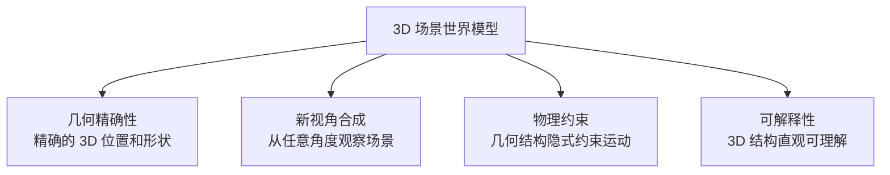
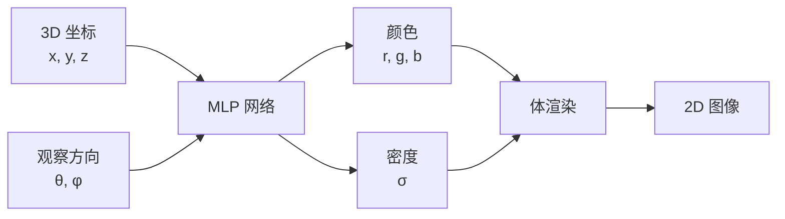
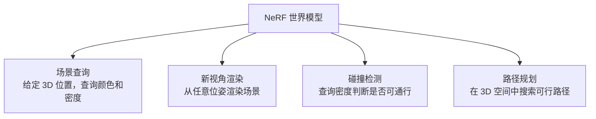
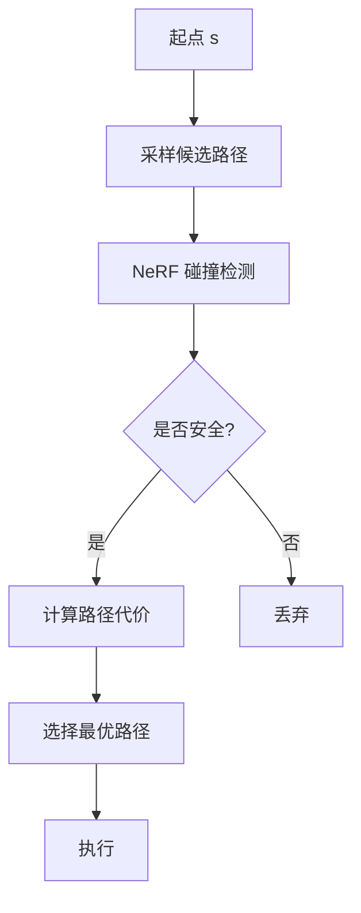
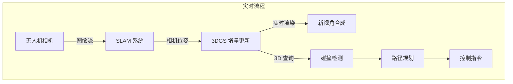
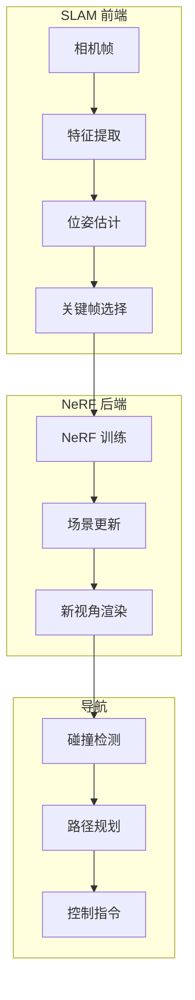
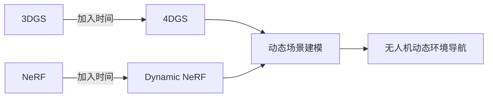
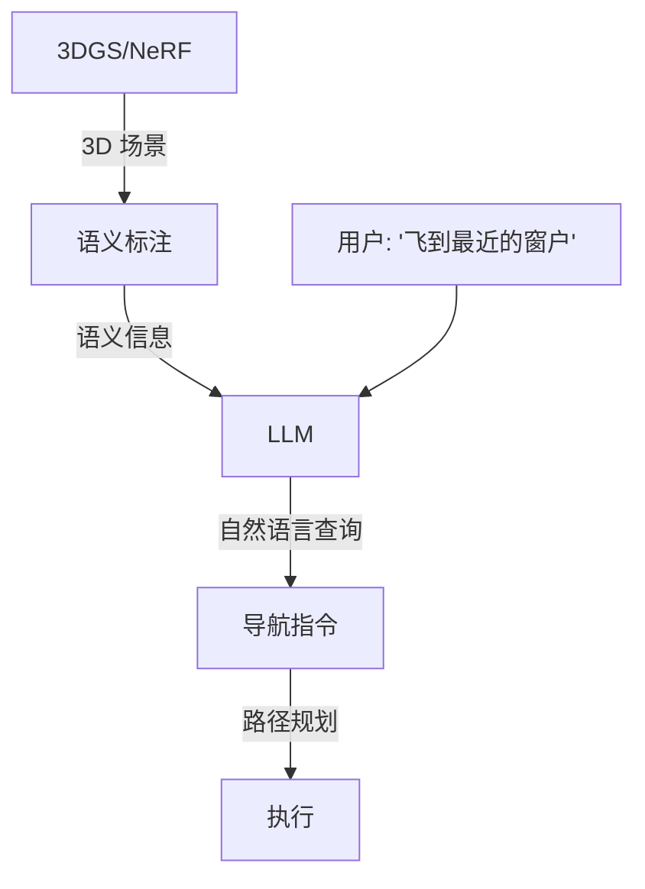

# 3D 场景世界模型：NeRF 与 3D Gaussian Splatting

> **预计阅读：18 分钟 | 前置知识：计算机视觉基础、射影几何、渲染原理**

---

## 1. 引言：3D 场景表示作为世界模型

在前面的章节中，我们讨论了基于潜在状态和视频生成的世界模型。本节介绍第三种范式：**3D 场景表示作为世界模型**。

与前两种范式不同，3D 场景世界模型直接建模环境的三维几何结构，提供：



两种主要的 3D 场景表示方法——NeRF（Neural Radiance Fields）和 3DGS（3D Gaussian Splatting）——正在成为无人机世界模型的重要基础。

---

## 2. NeRF：神经辐射场

### 2.1 基本原理

NeRF（Mildenhall et al., 2020）使用神经网络隐式表示 3D 场景的辐射场：

```python
# NeRF 核心函数
F_θ: (x, y, z, θ, φ) → (r, g, b, σ)

# 输入: 3D 坐标 (x,y,z) + 观察方向 (θ,φ)
# 输出: 颜色 (r,g,b) + 密度 σ
```



### 2.2 体渲染方程

NeRF 使用体渲染（Volume Rendering）将 3D 辐射场渲染为 2D 图像：

```
C(r) = ∫_{t_n}^{t_f} T(t) · σ(r(t)) · c(r(t), d) dt

其中:
- C(r): 像素的最终颜色
- T(t) = exp(-∫_{t_n}^{t} σ(r(s)) ds): 累积透射率
- σ(r(t)): 位置 r(t) 处的密度
- c(r(t), d): 位置 r(t) 在方向 d 处的颜色
```

**离散化近似：**

```python
# 分层采样
t_i = t_n + (t_f - t_n) * i / N  # N 个采样点

# 累积透射率
T_i = exp(-sum(σ_j * δ_j for j in range(i)))

# 像素颜色
C = sum(T_i * σ_i * c_i * δ_i for i in range(N))
```

### 2.3 NeRF 的变体

| 变体 | 创新点 | 速度提升 | 质量变化 |
|------|--------|---------|---------|
| NeRF (原始) | 基础 MLP | 1x | 基准 |
| Mip-NeRF | 多尺度表示 | 1x | 更好 |
| Instant-NGP | 哈希编码 | 1000x | 略降 |
| Nerfacto | 模块化设计 | 50x | 更好 |
| NeRF-SLAM | 实时 SLAM | 100x | 中等 |

### 2.4 NeRF 作为世界模型

NeRF 作为世界模型的核心优势是提供精确的 3D 场景表示：



**NeRF 用于无人机导航的典型流程：**

| 步骤 | 操作 | 输出 |
|------|------|------|
| 1 | 收集场景图像 | 多视角图像 + 相机位姿 |
| 2 | 训练 NeRF | 场景的隐式 3D 表示 |
| 3 | 场景查询 | 给定位置查询可通行性 |
| 4 | 路径规划 | 在 3D 空间中搜索安全路径 |
| 5 | 执行飞行 | 沿规划路径飞行 |

---

## 3. NeRF-Nav：基于 NeRF 的导航

### 3.1 论文概述

NeRF-Nav 系列工作探索了将 NeRF 作为无人机导航的世界模型：

**核心思想：**
1. 使用 NeRF 学习环境的 3D 表示
2. 在 NeRF 中进行路径规划
3. 利用 NeRF 的密度信息进行碰撞检测

### 3.2 碰撞检测

```python
# NeRF 碰撞检测
def is_collision(nerf, position, threshold=0.5):
    """
    查询 NeRF 在给定位置的密度
    密度 > threshold 表示有物体（碰撞）
    """
    density = nerf.query_density(position)
    return density > threshold

# 路径可行性检查
def check_path(nerf, path_points):
    """检查路径上所有点是否安全"""
    for point in path_points:
        if is_collision(nerf, point):
            return False
    return True
```

### 3.3 路径规划



**路径规划算法：**

| 算法 | 优势 | 劣势 | 适用场景 |
|------|------|------|---------|
| RRT* | 渐近最优 | 速度慢 | 复杂环境 |
| PRM | 预计算 | 需要多次查询 | 多次查询同一场景 |
| 优化方法 | 平滑路径 | 可能陷入局部最优 | 连续空间 |
| 基于梯度 | 快速 | 需要可微分 NeRF | 实时规划 |

### 3.4 NeRF-Nav 的局限性

| 局限性 | 描述 | 解决方案 |
|--------|------|---------|
| 训练速度慢 | 原始 NeRF 训练需要数小时 | Instant-NGP, Nerfacto |
| 推理速度慢 | 逐点查询效率低 | 批量查询, 空间索引 |
| 动态场景 | 难以处理移动物体 | Dynamic NeRF |
| 泛化能力 | 只能表示训练时见过的场景 | 预训练 + 微调 |

---

## 4. 3D Gaussian Splatting (3DGS)

### 4.1 基本原理

3DGS（Kerbl et al., 2023）使用一组 3D 高斯函数表示场景，每个高斯有以下属性：

| 属性 | 符号 | 维度 | 含义 |
|------|------|------|------|
| 位置 | μ | 3 | 高斯中心的 3D 坐标 |
| 协方差 | Σ | 6 (对称) | 高斯的形状和方向 |
| 颜色 | c | 3 (或 SH) | 高斯的颜色 |
| 不透明度 | α | 1 | 高斯的不透明度 |

```python
# 3D 高斯函数
G(x) = α * exp(-0.5 * (x - μ)^T * Σ^{-1} * (x - μ))
```

### 4.2 渲染过程

3DGS 使用"溅射"（Splatting）而非体渲染：


**渲染方程：**

```python
# Alpha 混合
C = Σ_i (c_i * α_i * Π_{j<i} (1 - α_j))

# 其中:
# c_i: 第 i 个高斯的颜色
# α_i: 第 i 个高斯的不透明度（经过 2D 投影和高斯函数计算）
# Π_{j<i} (1 - α_j): 前面所有高斯的累积透射率
```

### 4.3 NeRF vs. 3DGS

| 对比维度 | NeRF | 3DGS |
|---------|------|------|
| 表示方式 | 隐式（MLP） | 显式（高斯集合） |
| 训练速度 | 慢（数小时） | 快（数分钟） |
| 渲染速度 | 慢（逐点查询） | 快（光栅化） |
| 内存占用 | 小（MLP 参数） | 大（存储所有高斯） |
| 可编辑性 | 困难 | 容易（直接操作高斯） |
| 质量 | 高 | 高（甚至更好） |
| 实时性 | 差 | 好（可达 100+ FPS） |

---

## 5. 3DGS 在无人机中的应用

### 5.1 实时 3D 重建与导航

3DGS 的快速训练和渲染特性使其非常适合无人机应用：



### 5.2 3DGS-SLAM

3DGS 与 SLAM 的结合是当前的研究热点：

| 方法 | 特点 | 实时性 | 精度 |
|------|------|--------|------|
| SplaTAM | 稠密 SLAM | 10 FPS | 高 |
| Gaussian-SLAM | 增量构建 | 15 FPS | 中 |
| MonoGS | 单目 SLAM | 8 FPS | 中 |
| Photo-SLAM | 照片级质量 | 5 FPS | 很高 |

### 5.3 3DGS 用于路径规划

```python
# 3DGS 碰撞检测
def check_collision_3dgs(gaussians, query_point, threshold=0.1):
    """
    检查查询点是否与任何高斯重叠
    使用马氏距离判断
    """
    for gaussian in gaussians:
        diff = query_point - gaussian.mean
        mahalanobis = diff.T @ gaussian.inv_covariance @ diff
        if mahalanobis < threshold:
            return True  # 碰撞
    return False  # 安全

# 优化：使用空间索引加速
# - Octree
# - KD-Tree
# - Voxel Grid
```

### 5.4 3DGS 的可编辑性

3DGS 的显式表示使其易于编辑，这对无人机应用非常有价值：

| 编辑操作 | 应用场景 | 实现方式 |
|---------|---------|---------|
| 添加物体 | 模拟新障碍物 | 插入新高斯 |
| 移除物体 | 清理场景 | 删除高斯 |
| 移动物体 | 动态场景 | 修改高斯位置 |
| 场景变换 | 任务规划 | 批量修改高斯属性 |

---

## 6. NeRF-SLAM：实时场景重建

### 6.1 论文概述

NeRF-SLAM（Rosinol et al., 2023）将 NeRF 集成到 SLAM 系统中，实现实时 3D 重建：



### 6.2 实时性挑战

| 挑战 | 原始 NeRF | 解决方案 |
|------|----------|---------|
| 训练速度 | 数小时 | Instant-NGP (秒级) |
| 渲染速度 | 1 FPS | 3DGS (100+ FPS) |
| 内存占用 | 低 | 3DGS (高) |
| 动态场景 | 不支持 | Dynamic NeRF |

### 6.3 无人机 SLAM 的特殊要求

| 要求 | 描述 | 满足方式 |
|------|------|---------|
| 实时性 | 控制回路需要高频状态估计 | 前端快速跟踪 |
| 鲁棒性 | 快速运动、光照变化 | 多传感器融合 |
| 大场景 | 城市级场景 | 分块建图 |
| 动态物体 | 行人、车辆 | 动态物体过滤 |

---

## 7. 3D 场景世界模型的前沿发展

### 7.1 4D 场景表示

将时间维度加入 3D 场景表示，建模动态世界：



### 7.2 大规模场景

| 方法 | 场景规模 | 技术 |
|------|---------|------|
| Block-NeRF | 城市级 | 分块训练 |
| Mega-NeRF | 大规模 | 分布式训练 |
| CityGS | 城市级 3DGS | 层次化高斯 |
| WildGS | 野外场景 | 鲁棒训练 |

### 7.3 与语言模型的结合

将 3D 场景表示与大语言模型结合，实现语义感知的导航：



---

## 8. 关键论文列表

| 论文 | 作者 | 年份 | 会议 | 关键词 |
|------|------|------|------|--------|
| NeRF | Mildenhall et al. | 2020 | ECCV | 神经辐射场, 体渲染 |
| 3DGS | Kerbl et al. | 2023 | ACM TOG | 高斯溅射, 实时渲染 |
| Instant-NGP | Muller et al. | 2022 | SIGGRAPH | 哈希编码, 快速训练 |
| NeRF-SLAM | Rosinol et al. | 2023 | ICRA | 实时 SLAM, NeRF |
| SplaTAM | Keetha et al. | 2024 | CVPR | 3DGS SLAM |
| Block-NeRF | Tancik et al. | 2022 | CVPR | 大规模 NeRF |

---

## 9. 延伸阅读

- [01-世界模型发展史](./01-世界模型发展史.md) — 3D 场景表示在世界模型发展中的位置
- [02-生成式世界模型](./02-生成式世界模型.md) — 生成式方法与 3D 表示的结合
- [03-模型强化学习世界模型](./03-模型强化学习世界模型.md) — 与 Dreamer 等方法的对比
- [05-无人机世界模型综述](./05-无人机世界模型综述.md) — 3D 场景表示在无人机中的综合应用
- [06-关键数据集与基准](./06-关键数据集与基准.md) — 3D 重建评估基准

---

## 10. 思考题

### 题目 1：NeRF vs. 3DGS 选型

为一个需要实时避障的室内无人机导航系统选择 3D 场景表示方法，说明理由。

<details>
<summary>参考答案</summary>

**推荐选择：3D Gaussian Splatting (3DGS)**

**理由：**

1. **实时性需求：**
   - 室内避障需要高频状态估计（>30 Hz）
   - 3DGS 渲染速度可达 100+ FPS，满足实时需求
   - NeRF 渲染速度通常 <1 FPS，不满足实时需求

2. **增量更新能力：**
   - 室内环境可能有动态物体（人、门）
   - 3DGS 支持增量添加/删除高斯，适应动态环境
   - NeRF 修改困难，需要重新训练

3. **碰撞检测效率：**
   - 3DGS 的显式表示允许快速空间查询
   - 可以使用 KD-Tree 等空间索引加速
   - NeRF 需要逐点查询 MLP，效率低

4. **内存 vs. 速度权衡：**
   - 3DGS 内存占用大，但现代无人机通常有足够内存
   - NeRF 内存占用小，但速度太慢
   - 对于实时应用，速度比内存更重要

**具体方案：**
- 使用 3DGS-SLAM 实时构建场景地图
- 使用 KD-Tree 索引高斯，加速碰撞检测
- 增量更新高斯以适应动态物体
- 在 3DGS 上运行 RRT* 路径规划
</details>

### 题目 2：体渲染 vs. 溅射

解释 NeRF 的体渲染（Volume Rendering）和 3DGS 的溅射（Splatting）的区别，以及为什么溅射更快。

<details>
<summary>参考答案</summary>

**体渲染（NeRF）：**
- 沿每条射线采样 N 个点
- 对每个点查询 MLP 得到颜色和密度
- 使用积分公式计算像素颜色
- 计算复杂度：O(N * MLP_forward) 每像素

**溅射（3DGS）：**
- 将 3D 高斯投影到 2D 图像平面
- 按深度排序
- 使用 Alpha 混合计算像素颜色
- 计算复杂度：O(K * log(K)) 每像素（K 为覆盖该像素的高斯数量）

**为什么溅射更快：**

| 因素 | 体渲染 | 溅射 |
|------|--------|------|
| 前向传播 | 每个采样点都需要 MLP | 只需投影和混合 |
| 并行化 | 采样点间有依赖 | 高斯间可并行 |
| 硬件优化 | MLP 需要通用计算 | 可用 GPU 光栅化 |
| 采样效率 | 均匀采样浪费 | 高斯自适应覆盖 |

**具体速度对比：**
- NeRF：每像素需要 128-256 次 MLP 查询，每次 ~1μs → 128-256μs/像素
- 3DGS：每像素平均 10-20 个高斯，投影和混合 ~1μs → 10-20μs/像素
- 差距：约 10x

**GPU 光栅化的优势：**
- 3DGS 的渲染可以映射到标准的 GPU 光栅化管线
- 可以利用 GPU 的专用硬件（如 ROP）
- 类似于传统图形学的渲染管线
</details>

### 题目 3：动态场景建模

讨论如何将 3DGS 扩展到动态场景（如移动的行人、车辆），以支持无人机在动态环境中的导航。

<details>
<summary>参考答案</summary>

**动态 3DGS 的挑战：**
- 静态 3DGS 假设场景不变
- 动态场景需要追踪物体运动
- 需要区分静态和动态部分

**可能的解决方案：**

1. **时间参数化高斯：**
   - 将高斯的属性（位置、协方差）表示为时间的函数
   - μ(t) = μ_0 + v*t + a*t^2 (运动模型)
   - 优点：连续时间建模
   - 缺点：运动模型假设可能不准确

2. **多帧高斯跟踪：**
   - 为每个动态物体维护独立的高斯集合
   - 使用物体检测和追踪关联不同帧的高斯
   - 优点：可以处理任意运动
   - 缺点：需要物体检测

3. **混合表示：**
   - 静态部分：静态 3DGS
   - 动态部分：单独的动态 3DGS
   - 使用语义分割区分
   - 优点：高效且灵活
   - 缺点：需要语义分割

4. **神经场方法：**
   - 使用神经网络预测高斯的运动
   - 输入时间，输出高斯属性变化
   - 优点：可以学习复杂运动模式
   - 缺点：需要大量训练数据

**对无人机导航的影响：**
- 动态 3DGS 可以预测物体的未来位置
- 可以规划避障路径考虑物体运动
- 提高导航的安全性和效率
</details>

### 题目 4：语义 3D 场景

讨论将语义信息（如物体类别、可通行性）集成到 3DGS 中的方法，以及对无人机导航的价值。

<details>
<summary>参考答案</summary>

**语义集成方法：**

1. **语义特征高斯：**
   - 为每个高斯添加语义特征向量
   - 使用语义分割网络监督训练
   - 渲染时可以得到语义图

2. **多任务高斯：**
   - 每个高斯有颜色、密度、语义等多重属性
   - 联合训练重建和语义分割
   - 优点：端到端学习
   - 缺点：计算开销增加

3. **后处理方法：**
   - 先训练 3DGS
   - 使用 2D 语义分割渲染语义图
   - 将语义信息反投影到 3D 高斯
   - 优点：模块化
   - 缺点：精度可能受限

**对无人机导航的价值：**

| 语义信息 | 导航应用 |
|---------|---------|
| 物体类别 | 识别障碍物类型（墙、树、人） |
| 可通行性 | 直接判断区域是否可飞 |
| 功能区域 | 识别着陆区、充电站 |
| 语义导航 | "飞到最近的窗户" |
| 安全评估 | 识别危险区域（如人群） |

**具体实现示例：**
```python
class Semantic3DGS:
    def __init__(self):
        self.gaussians = []  # 3D 高斯列表
        self.semantic_head = nn.Linear(feature_dim, num_classes)

    def query_semantic(self, position):
        # 查询位置的语义类别
        features = self.query_features(position)
        semantic = self.semantic_head(features)
        return semantic

    def is_passable(self, position):
        # 判断位置是否可通行
        semantic = self.query_semantic(position)
        return semantic != OBSTACLE_CLASS
```
</details>

---

> **下一篇：** [05-无人机世界模型综述](./05-无人机世界模型综述.md) -- 全面综述无人机专用世界模型的研究进展。
