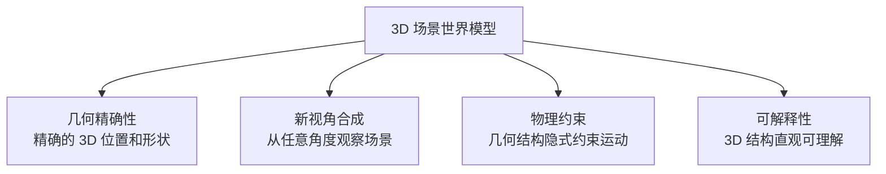
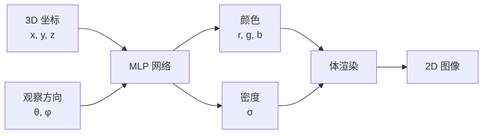
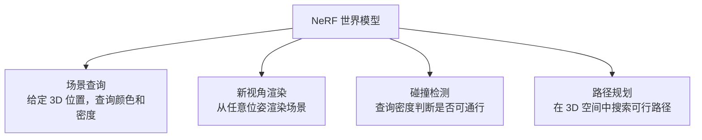
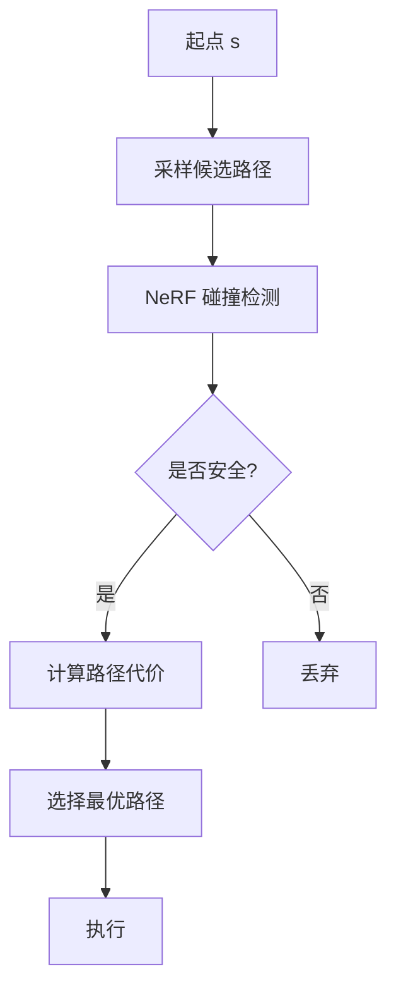
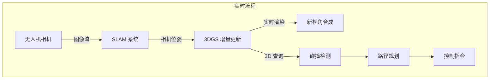
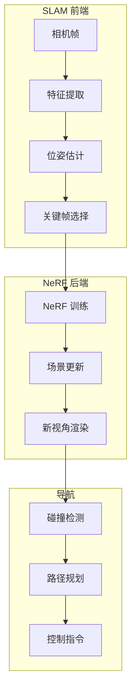
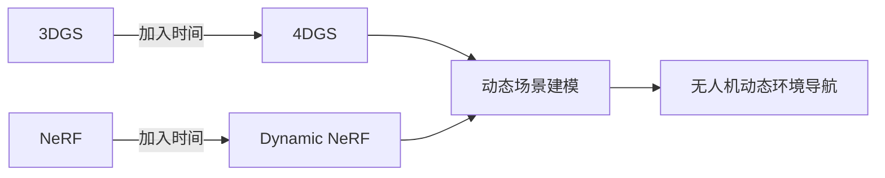
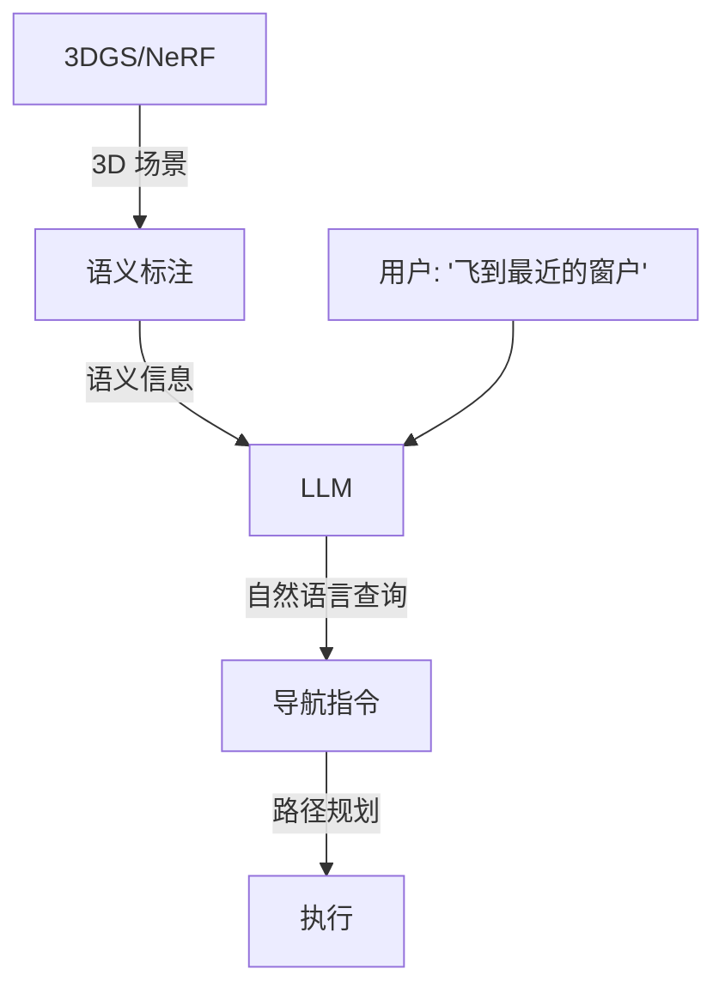
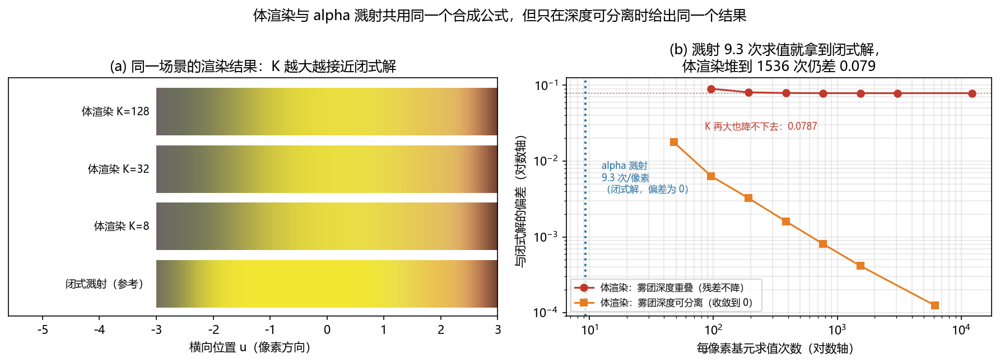

# 3D 场景世界模型：NeRF 与 3D Gaussian Splatting

> **预计阅读：18 分钟 | 前置知识：计算机视觉基础、射影几何、渲染原理**

---

## 1. 3D 场景表示作为世界模型

与前两种范式不同，3D 场景世界模型直接建模环境的三维几何结构，提供：


```mermaid
graph TB
    A[3D 场景世界模型] --> B[几何精确性<br/>精确的 3D 位置和形状]
    A --> C[新视角合成<br/>从任意角度观察场景]
    A --> D[物理约束<br/>几何结构隐式约束运动]
    A --> E[可解释性<br/>3D 结构直观可理解]
```

两种主要的 3D 场景表示方法——NeRF（Neural Radiance Fields）和 3DGS（3D Gaussian Splatting）——正在成为无人机世界模型的重要基础。

---

## 2. NeRF：神经辐射场

### 2.1 基本原理

NeRF（Mildenhall et al., 2020，ECCV 2020，[arXiv:2003.08934](https://arxiv.org/abs/2003.08934)）使用神经网络隐式表示 3D 场景的辐射场：

```python
# NeRF 核心函数
F_θ: (x, y, z, θ, φ) → (r, g, b, σ)

# 输入: 3D 坐标 (x,y,z) + 观察方向 (θ,φ)
# 输出: 颜色 (r,g,b) + 密度 σ
```


```mermaid
graph LR
    A[3D 坐标<br/>x, y, z] --> C[MLP 网络]
    B[观察方向<br/>θ, φ] --> C
    C --> D[颜色<br/>r, g, b]
    C --> E[密度<br/>σ]
    D --> F[体渲染]
    E --> F
    F --> G[2D 图像]
```

### 2.2 体渲染方程

NeRF 使用体渲染（Volume Rendering）将 3D 辐射场渲染为 2D 图像：

```
C(r) = ∫_{t_n}^{t_f} T(t) · σ(r(t)) · c(r(t), d) dt

其中:
- C(r): 像素的最终颜色
- T(t) = exp(-∫_{t_n}^{t} σ(r(s)) ds): 累积透射率
- σ(r(t)): 位置 r(t) 处的密度
- c(r(t), d): 位置 r(t) 在方向 d 处的颜色
```

**离散化近似：**

```python
# 分层采样
t_i = t_n + (t_f - t_n) * i / N  # N 个采样点

# 累积透射率
T_i = exp(-sum(σ_j * δ_j for j in range(i)))

# 像素颜色
C = sum(T_i * σ_i * c_i * δ_i for i in range(N))
```

### 2.3 NeRF 的变体

| 变体 | 创新点 | 速度 | 质量变化 |
|------|--------|---------|---------|
| [NeRF](https://arxiv.org/abs/2003.08934) (原始) | 基础 MLP | 基准：单卡 V100 约 1–2 天收敛 | 基准 |
| [Mip-NeRF](https://arxiv.org/abs/2103.13415) | 多尺度表示（抗锯齿） | 与 NeRF 同量级（论文：快 7%） | 更好（论文报平均误差 −17%） |
| [Instant-NGP](https://arxiv.org/abs/2201.05989) | 哈希编码 | 数量级提升（论文原话 "several orders of magnitude"） | 略降 |
| [Nerfacto](https://arxiv.org/abs/2302.04264) | 模块化设计 | 30 分钟级（论文：30K 步 / RTX A5000） | 论文自述略逊于 Mip-NeRF 360 |
| [NeRF-SLAM](https://arxiv.org/abs/2210.13641) | 实时 SLAM | 实时（论文未给具体倍数） | 论文自报优于竞争者（PSNR 最高 +179%） |

### 2.4 NeRF 作为世界模型

NeRF 作为世界模型的核心优势是提供精确的 3D 场景表示：


```mermaid
graph TB
    A[NeRF 世界模型] --> B[场景查询<br/>给定 3D 位置，查询颜色和密度]
    A --> C[新视角渲染<br/>从任意位姿渲染场景]
    A --> D[碰撞检测<br/>查询密度判断是否可通行]
    A --> E[路径规划<br/>在 3D 空间中搜索可行路径]
```

**NeRF 用于无人机导航的典型流程：**

| 步骤 | 操作 | 输出 |
|------|------|------|
| 1 | 收集场景图像 | 多视角图像 + 相机位姿 |
| 2 | 训练 NeRF | 场景的隐式 3D 表示 |
| 3 | 场景查询 | 给定位置查询可通行性 |
| 4 | 路径规划 | 在 3D 空间中搜索安全路径 |
| 5 | 执行飞行 | 沿规划路径飞行 |

---

## 3. NeRF-Nav：基于 NeRF 的导航

### 3.1 论文概述

NeRF-Nav 系列工作探索了将 NeRF 作为无人机导航的世界模型：

**核心思想：**
1. 使用 NeRF 学习环境的 3D 表示
2. 在 NeRF 中进行路径规划
3. 利用 NeRF 的密度信息进行碰撞检测

### 3.2 碰撞检测

```python
# NeRF 碰撞检测
def is_collision(nerf, position, threshold=0.5):
    """
    查询 NeRF 在给定位置的密度
    密度 > threshold 表示有物体（碰撞）
    """
    density = nerf.query_density(position)
    return density > threshold

# 路径可行性检查
def check_path(nerf, path_points):
    """检查路径上所有点是否安全"""
    for point in path_points:
        if is_collision(nerf, point):
            return False
    return True
```

### 3.3 路径规划


```mermaid
graph TB
    A[起点 s] --> B[采样候选路径]
    B --> C[NeRF 碰撞检测]
    C --> D{是否安全?}
    D -->|是| E[计算路径代价]
    D -->|否| F[丢弃]
    E --> G[选择最优路径]
    G --> H[执行]
```

**路径规划算法：**

| 算法 | 优势 | 劣势 | 适用场景 |
|------|------|------|---------|
| RRT* | 渐近最优 | 速度慢 | 复杂环境 |
| PRM | 预计算 | 需要多次查询 | 多次查询同一场景 |
| 优化方法 | 平滑路径 | 可能陷入局部最优 | 连续空间 |
| 基于梯度 | 快速 | 需要可微分 NeRF | 实时规划 |

### 3.4 NeRF-Nav 的局限性

| 局限性 | 描述 | 解决方案 |
|--------|------|---------|
| 训练速度慢 | 原始 NeRF 在单卡 V100 上约需 1–2 天收敛 | Instant-NGP, Nerfacto |
| 推理速度慢 | 逐点查询效率低 | 批量查询, 空间索引 |
| 动态场景 | 难以处理移动物体 | Dynamic NeRF |
| 泛化能力 | 只能表示训练时见过的场景 | 预训练 + 微调 |

---

## 4. 3D Gaussian Splatting (3DGS)

### 4.1 基本原理

3DGS（Kerbl et al., 2023，SIGGRAPH 2023，[arXiv:2308.04079](https://arxiv.org/abs/2308.04079)）使用一组 3D 高斯函数表示场景，每个高斯有以下属性：

| 属性 | 符号 | 维度 | 含义 |
|------|------|------|------|
| 位置 | μ | 3 | 高斯中心的 3D 坐标 |
| 协方差 | Σ | 6 (对称) | 高斯的形状和方向 |
| 颜色 | c | 3 (或 SH) | 高斯的颜色 |
| 不透明度 | α | 1 | 高斯的不透明度 |

```python
# 3D 高斯函数
G(x) = α * exp(-0.5 * (x - μ)^T * Σ^{-1} * (x - μ))
```

### 4.2 渲染过程

3DGS 使用"溅射"（Splatting）而非体渲染：


```mermaid
graph LR
    A[3D 高斯集合] -->|投影| B[2D 高斯]
    B -->|排序| C[深度排序]
    C -->|Alpha 混合| D[最终像素颜色]
```

**渲染方程：**

```python
# Alpha 混合
C = Σ_i (c_i * α_i * Π_{j<i} (1 - α_j))

# 其中:
# c_i: 第 i 个高斯的颜色
# α_i: 第 i 个高斯的不透明度（经过 2D 投影和高斯函数计算）
# Π_{j<i} (1 - α_j): 前面所有高斯的累积透射率
```

### 4.3 NeRF vs. 3DGS

| 对比维度 | NeRF | 3DGS |
|---------|------|------|
| 表示方式 | 隐式（MLP） | 显式（高斯集合） |
| 训练速度 | 慢（单卡 V100 约 1–2 天） | 快（全质量约 35–45 分钟；降质配置 5–10 分钟） |
| 渲染速度 | 慢（原论文：约 30 秒/帧） | 快（论文：合成场景 180–300 FPS） |
| 内存占用 | 小（论文：网络权重约 5 MB） | 大（存储所有高斯） |
| 可编辑性 | 困难 | 容易（直接操作高斯） |
| 质量 | 高 | 高（甚至更好） |
| 实时性 | 差 | 好（论文可达 100+ FPS） |

---

## 5. 3DGS 在无人机中的应用

### 5.1 实时 3D 重建与导航

3DGS 的快速训练和渲染特性使其非常适合无人机应用：


```mermaid
graph TB
    subgraph 实时流程
        A[无人机相机] -->|图像流| B[SLAM 系统]
        B -->|相机位姿| C[3DGS 增量更新]
        C -->|实时渲染| D[新视角合成]
        C -->|3D 查询| E[碰撞检测]
        E --> F[路径规划]
        F --> G[控制指令]
    end
```

### 5.2 3DGS-SLAM

3DGS 与 SLAM 的结合是当前的研究热点：

| 方法 | 特点 | 实时性 | 精度 |
|------|------|--------|------|
| [SplaTAM](https://arxiv.org/abs/2312.02126) | 稠密 SLAM | 整机约 0.4 FPS（跟踪 1.00 s/帧、建图 1.44 s/帧）；渲染 400 FPS | 高 |
| [Gaussian-SLAM](https://arxiv.org/abs/2312.10070) | 增量构建 | 建图 34 ms/迭代，论文未给整机 FPS | 中 |
| [Gaussian Splatting SLAM](https://arxiv.org/abs/2312.06741)（实现：MonoGS） | 单目 SLAM | 3 FPS（论文：单目 3.2 FPS、RGB-D 2.5 FPS） | 论文自称 SOTA |
| [Photo-SLAM](https://arxiv.org/abs/2311.16728) | 照片级质量 | 渲染最高 1000 FPS（嵌入式平台约 100 FPS） | 很高 |

### 5.3 3DGS 用于路径规划

```python
# 3DGS 碰撞检测
def check_collision_3dgs(gaussians, query_point, threshold=0.1):
    """
    检查查询点是否与任何高斯重叠
    使用马氏距离判断
    """
    for gaussian in gaussians:
        diff = query_point - gaussian.mean
        mahalanobis = diff.T @ gaussian.inv_covariance @ diff
        if mahalanobis < threshold:
            return True  # 碰撞
    return False  # 安全

# 优化：使用空间索引加速
# - Octree
# - KD-Tree
# - Voxel Grid
```

### 5.4 3DGS 的可编辑性

3DGS 的显式表示使其易于编辑，这对无人机应用非常有价值：

| 编辑操作 | 应用场景 | 实现方式 |
|---------|---------|---------|
| 添加物体 | 模拟新障碍物 | 插入新高斯 |
| 移除物体 | 清理场景 | 删除高斯 |
| 移动物体 | 动态场景 | 修改高斯位置 |
| 场景变换 | 任务规划 | 批量修改高斯属性 |

---

## 6. NeRF-SLAM：实时场景重建

### 6.1 论文概述

NeRF-SLAM（Rosinol et al., 2023，IROS 2023，[arXiv:2210.13641](https://arxiv.org/abs/2210.13641)）将 NeRF 集成到 SLAM 系统中，实现实时 3D 重建：


```mermaid
graph TB
    subgraph SLAM 前端
        A[相机帧] --> B[特征提取]
        B --> C[位姿估计]
        C --> D[关键帧选择]
    end

    subgraph "NeRF 后端"
        D --> E[NeRF 训练]
        E --> F[场景更新]
        F --> G[新视角渲染]
    end

    subgraph 导航
        G --> H[碰撞检测]
        H --> I[路径规划]
        I --> J[控制指令]
    end
```

### 6.2 实时性挑战

| 挑战 | 原始 NeRF | 解决方案 |
|------|----------|---------|
| 训练速度 | 单卡 V100 约 1–2 天 | Instant-NGP（分钟级） |
| 渲染速度 | 论文：约 30 秒/帧 | 3DGS（论文：180–300 FPS） |
| 内存占用 | 低（权重约 5 MB） | 3DGS（高） |
| 动态场景 | 不支持 | Dynamic NeRF |

### 6.3 无人机 SLAM 的特殊要求

| 要求 | 描述 | 满足方式 |
|------|------|---------|
| 实时性 | 控制回路需要高频状态估计 | 前端快速跟踪 |
| 鲁棒性 | 快速运动、光照变化 | 多传感器融合 |
| 大场景 | 城市级场景 | 分块建图 |
| 动态物体 | 行人、车辆 | 动态物体过滤 |

---

## 7. 3D 场景世界模型的前沿发展

### 7.1 4D 场景表示

将时间维度加入 3D 场景表示，建模动态世界：


```mermaid
graph LR
    A[3DGS] -->|加入时间| B[4DGS]
    C[NeRF] -->|加入时间| D[Dynamic NeRF]
    B --> E[动态场景建模]
    D --> E
    E --> F[无人机动态环境导航]
```

**2026 的动向：显式几何重新变成预测的载体。** 早期把 3D 表示当世界模型，用法是「先重建、再在重建结果上做
几何查询」；新的做法把几何本身当成预测目标，让世界模型直接在显式几何上做前向推演，省掉「重建完再渲染一遍」
这一层。代表工作是 GeoWM（*GeoWM: Efficient Direct World Modeling in Explicit Geometry*，
[arXiv:2610.07381](https://arxiv.org/abs/2610.07381)，2026-10），它把「直接」写进题名，正是针对上面这条
「重建—渲染」链路的时间开销。这一路与潜空间预测式（见 [08 联合嵌入预测与潜空间世界模型](08-联合嵌入预测与潜空间世界模型.md)）
的差别不在要不要预测，而在预测的载体是几何还是特征向量。

### 7.2 大规模场景

| 方法 | 场景规模 | 技术 |
|------|---------|------|
| [Block-NeRF](https://arxiv.org/abs/2202.05263) | 城市级 | 分块训练 |
| [Mega-NeRF](https://arxiv.org/abs/2112.10703) | 大规模 | 分布式训练 |
| [CityGaussian](https://arxiv.org/abs/2404.01133) | 城市级 3DGS | 层次化高斯 |
| [WildGaussians](https://arxiv.org/abs/2407.08447) | 野外场景 | 鲁棒训练 |

### 7.3 与语言模型的结合

将 3D 场景表示与大语言模型结合，实现语义感知的导航：


```mermaid
graph TB
    A[3DGS/NeRF] -->|3D 场景| B[语义标注]
    B -->|语义信息| C[LLM]
    C -->|自然语言查询| D[导航指令]
    D -->|路径规划| E[执行]

    F["用户: '飞到最近的窗户'"] --> C
```

---

## 8. 关键论文

- **[ECCV'20] NeRF** — *NeRF: Representing Scenes as Neural Radiance Fields for View Synthesis*  
  [](https://arxiv.org/abs/2003.08934)
  神经辐射场, 体渲染

- **[TOG'23] 3DGS** — *3D Gaussian Splatting for Real-Time Radiance Field Rendering*  
  [](https://arxiv.org/abs/2308.04079)
  高斯溅射, 实时渲染

- **[SIGGRAPH'22] Instant-NGP** — *Instant Neural Graphics Primitives with a Multiresolution Hash Encoding*  
  [](https://arxiv.org/abs/2201.05989)
  哈希编码, 快速训练

- **[IROS'23] NeRF-SLAM** — *NeRF-SLAM: Real-Time Dense Monocular SLAM with Neural Radiance Fields*  
  [](https://arxiv.org/abs/2210.13641)
  实时 SLAM, NeRF

- **[CVPR'24] SplaTAM** — *SplaTAM: Splat, Track & Map 3D Gaussians for Dense RGB-D SLAM*  
  [](https://arxiv.org/abs/2312.02126)
  3DGS SLAM

- **[CVPR'22] Block-NeRF** — *Block-NeRF: Scalable Large Scene Neural View Synthesis*  
  [](https://arxiv.org/abs/2202.05263)
  大规模 NeRF

---

## 9. 动手验证：体渲染和 alpha 溅射是两套公式吗？

2.2 节给了 NeRF 的体渲染积分（沿射线积密度、算累积透射率），第 4 节讲 3DGS 的 alpha 溅射（把高斯基元按深度排序做前向合成）。两者读起来是两套完全不同的东西。本节在一个 2D 玩具场景上把它们摆在一起：先看 alpha 从哪来，再看公式到底是不是同一个。

### 9.1 两个渲染器与一组对照

场景是一维图像上的若干高斯"雾团"，正交投影，每条射线沿 z 轴。体渲染均匀采 K 个点、由 `1 - exp(-σδ)` 得到 alpha；溅射用基元到该像素的闭式积分得到 alpha，再按深度前向合成。第二个场景把雾团沿深度拉开，用来对照"深度可分离"这个前提。

```python
import torch
W, Z_FAR, NB, KS = 256, 10.0, 12, (8, 64, 1024)
def scene(seed, separable=False):
    g = torch.Generator().manual_seed(seed); m = 6 if separable else NB
    x = (torch.rand(m, generator=g) * 2 - 1) * 2.5
    r = torch.full((m,), 0.35) if separable else 0.4 + torch.rand(m, generator=g) * 0.6
    z = (1.0 + torch.arange(m).float() * 1.6) if separable else (2.0 + torch.rand(m, generator=g) * 6.0)
    return {"x": x, "r": r, "z": z, "rho": 1.0 + torch.rand(m, generator=g) * 3.0,
            "col": torch.rand(m, 3, generator=g) * 0.8 + 0.2}
def w_at(s, u, z):
    """各基元在 (u, z) 处的高斯权重，(..., M)。"""
    return s["rho"] * torch.exp(-(((u[..., None] - s["x"]) ** 2 + (z[..., None] - s["z"]) ** 2)
                                 / (2 * s["r"] ** 2)))
def accumulate(a, col):
    """前向合成 C = Σ T_i α_i c_i，T_i 是第 i 项之前所有 (1-α) 的乘积。"""
    T = torch.cumprod(torch.cat([torch.ones_like(a[:, :1]), 1 - a], -1), -1)[:, :-1]
    return (T * a)[..., None].mul(col).sum(1)
def nerf(s, u, K):
    """体渲染：每条射线均匀采 K 点，alpha = 1 - exp(-σδ)，颜色取密度加权混色。"""
    z, d = torch.linspace(0, Z_FAR, K), Z_FAR / K
    w = w_at(s, u[:, None], z[None, :])
    col = (w[..., None] * s["col"]).sum(-2) / w.sum(-1, keepdim=True).clamp(min=1e-12)
    return accumulate(1 - torch.exp(-w.sum(-1) * d), col)
def splat(s, u):
    """alpha 溅射：∫ρexp(-((u-x)²+(z-z₀)²)/2r²)dz = ρ·r·√(2π)·exp(-(u-x)²/2r²)。"""
    amp = s["rho"] * s["r"] * (2 * torch.pi) ** 0.5 * torch.exp(-((u[:, None] - s["x"]) ** 2) / (2 * s["r"] ** 2))
    order = torch.argsort(s["z"])
    a = (1 - torch.exp(-amp))[:, order]
    return accumulate(torch.where(a > 1e-3, a, torch.zeros_like(a)), s["col"][order])   # 剔除可忽略的基元
u = torch.linspace(-3, 3, W)
for tag, sc in (("重叠  ", scene(0)), ("可分离", scene(0, True))):
    ref = splat(sc, u)
    e = [(nerf(sc, u, K) - ref).abs().mean().item() for K in KS]
    print(f"{tag}  K=8 {e[0]:.5f}   K=64 {e[1]:.5f}   K=1024 {e[2]:.5f}")
```

### 9.2 本地实测结果

```text
[1] 单个高斯（ρ=2.0, r=0.6）：细采样 alpha vs 闭式积分 alpha
    K =     4  细采样 alpha = 0.622587   闭式 alpha = 0.950607   偏差 3.28e-01
    K =    16  细采样 alpha = 0.940391   闭式 alpha = 0.950607   偏差 1.02e-02
    K =    64  细采样 alpha = 0.948231   闭式 alpha = 0.950607   偏差 2.38e-03
    K =   256  细采样 alpha = 0.950024   闭式 alpha = 0.950607   偏差 5.84e-04
    K =  1024  细采样 alpha = 0.950462   闭式 alpha = 0.950607   偏差 1.45e-04

[2] 整幅 256 像素渲染一次
    体渲染 K=128    每像素基元求值 1536 次   CPU 耗时    5.0 ms
    alpha 溅射      每像素基元求值 9.3 次（平均，空区域为 0）   CPU 耗时    0.3 ms
    求值次数之比 165x   耗时之比 16x

[3] 雾团在深度上互相重叠（12 个）
    K =     8  每像素求值     96 次   平均像素误差 0.08997
    K =    64  每像素求值    768 次   平均像素误差 0.07868
    K =  1024  每像素求值  12288 次   平均像素误差 0.07865

[4] 对照：雾团沿深度拉开（6 个，间隔 1.6 m，半径 0.35 m）
    K =     8  每像素求值     48 次   平均像素误差 0.01768
    K =    64  每像素求值    384 次   平均像素误差 0.00161
    K =  1024  每像素求值   6144 次   平均像素误差 0.00012
```

第一组确认两者的 alpha 是同一个数。单个高斯下，沿射线细采样的 `1 - exp(-Σσδ)` 随 K 增大收敛到闭式积分 `1 - exp(-∫σ dz)`：K=4 时偏差 0.33，K=1024 时 1.45e-4。

第二组是成本。体渲染每像素要对 12 个基元各求值 128 次，共 1536 次；溅射平均只要 9.3 次，因为空区域一个基元都不用算，被遮挡的基元也被 alpha 剔除掉了。**求值次数差 165 倍**。耗时差 16 倍，小于求值次数之比，说明体渲染那 1536 次里的每一步都很便宜，真正的开销在次数上。

第三、四组才是本节的重点：公式相同不等于结果相同。第三组里误差 K 从 8 加到 1024，**卡在 0.0787 再不下降**。第四组把雾团沿深度拉开，同样的代码立刻退回正常的一阶收敛，K 每翻一倍误差减半，1024 采样时到 1.2e-4。差异全部来自深度重叠。

原因是两者的合成公式虽然同为 `Σ T_i α_i c_i`，但体渲染在重叠处取的是**密度加权混色**，而 alpha 溅射要求每个基元有一个唯一的深度次序，重叠时这个次序本身就没有定义。3DGS 声称的实时渲染能力建立在"基元大致可分离"这个前提上，本节把违反前提的代价量了出来。

> **限制**：这里量的是 2D 玩具场景在 CPU 上的基元求值次数与墙钟耗时，**不是 GPU 上的 FPS**，不能外推到真实 3DGS 的渲染速度。真实 3DGS 的速度优势主要来自光栅化管线与 GPU 上的并行排序，那部分在本节的模型里完全不存在。墙钟耗时逐次抖动约 10%，可复现的是求值次数（1536 与 9.3 都是确定值）。



### 9.3 运行完整脚本

```bash
py -3.9 code/j_render_cost.py     # 约 4 秒，CPU 即可，只需 torch
```

完整脚本在 [`code/j_render_cost.py`](../../code/j_render_cost.py)，额外打印全部 K 值下的误差曲线、渲染结果的最大像素误差，并输出上面这张两面板的图。

---

## 10. 延伸阅读

- [01-世界模型发展史](./01-世界模型发展史.md) — 3D 场景表示在世界模型发展中的位置
- [02-生成式世界模型](./02-生成式世界模型.md) — 生成式方法与 3D 表示的结合
- [03-模型强化学习世界模型](./03-模型强化学习世界模型.md) — 与 Dreamer 等方法的对比
- [05-无人机世界模型综述](./05-无人机世界模型综述.md) — 3D 场景表示在无人机中的综合应用
- [06-关键数据集与基准](./06-关键数据集与基准.md) — 3D 重建评估基准

---

## 11. 思考题

### 题目 1：NeRF vs. 3DGS 选型

为一个需要实时避障的室内无人机导航系统选择 3D 场景表示方法，说明理由。

<details>
<summary>参考答案</summary>

**推荐选择：3D Gaussian Splatting (3DGS)**

**理由：**

1. **实时性需求：**
   - 室内避障需要高频状态估计（>30 Hz）
   - 3DGS 渲染速度可达 100+ FPS，满足实时需求
   - NeRF 渲染速度通常 <1 FPS，不满足实时需求

2. **增量更新能力：**
   - 室内环境可能有动态物体（人、门）
   - 3DGS 支持增量添加/删除高斯，适应动态环境
   - NeRF 修改困难，需要重新训练

3. **碰撞检测效率：**
   - 3DGS 的显式表示允许快速空间查询
   - 可以使用 KD-Tree 等空间索引加速
   - NeRF 需要逐点查询 MLP，效率低

4. **内存 vs. 速度权衡：**
   - 3DGS 内存占用大，但现代无人机通常有足够内存
   - NeRF 内存占用小，但速度太慢
   - 对于实时应用，速度比内存更重要

**具体方案：**
- 使用 3DGS-SLAM 实时构建场景地图
- 使用 KD-Tree 索引高斯，加速碰撞检测
- 增量更新高斯以适应动态物体
- 在 3DGS 上运行 RRT* 路径规划
</details>

### 题目 2：体渲染 vs. 溅射

解释 NeRF 的体渲染（Volume Rendering）和 3DGS 的溅射（Splatting）的区别，以及为什么溅射更快。

<details>
<summary>参考答案</summary>

**体渲染（NeRF）：**
- 沿每条射线采样 N 个点
- 对每个点查询 MLP 得到颜色和密度
- 使用积分公式计算像素颜色
- 计算复杂度：O(N * MLP_forward) 每像素

**溅射（3DGS）：**
- 将 3D 高斯投影到 2D 图像平面
- 按深度排序
- 使用 Alpha 混合计算像素颜色
- 计算复杂度：O(K * log(K)) 每像素（K 为覆盖该像素的高斯数量）

**为什么溅射更快：**

| 因素 | 体渲染 | 溅射 |
|------|--------|------|
| 前向传播 | 每个采样点都需要 MLP | 只需投影和混合 |
| 并行化 | 采样点间有依赖 | 高斯间可并行 |
| 硬件优化 | MLP 需要通用计算 | 可用 GPU 光栅化 |
| 采样效率 | 均匀采样浪费 | 高斯自适应覆盖 |

**具体速度对比：**
- NeRF：每像素需要 128-256 次 MLP 查询，每次 ~1μs → 128-256μs/像素
- 3DGS：每像素平均 10-20 个高斯，投影和混合 ~1μs → 10-20μs/像素
- 差距：约 10x

**GPU 光栅化的优势：**
- 3DGS 的渲染可以映射到标准的 GPU 光栅化管线
- 可以利用 GPU 的专用硬件（如 ROP）
- 类似于传统图形学的渲染管线
</details>

### 题目 3：动态场景建模

讨论如何将 3DGS 扩展到动态场景（如移动的行人、车辆），以支持无人机在动态环境中的导航。

<details>
<summary>参考答案</summary>

**动态 3DGS 的挑战：**
- 静态 3DGS 假设场景不变
- 动态场景需要追踪物体运动
- 需要区分静态和动态部分

**可能的解决方案：**

1. **时间参数化高斯：**
   - 将高斯的属性（位置、协方差）表示为时间的函数
   - μ(t) = μ_0 + v*t + a*t^2 (运动模型)
   - 优点：连续时间建模
   - 缺点：运动模型假设可能不准确

2. **多帧高斯跟踪：**
   - 为每个动态物体维护独立的高斯集合
   - 使用物体检测和追踪关联不同帧的高斯
   - 优点：可以处理任意运动
   - 缺点：需要物体检测

3. **混合表示：**
   - 静态部分：静态 3DGS
   - 动态部分：单独的动态 3DGS
   - 使用语义分割区分
   - 优点：高效且灵活
   - 缺点：需要语义分割

4. **神经场方法：**
   - 使用神经网络预测高斯的运动
   - 输入时间，输出高斯属性变化
   - 优点：可以学习复杂运动模式
   - 缺点：需要大量训练数据

**对无人机导航的影响：**
- 动态 3DGS 可以预测物体的未来位置
- 可以规划避障路径考虑物体运动
- 提高导航的安全性和效率
</details>

### 题目 4：语义 3D 场景

讨论将语义信息（如物体类别、可通行性）集成到 3DGS 中的方法，以及对无人机导航的价值。

<details>
<summary>参考答案</summary>

**语义集成方法：**

1. **语义特征高斯：**
   - 为每个高斯添加语义特征向量
   - 使用语义分割网络监督训练
   - 渲染时可以得到语义图

2. **多任务高斯：**
   - 每个高斯有颜色、密度、语义等多重属性
   - 联合训练重建和语义分割
   - 优点：端到端学习
   - 缺点：计算开销增加

3. **后处理方法：**
   - 先训练 3DGS
   - 使用 2D 语义分割渲染语义图
   - 将语义信息反投影到 3D 高斯
   - 优点：模块化
   - 缺点：精度可能受限

**对无人机导航的价值：**

| 语义信息 | 导航应用 |
|---------|---------|
| 物体类别 | 识别障碍物类型（墙、树、人） |
| 可通行性 | 直接判断区域是否可飞 |
| 功能区域 | 识别着陆区、充电站 |
| 语义导航 | "飞到最近的窗户" |
| 安全评估 | 识别危险区域（如人群） |

**具体实现示例：**
```python
class Semantic3DGS:
    def __init__(self):
        self.gaussians = []  # 3D 高斯列表
        self.semantic_head = nn.Linear(feature_dim, num_classes)

    def query_semantic(self, position):
        # 查询位置的语义类别
        features = self.query_features(position)
        semantic = self.semantic_head(features)
        return semantic

    def is_passable(self, position):
        # 判断位置是否可通行
        semantic = self.query_semantic(position)
        return semantic != OBSTACLE_CLASS
```
</details>

---

> **下一节**：[05-无人机世界模型综述](./05-无人机世界模型综述.md) — 全面综述无人机专用世界模型的研究进展。
