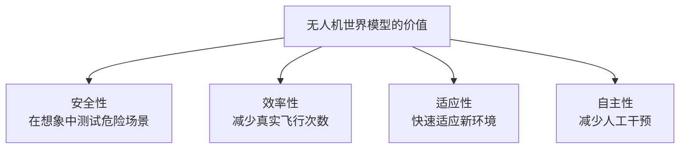
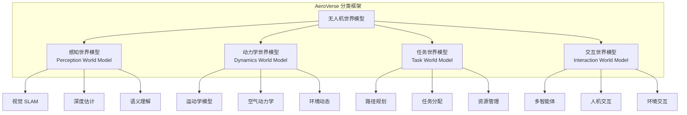
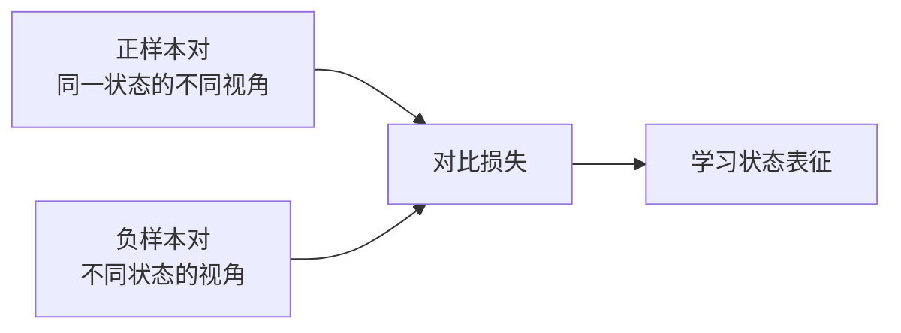
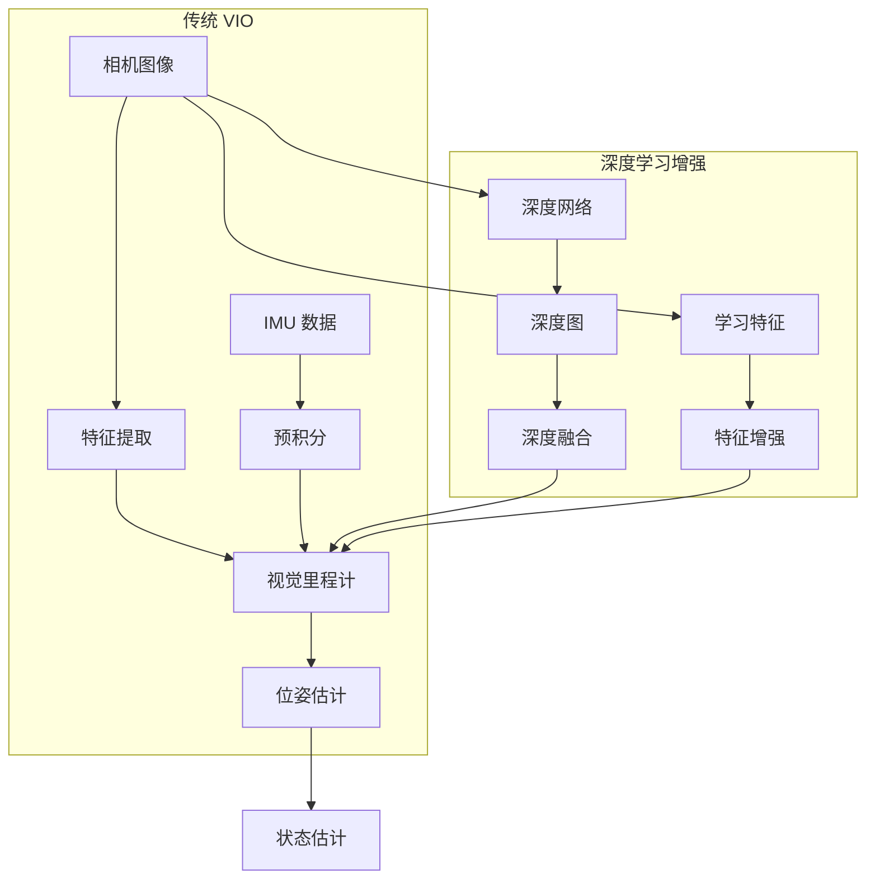
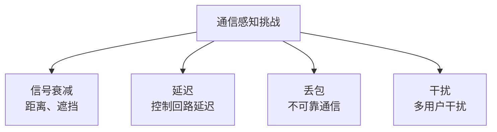
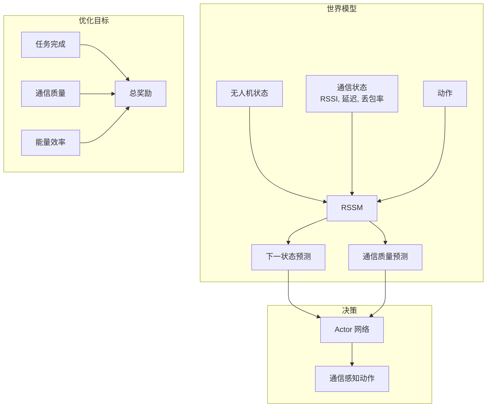
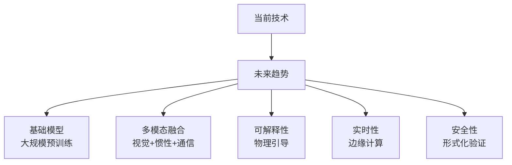

# 无人机世界模型综述：从感知到决策的全景视图

> **预计阅读：20 分钟 | 前置知识：无人机基础、强化学习概念、视觉 SLAM 基础**

---

## 1. 引言：为什么无人机需要世界模型？

无人机在三维空间中高速运动，面临独特的感知和决策挑战。世界模型为 UAV 提供了"内部模拟器"，使其能够在脑海中预演飞行轨迹、评估风险、优化策略，而无需在真实环境中试错。



本节综述无人机专用世界模型的最新研究进展，涵盖感知建模、动力学学习、决策规划等多个层面。

---

## 2. AeroVerse：无人机世界模型的全景框架

### 2.1 论文概述

**论文：** *"AeroVerse: A Survey on World Models for UAVs"*
**arXiv：** 2408.15511
**机构：** 哈尔滨工业大学 (HIT)
**核心贡献：** 首个系统性的无人机世界模型综述，提出了统一的分类框架。

### 2.2 分类框架

AeroVerse 将无人机世界模型分为四个层次：



### 2.3 各层次详解

**感知世界模型：**

| 子任务 | 方法 | 挑战 |
|--------|------|------|
| 视觉 SLAM | ORB-SLAM, VINS-Mono | 快速运动、光照变化 |
| 深度估计 | 单目深度、双目深度 | 尺度模糊、纹理缺失 |
| 语义理解 | 语义分割、目标检测 | 实时性、小目标 |

**动力学世界模型：**

| 子任务 | 方法 | 挑战 |
|--------|------|------|
| 运动学模型 | SE(3) 群上的动力学 | 非线性、耦合 |
| 空气动力学 | CFD、数据驱动 | 复杂流场 |
| 环境动态 | 风场建模、湍流 | 不确定性 |

**任务世界模型：**

| 子任务 | 方法 | 挑战 |
|--------|------|------|
| 路径规划 | A*, RRT*, 优化方法 | 实时性、最优性 |
| 任务分配 | 多智能体规划 | 组合爆炸 |
| 资源管理 | 能量、通信 | 约束满足 |

**交互世界模型：**

| 子任务 | 方法 | 挑战 |
|--------|------|------|
| 多智能体 | MARL、博弈论 | 非平稳性 |
| 人机交互 | 意图识别、共享控制 | 通信延迟 |
| 环境交互 | 接触建模 | 物理精确性 |

### 2.4 AeroVerse 基准

AeroVerse 提出了统一的评估基准：

| 评估维度 | 指标 | 说明 |
|---------|------|------|
| 感知精度 | ATE, RPE | 位姿估计误差 |
| 预测准确性 | MSE, SSIM | 未来状态预测 |
| 规划质量 | 路径长度, 碰撞率 | 规划效果 |
| 决策性能 | 任务完成率, 时间 | 决策效果 |
| 计算效率 | FPS, 内存 | 部署可行性 |

---

## 3. 对比世界模型用于无人机导航

### 3.1 论文概述

**论文：** *"Contrastive World Model for Drone Navigation"*
**发表：** IEEE 2023
**核心贡献：** 使用对比学习构建世界模型，提升无人机导航的样本效率。

### 3.2 对比学习的核心思想



**对比损失函数：**

```python
# InfoNCE 损失
def contrastive_loss(anchors, positives, negatives, temperature=0.1):
    """
    anchors: 锚点表征
    positives: 正样本表征
    negatives: 负样本表征集合
    """
    # 正样本相似度
    pos_sim = cosine_similarity(anchors, positives) / temperature

    # 负样本相似度
    neg_sim = cosine_similarity(anchors, negatives) / temperature

    # InfoNCE 损失
    loss = -log(exp(pos_sim) / (exp(pos_sim) + sum(exp(neg_sim))))
    return loss
```

### 3.3 在无人机导航中的应用

| 组件 | 功能 | 训练方式 |
|------|------|---------|
| 视觉编码器 | 提取场景特征 | 对比学习 |
| 动态模型 | 预测下一状态 | 对比 + 预测 |
| 价值函数 | 评估状态价值 | TD 学习 |
| 策略网络 | 输出飞行动作 | Actor-Critic |

**对比世界模型的优势：**

| 优势 | 说明 |
|------|------|
| 样本效率 | 对比学习充分利用正负样本 |
| 泛化能力 | 学到的状态表征更具语义性 |
| 鲁棒性 | 对视角变化、光照变化更鲁棒 |
| 可迁移性 | 预训练表征可迁移到新场景 |

---

## 4. HDVIO：混合深度视觉惯性里程计

### 4.1 论文概述

**论文：** *"HDVIO: Hybrid Deep Visual-Inertial Odometry"*
**arXiv：** 2306.11429
**机构：** UZH (苏黎世大学)
**核心贡献：** 将深度学习与传统 VIO 结合，提升无人机状态估计的鲁棒性。

### 4.2 架构设计



### 4.3 混合方法的优势

| 方面 | 纯传统方法 | 纯学习方法 | HDVIO (混合) |
|------|-----------|-----------|-------------|
| 精度 | 中 | 高 | 高 |
| 鲁棒性 | 中 | 低（分布外） | 高 |
| 实时性 | 高 | 中 | 高 |
| 可解释性 | 高 | 低 | 中 |
| 泛化能力 | 中 | 低 | 高 |

### 4.4 HDVIO 作为世界模型

HDVIO 不仅是状态估计器，也可以被视为一种世界模型：

- **状态表征**：提供精确的 6-DoF 位姿估计
- **动态预测**：基于 IMU 和视觉预测下一时刻状态
- **不确定性估计**：协方差矩阵提供不确定性
- **规划支持**：精确的状态估计支持路径规划

---

## 5. 物理引导学习 on SE(3)

### 5.1 论文概述

**论文：** *"Physics-Guided Learning on SE(3) for UAV Control"*
**arXiv：** 2201.04339
**核心贡献：** 在 SE(3) 群上结合物理先验和数据驱动学习，构建无人机动力学世界模型。

### 5.2 SE(3) 群上的无人机动力学

无人机的位姿在 SE(3) 群上，包含位置和旋转：

```
SE(3) = { (R, t) | R ∈ SO(3), t ∈ R³ }

其中:
- R: 旋转矩阵 (3x3, 正交, det=1)
- t: 平移向量 (3维)
```

**无人机动力学方程：**

```
位置: m * a = f_thrust * R * e₃ + f_gravity + f_drag
旋转: J * α + ω × (J * ω) = τ

其中:
- m: 质量
- a: 加速度
- f_thrust: 推力
- R: 旋转矩阵
- e₃: [0,0,1]^T
- f_gravity: 重力
- f_drag: 阻力
- J: 转动惯量
- α: 角加速度
- ω: 角速度
- τ: 力矩
```

### 5.3 物理引导的学习方法

```mermaid
graph TB
    A[数据驱动损失<br/>L_data] --> E[总损失 L]
    B[物理约束损失<br/>L_physics] --> E
    C[SE(3) 几何损失<br/>L_geometry] --> E
    E --> D[神经网络参数更新]
```

**三种损失函数：**

| 损失项 | 公式 | 作用 |
|--------|------|------|
| 数据损失 | L_data = \|\|ŷ - y\|\|² | 拟合观测数据 |
| 物理损失 | L_physics = \|\|F(ŷ) - 0\|\|² | 满足物理方程 |
| 几何损失 | L_geometry = \|\|R^T R - I\|\|² | 保持 SO(3) 约束 |

**物理引导的优势：**

| 优势 | 说明 |
|------|------|
| 数据效率 | 物理先验减少数据需求 |
| 外推能力 | 物理约束在分布外仍然有效 |
| 安全性 | 物理合理的预测更安全 |
| 可解释性 | 满足已知物理规律 |

### 5.4 Lie 群上的神经网络

在 SE(3) 上设计神经网络需要特殊考虑：

```python
# Lie 代数到 Lie 群的指数映射
def exp_map(se3_vec):
    """
    se3_vec: 6维向量 [ω, v]
    返回: 4x4 齐次变换矩阵
    """
    omega = se3_vec[:3]  # 旋转部分 (so(3))
    v = se3_vec[3:]      # 平移部分

    # Rodrigues 公式
    theta = np.linalg.norm(omega)
    if theta < 1e-6:
        R = np.eye(3) + skew(omega)
    else:
        K = skew(omega / theta)
        R = np.eye(3) + np.sin(theta) * K + (1 - np.cos(theta)) * K @ K

    # 平移
    V = np.eye(3) + (1 - np.cos(theta)) / theta**2 * skew(omega) + \
        (theta - np.sin(theta)) / theta**3 * skew(omega) @ skew(omega)
    t = V @ v

    # 齐次变换矩阵
    T = np.eye(4)
    T[:3, :3] = R
    T[:3, 3] = t
    return T
```

---

## 6. Wireless Dreamer：无线通信感知的世界模型

### 6.1 论文概述

**论文：** *"Wireless Dreamer: World Model for Wireless-Controlled UAVs"*
**arXiv：** 2506.00417
**核心贡献：** 将无线通信质量纳入世界模型，实现通信感知的无人机决策。

### 6.2 通信感知的挑战



### 6.3 Wireless Dreamer 架构



### 6.4 通信感知的决策

| 场景 | 传统方法 | Wireless Dreamer |
|------|---------|-----------------|
| 信号弱 | 继续执行 | 主动靠近基站 |
| 高延迟 | 忽略 | 降低飞行速度 |
| 丢包 | 忽略 | 切换到自主模式 |
| 干扰 | 忽略 | 调整通信频率 |

---

## 7. 无人机世界模型的技术路线对比

### 7.1 方法对比

| 方法 | 类型 | 核心技术 | 优势 | 劣势 | 适用场景 |
|------|------|---------|------|------|---------|
| AeroVerse | 综述框架 | 统一分类 | 全面覆盖 | 非具体方法 | 研究参考 |
| 对比世界模型 | 感知 | 对比学习 | 样本效率 | 需要大量数据 | 导航 |
| HDVIO | 状态估计 | 混合方法 | 鲁棒 | 计算开销 | SLAM |
| SE(3) 学习 | 动力学 | 物理引导 | 可解释 | 建模简化 | 控制 |
| Wireless Dreamer | 通信感知 | 通信建模 | 全面 | 复杂 | 远程控制 |

### 7.2 技术路线选择指南

```mermaid
graph TB
    A[选择无人机世界模型] --> B{主要需求?}

    B -->|精确状态估计| C[HDVIO / VIO]
    B -->|高效导航| D[对比世界模型]
    B -->|物理精确控制| E[SE(3) 学习]
    B -->|远程控制| F[Wireless Dreamer]
    B -->|全面解决方案| G[AeroVerse 框架]

    C --> H[传统 + 学习混合]
    D --> I[数据驱动]
    E --> J[物理引导]
    F --> K[通信感知]
    G --> L[多模块集成]
```

### 7.3 性能对比

| 方法 | 感知精度 | 预测准确性 | 实时性 | 泛化能力 | 部署难度 |
|------|---------|-----------|--------|---------|---------|
| AeroVerse | 高 | 高 | 中 | 高 | 高 |
| 对比世界模型 | 中 | 中 | 高 | 高 | 中 |
| HDVIO | 高 | 中 | 高 | 中 | 中 |
| SE(3) 学习 | 中 | 高 | 中 | 高 | 高 |
| Wireless Dreamer | 中 | 高 | 中 | 中 | 高 |

---

## 8. 无人机世界模型的未来方向

### 8.1 技术趋势



### 8.2 开放问题

| 问题 | 描述 | 可能的解决方向 |
|------|------|---------------|
| Sim-to-Real 差距 | 仿真中学到的模型难以迁移到真实 | 域随机化、真实数据微调 |
| 长期预测 | 长时间预测的准确性下降 | 层次化模型、不确定性感知 |
| 动态环境 | 移动物体、变化光照 | 动态场景建模、在线适应 |
| 安全保证 | 无法保证学习模型的安全性 | 安全层、形式化验证 |
| 计算资源 | 复杂模型难以机载部署 | 模型压缩、边缘计算 |

### 8.3 研究路线图

| 时间 | 目标 | 关键技术 |
|------|------|---------|
| 近期 (1-2年) | 单机自主导航 | 3DGS-SLAM + 世界模型 |
| 中期 (3-5年) | 多智能体协作 | 交互世界模型 |
| 长期 (5-10年) | 完全自主 | 基础世界模型 |

---

## 9. 关键论文列表

| 论文 | 作者 | 年份 | 会议/平台 | 关键词 |
|------|------|------|----------|--------|
| AeroVerse | HIT | 2024 | arXiv 2408.15511 | 综述, 分类框架 |
| 对比世界模型 | 多位作者 | 2023 | IEEE | 对比学习, 导航 |
| HDVIO | UZH | 2023 | arXiv 2306.11429 | 混合 VIO, 深度学习 |
| SE(3) 学习 | 多位作者 | 2022 | arXiv 2201.04339 | 物理引导, Lie 群 |
| Wireless Dreamer | 多位作者 | 2025 | arXiv 2506.00417 | 通信感知, 世界模型 |

---

## 10. 延伸阅读

- [01-世界模型发展史](./01-世界模型发展史.md) — 世界模型的整体发展脉络
- [02-生成式世界模型](./02-生成式世界模型.md) — 生成式方法在无人机中的应用
- [03-模型强化学习世界模型](./03-模型强化学习世界模型.md) — Dreamer 系列与模型 RL
- [04-3D场景世界模型](./04-3D场景世界模型.md) — NeRF 和 3DGS 作为世界模型
- [06-关键数据集与基准](./06-关键数据集与基准.md) — 评估世界模型的基准
- [研究空白与机会](../08-研究前沿与开放问题/02-研究空白与机会.md) — 世界模型方向的开放问题

---

## 11. 思考题

### 题目 1：世界模型的层次选择

AeroVerse 将世界模型分为感知、动力学、任务、交互四个层次。对于一个城市巡检无人机，应该优先发展哪个层次的世界模型？

<details>
<summary>参考答案</summary>

**推荐优先级：感知世界模型 > 动力学世界模型 > 任务世界模型 > 交互世界模型**

**理由：**

1. **感知世界模型（最优先）：**
   - 城市环境复杂：高楼、电线、行人、车辆
   - 需要精确的 3D 感知和语义理解
   - SLAM、深度估计、目标检测是基础
   - 没有准确的感知，后续层次都无法工作

2. **动力学世界模型（第二优先）：**
   - 城市环境有风扰动（高楼间风场复杂）
   - 需要精确的飞行控制
   - 物理引导的学习可以提高控制精度
   - 安全关键：动力学误差可能导致碰撞

3. **任务世界模型（第三优先）：**
   - 巡检任务需要路径规划
   - 需要考虑覆盖范围、时间约束、能量限制
   - 但有了感知和动力学基础，规划相对容易

4. **交互世界模型（最后）：**
   - 城市巡检通常是单机任务
   - 人机交互需求有限
   - 多智能体协作是高级功能

**具体方案：**
- 第一阶段：部署 HDVIO 或类似系统，实现精确状态估计
- 第二阶段：加入 3DGS-SLAM，构建城市 3D 地图
- 第三阶段：加入路径规划，实现自主巡检
- 第四阶段：加入通信感知，支持远程监控
</details>

### 题目 2：物理引导 vs. 数据驱动

比较 SE(3) 物理引导学习和纯数据驱动方法（如对比世界模型）的优劣，以及何时选择哪种方法。

<details>
<summary>参考答案</summary>

**物理引导学习（SE(3)）的优势：**
- 数据效率高：物理先验减少数据需求
- 外推能力强：物理约束在分布外仍然有效
- 安全性好：物理合理的预测更安全
- 可解释性高：满足已知物理规律

**物理引导学习的劣势：**
- 建模简化：实际物理比模型更复杂
- 计算开销：物理约束需要额外计算
- 灵活性差：难以处理未知的物理现象
- 开发难度：需要领域专家知识

**数据驱动方法的优势：**
- 灵活性高：可以从数据中学习任意模式
- 开发简单：不需要领域专家知识
- 适应性强：可以处理复杂的非线性关系
- 端到端：直接从输入到输出

**数据驱动方法的劣势：**
- 数据需求大：需要大量训练数据
- 泛化能力弱：在分布外表现差
- 安全性差：可能产生不安全的预测
- 可解释性低：黑盒模型

**选择指南：**

| 场景 | 推荐方法 | 原因 |
|------|---------|------|
| 精确控制 | 物理引导 | 需要物理准确性 |
| 复杂感知 | 数据驱动 | 感知模式复杂 |
| 数据稀缺 | 物理引导 | 物理先验补偿数据不足 |
| 快速开发 | 数据驱动 | 不需要领域知识 |
| 安全关键 | 物理引导 | 物理约束保证安全 |
| 新环境 | 数据驱动 | 物理模型可能不适用 |

**混合方案：**
- 底层控制：物理引导（精确、安全）
- 高层感知：数据驱动（灵活、适应）
- 融合方式：物理模型提供先验，数据驱动修正
</details>

### 题目 3：通信感知决策

Wireless Dreamer 将通信质量纳入世界模型。分析这种方法在实际部署中的挑战和可能的解决方案。

<details>
<summary>参考答案</summary>

**挑战分析：**

1. **通信建模的复杂性：**
   - 无线信道受多径效应、遮挡、干扰影响
   - 信道状态快速变化（毫秒级）
   - 难以建立准确的信道模型

2. **实时性要求：**
   - 通信状态需要高频更新
   - 世界模型需要实时预测
   - 决策延迟必须极低

3. **不确定性：**
   - 通信质量有随机性
   - 难以预测未来的通信状态
   - 需要不确定性量化

4. **多目标优化：**
   - 任务完成 vs. 通信质量 vs. 能量效率
   - 目标之间可能冲突
   - 需要权衡

**可能的解决方案：**

1. **数据驱动的信道建模：**
   - 收集真实通信数据
   - 使用神经网络学习信道模型
   - 在线更新以适应环境变化

2. **不确定性感知决策：**
   - 使用贝叶斯方法估计通信不确定性
   - 在不确定性高时保守决策
   - 集成多个信道模型

3. **分层决策：**
   - 底层：高频通信状态监测
   - 中层：中频路径调整
   - 高层：低频任务重规划

4. **冗余设计：**
   - 多条通信链路
   - 自主模式作为备份
   - 预定义的安全行为

**实际部署建议：**
- 从简单场景开始（视距通信）
- 逐步增加复杂性（遮挡、干扰）
- 建立通信状态的历史数据库
- 定期更新信道模型
</details>

### 题目 4：Sim-to-Real 迁移

讨论如何将仿真中训练的无人机世界模型迁移到真实环境，分析 Sim-to-Real 差距的来源和解决方案。

<details>
<summary>参考答案</summary>

**Sim-to-Real 差距的来源：**

1. **视觉差距：**
   - 仿真图像与真实图像的差异
   - 光照、纹理、反射的不同
   - 渲染引擎的局限性

2. **动力学差距：**
   - 简化的空气动力学模型
   - 未建模的振动、延迟
   - 电机响应的非线性

3. **传感器差距：**
   - 相机噪声模型不准确
   - IMU 偏置和漂移
   - GPS 精度差异

4. **环境差距：**
   - 仿真环境的简化
   - 动态物体的不同
   - 天气条件的差异

**解决方案：**

1. **域随机化（Domain Randomization）：**
   - 随机化视觉参数（光照、纹理）
   - 随机化动力学参数（质量、阻力）
   - 随机化传感器参数（噪声、偏置）
   - 效果：模型对变化鲁棒

2. **域适应（Domain Adaptation）：**
   - 使用真实数据微调仿真模型
   - GAN 将仿真图像转换为真实风格
   - 特征对齐减少域差异

3. **渐进式迁移：**
   - 从简单仿真开始
   - 逐步增加真实感
   - 最后在真实环境中微调

4. **混合训练：**
   - 仿真和真实数据混合训练
   - 调整混合比例
   - 使用课程学习

5. **系统辨识：**
   - 使用真实数据辨识仿真参数
   - 建立精确的仿真模型
   - 定期更新辨识结果

**实际案例：**
- Dream to Fly：仿真预训练 + 真实微调
- 效果：50K 真实步达到 89.7% 完赛率
- 关键：仿真环境足够真实 + 微调数据足够多样
</details>

---

> **下一篇：** [06-关键数据集与基准](./06-关键数据集与基准.md) -- 了解评估无人机世界模型的基准和数据集。
