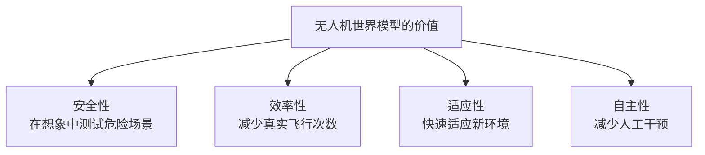
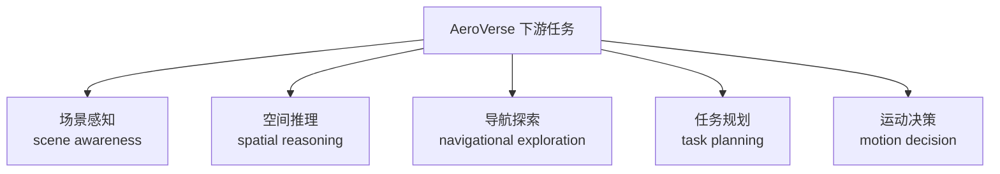
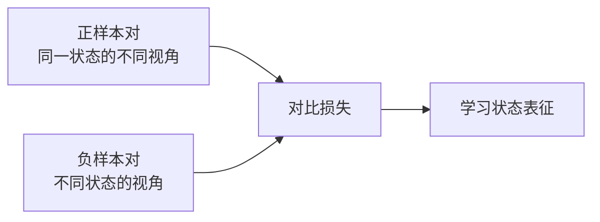
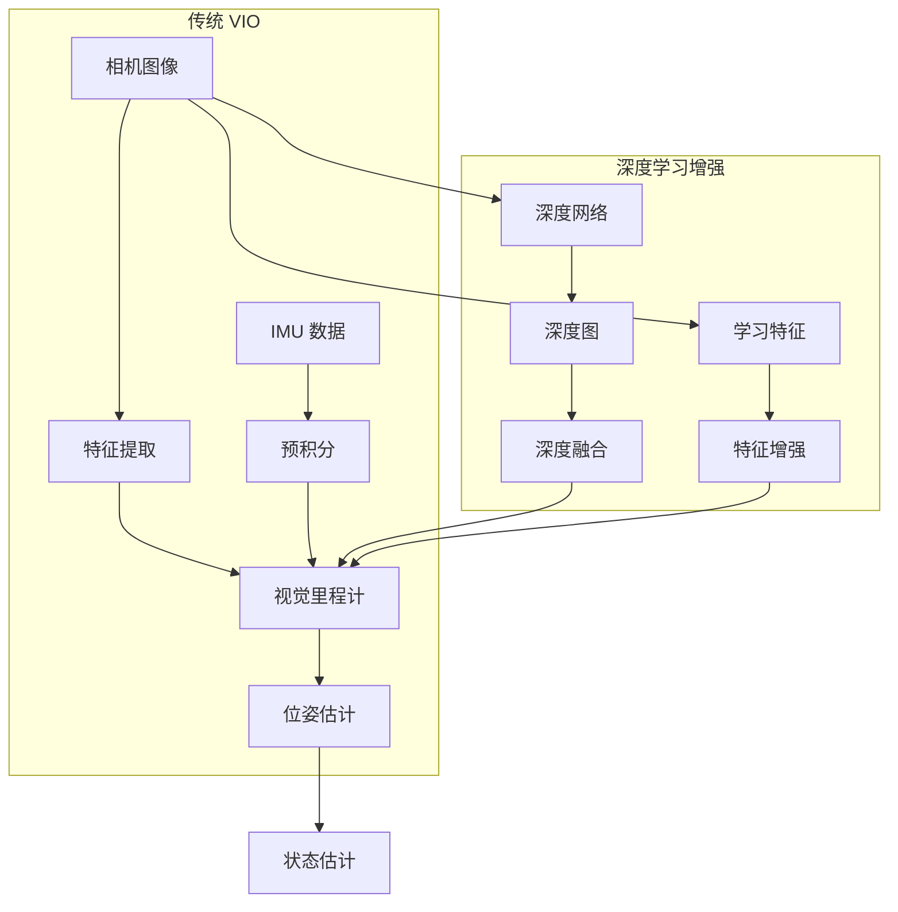
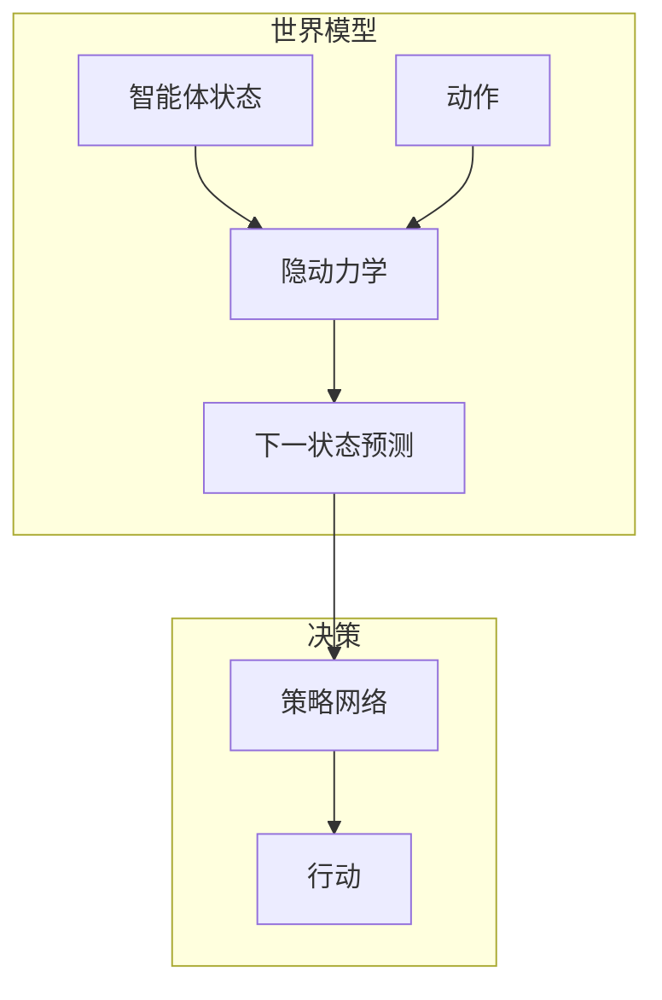
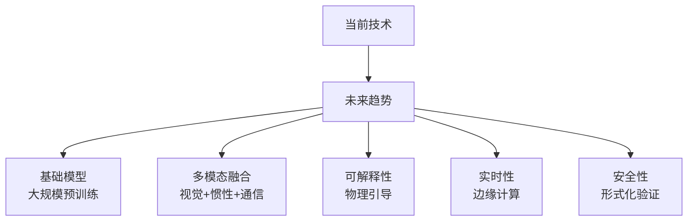
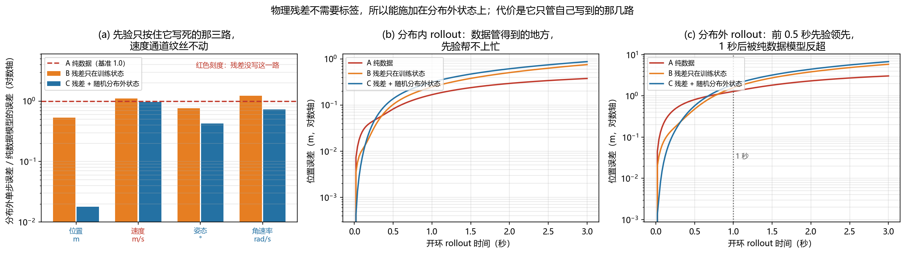

# 无人机世界模型综述：从感知到决策的全景视图

> **预计阅读：20 分钟 | 前置知识：无人机基础、强化学习概念、视觉 SLAM 基础**

---

## 1. 为什么无人机需要世界模型？

无人机在三维空间中高速运动，面临独特的感知和决策挑战。世界模型为 UAV 提供了"内部模拟器"，使其能够在脑海中预演飞行轨迹、评估风险、优化策略，而无需在真实环境中试错。


```mermaid
graph TB
    A[无人机世界模型的价值] --> B[安全性<br/>在想象中测试危险场景]
    A --> C[效率性<br/>减少真实飞行次数]
    A --> D[适应性<br/>快速适应新环境]
    A --> E[自主性<br/>减少人工干预]
```

本节综述无人机专用世界模型的最新研究进展，涵盖感知建模、动力学学习、决策规划等多个层面。

---

## 2. AeroVerse：无人机具身世界模型基准套件

### 2.1 论文概述

**论文：** *"AeroVerse: UAV-Agent Benchmark Suite for Simulating, Pre-training, Finetuning, and Evaluating Aerospace Embodied World Models"*
**作者：** Fanglong Yao, Yuanchang Yue, Youzhi Liu, Xian Sun, Kun Fu
**arXiv：** [2408.15511](https://arxiv.org/abs/2408.15511)
**核心贡献：** 面向航空航天具身世界模型的基准套件：构建大规模真实图像-文本预训练数据集，并给出仿真、预训练、微调、评测的统一流程。它是一套基准与数据，不是一篇综述。

### 2.2 AeroVerse 的构成

AeroVerse 不是一套分类法，而是一整套基准：数据集、任务定义、评测指标、仿真器，以及已经接进去的一批模型。

| 组成 | 内容 |
|------|------|
| 预训练数据集 | AerialAgent-Ego10k（真实城市无人机第一人称图像-文本）、CyberAgent Ego500k（虚拟图像-文本-位姿对齐） |
| 5 个下游任务 | 场景感知、空间推理、导航探索、任务规划、运动决策 |
| 微调指令数据集 | SkyAgent-Scene3k / Reason3k / Nav3k / Plan3k / Act3k，与上面 5 个任务一一对应 |
| 评测 | SkyAgentEval，基于 GPT-4 的下游任务评测指标 |
| 基准套件 | 10+ 个 2D/3D 视觉语言模型、2 个预训练数据集、5 个微调数据集、10+ 项指标、1 个仿真器 |

论文的出发点是：已有的具身世界模型几乎都面向室内的地面智能体，无人机智能体这块是空白；而无人机需要的是第一人称视角、能主动与人及环境交互的表示。

### 2.3 五个下游任务


```mermaid
graph TB
    A[AeroVerse 下游任务] --> B[场景感知<br/>scene awareness]
    A --> C[空间推理<br/>spatial reasoning]
    A --> D[导航探索<br/>navigational exploration]
    A --> E[任务规划<br/>task planning]
    A --> F[运动决策<br/>motion decision]
```

| 任务 | 要解决什么 |
|------|-----------|
| 场景感知 | 从第一人称视角理解城市空域里有什么 |
| 空间推理 | 判断物体之间的相对位置与关系 |
| 导航探索 | 在未知环境中规划并执行探索 |
| 任务规划 | 把高层目标拆成可执行步骤 |
| 运动决策 | 输出底层飞行动作 |

### 2.4 评测：SkyAgentEval

AeroVerse 的评测不走 ATE / RPE 这类几何指标，而是用 GPT-4 对下游任务的作答打分，论文的说法是「comprehensively, flexibly, and objectively」。论文用它评估了一批 2D/3D 视觉语言模型在无人机任务上的表现，报告了这些模型的潜力与局限。

> 用 GPT-4 当裁判能覆盖开放式作答，代价是分数依赖裁判模型本身，横向比较时要留意版本。

### 2.5 背景：无人机世界模型通常涉及哪些子问题

下面这张表是本节对领域常见子问题的归纳，**不是 AeroVerse 的分类**，放在这里是为了给后面几章的论文一个坐标系。

| 层面 | 典型子问题 | 常用方法 | 主要难点 |
|------|-----------|---------|---------|
| 感知 | 视觉 SLAM、深度估计、语义理解 | ORB-SLAM、VINS-Mono、单双目深度、分割与检测 | 快速运动与光照变化、尺度模糊、实时性 |
| 动力学 | 运动学建模、气动效应、环境扰动 | SE(3) 上的动力学、CFD、数据驱动模型 | 非线性与耦合、流场复杂、风场不确定 |
| 任务 | 路径规划、任务分配、资源管理 | A*、RRT*、优化方法、多智能体规划 | 实时性、组合爆炸、约束满足 |
| 交互 | 多智能体协同、人机交互、环境接触 | MARL、博弈论、意图识别、共享控制 | 非平稳性、通信延迟、接触建模精度 |

---

## 3. 对比世界模型

### 3.1 论文概述

**论文：** *"Contrastive Learning of Structured World Models"*（C-SWM）
**作者：** Thomas Kipf, Elise van der Pol, Max Welling
**arXiv：** [1911.12247](https://arxiv.org/abs/1911.12247)（ICLR 2020）
**核心贡献：** 用对比学习学「结构化」的状态表征。它把每个状态嵌入拆成一组物体表征及其相互关系，用图神经网络建模，物体无需直接监督就能从原始像素里被发现。在有组合结构的环境里，它比基于像素重建的世界模型更强，学到的表征也更具可解释性。

> 这篇论文本身不做无人机导航，它的实验环境是组合式环境、Atari 与多物体物理仿真。3.4 节那张无人机导航的组件表是本节把该范式外推到无人机场景的整理，不是原文内容。所以本章的定位是「对比世界模型这类方法是什么」，而不是「某篇无人机论文做了什么」。

### 3.2 为什么对比学习能帮到世界模型

世界模型要先有一个状态表征，再在这个表征上预测动力学。像素重建类方法把大量容量花在重建背景纹理上，而对比学习只要求「同一状态的不同视角靠近、不同状态远离」，把容量逼到真正区分状态的维度上。这也是 C-SWM 能绕开像素重建局限的原因。

### 3.3 对比学习的核心思想


```mermaid
graph LR
    A[正样本对<br/>同一状态的不同视角] --> C[对比损失]
    B[负样本对<br/>不同状态的视角] --> C
    C --> D[学习状态表征]
```

**对比损失函数：**

```python
import torch
import torch.nn.functional as F

def contrastive_loss(anchors, positives, negatives, temperature=0.1):
    """InfoNCE：锚点与正样本的相似度，要在「正样本 + K 个负样本」里排第一。

    anchors/positives: (B, D)   negatives: (B, K, D)
    """
    a = F.normalize(anchors, dim=-1)
    p = F.normalize(positives, dim=-1)
    n = F.normalize(negatives, dim=-1)
    pos_logit = (a * p).sum(-1, keepdim=True) / temperature        # (B, 1)
    neg_logit = torch.einsum("bd,bkd->bk", a, n) / temperature     # (B, K)
    # 正样本放第 0 列，于是「正确答案」恒为 0，交叉熵即 -log softmax(正样本)
    logits = torch.cat([pos_logit, neg_logit], dim=1)
    target = torch.zeros(anchors.shape[0], dtype=torch.long)
    return F.cross_entropy(logits, target)
```

### 3.4 外推到无人机导航：对应组件

| 组件 | 功能 | 训练方式 |
|------|------|---------|
| 视觉编码器 | 提取场景特征 | 对比学习 |
| 动态模型 | 预测下一状态 | 对比 + 预测 |
| 价值函数 | 评估状态价值 | TD 学习 |
| 策略网络 | 输出飞行动作 | Actor-Critic |

**对比世界模型的优势：**

| 优势 | 说明 |
|------|------|
| 样本效率 | 对比学习充分利用正负样本 |
| 泛化能力 | 学到的状态表征更具语义性 |
| 鲁棒性 | 对视角变化、光照变化更鲁棒 |
| 可迁移性 | 预训练表征可迁移到新场景 |

---

## 4. HDVIO：混合动力学 VIO

### 4.1 论文概述

**论文：** *"HDVIO: Improving Localization and Disturbance Estimation with Hybrid Dynamics VIO"*
**作者：** Giovanni Cioffi, Leonard Bauersfeld, Davide Scaramuzza（苏黎世大学 UZH）
**arXiv：** [2306.11429](https://arxiv.org/abs/2306.11429)
**核心贡献：** 名字里的 "HD" 是 **Hybrid Dynamics** 不是 "Hybrid Deep"。它把质点模型与一个学习到的气动效应分量拼成混合动力学模型，用实际运动与模型预测之间的残差估计外部风扰与完整机器人状态。相比纯动力学辅助的 VIO，它在车辆模型不准、持续受扰时退化更慢。

### 4.2 架构设计


```mermaid
graph TB
    subgraph 传统 VIO
        A[相机图像] --> B[特征提取]
        C[IMU 数据] --> D[预积分]
        B --> E[视觉里程计]
        D --> E
        E --> F[位姿估计]
    end

    subgraph 深度学习增强
        A --> G[深度网络]
        G --> H[深度图]
        H --> I[深度融合]
        I --> E
        A --> J[学习特征]
        J --> K[特征增强]
        K --> E
    end

    F --> L[状态估计]
```

### 4.3 混合方法的优势

| 方面 | 纯传统方法 | 纯学习方法 | HDVIO (混合) |
|------|-----------|-----------|-------------|
| 精度 | 中 | 高 | 高 |
| 鲁棒性 | 中 | 低（分布外） | 高 |
| 实时性 | 高 | 中 | 高 |
| 可解释性 | 高 | 低 | 中 |
| 泛化能力 | 中 | 低 | 高 |

### 4.4 HDVIO 作为世界模型

HDVIO 不仅是状态估计器，也可以被视为一种世界模型：

- **状态表征**：提供精确的 6-DoF 位姿估计
- **动态预测**：基于 IMU 和视觉预测下一时刻状态
- **不确定性估计**：协方差矩阵提供不确定性
- **规划支持**：精确的状态估计支持路径规划

---

## 5. 物理引导学习 on SE(3)

### 5.1 论文概述

**论文：** *"Physics-guided Learning-based Adaptive Control on the SE(3) Manifold"*
**作者：** Thai Duong, Nikolay Atanasov
**arXiv：** [2201.04339](https://arxiv.org/abs/2201.04339)（NeurIPS 2021 "Physical Reasoning and Inductive Biases for the Real World" workshop）
**姊妹篇：** [2109.09974](https://arxiv.org/abs/2109.09974) *"Adaptive Control of SE(3) Hamiltonian Dynamics with Learned Disturbance Features"*，系统更长的一版
**核心贡献：** 把 Hamilton 运动方程的结构直接写进 neural ODE，让 SE(3) 运动学约束与能量守恒**由构造保证**，再据此导出基于能量的自适应控制器，在欠驱动四旋翼上验证。

### 5.2 SE(3) 群上的无人机动力学

无人机的位姿在 SE(3) 群上，包含位置和旋转：

```
SE(3) = { (R, t) | R ∈ SO(3), t ∈ R³ }

其中:
- R: 旋转矩阵 (3x3, 正交, det=1)
- t: 平移向量 (3维)
```

**无人机动力学方程：**

```
位置: m * a = f_thrust * R * e₃ + f_gravity + f_drag
旋转: J * α + ω × (J * ω) = τ

其中:
- m: 质量
- a: 加速度
- f_thrust: 推力
- R: 旋转矩阵
- e₃: [0,0,1]^T
- f_gravity: 重力
- f_drag: 阻力
- J: 转动惯量
- α: 角加速度
- ω: 角速度
- τ: 力矩
```

### 5.3 物理引导的学习方法

物理怎么进网络，有两条路线。下面的图和表说的是**路线一：软约束**，也是物理信息神经网络这个大类里最常见的写法。

```mermaid
graph TB
    A[数据驱动损失<br/>L_data] --> E[总损失 L]
    B[物理约束损失<br/>L_physics] --> E
    C[SE(3) 几何损失<br/>L_geometry] --> E
    E --> D[神经网络参数更新]
```

**三种损失函数：**

| 损失项 | 公式 | 作用 |
|--------|------|------|
| 数据损失 | L_data = \|\|ŷ - y\|\|² | 拟合观测数据 |
| 物理损失 | L_physics = \|\|F(ŷ) - 0\|\|² | 满足物理方程 |
| 几何损失 | L_geometry = \|\|R^T R - I\|\|² | 保持 SO(3) 约束 |

软约束把物理写进损失函数，物理只是「被鼓励」满足，不是「必然」满足：权重调小了约束不住，调大了压过数据。**2201.04339 走的是路线二：结构约束**。它把 Hamilton 运动方程的结构直接编进 neural ODE，网络只输出这类方程允许的动力学，SE(3) 运动学约束和能量守恒由构造保证。好处是没有权重可调，也不存在「约束被违反」这种失败模式；代价是网络结构被物理形式锁死，能表达的动力学族比自由 MLP 窄。

第 10 节在四旋翼仿真上实测路线一：软约束救回了哪些通道、没救回哪些通道。

**物理引导的优势：**

| 优势 | 说明 |
|------|------|
| 数据效率 | 物理先验减少数据需求（原文明确主张） |
| 外推能力 | 物理约束在分布外仍然有效 |
| 安全性 | 物理合理的预测更安全 |
| 可解释性 | 满足已知物理规律 |

> 后两行是这类方法的普遍期望，2201.04339 没有逐条量化；第 10 节的实测也只覆盖了「外推能力」这一行，且结论是**分通道**的。

### 5.4 Lie 群上的神经网络

在 SE(3) 上设计神经网络需要特殊考虑：

```python
import numpy as np


def skew(w):
    """反对称矩阵：skew(w) @ x == np.cross(w, x)"""
    return np.array([[0.0, -w[2], w[1]],
                     [w[2], 0.0, -w[0]],
                     [-w[1], w[0], 0.0]])


def exp_map(se3_vec):
    """se(3) -> SE(3) 的指数映射。se3_vec = [ω, v]，返回 4x4 齐次变换矩阵。"""
    omega, v = se3_vec[:3], se3_vec[3:]
    theta = np.linalg.norm(omega)
    K = skew(omega)
    if theta < 1e-6:
        # 小角度：sin θ ≈ θ，cos θ ≈ 1，两式都退化成一阶项
        R = np.eye(3) + K
        V = np.eye(3) + 0.5 * K
    else:
        K = K / theta                                 # 换成单位转轴
        R = np.eye(3) + np.sin(theta) * K + (1 - np.cos(theta)) * (K @ K)
        # 分子分母同时趋于 0：theta 很小时直接除会得到 nan，必须走上面的分支
        V = np.eye(3) + (1 - np.cos(theta)) / theta * K \
            + (theta - np.sin(theta)) / theta * (K @ K)
    T = np.eye(4)
    T[:3, :3] = R
    T[:3, 3] = V @ v
    return T
```

> 上面的 `V` 用的是单位转轴写法 `I + (1-cosθ)/θ·K + (θ-sinθ)/θ·K²`（`K = [ω/θ]×`）。若按未归一化的 `[ω]×` 展开，分母会变成 `θ²` 与 `θ³`，theta 趋零时是 0/0，小角度分支不能省。这份实现与 `scipy.spatial.transform.Rotation.from_rotvec` 在机器精度内一致（含 `θ = 0`）。

---

## 6. Wireless Dreamer：面向低空无线网络的世界模型框架

### 6.1 论文概述

**论文：** *"World Models for Cognitive Agents: Transforming Edge Intelligence in Future Networks"*
**作者：** Changyuan Zhao, Ruichen Zhang, Jiacheng Wang, Gaosheng Zhao, Dusit Niyato, Geng Sun, Shiwen Mao, Dong In Kim
**arXiv：** [2506.00417](https://arxiv.org/abs/2506.00417)（7 页概述，4 张图）
**核心贡献：** 分两部分。一是对世界模型的综合概述，并把它与数字孪生、元宇宙、基础模型这几个容易混为一谈的概念划清界限；二是提出 **Wireless Dreamer**，一个面向无线边缘智能优化的世界模型强化学习框架，落地场景是低空无线网络（LAWN），并给出一个天气感知的无人机轨迹规划案例。

> Wireless Dreamer 是这篇论文提出的**框架名**，不是论文标题。论文报告的结论是框架改善了学习效率与决策质量；摘要层面没有给出可比的数值指标，所以本节不做量化对比。

### 6.2 世界模型与相邻概念的区分

这三个词经常被混用，论文对它们做了明确切分：

| 概念 | 它是什么 | 与世界模型的差别 |
|------|---------|-----------------|
| 数字孪生 | 对物理系统的高保真镜像，靠外部仿真器与实时数据同步 | 数字孪生追求「像」，世界模型追求「预测动作的后果」，且以可学的隐表示为载体 |
| 元宇宙 | 面向人的沉浸式交互环境 | 元宇宙的主语是人，世界模型的主语是智能体 |
| 基础模型 | 大规模预训练的通用模型 | 基础模型是实现世界模型的一种手段，不是同义词：世界模型强调对动力学的建模，基础模型强调规模与通用性 |

论文把世界模型的角色定义为**嵌入式认知引擎**：嵌在智能体内部，用学到的隐动力学支撑预测、生成、规划、因果推理四类用途。

### 6.3 为什么低空无线网络需要世界模型

低空无线网络里的无人机同时受两套约束：自身飞行动力学，以及它与地面节点之间的无线链路。论文选了「无线边缘智能优化」作为框架的落点，并指出世界模型在数据受限或安全攸关的场景下价值最大，这正是无线频谱与空域资源都紧张的 LAWN 的处境。


```mermaid
graph TB
    subgraph 世界模型
        A[智能体状态] --> B[隐动力学]
        D[动作] --> B
        B --> E[下一状态预测]
    end
    subgraph 决策
        E --> F[策略网络]
        F --> G[行动]
    end
```

> 上图是本节按论文文字整理的通用回路，**不是论文原图**。论文是一篇 7 页概述，正文没有在这个层次给出模块框图，因此这里不复刻所谓的「Wireless Dreamer 架构」。

### 6.4 案例：天气感知的无人机轨迹规划

论文用一个天气感知的轨迹规划案例说明框架的效果，天气同时影响飞行与链路，是一个把「无线」和「无人机」耦合起来的合适切口。论文报告的结果是学习效率与决策质量两项都有改善，没有给出可直接引用的数值。

---

## 7. 无人机世界模型的技术路线对比

### 7.1 方法对比

| 方法 | 类型 | 核心技术 | 优势 | 局限 | 适用场景 |
|------|------|---------|------|------|---------|
| AeroVerse | 基准套件 | 数据集 + 5 任务 + GPT-4 评测 | 覆盖预训练到评测全流程 | 是评测基准，不是可部署的方法 | 选型对比、模型评测 |
| C-SWM | 表征学习 | 对比学习 + 图神经网络 | 样本效率、物体级可解释表征 | 原文实验不涉及无人机 | 有组合结构的场景表征 |
| HDVIO | 状态估计 | 质点模型 + 学习到的气动分量 | 车辆模型不准、持续受扰时退化慢 | 计算开销 | 有风扰的 VIO |
| SE(3) 物理引导 | 动力学 | Hamilton 结构写进 neural ODE | 约束由构造保证，可解释 | 网络结构被物理形式锁死 | 需要能量守恒的控制 |
| Wireless Dreamer | 框架提案 | 世界模型 + RL，面向 LAWN | 把无线边缘纳入优化目标 | 7 页概述，未给可比数值 | 低空无线网络边缘智能 |

### 7.2 技术路线选择指南

```mermaid
graph TB
    A[选择无人机世界模型] --> B{主要需求?}

    B -->|精确状态估计| C[HDVIO / VIO]
    B -->|结构化表征| D[C-SWM]
    B -->|物理精确控制| E[SE(3) 学习]
    B -->|低空无线边缘| F[Wireless Dreamer]
    B -->|要一套评测基准| G[AeroVerse]

    C --> H[传统 + 学习混合]
    D --> I[数据驱动]
    E --> J[物理引导]
    F --> K[通信感知]
    G --> L[数据集 + 指标 + 仿真器]
```

### 7.3 这五个不在同一个比较维度上

给上面五个对象打「感知精度 高 / 中 / 低」是把不可比的东西摆成了可比的：AeroVerse 是一套评测基准，本身不做预测；C-SWM 是表征学习方法，原文不涉及无人机；HDVIO 是完整的里程计系统；SE(3) 物理引导是动力学建模方法；Wireless Dreamer 是一篇 7 页的框架提案。

真要比较，得先认准一条轴：

| 想比什么 | 该拿谁比 | 用什么量 |
|---------|---------|---------|
| 状态估计精度 | HDVIO vs 其他 VIO | ATE / RPE |
| 动力学外推 | SE(3) 物理引导 vs 纯数据模型 | 分布外单步误差、rollout 漂移（见第 10 节） |
| 表征质量 | C-SWM vs 像素重建类世界模型 | 下游任务准确率、表征可解释性 |
| 模型在无人机任务上的能力 | 接进 AeroVerse 的各 VLM | SkyAgentEval 分数 |

Wireless Dreamer 目前给不出可比数字，原文只报告了「学习效率与决策质量改善」这一句结论。

---

## 8. 无人机世界模型的未来方向

### 8.1 技术趋势


```mermaid
graph TB
    A[当前技术] --> B[未来趋势]
    B --> C[基础模型<br/>大规模预训练]
    B --> D[多模态融合<br/>视觉+惯性+通信]
    B --> E[可解释性<br/>物理引导]
    B --> F[实时性<br/>边缘计算]
    B --> G[安全性<br/>形式化验证]
```

### 8.2 开放问题

| 问题 | 描述 | 可能的解决方向 |
|------|------|---------------|
| Sim-to-Real 差距 | 仿真中学到的模型难以迁移到真实 | 域随机化、真实数据微调 |
| 长期预测 | 长时间预测的准确性下降 | 层次化模型、不确定性感知 |
| 动态环境 | 移动物体、变化光照 | 动态场景建模、在线适应 |
| 安全保证 | 无法保证学习模型的安全性 | 安全层、形式化验证 |
| 计算资源 | 复杂模型难以机载部署 | 模型压缩、边缘计算 |

### 8.3 研究路线图

| 时间 | 目标 | 关键技术 |
|------|------|---------|
| 近期 (1-2年) | 单机自主导航 | 3DGS-SLAM + 世界模型 |
| 中期 (3-5年) | 多智能体协作 | 交互世界模型 |
| 长期 (5-10年) | 完全自主 | 基础世界模型 |

---

## 9. 关键论文

- **[arXiv'24.08] AeroVerse** — *AeroVerse: UAV-Agent Benchmark Suite for Simulating, Pre-training, Finetuning, and Evaluating Aerospace Embodied World Models*  
  [](https://arxiv.org/abs/2408.15511)
  基准套件, 数据集

- **[ICLR'20] C-SWM** — *Contrastive Learning of Structured World Models*  
  [](https://arxiv.org/abs/1911.12247)
  对比学习, 结构化表征

- **[arXiv'23.06] HDVIO** — *HDVIO: Improving Localization and Disturbance Estimation with Hybrid Dynamics VIO*  
  [](https://arxiv.org/abs/2306.11429)
  混合动力学 VIO

- **[arXiv'22.01] Physics-guided Learning-based Adaptive Control on the SE(3) Manifold** — *Duong, Atanasov*  
  [](https://arxiv.org/abs/2201.04339)
  物理引导, Lie 群

- **[arXiv'25.06] Wireless Dreamer** — *World Models for Cognitive Agents: Transforming Edge Intelligence in Future Networks*  
  [](https://arxiv.org/abs/2506.00417)
  无线边缘, 世界模型

---

## 10. 动手验证：物理残差损失救回了什么？

第 5 章把物理引导讲成一条从 Hamilton 结构到自适应控制器的路线，5.3 节的表还列了数据效率、外推能力、安全性、可解释性四条优势。这一节挑其中能在 CPU 上量出来的一条做实验：**往数据损失里加一项物理残差，模型的分布外预测会不会变好？**

做法是 5.3 节路线一（软约束）的最小实现。状态是四旋翼的 12 维 `[p, v, rpy, ω]`，动作是 4 维 `[推力, ω_x, ω_y, ω_z]`，网络学一阶增量 `Δs = s' - s`。残差项只写三条**不依赖标签**的运动学关系：

- 位置由速度积分：`p' = p + v·dt`
- 姿态由角速率积分：`rpy' = rpy + a[1:]·ω_max·dt`
- 角速率一阶保持：`ω' = a[1:]·ω_max`

速度通道的 `v' = v + a·dt` 依赖具体动力学，写不成不含标签的形式，所以残差里**故意没有它**。这个漏洞是下面最关键的对照。

三组模型：A 只用数据损失；B 加残差，但只施加在训练分布内的状态上；C 用同一个残差，额外施加在随机采样的分布外状态上。三组的网络、种子、步数完全相同。

### 10.1 残差项与三组训练

```python
import torch, torch.nn as nn
from common.quad_sim import OMEGA_MAX, QuadSim, expert
DT, OM, SC = 0.02, OMEGA_MAX, torch.tensor([3., 3, 3, 4, 4, 4, .7, .7, .7, 5, 5, 5])
g = torch.Generator().manual_seed(0)
goal = torch.stack([(torch.rand(32, generator=g) * 2 - 1) * r for r in (0.6, 0.6)] + [0.4 + torch.rand(32, generator=g) * 0.5], -1)
env = QuadSim(32, dt=DT); env.reset(); obs, act, nxt = [], [], []
for _ in range(150):                                  # 专家控制器采轨迹，状态都靠近悬停
    obs.append(env.obs()); a = expert(env, goal); act.append(a); nxt.append(env.step(a))
st, ac, nx = [torch.stack(x, 1).reshape(-1, d) for x, d in ((obs, 12), (act, 4), (nxt, 12))]
g2 = torch.Generator().manual_seed(7)                 # 分布外状态：|v| 到 5 m/s、倾角到 0.6 rad
so = torch.cat([(torch.rand(2048, 3, generator=g2) * 2 - 1) * r for r in (3, 5, 0.6, 5)], -1)
ao = torch.rand(2048, 4, generator=g2) * 2 - 1
def true_delta(s, a):                                 # 残差不吃标签，这个函数只是评测需要
    e = QuadSim(s.shape[0], dt=DT); e.p, e.v, e.rpy, e.om = s[:, :3], s[:, 3:6], s[:, 6:9], s[:, 9:12]
    return e.step(a) - s
def residual(d, s, a):                                # 只写 p'=p+v·dt、rpy'=rpy+a[1:]ωdt、ω'=a[1:]ω 三条
    return ((d[:, 0:3] - s[:, 3:6] * DT) / (4 * DT)).pow(2).mean() \
         + ((d[:, 6:9] - a[:, 1:] * OM * DT) / (OM * DT)).pow(2).mean() \
         + ((d[:, 9:12] - (a[:, 1:] * OM - s[:, 9:12])) / OM).pow(2).mean()   # 速度通道没有先验
class Net(nn.Module):
    def __init__(self, sc):
        super().__init__(); self.register_buffer("sc", sc)
        self.net = nn.Sequential(nn.Linear(16, 64), nn.SiLU(), nn.Linear(64, 64), nn.SiLU(), nn.Linear(64, 12))
    def forward(self, s, a):
        return self.net(torch.cat([s / SC, a], -1)) * self.sc
def train(st, ac, nx, lam=0.0, steps=1200, seed=0):
    torch.manual_seed(seed); tgt = nx - st; m = Net(tgt.std(0).clamp(min=1e-6))
    opt = torch.optim.Adam(m.parameters(), lr=3e-3); gg = torch.Generator().manual_seed(seed + 1)
    for _ in range(steps):
        i = torch.randint(0, st.shape[0], (256,), generator=gg)
        loss = (m(st[i], ac[i]) - tgt[i]).pow(2).mean()
        if lam:                                       # 残差不吃标签，分布外状态可以随便造
            j = torch.randint(0, so.shape[0], (256,), generator=gg)
            loss = loss + lam * (residual(m(st[i], ac[i]), st[i], ac[i]) + residual(m(so[j], ao[j]), so[j], ao[j]))
        opt.zero_grad(); loss.backward(); opt.step()
    return m.eval()
do, di = true_delta(so[:1024], ao[:1024]), true_delta(st[:1024], ac[:1024])
for tag, m in (("A 纯数据", train(st, ac, nx)), ("C 残差+分布外", train(st, ac, nx, lam=1.0))):
    eo, ei = (m(so[:1024], ao[:1024]) - do).abs().mean(0), (m(st[:1024], ac[:1024]) - di).abs().mean(0)
    print(f"{tag}  分布内[位置 {ei[0:3].mean():.2e} 速度 {ei[3:6].mean():.2e}]   分布外[位置 {eo[0:3].mean():.2e} 速度 {eo[3:6].mean():.2e}]")
```

### 10.2 本地实测结果

```text
训练集 32 条轨迹 x 150 步 = 4800 条转移
  训练状态：|v| 上界 0.37 m/s，|rpy| 上界 0.160 rad，|ω| 上界 3.23 rad
  随机分布外状态 2048 条：|v| 上界 8.44 m/s，|rpy| 上界 0.984 rad，标注成本为 0

[2] 单步预测误差（分布内 1024 条转移 / 随机分布外状态 1024 条）
                                        位置          速度          姿态         角速率
    单位                                 m         m/s           °       rad/s
    A 纯数据 分布内                 1.26e-03    1.78e-03    4.36e-02    8.32e-04
    A 纯数据 分布外                 5.09e-02    1.24e-01    2.35e+00    1.56e+00
    B 残差只在训练状态 分布内            1.76e-04    1.85e-03    2.58e-03    1.55e-03
    B 残差只在训练状态 分布外            2.70e-02    1.38e-01    1.78e+00    1.90e+00
    C 残差 + 随机分布外状态 分布内        1.04e-04    1.65e-03    5.54e-03    4.33e-03
    C 残差 + 随机分布外状态 分布外        9.14e-04    1.21e-01    1.01e+00    1.14e+00

[3] 分布外单步误差相对于纯数据模型的比值（< 1 表示这一路被先验救回来了）
                                    位置          速度          姿态         角速率
    B 残差只在训练状态                  0.53        1.11        0.76        1.22
    C 残差 + 随机分布外状态              0.02        0.97        0.43        0.73
    残差是否写死这一路                    是           否           是           是
    B 与 C 的差别只在残差加在哪批状态上：B 的位置通道只降 1.9 倍，C 降 55.7 倍。

[4] 数据效率（单步误差，2 个种子平均）——把轨迹数从 32 砍到 4
                                       分布内位置         分布外位置         分布外速度
    32 条轨迹（4800 转移） A 纯数据         1.27e-03      5.10e-02      1.26e-01
    32 条轨迹（4800 转移） C 残差          1.26e-04      8.92e-04      1.21e-01
    4 条轨迹（600 转移） A 纯数据           1.20e-03      5.09e-02      1.33e-01
    4 条轨迹（600 转移） C 残差            1.08e-04      9.23e-04      1.22e-01
    数据砍到 1/8，两边的误差几乎没变——这个任务上量不出「物理先验省数据」：
    600 条转移就已经把模型喂饱了，瓶颈不在数据量。要量数据效率得换一个
    更难拟合的任务，或者把网络容量放大到数据成为瓶颈为止。

[5] 开环 rollout（同一串专家动作分别喂给真仿真和学到的模型，150 步 = 3 秒）
    分布外触限检查：真值轨迹 |rpy| 最大 0.600 rad，限幅 1.2 rad，未触限，姿态残差成立
                                         分布内 0.5/1/3 s             分布外 0.5/1/3 s
    A 纯数据                    0.082 / 0.168 / 0.377 m      0.814 / 1.286 / 3.050 m
    B 残差只在训练状态               0.103 / 0.246 / 0.754 m      0.479 / 1.582 / 5.857 m
    C 残差 + 随机分布外状态           0.137 / 0.314 / 0.874 m      0.574 / 1.884 / 6.785 m
```

第一组是数据。专家控制器采出来的 32 条轨迹里，速度上界只有 0.37 m/s、倾角上界 0.160 rad，状态全挤在悬停附近；而随机采样的分布外状态速度上界 8.44 m/s、倾角上界 0.984 rad。这里的关键是：残差项只用状态和动作，**不需要标签**，所以这批分布外状态可以凭空造出来，标注成本是 0。数据损失没这个自由，它只能用在有 `s'` 的地方。

第二组是单步误差。纯数据模型在分布内已经很好（位置 1.26e-03 m），一出分布就崩到 5.09e-02 m，涨了 40 倍。

第三组是本节的核心，把分布外误差按通道拆开，看相对纯数据模型的比值。位置 0.02、姿态 0.43、角速率 0.73，都明显小于 1；**速度 0.97，基本没动**。对照最后一行「残差是否写死这一路」的 是 / 否 / 是 / 是，规律很干净：先验只救它写下来的那几路，没写的（速度）它救不了。

B 和 C 用的是**同一个残差公式**，唯一差别是残差加在哪批状态上。B 只在训练状态上施加，位置通道只降到 0.53 倍；C 把它也施加在随机分布外状态上，同一个公式把位置通道降到 0.02 倍，也就是 55.7 倍。差别不在公式本身，而在**能不能在没有标签的状态上用它**。

第四组是一个否定结果。把轨迹数从 32 条砍到 4 条（4800 条转移砍到 600 条），A 和 C 的误差都几乎没变：A 的分布外位置是 5.10e-02 对 5.09e-02，C 是 8.92e-04 对 9.23e-04。**这个任务上量不出「物理先验省数据」**，600 条转移就已经把模型喂饱了，瓶颈不在数据量。要真正量数据效率，得换一个更难拟合的任务，或者把网络容量放大到数据成为瓶颈为止。这一条如实记下，不当作支持物理先验的证据。

第五组是警告，也是本节最该记住的一条：**单步精度不等于长期精度**。分布外 rollout 的前 0.5 秒，带先验的两组确实领先（B 0.479 m、C 0.574 m，纯数据 0.814 m）；到 1 秒时已被反超（A 1.286 m 对 B 1.582 m、C 1.884 m）；3 秒时 B 5.857 m、C 6.785 m，纯数据反而是 3.050 m，带先验的落后接近一倍。

原因不难找。位置每一拍都由 `p' = p + v·dt` 从速度积分而来，而速度通道恰恰没有先验兜底（比值 0.97）。速度上那点微小偏差每一步都灌进位置，150 步累积下来就盖过了先验在位置通道上的优势。分布内的 rollout 更直白：纯数据模型在**每一条单步通道上都输**，但 3 秒后的位置误差 0.377 m 反而小于带先验的 0.874 m。

所以 5.3 节那张优势表里，「外推能力」这一行得加限定：先验只在它写死的那几路上、且只在短时域内成立。

> **限制**：这里的分布外状态是**在状态空间里随机采样**出来的，不是真实的分布偏移。真实世界里模型失配来自风扰、载荷变化、电池衰减这类有结构的原因，那些偏移落在状态空间的哪个位置、残差是否仍然成立，本节没有回答。另外三组模型共用同一个 64 宽的两层 MLP，写死的通道和自由的通道会互相抢容量，先验通道的表现有一部分被这个共享结构压着。最后，第 [4] 组的数据效率是否定结果，本节没有测出「物理先验省数据」，只测出这个任务太容易、600 条转移就够。



### 10.3 运行完整脚本

```bash
py -3.9 code/k_physics_prior.py     # 约 50 秒，CPU 即可，只需 torch
```

完整脚本在 [`code/k_physics_prior.py`](../../code/k_physics_prior.py)，额外打印第 [1] 组的三组配置、第 [4] 组的数据效率扫描，并输出上面这张三面板的图。

---

## 11. 延伸阅读

- [01-世界模型发展史](./01-世界模型发展史.md) — 世界模型的整体发展脉络
- [02-生成式世界模型](./02-生成式世界模型.md) — 生成式方法在无人机中的应用
- [03-模型强化学习世界模型](./03-模型强化学习世界模型.md) — Dreamer 系列与模型 RL
- [04-3D场景世界模型](./04-3D场景世界模型.md) — NeRF 和 3DGS 作为世界模型
- [06-关键数据集与基准](./06-关键数据集与基准.md) — 评估世界模型的基准
- [研究空白与机会](../08-研究前沿与开放问题/02-研究空白与机会.md) — 世界模型方向的开放问题

---

## 12. 思考题

### 题目 1：城市巡检该先做哪个任务

AeroVerse 定义了五个下游任务：场景感知、空间推理、导航探索、任务规划、运动决策。对一个城市巡检无人机，应该优先发展哪一个？

<details>
<summary>参考答案</summary>

**推荐优先级：场景感知 > 空间推理 > 运动决策 > 导航探索 > 任务规划**

**理由：**

1. **场景感知（最优先）：**
   - 城市环境复杂：高楼、电线、行人、车辆
   - 第一人称视角下先要看清「有什么」，这一环不成立后面四项都没有输入
   - 对应的公开数据是 AerialAgent-Ego10k 这类第一人称图像-文本

2. **空间推理（第二优先）：**
   - 看清之后要判断「电线在我左前方 3 米」这类相对关系
   - 这是避障与决策的直接依据，比单纯识别更难

3. **运动决策（第三优先）：**
   - 巡检终究是飞行任务，最终要落到动作上
   - 有了感知与空间关系，决策才有可靠输入

4. **导航探索（第四优先）：**
   - 城市巡检通常有既定航线，探索需求弱于沿航线飞行
   - 若任务改成未知环境搜救，这一项应大幅提前

5. **任务规划（最后）：**
   - 巡检的顶层目标相对固定（覆盖若干检查点）
   - 在感知与运动能力具备后再做规划，收益更大

**具体方案：**
- 第一阶段：用 SkyAgentEval 一类评测摸清现有 VLM 在场景感知上的水位
- 第二阶段：补空间推理的指令数据，验证模型能否给出可靠的距离与方位判断
- 第三阶段：接入运动决策，在仿真里闭环跑通
- 第四阶段：扩展到导航探索与多机任务规划

> 这道题没有唯一答案，判据是「哪一环卡住整条链路」。上面给的是一个默认排序，不是定律。
</details>

### 题目 2：物理引导 vs. 数据驱动

比较 SE(3) 物理引导学习和纯数据驱动方法的优劣，以及何时选择哪种方法。第 10 节给出了其中一部分的实测结果。

<details>
<summary>参考答案</summary>

**物理引导学习（SE(3)）的优势：**
- 数据效率高：物理先验减少数据需求
- 外推能力强：物理约束在分布外仍然有效
- 安全性好：物理合理的预测更安全
- 可解释性高：满足已知物理规律

**物理引导学习的劣势：**
- 建模简化：实际物理比模型更复杂
- 计算开销：物理约束需要额外计算
- 灵活性差：难以处理未知的物理现象
- 开发难度：需要领域专家知识

**数据驱动方法的优势：**
- 灵活性高：可以从数据中学习任意模式
- 开发简单：不需要领域专家知识
- 适应性强：可以处理复杂的非线性关系
- 端到端：直接从输入到输出

**数据驱动方法的劣势：**
- 数据需求大：需要大量训练数据
- 泛化能力弱：在分布外表现差
- 安全性差：可能产生不安全的预测
- 可解释性低：黑盒模型

**选择指南：**

| 场景 | 推荐方法 | 原因 |
|------|---------|------|
| 精确控制 | 物理引导 | 需要物理准确性 |
| 复杂感知 | 数据驱动 | 感知模式复杂 |
| 数据稀缺 | 物理引导 | 物理先验补偿数据不足 |
| 快速开发 | 数据驱动 | 不需要领域知识 |
| 安全关键 | 物理引导 | 物理约束保证安全 |
| 新环境 | 数据驱动 | 物理模型可能不适用 |

**混合方案：**
- 底层控制：物理引导（精确、安全）
- 高层感知：数据驱动（灵活、适应）
- 融合方式：物理模型提供先验，数据驱动修正
</details>

### 题目 3：通信感知决策

Wireless Dreamer 把世界模型用于无线边缘智能优化，落地场景是低空无线网络（LAWN）。下面讨论把无线链路纳入世界模型决策回路时，会遇到哪些挑战、有哪些可能的解法。

<details>
<summary>参考答案</summary>

**挑战分析：**

1. **通信建模的复杂性：**
   - 无线信道受多径效应、遮挡、干扰影响
   - 信道状态快速变化（毫秒级）
   - 难以建立准确的信道模型

2. **实时性要求：**
   - 通信状态需要高频更新
   - 世界模型需要实时预测
   - 决策延迟必须极低

3. **不确定性：**
   - 通信质量有随机性
   - 难以预测未来的通信状态
   - 需要不确定性量化

4. **多目标优化：**
   - 任务完成 vs. 通信质量 vs. 能量效率
   - 目标之间可能冲突
   - 需要权衡

**可能的解决方案：**

1. **数据驱动的信道建模：**
   - 收集真实通信数据
   - 使用神经网络学习信道模型
   - 在线更新以适应环境变化

2. **不确定性感知决策：**
   - 使用贝叶斯方法估计通信不确定性
   - 在不确定性高时保守决策
   - 集成多个信道模型

3. **分层决策：**
   - 底层：高频通信状态监测
   - 中层：中频路径调整
   - 高层：低频任务重规划

4. **冗余设计：**
   - 多条通信链路
   - 自主模式作为备份
   - 预定义的安全行为

**实际部署建议：**
- 从简单场景开始（视距通信）
- 逐步增加复杂性（遮挡、干扰）
- 建立通信状态的历史数据库
- 定期更新信道模型
</details>

### 题目 4：Sim-to-Real 迁移

讨论如何将仿真中训练的无人机世界模型迁移到真实环境，分析 Sim-to-Real 差距的来源和解决方案。

<details>
<summary>参考答案</summary>

**Sim-to-Real 差距的来源：**

1. **视觉差距：**
   - 仿真图像与真实图像的差异
   - 光照、纹理、反射的不同
   - 渲染引擎的局限性

2. **动力学差距：**
   - 简化的空气动力学模型
   - 未建模的振动、延迟
   - 电机响应的非线性

3. **传感器差距：**
   - 相机噪声模型不准确
   - IMU 偏置和漂移
   - GPS 精度差异

4. **环境差距：**
   - 仿真环境的简化
   - 动态物体的不同
   - 天气条件的差异

**解决方案：**

1. **域随机化（Domain Randomization）：**
   - 随机化视觉参数（光照、纹理）
   - 随机化动力学参数（质量、阻力）
   - 随机化传感器参数（噪声、偏置）
   - 效果：模型对变化鲁棒

2. **域适应（Domain Adaptation）：**
   - 使用真实数据微调仿真模型
   - GAN 将仿真图像转换为真实风格
   - 特征对齐减少域差异

3. **渐进式迁移：**
   - 从简单仿真开始
   - 逐步增加真实感
   - 最后在真实环境中微调

4. **混合训练：**
   - 仿真和真实数据混合训练
   - 调整混合比例
   - 使用课程学习

5. **系统辨识：**
   - 使用真实数据辨识仿真参数
   - 建立精确的仿真模型
   - 定期更新辨识结果

**实际案例：**
- Dream to Fly（[arXiv:2501.14377](https://arxiv.org/abs/2501.14377)，ICRA 2026）：训练全程在仿真里（Flightmare + Agilicious 动力学、Habitat 渲染），真机走 hardware-in-the-loop 部署——**图像仍来自仿真器，没有在真实数据上微调**
- 效果：DreamerV3 在 2000 万步环境交互内收敛到三条赛道；PPO / SAC 在同预算内完全学不动；真机速度最高约 9 m/s。**论文未给完赛率数字**
- 关键：仿真与真机共享同一套策略输入端，代价是"真机"结论受渲染器保真度限制

> **勘误（2026-10）**：本节早先写「仿真预训练 + 真实微调」「50K 真实步达到 89.7% 完赛率」。这两个数字与该论文的 HIL 方法都不成立，论文全文没有完赛率指标。
</details>

---

> **下一节**：[06-关键数据集与基准](./06-关键数据集与基准.md) — 了解评估无人机世界模型的基准和数据集。
