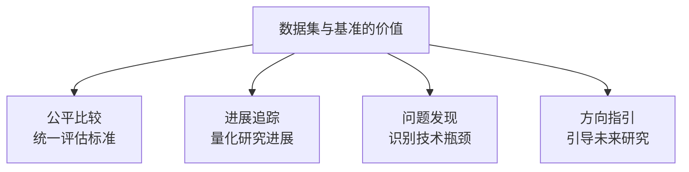
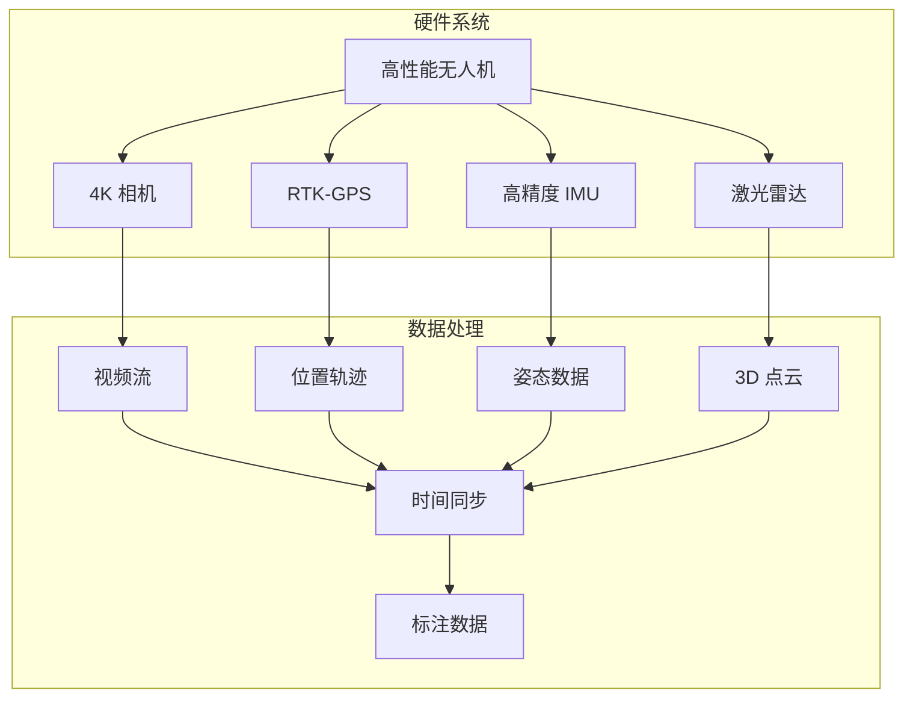
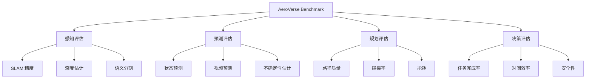
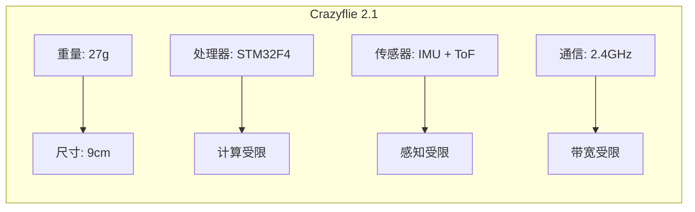
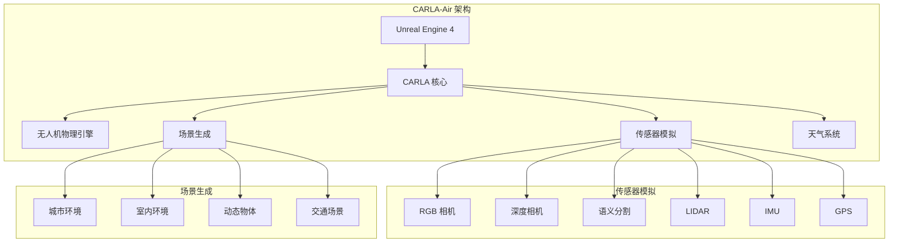
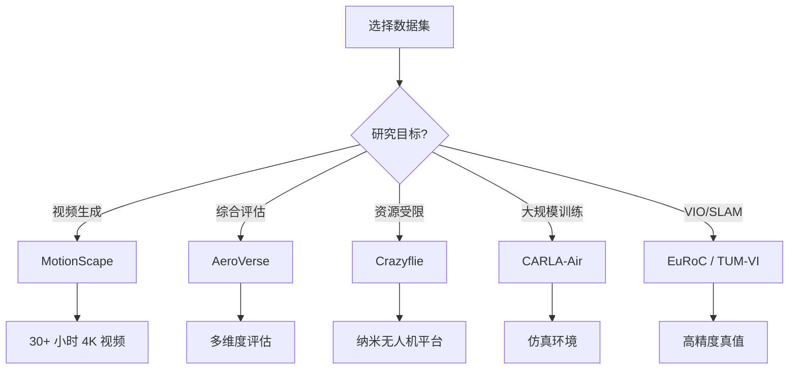
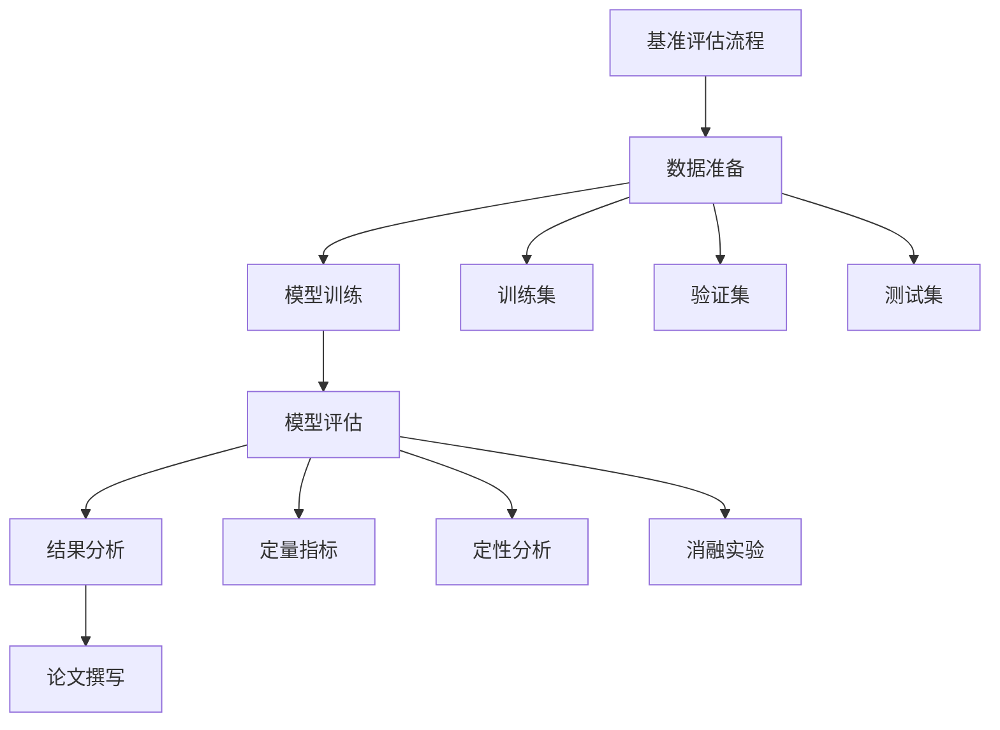

# 关键数据集与基准：评估无人机世界模型

> **预计阅读：18 分钟 | 前置知识：数据集概念、评估指标基础、无人机系统基础**

---

## 1. 引言：为什么数据集和基准很重要？

世界模型的评估面临独特的挑战：如何衡量一个模型对世界的"理解"程度？数据集和基准提供了标准化的评估框架，使得不同方法可以在相同条件下公平比较。



本节介绍无人机世界模型领域的关键数据集和基准，包括 MotionScape、AeroVerse Benchmark、Crazyflie Benchmark 和 CARLA-Air。

---

## 2. MotionScape：大规模无人机视频数据集

### 2.1 论文概述

**论文：** *"MotionScape: A Large-Scale Dataset for UAV Video Generation"*
**arXiv：** 2604.07991
**GitHub：** Thelegendzz/MotionScape
**核心贡献：** 目前最大的无人机视频数据集，包含 30+ 小时 4K 视频和精确的 6-DoF 轨迹。

### 2.2 数据集规格

| 属性 | 规格 |
|------|------|
| 总时长 | 30+ 小时 |
| 视频分辨率 | 4K (3840x2160) |
| 帧率 | 30 FPS |
| 轨迹精度 | 6-DoF, cm 级精度 |
| 场景数量 | 50+ 不同场景 |
| 飞行类型 | 航拍、巡检、跟踪、穿越 |

### 2.3 数据采集系统



### 2.4 数据标注

| 标注类型 | 内容 | 精度 |
|---------|------|------|
| 6-DoF 轨迹 | 位置 + 姿态 | cm 级 |
| 场景语义 | 物体类别、可通行性 | 像素级 |
| 相机内参 | 焦距、畸变 | 精确标定 |
| 环境信息 | 光照、天气 | 类别标注 |

### 2.5 应用场景

| 应用 | 使用方式 | 预期效果 |
|------|---------|---------|
| 视频生成 | 训练条件视频生成模型 | 生成逼真的无人机视频 |
| 世界模型 | 训练动力学预测模型 | 学习飞行动态 |
| 视觉 SLAM | 评估 SLAM 系统 | 测试定位精度 |
| 路径规划 | 训练和评估规划算法 | 优化飞行路径 |

---

## 3. AeroVerse Benchmark

### 3.1 概述

AeroVerse Benchmark 是 AeroVerse 综述论文提出的统一评估基准，覆盖无人机世界模型的多个维度。

### 3.2 评估维度



### 3.3 评估指标

**感知指标：**

| 指标 | 公式 | 含义 |
|------|------|------|
| ATE (Absolute Trajectory Error) | \|\|t_pred - t_gt\|\| | 绝对轨迹误差 |
| RPE (Relative Pose Error) | \|\|ΔT_pred - ΔT_gt\|\| | 相对位姿误差 |
| IoU (Intersection over Union) | \|A∩B\| / \|A∪B\| | 语义分割精度 |
| Depth Error | \|d_pred - d_gt\| | 深度估计误差 |

**预测指标：**

| 指标 | 公式 | 含义 |
|------|------|------|
| MSE | mean((ŷ - y)²) | 均方误差 |
| SSIM | 结构相似性 | 视觉质量 |
| FID | Frechet Inception Distance | 生成质量 |
| Calibration Error | \|p - empirical_p\| | 不确定性校准 |

**规划指标：**

| 指标 | 公式 | 含义 |
|------|------|------|
| Path Length | Σ\|\|Δt\|\| | 路径长度 |
| Collision Rate | n_collision / n_total | 碰撞率 |
| Energy Cost | Σ\|\|action\|\|² | 能量消耗 |
| Success Rate | n_success / n_total | 任务成功率 |

### 3.4 基准场景

| 场景 | 描述 | 难度 |
|------|------|------|
| 室内简单 | 单房间，无障碍物 | 低 |
| 室内复杂 | 多房间，家具密集 | 中 |
| 室外开阔 | 空旷场地 | 低 |
| 室外城市 | 建筑密集，遮挡多 | 高 |
| 森林 | 树木密集，光照复杂 | 高 |
| 动态环境 | 移动物体，变化光照 | 很高 |

---

## 4. Crazyflie Nano-Drone Benchmark

### 4.1 论文概述

**论文：** *"Benchmarking World Models on Nano-Drones"*
**arXiv：** 2512.14450
**核心贡献：** 首个专注于纳米无人机的世界模型基准，使用 Crazyflie 平台。

### 4.2 平台特点



**Crazyflie 的限制：**

| 限制 | 具体参数 | 对世界模型的影响 |
|------|---------|-----------------|
| 计算能力 | 168 MHz, 192 KB RAM | 模型必须极小 |
| 传感器 | IMU + ToF 距离 | 感知信息有限 |
| 续航 | 7 分钟 | 训练数据有限 |
| 通信 | 2.4 GHz, 250 Kbps | 数据传输受限 |

### 4.3 基准任务

| 任务 | 描述 | 评估指标 |
|------|------|---------|
| 悬停 | 在固定位置保持稳定 | 位置误差 |
| 避障 | 避开静态障碍物 | 碰撞率 |
| 跟踪 | 跟随移动目标 | 跟踪误差 |
| 穿越 | 穿过狭窄通道 | 成功率 |

### 4.4 模型压缩挑战

在 Crazyflie 上部署世界模型面临极端的资源限制：

| 模型 | 原始大小 | 压缩后 | 压缩方法 |
|------|---------|--------|---------|
| DreamerV3 | 50MB | 2MB | 量化 + 剪枝 |
| 轻量级 RSSM | 10MB | 500KB | 知识蒸馏 |
| Tiny World Model | 2MB | 200KB | 极简架构 |

**压缩技术：**

| 技术 | 压缩比 | 精度损失 | 适用性 |
|------|--------|---------|--------|
| 量化 (INT8) | 4x | 低 | 通用 |
| 剪枝 | 2-10x | 中 | 稀疏模型 |
| 知识蒸馏 | 5-20x | 中 | 大模型到小模型 |
| 低秩分解 | 2-5x | 低 | 线性层 |
| 二值化 | 32x | 高 | 极端压缩 |

---

## 5. CARLA-Air 仿真平台

### 5.1 概述

CARLA-Air 是基于 CARLA 自动驾驶仿真器扩展的无人机仿真平台，提供高保真的城市环境和物理模拟。

### 5.2 平台架构



### 5.3 功能特性

| 特性 | 描述 | 对世界模型的价值 |
|------|------|-----------------|
| 高保真渲染 | 基于 UE4 的逼真渲染 | 视觉世界模型训练 |
| 物理模拟 | 精确的空气动力学 | 动力学世界模型训练 |
| 传感器模拟 | 多种传感器模型 | 多模态世界模型 |
| 场景多样性 | 丰富的人物、车辆 | 泛化能力评估 |
| Python API | 易于使用的接口 | 快速原型开发 |

### 5.4 与真实数据的对比

| 方面 | CARLA-Air | 真实数据 | 差距 |
|------|-----------|---------|------|
| 视觉质量 | 高 | 很高 | 小 |
| 物理准确性 | 中 | 很高 | 中 |
| 数据多样性 | 可控 | 不可控 | - |
| 标注质量 | 完美 | 有噪声 | - |
| 采集成本 | 低 | 高 | - |
| 安全性 | 安全 | 有风险 | - |

---

## 6. 其他重要数据集

### 6.1 EuRoC MAV Dataset

| 属性 | 规格 |
|------|------|
| 类型 | MAV 飞行数据 |
| 传感器 | 双目相机 + IMU |
| 场景 | 室内房间 |
| 标注 | 高精度真值 (Vicon/Leica) |
| 应用 | VIO/SLAM 评估 |

### 6.2 TUM-VI Dataset

| 属性 | 规格 |
|------|------|
| 类型 | 视觉-惯性数据 |
| 传感器 | 双目相机 + IMU |
| 场景 | 室内外混合 |
| 标注 | 6-DoF 真值 |
| 应用 | 视觉惯性里程计评估 |

### 6.3 Zurich Urban MAV Dataset

| 属性 | 规格 |
|------|------|
| 类型 | 城市 MAV 飞行 |
| 传感器 | 相机 + IMU + GPS |
| 场景 | 城市环境 |
| 标注 | GPS 真值 |
| 应用 | 城市导航评估 |

---

## 7. 数据集对比总结

### 7.1 综合对比表

| 数据集 | 类型 | 规模 | 传感器 | 场景 | 精度 | 主要用途 |
|--------|------|------|--------|------|------|---------|
| MotionScape | 视频 + 轨迹 | 30+ 小时 | 4K 相机 + RTK-GPS | 50+ 场景 | cm 级 | 视频生成, 世界模型 |
| AeroVerse | 多任务基准 | 多场景 | 多种 | 室内外 | 高 | 综合评估 |
| Crazyflie | 纳米无人机 | 小规模 | IMU + ToF | 室内 | 中 | 资源受限评估 |
| CARLA-Air | 仿真 | 无限 | 多种模拟 | 城市 | 高 (仿真) | 训练, 评估 |
| EuRoC | MAV 飞行 | 11 序列 | 双目 + IMU | 室内 | 高 | VIO/SLAM |
| TUM-VI | 视觉惯性 | 28 序列 | 双目 + IMU | 室内外 | 高 | VIO 评估 |

### 7.2 选择指南



---

## 8. 评估指标详解

### 8.1 感知指标

**ATE (Absolute Trajectory Error)：**

```python
def compute_ate(estimated_poses, ground_truth_poses):
    """
    计算绝对轨迹误差
    """
    errors = []
    for est, gt in zip(estimated_poses, ground_truth_poses):
        position_error = np.linalg.norm(est[:3, 3] - gt[:3, 3])
        errors.append(position_error)

    ate_rmse = np.sqrt(np.mean(np.array(errors)**2))
    return ate_rmse
```

**RPE (Relative Pose Error)：**

```python
def compute_rpe(estimated_poses, ground_truth_poses, delta=1):
    """
    计算相对位姿误差
    """
    errors = []
    for i in range(len(estimated_poses) - delta):
        # 相对位姿
        est_rel = np.linalg.inv(estimated_poses[i]) @ estimated_poses[i + delta]
        gt_rel = np.linalg.inv(ground_truth_poses[i]) @ ground_truth_poses[i + delta]

        # 误差
        error = np.linalg.inv(gt_rel) @ est_rel
        translation_error = np.linalg.norm(error[:3, 3])
        errors.append(translation_error)

    rpe_rmse = np.sqrt(np.mean(np.array(errors)**2))
    return rpe_rmse
```

### 8.2 预测指标

**SSIM (Structural Similarity Index)：**

```python
def compute_ssim(image1, image2):
    """
    计算结构相似性
    """
    C1 = (0.01 * 255)**2
    C2 = (0.03 * 255)**2

    mu1 = cv2.GaussianBlur(image1, (11, 11), 1.5)
    mu2 = cv2.GaussianBlur(image2, (11, 11), 1.5)

    sigma1_sq = cv2.GaussianBlur(image1**2, (11, 11), 1.5) - mu1**2
    sigma2_sq = cv2.GaussianBlur(image2**2, (11, 11), 1.5) - mu2**2
    sigma12 = cv2.GaussianBlur(image1 * image2, (11, 11), 1.5) - mu1 * mu2

    ssim_map = ((2 * mu1 * mu2 + C1) * (2 * sigma12 + C2)) / \
               ((mu1**2 + mu2**2 + C1) * (sigma1_sq + sigma2_sq + C2))

    return ssim_map.mean()
```

**FID (Frechet Inception Distance)：**

```python
def compute_fid(real_features, generated_features):
    """
    计算 FID 分数
    """
    # 计算均值和协方差
    mu_real = np.mean(real_features, axis=0)
    sigma_real = np.cov(real_features, rowvar=False)

    mu_gen = np.mean(generated_features, axis=0)
    sigma_gen = np.cov(generated_features, rowvar=False)

    # 计算 FID
    diff = mu_real - mu_gen
    covmean = sqrtm(sigma_real @ sigma_gen)

    fid = diff @ diff + np.trace(sigma_real + sigma_gen - 2 * covmean)
    return fid
```

### 8.3 规划指标

| 指标 | 公式 | 含义 | 理想值 |
|------|------|------|--------|
| Path Length | L = Σ\|\|p_{i+1} - p_i\|\| | 路径总长度 | 越短越好 |
| Collision Rate | CR = n_collision / n_total | 碰撞概率 | 0 |
| Smoothness | S = Σ\|\|a_{i+1} - a_i\|\| | 路径平滑度 | 越小越好 |
| Energy Cost | E = Σ\|\|u_i\|\|² | 能量消耗 | 越小越好 |
| Success Rate | SR = n_success / n_total | 任务成功率 | 1 |

---

## 9. 基准使用最佳实践

### 9.1 实验设计



### 9.2 常见陷阱

| 陷阱 | 描述 | 避免方法 |
|------|------|---------|
| 数据泄露 | 测试数据参与训练 | 严格划分数据集 |
| 过拟合基准 | 针对基准调参 | 使用多个基准 |
| 忽略方差 | 只报告均值 | 多次运行，报告方差 |
| 不公平比较 | 不同设置比较 | 统一实验设置 |
| 忽略效率 | 只看精度 | 同时报告计算成本 |

### 9.3 结果报告规范

| 必须报告 | 建议报告 |
|---------|---------|
| 评估指标均值 | 指标方差/标准差 |
| 实验设置 | 计算资源 |
| 基线方法 | 消融实验 |
| 数据集版本 | 失败案例分析 |

---

## 10. 关键资源链接

| 资源 | 链接 | 说明 |
|------|------|------|
| MotionScape | GitHub: Thelegendzz/MotionScape | 30+ 小时 4K 无人机视频 |
| AeroVerse | arXiv: 2408.15511 | 综述和基准 |
| CARLA | carla.org | 开源仿真平台 |
| EuRoC | projects.asl.ethz.ch/datasets/doku.php?id=kmavvisualinertialdatasets | MAV 数据集 |
| TUM-VI | vision.in.tum.de/data/datasets/visual-inertial-dataset | 视觉惯性数据集 |

---

## 11. 延伸阅读

- [01-世界模型发展史](./01-世界模型发展史.md) — 世界模型的整体发展脉络
- [02-生成式世界模型](./02-生成式世界模型.md) — 生成式世界模型的训练数据需求
- [03-模型强化学习世界模型](./03-模型强化学习世界模型.md) — Dreamer 系列的评估方法
- [04-3D场景世界模型](./04-3D场景世界模型.md) — 3D 重建评估基准
- [05-无人机世界模型综述](./05-无人机世界模型综述.md) — AeroVerse 基准的详细说明

---

## 12. 思考题

### 题目 1：数据集选择

你正在开发一个室内无人机避障系统，需要选择数据集进行训练和评估。你会选择哪些数据集？为什么？

<details>
<summary>参考答案</summary>

**推荐选择：**

1. **CARLA-Air（主要训练）：**
   - 原因：室内场景可以自定义，数据量无限
   - 用途：预训练世界模型，学习基本的避障策略
   - 优势：安全、成本低、标注完美

2. **Crazyflie Benchmark（资源受限评估）：**
   - 原因：室内场景，与目标部署环境相似
   - 用途：评估模型在资源受限设备上的性能
   - 优势：真实硬件，真实挑战

3. **TUM-VI（VIO 评估）：**
   - 原因：室内视觉惯性数据，有高精度真值
   - 用途：评估状态估计精度
   - 优势：标准基准，可比性强

4. **自采数据（微调）：**
   - 原因：目标环境的特定数据
   - 用途：微调模型，适应特定场景
   - 优势：最相关

**训练流程：**
1. 在 CARLA-Air 上预训练世界模型
2. 在 TUM-VI 上评估状态估计
3. 在 Crazyflie Benchmark 上评估避障性能
4. 使用自采数据微调
5. 在真实环境中部署和测试

**注意事项：**
- 仿真到真实的差距需要域适应
- 室内环境的多样性需要考虑
- 资源受限设备需要模型压缩
</details>

### 题目 2：评估指标选择

对于一个无人机视频生成世界模型，应该使用哪些评估指标？如何平衡不同指标？

<details>
<summary>参考答案</summary>

**推荐指标：**

1. **视觉质量指标：**
   - FID (Frechet Inception Distance)：衡量生成图像的整体质量
   - SSIM (Structural Similarity)：衡量结构相似性
   - LPIPS (Learned Perceptual Image Patch Similarity)：衡量感知相似性

2. **时序一致性指标：**
   - FVD (Frechet Video Distance)：衡量视频的整体质量
   - 时序 SSIM：连续帧的一致性
   - 光流一致性：运动的平滑性

3. **条件控制指标：**
   - 动作可控性：给定动作，生成的视频是否符合预期
   - 相机可控性：相机运动是否准确
   - 文本可控性：文本描述是否准确反映

4. **下游任务指标：**
   - 避障成功率：生成的视频用于训练避障策略的效果
   - 路径规划质量：生成的视频用于路径规划的效果

**平衡策略：**

| 优先级 | 指标 | 原因 |
|--------|------|------|
| 高 | FVD, FID | 整体质量是基础 |
| 高 | 时序一致性 | 视频不能闪烁 |
| 中 | 条件控制 | 可控性是实用性的关键 |
| 中 | 下游任务 | 最终目的是应用 |
| 低 | 单帧质量 | 可以牺牲单帧换时序 |

**权衡考虑：**
- 高 FID 可能导致时序不一致
- 强条件控制可能降低视觉质量
- 需要根据具体应用调整权重
</details>

### 题目 3：基准的局限性

讨论现有基准（如 AeroVerse、Crazyflie）的局限性，以及如何设计更好的基准。

<details>
<summary>参考答案</summary>

**现有基准的局限性：**

1. **AeroVerse 的局限性：**
   - 综述性质，缺乏标准化的评估代码
   - 场景多样性有限
   - 评估指标不够全面
   - 缺乏动态环境评估

2. **Crazyflie 的局限性：**
   - 只适用于纳米无人机
   - 场景简单（室内）
   - 传感器有限（IMU + ToF）
   - 难以扩展到复杂任务

3. **通用局限性：**
   - 仿真与真实的差距
   - 评估指标的主观性
   - 缺乏安全评估
   - 计算效率评估不足

**设计更好基准的建议：**

1. **标准化：**
   - 提供标准的评估代码
   - 统一的数据格式
   - 明确的评估协议

2. **多样性：**
   - 多种场景（室内、室外、城市、森林）
   - 多种任务（导航、跟踪、避障）
   - 多种难度级别

3. **真实性：**
   - 使用真实数据
   - 包含噪声和不确定性
   - 考虑实际部署约束

4. **全面性：**
   - 感知、预测、规划、决策
   - 精度、效率、安全性
   - 单机、多机

5. **可扩展性：**
   - 模块化设计
   - 易于添加新场景
   - 支持自定义评估

**理想基准的特性：**
- 标准化 + 多样性 + 真实性 + 全面性 + 可扩展性
- 开源、社区维护
- 定期更新
</details>

### 题目 4：数据集偏差

讨论无人机数据集可能存在的偏差（如场景偏差、动作偏差、天气偏差），以及如何缓解。

<details>
<summary>参考答案</summary>

**数据集偏差类型：**

1. **场景偏差：**
   - 数据集主要来自特定场景（如欧洲城市）
   - 缺乏多样性（如发展中国家、农村）
   - 建筑风格、植被类型的偏向

2. **动作偏差：**
   - 飞行动作偏向常见动作（悬停、直线飞行）
   - 缺乏极端动作（急转弯、高速穿越）
   - 飞手风格的偏向

3. **天气偏差：**
   - 主要在晴天采集
   - 缺乏雨天、雾天、夜间数据
   - 光照条件的偏向

4. **传感器偏差：**
   - 特定相机型号
   - 特定分辨率和帧率
   - 传感器噪声模式的偏向

5. **标注偏差：**
   - 标注者主观性
   - 标注质量不一致
   - 标注粒度的偏向

**缓解策略：**

1. **数据收集阶段：**
   - 多地点、多时间采集
   - 多种天气条件
   - 多种飞手和飞行风格
   - 多种传感器

2. **数据处理阶段：**
   - 数据增强（翻转、旋转、颜色抖动）
   - 域随机化（仿真中）
   - 平衡采样（确保各类别平衡）

3. **训练阶段：**
   - 对抗训练减少偏差
   - 域适应技术
   - 加权损失函数

4. **评估阶段：**
   - 分析不同子集的性能
   - 报告偏差敏感性
   - 使用多个数据集验证

**实际建议：**
- 在论文中明确说明数据集的局限性
- 使用多个数据集验证泛化能力
- 开源数据集，鼓励社区补充
- 定期更新数据集
</details>

---

> **返回：** [01-世界模型发展史](./01-世界模型发展史.md) -- 回顾世界模型的整体发展脉络。
