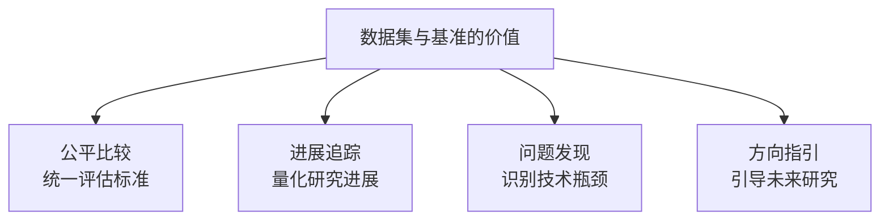
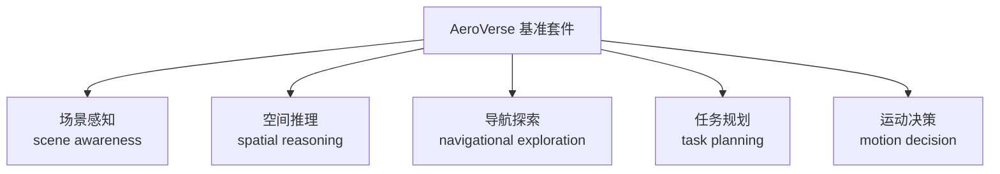
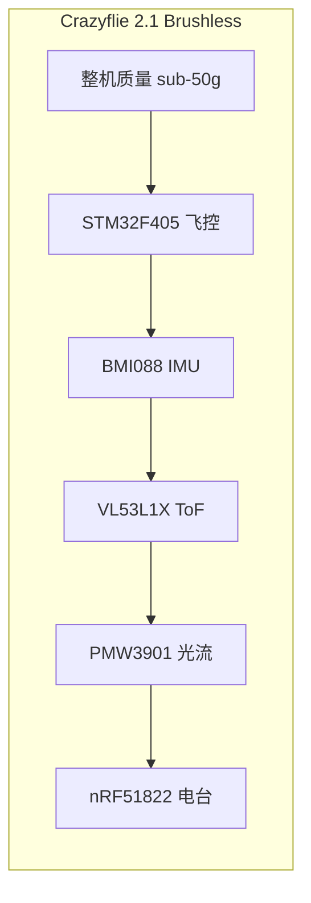
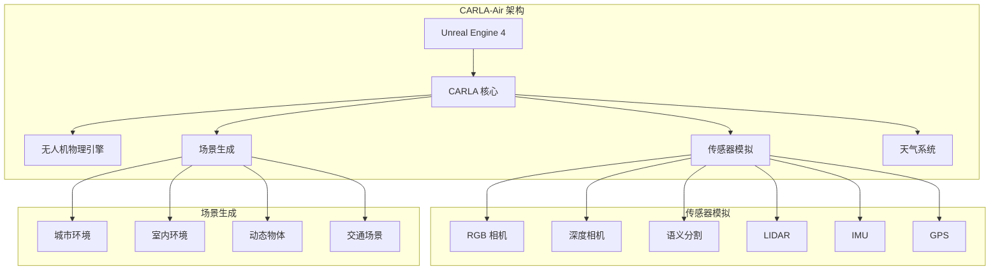
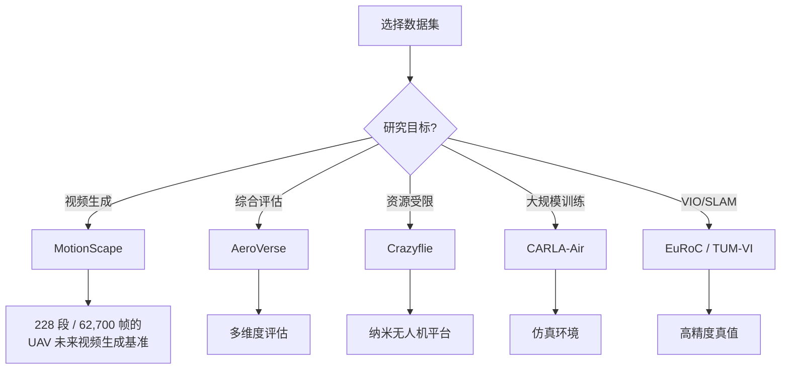
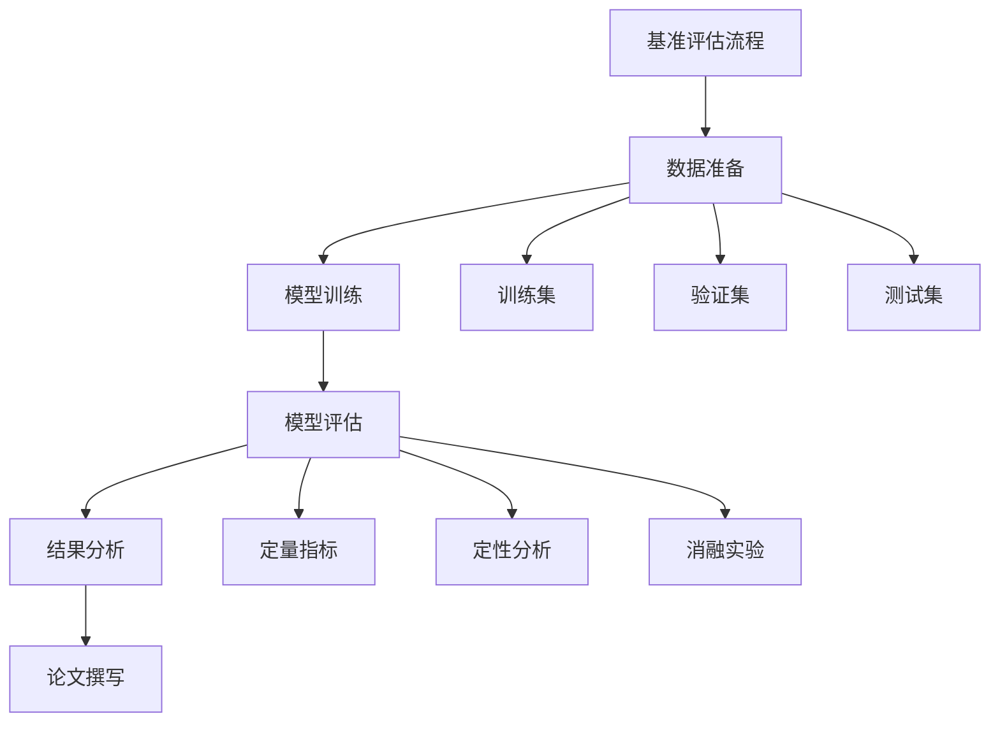

# 关键数据集与基准：评估无人机世界模型

> **预计阅读：18 分钟 | 前置知识：数据集概念、评估指标基础、无人机系统基础**

---

## 1. 为什么数据集和基准很重要？

世界模型的评估面临独特的挑战：如何衡量一个模型对世界的"理解"程度？数据集和基准提供了标准化的评估框架，使得不同方法可以在相同条件下公平比较。


```mermaid
graph TB
    A[数据集与基准的价值] --> B[公平比较<br/>统一评估标准]
    A --> C[进展追踪<br/>量化研究进展]
    A --> D[问题发现<br/>识别技术瓶颈]
    A --> E[方向指引<br/>引导未来研究]
```

这一领域的关键数据集和基准有四个：MotionScape、AeroVerse Benchmark、Crazyflie Benchmark 和 CARLA-Air。

> **勘误（2026-10）**：本章第 2～4 节早先有大量数据规模与评测协议描述与论文原文不符（共 3 处【证伪】），已在各节原位改写并逐条标注。改动集中在两类：**数据规模/统计数字**与**评测协议**。§5 CARLA-Air 与 §6 的三个经典 VIO 数据集经核查基本相符，未改。

---

## 2. MotionScape：无人机未来视频生成基准

### 2.1 论文概述

**论文：** *"MotionScape: A Motion-Stratified UAV Video Benchmark for World Modeling and Future Video Generation"*
**arXiv：** [2604.07991](https://arxiv.org/abs/2604.07991)（v2，2026-09 更新）
**GitHub：** Thelegendzz/MotionScape · **Zenodo：** DOI 10.5281/zenodo.21954342
**核心贡献：** 面向多条件无人机视角未来视频生成的评测基准：228 段高分辨率视频、62,700 帧，配天气与光照、场景环境、相机视角运动三类语义标注，并按光流强度分成低/中/高三档运动层。

> **勘误（2026-10）**：本节早先按 **v1** 的数字写成「目前最大的无人机视频数据集，30+ 小时 4K 视频和精确的 6-DoF 轨迹」，同时挂的却是 **v2 的题名**，两者互相矛盾。v2（2026-09-08 更新，当前版本）把基准改成小规模评测集，摘要原句：*"a real-world UAV-view benchmark comprising 228 high-resolution video clips totaling 62,700 frames, with semantic annotations of weather and illumination conditions, scene environment, and camera-viewpoint motion."*<br>另需注意：**无论 v1 还是 v2 都不含位姿真值** —— v1 的 6-DoF 位姿是单目 DROID-SLAM 估计，论文自己写 *"such trajectories cannot replace high-precision ground-truth poses"*，且单目全局尺度不可确定；v2 则完全删掉了位姿。

### 2.2 数据集规格

| 属性 | 规格 |
|------|------|
| 片段 / 帧数 | 228 段 / 62,700 帧 |
| 总时长 | 约 34.9 分钟 |
| 分辨率 | 1080p 起（源视频要求 ≥1080p） |
| 帧率 | 29.97 FPS（每段标准化为 275 帧） |
| 源视频数 | 67 个（每个源平均取 3.4 段） |
| 位姿真值 | 无 |
| 运动分层 | 按光流强度分 low / medium / high 三档 |
| 评测协议 | Text2World / Image2World / Video2World |

> **勘误（2026-10）**：本表早先的「总时长 30+ 小时」「4K (3840x2160)」「轨迹精度 6-DoF, cm 级」「场景数量 50+」「飞行类型 航拍/巡检/跟踪/穿越」五项全部查无来源或属 v1 参数。按 v2 Table 1，MotionScape 的分辨率写的是 **≥ 1080p**（入选下限，不是统一值）、帧率 **29.97**——`source_manifest.json` 里 228 项的实测源分辨率是 3840×2160 共 170 项、1920×1080 共 43 项、2560×1440 共 12 项，另有 2 项 3840×1634 与 1 项 7680×3268，所以「统一 4K」和「就是 1080p」两种说法都不对；「50+ 场景」疑似把 v1 里「随机抽 50 段做评测子集」误当成场景数（v2 给的是 67 个源视频、228 段）；「巡检/跟踪/穿越」这类任务划分两版都没有，v2 只按光流强度分 low/medium/high（75 / 75 / 78 段）。

### 2.3 数据来源


```mermaid
graph LR
    A[YouTube 公开的<br/>无人机 / FPV 视频] --> B[CLIP 辅助筛选]
    B --> C[人工确认]
    C --> D[裁成 275 帧片段<br/>标准化 29.97 FPS]
    D --> E[光流强度分层<br/>low / medium / high]
    E --> F[三字段语义标注]
```

数据不是自采的。论文 v1 原句：*"The raw candidate videos in our dataset are mainly drawn from manually pre-screened UAV video compilations on YouTube."*

> **勘误（2026-10）**：本节早先画了一张「高性能无人机 + 4K 相机 + RTK-GPS + 高精度 IMU + 激光雷达」的采集系统图。**MotionScape 没有任何自采硬件**，数据来源是 YouTube 上现成的无人机视频，位姿（仅 v1 有）由单目 DROID-SLAM 恢复。该图已整张替换。

### 2.4 数据标注

v2 的标注只有三个字段：

| 标注字段 | 内容 |
|---------|------|
| weather and illumination | 天气与光照类别 |
| scene environment | 场景环境的自由文本描述（≤5 词） |
| camera-viewpoint motion | 相机视角运动 |

> **勘误（2026-10）**：本节早先列了「6-DoF 轨迹（cm 级）」「场景语义（像素级）」「相机内参（精确标定）」三项。v2 原文：*"Each annotation record contains three fields: weather, environment, and caption."* —— 没有像素级语义分割，也没有相机内参标定。

### 2.5 评测协议

| 条件设定 | 输入 | 评测什么 |
|---------|------|---------|
| Text2World | 文本描述 | 由语言条件生成未来视频 |
| Image2World | 首帧图像 | 由单帧外推未来 |
| Video2World | 已有视频前缀 | 由视频上下文续写 |

论文用代表性基线模型做了技术验证，按条件设定与运动层分别报分数，目的是给无人机世界模型的「未来视觉模拟能力」提供统一平台。

> **勘误（2026-10）**：本节早先列的是「视频生成 / 世界模型 / 视觉 SLAM / 路径规划」四类应用及其预期效果。其中「视觉 SLAM」与「路径规划」与本基准无关（基准不含位姿真值），已替换为论文实际定义的三种评测条件。

---

## 3. AeroVerse Benchmark

### 3.1 概述

AeroVerse 是一篇**基准套件（benchmark suite）论文**，不是综述。它给出「仿真 → 预训练 → 微调 → 评测」的完整链路：一个仿真器、若干数据集，以及一个基于 GPT-4 的自动评测器 SkyAgent-Eval。

> **勘误（2026-10）**：本节早先称「AeroVerse Benchmark 是 AeroVerse 综述论文提出的统一评估基准」。该论文（arXiv:2408.15511）的题名与定位都是基准套件：*"AeroVerse: UAV-Agent Benchmark Suite for Simulating, Pre-training, Finetuning, and Evaluating Aerospace Embodied World Models"*，且 arXiv 全库检索 AeroVerse 只有这一篇。§12 的延伸阅读原先指到 [05-无人机世界模型综述](./05-无人机世界模型综述.md) 的「AeroVerse 基准的详细说明」，同样以基准套件为准。

### 3.2 五个下游任务


```mermaid
graph TB
    A[AeroVerse 基准套件] --> B[场景感知<br/>scene awareness]
    A --> C[空间推理<br/>spatial reasoning]
    A --> D[导航探索<br/>navigational exploration]
    A --> E[任务规划<br/>task planning]
    A --> F[运动决策<br/>motion decision]
```

论文原句：*"we clearly define 5 downstream tasks, i.e., aerospace embodied scene awareness, spatial reasoning, navigational exploration, task planning, and motion decision."*

> **勘误（2026-10）**：本节早先画的是「感知 / 预测 / 规划 / 决策」四维评估图，并给每一维配了 SLAM 精度、深度估计、视频预测、不确定性估计等子项。论文定义的是**五个下游任务**，其中没有「预测评估」这一维度，也没有那些子项。

### 3.3 评估指标

论文的评测量是**文本生成类指标**加一个**基于 GPT-4 的 LLM 裁判**：

| 指标族 | 具体指标 | 用在哪 |
|-------|---------|-------|
| 传统文本指标 | BLEU-1 / BLEU-2 / BLEU-3 / BLEU-4 | 生成式任务的 n-gram 重合 |
| 语义指标 | CIDEr | 同上，加权 n-gram 共识 |
| 自动裁判 | GPT-4 驱动的 SkyAgent-Eval | 由 LLM 对回答质量打分 |

论文原句：*"Common indicators include BLEU-1, BLEU-2, BLEU-3, and BLEU-4."* / *"we introduce an automated evaluation method based on GPT-4 for tasks related to aerospace embodied scene awareness ... and path planning."*

> **勘误（2026-10）**：本节早先列了三张指标表 —— 感知（ATE / RPE / IoU / Depth Error）、预测（MSE / SSIM / FID / Calibration Error）、规划（Path Length / Collision Rate / Energy Cost / Success Rate）。**这三张表整表无来源**：论文全文用词边界检索，ATE、RPE、IoU、FID、SSIM、MSE、Collision Rate、Energy Cost **命中数均为 0**。三张表已整表删除。

### 3.4 基准场景

| 场景 | 说明 |
|------|------|
| Shanghai | 城市仿真场景 |
| Shenzhen | 城市仿真场景 |
| School | 校园场景 |
| Residence | 住宅区场景 |

论文原句：*"This encompasses four real-world urban scenarios, i.e., Shanghai, Shenzhen, School, and Residence."*

> **勘误（2026-10）**：本节早先列了「室内简单 / 室内复杂 / 室外开阔 / 室外城市 / 森林 / 动态环境」六类难度分级。论文只有四个城市场景，没有难度分级，也没有森林与动态环境。

---

## 4. Crazyflie Nano-Drone Benchmark

### 4.1 论文概述

**论文：** *"Nonlinear System Identification Nano-drone Benchmark"*
**arXiv：** 2512.14450
**核心贡献：** 首个公开的纳米无人机真实飞行轨迹**系统辨识**基准：Crazyflie 2.1 Brushless 平台上的 4 条激进轨迹、75k 真实样本，4 维电机输入配 13 维状态输出。

> **勘误（2026-10）**：本节早先写「首个专注于纳米无人机的**世界模型**基准」。论文通篇与世界模型无关，自述是首个纳米无人机真实飞行轨迹的**系统辨识数据集**，原文：*"The primary contribution of this work is a ready-to-use, high-quality benchmark that ... constitutes the first publicly available dataset of real flight trajectories collected on a nano-drone."*

### 4.2 平台


```mermaid
graph LR
    subgraph "Crazyflie 2.1 Brushless"
        A[整机质量 sub-50g] --> B[STM32F405 飞控]
        B --> C[BMI088 IMU]
        C --> D[VL53L1X ToF]
        D --> E[PMW3901 光流]
        E --> F[nRF51822 电台]
    end
```

论文实际给出的部件清单：

| 部件 | 型号 |
|------|------|
| 飞控 MCU | STM32F405 |
| IMU | BMI088 |
| 测距 | VL53L1X ToF |
| 光流 | PMW3901 |
| 电台 | nRF51822 |

> **勘误（2026-10）**：本节早先写「重量: 27g」—— 27g 是旧款非 brushless 的 Crazyflie 2.1 参数，本文平台是 **Crazyflie 2.1 Brushless**，摘要原句：*"a sub-50g aerial vehicle widely adopted in robotics research."* 同节早先那张「168 MHz / 192 KB RAM / 7 分钟续航 / 250 Kbps」的限制表，这些数字论文没有给出（多为旧款通用参数），已删。

### 4.3 基准任务

这个基准的「任务」不是悬停避障，而是**系统辨识**：

| 项目 | 内容 |
|------|------|
| 轨迹 | 4 条激进轨迹 |
| 输入 | 4 维电机转速指令 |
| 输出 | 13 维状态测量 |
| 样本量 | 75k 真实飞行样本 |
| 评测 | 单步预测误差与多步误差传播 |

论文原句：*"The dataset comprises four aggressive trajectories with synchronized 4-dimensional motor inputs and 13-dimensional output measurements."*

> **勘误（2026-10）**：本节早先列的是「悬停 / 避障 / 跟踪 / 穿越」四类任务表。论文做的是 4 条激进轨迹上的系统辨识，没有这四类任务（原文里 "hover" 只出现在「近悬停工况」这一描述中）。

### 4.4 与机载部署的关系

在 Crazyflie 这一级平台上部署世界模型确实要面对极端的资源限制，但**这篇论文不涉及模型压缩**：全文没有量化、剪枝、蒸馏或压缩的内容。想讨论机载压缩，应引 [04-边缘VLM部署](../04-VLM专题/04-边缘VLM部署.md) 与 [05-机载部署与优化](../03-VLA专题/05-机载部署与优化.md)，而不是引这个基准。

> **勘误（2026-10）**：本节早先有两张表 —— 「DreamerV3 50MB → 2MB / 轻量级 RSSM 10MB → 500KB / Tiny World Model 2MB → 200KB」的压缩结果表，以及量化/剪枝/蒸馏的压缩技术表。前者**整表虚构**（论文中 DreamerV3、quantiz、prun、distill、compression 检索命中均为 0），后者是无出处的通用区间且容易被误读成论文结论。两张表已删。

---

## 5. CARLA-Air 仿真平台

### 5.1 概述

CARLA-Air 是基于 CARLA 自动驾驶仿真器扩展的无人机仿真平台，提供高保真的城市环境和物理模拟。

### 5.2 平台架构


```mermaid
graph TB
    subgraph CARLA-Air 架构
        A[Unreal Engine 4] --> B[CARLA 核心]
        B --> C[无人机物理引擎]
        B --> D[传感器模拟]
        B --> E[场景生成]
        B --> F[天气系统]
    end

    subgraph 传感器模拟
        D --> G[RGB 相机]
        D --> H[深度相机]
        D --> I[语义分割]
        D --> J[LIDAR]
        D --> K[IMU]
        D --> L[GPS]
    end

    subgraph 场景生成
        E --> M[城市环境]
        E --> N[室内环境]
        E --> O[动态物体]
        E --> P[交通场景]
    end
```

### 5.3 功能特性

| 特性 | 描述 | 对世界模型的价值 |
|------|------|-----------------|
| 高保真渲染 | 基于 UE4 的逼真渲染 | 视觉世界模型训练 |
| 物理模拟 | 精确的空气动力学 | 动力学世界模型训练 |
| 传感器模拟 | 多种传感器模型 | 多模态世界模型 |
| 场景多样性 | 丰富的人物、车辆 | 泛化能力评估 |
| Python API | 易于使用的接口 | 快速原型开发 |

### 5.4 与真实数据的对比

| 方面 | CARLA-Air | 真实数据 | 差距 |
|------|-----------|---------|------|
| 视觉质量 | 高 | 很高 | 小 |
| 物理准确性 | 中 | 很高 | 中 |
| 数据多样性 | 可控 | 不可控 | - |
| 标注质量 | 完美 | 有噪声 | - |
| 采集成本 | 低 | 高 | - |
| 安全性 | 安全 | 有风险 | - |

---

## 6. 其他重要数据集

### 6.1 EuRoC MAV Dataset

| 属性 | 规格 |
|------|------|
| 类型 | MAV 飞行数据 |
| 传感器 | 双目相机 + IMU |
| 场景 | 室内房间 |
| 标注 | 高精度真值 (Vicon/Leica) |
| 应用 | VIO/SLAM 评估 |

### 6.2 TUM-VI Dataset

| 属性 | 规格 |
|------|------|
| 类型 | 视觉-惯性数据 |
| 传感器 | 双目相机 + IMU |
| 场景 | 室内外混合 |
| 标注 | 6-DoF 真值 |
| 应用 | 视觉惯性里程计评估 |

### 6.3 Zurich Urban MAV Dataset

| 属性 | 规格 |
|------|------|
| 类型 | 城市 MAV 飞行 |
| 传感器 | 相机 + IMU + GPS |
| 场景 | 城市环境 |
| 标注 | GPS 真值 |
| 应用 | 城市导航评估 |

---

## 7. 数据集对比总结

### 7.1 综合对比表

| 数据集 | 类型 | 规模 | 传感器 | 场景 | 精度 | 主要用途 |
|--------|------|------|--------|------|------|---------|
| MotionScape | 视频基准 | 228 段 / 62,700 帧 | 无（公开视频） | 67 个源视频 | 无位姿真值 | 未来视频生成评测 |
| AeroVerse | 基准套件 | 5 个下游任务 | 仿真 + 真实 | 4 个城市 | 由仿真给出 | 综合评估 |
| Crazyflie | 系统辨识 | 75k 样本 | IMU + ToF + 光流 | 室内 | 真实飞行数据 | 动力学辨识 |
| CARLA-Air | 仿真 | 无限 | 多种模拟 | 城市 | 高 (仿真) | 训练, 评估 |
| EuRoC | MAV 飞行 | 11 序列 | 双目 + IMU | 室内 | 高 | VIO/SLAM |
| TUM-VI | 视觉惯性 | 28 序列 | 双目 + IMU | 室内外 | 高 | VIO 评估 |

> **勘误（2026-10）**：本表 MotionScape 一行早先写「30+ 小时 / 4K 相机 + RTK-GPS / 50+ 场景 / cm 级」，AeroVerse 一行写「多场景 / 室内外」，Crazyflie 一行写「小规模 / 中」精度 —— 均已按论文原文更正，理由见前文各节勘误。

### 7.2 选择指南


```mermaid
graph TB
    A[选择数据集] --> B{研究目标?}

    B -->|视频生成| C[MotionScape]
    B -->|综合评估| D[AeroVerse]
    B -->|资源受限| E[Crazyflie]
    B -->|大规模训练| F[CARLA-Air]
    B -->|VIO/SLAM| G[EuRoC / TUM-VI]

    C --> H[228 段 / 62,700 帧的<br/>UAV 未来视频生成基准]
    D --> I[多维度评估]
    E --> J[纳米无人机平台]
    F --> K[仿真环境]
    G --> L[高精度真值]
```

---

## 8. 评估指标详解

本节所有代码只依赖 `numpy`（`code/requirements.txt` 里也没有 cv2 与 scipy），可以直接复制运行。

### 8.1 感知指标

**ATE (Absolute Trajectory Error)：**

```python
def compute_ate(estimated_poses, ground_truth_poses):
    """
    计算绝对轨迹误差
    """
    errors = []
    for est, gt in zip(estimated_poses, ground_truth_poses):
        position_error = np.linalg.norm(est[:3, 3] - gt[:3, 3])
        errors.append(position_error)

    ate_rmse = np.sqrt(np.mean(np.array(errors)**2))
    return ate_rmse
```

**RPE (Relative Pose Error)：**

```python
def compute_rpe(estimated_poses, ground_truth_poses, delta=1):
    """
    计算相对位姿误差
    """
    errors = []
    for i in range(len(estimated_poses) - delta):
        # 相对位姿
        est_rel = np.linalg.inv(estimated_poses[i]) @ estimated_poses[i + delta]
        gt_rel = np.linalg.inv(ground_truth_poses[i]) @ ground_truth_poses[i + delta]

        # 误差
        error = np.linalg.inv(gt_rel) @ est_rel
        translation_error = np.linalg.norm(error[:3, 3])
        errors.append(translation_error)

    rpe_rmse = np.sqrt(np.mean(np.array(errors)**2))
    return rpe_rmse
```

### 8.2 预测指标

**SSIM (Structural Similarity Index)：**

```python
def compute_ssim(image1, image2, sigma=1.5, radius=5):
    """
    计算结构相似性（只依赖 numpy，不需要 cv2）
    """
    C1 = (0.01 * 255)**2
    C2 = (0.03 * 255)**2

    def blur(img):
        # 可分离高斯：先沿行再沿列，等价于二维高斯核
        x = np.arange(-radius, radius + 1, dtype=float)
        k = np.exp(-(x ** 2) / (2 * sigma ** 2))
        k /= k.sum()
        out = np.apply_along_axis(
            np.convolve, 0,
            np.pad(img, ((radius, radius), (0, 0)), mode="reflect"), k, "valid")
        return np.apply_along_axis(
            np.convolve, 1,
            np.pad(out, ((0, 0), (radius, radius)), mode="reflect"), k, "valid")

    mu1, mu2 = blur(image1), blur(image2)

    sigma1_sq = blur(image1**2) - mu1**2
    sigma2_sq = blur(image2**2) - mu2**2
    sigma12 = blur(image1 * image2) - mu1 * mu2

    ssim_map = ((2 * mu1 * mu2 + C1) * (2 * sigma12 + C2)) / \
               ((mu1**2 + mu2**2 + C1) * (sigma1_sq + sigma2_sq + C2))

    return ssim_map.mean()
```

> **注意**：`cv2.GaussianBlur` 默认用 BORDER_REFLECT 且核宽 11、σ=1.5，与这里的
> `radius=5`（核长 11）、`sigma=1.5`、`mode="reflect"` 对齐。换实现要对齐这三项，
> 否则同一个 SSIM 会算出不同的数。

**FID (Frechet Inception Distance)：**

```python
def sqrtm_psd(A):
    """
    对称半正定矩阵的平方根（只依赖 numpy，不需要 scipy.linalg.sqrtm）
    """
    w, V = np.linalg.eigh((A + A.T) / 2)
    return (V * np.sqrt(np.clip(w, 0.0, None))) @ V.T


def compute_fid(real_features, generated_features):
    """
    计算 FID 分数
    """
    # 计算均值和协方差
    mu_real = np.mean(real_features, axis=0)
    sigma_real = np.cov(real_features, rowvar=False)

    mu_gen = np.mean(generated_features, axis=0)
    sigma_gen = np.cov(generated_features, rowvar=False)

    # trace(sqrtm(A @ B)) 用 A^{1/2} B A^{1/2} 的谱来算：乘积不必对称，
    # 但它与 A^{1/2} 相似，特征值相同，数值上比直接对乘积开方稳
    sh = sqrtm_psd(sigma_real)
    M = sh @ sigma_gen @ sh
    w = np.linalg.eigvalsh((M + M.T) / 2)

    fid = (mu_real - mu_gen) @ (mu_real - mu_gen) \
        + np.trace(sigma_real + sigma_gen) \
        - 2 * np.sum(np.sqrt(np.clip(w, 0.0, None)))
    return fid
```

### 8.3 规划指标

| 指标 | 公式 | 含义 | 理想值 |
|------|------|------|--------|
| Path Length | L = Σ\|\|p_{i+1} - p_i\|\| | 路径总长度 | 越短越好 |
| Collision Rate | CR = n_collision / n_total | 碰撞概率 | 0 |
| Smoothness | S = Σ\|\|a_{i+1} - a_i\|\| | 路径平滑度 | 越小越好 |
| Energy Cost | E = Σ\|\|u_i\|\|² | 能量消耗 | 越小越好 |
| Success Rate | SR = n_success / n_total | 任务成功率 | 1 |

> **指标本身也会看走眼。** 上面这些量在单步、rollout、决策三类误差上各有盲区，孤立审计还会误判「修好了没有」，见 [07-世界模型评测与诊断](./07-世界模型评测与诊断.md)。

---

## 9. 动手验证：ATE 和 RPE 量的不是同一件事

8.1 节把 ATE 定义成「绝对轨迹误差」、RPE 定义成「相对位姿误差」。两个名字读起来都像「这条轨迹有多准」，但它们问的不是同一个问题：ATE 比每一帧的绝对位姿，RPE 比相邻帧之间的相对运动。这一节把三种误差源**分开构造**，看两个指标各自对什么敏感。

三组扰动都作用在同一条 4 秒、200 帧（50 Hz）、半径 2 m 的参考轨迹上：

- **全局刚体偏移**：整条估计轨迹平移 0.5 m 再偏航 3°。每一帧位姿都错，但相邻帧之间的相对运动一点没变。
- **局部抖动**：每帧位置独立加 σ = 0.02 m 的噪声。相对运动被破坏，误差不累积。
- **2% 慢漂移**：位置整体放大 2%（尺度标定没做准就长这样）。误差随离原点的距离累积，可每一帧的相对运动几乎没变。

另外，ATE 这个数报出来之前必须先说清有没有做轨迹对齐，所以下面同时给出**未对齐**与**Umeyama 刚体对齐后**两个读数。

### 9.1 三种扰动与三个指标

```python
import numpy as np
N, DT, R, W = 200, 0.02, 2.0, 0.8
t = np.arange(N) * DT
P = np.zeros((N, 4, 4)); P[:, 3, 3] = 1.0; P[:, 2, 2] = 1.0
P[:, 0, 0] = np.cos(W * t); P[:, 0, 1] = -np.sin(W * t)
P[:, 1, 0] = np.sin(W * t); P[:, 1, 1] = np.cos(W * t)
P[:, :3, 3] = np.stack([R * np.cos(W * t), R * np.sin(W * t), 0.4 * np.sin(1.7 * W * t)], 1)
def ate(est, gt):
    return float(np.sqrt(np.mean(np.linalg.norm(est[:, :3, 3] - gt[:, :3, 3], axis=1) ** 2)))
def rpe(est, gt, d=1):
    e = np.linalg.inv(est[:-d]) @ est[d:]; g = np.linalg.inv(gt[:-d]) @ gt[d:]
    return float(np.sqrt(np.mean(np.linalg.norm((np.linalg.inv(g) @ e)[:, :3, 3], axis=1) ** 2)))
def align_ate(est, gt):            # Umeyama：只准旋转 + 平移，**不含尺度**
    A, B = est[:, :3, 3].T, gt[:, :3, 3].T
    a, b = A.mean(1, keepdims=True), B.mean(1, keepdims=True)
    U, _, Vt = np.linalg.svd((B - b) @ (A - a).T)
    D = np.eye(3); D[2, 2] = np.sign(np.linalg.det(U @ Vt))
    out = est.copy(); out[:, :3, 3] = (U @ D @ Vt @ (A - a) + b).T
    return out
c, s = np.cos(np.radians(3)), np.sin(np.radians(3))
Rz = np.array([[c, -s, 0.0], [s, c, 0.0], [0.0, 0.0, 1.0]])   # 偏航 3°
shift = P.copy(); shift[:, :3, 3] = (Rz @ P[:, :3, 3].T).T + [0.5, 0, 0]
jitter = P.copy(); jitter[:, :3, 3] += np.random.default_rng(0).normal(0, 0.02, (N, 3))
drift = P.copy(); drift[:, :3, 3] *= 1.02
print(f"{'扰动':<10s}{'ATE未对齐':>11s}{'ATE对齐':>10s}{'RPE':>10s}")
for name, est in (("全局偏移", shift), ("局部抖动", jitter), ("2% 漂移", drift)):
    print(f"{name:<10s}{ate(est, P):>11.5f}{ate(align_ate(est, P), P):>10.5f}{rpe(est, P):>10.5f}")
```

### 9.2 本地实测结果

```text
参考轨迹 200 帧 @ 50 Hz，4.0 秒，半径 2.0 m，RPE 间隔 delta = 1 帧

  扰动                 ATE 未对齐      ATE 刚体对齐         RPE
  全局刚体偏移             0.44229       0.00000     0.00000
  局部抖动               0.03454       0.03436     0.04969
  2% 慢漂移             0.04043       0.03178     0.00066
```

第一行是本节最要紧的一条：整条轨迹平移了 0.5 m、还偏航了 3°，ATE 报 0.442 m，而 **RPE 报 3.14e-16 m**——数值上就是 0。RPE 只比较相邻帧之间的相对运动，而刚体偏移不改变任何一段相对运动，所以它对这类错误**在构造上就是盲的**。刚体对齐后的 ATE 同样是 0，说明对齐能消掉全局偏移；但这也意味着「报 ATE 必须同时报有没有对齐」，否则同一个错位轨迹可以报出 0.442 也可以报出 0。

第二行是唯一 RPE 抓得住的一类：每帧独立抖动 σ = 0.02 m，ATE 0.0345 m、RPE 0.0497 m，两者同量级（RPE 略大，因为相邻两帧的噪声差是 √2·σ）。这符合 RPE 的定义——它量的就是相对运动被破坏了多少。

第三行最容易被误用。位置尺度偏 2%，位姿误差随离原点的距离累积到 ATE 0.0404 m；**刚体对齐后仍有 0.0318 m**，因为 Umeyama 刚体对齐不含尺度，缩放误差不在它能消掉的那类变换里。而 RPE 只有 6.57e-04 m——比 ATE 小 62 倍。也就是说一条**尺度标定错了 2% 的轨迹，RPE 会告诉你它几乎完美**。

三行合起来，8.1 节那两个公式该怎么用就清楚了：**ATE 回答「轨迹整体准不准」，RPE 回答「局部运动像不像」**。报 RPE 而不报 ATE，等于放弃了全局一致性的检验——SLAM 与里程计论文常用 RPE 报局部精度，正是因为它对全局漂移不敏感、能把前端和后端的误差分开看，但这个优点同时也意味着它替代不了 ATE。

> **限制**：这里的三种扰动都是**在真值上手工加的**，不是真实估计器的输出。真实 SLAM/VIO 的误差形态更复杂（尺度、重力方向、时间戳偏置往往耦合在一起），本节没有覆盖。Umeyama 对齐这里只做了刚体版本，如果做含尺度的相似变换对齐，第三行的 ATE 会被大幅压低甚至归零，报数值时要说清用的是哪一种。另外 RPE 的读数依赖间隔 delta，本节固定为 1 帧；delta 取大以后 RPE 会开始看到慢漂移，结论要跟着 delta 说。第 8.2 节的 SSIM / FID 代码原本依赖 cv2 与 scipy 的 `sqrtm`，两者都不在 `code/requirements.txt` 里，已换成只用 numpy 的实现，自检见下一节。


### 9.3 运行完整脚本

```bash
py -3.9 code/l_seq_metrics.py     # 约 3 秒，CPU 即可，只需 numpy
```

完整脚本在 [`code/l_seq_metrics.py`](../../code/l_seq_metrics.py)，额外打印 8.2 节 SSIM / FID 的数值自检（`SSIM(原图, 原图) = 1.000000`、`FID(X, X) = 0`，以及模糊与加噪两种退化下的读数），并输出上面这张双面板图。

---

## 10. 基准使用最佳实践

### 10.1 实验设计


```mermaid
graph TB
    A[基准评估流程] --> B[数据准备]
    B --> C[模型训练]
    C --> D[模型评估]
    D --> E[结果分析]
    E --> F[论文撰写]

    B --> B1[训练集]
    B --> B2[验证集]
    B --> B3[测试集]

    D --> D1[定量指标]
    D --> D2[定性分析]
    D --> D3[消融实验]
```

### 10.2 常见陷阱

| 陷阱 | 描述 | 避免方法 |
|------|------|---------|
| 数据泄露 | 测试数据参与训练 | 严格划分数据集 |
| 过拟合基准 | 针对基准调参 | 使用多个基准 |
| 忽略方差 | 只报告均值 | 多次运行，报告方差 |
| 不公平比较 | 不同设置比较 | 统一实验设置 |
| 忽略效率 | 只看精度 | 同时报告计算成本 |

### 10.3 结果报告规范

| 必须报告 | 建议报告 |
|---------|---------|
| 评估指标均值 | 指标方差/标准差 |
| 实验设置 | 计算资源 |
| 基线方法 | 消融实验 |
| 数据集版本 | 失败案例分析 |

> **判据**：拿到一个数据集，先问**真值是怎么来的**，再看它的精度数字。
> 本文涉及的几种来源性质完全不同：CARLA-Air 的真值直接由仿真给出，标签是完美的但落差在保真度；
> MotionScape **不含位姿真值**，它给的是语义标注与运动分层，只适合评生成质量不适合评定位精度；
> EuRoC 与 TUM-VI 是给 VIO/SLAM 做基准的，真值由 Vicon / Leica 等独立测量系统给出。
> 「残差 0.03 m」这句话放在三者上不是同一件事 —— 这一步比选哪个指标更常被跳过。

> **勘误（2026-10）**：本条判据早先写「MotionScape 的轨迹来自机载 RTK-GPS、IMU 与激光雷达（§2.3），精度受传感器与后处理影响」，与前文的证伪一致地错。MotionScape 无位姿真值。

---

## 11. 关键资源

- **[arXiv'26.04] MotionScape** — *MotionScape: A Motion-Stratified UAV Video Benchmark for World Modeling and Future Video Generation*  
  [](https://arxiv.org/abs/2604.07991)
  228 段 / 62,700 帧的 UAV 未来视频生成基准

- **[arXiv'24.08] AeroVerse** — *AeroVerse: UAV-Agent Benchmark Suite for Simulating, Pre-training, Finetuning, and Evaluating Aerospace Embodied World Models*  
  [](https://arxiv.org/abs/2408.15511)
  航空航天具身世界模型基准套件

- **[arXiv'25.12] Crazyflie Nano-drone** — *Nonlinear System Identification Nano-drone Benchmark*  
  [](https://arxiv.org/abs/2512.14450)
  75k 真实样本的动力学辨识数据

- **[arXiv'26.03] CARLA-Air** — *CARLA-Air: Fly Drones Inside a CARLA World -- A Unified Infrastructure for Air-Ground Embodied Intelligence*  
  [](https://arxiv.org/abs/2603.28032)
  空地一体的开源仿真平台

- **[Dataset] EuRoC MAV**  
  [](https://projects.asl.ethz.ch/datasets/doku.php?id=kmavvisualinertialdatasets)
  MAV 室内飞行，VIO/SLAM 常用

- **[Dataset] TUM-VI**  
  [](https://cvg.cit.tum.de/data/datasets/visual-inertial-dataset)
  室内外视觉惯性，VIO 评估


---

以下每条链接都已逐条访问确认可打开。

---

## 12. 延伸阅读

- [01-世界模型发展史](./01-世界模型发展史.md) — 世界模型的整体发展脉络
- [02-生成式世界模型](./02-生成式世界模型.md) — 生成式世界模型的训练数据需求
- [03-模型强化学习世界模型](./03-模型强化学习世界模型.md) — Dreamer 系列的评估方法
- [04-3D场景世界模型](./04-3D场景世界模型.md) — 3D 重建评估基准
- [05-无人机世界模型综述](./05-无人机世界模型综述.md) — 无人机专用世界模型的全景，含 AeroVerse 等基准的定位

---

## 13. 思考题

### 题目 1：数据集选择

你正在开发一个室内无人机避障系统，需要选择数据集进行训练和评估。你会选择哪些数据集？为什么？

<details>
<summary>参考答案</summary>

**推荐选择：**

1. **CARLA-Air（主要训练）：**
   - 原因：室内场景可以自定义，数据量无限
   - 用途：预训练世界模型，学习基本的避障策略
   - 优势：安全、成本低、标注完美

2. **Crazyflie Benchmark（动力学建模对标）：**
   - 原因：唯一公开的纳米无人机真实飞行数据，含 4 维电机输入与 13 维状态输出
   - 用途：在真实数据上检验动力学模型的单步与多步误差
   - 优势：真实硬件、真实噪声；注意它是系统辨识基准，不改造成避障评测集
   - 局限：只有 4 条轨迹，没有障碍物场景，不评避障成功率

3. **TUM-VI（VIO 评估）：**
   - 原因：室内视觉惯性数据，有高精度真值
   - 用途：评估状态估计精度
   - 优势：标准基准，可比性强

4. **自采数据（微调）：**
   - 原因：目标环境的特定数据
   - 用途：微调模型，适应特定场景
   - 优势：最相关

**训练流程：**
1. 在 CARLA-Air 上预训练世界模型
2. 在 TUM-VI 上评估状态估计
3. 在 Crazyflie 数据上核对动力学预测的单步与多步误差
4. 使用自采数据微调
5. 在真实环境中部署和测试

> **勘误（2026-10）**：本条答案早先写「在 Crazyflie Benchmark 上评估避障性能」。该基准不含障碍物场景，是 4 条激进轨迹上的系统辨识数据集，无法用于避障评测。

**注意事项：**
- 仿真到真实的差距需要域适应
- 室内环境的多样性需要考虑
- 资源受限设备需要模型压缩
</details>

### 题目 2：评估指标选择

对于一个无人机视频生成世界模型，应该使用哪些评估指标？如何平衡不同指标？

<details>
<summary>参考答案</summary>

**推荐指标：**

1. **视觉质量指标：**
   - FID (Frechet Inception Distance)：衡量生成图像的整体质量
   - SSIM (Structural Similarity)：衡量结构相似性
   - LPIPS (Learned Perceptual Image Patch Similarity)：衡量感知相似性

2. **时序一致性指标：**
   - FVD (Frechet Video Distance)：衡量视频的整体质量
   - 时序 SSIM：连续帧的一致性
   - 光流一致性：运动的平滑性

3. **条件控制指标：**
   - 动作可控性：给定动作，生成的视频是否符合预期
   - 相机可控性：相机运动是否准确
   - 文本可控性：文本描述是否准确反映

4. **下游任务指标：**
   - 避障成功率：生成的视频用于训练避障策略的效果
   - 路径规划质量：生成的视频用于路径规划的效果

**平衡策略：**

| 优先级 | 指标 | 原因 |
|--------|------|------|
| 高 | FVD, FID | 整体质量是基础 |
| 高 | 时序一致性 | 视频不能闪烁 |
| 中 | 条件控制 | 可控性是实用性的关键 |
| 中 | 下游任务 | 最终目的是应用 |
| 低 | 单帧质量 | 可以牺牲单帧换时序 |

**权衡考虑：**
- 高 FID 可能导致时序不一致
- 强条件控制可能降低视觉质量
- 需要根据具体应用调整权重
</details>

### 题目 3：基准的局限性

讨论现有基准（如 AeroVerse、Crazyflie）的局限性，以及如何设计更好的基准。

<details>
<summary>参考答案</summary>

**现有基准的局限性：**

1. **AeroVerse 的局限性：**
   - 是基准套件而非可直接下载的单一数据集，各组件版本与可得性不一
   - 场景只有 4 个城市仿真环境，多样性有限
   - 评测量只有 BLEU / CIDEr 加 GPT-4 裁判，缺少感知与几何类硬指标
   - 缺乏动态环境评估

2. **Crazyflie 的局限性：**
   - 只适用于纳米无人机
   - 只有 4 条激进轨迹，没有任务级场景
   - 传感器有限（IMU + ToF + 光流）
   - 是系统辨识数据，难以直接扩展到避障、导航等任务

3. **通用局限性：**
   - 仿真与真实的差距
   - 评估指标的主观性
   - 缺乏安全评估
   - 计算效率评估不足

**设计更好基准的建议：**

1. **标准化：**
   - 提供标准的评估代码
   - 统一的数据格式
   - 明确的评估协议

2. **多样性：**
   - 多种场景（室内、室外、城市、森林）
   - 多种任务（导航、跟踪、避障）
   - 多种难度级别

3. **真实性：**
   - 使用真实数据
   - 包含噪声和不确定性
   - 考虑实际部署约束

4. **全面性：**
   - 感知、预测、规划、决策
   - 精度、效率、安全性
   - 单机、多机

5. **可扩展性：**
   - 模块化设计
   - 易于添加新场景
   - 支持自定义评估

**理想基准的特性：**
- 标准化 + 多样性 + 真实性 + 全面性 + 可扩展性
- 开源、社区维护
- 定期更新
</details>

### 题目 4：数据集偏差

讨论无人机数据集可能存在的偏差（如场景偏差、动作偏差、天气偏差），以及如何缓解。

<details>
<summary>参考答案</summary>

**数据集偏差类型：**

1. **场景偏差：**
   - 数据集主要来自特定场景（如欧洲城市）
   - 缺乏多样性（如发展中国家、农村）
   - 建筑风格、植被类型的偏向

2. **动作偏差：**
   - 飞行动作偏向常见动作（悬停、直线飞行）
   - 缺乏极端动作（急转弯、高速穿越）
   - 飞手风格的偏向

3. **天气偏差：**
   - 主要在晴天采集
   - 缺乏雨天、雾天、夜间数据
   - 光照条件的偏向

4. **传感器偏差：**
   - 特定相机型号
   - 特定分辨率和帧率
   - 传感器噪声模式的偏向

5. **标注偏差：**
   - 标注者主观性
   - 标注质量不一致
   - 标注粒度的偏向

**缓解策略：**

1. **数据收集阶段：**
   - 多地点、多时间采集
   - 多种天气条件
   - 多种飞手和飞行风格
   - 多种传感器

2. **数据处理阶段：**
   - 数据增强（翻转、旋转、颜色抖动）
   - 域随机化（仿真中）
   - 平衡采样（确保各类别平衡）

3. **训练阶段：**
   - 对抗训练减少偏差
   - 域适应技术
   - 加权损失函数

4. **评估阶段：**
   - 分析不同子集的性能
   - 报告偏差敏感性
   - 使用多个数据集验证

**实际建议：**
- 在论文中明确说明数据集的局限性
- 使用多个数据集验证泛化能力
- 开源数据集，鼓励社区补充
- 定期更新数据集
</details>

---

> **下一节**：[07-世界模型评测与诊断](./07-世界模型评测与诊断.md) — 世界模型「好不好」该怎么测，以及指标会怎么骗你。
