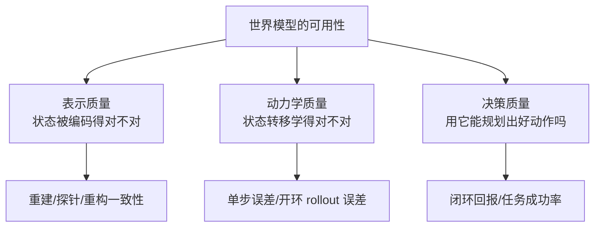
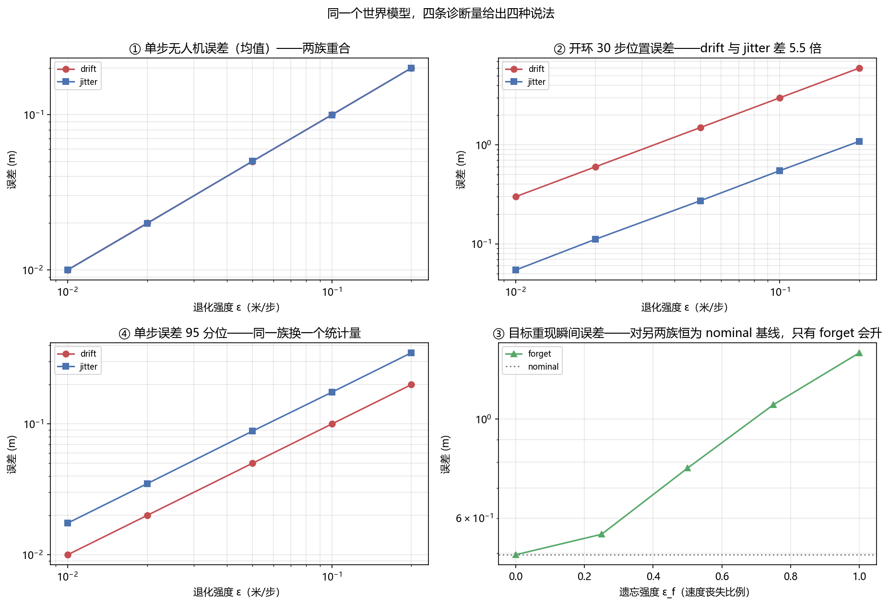

# 世界模型评测与诊断：单步准不等于能用

> **预计阅读：15 分钟 | 前置知识：世界模型基础（本卷 01–06 篇）、序列预测指标、无人机仿真基础**

---

## 1. 为什么「世界模型好不好」没有单一答案

前六篇讲的是世界模型有哪些做法、用哪些数据、在哪些基准上比。这一篇问一个更靠前的问题：**拿一个世界模型过来，怎么判断它能不能用？**

这个问题比它看起来难。原因不是指标不够多，而是**指标各自有自己瞎掉的那一部分**，而多数评测报告只给一个数。一个模型在单步预测上给出 0.02 m 的误差，在 30 步开环里可能偏离 3 m；一个模型修好了你指出的那个缺陷，换一套诊断再看可能一点没变。二者都不矛盾，它们量的是不同的东西。



这三条腿要分开测，因为**它们之间没有单调关系**。单步误差低是动力学学得准的必要条件，不是充分条件——一个只学会「上一帧≈这一帧」的模型单步误差极低，开环出去就是一片模糊。反过来，一个闭环策略跑得很好，也可能是模型很差而控制器很强，把它兜住了。

> **判据**：拿到一个世界模型，先问**它的用途是什么**。要它做规划（model-based RL、MPC），就看开环 rollout 误差随步数的增长曲线；要它做数据增强（生成训练视频），就看生成样本的分布与多样性；要它做表征预训练（给下游策略提供特征），就看线性探针。用一套指标回答三种问题是本领域最常见的误读来源。

---

## 2. 三类误差：表示、动力学、决策

把「世界模型不准」拆成三类，是最近一批诊断论文共同的抓手（代表性工作是 `2610.05550` *When Low Prediction Error Misleads Planning*）。三类的失效方式完全不同：

**表示误差**——编码器把观测映射到潜状态时丢了信息，或者丢错了信息。典型症状：潜状态里没有速度量。世界模型只看单帧时，位置对了、速度没编码进去，那么下一帧位置照样预测不出来。`2610.04585` *Frozen in a Frame: The Velocity Blind Spot in JEPA World Models* 就专门盯这一条：在只移动幅度很小的帧上，JEPA 类模型的潜表征几乎不变化，速度信息进不去。

**动力学误差**——潜状态在，转移函数学错了。常值偏置、尺度偏差、慢漂移都算这一类。它会随步数累积，是长时程失效的主要来源。

**决策误差**——模型本身准，但用它做规划时目标函数对齐错了。`2610.09309` *Predicted Futures Are Not Enough* 说的就是这件事：预测出一条很好的未来轨迹，不等于这条轨迹对应的动作在真实系统里可执行、也不等于它达成了任务目标。预测目标与执行目标是两个东西。

三类误差的区分为什么重要？因为**修复动作是互斥的**：表示误差要加辅助任务（重建、对比、逆动力学），动力学误差要加物理约束或加容量，决策误差要改损失的加权或改用闭环校正。用一种诊断报出的数去指导三种修复，大概率修错地方。

---

## 3. 单步指标与 rollout 指标各自能看见什么

单步指标（单帧 MSE、PSNR、SSIM、FID）报的是「从真值状态出发预测下一步」的误差。它有个致命特点：**每一步都从真值重新出发，误差不累积**。所以它回答的是「模型的局部转移函数准不准」，完全看不见误差在时间轴上会怎么长。

开环 rollout 指标（30 步、100 步位置误差）每一步都从上一步的**预测**出发，误差沿时间轴累积。它回答的是「模型自己滚下去会飘多远」。

两者的关系可以精确地说。设每步预测误差为 e：

- 若 e 是**常值偏置**（比如模型系统性把位移多算了 3%），n 步后总偏差是 n·e，**线性累积**。
- 若 e 是**零均值噪声**，n 步后总偏差是 √n·e，**随机游走**。

同一量级的单步误差，在 30 步开环下可以差 √30 ≈ 5.48 倍。本卷 Demo T 实测到的比值是 5.40–5.52，与理论吻合。这意味着**「单步误差相同的两个模型，开环表现可以差 5 倍」**——单步榜的排名不能外推成开环榜的排名。

还有一层：n 步的均方误差对两种误差的**分布形状**也不敏感。常值偏置的误差分布是尖的（几乎全在 e 附近），零均值噪声的模长服从 chi 分布、尾部更厚。只看均值分不出这两族，要看 P95 之类的尾部分位。Demo T 里这一比值：常值偏置为 1.00，噪声为 1.75（理论值 2.795/1.596 = 1.751）。

---

## 4. 诊断套件：把退化注入进去，看谁看得见

单篇论文报的指标只能说明「在某套扰动下模型表现如何」。要判断**指标本身**的分辨力，得反过来做：拿一个已知正常的模型，**解析地注入已知类型的退化**，看每个指标能不能把它认出来。

注入的退化至少要有三类，对应上面三类误差：

| 退化 | 注入方式 | 对应误差 |
|---|---|---|
| 参数漂移（drift） | 每步给预测位置加常值偏置 | 动力学：系统性偏差 |
| 高频抖动（jitter） | 每步加零均值噪声 | 动力学：随机误差 |
| 目标遗忘（forget） | 遮挡期间按比例丧失目标速度 | 表示/记忆：状态信息丢失 |

这三类的**量纲必须各自对齐**才可比。前两类可以统一成「每步位置偏差多少米」，第三类不能——它是「速度保留几成」的无量纲比例。把它们塞进同一根横轴，得到的只是「只忘掉两成速度」这种测不出失效模式的档位。Demo T 就是因为这个原因把两类分列。

诊断量也要成组设计，至少覆盖四个角度：

- **只看智能体自身**的单步误差（Demo T 的 D1a）；
- **把任务目标并进来**的单步误差（D1b）；
- **30 步开环**误差（D2）——管累积；
- **离散事件处的偏差**，比如目标从遮挡中重新出现的那一帧（D3）——管瞬时；
- **尾部分位**（D4）——管分布形状。

设计完套件，跑一遍正常模型作基线，**这一步不能省**。D3 这种「重现瞬间偏差」在完全正常的模型上也不是 0：匀速外推本身就追不上一个机动目标，基线可能是 0.5 m。判断某个退化是否造成伤害，必须扣掉这条基线。

---

## 5. 修复之后为什么仍会被误判

这是最近一批论文里最反直觉的一条。`2609.21155` *Same World, Different Knowledge: When Isolated Audits Misjudge World-Model Repairs* 的核心论点是：**孤立地在同一套数据、同一套诊断上审一个修复，会给出错误结论**。

原因有两层：

**第一层是覆盖面。**一个修复只改了模型能力的一个切面——比如把目标重现的跳变消掉，但它对开环漂移没有任何帮助；或者反过来，压住了单步误差但把尾部分位推高了。如果你手上只有一套诊断，而这个套件恰好对修复的那个切面敏感、对其他切面失明，你会看到「修好了」，而换一套诊断看则是「没变」。Demo T 里这个现象是**对称**的：只看无人机的诊断量（D1a）对「目标遗忘」这一族恒为 0.0000，**完全失明**，不是「不敏感」；只看目标的诊断量（D3）对漂移和抖动两族恒为 0.4963，与正常模型一模一样。任何单一诊断量做排名，名次都会被它瞎掉的那一族带偏。

**第二层是失敏。**`2610.09134` *World Models Dream of Success: Diagnosing and Repairing Failure Insensitivity in Robot World Models* 指出：世界模型倾向于把未来预测成「成功的样子」——给它一个注定失败的动作序列，它照样生成一条走得通的轨迹。于是「模型预测得很好」这个结论，可能只是因为模型对失败不敏感。这类问题在单步误差上完全看不出来，必须构造**本该失败**的输入去看模型有没有反映失败。

合起来，这一节的判据是：

> **判据**：断言一个修复有效，必须满足两条——（1）修复前，**至少两套独立的诊断**都指向同一个缺陷；（2）修复后，**同一套诊断的基线**（正常模型的那条线）没有跟着抬升。只报一个数的「有效」不构成证据。

---

## 6. 世界模型评测与策略评测的分工

一个常见的混淆是把世界模型评测当成策略评测的一部分。分工应当是这样的：

- **世界模型评测**回答「模型准不准、哪里不准、残差是什么形状」。指标是单步误差、开环误差、分位误差、物理一致性。
- **策略评测**回答「用它规划出来的动作好不好」。指标是任务成功率、回报、样本效率。
- 两者的接口是**闭环**：一个模型能不能用，最终要靠闭环任务成功来判，但闭环成功**不能反过来证明模型准**——控制器可以把模型误差兜住。

`2610.09309` 正是这条接口上的工作：它把「预测出的未来」与「可执行的目标」分开，指出从预测轨迹到可执行目标之间还有一段没有被建模的落差。`2610.03632` *World Embedding Benchmark* 则尝试把评测下沉到**表征层**——不去比谁生成的像素像，而是比谁学到的状态嵌入更贴近真实物理状态。这是一个有用的转向：生成质量的世界模型评测受渲染细节干扰太大，表征层的评测更接近「模型有没有理解动力学」这个问题。

另一条值得单独提的是**物理一致性评测**。`2610.08791` *World Models' Last Exam in Physics* 与 `2610.03154` *Does Physics Live in the Activations?* 从两个方向做同一件事：前者构造物理规律明确、必须答对的考题；后者直接在视频扩散模型的激活里定位物理量（速度、加速度），看这些量是否被线性编码。`2610.02205` *PROWBench* 走的是程序化生成路线——用程序指定「这段视频里应该发生什么」，再看视频模型有没有照做。三者的共同点是**从「像不像」转向「对不对」**。

---

## 7. 对无人机的含义

无人机场景把上面的抽象问题压成了几个具体判断：

**第一，位置误差与速度误差必须分开报。**无人机是二阶系统，控制器吃的是速度指令。一个世界模型位置预测得准、速度没编码进去（`2610.04585` 的盲点），在位置指标上表现完美，喂给控制器就是抖的。本卷 Demo T 里 D1a 与 D4 的分工就是这件事的一个最小演示：均值一样的两种误差，尾部分位差 1.75 倍。

**第二，遮挡与重捕获是这个领域的高频事件，且它是离散的。**无人机飞过楼角、穿过桥洞、目标被树冠挡住，都会产生「一段时间没有观测、然后重新出现」。这段时间里世界模型必须靠内部状态外推。Demo T 的 D3 就是专门为这一类事件设计的诊断量：它只读重现那一帧的偏差，结果发现同一个失效（目标遗忘）在全程平均的单步指标上只体现为 0.1356 m，在重现瞬间的指标上是 0.9136 m，**差 6.7 倍**。用平均单步指标去筛「谁的遮挡外推更好」，等于把这个差异抹平。

**第三，评测要在闭环里做，但结论要拆开。**无人机任务成功率受控制器增益、风扰模型、仿真保真度影响，这些都不是世界模型的属性。本卷 `05` 篇已经指出过这一点。可行的做法是：闭环任务成功率作为**准入判据**，开环 rollout 误差作为**排序判据**，两者不互相替代。

**第四，别在仿真里把「成功」当成答案。**`2610.09134` 说的失败不敏感，在无人机上有个具体形态：撞墙前的最后几帧，模型如果预测出「一切正常」，规划器就不会触发避障。检查方法是主动构造必定失败的输入（朝墙直飞、目标突然反向），看模型的预测里有没有反映出失败。这条检查不需要真实飞行，在仿真里就能做。

---

## 8. 关键论文

> 本节只收 2026 年 6–10 月窗口内的评测与诊断方向新作；逐条 arXiv 号已通过 arXiv API 核对标题。

#### 诊断方法论

- **[arXiv'26.09] Same World, Different Knowledge** — *When Isolated Audits Misjudge World-Model Repairs*
  [](https://arxiv.org/abs/2609.21155)
  孤立审计会误判修复效果；本篇的核心论点是审计必须成套、且要有基线。本卷第 5 节直接建立在这条上。

- **[arXiv'26.10] World Models Dream of Success** — *Diagnosing and Repairing Failure Insensitivity in Robot World Models*
  [](https://arxiv.org/abs/2610.09134)
  世界模型对注定失败的输入不敏感，仍预测出成功轨迹。

- **[arXiv'26.10] When Low Prediction Error Misleads Planning** — *Diagnosing Representation, Dynamics, and Decision Failures in Latent World Models*
  [](https://arxiv.org/abs/2610.05550)
  把失效拆成表示、动力学、决策三类，本卷第 2 节的三分法来源。

- **[arXiv'26.10] Predicted Futures Are Not Enough** — *Learning Executable Goals for Robot Manipulation*
  [](https://arxiv.org/abs/2610.09309)
  预测未来与可执行目标之间的落差。

#### 表征层与物理一致性评测

- **[arXiv'26.10] World Embedding Benchmark**
  [](https://arxiv.org/abs/2610.03632)
  把世界模型评测下沉到状态嵌入层。

- **[arXiv'26.10] World Models' Last Exam in Physics**
  [](https://arxiv.org/abs/2610.08791)
  物理规律明确、必须答对的考题式基准。

- **[arXiv'26.10] Does Physics Live in the Activations?** — *Localizing Physical Quantities in Video Diffusion Models*
  [](https://arxiv.org/abs/2610.03154)
  在激活里定位速度、加速度等物理量，看是否被线性编码。

- **[arXiv'26.10] PROWBench** — *Do Video Models Render What the Program Specifies?*
  [](https://arxiv.org/abs/2610.02205)
  程序化指定视频内容，检查模型是否照做；从「像不像」转向「对不对」。

#### 单步之外的指标

- **[arXiv'26.09] Beyond One-Step Accuracy** — *State-Affine Latent Transition for Reliable Visual Planning*
  [](https://arxiv.org/abs/2609.33595)
  单步准确率不足以支撑规划，需要状态仿射的潜转移。

- **[arXiv'26.10] Learning Commute-Time-Preserving World Models for Planning**
  [](https://arxiv.org/abs/2610.01373)
  以 commute time 守恒作为约束——比逐帧误差更贴近「规划需要什么」。

- **[arXiv'26.10] Frozen in a Frame** — *The Velocity Blind Spot in JEPA World Models*
  [](https://arxiv.org/abs/2610.04585)
  帧间运动很小时潜表征几乎不变，速度信息进不去；详见本卷 `08` 篇。

---

## 9. 动手验证：四条诊断量，三种退化

这一节把第 4 节的方法跑成数字。装置是一个 12 维四旋翼模型（`code/common/quad_sim.py`），256 条轨迹 × 250 步（5 秒），在第 100–160 步（1.2 秒，占步数 24%）把目标从观测里遮掉。遮挡期目标位移 1.387 ± 0.656 m（最大 2.11 m）。

三个退化的注入方式是解析的，**不训练任何模型**——这很重要：本节量的是**诊断量本身的分辨力**，不是某个真实模型的好坏。模型与真值共用同一套标称动力学，我们对模型的输出直接施加已知形态的扰动：

- **drift**：每步给预测位置加 ε·D 的常值偏置；
- **jitter**：每步给预测位置加同量级的零均值噪声；
- **forget**：遮挡期间按 ε_f 的比例丧失目标速度（ε_f = 1 即完全冻结）。

四条诊断量：**D1a** 只看无人机自身的单步误差、**D1b** 把目标并进来的单步误差、**D2** 30 步开环位置误差、**D3** 目标重现那一帧的偏差、**D4** 单步误差的 P95。

### 9.1 核心代码

```python
import math
import torch
from common.quad_sim import QuadSim, expert

SEED, N, T, DT = 7, 256, 250, 0.02
OC_START, OC_END = 100, 160                       # 遮挡区间（步）
D_SCALE = 1.0                                     # 扰动尺度（米）
CHI3_MEAN = 1.5957691                             # E|N(0, I_3)|，见下
EPS_LIST = [0.01, 0.02, 0.05, 0.10, 0.20]         # 连续性退化：每步位置偏差（米）
EPS_FORGET = [0.0, 0.25, 0.50, 0.75, 1.00]        # 遗忘族：速度丧失比例
OPEN_LOOP = 30


def model_step(env, a, fam, eps, gen):
    """世界模型推进一步，就地更新 env 状态，返回预测位置。"""
    env.step(a)
    if fam == "drift":                            # 常值偏置：方向固定，线性累积
        env.p = env.p + torch.tensor([0.0, 0.0, eps * D_SCALE])
    elif fam == "jitter":                         # 零均值噪声：随机游走，累积 sqrt(n)
        env.p = env.p + (eps * D_SCALE / CHI3_MEAN) * torch.randn(
            env.p.shape, generator=gen)
    return env.p


def target_belief(phi, fam, eps):
    """目标信念在整条时间轴上的传播，返回（真值, 信念）。"""
    g_seq = torch.stack([target_pos(t, phi) for t in range(T)])
    hats, v_hat = torch.zeros_like(g_seq), torch.zeros(N, 3)
    hats[0] = g_seq[0]
    for t in range(1, T):
        if OC_START <= t <= OC_END:               # 遮挡：只能外推
            k = (1.0 - eps) if fam == "forget" else 1.0
            hats[t] = hats[t - 1] + k * v_hat * DT
        else:                                     # 可观测：直接校正，并更新速度估计
            hats[t] = g_seq[t]
            v_hat = (g_seq[t] - g_seq[t - 1]) / DT
    return g_seq, hats
```

**`jitter` 那一行的 `/ CHI3_MEAN` 是关键，不是装饰。**三轴各加一个 `N(0, ε²)`，其模长的期望是 `ε·√2·Γ(2)/Γ(1.5) = ε·1.5957691`；不除这个数，「每步偏差量级」在两族之间就差 1.6 倍，D1a 曲线也就重合不了，② 节的自检点会直接失效。

四条诊断量的归约（在同一批单步误差上算完）：

```python
    dp = torch.stack(dp_list)                     # (T-1, n) 无人机单步误差
    dg = torch.stack(dg_list)                     # (T-1, n) 目标单步误差
    d1a = dp.mean().item()                        # 只看无人机
    d1b = torch.sqrt(dp ** 2 + dg ** 2).mean().item()   # 无人机 + 目标一起看
    d4  = torch.quantile(dp.flatten(), 0.95).item()     # 尾部分位
    d2  = 开环 30 步后无人机位置误差（从 STARTS 的 10 个起点分别推）
    d3  = torch.norm(g_hat[OC_END] - g_seq[OC_END], dim=-1).mean().item()
```

`D3` 是这里唯一不取时间平均的量——它只读第 `OC_END` 帧，也就是目标重新出现、模型必须把外推了 60 步的信念换成真实观测的那一瞬。`D2` 从 10 个不同的起点各推 30 步再取均值，避免单一起点的运气成分。

### 9.2 本地实测结果

**① 四条诊断量在不同 ε 下的取值**（drift / jitter 两族的 ε 是「每步位置偏差」，米）：

```text
   ε  族            D1a 单步(机)   D1b 单步(机+目标)   D2 开环30步    D3 重现瞬间    D4 单步P95
  0.01  nominal         0.0000             0.0423        0.0000        0.4963       0.0000
  0.01  drift           0.0100             0.0503        0.3000        0.4963       0.0100
  0.01  jitter          0.0100             0.0503        0.0544        0.4963       0.0175

  0.10  nominal         0.0000             0.0423        0.0000        0.4963       0.0000
  0.10  drift           0.1000             0.1296        3.0000        0.4963       0.1000
  0.10  jitter          0.0997             0.1299        0.5499        0.4963       0.1749

  0.20  nominal         0.0000             0.0423        0.0000        0.4963       0.0000
  0.20  drift           0.2000             0.2230        6.0000        0.4963       0.2000
  0.20  jitter          0.2000             0.2238        1.0895        0.4963       0.3504
```

第一眼看的是最容易被忽略的一列：**D3 在 drift 和 jitter 两族的整档 ε 上恒为 0.4963，与 nominal 逐位相同**。也就是说，只看重现瞬间的诊断量，对这两种动力学退化**完全无感**——它给出的数与「模型完全正常」时一模一样。

第二眼看 D1a：drift 与 jitter 在该列上的比值是 1.0029 / 1.0040 / 0.9982 / 1.0029 / 1.0001，理论值应为 1（两族每步的期望位移偏差同为 ε·D）。**单步均值这一条诊断，在这两族之间没有任何分辨力。**

**② 遗忘族单独扫**（ε_f 是速度丧失比例，与上面两族不同量纲，不能共用一档量程）：

```text
    ε_f       D1a       D1b      D3 (m)      D1b 相对       D3 相对
   0.00    0.0000    0.0423      0.4963       1.000       1.000
   0.50    0.0000    0.0935      0.7766       2.209       1.565
   1.00    0.0000    0.1780      1.4099       4.204       2.841
```

（参照 nominal：D1a 0.0000、D1b 0.0423、D3 0.4963 m，与 ε_f = 0 逐项同值，脚本已断言。）

**(a) D1a 在整档 ε_f 上恒为 0.0000。**这一族不动无人机动力学，只看无人机的诊断量对它是**完全失明**，不是「不敏感」。

**(b) D1b 看见了，但被摊薄。**0.0423 → 0.1780，4.20 倍。可它对整条时间轴取均值，而误差只存在于 24% 的遮挡步上，涨幅被这一步数占比摊平。

**(c) D3 抓得住，但必须扣基线。**0.4963 → 1.4099 m。它自己的基线 0.4963 m 不是遗忘造成的，而是匀速外推本身在追一个加速目标上的误差——nominal 也是这个数。净增量 0.0000 → 0.9136 m。

把两边的净增量放在一起：**同一个失效，在全程平均的单步指标上只体现为 0.1356 m，在重现瞬间的指标上是 0.9136 m，差 6.7 倍**。遮挡占的步数比例越小，这个差越大。

**③ 两个自检点**（确认注入量确实是已知的，而不是「大概差不多」）：

```text
③ 单步相等的前提下，开环误差之比（理论值 sqrt(30) = 5.477）
        ε     D2 drift / jitter        理论
     0.01                 5.519     5.477
     0.05                 5.500     5.477
     0.20                 5.507     5.477

④ 尾部分辨力：D4 / D1a（理论 drift ≈ 1，jitter ≈ 2.795/1.596 = 1.751）
        ε       drift      jitter
     0.01        1.00        1.75
     0.20        1.00        1.75
```

③ 说的是：常值偏置每步线性累加，零均值噪声每步随机游走，**同样的单步误差在开环下差一个 √步数**。三个 ε 档实测 5.40–5.52，围绕理论值 5.477 波动。这是本实验的装置自检——如果实测比值不是 5.48 附近，说明两类注入的量没对齐。

④ 说的是：只看均值同样分不出这两族，得看尾部。常值偏置的误差分布是尖的，模长只取一个值，所以 D4/D1a = 1.00；零均值噪声的模长服从 chi 分布，尾部更厚，比值 1.75。噪声档的比值恒定在 1.75–1.76，与 3 自由度 chi 分布的 P95/均值 = 2.795/1.596 吻合（在 5 档 ε 上分别测得 1.75 / 1.76 / 1.76 / 1.75 / 1.75）。

四张表合起来，第 4/5 节那句「每条诊断量都有自己瞎掉的那一族」就不再是定性说法：

> **判据**：每一条诊断量都有自己瞎掉的那一族，而且失明是对称的。D1a 只看无人机 → 对 forget 恒为 0（失明）；D3 只看目标 → 对 drift/jitter 恒为 0.4963（失明）。分开 drift 与 jitter 要靠 D2（累积方式不同，差 √30 倍）或 D4（分布形状不同，差 1.75 倍）。只看一条量做排序，名次必然被它瞎掉的那一族带偏。



> **限制**：本实验里的模型与真值**共用同一套标称动力学**，退化是**解析注入**的，所以量的是诊断量本身的分辨力，不是某个真实模型的好坏。真实世界模型的残差是三种误差的混合，也没有一条现成的「正常基线」可扣。把结论外推到训练出来的模型上，需要另做实验——但诊断量设计的这份清单（分清量纲、分清均值/尾部/离散事件、留一条正常基线）可以直接搬过去。

### 9.3 运行完整脚本

```bash
py -3.9 code/t_wm_diagnostics.py     # CPU 即可，约 7 秒，依赖 numpy / torch / matplotlib
```

完整脚本在 [`code/t_wm_diagnostics.py`](../../code/t_wm_diagnostics.py)，输出上面全部四组表与四面板（2×2）对数坐标图。

---

## 10. 延伸阅读

- [01-世界模型发展史](./01-世界模型发展史.md) — 世界模型整体脉络
- [02-生成式世界模型](./02-生成式世界模型.md) — 像素空间生成模型的评测指标
- [03-模型强化学习世界模型](./03-模型强化学习世界模型.md) — Dreamer 系列的想象 rollout 与回报评估
- [04-3D场景世界模型](./04-3D场景世界模型.md) — 3D 重建指标（PSNR / SSIM / LPIPS）
- [05-无人机世界模型综述](./05-无人机世界模型综述.md) — 无人机场景下的评测现状
- [06-关键数据集与基准](./06-关键数据集与基准.md) — 有哪些基准可下载；第 8 节的 ATE/RPE 是另一组「指标会看走眼」的例子
- [08-联合嵌入预测与潜空间世界模型](./08-联合嵌入预测与潜空间世界模型.md) — 表征层评测为什么要单列
- [09-长时程世界模型与交互式生成](./09-长时程世界模型与交互式生成.md) — 长时程失效的两种形态

---

## 11. 思考题

### 题目 1：单步指标高、开环崩

你训了一个无人机世界模型，单步位置 MSE 是 0.008 m（很好），30 步开环位置误差却是 2.4 m。有人建议你「加数据」。你会怎么诊断，先改哪里？

<details>
<summary>参考答案</summary>

先算比值：2.4 / 0.008 远大于 √30 ≈ 5.48，说明误差**不是零均值噪声型的随机游走**，而是含常值偏置或尺度偏差的**线性累积**。这个比值本身就是第一个诊断信息——它把问题从「噪声大」转向「系统性偏差」。

按第 2 节的三分法逐条排查：

1. **表示误差**：速度有没有进潜状态？测法——固定位置、只改速度，看潜表征有没有变化。若不变，就是 `2610.04585` 描述的盲点，加数据没用，要改架构或加辅助任务（逆动力学预测）。
2. **动力学误差**：看残差是常值还是尺度性。常值偏置（比如模型少算了阻力）→ 检查动作条件是否接对、有没有把电机指令的符号/单位搞错。尺度偏差（比如位置多算了 3%）→ 检查归一化统计量是否在训练集与评估集间不一致，这是最常见的低级错误。
3. **决策/接口误差**：开环评估的动作序列是不是与训练时同一分布？如果训练时用的是专家动作、评估时用的是自己预测的动作，分布已经外推了。

「加数据」在以上三条里只对第 2 条的尺度偏差（训练集统计不准）有帮助。**先做归因，再决定加什么。**

</details>

### 题目 2：两条诊断量给出相反的名次

你有世界模型 A 和 B。A 的单步误差 0.031 m，B 是 0.028 m；但在「目标从遮挡中重现那一帧」的位置偏差上，A 是 0.15 m，B 是 0.62 m。你的任务是用这个模型做遮挡环境下的目标跟踪。选哪个？

<details>
<summary>参考答案</summary>

选 A。

这题的判据是「哪个指标与任务相关」。任务的关键事件是**目标重捕获**——无人机飞过障碍后必须立刻恢复对目标的跟踪。单步误差在整条时间轴上取均值，而重捕获只发生在少数几帧上；Demo T 里同一个失效在全程平均指标上是 0.1356 m、在重现瞬间指标上是 0.9136 m，差 6.7 倍。段落占的比例越小，均值指标把差异抹得越平。

B 的单步误差更小，说明它的**局部转移函数**更准；A 的重现偏差更小，说明它的**记忆/外推机制**更稳。这两个能力可以独立存在：一个模型可能每步都准但外推几步就飘（B），也可能单步略粗但外推有界（A）。

还要补两个确认，否则这个选择不牢：

- **遮挡时长**：B 的劣势可能只在长遮挡下出现。如果实际任务里遮挡从不超过 0.5 秒，A 的优势用不上，B 更划算。要按目标遮挡时长的分布做加权评估，不要用单一遮挡长度下结论。
- **是否扣了基线**：A 的 0.15 m 与 B 的 0.62 m 都包含了「匀速外推本身就追不上机动目标」的那部分误差。要确认两者用的是同一条基线，否则比的是两个不同的量。

本卷 Demo T 的 ⑤ 节正是这个陷阱的实例：D3 在 ε_f = 0 时就已经是 0.4963 m，如果拿 D3 的绝对值去排名，会把「外推本身追不上加速目标」算成模型的缺陷。

</details>

### 题目 3：为什么必须留一条正常基线

第 4 节说「跑一遍正常模型作基线，这一步不能省」。但你的正常模型就是你现在最好的模型，把它当基线不是显然有偏吗？

<details>
<summary>参考答案</summary>

基线的作用不是提供「绝对好」的参照，而是**把装置本身的误差固定下来**。Demo T 的例子最直白：D3（重现瞬间偏差）在 ε = 0 的正常模型上不是 0，而是 0.4963 m——它量的是「匀速外推追一个按 ω = 0.6 rad/s 机动的目标」这件事本身有多难，与世界模型好坏无关。没有这条线，你看到 D3 = 1.4099 m，会以为全部 1.4099 m 都是模型的错；扣掉基线才知道净增量是 0.9136 m。

有偏的问题确实存在，但它的形式与想象的不同：

- **基线偏高**（用你最好的模型做基线）→ 你会**低估**自己模型的改进幅度。这是保守的偏差，可以接受。
- **基线偏低**（用一个勉强能跑的模型做基线）→ 你会**高估**改进，这是危险的偏差。

所以基线的选择原则是：**用同一个装置、同一个任务、同一条时间轴，把退化强度设为零**。这个「零退化」的模型不需要是最好的，它只需要是「没有施加你要测的那种扰动」的那一个。Demo T 的做法是模型与真值共用同一套标称动力学——这不是「最好的模型」，而是「残差为零的模型」，正好定义了装置本身的误差地板。

真正的风险不是基线的质量，而是**换诊断量时不换基线**：换了指标，基线必须跟着重算。同一份基线数据套到不同的诊断量上，那才是真的会得出错误结论。

</details>

---

> **下一节**：[08-联合嵌入预测与潜空间世界模型](./08-联合嵌入预测与潜空间世界模型.md) — 不重建观测、直接在表征空间预测的那条路。
