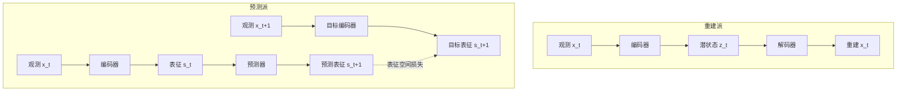
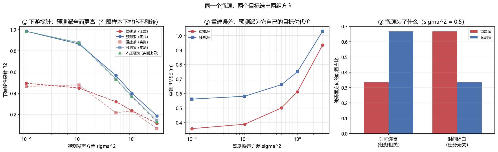

# 联合嵌入预测与潜空间世界模型：不重建的那条路

> **预计阅读：16 分钟 | 前置知识：自监督学习基础、对比学习思想、序列预测指标、本卷 02/03 篇**

---

## 1. 重建派与预测派的分岔

前面几篇讲的世界模型有一个共同点：**它们都重建观测**。生成式世界模型（`02` 篇）在像素空间生成下一帧；Dreamer 系列（`03` 篇）先从观测编码出潜状态，再用解码器把潜状态还原成观测，重建损失是训练的主信号。3D 场景世界模型（`04` 篇）更直接，重建就是它的输出。

这条路很成功，但它有一个默认前提：**把观测还原得越准，就代表理解得越好**。这个前提值得质疑。一段无人机视频里，像素级最不可预测的部分往往是最无关的部分——树叶的抖动、光照的闪烁、纹理的高频细节。一个模型把大量容量花在这些东西上，还原指标很漂亮，但对「无人机会往哪飞」毫无增益。

联合嵌入预测架构（Joint-Embedding Predictive Architecture，JEPA）提出的替代方案是：**不在观测空间预测，而在表征空间预测**。给编码器两个时刻的观测，得到两个表征；让预测器从 t 时刻的表征推出 t+1 时刻的**表征**，损失只作用于表征之间，完全不经过解码器。



两条路的差别不在「有没有解码器」这一件事上，而在**判据换了**：重建派问「潜状态里有多少关于观测的信息」，预测派问「潜状态里有多少关于未来的信息」。这两个问题是不同的。

---

## 2. 表征空间预测：核心主张与它挡住的噪声

JEPA 的原始构想来自 `2301.08243` *Self-Supervised Learning from Images with a Joint-Embedding Predictive Architecture*（I-JEPA，2023-01），视频版本是 `2404.08471` *Revisiting Feature Prediction for Learning Visual Representations from Video*，规模化的后续是 `2506.09985` *V-JEPA 2*（2025-06）。

核心主张可以写成一句话：**没被预测的细节就是不需要被预测的细节**。因为损失不经过解码器，编码器没有动机去保留那些「无法从过去推出、也不影响未来」的信息。噪声类细节天然被过滤掉，模型容量被逼到真正可预测的那部分结构上。

这在自监督学习里有一个很实在的收益：**重建目标的「最短路径」是一条捷径**。要让解码器还原每一片树叶，最省事的做法是把整张图的信息都塞进潜状态；模型学的是压缩，不是理解。JEPA 把这条捷径堵住了——预测器没法从过去推出随机的树叶位置，损失会惩罚它去尝试，于是编码器学会不编码这些。

但挡住噪声这件事**是双刃的**。挡住的是「不可预测且不重要」的信息，可判据里没有「重要」这一项，只有「可预测」。于是**重要但难预测的量也会被丢掉**。`2610.04585` *Frozen in a Frame: The Velocity Blind Spot in JEPA World Models* 找到的就是这一类：在两帧之间移动幅度很小时，JEPA 类模型的潜表征几乎不变化——**速度没有被编码进去**。速度恰恰是无人机最需要的量，它难预测（需要至少两帧差分），但它对任务至关重要。

---

## 3. 丢掉重建挡住了什么

第 2 节的收益之外，放弃重建还带来三个具体的代价。

**第一，少了一个免费的辅助监督信号。**重建损失给编码器提供了一个稠密的梯度来源，它对每个像素都有意见。丢掉它以后，剩下的只有「表征与目标表征一致」这一条，而这个信号有个退化解：**编码器把所有输入映射到同一个点**。这时预测误差恒为 0，损失完美，但表征毫无信息。这就是表征塌缩（representation collapse），第 6 节专门讲怎么防。

**第二，物理量无处可查。**重建派可以拿解码结果去对物理量——位置、速度、加速度能不能从潜状态线性读出，用探针一测就知道。预测派的潜空间通常不能还原成任何可读的观测，于是「模型有没有理解动力学」这个问题只剩间接证据。本卷 `07` 篇讲的 `2610.03632`（World Embedding Benchmark）与 `2610.03154`（在激活里定位物理量）正是为补这个缺口出现的——评测被迫下沉到表征层。

**第三，调试与可视化变难。**重建派出错时你能看见「预测的画面不对」；预测派出错时你只看到损失不再下降，而原因可能在任何一环。这一条工程代价常被低估。

> **判据**：选择重建还是预测，取决于**下游任务吃什么**。下游用图像（生成、渲染、视觉伺服）→ 需要重建，因为输出必须回到像素空间。下游用特征（规划、控制、检索）→ 可以省掉重建，但必须补上别的信息保全机制（辅助任务、正则、探针监督），否则丢了什么你不知道。

---

## 4. 三种用途

JEPA 类模型在机器人领域目前有三种用法，混用是常见的误读来源。

**（1）当世界模型用，在潜空间里做规划。**这是最直接的一种：有了编码器和预测器，就能在潜空间里 rollout 一串候选动作序列，用预测表征与目标表征的距离打分，选最好的那条执行。`2610.10515` *RoboJEPA* 走的就是把这条路线规模化的方向。这条路的关键约束是**潜空间里的距离必须有意义**——预测表征与目标表征的欧氏距离大，必须真的代表任务上差得远。这个前提不成立时，规划器会在潜空间里选出一条「数字上很近、实际做不到」的轨迹。`2610.03137` *Keeping JEPA World Models Plannable When Little of the Frame Moves* 处理的就是这个前提失效的情形：画面几乎不动时，潜表征的变化不足以支撑搜索。

**（2）当表征预训练用，冻结后接下游策略头。**这是目前工程上最稳的一种用法：编码器只负责把观测变成特征，规划或控制完全交给别的模块。好处是训练与部署解耦、可控性强；代价是编码器看不到下游任务，学到的表征不一定对齐任务。`2606.20104` *Sensorimotor World Models* 提出用**逆动力学**做辅助目标来缓解这一点：不但要能从 s_t 预测 s_{t+1}，还要能从 (s_t, s_{t+1}) 反推出动作 a_t。加了这个约束，表征必须保留「动作能改变什么」这层信息，光是压缩观测不够。`2610.07540` *Preserving Unstable Modes Through Inverse Dynamics in JEPA World Models* 沿着这条线走得更远——它指出逆动力学还能把**不稳定模态**保住。

**（3）当 RL 的辅助损失，与重建或回报联合训练。**`2610.02922` *TwinJEPA* 用双路预测偏好来构造面向目标的表征。这条路线的动机是：世界模型的表征如果能直接编码「离目标还有多远」，控制问题会简单很多。`2610.06805` *H-JEPA* 加的是层次结构——不同时间尺度上各有一个预测器，对应从「下一步怎么动」到「这一段往哪去」的不同抽象层级。`2609.33563` *MA-JEPA* 处理多智能体场景，此时「未来」不只是自己的未来，还包括别人的反应。

三种用途对表征的要求不完全一致：规划要求潜空间距离与任务代价对齐，控制要求表征含动作敏感信息，RL 要求表征含回报信息。**一个只在重建上评测过的 JEPA 模型，不能直接搬到这三种用途里的任何一种。**

---

## 5. 与 RSSM 类世界模型的关系

Dreamer 系列（`03` 篇）用的循环状态空间模型（RSSM）与 JEPA 常被拿来对比，但它们的差别不止「重建 vs 不重建」：

| 维度 | RSSM（Dreamer 类） | JEPA 类 |
|---|---|---|
| 潜状态结构 | 确定性路径 + 随机路径，显式建模不确定性 | 通常只有确定性表征 |
| 时间推进 | 循环，逐步递推 | 预测器可直接跳步（预测 t+k 的表征） |
| 训练信号 | 重建 + 回报 + KL | 表征一致性（+ 正则 / 辅助任务） |
| 想象 rollout | 在潜空间里带随机性 rollout，可采样多条 | 多为确定性单条预测 |
| 与策略的关系 | 世界模型与策略联合训练 | 常先独立预训练，再冻结或微调 |

两个要点值得单独提：

**不确定性。**无人机在遮挡下必须表达「我不确定目标在哪」。RSSM 的随机路径天然给出一个分布，能采样出多条可能的未来；确定性的 JEPA 表征只有一个点。`2610.07599` *Modeling Latent Disturbances for Robust Decision-Making in World Models* 处理的正是这件事——显式建模潜扰动，让确定性架构也能表达不确定性。这不是谁优谁劣，而是**用途决定的**：要强化学习需要探索、要做风险敏感规划，就需要分布。

**时间抽象。**RSSM 逐步递推，步长由采样率决定；JEPA 的预测器可以一次跳过若干帧。后者对长时程更友好（本卷 `09` 篇），代价是中间过程不可见——你没法检查「它在第 3 步时以为自己在哪」。

> **判据**：需要不确定性和探索 → RSSM；需要长时程跳步预测和稳定表征 → JEPA；两者都要 → 双时程或双潜变量架构（见 `09` 篇）。

---

## 6. 表征塌缩与信息瓶颈

第 3 节提到的塌缩是这条路线的核心风险。一个没有约束的表征预测目标有平凡的全局最优：**编码器输出常数**。此时预测误差恒为 0，损失完美，表征零信息。这不是训练不充分，是目标函数本身的退化解。

工程上有三类对抗手段：

- **非对称结构**：目标表征由一个不接梯度的编码器（通常是主编码器的指数移动平均）产生，主编码器只被单向拉动。这打破了「两边一起塌到同一点」的对称性。
- **方差-协方差正则**：显式要求表征各维方差不得低于某个阈值、且各维之间不相关，从根上禁止塌缩。
- **结构约束**：`2610.03587` *AVL-JEPA* 处理的是**因果动力学信息塌缩**——不是全塌，而是表征里关于动力学的那部分信息被压没了。它把「动力学信息」单独拎出来做保全。`2610.00727` *CF-JEPA* 换一个角度，把表征分解成「可控的」与「不可控的」两部分，只对可控部分做预测——因为不可控部分本来就不该被预测。

**塌缩的成因与训练动态直接相关。**`2610.02344` *Drive vs. Decay: On the Training Dynamics of Joint-Embedding Predictive Architectures* 就是在拆这件事：哪些因素在把表征「推向」有效（drive），哪些在让它「衰减」（decay）。`2610.00368` *DeepJEPA* 从另一个方向给答案——**从内部扩展世界模型**，把容量加到预测器与编码器上而不是加到数据上。

**瓶颈宽度是另一个独立变量。**JEPA 把表征压到一个固定维数的潜空间，压多窄是个设计参数。压得太窄，有用的方向被挤掉；压得太宽，塌缩风险与无用的自由度都上升。第 9 节的实验量的就是这一条：**在瓶颈宽度固定的前提下，损失主要来自「丢掉了几个信号方向」，而不是「多装了无用方向」**。这个结论把「怎么加宽瓶颈」这类直觉问题换成了一个更准确的问题：**你丢掉的是哪几个方向**。

**能量基模型是这条路线的一个近亲。**`2406.08862` *Cognitively Inspired Energy-Based World Models*（2024-06）用能量函数替代显式的预测损失：相容的 (状态, 状态') 对能量低，不相容的能高。它避免了塌缩（常数输出的能量处处相同，无法区分相容与不相容），代价是能量函数的训练本身更麻烦。这条线目前的量级很小——本卷 `tools/watch.py` 的词表查过，`abs:"energy-based" AND abs:"world model"` 在 2026 年 6–10 月这个窗口里 0 命中，不限窗口也只有 8 篇。**可以写「稀疏」，不能写「没有」**，结论与复核证据记在 `tools/watchlists.py` 的 `VERIFIED_ZEROS` 里。

---

## 7. 对无人机的含义

**第一，速度必须被显式检查。**无人机的控制器是二阶的，吃速度指令。`2610.04585` 的速度盲点在无人机上不是学术问题：一个位置预测完美、速度没编码进去的世界模型，喂给控制器会抖。检查方法很便宜——构造一对「位置相同、速度不同」的状态，看潜表征有没有分开。没分开就是盲的，加再多的数据也修不好，要改辅助任务（逆动力学是最直接的一种，见 `2606.20104`）。

**第二，先定下游再选架构。**本卷 `05` 篇讨论过无人机的几条技术路线。把第 4 节的三种用途对上去：

- 用世界模型做**在线规划**（MPPI、CEM 在潜空间里搜）→ 需要潜空间距离与任务代价对齐，`2610.03137` 那条约束是硬约束不是优化项；
- 用世界模型做**表征预训练**给下游策略 → 冻结编码器，加逆动力学辅助任务，评测用线性探针；
- 用世界模型做**RL 的想象环境** → 需要不确定性，这时候 RSSM 那一路更合适，或者参考 `2610.07599` 的潜扰动建模。

**第三，别把「重建差」当成缺点。**第 9 节的实验会给出一个看起来不太好看的数字：预测派的 RMSE 比重建派差 1.1–1.57 倍。这在它的目标函数下是**必然的**——预测派压根没有为重建优化过。评估一个 JEPA 模型的重建误差，跟你评估一条鱼的爬树能力一样没有信息量。要评它，就用探针（表征里有没有任务信息）或闭环任务成功率。

**第四，本卷 Demo U 是线性-高斯最小模型，结论有明确的外推边界。**下面第 9 节会把边界写在结论旁边，不单独挪走。真实 JEPA 的编码器是非线性的，塌缩靠正则而非高斯噪声，时间连贯性也不会像最小模型里那样恰好分成两组常数。**本节量的两个目标函数的分歧，不是某个真实 JEPA 的性能。**

---

## 8. 关键论文

> 本节收 2026 年 6–10 月窗口内的 JEPA 与新架构新作，另加两篇路线来源；逐条 arXiv 号已通过 arXiv API 核对标题。

#### 路线来源

- **[arXiv'23.01] I-JEPA** — *Self-Supervised Learning from Images with a Joint-Embedding Predictive Architecture*
  [](https://arxiv.org/abs/2301.08243)
  表征空间预测的原始构想。

- **[arXiv'25.06] V-JEPA 2** — *Self-Supervised Video Models Enable Understanding, Prediction and Planning*
  [](https://arxiv.org/abs/2506.09985)
  视频版本规模化，并把表征接到规划上。

#### 规模化与新架构

- **[arXiv'26.09] DeepJEPA** — *Scaling World Models from Within*
  [](https://arxiv.org/abs/2610.00368)
  把容量加在模型内部而非数据上。

- **[arXiv'26.10] RoboJEPA** — *Scaling Robotic Latent World Models*
  [](https://arxiv.org/abs/2610.10515)
  潜空间世界模型在机器人域的规模化。

- **[arXiv'26.10] H-JEPA** — *End-to-End Learning of Hierarchical World Models for Visual Planning*
  [](https://arxiv.org/abs/2610.06805)
  多时间尺度的层次化预测器。

- **[arXiv'26.09] MA-JEPA** — *Joint-Embedding World Models for Multi-Agent Reinforcement Learning*
  [](https://arxiv.org/abs/2609.33563)
  把「别人的未来」也纳入预测目标。

#### 塌缩、动力学信息与训练动态

- **[arXiv'26.10] AVL-JEPA** — *Preventing Causal Dynamics Information Collapse in Joint Embedding Predictive Architecture World Models*
  [](https://arxiv.org/abs/2610.03587)
  不是全塌，而是动力学信息被压没。

- **[arXiv'26.09] CF-JEPA** — *Improving Robustness of JEPA World Models via Controllability Factorization*
  [](https://arxiv.org/abs/2610.00727)
  只预测可控部分，不可控部分不预测。

- **[arXiv'26.10] Drive vs. Decay** — *On the Training Dynamics of Joint-Embedding Predictive Architectures*
  [](https://arxiv.org/abs/2610.02344)
  拆解训练中推动与衰减两股力量。

- **[arXiv'26.10] DSReg** — *Provably Recovering Individual World Latents without Reconstruction*
  [](https://arxiv.org/abs/2610.09457)
  不重建也能可证明地恢复个体潜变量。

#### 逆动力学与物理量保全

- **[arXiv'26.06] Sensorimotor World Models** — *Perception for Action via Inverse Dynamics*
  [](https://arxiv.org/abs/2606.20104)
  用逆动力学做辅助目标，逼表征保留动作敏感信息。

- **[arXiv'26.10] Preserving Unstable Modes Through Inverse Dynamics in JEPA World Models**
  [](https://arxiv.org/abs/2610.07540)
  逆动力学还能把不稳定模态保住。

- **[arXiv'26.10] Frozen in a Frame** — *The Velocity Blind Spot in JEPA World Models*
  [](https://arxiv.org/abs/2610.04585)
  帧间运动小则潜表征不变，速度进不去。

#### 连续时间与流匹配

- **[arXiv'26.07] ODEWorld** — *A Continuous Predictive Architecture via Physical-Time Flow*
  [](https://arxiv.org/abs/2607.27924)
  用物理时间连续流替代离散步预测。

- **[arXiv'26.08] Flow-JEPA** — *Robust Latent Dynamics for JEPA World Models via Flow Matching*
  [](https://arxiv.org/abs/2608.29029)
  流匹配给潜动力学。

#### 规划与不确定性

- **[arXiv'26.10] Keeping JEPA World Models Plannable When Little of the Frame Moves**
  [](https://arxiv.org/abs/2610.03137)
  画面几乎不动时潜表征变化不足以支撑搜索。

- **[arXiv'26.10] TwinJEPA** — *Action-Preferred Predictive Representations for Goal-Conditioned Control*
  [](https://arxiv.org/abs/2610.02922)
  双路预测构造面向目标的偏好表征。

- **[arXiv'26.10] Modeling Latent Disturbances for Robust Decision-Making in World Models**
  [](https://arxiv.org/abs/2610.07599)
  给确定性架构补上不确定性表达。

- **[arXiv'24.06] Cognitively Inspired Energy-Based World Models**
  [](https://arxiv.org/abs/2406.08862)
  能量基的近亲路线；这一线稀疏，证据见 `tools/watchlists.py` 的 `VERIFIED_ZEROS`。

---

## 9. 动手验证：重建式表征与预测式表征的分歧

这一节把第 1 节那个抽象的「判据换了」跑成数字。装置刻意做得极小：**线性-高斯最小模型**，两个编码器都有闭式解，**不训练任何模型**。

潜空间 8 维，分成两组，各 4 维：

| 组 | 方差 | 自相关 a | 含义 |
|---|---|---|---|
| 连贯组 | [1.0, 0.8, 0.6, 0.4] | [0.95, 0.93, 0.91, 0.89] | 时间上连贯、可预测，下游任务关心它 |
| 无关组 | [2.0, 1.7, 1.4, 1.1] | [0.30, 0.27, 0.24, 0.21] | 方差大但几乎不可预测，下游任务不关心 |

每组内部四维的方差与自相关**各不相同**——这一点是必须的，原因见本节末尾的注。观测 = 随机正交基下的潜状态加高斯噪声（`build_world()` 从 `np.linalg.qr` 取固定正交阵 R）。两个编码器共用 6 维瓶颈：

- **重建派**：取观测协方差 `Sig_x = R·diag(lam + sigma^2)·R^T` 的**前 6 个特征向量**（按方差排序）。
- **预测派**：取 `M = D^{-1/2}·C·D^{-1/2}` 的前 6 个特征向量，其中 `C = diag(a·lam)`，再按 `D^{1/2}` 映射回原空间。这个判据来自最大化 `(wᵀCw)² / (wᵀDw)²`——即**预测能力与方差之比**，不是方差本身。

任务标签 `y = c·s`，`c` 只在连贯组上非零、组内按 `1/√var` 加权，使得 `var(y) = 1.0000`（四维等贡献）。下游用一个线性 ridge 探针（`RIDGE_ALPHA = 1e-3`），训练 150 样本，200 次随机划分取均值。

### 9.1 核心代码

```python
import numpy as np

SEED = 11
D, N_COH, N_NUI, RANK = 8, 4, 4, 6                  # 潜维数 / 两组各几维 / 瓶颈宽度
LAM_COH, A_COH = [1.00, 0.80, 0.60, 0.40], [0.95, 0.93, 0.91, 0.89]
LAM_NUI, A_NUI = [2.00, 1.70, 1.40, 1.10], [0.30, 0.27, 0.24, 0.21]
SIGMA2 = [0.01, 0.1, 0.5, 1.0, 3.0]
N_TRAIN, N_TEST, N_SPLIT = 150, 4000, 200
RIDGE_ALPHA = 1e-3


def build_world():
    rng = np.random.default_rng(SEED)
    Q, _ = np.linalg.qr(rng.normal(size=(D, D)))     # 固定的随机正交基
    lam = np.array(LAM_COH + LAM_NUI)
    a = np.array(A_COH + A_NUI)
    return Q, a, lam


def encoders(R, a, lam, sigma2):
    """两个编码器都取「前 RANK 个特征向量」，只是判据不同，都有闭式解。"""
    Sig_x = R @ np.diag(lam + sigma2) @ R.T
    w, V = np.linalg.eigh(Sig_x)
    E_recon = V[:, np.argsort(w)[::-1][:RANK]]        # 按观测方差排序

    C = np.diag(a * lam)                              # 预测增益
    D_cov = np.diag(lam + sigma2)
    Dh = np.diag(1.0 / np.sqrt(np.diag(D_cov)))
    wm, Vm = np.linalg.eigh(Dh @ C @ Dh)              # 判据：预测能力 / 方差
    Vp = np.diag(np.sqrt(np.diag(D_cov))) @ Vm
    E_pred = Vp[:, np.argsort(wm)[::-1][:RANK]]
    E_pred /= np.linalg.norm(E_pred, axis=0, keepdims=True)   # 列归一化
    return E_recon, E_pred
```

`encoders()` 里那两行 `Dh`/`Vp` 不是随手写的。做变量替换 `w = D^{1/2}v` 之后，**最大化预测能力与方差之比**这个判据就变成 `(wᵀMw)² / ‖w‖²` 的广义特征问题，特征向量在 `w` 坐标下取，`Vp` 那一步是把它映射回潜空间坐标。少了这步映射，得到的基就不对。

### 9.2 本地实测结果

**① 两个编码器选中的方向落在哪一组：**

```text
  sigma^2             重建派 连贯/无关             预测派 连贯/无关
    0.010        0.333    0.667        0.667    0.333
    0.100        0.333    0.667        0.667    0.333
    0.500        0.333    0.667        0.667    0.333
    1.000        0.333    0.667        0.667    0.333
    3.000        0.333    0.667        0.667    0.333
```

**重建派把 4 个高方差方向全装了进来**（那 4 个正好是无关组），连贯组只占 2 个位置；**预测派反过来**，连贯组占 4 个，无关组只占 2 个。这一栏与 σ² 无关——两个判据的**排序**都不随噪声改变，噪声只改变码字里信号与噪声的相对比重。

这条数字有个直观解释：重建只看「信息量」，而无关组的方差是 2.0、连贯组只有 1.0，所以重建派优先装无关组。预测看「可预测的信息量」，无关组的自相关只有 0.3，乘上之后落后于连贯组。

**② 重建误差：预测派为它自己的目标付出的代价**

```text
  sigma^2        重建派 RMSE        预测派 RMSE        相对
    0.010          0.3571          0.5612     1.572
    0.100          0.3873          0.5809     1.500
    1.000          0.6124          0.7500     1.225
    3.000          0.9354          1.0308     1.102
```

重建派的 RMSE 恒不高于预测派——**它是这个指标下的最优解，预测派压根没为它优化过**。噪声越大，两者差距越小：σ² = 0.01 时 1.57 倍，σ² = 3.0 时 1.10 倍。因为噪声占比一高，两边都留不住信号。

**③ 下游线性探针：闭式（无限数据）与实测（少样本）**

```text
  sigma^2       闭式 重建       闭式 预测       实测 重建       实测 预测       实测 全维
    0.010      0.4944      0.9842      0.4649      0.9835      0.9832
    0.100      0.4495      0.8638      0.4785      0.8769      0.8748
    0.500      0.3205      0.5680      0.2157      0.5345      0.5291
    1.000      0.2361      0.4013      0.2345      0.3751      0.3662
    3.000      0.1151      0.1862      0.0669      0.1432      0.1302
```

这一栏是本节的主结论所在。

**闭式那一栏只反映「码字里有几个信号方向」**：预测派 4 个信号方向全在，重建派只有 2 个。所以 σ² = 0.01 时预测派 0.9842、重建派 0.4944，差距接近一倍。

**实测与闭式的差值就是有限样本的估计方差**，量级是几个百分点，**方向不固定**——有的档实测反而更高（因为 ridge 收缩本身也能帮上忙）。这一点值得说明：**这个最小模型量不出「无用方向额外拖累探针」这条更细的说法**。要把那一条量出来，得把训练样本压到与瓶颈宽度同量级，那时测的是估计噪声，不是结论。

**最后一行是对照组，也是本节最要紧的一条。**「实测 全维」是不压瓶颈、用全部 8 维做探针的读数：0.9832 / 0.8748 / 0.5291 / 0.3662 / 0.1302。把它与「实测 预测」并排看——0.9835 vs 0.9832、0.8769 vs 0.8748、0.5345 vs 0.5291……**预测派与上界几乎重合**。这说明：在 6 维瓶颈下的损失，**主要来自「丢掉了几个信号方向」，而不是「多装了无用方向」**。预测派丢掉的那 2 个位置给了无关组，但它们没造成可见的拖累。

所以「怎么加宽瓶颈」这个直觉问题要换一个更准确的问法：**你丢掉的是哪几个方向**。



> **外推边界**：本实验是**线性-高斯最小模型**——编码器是线性正交投影，动力学是线性的，噪声是高斯的，两个判据都有闭式解。它量的是**两个目标函数的分歧**，不是某个真实 JEPA 或某个真实自编码器的性能。已知不能外推的部分：真实 JEPA 的编码器是非线性的；表征塌缩要靠专门的正则项（不是这里的高斯噪声）；真实世界的时间连贯性不会像这里一样恰好分成两组常数。**把结论外推到真实模型规模，需要另做实验。**

> **一个必须记住的装置细节**：每组内部四维的方差与自相关**刻意取成互不相同**。如果四维都取相同的 (λ, a)，协方差矩阵会出现四重简并特征值，此时 `np.linalg.eigh` 返回的是简并特征子空间里**任意一组正交基**——而这组基决定了编码器留下哪个子空间，于是测出来的探针精度由 LAPACK 的实现细节决定，不由模型决定。这个坑在本次实现里真实踩到过一次（同一份代码给出非单调、无规律的结果），改用互不相同的参数后结果才稳定。写这类最小模型时，**简并一定要先破掉**。

### 9.3 运行完整脚本

```bash
py -3.9 code/u_jepa_probe.py     # CPU 即可，约 1 秒，依赖 numpy / torch / matplotlib
```

完整脚本在 [`code/u_jepa_probe.py`](../../code/u_jepa_probe.py)，额外打印 `var(y) = 1.0000` 的归一化自检，并输出上面那张三面板图。

---

## 10. 延伸阅读

- [01-世界模型发展史](./01-世界模型发展史.md) — 世界模型脉络中预测式路线的位置
- [02-生成式世界模型](./02-生成式世界模型.md) — 重建派的极致：像素空间生成
- [03-模型强化学习世界模型](./03-模型强化学习世界模型.md) — RSSM 路径，第 5 节对比的另一半
- [04-3D场景世界模型](./04-3D场景世界模型.md) — 显式几何重建，第三条腿
- [05-无人机世界模型综述](./05-无人机世界模型综述.md) — 无人机场景下的技术路线
- [06-关键数据集与基准](./06-关键数据集与基准.md) — 训练与评测这些表征用什么数据
- [07-世界模型评测与诊断](./07-世界模型评测与诊断.md) — 为什么表征层评测要单列
- [09-长时程世界模型与交互式生成](./09-长时程世界模型与交互式生成.md) — 时间抽象与双时程架构

---

## 11. 思考题

### 题目 1：为什么重建派优先装高方差方向

第 9 节的 ① 节里，重建派把 4 个高方差方向（全部来自无关组）都装进了 6 维瓶颈。这是实现的问题还是必然？如果想让重建派也优先装连贯组，应该改什么？

<details>
<summary>参考答案</summary>

**是实现下的必然。**重建派的目标是最小化重建误差，而线性情况下这个目标的最优解就是把观测协方差矩阵 `Sig_x` 的前 k 个特征向量全留下——**按方差排序，与「可预测」无关**。无关组的方差是 2.0、1.7、1.4、1.1，连贯组只有 1.0、0.8、0.6、0.4，所以前 6 名里无关组占 4 个。代码没写错，目标函数就是这么定的。

想让重建派也优先装连贯组，有几条路，各有代价：

1. **给重建加各维权重**（按任务重要性加权重建损失）→ 这是在把下游信息注入重建目标。可行，但此时它已经不是纯重建派了。
2. **降低无关组在观测里的方差**（预处理阶段归一化）→ 这是在用数据预处理代替算法选择。实际工程里很常见，也很有效，但需要事先知道哪组是哪组——真实数据里往往不知道。
3. **换判据**（改成预测派）→ 那就直接用 JEPA 了。

重要的一点是：**① 节的结果不能理解成「重建派学得差」**。在重建这个任务上它是最优的；问题只是重建这个任务不等于下游任务。这正是第 1 节「判据换了」的实证。

</details>

### 题目 2：预测派的重建误差比重建派差，这是缺点吗

② 节显示预测派的 RMSE 比重建派差 1.10–1.57 倍。如果部署时你的下游模块需要还原观测（比如要把预测可视化给人看），预测派是不是就不能用了？

<details>
<summary>参考答案</summary>

**不是缺点，但确实是不能直接用的信号。**两件事要分开：

**(a) 那个数字本身没有评价意义。**预测派的目标函数里没有重建项，它的编码器在重建指标上天然是次优的，这与「它的编码器学得差」不是一回事。拿一个没有为该指标优化过的模块去比该指标，得到的差值只是「目标函数分歧」的度量——这正是本实验要量的东西。

**(b) 但下游需要观测时，确实要补东西。**三条路：

1. **额外挂一个解码器**。冻结 JEPA 编码器，单独训一个小解码器做可视化。注意：这个解码器精度不代表编码器质量，只说明「潜状态里还剩多少关于观测的信息」。它通常比纯重建派差，因为编码器当初就没保留那些细节。
2. **换架构**。本卷 `09` 篇的双时程/双潜变量架构就是为这种「既要跳步预测、又要过程可见」的需求出现的——一条潜路径管长时程抽象预测，另一条管短期可还原的细节。
3. **接受它做不了这件事，换用途**。如果下游真的要吃像素，重建派（`02` 篇）或显式几何（`04` 篇）本来就更合适。

**判据**：先看下游吃什么（第 3 节的判据），再看评测用什么指标。用错指标评估一个模块，得到的排名是假的——`07` 篇讲的就是这件事的一般形式。

</details>

### 题目 3：为什么必须破掉简并

第 9 节末尾提到：如果每组四维取相同的 (λ, a)，`np.linalg.eigh` 返回的简并子空间基底由 LAPACK 实现细节决定，测出来的结果就不可复现。为什么「不可复现」在这里是致命的，而不只是「有点吵」？

<details>
<summary>参考答案</summary>

因为**它把一个模型性质的问题变成了一个数值库实现的问题，而两者的边界完全看不出来**。

具体推演：四维取相同的 (λ, a) 时，观测协方差在那一组内有四重简并特征值。`eigh` 必须返回一组正交基，但简并子空间内的基底**不唯一**，任何正交变换都是合法答案。LAPACK 返回哪一个取决于实现、版本、甚至内存对齐——但对本实验来说，这组基**就是编码器保留的那个子空间**（因为瓶颈宽度 6 < 8，必须选）。于是：

- 探针精度的分子（保留了多少信号方向）由这组基决定；
- 这批基是任意的，所以结果可以是非单调、无规律的；
- **更要紧的是：它会伪装成结论。**跑两次得到两个数，你会以为是随机种子或有限样本的问题，去调 N_TRAIN、加 seed、换 ridge α——全都无效，因为根源不在那里。

破简并的做法是让每组内部各维参数互不相同（本实验的 LAM_COH/A_COH/LAM_NUI/A_NUI 四维各不相同）。这样特征值互异，特征子空间唯一，结果由模型决定。

**衍生判据**：任何用 `eigh`/`svd` 做「选前 k 个方向」的实验，先检查有没有重根。有重根就必须先破掉，或者明说「这里的结果依赖于数值库的任意选择」——后者在写结论时基本等于没结论。

</details>

---

> **下一节**：[09-长时程世界模型与交互式生成](./09-长时程世界模型与交互式生成.md) — horizon 拉长到上百步之后才显形的三种失效。
