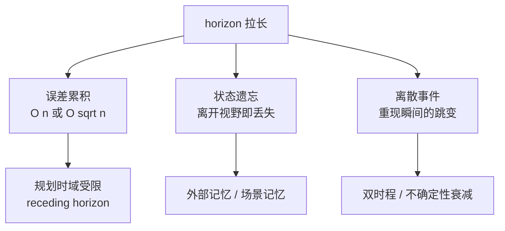
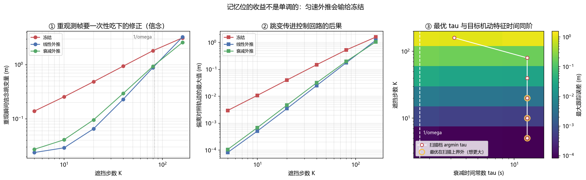

# 长时程世界模型与交互式生成：horizon 拉长之后才显形的失效

> **预计阅读：16 分钟 | 前置知识：本卷 01–08 篇、自回归生成基础、无人机控制闭环基础**

---

## 1. 为什么长时程是分水岭

前面几篇的世界模型大多在几帧到几十帧的尺度上评估。这个尺度上，所有方法看起来都还不错——单步误差都在小数点后两位，生成的视频看起来也说得过去。把 horizon 拉到上百步、把时长拉到十几秒，差别才显出来。

原因不是「误差变大了」这么简单，而是**误差的性质变了**。短时程上主导的是模型的局部精度：转移函数准一点，误差就小一点，调参有直接效果。长时程上主导的是三件不同的事：

- **误差如何累积**——这决定了几步之后偏离会到不可用的量级；
- **状态如何保留**——观测离开视野之后，模型还记不记得；
- **离散事件如何应对**——目标重新出现、场景突然变化，这些时刻的连续性；

这三件事**没有一件能靠提高单步精度解决**。一个单步误差减半的模型，在 100 步 rollout 上可能毫无改善，甚至更差（因为更锐利的模型对外推误差更敏感）。这就是为什么长时程需要单独一篇、单独一套机制。



---

## 2. 动作条件视频生成这一路

`02` 篇讲的是视频预测——从过去几帧推出未来几帧。这一节讲的是它的一个变体：**动作条件**（action-conditioned）生成，即给定一串控制指令，生成这串指令会导致的未来画面。

这个差别看起来只是多了一个输入，实际上改变了整个问题的性质。

**被动预测**的目标是「未来最可能是什么」，答案是条件分布的众数。**动作条件生成**的目标是「如果这样做，会发生什么」——这是反事实，不是预测。它要求模型学到的是动作与结果之间的因果通道，而不是数据里的时间相关性。把两者混淆会得到一个很能生成「合理视频」、但对动作不敏感的模型。`2610.06598` *SimForcing* 处理的就是这个：把仿真里的运动先验蒸馏进真实域模型，让动作通道忠实。

这条路线在 2026 年下半年的进展集中在**实时与交互**上：

- `2609.37107` *Waypoint-1.5* 把实时视频世界模型做到消费级硬件上；
- `2608.29910` *Matrix-Game 3.5* 用 patch memory 增强流式交互模型；
- `2609.35560` *WorldPlay2* 把可控性与 horizon 一起往外推；
- `2610.01614` *Oneira* 从开放式生成转向开放世界交互。

「交互式」这个词有具体的技术含义，它同时要求三件事：

1. **单步延迟足够低**——用户（或控制器）给了动作，模型必须在几十毫秒内给出下一帧，否则闭环不成立；
2. **动作条件忠实**——同一个动作在不同时刻产生一致的结果，不能今天左转明天右转；
3. **长时程一致**——滚下去一百步，场景不能散架。

这三条是**互相冲突**的。降低延迟最直接的办法是缩短上下文（少看几帧），而那正好破坏第 3 条；保证长时程一致最直接的办法是扩大上下文或加记忆，那正好破坏第 1 条。`2610.05739` *HLA-WM* 用混合线性注意力压缩长上下文的代价，`2609.02886` *SolarWM* 则从数据侧入手（开放数据 + 可扩展训练）。

> **判据**：拿到一个动作条件世界模型，先确认三件事各自达标没有，再看综合。延迟指标（ms/step）、动作忠实度（同一动作在不同状态下的结果是否单调）、长时程一致性（N 步后场景是否还成立）。用一个「生成质量」指标同时回答三个问题是做不到的。

---

## 3. 三种失效：漂移、遗忘、恒存性缺失

horizon 拉长之后暴露的失效有三种，机制完全不同。

**漂移（drift / 误差累积）**是最熟悉的一种，`02` 篇的 `m_exposure_bias.py` 与 `07` 篇的 Demo T 都量过。自回归生成时，每一步的输入都是自己的输出，训练时看到的却是真值——这个分布不匹配叫曝光偏差（exposure bias）。误差按两种方式增长：含系统偏差的部分线性累积（n 倍），随机部分按 √n 增长。本卷 `07` 篇已经给过这个比值的实测：5.40–5.52，理论 √30 = 5.477。

**遗忘（forgetting）**是第二种，也更隐蔽：观测离开视野之后，模型对它的记忆以多快的速度衰减。这一条在被动视频预测里不显眼（因为预测时域短），在交互式导航里是致命的——无人机飞过一小段距离后回头，场景变了样。2026 年下半年一批工作专门做这个：

- `2609.37690` *Honeycomb* 用**固定大小的场景记忆表示**，好处是记忆开销不随 horizon 增长；
- `2609.28466` *The Past Frames the Future* 处理自回归视频生成里的记忆机制；
- `2608.23565` *ReWorld* 把长时程记忆做进交互式世界模型；
- `2610.02521` *Spatial Memory Intelligence* 把记忆与「理解」绑起来，而不是无差别地存。

**恒存性缺失（object permanence）**是第三种，也是最有意思的一种。它不是说模型忘了目标在哪，而是说模型**没有把「被挡住的目标」与「重新出现的目标」认成同一个东西**。`2610.07355` *Tracking Is Not Permanence: What Video World Models Keep of a Hidden Object* 的标题就是这条结论：视频世界模型能把目标跟住（tracking），但目标被遮住再出现时，它保留的不是「这个目标一直都在」，而是「这里刚才有个东西」。两者的区别在重现那一帧暴露出来——恒存性缺失的模型会把它当成一个新出现的目标处理，位置、速度、身份全部重置。

这三种失效的判据不同，**测法也必须不同**：

> **判据**：漂移看误差随步数的增长曲线（是 n 还是 √n）；遗忘看观测离开视野后误差的衰减时间常数；恒存性看**离散事件**——遮挡结束时那一帧的跳变。前两者是连续量，第三者只能靠事件触发来测。用连续指标去测恒存性，会把那一帧的跳变平均掉。本卷 `07` 篇 Demo T 的 D3 就是为这类事件设计的诊断量，同一个失效在全程平均指标与事件指标上差 6.7 倍。

---

## 4. 记忆与重规划

针对第 3 节的三种失效，工程上有两组手段：**记忆机制**与**重规划策略**。

**记忆机制**按存储方式分三类：

- **固定容量的压缩记忆**：把历史压成一个固定大小的表示。`2609.37690` *Honeycomb* 是这一类的代表。优点是开销恒定，缺点是有损且损失不可控。
- **外部检索式记忆**：把历史帧/特征存进外部库，需要时检索。优点是容量大、可解释，缺点是检索本身有延迟，对交互式应用不友好。
- **循环隐状态**：靠 RNN/SSM 的隐状态传递信息。这是 Dreamer 一路（`03` 篇）的做法，缺点是隐状态容量有限且难以诊断。

**重规划策略**解决的是「规划时域不可能拉到与任务等长」这件事。做法是滚动时域（receding horizon）：只规划未来 N 步，执行前 M 步（M < N），然后重新规划。这样单次预测的 horizon 被限制在可用的范围内，代价是短视——遇到需要长程推理的任务（先绕过障碍才能到达目标）会失败。

两组手段要配合：记忆负责「地平线之外的信息从哪来」，重规划负责「不把预测误差喂进闭环」。`2610.05483` *FLEX-WAM* 的可变块因果结构就是想同时处理这两件事——不同的规划块长度各自独立，短块保响应、长块保一致。

---

## 5. 把 horizon 从 2 步拉到 100 步

这一节把第 3 节的「漂移」拆成可以算的量。做法是设定一个明确的外推装置，看误差怎么长。

**装置**：一个目标按振幅 3.0 m、角频率 ω = 0.6 rad/s 做周期运动，特征时间 1/ω = 1.67 秒。无人机在第 120 步（2.4 秒）起看不到目标，持续 K 步，然后用三种方式外推目标位置：

- **冻结**：认定目标不动，位置保持遮挡开始时的值（等价于 τ → 0）；
- **线性外推**：认定速度不变，按最后观测到的速度一直推下去（等价于 τ → ∞）；
- **衰减外推**：速度按时间常数 τ 指数衰减，τ = 1.6 秒。

把 K 从 5 步（0.1 秒）拉到 160 步（3.2 秒），本节 Demo V 量了两件事：外推期间的最大偏离，以及遮挡结束时那一帧的**跳变量**（信念从外推值切回真值的不连续量，也就是第 3 节的恒存性指标）。

**结论的第一半是量纲的分析，不需要实验也能推**：冻结的误差随时间**线性**增长（O(K)），匀速线性外推的误差随时间**平方**增长（O(K²)，因为真实目标是加速的，速度误差每步都在积累）。所以中段差距最大——K 从 5 拉到 40，线性外推的领先幅度先扩大。

**结论的第二半需要实验，因为它反直觉**：K 继续往上拉到 160 步，**冻结反超了**。原因是真实目标的机动幅度被 ±3.0 m 封了顶，冻结的误差有上界；而匀速外推没有上界，它一路推下去。Demo V 实测（重现瞬间跳变量，米）：

```text
   K (步)      秒              冻结            线性外推   衰减外推 tau=1.6s
       5    0.1           0.139           0.024           0.027
      20    0.4           0.485           0.065           0.096
      40    0.8           0.940           0.230           0.294
      80    1.6           1.815           0.882           0.932
     160    3.2           3.139           3.250           2.584
```

K = 160 时冻结 3.139 m，线性外推 3.250 m——**冻结更小**。而衰减外推在整条轴上两段都站得住：短遮挡时它近似匀速外推（因为 gap ≪ τ），长遮挡时它退回冻结（gap ≫ τ）。

这条「谁赢取决于遮挡长度」的结果，是把 horizon 拉长之后最该记住的一件事：**没有一种外推方式在全 horizon 上占优**，因为误差增长不是单一幂律——它取决于外推方式与信号的有界性。

---

## 6. 双时程架构

第 5 节的结论直接催生了一类架构：**既然没有一种时间常数在全 horizon 上占优，那就同时跑两个**。

代表工作是 `2609.33581` *ForeFly: A Dual-Horizon World Action Model for Aerial Vision-Language Navigation*——它把长时程与短时程分给两个预测器，前者负责「这一段该往哪去」，后者负责「下一步怎么动」。`2609.37644` *Beyond a single latent space* 是同一个思路在潜空间上的版本：长时程预测与短时程预测各用一套潜表示，因为「十步之后在哪」和「下一步的姿态」需要的抽象层级本来就不同。`2610.08627` *Parallel Predictive World Models* 则把多个时程并行预测，用并行的预测互相校正。

三条理由说明为什么分时程比拉长单一时程更可行：

1. **误差增长的形状不同**。短时程上主导的是局部精度，长时程上主导的是有界性与记忆。用一个预测器同时优化两件事，梯度会互相拉扯。
2. **动作的抽象层级不同**。短时程的动作是姿态指令，长时程的动作是航路点或子目标。`2610.05483` 的可变块因果就是让模型显式地在不同层级上做预测。
3. **延迟预算不同**。短时程预测必须快（进闭环），长时程预测可以慢（几十毫秒到几百毫秒一次）。分开之后，短路径可以做成轻量的。

**分层与双时程有一个容易混淆的地方**：双时程是**平行的两条时间轴**，各自输出对未来某一时刻的预测；分层是**嵌套的**，高层给出子目标、低层在子目标约束下做局部预测（`2610.06805` *H-JEPA* 属于这一类）。前者不需要高层输出可执行的约束，后者需要。选哪个取决于任务里有没有「子目标」这个概念。

---

## 7. 对无人机的含义

**第一，遮挡—重捕获是这个领域的高频事件，不是边缘情况。**无人机飞过楼角、穿过桥洞、绕过树冠，每一次都产生「一段时间没有观测、然后重新出现」。本卷 `05` 篇讨论过无人机场景的特殊性。这意味着第 3 节的恒存性缺失不是理论问题，而是每次飞行都会遇到的事。**评测必须专门为这个事件设计指标**——用全程平均单步误差去筛「谁的遮挡外推更好」，会把差异抹平（`07` 篇 Demo T 里差 6.7 倍）。

**第二，记忆该保留多久不是常数。**这是本节 Demo V 的 ③ 节给出的结论，也是本节最实用的一条。扫描衰减时间常数 τ，看每一档遮挡长度下最优的 τ 落在哪：

```text
   K (步)    0.05     0.2     0.8     1.6     3.2    12.8      不衰减  argmin    1/w
       5   0.001   0.000   0.000   0.000   0.000   0.000    0.000     不衰减   1.67
      20   0.032   0.018   0.007   0.005   0.004   0.004    0.003     不衰减   1.67
      40   0.132   0.095   0.045   0.032   0.026   0.025    0.025   12.80   1.67
      80   0.500   0.426   0.263   0.199   0.175   0.171    0.176   12.80   1.67
     160   1.562   1.466   1.180   1.054   1.019   1.133    1.217    3.20   1.67
```

**最优 τ 随遮挡长度单调下移**：K ≤ 20 步时扫描的上界（不衰减，即 τ → ∞）就已经是最优；遮挡长到 40/80 步时最优档是 12.8 秒；到 160 步（3.2 秒）才收敛到 3.2 秒附近——**与目标的机动特征时间 1/ω = 1.67 秒同阶**。

这条趋势本身就是结论：**最优 τ 不是常数，它跟着遮挡长度走**。短遮挡下速度估计还准，就该全力外推（τ → ∞）；遮挡长过目标的机动时间尺度之后，速度估计失效，衰减必须加快。所以真实的做法不是部署前固定一个 τ，而是**让不确定性随遮挡时间增长、由它在线决定 τ**。

**第三，长时程失效是两个阶段，不是一个事件。**Demo V 的 ② 节量的是无人机相对「从不遮挡」对照轨迹的最大偏离，分遮挡期与重现后 100 步两段：

```text
   K (步)      秒        冻结      线性外推      衰减外推        冻结      线性外推      衰减外推
                            遮挡期                        重现后 100 步
      40    0.8     0.103     0.014     0.019     0.149     0.025     0.032
      80    1.6     0.445     0.138     0.159     0.528     0.176     0.199
     160    3.2     1.491     1.040     0.941     1.596     1.217     1.054
```

K = 160 时两个入口**脱钩**了：冻结的跳变（3.139 m，见第 5 节表）比线性外推（3.250 m）**小**，但它在整个遮挡期都在把一个恒定的错误位置喂给控制器，累积偏离反而**更大**（遮挡期 1.491 vs 1.040 m）。

所以只盯着重现瞬间的跳变去设计记忆机制会漏掉前半段。**失效不是「重现那一刻崩了」，而是「持续喂错 + 那一刻跳变」两段。**

**第四，空中领域的落地案例。**这一卷的新篇里，空中场景已经有了具体的工作：`2609.26007` *Skytopia* 用单目相机 + 动作条件潜世界模型做导航；`2605.19728` *Aero-World* 从惯性控制信号生成空中视频；`2605.15964` *WorldVLN* 与 `2606.06147` *WorldFly* 把世界模型接进空中视觉语言导航；`2609.33581` *ForeFly* 就是第 6 节的双时程架构。这几篇的共同点是**都把动作条件与长时程放在一起处理**——因为无人机任务本身就是长时程的。

> **一条要写在结论旁边的限制**：Demo V 里的遮挡区间是**已知的**，信念从遮挡开始就按同一套规则外推，不做贝叶斯更新。真实系统的遮挡边界往往自己也不确定（是目标被挡住了，还是跟踪器丢了？）。所以这里量到的收益是**上界**——遮挡越靠猜测，实际收益越小。

---

## 8. 关键论文

> 本节收 2026 年 6–10 月窗口内的长时程与交互式生成新作，以及窗口外几周、但属于同一主线、`tools/watch.py` 的窗口起始日切掉的空中世界模型论文（复核证据见 `tools/watchlists.py` 的 `VERIFIED_ZEROS`）；逐条 arXiv 号已通过 arXiv API 核对标题。

#### 双时程与分层架构

- **[arXiv'26.09] ForeFly** — *A Dual-Horizon World Action Model for Aerial Vision-Language Navigation*
  [](https://arxiv.org/abs/2609.33581)
  长/短两个时程分给两个预测器，空中视觉语言导航。

- **[arXiv'26.09] Beyond a Single Latent Space** — *A Dual-Latent World Model for Long-Horizon Planning*
  [](https://arxiv.org/abs/2609.37644)
  两套潜表示各管一个时间尺度。

- **[arXiv'26.10] FLEX-WAM** — *Flexible Block-Causal World-Action Models for Long-Horizon Imagination and Planning*
  [](https://arxiv.org/abs/2610.05483)
  可变块因果，块长独立，短块保响应、长块保一致。

- **[arXiv'26.10] Parallel Predictive World Models** — *Accurate and Efficient Long-Horizon Planning*
  [](https://arxiv.org/abs/2610.08627)
  多时程并行预测互相校正。

- **[arXiv'26.10] H-JEPA** — *End-to-End Learning of Hierarchical World Models for Visual Planning*
  [](https://arxiv.org/abs/2610.06805)
  嵌套式分层（与双时程的平行结构对照看）。

#### 记忆机制

- **[arXiv'26.09] Honeycomb** — *Constant-Size Scene Memory Representation for Video World Models*
  [](https://arxiv.org/abs/2609.37690)
  固定大小的场景记忆，开销不随 horizon 增长。

- **[arXiv'26.09] The Past Frames the Future** — *Memory for Autoregressive Video Generation*
  [](https://arxiv.org/abs/2609.28466)
  自回归视频生成的记忆设计。

- **[arXiv'26.08] ReWorld** — *An Interactive World Model with Long-Horizon Memory*
  [](https://arxiv.org/abs/2608.23565)
  交互式世界模型里的长时程记忆。

- **[arXiv'26.10] Spatial Memory Intelligence** — *Endowing World Models with Understanding-Driven Long-Term Memory*
  [](https://arxiv.org/abs/2610.02521)
  记忆与理解绑定，不做无差别存储。

- **[arXiv'26.10] World Observer** — *Joint Actor-Observer Generation for Persistent World Modeling*
  [](https://arxiv.org/abs/2610.02162)
  联合生成观察者视角，维持场景持久性。

#### 恒存性与遮挡

- **[arXiv'26.10] Tracking Is Not Permanence** — *What Video World Models Keep of a Hidden Object*
  [](https://arxiv.org/abs/2610.07355)
  跟得住 ≠ 认得同一个物体；重现那一帧暴露差距。

#### 交互式与实时生成

- **[arXiv'26.09] Waypoint-1.5** — *A Real-Time Video World Model for Consumer Hardware*
  [](https://arxiv.org/abs/2609.37107)
  消费级硬件上的实时视频世界模型。

- **[arXiv'26.08] Matrix-Game 3.5** — *Enhancing Real-Time Streaming Interactive World Models with Patch Memory*
  [](https://arxiv.org/abs/2608.29910)
  流式交互 + patch memory。

- **[arXiv'26.09] WorldPlay2** — *Extending Real-Time Interactive World Models in Control and Horizon*
  [](https://arxiv.org/abs/2609.35560)
  可控性与 horizon 一起外推。

- **[arXiv'26.10] Oneira** — *From Open-Ended Generation to Open-World Interaction in Video World Models*
  [](https://arxiv.org/abs/2610.01614)
  从开放生成转向开放交互。

- **[arXiv'26.10] HLA-WM** — *Hybrid Linear Attention for Long-Horizon Video World Models*
  [](https://arxiv.org/abs/2610.05739)
  用线性注意力压长上下文的代价。

- **[arXiv'26.09] SolarWM** — *Open Data and Scalable Training for Long-Horizon Video World Models*
  [](https://arxiv.org/abs/2609.02886)
  开放数据 + 可扩展训练。

- **[arXiv'26.08] GeniWorld** — *A Generalizable Interactive World Model for Robotic Manipulation via Visual Actions*
  [](https://arxiv.org/abs/2608.06332)
  以视觉动作作为接口的可泛化交互世界模型。

#### 物理一致性与不确定性

- **[arXiv'26.10] DeltaWorld** — *Physically Consistent Interactive World Simulators via Action-Conditioned Latent Increment Learning*
  [](https://arxiv.org/abs/2610.02691)
  学潜增量而非潜状态本身，保证物理一致性。

- **[arXiv'26.10] Modeling Latent Disturbances for Robust Decision-Making in World Models**
  [](https://arxiv.org/abs/2610.07599)
  显式建模潜扰动，给确定性架构补上不确定性。

- **[arXiv'26.10] SimForcing** — *Distilling Simulation Motion Priors into Real-Domain Robot World Models*
  [](https://arxiv.org/abs/2610.06598)
  把仿真的运动先验蒸馏进真实域，保证动作通道忠实。

#### 空中世界模型（窗口外几周，同主线）

- **[arXiv'26.09] Skytopia** — *Monocular Drone Navigation with Action-Conditioned Latent World Models*
  [](https://arxiv.org/abs/2609.26007)
  单目相机 + 动作条件潜世界模型做无人机导航。

- **[arXiv'26.05] Aero-World** — *Action-Conditioned Aerial Video Generation from Inertial Controls*
  [](https://arxiv.org/abs/2605.19728)
  从惯性控制信号生成空中视频。

- **[arXiv'26.05] WorldVLN** — *Autoregressive World Action Model for Aerial Vision-Language Navigation*
  [](https://arxiv.org/abs/2605.15964)
  自回归世界动作模型，空中视觉语言导航。

- **[arXiv'26.06] WorldFly** — *A World-Model-Based Vision-Language-Action Model for UAV Navigation*
  [](https://arxiv.org/abs/2606.06147)
  世界模型 + VLA 的无人机导航。

---

## 9. 动手验证：记忆位的收益与它的失效点

这一节把第 5、6、7 节跑成数字。装置是 128 条并行轨迹 × 400 步（8 秒，50 Hz），目标按振幅 3.0 m、角频率 ω = 0.6 rad/s 机动，在第 120 步（2.4 秒）起被遮掉 K 步。三种信念外推方式共用同一套代码，只换一个参数：

```python
def belief_traj(g_seq, K, tau):
    """tau = 0 冻结；tau = inf 不衰减（匀速）；否则速度按 tau 指数衰减。"""
```

`tau` 在两端退化成两个极端，中间是连续插值——所以「有没有记忆位」这个问题被还原成一根轴，而不是一个二值选择。这一点本身是本节的第一个结论。

### 9.1 核心代码

```python
import math
import numpy as np

SEED, N, T, DT = 13, 128, 400, 0.02
T0, POST = 120, 100                      # 遮挡起点、重现后观察窗口（步）
K_LIST = [5, 10, 20, 40, 80, 160]
A_TARGET, OMEGA = 3.0, 0.6
TAU_CHAR = 1 / OMEGA                     # 目标的机动特征时间 = 1.67 s
TAU_LIST = [0.05, 0.2, 0.8, 1.6, 3.2, 12.8]
INF = float("inf")


def belief_traj(g_seq, K, tau):
    """遮挡区间的信念外推。tau = 0 冻结；tau = inf 匀速；否则指数衰减。"""
    end = T0 + K
    hats = np.zeros_like(g_seq)
    hats[:T0 + 1] = g_seq[:T0 + 1]              # 遮挡前直接可用
    v0 = (g_seq[T0] - g_seq[T0 - 1]) / DT       # 最后观测到的速度
    gap = np.arange(1, K + 1) * DT
    if tau == 0.0:                              # 冻结：位置不动
        disp = np.zeros((K, 3))
    elif tau == INF:                            # 匀速：线性累积，O(K^2)
        disp = np.outer(gap, np.ones(3)) * v0
    else:                                       # 衰减：积分 v0*exp(-t/tau)
        disp = np.outer(tau * (1 - np.exp(-gap / tau)), np.ones(3)) * v0
    hats[T0 + 1:end + 1] = g_seq[T0] + disp
    hats[end:] = g_seq[end:]                    # 重现后立刻校正
    return hats
```

`rollout()` 用一个固定的专家控制器（`common/quad_sim.py` 的 `expert`）在闭环里跟踪信念轨迹，返回 `jump`（重现瞬间的信念跳变量）与整条无人机轨迹：

```python
def rollout(K, tau, phi, record=False):
    """returns (jump, 轨迹或 None)"""
    jump = abs(hats[end] - hats[end + 1])       # 信念在重观测帧的不连续量
```

第 ② 节的所有偏离都用**配对基线**：先跑一条完全不遮挡的对照轨迹，再对每一条遮挡轨迹逐帧求 `|p_run − p_base|`。这一步不能省——直接看无人机到真值目标的距离，会混进专家控制器追机动目标本身的几米稳态滞后，那部分与被测的记忆机制无关，会把遮挡那部分淹掉。

### 9.2 本地实测结果

**① 遮挡长度 × 外推方式 → 重现瞬间的跳变量（米）**——即第 3 节的恒存性指标：

```text
   K (步)      秒              冻结            线性外推   衰减外推 tau=1.6s
       5    0.1           0.139           0.024           0.027
      10    0.2           0.254           0.029           0.041
      20    0.4           0.485           0.065           0.096
      40    0.8           0.940           0.230           0.294
      80    1.6           1.815           0.882           0.932
     160    3.2           3.139           3.250           2.584
```

短遮挡下线性外推是 O(K²)、冻结是 O(K)，所以中段（K = 20–40）差距最大。长遮挡下**冻结反超**：目标机动幅度只有 ±3.0 m，信念冻结的误差被它封顶；匀速外推没有上限。衰减外推两段都站得住——短遮挡时它近似匀速外推（gap ≪ τ），长遮挡时它退回冻结（gap ≫ τ）。

**② 无人机偏离「从不遮挡」对照轨迹的最大值（米）**：分遮挡期与重现后 100 步两段。注意这一段是①和②减出来的——借的是第 9.1 节那条配对基线。

```text
   K (步)      秒        冻结      线性外推      衰减外推        冻结      线性外推      衰减外推
                            遮挡期                        重现后 100 步
       5    0.1     0.000     0.000     0.000     0.003     0.000     0.000
      20    0.4     0.017     0.001     0.001     0.040     0.003     0.005
      40    0.8     0.103     0.014     0.019     0.149     0.025     0.032
      80    1.6     0.445     0.138     0.159     0.528     0.176     0.199
     160    3.2     1.491     1.040     0.941     1.596     1.217     1.054
```

**两个入口在长遮挡下脱钩**：K = 160 时冻结的跳变（3.139 m）比线性外推（3.250 m）小，但它在整个遮挡期都在把一个恒定的错误位置喂给控制器，累积偏离反而更大（遮挡期 1.491 m vs 1.040 m）。

所以长时程失效不是一个事件，是**「持续错误 + 一次跳变」两段**。只盯着重现瞬间的跳变去设计记忆机制，会漏掉前半段。

**③ 扫描衰减时间常数 τ：每一档遮挡的最优 τ 落在哪**

```text
   K (步)    0.05     0.2     0.8     1.6     3.2    12.8      不衰减  argmin    1/w
       5   0.001   0.000   0.000   0.000   0.000   0.000    0.000     不衰减   1.67
      10   0.007   0.003   0.001   0.001   0.001   0.001    0.001     不衰减   1.67
      20   0.032   0.018   0.007   0.005   0.004   0.004    0.003     不衰减   1.67
      40   0.132   0.095   0.045   0.032   0.026   0.025    0.025   12.80   1.67
      80   0.500   0.426   0.263   0.199   0.175   0.171    0.176   12.80   1.67
     160   1.562   1.466   1.180   1.054   1.019   1.133    1.217    3.20   1.67
```

**最优档随遮挡长度单调下移**：K ≤ 20 步时扫描的上界（不衰减）就已经是最优；K = 40/80 步时最优是 12.8 秒；K = 160 步（3.2 秒）才收敛到 3.2 秒附近——与目标的机动特征时间 1/ω = 1.67 秒同阶。

这条趋势本身就是结论：

> **判据**：最优 τ 不是常数，它跟着遮挡长度走。短遮挡下速度估计还准，就该全力外推（τ → ∞）；遮挡长过目标的机动时间尺度之后，速度估计失效，衰减必须加快。真实的做法不是部署前固定一个 τ，而是让不确定性随遮挡时间增长、由它在线决定 τ。这与 ① 节里「衰减外推两段都站得住」是同一件事的两种说法。



> **限制**：本装置里的遮挡区间是**已知**的，信念从遮挡开始就按同一套规则外推，不做贝叶斯更新。真实系统的遮挡边界往往自己也不确定——是目标被挡住了，还是跟踪器丢了？两者的处理方式完全不同。所以这里量到的收益是**上界**：遮挡越靠猜测，实际收益越小。此外目标运动是单一频率的周期函数，真实目标的机动特征时间会变化，此时「最优 τ 与 1/ω 同阶」这条对应关系要按最坏情况的 ω 来读。

### 9.3 运行完整脚本

```bash
py -3.9 code/v_longhorizon_memory.py     # CPU 即可，约 11 秒，依赖 numpy / torch / matplotlib
```

完整脚本在 [`code/v_longhorizon_memory.py`](../../code/v_longhorizon_memory.py)，额外打印三组表的完整档位（含 6 档 K = 5、10、20、40、80、160 与 τ 的全网格），并输出上面那张三面板图（第三格用对数归一化上色，因为误差跨四个数量级）。

---

## 10. 延伸阅读

- [01-世界模型发展史](./01-世界模型发展史.md) — 长时程问题在世界模型史上的位置
- [02-生成式世界模型](./02-生成式世界模型.md) — 曝光偏差与像素空间的误差累积
- [03-模型强化学习世界模型](./03-模型强化学习世界模型.md) — 想象 rollout 的时域与滚动规划
- [04-3D场景世界模型](./04-3D场景世界模型.md) — 显式几何地图天然不受遗忘影响，可对照
- [05-无人机世界模型综述](./05-无人机世界模型综述.md) — 无人机长时程任务的具体形态
- [06-关键数据集与基准](./06-关键数据集与基准.md) — 长时程视频数据（MotionScape / SolarWM）
- [07-世界模型评测与诊断](./07-世界模型评测与诊断.md) — 离散事件指标 D3 的设计动机
- [08-联合嵌入预测与潜空间世界模型](./08-联合嵌入预测与潜空间世界模型.md) — 时间抽象与跳步预测

---

## 11. 思考题

### 题目 1：误差增长为什么不是单一幂律

第 5 节说冻结是 O(K)、匀速外推是 O(K²)，所以中段线性外推更好，但末段冻结反超。如果目标不是周期运动而是一直朝一个方向飞，这个反超还会发生吗？

<details>
<summary>参考答案</summary>

**不会。**反超的前提是「真实运动的幅度有界」。

匀速外推的误差来自「真实运动在加速，而外推假设匀速」——误差随外推时间的平方增长，没有上限。冻结的误差是「真实位置与起点的距离」，这个距离被运动本身的范围封顶：目标在 ±3.0 m 内往复，冻结误差最多约 6 m（一个来回）。

如果目标一直朝一个方向飞（比如一段长直线航路），冻结误差就不再被封顶——它同样随时间线性增长，且斜率是目标的真实速度；而匀速外推的误差仍然只有加速度项贡献的 O(K²)，但此时加速度项很小（匀速飞行时为零）。极限情况下目标严格匀速：匀速外推误差恒为 0，冻结误差线性发散。**反超彻底消失。**

所以正确的读法是：**「谁赢」取决于信号的结构，不取决于 horizon 这个数字本身。** 判据要落到具体性质上：

- 目标机动有界（往复、盘旋）→ 长遮挡下冻结不吃亏；
- 目标做长程平移（航路飞行）→ 必须外推，冻结会发散；
- 一般情况 → 衰减外推（指数插值）在两端都退化到正确的一侧，这就是第 9 节 ① 节说它「两段都站得住」的原因。

写结论时不能说「长遮挡应该冻结」，只能说「长遮挡时速度估计失效，衰减要加快」——这句话在任何信号结构下都成立，因为 τ 由不确定性决定，而不是由遮挡长度这个数字决定。

</details>

### 题目 2：为什么跳变小的方案反而累积偏离更大

第 9 节 ② 节里 K = 160 时冻结的跳变（3.139 m）比线性外推（3.250 m）小，但它在遮挡期的累积偏离（1.491 m）比线性外推（1.040 m）大。这是不是说明跳变这个指标没用？

<details>
<summary>参考答案</summary>

**不是指标没用，是它们量的是两个不同的量。**两者都是真实的失效通道，只是发生的时间段不同：

- **跳变量**量的是**重现那一帧的不连续**。它对控制器是冲击——瞬间的位置/速度目标跳变，会激起一段振荡。冻结的跳变小，说明它给的信念在切回真值时的冲击反而更柔和。
- **累积偏离**量的是**整个遮挡期持续喂错**。冻结的信念恒定在一个错误位置，控制器在这 3.2 秒里一直朝那个位置飞；线性外推虽然最终位置错得更多，但它在路上是「朝着大致正确方向在动」，所以偏离反而小。

正确结论不是「看哪一个指标」，而是**两个都要看，并且要知道它们对应不同的机制**：

1. **持续错误**要靠「把握度随遮挡时间衰减」来治——本卷 Demo V 的 ③ 节就是这个机制（不确定性增长 → τ 下降 → 信念开始退回起点，不再盲目外推）。
2. **离散跳变**要靠「重现时的软融合」来治——不直接把信念切换成观测，而是在几个时间步内平滑过渡。

只用一个指标筛方案，会选出只修好一半的候选：跳变指标选中冻结（累积偏离最大），累积指标选中线性外推（跳变最大）。这正是本卷 `07` 篇第 5 节那条判据的又一个实例——**断言一个修复有效，至少要有两套独立诊断同时确认**。

</details>

### 题目 3：双时程为什么比拉长单一时程更可行

第 6 节说双时程架构是「既然没有一种时间常数在全 horizon 上占优，那就同时跑两个」。但两个预测器参数量加起来更多，训练更麻烦。为什么不直接把一个预测器训练得更强、让它覆盖全 horizon？

<details>
<summary>参考答案</summary>

有三个不可回避的冲突，加容量都解决不了：

**(1) 梯度冲突。**短时程损失要求模型对局部细节敏感（位置、姿态的一阶差分），长时程损失要求模型对缓慢的抽象趋势敏感。这两类信号的尺度不同，联合优化时短时程的梯度会主导——因为它数值更大、更稠密。结果通常是模型学会了短时程而长时程几乎没学。分开之后各自的损失不会互相淹没。

**(2) 延迟预算冲突。**如果只有一个预测器，它必须每次都以「覆盖全 horizon」的规模前向——哪怕闭控制环只需要未来 1 步。`2609.37107`（消费级硬件实时）和 `2609.35560`（实时交互）这条线对单步延迟敏感，多花的时间直接体现在控制频率上。分成两条路径后，短路径可以做成轻量的，长路径低频运行。

**(3) 误差性质的冲突。**第 5 节量到的是：短时程主导误差来自局部精度，长时程主导误差来自有界性与记忆。前者靠调容量和精度指标，后者靠记忆机制与不确定性建模。把它们塞进一个模块，等于要求同一组参数同时扮演「精密仪器」和「记忆体」。

**但双时程不是免费的。**代价是两条路径的输出需要协调：如果长时程预测说「往东」而短时程预测说「往西」，得有一个仲裁机制。`2610.05483` *FLEX-WAM* 的可变块因果结构正是这个仲裁的一种实现——让长短块在同一个因果结构里显式对齐，而不是各自为政。

**判据**：任务里如果存在明确的「子目标」概念（航路点、区域），分层架构更自然；如果只是时间尺度不同、没有中间抽象层，双时程（平行）比分层（嵌套）更合适。

</details>

---

> **读完了自测**：[世界模型专题自测](../09-专题自测与考察/02-世界模型专题自测.md) — 三层考察加无人机专场 12 问，答不上来的顺着指针回读
