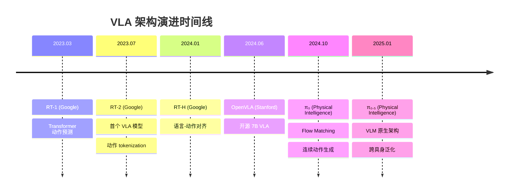
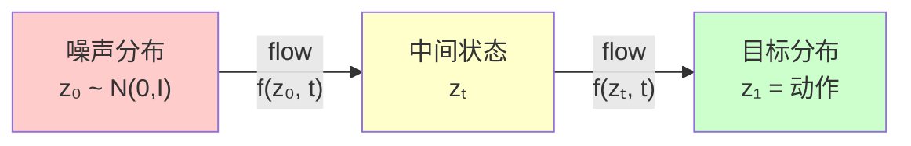

# VLA 架构演进：从 RT-2 到 π₀.₅

> **预计阅读：18 分钟 | 前置知识：Transformer 基础、视觉语言模型（VLM）概念、机器人学基础**

---

## 1. 引言：什么是 VLA？

Vision-Language-Action（VLA）模型是一类将 **视觉感知**、**语言理解** 和 **动作生成** 统一到单一神经网络中的端到端模型。与传统的"感知-规划-控制"分层流水线不同，VLA 模型直接从原始视觉输入和语言指令映射到机器人动作，代表了具身智能（Embodied AI）领域的重要范式转变。

```
传统流水线：  感知模块 → 地图/状态估计 → 规划器 → 控制器 → 执行
VLA 范式：  (图像 + 语言指令) → VLA 模型 → 动作序列
```

VLA 的核心思想源于一个关键观察：大规模视觉语言模型（如 PaLI、LLaVA）已经学会了丰富的视觉语义理解能力，而这些能力可以被"扩展"到动作空间——通过将动作编码为离散 token 或连续向量，使语言模型的序列生成能力直接服务于机器人控制。

---

## 2. VLA 发展时间线



---

## 3. RT-2：VLA 的开山之作（Google, 2023）

### 3.1 背景与动机

Google DeepMind 在 2023 年发表的 RT-2（Robotic Transformer 2）是第一个被明确定义为 VLA 的模型。其核心动机基于一个观察：互联网规模预训练的视觉语言模型（如 PaLI-X、PaLM-E）已经获得了强大的语义推理能力，包括物体识别、空间关系理解、常识推理等。RT-2 的目标是将这些能力迁移到机器人动作生成中。

### 3.2 架构设计

RT-2 的架构建立在视觉语言模型（VLM）之上，关键创新在于 **动作 tokenization**——将机器人动作离散化为文本 token，使得动作生成可以复用语言模型的下一个 token 预测范式。

```
RT-2 架构示意：

输入: [机器人图像] + [语言指令: "把红色方块放到蓝色盘子上"]
         |                    |
    [视觉编码器]         [文本 Tokenizer]
    (ViT / SigLIP)           |
         |                    |
         +--------+-----------+
                  |
           [VLM Backbone]
        (PaLI-X / PaLM-E)
         Transformer Decoder
                  |
           [动作 Token 生成]
        "1 128 91 241 5 101"
         (离散化后的动作序列)
                  |
           [动作 Detokenization]
        → (Δx, Δy, Δz, Δroll, Δpitch, Δyaw, gripper)
```

### 3.3 动作 Tokenization 方案

RT-2 的核心创新在于将连续的机器人动作空间离散化为 256 个 bin，每个维度用一个 token 表示。对于一个 7 自由度的机械臂（6 DoF + 1 夹爪），动作被编码为 7 个 token：

| 动作维度 | Token 范围 | 量化方式 |
|---------|-----------|---------|
| Δx (位置) | 0-255 | 均匀量化到 [-1, 1] |
| Δy (位置) | 0-255 | 均匀量化到 [-1, 1] |
| Δz (位置) | 0-255 | 均匀量化到 [-1, 1] |
| Δroll (姿态) | 0-255 | 均匀量化到 [-π, π] |
| Δpitch (姿态) | 0-255 | 均匀量化到 [-π, π] |
| Δyaw (姿态) | 0-255 | 均匀量化到 [-π, π] |
| gripper (夹爪) | 0-255 | 0=关, 255=开 |

这些 token 被追加到词汇表的末尾（在原始文本 token 之后），使得 VLM 的 Transformer decoder 可以像生成文本一样生成动作。

### 3.4 Co-Fine-Tuning 策略

RT-2 采用了一种巧妙的联合微调策略：在机器人操控数据和原始互联网视觉语言数据上同时训练。这确保了模型在学习动作生成的同时，保持了从预训练中获得的语义理解能力。

### 3.5 涌现能力

RT-2 展示了一个令人兴奋的现象：模型展现出了训练数据中从未出现过的 **涌现推理能力**，例如：

- 理解抽象概念："把物体移到最大的物体旁边"
- 语义推理："捡起已灭绝的动物"（模型选择恐龙玩具）
- 数学推理："移动到 3+1 的位置"（移动到第 4 个位置）

这些能力直接继承自底层 VLM 的推理能力，验证了 VLA 范式的可行性。

### 3.6 局限性

- **推理速度慢**：基于大型 VLM（PaLI-X 为 55B 参数），推理频率仅约 1-3 Hz，难以满足实时控制需求
- **动作精度受限**：离散化导致动作精度上限受限于 bin 数量
- **仅限桌面操控**：实验仅在固定机械臂上验证，未涉及移动机器人或无人机

---

## 4. OpenVLA：开源 VLA 的里程碑（Stanford, 2024）

### 4.1 设计理念

OpenVLA 由 Stanford 团队于 2024 年发表，是第一个完全开源的大规模 VLA 模型。其核心设计理念是：VLA 不应该被少数拥有大规模计算资源的团队垄断，而应该成为可被广泛复用和改进的基础设施。

### 4.2 架构

OpenVLA 基于 **7B 参数** 的 Prismatic VLM 架构，结合了：

- **视觉编码器**：SigLIP（用于语义理解）+ DINOv2（用于空间特征）
- **语言模型骨干**：Llama 2 7B
- **动作头**：离散化 token 输出（与 RT-2 类似，256 bins）

```
OpenVLA 架构：

[RGB 图像]
    |
    +--→ SigLIP (语义特征) --+
    |                         |
    +--→ DINOv2 (空间特征) ---+--→ [特征融合层]
                                   |
[语言指令] --→ [Tokenizer] -------+--→ [Llama 2 7B Decoder]
                                           |
                                    [动作 Token 输出]
                                    (256-bin 离散化)
```

### 4.3 开源贡献

OpenVLA 的开源贡献体现在多个层面：

| 贡献维度 | 内容 |
|---------|------|
| 模型权重 | 7B 参数完整权重公开 |
| 训练数据 | Open X-Embodiment 数据集子集 |
| 训练代码 | 完整的训练流水线 |
| 评测基准 | 标准化的评测协议 |
| 微调指南 | 针对新机器人的微调教程 |

### 4.4 关键实验结果

OpenVLA 在多个机器人操控基准上取得了与 RT-2 相当甚至更好的性能，同时参数量仅为 7B（RT-2 使用 55B）：

| 模型 | 参数量 | SIMPLER 均分 | 推理速度 |
|------|--------|-------------|---------|
| RT-2-X (55B) | 55B | 72.6% | ~1.5 Hz |
| OpenVLA | 7B | 73.2% | ~6 Hz |
| Octo | 93M | 56.3% | ~50 Hz |

### 4.5 微调与适配

OpenVLA 提供了高效的微调方案，用户可以在单张消费级 GPU（如 RTX 4090）上对模型进行 LoRA 微调，使其适应新的机器人平台和任务。这种可及性大大降低了 VLA 技术的使用门槛。

### 4.6 对无人机领域的启示

OpenVLA 的开源特性使其成为无人机 VLA 研究的重要基础模型。后续的 UAV-Flow 等工作直接基于 OpenVLA 进行无人机适配，证明了开源 VLA 作为通用基础模型的价值。

---

## 5. π₀：连续动作生成的新范式（Physical Intelligence, 2024）

### 5.1 从离散到连续

RT-2 和 OpenVLA 的动作 tokenization 方案虽然巧妙，但存在固有局限：离散化不可避免地引入量化误差，且对于高精度操控任务（如灵巧手操作），256 个 bin 可能不够精细。π₀ 由 Physical Intelligence 公司于 2024 年提出，采用 **Flow Matching**（流匹配）技术，直接在连续动作空间中生成动作。

### 5.2 Flow Matching 基础

Flow Matching 是一种生成建模方法，可以理解为一种更高效的扩散模型（Diffusion Model）替代方案。其核心思想是学习一个向量场，将简单的先验分布（如高斯噪声）逐步变换为目标动作分布。



与扩散模型相比，Flow Matching 的优势在于：
- 训练更稳定（直接回归向量场，而非噪声）
- 采样更高效（通常只需 10-20 步，而扩散模型需要 50-100 步）
- 生成质量相当或更好

### 5.3 π₀ 架构

π₀ 的架构由以下部分组成：

```
π₀ 架构：

[RGB 图像 × N] --→ [视觉编码器] --→ 视觉 tokens
                                          |
[语言指令] ------→ [Tokenizer] ----------+--→ [VLM Backbone]
                                          |      (预训练 VLM)
[当前状态] ------→ [状态编码器] ----------+      (如 PaLI-X)
                                          |
                                          ↓
                                    [Flow Matching Head]
                                          |
                                    [动作 chunk 生成]
                                    (连续值, 长度 H)
```

关键设计选择：
- **动作 chunk**：一次生成未来 H 步的动作序列（通常 H=16-50），而非逐步生成
- **条件生成**：Flow Matching 过程以 VLM 的特征表示为条件
- **去噪步数**：推理时通常使用 10 步去噪

### 5.4 训练流程

π₀ 的训练分为两个阶段：

1. **预训练阶段**：在大规模机器人数据集（Open X-Embodiment 等）上训练 Flow Matching 头，同时保持 VLM backbone 的权重（或仅微调部分层）
2. **后训练阶段**：在特定机器人平台和任务上进行精细微调

### 5.5 性能表现

π₀ 在多个灵巧操控任务上展示了优越性能，特别是在需要精细接触操作的任务（如折叠衣物、组装零件）上，相比离散化 VLA 有明显优势。

---

## 6. π₀.₅：迈向通用具身基础模型（Physical Intelligence, 2025）

### 6.1 设计哲学的转变

π₀.₅ 代表了 VLA 架构设计哲学的一次重大转变：不再是在 VLM 之上"附加"动作头，而是从一开始就在 VLM 的架构设计中融入动作生成能力。这意味着动作不再是一种"外挂"能力，而是模型的原生能力。

### 6.2 核心创新

| 创新点 | π₀ | π₀.₅ |
|--------|-----|-------|
| 架构范式 | VLM + 动作头 | 原生动作 VLM |
| 动作表示 | Flow Matching 头 | 统一 token 空间 |
| 跨具身能力 | 有限 | 强（统一架构） |
| 语言理解 | 通过 VLM | 深度融合 |
| 训练范式 | 两阶段 | 端到端 |

### 6.3 跨具身泛化

π₀.₅ 的一个重要目标是实现 **跨具身泛化**（Cross-Embodiment Generalization）：同一个模型可以控制不同形态的机器人（机械臂、灵巧手、移动机器人等），而无需针对每个平台重新训练。这通过统一的动作空间表示和大规模多平台数据训练实现。

### 6.4 与 UAV 的潜在关联

π₀.₅ 的跨具身泛化能力使其成为无人机 VLA 的潜在基础模型。UAV-TrackVLA 等工作已经开始探索将 π₀.₅ 架构应用于无人机场景，利用其强大的视觉理解能力和连续动作生成能力。

---

## 7. 架构演进对比总结

### 7.1 全面对比表

| 特性 | RT-2 | OpenVLA | π₀ | π₀.₅ |
|------|------|---------|-----|------|
| 发表时间 | 2023.07 | 2024.06 | 2024.10 | 2025.01 |
| 发表机构 | Google DeepMind | Stanford | Physical Intelligence | Physical Intelligence |
| 参数量 | 55B | 7B | 未公开 | 未公开 |
| VLM 基座 | PaLI-X / PaLM-E | Llama 2 + SigLIP/DINOv2 | 定制 VLM | 原生动作 VLM |
| 动作表示 | 离散 token (256 bin) | 离散 token (256 bin) | Flow Matching (连续) | 统一 token 空间 |
| 推理频率 | ~1.5 Hz | ~6 Hz | ~10-20 Hz | ~20-50 Hz |
| 开源 | 否 | 是 | 否 | 否 |
| 跨具身泛化 | 有限 | 中等 | 中等 | 强 |
| 涌现推理 | 强 | 中等 | 中等 | 强 |
| 动作精度 | 中 | 中 | 高 | 高 |

### 7.2 演进趋势


**趋势一：从离散到连续的动作表示。** 早期工作（RT-2, OpenVLA）将动作视为离散 token，虽然复用了语言模型的生成范式，但量化误差不可避免。π₀ 引入 Flow Matching 实现连续动作生成，π₀.₅ 进一步统一了文本和动作的表示空间。

**趋势二：从"附加"到"原生"的架构设计。** VLA 从最初在 VLM 上"嫁接"动作头，逐渐演变为将动作生成作为模型的核心能力进行设计。

**趋势三：从单平台到跨具身的泛化能力。** 现代 VLA 越来越强调对不同机器人形态和任务的泛化能力，这是实现"通用具身基础模型"的关键。

---

## 8. VLA 与 UAV：机遇与挑战

VLA 模型为无人机领域带来了新的可能性，但也面临独特挑战：

### 8.1 机遇

- **自然语言交互**：用户可以通过自然语言指令控制无人机，降低操控门槛
- **语义理解**：VLA 可以理解高层语义任务（如"寻找走失的老人"），而非仅执行几何路径
- **泛化能力**：预训练 VLA 的视觉语义理解能力可以迁移到新的飞行场景
- **端到端优化**：避免分层流水线中的误差累积

### 8.2 挑战

| 挑战 | 说明 | 当前进展 |
|------|------|---------|
| 实时性 | 飞行控制需要 50-200 Hz，VLA 推理通常 1-20 Hz | UAV-TrackVLA: 时间压缩技术 |
| 安全性 | 飞行碰撞后果严重，不能仅依赖学习 | VLA-AN: 几何安全校正 |
| 3D 空间理解 | 无人机在三维空间运动，传统 VLA 主要面向 2D 操作 | 4D 动作输出（CognitiveDrone） |
| 数据稀缺 | 无人机操控数据远少于桌面操控 | 仿真数据 + 迁移学习 |
| 机载算力 | 无人机载计算资源有限 | 边缘-云协同（CoDrone） |

---

## 9. 关键论文

| 论文 | 机构 | 年份 | 关键贡献 | 链接 |
|------|------|------|---------|------|
| RT-2: Vision-Language-Action Models | Google DeepMind | 2023 | 首个 VLA，动作 tokenization | arXiv:2307.15818 |
| OpenVLA: An Open-Source Vision-Language-Action Model | Stanford | 2024 | 开源 7B VLA | arXiv:2406.09246 |
| π₀: A Vision-Language-Action Flow Model | Physical Intelligence | 2024 | Flow Matching 连续动作 | arXiv:2410.24164 |
| π₀.₅: a Vision-Language-Action Model | Physical Intelligence | 2025 | 原生动作 VLM | arXiv:2502.01494 |
| RT-1: Robotics Transformer | Google | 2023 | Transformer 动作预测基础 | arXiv:2212.06817 |

---

## 10. 延伸阅读

- [02-世界模型专题](../02-世界模型专题/) — 理解 VLA 的"感知"基础：世界模型如何为 VLA 提供环境先验
- [02-无人机VLA模型](./02-无人机VLA模型.md) — 深入了解 VLA-AN、CognitiveDrone 等无人机专用 VLA
- [05-机载部署与优化](./05-机载部署与优化.md) — 如何将 VLA 模型部署到无人机机载计算平台
- [04-基础模型辅助规划](./04-基础模型辅助规划.md) — LLM/VLM 在无人机规划中的其他应用方式

---

## 11. 思考题

**题目 1：动作 Tokenization vs. Flow Matching**

RT-2 采用 256-bin 离散化将动作编码为 token，而 π₀ 采用 Flow Matching 在连续空间生成动作。请分析这两种方案各自的优缺点，并讨论在无人机控制场景下哪种方案更合适。

<details>
<summary>参考答案</summary>

**离散 Tokenization (RT-2/OpenVLA)：**
- 优点：复用语言模型的生成范式，训练稳定，可利用大规模语言模型预训练的知识
- 缺点：量化误差不可避免（256 bins 对应精度约 0.4%），动作维度增加时 token 序列变长导致推理变慢
- 对无人机：精度可能不足，尤其是姿态控制需要高精度

**Flow Matching (π₀)：**
- 优点：无量化误差，可生成任意精度的连续动作，一次生成整个动作 chunk 更高效
- 缺点：需要额外的去噪步骤，训练更复杂
- 对无人机：更适合需要高精度和高频控制的飞行场景

**结论：** 对于无人机控制，Flow Matching 方案更有优势，因为飞行控制对动作精度和实时性要求更高。但离散方案在语言条件任务中可能更有优势，因为可以更好地利用语言模型的推理能力。UAV-TrackVLA 等工作已经在探索将 π₀.₅ 的连续动作生成能力应用于无人机。
</details>

---

**题目 2：VLA 的涌现能力**

RT-2 展示了"把物体移到最大的物体旁边"等涌现推理能力。请思考：(1) 这些能力从何而来？(2) 在无人机场景中，类似的涌现能力可能表现为哪些具体行为？

<details>
<summary>参考答案</summary>

**(1) 涌现能力的来源：**
这些能力并非来自机器人操控数据（训练数据中没有"最大物体"的标注），而是来自底层 VLM 在互联网规模数据上学到的语义推理能力。通过 Co-Fine-Tuning 策略，这些能力被保留并迁移到了动作生成空间。本质上，VLA 继承了大语言模型的"世界知识"。

**(2) 无人机场景中的可能涌现行为：**
- 语义导航："飞到人群最密集的地方"（需要理解"密集"的概念）
- 条件搜索："找到开着门的房间"（需要理解"门"和"开着"的状态）
- 安全推理："在风速最大时降低飞行高度"（需要推理天气与飞行安全的关系）
- 隐含约束："在不惊扰动物的前提下接近"（需要理解"惊扰"的行为含义）
</details>

---

**题目 3：π₀.₅ 的"原生动作 VLM"与传统 VLA 的区别**

π₀.₅ 声称采用了"原生动作 VLM"架构，与 RT-2/OpenVLA 的"VLM + 动作头"范式有何本质区别？这种架构转变对 VLA 的能力边界有何影响？

<details>
<summary>参考答案</summary>

**本质区别：**
- **VLM + 动作头**：VLM 的主干网络是为文本生成设计的，动作头是一个"外挂"模块，VLM 内部的表征并不专门为动作生成优化。动作生成依赖于 VLM 输出特征到动作空间的映射质量。
- **原生动作 VLM**：动作生成从一开始就是模型设计目标的一部分。模型的内部表征同时编码语言语义和动作语义，文本和动作在同一个表征空间中处理。

**对能力边界的影响：**
1. **更深的语言-动作对齐**：语言指令可以更直接地影响动作生成，减少信息损失
2. **更好的跨具身泛化**：统一的表征空间使得不同形态机器人的动作可以共享语义
3. **更强的组合能力**：可以在同一推理链中混合语言推理和动作生成
4. **潜在局限**：统一架构可能在纯语言任务上略有下降（能力稀释）
</details>

---

> **下一节**：[02-无人机VLA模型](./02-无人机VLA模型.md) — 深入了解面向无人机的专用 VLA 模型设计
