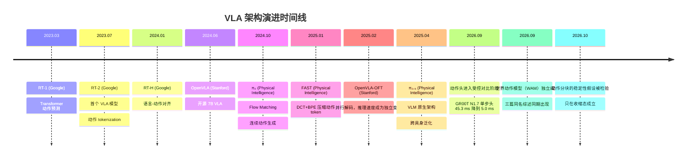
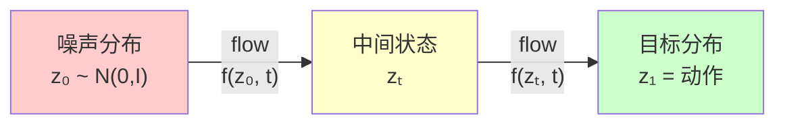
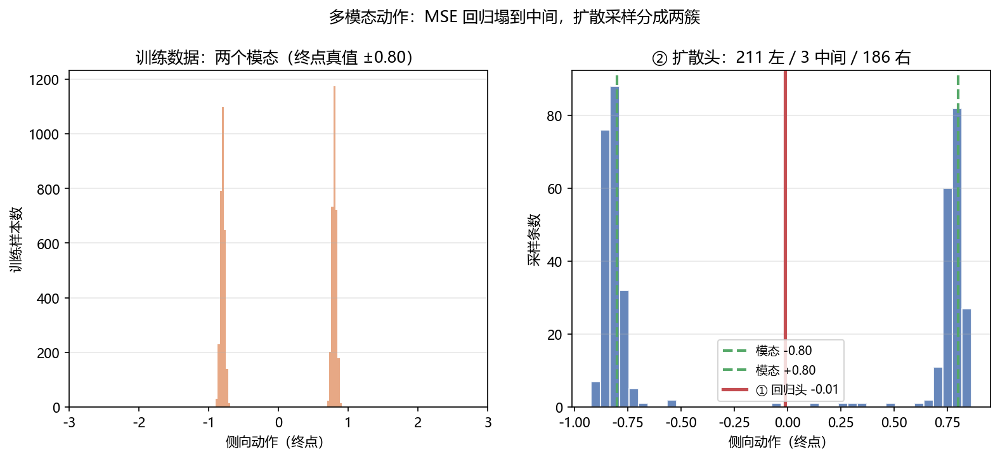

# VLA 架构演进：从 RT-2 到 2026 年

> **预计阅读：22 分钟 | 前置知识：Transformer 基础、视觉语言模型（VLM）概念、机器人学基础**
>
> 这是一篇路线图。RT-2 到 π₀.₅ 这一段讲透，2025 年之后只给代际划分与指针 —— 06–10 五篇各自展开其中一条线。

---

## 1. 什么是 VLA？

Vision-Language-Action（VLA）模型是一类将 **视觉感知**、**语言理解** 和 **动作生成** 统一到单一神经网络中的端到端模型。与传统的"感知-规划-控制"分层流水线不同，VLA 模型直接从原始视觉输入和语言指令映射到机器人动作，代表了具身智能（Embodied AI）领域的重要范式转变。

```
传统流水线：  感知模块 → 地图/状态估计 → 规划器 → 控制器 → 执行
VLA 范式：  (图像 + 语言指令) → VLA 模型 → 动作序列
```

VLA 的核心思想源于一个关键观察：大规模视觉语言模型（如 PaLI、LLaVA）已经学会了丰富的视觉语义理解能力，而这些能力可以被"扩展"到动作空间——通过将动作编码为离散 token 或连续向量，使语言模型的序列生成能力直接服务于机器人控制。

---

## 2. VLA 发展时间线


```mermaid
timeline
    title VLA 架构演进时间线
    2023.03 : RT-1 (Google)
              : Transformer 动作预测
    2023.07 : RT-2 (Google)
              : 首个 VLA 模型
              : 动作 tokenization
    2024.01 : RT-H (Google)
              : 语言-动作对齐
    2024.06 : OpenVLA (Stanford)
              : 开源 7B VLA
    2024.10 : π₀ (Physical Intelligence)
              : Flow Matching
              : 连续动作生成
    2025.01 : FAST (Physical Intelligence)
              : DCT+BPE 压缩动作 token
    2025.02 : OpenVLA-OFT (Stanford)
              : 并行解码，推理速度成为独立变量
    2025.04 : π₀.₅ (Physical Intelligence)
              : VLM 原生架构
              : 跨具身泛化
    2026.09 : 动作头进入受控对比阶段
              : GR00T N1.7 单步头 45.3 ms 降到 5.0 ms
    2026.09 : 世界动作模型（WAM）独立成族
              : 三篇同名综述同期出现
    2026.10 : 动作分块的稳定性假设被检验
              : 只在收缩态成立
```

上表到 2025.04 是**架构层面**的代际更替（骨干、动作表示、泛化范围）。2026 年的三条是**事件**，不再是一次架构替换：原来附属于架构的问题各自长成了独立的研究对象，所以这一节只标出它们的时点，方向本身展开在 06–10 五篇。

---

## 3. RT-2：VLA 的开山之作（Google, 2023）

### 3.1 背景与动机

Google DeepMind 在 2023 年发表的 RT-2（Robotic Transformer 2）是第一个被明确定义为 VLA 的模型。其核心动机基于一个观察：互联网规模预训练的视觉语言模型（如 PaLI-X、PaLM-E）已经获得了强大的语义推理能力，包括物体识别、空间关系理解、常识推理等。RT-2 的目标是将这些能力迁移到机器人动作生成中。

### 3.2 架构设计

RT-2 的架构建立在视觉语言模型（VLM）之上，关键创新在于 **动作 tokenization**——将机器人动作离散化为文本 token，使得动作生成可以复用语言模型的下一个 token 预测范式。

```
RT-2 架构示意：

输入: [机器人图像] + [语言指令: "把红色方块放到蓝色盘子上"]
         |                    |
    [视觉编码器]         [文本 Tokenizer]
    (ViT / SigLIP)           |
         |                    |
         +--------+-----------+
                  |
           [VLM Backbone]
        (PaLI-X / PaLM-E)
         Transformer Decoder
                  |
           [动作 Token 生成]
        "1 128 91 241 5 101"
         (离散化后的动作序列)
                  |
           [动作 Detokenization]
        → (Δx, Δy, Δz, Δroll, Δpitch, Δyaw, gripper)
```

### 3.3 动作 Tokenization 方案

RT-2 的核心创新在于将连续的机器人动作空间离散化为 256 个 bin，每个维度用一个 token 表示。对于一个 7 自由度的机械臂（6 DoF + 1 夹爪），动作被编码为 7 个 token：

| 动作维度 | Token 范围 | 量化方式 |
|---------|-----------|---------|
| Δx (位置) | 0-255 | 均匀量化到 [-1, 1] |
| Δy (位置) | 0-255 | 均匀量化到 [-1, 1] |
| Δz (位置) | 0-255 | 均匀量化到 [-1, 1] |
| Δroll (姿态) | 0-255 | 均匀量化到 [-π, π] |
| Δpitch (姿态) | 0-255 | 均匀量化到 [-π, π] |
| Δyaw (姿态) | 0-255 | 均匀量化到 [-π, π] |
| gripper (夹爪) | 0-255 | 0=关, 255=开 |

这些 token 被追加到词汇表的末尾（在原始文本 token 之后），使得 VLM 的 Transformer decoder 可以像生成文本一样生成动作。

### 3.4 Co-Fine-Tuning 策略

RT-2 的联合微调策略是：在机器人操控数据和原始互联网视觉语言数据上同时训练。这确保了模型在学习动作生成的同时，保持了从预训练中获得的语义理解能力。

### 3.5 涌现能力

RT-2 展示了一个令人兴奋的现象：模型展现出了训练数据中从未出现过的 **涌现推理能力**，例如：

- 理解抽象概念："把物体移到最大的物体旁边"
- 语义推理："捡起已灭绝的动物"（模型选择恐龙玩具）
- 数学推理："移动到 3+1 的位置"（移动到第 4 个位置）

这些能力直接继承自底层 VLM 的推理能力，验证了 VLA 范式的可行性。

### 3.6 局限性

- **推理速度慢**：基于大型 VLM（PaLI-X 为 55B 参数），推理频率仅约 1-3 Hz，难以满足实时控制需求
- **动作精度受限**：离散化导致动作精度上限受限于 bin 数量
- **仅限桌面操控**：实验仅在固定机械臂上验证，未涉及移动机器人或无人机

---

## 4. OpenVLA：开源 VLA 的里程碑（Stanford, 2024）

### 4.1 设计理念

OpenVLA 由 Stanford 团队于 2024 年发表，是第一个完全开源的大规模 VLA 模型。其核心设计理念是：VLA 不应该被少数拥有大规模计算资源的团队垄断，而应该成为可被广泛复用和改进的基础设施。

### 4.2 架构

OpenVLA 基于 **7B 参数** 的 Prismatic VLM 架构，结合了：

- **视觉编码器**：SigLIP（用于语义理解）+ DINOv2（用于空间特征）
- **语言模型骨干**：Llama 2 7B
- **动作头**：离散化 token 输出（与 RT-2 类似，256 bins）

```
OpenVLA 架构：

[RGB 图像]
    |
    +--→ SigLIP (语义特征) --+
    |                         |
    +--→ DINOv2 (空间特征) ---+--→ [特征融合层]
                                   |
[语言指令] --→ [Tokenizer] -------+--→ [Llama 2 7B Decoder]
                                           |
                                    [动作 Token 输出]
                                    (256-bin 离散化)
```

### 4.3 开源贡献

OpenVLA 的开源贡献体现在多个层面：

| 贡献维度 | 内容 |
|---------|------|
| 模型权重 | 7B 参数完整权重公开 |
| 训练数据 | Open X-Embodiment 数据集子集 |
| 训练代码 | 完整的训练流水线 |
| 评测基准 | 标准化的评测协议 |
| 微调指南 | 针对新机器人的微调教程 |

### 4.4 关键实验结果

OpenVLA 论文自报的结论（arXiv:2406.09246 摘要）：

- 在 **29 个任务、多种机器人形态**上，绝对任务成功率比闭源模型 **RT-2-X (55B) 高 16.5%**，而参数量少 7 倍
- 比从头训练的模仿学习强基线 **Diffusion Policy 高 20.4%**
- 可在**消费级 GPU 上用 LoRA 微调**，并可经量化加速服务、下游成功率不降

> **勘误（2026-10）**：本节早先有一张「SIMPLER 均分：RT-2-X 72.6% / OpenVLA 73.2% / Octo 56.3%」的表。**这张表是编的**——OpenVLA 论文（2406.09246）里没有 SIMPLER 相关表格，而 SIMPLER 原论文（2405.05941）**一次都没有提到 OpenVLA**，也没有这三个数字。已整表删除，改为论文摘要里可核的结论。
>
> 顺带记一条教训：三个数都"像那么回事"（OpenVLA 略高于 RT-2-X、Octo 明显低），这正是编造数字最难被发现的地方——它们符合读者对结论的预期。**核对时必须回原文，不能靠合理性判断。**

### 4.5 微调与适配

OpenVLA 提供了高效的微调方案，用户可以在单张消费级 GPU（如 RTX 4090）上对模型进行 LoRA 微调，使其适应新的机器人平台和任务。这种可及性大大降低了 VLA 技术的使用门槛。

### 4.6 对无人机领域的启示

OpenVLA 的开源特性使其成为无人机 VLA 研究的重要基础模型。后续的 UAV-Flow 等工作直接基于 OpenVLA 进行无人机适配，证明了开源 VLA 作为通用基础模型的价值。

---

## 5. π₀：连续动作生成的新范式（Physical Intelligence, 2024）

### 5.1 从离散到连续

RT-2 和 OpenVLA 的动作 tokenization 方案存在固有局限：离散化不可避免地引入量化误差，且对于高精度操控任务（如灵巧手操作），256 个 bin 可能不够精细。π₀ 由 Physical Intelligence 公司于 2024 年提出，采用 **Flow Matching**（流匹配）技术，直接在连续动作空间中生成动作。

### 5.2 Flow Matching 基础

Flow Matching 是一种生成建模方法，可以理解为一种更高效的扩散模型（Diffusion Model）替代方案。其核心思想是学习一个向量场，将简单的先验分布（如高斯噪声）逐步变换为目标动作分布。


```mermaid
graph LR
    A["噪声分布<br/>z₀ ~ N(0,I)"] -->|"flow<br/>f(z₀, t)"| B["中间状态<br/>zₜ"]
    B -->|"flow<br/>f(zₜ, t)"| C["目标分布<br/>z₁ = 动作"]
    
    style A fill:#ffcccc
    style B fill:#ffffcc
    style C fill:#ccffcc
```

与扩散模型相比，Flow Matching 的优势在于：
- 训练更稳定（直接回归向量场，而非噪声）
- 采样更高效（通常只需 10-20 步，而扩散模型需要 50-100 步）
- 生成质量相当或更好

### 5.3 π₀ 架构

π₀ 的架构由以下部分组成：

```
π₀ 架构：

[RGB 图像 × N] --→ [视觉编码器] --→ 视觉 tokens
                                          |
[语言指令] ------→ [Tokenizer] ----------+--→ [VLM Backbone]
                                          |      (预训练 VLM)
[当前状态] ------→ [状态编码器] ----------+      (PaliGemma)
                                          |
                                          ↓
                                    [Flow Matching Head]
                                          |
                                    [动作 chunk 生成]
                                    (连续值, 长度 H)
```

关键设计选择：
- **动作 chunk**：一次生成未来 H 步的动作序列（通常 H=16-50），而非逐步生成
- **条件生成**：Flow Matching 过程以 VLM 的特征表示为条件
- **去噪步数**：推理时通常使用 10 步去噪

> **口径（2026-10）**：VLM 骨干是 **PaliGemma**。π₀ 论文原句是 *"The VLM backbone weights are initialized from PaliGemma"*。本仓库早先在架构图与对比表里写成「PaLI-X」或「定制 VLM」——PaLI-X 是 **RT-2** 的骨干，属张冠李戴，已改。

### 5.4 训练流程

π₀ 的训练分为两个阶段：

1. **预训练阶段**：在大规模机器人数据集（Open X-Embodiment 等）上训练 Flow Matching 头，同时保持 VLM backbone 的权重（或仅微调部分层）
2. **后训练阶段**：在特定机器人平台和任务上进行精细微调

### 5.5 性能表现

π₀ 在多个灵巧操控任务上展示了优越性能，特别是在需要精细接触操作的任务（如折叠衣物、组装零件）上，相比离散化 VLA 有明显优势。

---

## 6. π₀.₅：迈向通用具身基础模型（Physical Intelligence, 2025）

### 6.1 设计哲学的转变

π₀.₅ 代表了 VLA 架构设计哲学的一次重大转变：不再是在 VLM 之上"附加"动作头，而是从一开始就在 VLM 的架构设计中融入动作生成能力。这意味着动作不再是一种"外挂"能力，而是模型的原生能力。

### 6.2 核心创新

| 创新点 | π₀ | π₀.₅ |
|--------|-----|-------|
| 架构范式 | VLM + 动作头 | VLM 上接动作专家，兼做高层子任务预测 |
| 动作表示 | Flow Matching（连续） | Flow Matching（连续）+ 离散 token 预测子任务 |
| 跨具身能力 | 有限 | 强（统一架构） |
| 语言理解 | 通过 VLM | 深度融合 |
| 训练范式 | 两阶段 | 端到端 |

> **勘误（2026-10）**：本表 π₀.₅ 的「动作表示：统一 token 空间」是错的。π₀.₅（arXiv:2504.16054）走的是 **flow matching 连续动作 + 离散 token 混合**（用离散 token 预测高层子任务、再用连续动作专家执行），不是把动作统一到 token 空间里。已改。

### 6.3 跨具身泛化

π₀.₅ 的一个重要目标是实现 **跨具身泛化**（Cross-Embodiment Generalization）：同一个模型可以控制不同形态的机器人（机械臂、灵巧手、移动机器人等），而无需针对每个平台重新训练。这通过统一的动作空间表示和大规模多平台数据训练实现。

### 6.4 与 UAV 的潜在关联

π₀.₅ 的跨具身泛化能力使其成为无人机 VLA 的潜在基础模型。UAV-TrackVLA 等工作已经开始探索将 π₀.₅ 架构应用于无人机场景，利用它的视觉理解和连续动作生成能力。

---

## 7. 架构演进对比总结

### 7.1 全面对比表

| 特性 | RT-2 | OpenVLA | π₀ | π₀.₅ |
|------|------|---------|-----|------|
| 发表时间 | 2023.07 | 2024.06 | 2024.10 | 2025.04 |
| 发表机构 | Google DeepMind | Stanford | Physical Intelligence | Physical Intelligence |
| 参数量 | 55B | 7B | 未公开 | 未公开 |
| VLM 基座 | PaLI-X / PaLM-E | Llama 2 + SigLIP/DINOv2 | PaliGemma | PaliGemma 系 |
| 动作表示 | 离散 token (256 bin) | 离散 token (256 bin) | Flow Matching (连续) | Flow Matching + 离散子任务 token |
| 推理频率 | ~1.5 Hz | ~6 Hz（单张 RTX 4090） | ~10-20 Hz | ~20-50 Hz |
| 开源 | 否 | 是 | 是（openpi） | 是（openpi） |
| 跨具身泛化 | 有限 | 中等 | 中等 | 强 |
| 涌现推理 | 强 | 中等 | 中等 | 强 |
| 动作精度 | 中 | 中 | 高 | 高 |

### 7.2 演进趋势


```mermaid
graph TB
    subgraph "趋势一：动作表示精细化"
        A1["RT-2: 256-bin 离散"] --> A2["OpenVLA: 256-bin 离散"]
        A2 --> A3["π₀: Flow Matching 连续"]
        A3 --> A4["π₀.₅: 统一表示"]
    end
    
    subgraph "趋势二：架构原生化"
        B1["RT-2: VLM + 动作头"] --> B2["OpenVLA: 优化的 VLM + 动作头"]
        B2 --> B3["π₀: VLM + Flow Head"]
        B3 --> B4["π₀.₅: 原生动作 VLM"]
    end
    
    subgraph "趋势三：泛化能力增强"
        C1["RT-2: 单平台"] --> C2["OpenVLA: 可微调多平台"]
        C2 --> C3["π₀: 多平台预训练"]
        C3 --> C4["π₀.₅: 跨具身泛化"]
    end
```

**趋势一：从离散到连续的动作表示。** 早期工作（RT-2, OpenVLA）将动作视为离散 token，虽然复用了语言模型的生成范式，但量化误差不可避免。π₀ 引入 Flow Matching 实现连续动作生成，π₀.₅ 进一步统一了文本和动作的表示空间。

**趋势二：从"附加"到"原生"的架构设计。** VLA 从最初在 VLM 上"嫁接"动作头，逐渐演变为将动作生成作为模型的核心能力进行设计。

**趋势三：从单平台到跨具身的泛化能力。** 现代 VLA 越来越强调对不同机器人形态和任务的泛化能力，这是实现"通用具身基础模型"的关键。

### 7.3 2026 年：五个方向各自独立

上表止于 π₀.₅，因为 2025 年之后这条线不再产出"下一代架构"。原来挂在架构下的五个问题各自长成了独立的研究对象，每一条都有自己的评价口径和自己的失败模式。按它们问的问题分：

| 方向 | 问的问题 | 展开在 |
|------|---------|--------|
| 动作接口 | 一块提交多长、怎么表示，才能真正决定闭环精度的上限？ | [06-动作头与动作分块](./06-动作头与动作分块.md) |
| 数据与预训练 | 数据从哪来、跨具身怎么共享，在飞行数据稀缺时怎么补？ | [07-数据、预训练与跨具身](./07-数据、预训练与跨具身.md) |
| 后训练 | 专家数据之外，怎么用奖励继续改进，且不撞上安全约束？ | [08-强化学习后训练与自我改进](./08-强化学习后训练与自我改进.md) |
| 评测 | 报哪个数、在多小的样本上，结论才站得住？ | [09-评测基准与报告口径](./09-评测基准与报告口径.md) |
| 世界模型 | 预测未来的能力怎么接进策略，接进去又能买到什么？ | [10-世界模型增强VLA](./10-世界模型增强VLA.md) |

划分依据是**它们各自在什么轴上做消融**。06 的自变量是提交长度和动作表示的连续性，07 是数据来源与具身混合比例，08 是奖励信号与在线样本预算，09 是评测口径与样本量，10 是想象步长与回路位置。五个轴互不包含，所以这五篇不是按时间切的，是按自变量切的。

**这对无人机尤其要紧。** 上表里四个地面操作模型的经验不能直接搬到空中，而搬迁时会撞到的是**不同的那一根轴**：06 撞的是动作空间的维度与频率（4 维、50–200 Hz 对操作臂的 7 维、约 10 Hz），07 撞的是数据量（空中比地面少一到两个数量级），08 撞的是 reset 不免费与安全约束不能折进奖励，09 撞的是真机回合太贵导致样本量不够。每篇的第 9 节（或对应节）写这一条。

---

## 8. VLA 与 UAV：机遇与挑战

VLA 模型为无人机领域带来了新的可能性，但也面临独特挑战：

### 8.1 机遇

- **自然语言交互**：用户可以通过自然语言指令控制无人机，降低操控门槛
- **语义理解**：VLA 可以理解高层语义任务（如"寻找走失的老人"），而非仅执行几何路径
- **泛化能力**：预训练 VLA 的视觉语义理解能力可以迁移到新的飞行场景
- **端到端优化**：避免分层流水线中的误差累积

### 8.2 挑战

| 挑战 | 说明 | 当前进展 |
|------|------|---------|
| 实时性 | 飞行控制需要 50-200 Hz，VLA 推理通常 1-20 Hz | UAV-TrackVLA: 时间压缩技术 |
| 安全性 | 飞行碰撞后果严重，不能仅依赖学习 | VLA-AN: 几何安全校正 |
| 3D 空间理解 | 无人机在三维空间运动，传统 VLA 主要面向 2D 操作 | 4D 动作输出（CognitiveDrone） |
| 数据稀缺 | 无人机操控数据远少于桌面操控 | 仿真数据 + 迁移学习 |
| 机载算力 | 无人机载计算资源有限 | 边缘-云协同（CoDrone） |

---

## 9. 关键论文

- **[CoRL'23] RT-2** — *RT-2: Vision-Language-Action Models Transfer Web Knowledge to Robotic Control*  
  [](https://arxiv.org/abs/2307.15818)
  首个 VLA，动作 tokenization

- **[arXiv'24.06] OpenVLA** — *OpenVLA: An Open-Source Vision-Language-Action Model*  
  [](https://arxiv.org/abs/2406.09246)
  开源 7B VLA

- **[arXiv'24.10] π₀** — *π₀: A Vision-Language-Action Flow Model for General Robot Control*  
  [](https://arxiv.org/abs/2410.24164)
  Flow Matching 连续动作

- **[arXiv'25.04] π₀.₅** — *π₀.₅: a Vision-Language-Action Model with Open-World Generalization*  
  [](https://arxiv.org/abs/2504.16054)
  原生动作 VLM

- **[RSS'23] RT-1** — *RT-1: Robotics Transformer for Real-World Control*  
  [](https://arxiv.org/abs/2212.06817)
  Transformer 动作预测基础

---

## 10. 动手验证：动作头为什么必须建模"分布"？

第 5 节讲 π₀ 用 Flow Matching 生成连续动作。这一节把**为什么不能直接用 MSE 回归**量出来：同一个观测下"左绕"和"右绕"都合理时，回归头会输出两者的平均 —— 而那个平均动作两条路都不像。

### 10.1 两个动作头

```python
import torch, torch.nn as nn, torch.nn.functional as F, math

H, D, NS = 8, 4, 100          # 动作块 8 步 × 4 维；扩散 100 步

def cosine_schedule(ns, s=0.008):
    """余弦噪声调度。100 步线性 beta 在 t=99 时 alpha_bar 仍有 0.36，
    前向过程根本没到纯噪声，而采样却从 N(0,I) 起步，两者不一致 ——
    去噪器会输出弥散到 ±8 的垃圾。换余弦调度后 alpha_bar_99 ≈ 2e-4。"""
    f = lambda u: math.cos(((u / ns) + s) / (1 + s) * math.pi / 2) ** 2
    ab = torch.tensor([f(t) / f(0) for t in range(ns)]).clamp(1e-5, 0.9999)
    alphas = (ab / torch.cat([torch.ones(1), ab[:-1]])).clamp(1e-8, 0.9999)
    return alphas, ab, 1 - alphas

class RegHead(nn.Module):
    """① MSE 回归：直接映射到一整块动作。"""
    def __init__(self, cond_dim=12, h=128):
        super().__init__()
        self.net = nn.Sequential(nn.Linear(cond_dim, h), nn.SiLU(),
                                 nn.Linear(h, h), nn.SiLU(), nn.Linear(h, H * D))
    def forward(self, cond): return self.net(cond).view(-1, H, D)

class Denoiser(nn.Module):
    """② 预测噪声 eps_theta(x_t, t, cond)，标准 DDPM 目标。"""
    def __init__(self, cond_dim=12, h=256):
        super().__init__()
        self.emb = SinusoidalEmb(64)          # 时间步正弦编码，别直接喂标量 t
        self.net = nn.Sequential(nn.Linear(H * D + cond_dim + 64, h), nn.SiLU(),
                                 nn.Linear(h, h), nn.SiLU(), nn.Linear(h, H * D))
    def forward(self, x, t, cond):
        return self.net(torch.cat([x.flatten(1), cond, self.emb(t)], -1)).view(-1, H, D)

# DDPM 祖先采样：从纯噪声逐步去噪
x = torch.randn(n, H, D)
for t in reversed(range(NS)):
    eps = den(x, torch.full((n,), t), cond)
    x = (x - (1 - alphas[t]) / (1 - ab[t]).sqrt() * eps) / alphas[t].sqrt()
    if t > 0:
        x = x + (betas[t] * (1 - ab[t - 1]) / (1 - ab[t])).sqrt() * torch.randn_like(x)
```

数据是一个 8 步动作块，侧向通道只有两种走法，终点真值 ±0.80。

### 10.2 本地实测结果

```text
① 回归头预测的侧向轨迹: [-0.01, -0.01, -0.01, -0.01, -0.01, -0.01, -0.01, -0.02]
   -> 全部落在 -0.01，两个模态都不像 —— 这就是模态平均

  step        扩散损失
  2000      0.04902
  4000      0.04368
  6000      0.04558
  8000      0.05571

② 扩散头采样 400 条：
   均值 -0.07  标准差 0.80  范围 [-0.9, 0.9]
   落在两个模态附近（±0.80±0.3）的比例：98.5%
   左绕 211 条 | 中间（两不像）3 条 | 右绕 186 条
   -> 中间只有 3 条，说明扩散头几乎不做模态平均
```

对照很干净。回归头输出的是**一个确定值** `-0.01`，正好卡在两个模态正中间；扩散头采样出 400 个**互不相同**的动作，其中 397 个落在一个模态附近，只有 3 个掉在中间。

> **一个容易骗自己的指标**：如果按"采样值 `<0` 算左、`>0` 算右"去统计，**任何**连续分布都会得到接近 50/50 的"两簇"（中位数分割的必然结果）。真正能说明模态是否分开的，是**落在中间（两不像）的比例** —— 这里是 3/400。第一版 demo 就栽在这个指标上：噪声调度写错导致去噪器根本没学会，输出弥散在 ±8，而"93/107"的分割看上去依然漂亮。



### 10.3 【待验证】接入 PX4 SITL：动作头要跑在控制频率上

> **未在本地验证**：本节代码需要 Ubuntu + PX4 + MicroXRCEAgent 才能运行，本仓库的验证环境是 Windows，没有跑过。**字段名请以你安装的 `px4_msgs` 版本为准。**

扩散头每出一个动作块要跑 `NS=100` 次去噪前向 —— 放进 50 Hz 的控制回路是实打实的开销。真机上有两条常用退路：**动作分块**（一次推理管 H 步）和**更少步数的采样器**（DDIM / DPM-Solver，20 步甚至 4 步）。这正是 π₀ 转向 Flow Matching 的动机之一。

```python
from rclpy.qos import QoSProfile, ReliabilityPolicy, DurabilityPolicy, HistoryPolicy
from px4_msgs.msg import OffboardControlMode, VehicleCommand, VehicleLocalPosition

def px4_qos(depth=1):
    """PX4 话题统一用 BEST_EFFORT + TRANSIENT_LOCAL，否则收不到数据。"""
    return QoSProfile(reliability=ReliabilityPolicy.BEST_EFFORT,
                      durability=DurabilityPolicy.TRANSIENT_LOCAL,
                      history=HistoryPolicy.KEEP_LAST, depth=depth)

class ChunkedPolicyNode(Node):
    """动作分块：每 H 步推理一次，中间各控制周期只做插值下发。"""
    def __init__(self, chunk=H):
        super().__init__('chunked_policy')
        self.chunk, self.buf, self.k = chunk, None, 0
        self.create_subscription(VehicleLocalPosition, '/fmu/out/vehicle_local_position',
                                 self.on_pos, px4_qos())

    def on_pos(self, m):
        if self.buf is None or self.k >= self.chunk:      # 动作块用完了才再推理一次
            with torch.no_grad():
                self.buf = sample_action_chunk(self.pol, build_obs(m))   # 一次 100 步去噪
            self.k = 0
        thrust, wx, wy, wz = self.buf[self.k].tolist()
        self.k += 1
        # 注意：推理耗时若超过控制周期 dt，这里必须对齐时间戳或降级到上一块，
        # 否则会发出时间上错位的 setpoint —— 表现为高频抖动
        self.pub_rates.publish(to_rates_setpoint((thrust + 1) / 2, wx, wy, wz))
```

另外两点：**坐标系**（PX4 用 NED/FRD，训练用 ENU/对角约定，必须变换）、**降级链路**（推理超时或输出越界时切回位置保持，别让扩散采样单独决定生死）。

### 10.4 运行完整脚本

```bash
py -3.9 code/c_action_heads.py     # 约 60 秒，CPU 即可
```

完整脚本（含双模态数据构造、两个动作头、DDPM 采样、出图）：[`code/c_action_heads.py`](../../code/c_action_heads.py)

---

## 11. 延伸阅读

- [02-无人机VLA模型](./02-无人机VLA模型.md) — 无人机专用 VLA：VLA-AN、CognitiveDrone、UAV-TrackVLA
- [03-语言条件飞行控制](./03-语言条件飞行控制.md) — 语言指令怎么落成飞行控制
- [04-基础模型辅助规划](./04-基础模型辅助规划.md) — LLM/VLM 在无人机规划中的其他应用方式
- [05-机载部署与优化](./05-机载部署与优化.md) — 把上述模型放上机载计算平台
- [06-动作头与动作分块](./06-动作头与动作分块.md) — §7.3 表里「动作接口」一条的展开
- [07-数据、预训练与跨具身](./07-数据、预训练与跨具身.md) — §7.3 表里「数据与预训练」一条的展开
- [08-强化学习后训练与自我改进](./08-强化学习后训练与自我改进.md) — §7.3 表里「后训练」一条的展开
- [09-评测基准与报告口径](./09-评测基准与报告口径.md) — §7.3 表里「评测」一条的展开
- [10-世界模型增强VLA](./10-世界模型增强VLA.md) — §7.3 表里「世界模型」一条的展开
- [02-世界模型专题](../02-世界模型专题/01-世界模型发展史.md) — 世界模型这一侧的完整脉络，回答 VLA 的环境先验从哪来

---

## 12. 思考题

**题目 1：动作 Tokenization vs. Flow Matching**

RT-2 采用 256-bin 离散化将动作编码为 token，而 π₀ 采用 Flow Matching 在连续空间生成动作。请分析这两种方案各自的优缺点，并讨论在无人机控制场景下哪种方案更合适。

<details>
<summary>参考答案</summary>

**离散 Tokenization (RT-2/OpenVLA)：**
- 优点：复用语言模型的生成范式，训练稳定，可利用大规模语言模型预训练的知识
- 缺点：量化误差不可避免（256 bins 对应精度约 0.4%），动作维度增加时 token 序列变长导致推理变慢
- 对无人机：精度可能不足，尤其是姿态控制需要高精度

**Flow Matching (π₀)：**
- 优点：无量化误差，可生成任意精度的连续动作，一次生成整个动作 chunk 更高效
- 缺点：需要额外的去噪步骤，训练更复杂
- 对无人机：更适合需要高精度和高频控制的飞行场景

**结论：** 对于无人机控制，Flow Matching 方案更有优势，因为飞行控制对动作精度和实时性要求更高。但离散方案在语言条件任务中可能更有优势，因为可以更好地利用语言模型的推理能力。UAV-TrackVLA 等工作已经在探索将 π₀.₅ 的连续动作生成能力应用于无人机。
</details>

---

**题目 2：VLA 的涌现能力**

RT-2 展示了"把物体移到最大的物体旁边"等涌现推理能力。请思考：(1) 这些能力从何而来？(2) 在无人机场景中，类似的涌现能力可能表现为哪些具体行为？

<details>
<summary>参考答案</summary>

**(1) 涌现能力的来源：**
这些能力并非来自机器人操控数据（训练数据中没有"最大物体"的标注），而是来自底层 VLM 在互联网规模数据上学到的语义推理能力。通过 Co-Fine-Tuning 策略，这些能力被保留并迁移到了动作生成空间。本质上，VLA 继承了大语言模型的"世界知识"。

**(2) 无人机场景中的可能涌现行为：**
- 语义导航："飞到人群最密集的地方"（需要理解"密集"的概念）
- 条件搜索："找到开着门的房间"（需要理解"门"和"开着"的状态）
- 安全推理："在风速最大时降低飞行高度"（需要推理天气与飞行安全的关系）
- 隐含约束："在不惊扰动物的前提下接近"（需要理解"惊扰"的行为含义）
</details>

---

**题目 3：π₀.₅ 的"原生动作 VLM"与传统 VLA 的区别**

π₀.₅ 声称采用了"原生动作 VLM"架构，与 RT-2/OpenVLA 的"VLM + 动作头"范式有何本质区别？这种架构转变对 VLA 的能力边界有何影响？

<details>
<summary>参考答案</summary>

**本质区别：**
- **VLM + 动作头**：VLM 的主干网络是为文本生成设计的，动作头是一个"外挂"模块，VLM 内部的表征并不专门为动作生成优化。动作生成依赖于 VLM 输出特征到动作空间的映射质量。
- **原生动作 VLM**：动作生成从一开始就是模型设计目标的一部分。模型的内部表征同时编码语言语义和动作语义，文本和动作在同一个表征空间中处理。

**对能力边界的影响：**
1. **更深的语言-动作对齐**：语言指令可以更直接地影响动作生成，减少信息损失
2. **更好的跨具身泛化**：统一的表征空间使得不同形态机器人的动作可以共享语义
3. **更强的组合能力**：可以在同一推理链中混合语言推理和动作生成
4. **潜在局限**：统一架构可能在纯语言任务上略有下降（能力稀释）
</details>

---

**题目 4：为什么 2026 年这条线上不再产出"下一代架构"？**

3 到 6 节按 RT-2 → OpenVLA → π₀ → π₀.₅ 一路排下来，每一代换的都是骨干或动作表示。§7.3 说 2025 年之后这个排法停了，问题改按"在什么轴上做消融"来分。请解释这个停顿为什么不是进展变慢，以及它对选型意味着什么。

<details>
<summary>参考答案</summary>

**因为可换的架构部件被换完了。** 这条线上的代际更替靠的是三个可换的部件：骨干（PaLI-X 到 PaliGemma 系）、动作表示（256-bin 离散到 Flow Matching 连续，再到"连续 + 离散子任务 token"的混合）、以及动作头的挂载方式（外挂到原生）。到 π₀.₅ 三个都动过一轮，再往下换已经没有"下一个明显更好的部件"可换 —— 剩下的改进量分散在一批互不包含的具体问题上。

**停顿的标志是消融轴从一个变成五个。** RT-2 到 π₀.₅ 这四篇里，代际比较的方式是"整篇对比整篇"，因为每一代换的是同一个部件。2026 年的工作不再这样比：06 固定住骨干去扫提交长度，07 固定住架构去扫数据来源，08 固定住数据去扫奖励信号，09 固定住模型去扫评测口径，10 固定住策略去扫想象步长。**能被写成"某个轴上的受控实验"，说明问题已经被切到可测量的粒度了** —— 这是成熟而不是停滞的标志。

**对选型意味着三件事。** 一是不能再用"代际"做决策：不存在"π₀.₅ 之后的下一代"，只有"你手上这根轴缺什么"。二是每一根轴的收益不能相加：10 篇量出的想象数据收益，和 08 篇量出的 RL 收益，是在不同装置上分别测的，叠加起来是多少没有依据。三是**轴的优先级取决于任务**：空中数据少，07 轴的权重就高；真机回合贵，09 轴的权重就高 —— 这也是 §7.3 后半段把四个地面结论逐条搬到空中去对的原因。

</details>

---

> **下一节**：[02-无人机VLA模型](./02-无人机VLA模型.md) — 深入了解面向无人机的专用 VLA 模型设计
