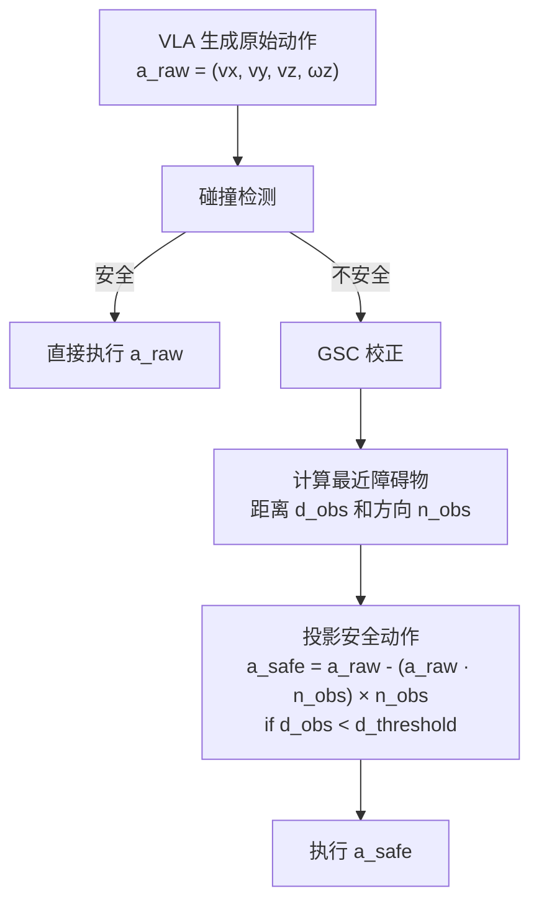
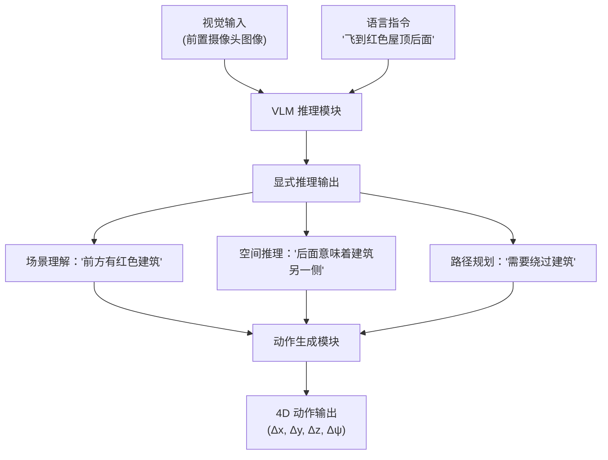
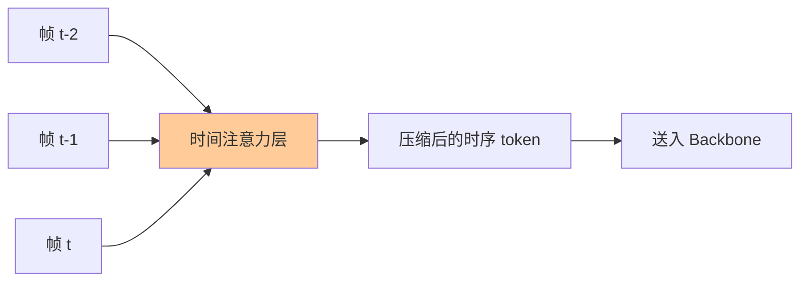
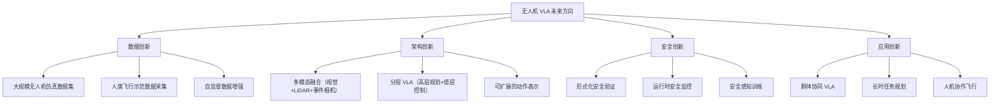

# 无人机 VLA 模型：专用架构与训练方法

> **预计阅读：20 分钟 | 前置知识：VLA 架构基础、无人机动力学基础、模仿学习概念**

---

## 1. 引言：为什么需要无人机专用 VLA？

通用 VLA 模型（如 RT-2、OpenVLA）主要面向桌面机械臂操控任务，其设计假设和训练数据与无人机场景存在显著差异：

| 差异维度 | 桌面操控（通用 VLA） | 无人机场景 |
|---------|---------------------|-----------|
| 动作空间 | 6-7 DoF（位置+姿态+夹爪） | 4 DoF（油门+偏航+俯仰+横滚）或 6 DoF |
| 运动维度 | 主要是 2D 平面操作 | 完全 3D 空间运动 |
| 安全约束 | 碰撞可恢复 | 碰撞可能导致坠毁 |
| 控制频率 | 5-20 Hz 通常足够 | 需要 50-200 Hz |
| 环境动态性 | 相对静态 | 风扰、动态障碍物 |
| 观察视角 | 固定/受限视角 | 自由视角，视觉流剧烈变化 |
| 状态估计 | 相对精确（机械臂编码器） | 可能有漂移（IMU+视觉里程计） |

因此，直接将通用 VLA 应用于无人机效果有限。近年来，研究者们开始设计无人机专用的 VLA 架构，本节将详细介绍三个代表性工作：VLA-AN、CognitiveDrone 和 UAV-TrackVLA。

---

## 2. VLA-AN：安全约束下的高效无人机 VLA

> **论文**：VLA-AN: Vision-Language-Action Model with Adaptive Safety Correction for UAV Navigation
> **来源**：arXiv:2512.15258, 2024
> **关键成果**：98.1% 任务成功率，8.3× 推理加速

### 2.1 核心问题

VLA-AN 试图解决 VLA 在无人机导航中的两个核心问题：

1. **安全性**：VLA 作为端到端模型缺乏显式的安全约束，生成的动作可能导致碰撞
2. **实时性**：大型 VLA 模型推理速度慢，无法满足飞行控制的实时性要求

### 2.2 三阶段训练策略

VLA-AN 提出了一种创新的三阶段训练策略：


**阶段一：视觉-语言对齐预训练**

在大规模图文数据集上训练模型的视觉-语言理解能力。这一阶段不涉及任何动作生成，目的是让模型学会：
- 理解自然语言指令的语义
- 建立视觉场景与语言描述之间的对应关系
- 获得对 3D 空间结构的基本理解

**阶段二：动作模仿学习（Behavioral Cloning）**

在无人机飞行轨迹数据集上进行行为克隆训练。模型学习从视觉观测和语言指令到无人机控制命令的映射。这一阶段使用标准的模仿学习损失：

```
L_BC = E[||a_predicted - a_expert||²]
```

**阶段三：安全增强微调**

这是 VLA-AN 最关键的创新。在第三阶段，模型不仅学习生成动作，还学习在生成动作后进行 **几何安全校正**（Geometric Safety Correction）。

### 2.3 几何安全校正（GSC）

几何安全校正是 VLA-AN 的核心安全机制。其基本思想是：VLA 模型生成的动作可能不安全，但可以通过几何约束进行后处理校正。



GSC 的数学形式化：

给定原始动作 `a_raw` 和最近障碍物的法向量 `n_obs`，安全校正后的动作为：

```
if d_obs < d_threshold:
    a_safe = a_raw - max(0, a_raw · n_obs) × n_obs
else:
    a_safe = a_raw
```

这个公式的直觉是：将原始动作中"指向障碍物"的分量移除，保留"平行于障碍物表面"的分量。

### 2.4 关键实验结果

| 指标 | VLA-AN | 无 GSC 的 VLA | 传统规划器 |
|------|--------|--------------|-----------|
| 任务成功率 | 98.1% | 72.3% | 95.6% |
| 碰撞率 | 1.2% | 18.7% | 3.1% |
| 推理延迟 | 12 ms | 100 ms | 5 ms |
| 泛化到新场景 | 好 | 中 | 差 |

VLA-AN 通过 GSC 机制将碰撞率从 18.7% 降低到 1.2%，同时通过模型优化实现了 8.3 倍的推理加速（从 100ms 降低到 12ms）。

### 2.5 对无人机 VLA 的启示

VLA-AN 的贡献在于证明了 VLA 模型可以通过轻量级的安全后处理机制获得安全保障，而无需完全放弃端到端学习的优势。这种"学习+安全校正"的混合范式为后续工作提供了重要参考。

---

## 3. CognitiveDrone：面向认知飞行的 VLA

> **论文**：CognitiveDrone: A Vision-Language-Action Model for UAV Autonomous Flight
> **来源**：arXiv:2503.01378, 2025
> **关键成果**：4D 动作输出，8000+ 飞行轨迹数据集，CognitiveDrone-R1 引入 VLM 推理

### 3.1 核心创新：4D 动作输出

与传统无人机控制使用 4 自由度（油门+偏航+俯仰+横滚）不同，CognitiveDrone 提出了 **4D 动作输出**，将动作空间定义为：

```
4D 动作空间：
  Δx: 前后位移（机体坐标系）
  Δy: 左右位移（机体坐标系）
  Δz: 上下位移（机体坐标系）
  Δψ: 偏航角变化
```

这种表示方式的优势在于：
- 直接输出位移而非速度，更符合高层语义指令（"向前移动 2 米"）
- 偏航角单独控制，支持"边飞边看"的行为
- 与 VLM 的空间推理能力更自然地对齐

### 3.2 大规模数据集构建

CognitiveDrone 团队构建了一个包含 **8000+ 条飞行轨迹** 的大规模数据集，覆盖多种飞行场景：

| 场景类别 | 轨迹数量 | 典型任务 |
|---------|---------|---------|
| 室内导航 | 2500+ | 穿越走廊、避开家具 |
| 室外飞行 | 2000+ | 跟踪目标、地形跟随 |
| 精准降落 | 1500+ | 降落到指定平台 |
| 编队飞行 | 1000+ | 保持队形、协同避障 |
| 紧急机动 | 1000+ | 紧急避障、失稳恢复 |

### 3.3 CognitiveDrone-R1：引入 VLM 推理

CognitiveDrone-R1 是该系列的增强版本，核心创新在于引入了显式的 VLM 推理步骤。与直接从视觉映射到动作不同，R1 版本在动作生成前增加了一个"思考"过程：



这种"先想后做"的范式借鉴了 LLM 领域的 Chain-of-Thought（思维链）思想，通过显式推理提高了复杂任务的完成率。

### 3.4 与 RT-2 涌现能力的对比

CognitiveDrone-R1 的显式推理能力与 RT-2 的涌现推理能力形成有趣对比：

| 维度 | RT-2 涌现推理 | CognitiveDrone-R1 显式推理 |
|------|-------------|--------------------------|
| 推理方式 | 隐式（模型内部） | 显式（可解释的推理链） |
| 可解释性 | 低（黑盒） | 高（可输出推理过程） |
| 推理速度 | 快（一次前向传播） | 慢（需要额外推理步骤） |
| 可靠性 | 中（依赖模型内部表征） | 高（可检查推理逻辑） |
| 适用场景 | 简单语义理解 | 复杂空间推理 |

---

## 4. UAV-TrackVLA：基于 π₀.₅ 的跟踪专用 VLA

> **论文**：UAV-TrackVLA: Vision-Language-Action Model for UAV Visual Tracking
> **来源**：arXiv:2604.02241, 2025/2026
> **关键成果**：基于 π₀.₅ 架构，时间压缩技术，双分支解码器

### 4.1 设计动机

UAV-TrackVLA 专注于一个具体而重要的任务：**视觉跟踪**（Visual Tracking）—— 无人机需要持续跟踪一个指定的目标物体或人。这个任务的独特挑战包括：

- **目标丢失与重识别**：目标可能暂时被遮挡或移出视野
- **尺度变化**：无人机与目标之间的距离变化导致目标在图像中的大小剧烈变化
- **外观变化**：视角变化导致目标外观显著不同
- **实时性要求**：跟踪需要持续、平滑的控制输出

### 4.2 基于 π₀.₅ 的架构

UAV-TrackVLA 直接基于 π₀.₅ 的"原生动作 VLM"架构进行扩展，主要改进包括：

```
UAV-TrackVLA 架构：

[连续视频帧] --→ [时间压缩模块] --→ 压缩后的时序特征
                                              |
[跟踪目标描述] --> [语言编码器] -------------+--→ [π₀.₅ Backbone]
                                              |
[当前状态] ------> [状态编码器] -------------+
                                              |
                                    [双分支解码器]
                                     /          \
                              [跟踪分支]    [导航分支]
                                   |              |
                              [目标位置预测]  [飞行控制指令]
                                   |              |
                                   +------+-------+
                                          |
                                    [动作融合]
                                          |
                                    [最终控制输出]
```

### 4.3 时间压缩模块

处理连续视频帧是 UAV-TrackVLA 的关键挑战之一。直接输入多帧图像会导致计算量爆炸。UAV-TrackVLA 设计了一个时间压缩模块：



该模块使用时间注意力机制（Temporal Attention）将连续 N 帧的信息压缩为一组时序 token，既保留了运动信息，又控制了计算量。具体而言：

- 输入：连续 N 帧（通常 N=4-8）的视觉特征
- 处理：可学习的时间注意力层，捕获帧间运动模式
- 输出：固定数量的时序 token（与单帧 token 数量相同）

### 4.4 双分支解码器

UAV-TrackVLA 的另一个创新是双分支解码器设计：

| 分支 | 功能 | 输出 |
|------|------|------|
| 跟踪分支 | 预测目标在当前帧中的位置和状态 | (x, y, w, h, confidence) |
| 导航分支 | 生成无人机的飞行控制指令 | (Δx, Δy, Δz, Δψ) |

两个分支共享 π₀.₅ backbone 的特征，但各自有独立的解码头。跟踪分支的输出作为导航分支的额外条件输入，使得飞行控制可以感知跟踪状态（如目标置信度低时降低飞行速度）。

### 4.5 跟踪-控制耦合

UAV-TrackVLA 实现了跟踪与控制的紧密耦合：

```
跟踪状态 → 控制策略调整：
  - 目标置信度高 + 距离适中 → 维持当前跟踪
  - 目标置信度高 + 距离过远 → 加速接近
  - 目标置信度高 + 距离过近 → 减速后退
  - 目标置信度低 → 降低速度，扩大搜索范围
  - 目标丢失 → 悬停，启动重识别
```

这种耦合使得无人机在面对目标丢失、遮挡等情况时能够采取合理的应对策略。

---

## 5. 三大模型全面对比

### 5.1 核心特性对比

| 特性 | VLA-AN | CognitiveDrone | UAV-TrackVLA |
|------|--------|---------------|--------------|
| 论文出处 | arXiv:2512.15258 | arXiv:2503.01378 | arXiv:2604.02241 |
| 核心任务 | 通用导航 | 认知飞行 | 视觉跟踪 |
| VLM 基座 | 通用 VLA | 定制 VLM | π₀.₅ |
| 动作空间 | 4D 速度 | 4D 位移 | 4D 控制 |
| 安全机制 | 几何安全校正 (GSC) | 无显式安全层 | 跟踪-控制耦合 |
| 推理范式 | 直接映射 | 显式推理 (R1) | 时序推理 |
| 数据规模 | 未公开 | 8000+ 轨迹 | 未公开 |
| 最高成功率 | 98.1% | 未报告具体数值 | 未报告具体数值 |
| 推理加速 | 8.3× | 无特殊优化 | 时间压缩 |

### 5.2 技术路线对比


### 5.3 适用场景分析

| 应用场景 | 最佳选择 | 原因 |
|---------|---------|------|
| 室内自主巡检 | VLA-AN | 安全性优先，室内环境障碍物密集 |
| 复杂任务执行 | CognitiveDrone-R1 | 需要语义理解和推理 |
| 目标跟踪任务 | UAV-TrackVLA | 专为跟踪设计，时序处理能力强 |
| 户外长距离飞行 | VLA-AN | 高效推理适合长时任务 |
| 人机交互任务 | CognitiveDrone | 语言理解能力强 |
| 动态环境导航 | UAV-TrackVLA | 时间压缩捕获运动信息 |

---

## 6. 无人机 VLA 的共性挑战与未来方向

### 6.1 当前共性挑战

**挑战一：数据瓶颈**

无人机飞行数据的采集成本远高于桌面操控：
- 仿真数据：物理引擎的真实性有限（风、湍流等难以精确模拟）
- 真实数据：飞行实验的风险和成本高
- 数据标注：飞行轨迹的标注需要精确的状态估计

**挑战二：sim-to-real gap**

仿真环境与真实环境之间的差异（sim-to-real gap）在无人机领域尤为严重：
- 视觉差异：光照、纹理、动态模糊
- 动力学差异：风扰、气动效应
- 传感器差异：相机噪声、IMU 漂移

**挑战三：安全保障**

无人机 VLA 的安全保障比桌面操控更加关键：
- 碰撞后果严重（坠机、伤人）
- 需要实时安全检查（不能增加过多延迟）
- 安全约束需要形式化验证

### 6.2 未来研究方向



---

## 7. 关键论文

| 论文 | 来源 | 关键贡献 | 链接 |
|------|------|---------|------|
| VLA-AN: Adaptive Safety Correction | arXiv:2512.15258 | GSC 安全校正，8.3× 加速 | arXiv:2512.15258 |
| CognitiveDrone | arXiv:2503.01378 | 4D 动作，8000+ 轨迹，R1 推理 | arXiv:2503.01378 |
| UAV-TrackVLA | arXiv:2604.02241 | π₀.₅ 基座，时间压缩，双分支 | arXiv:2604.02241 |
| π₀.₅ (基座模型) | arXiv:2502.01494 | 原生动作 VLM | arXiv:2502.01494 |

---

## 8. 延伸阅读

- [01-VLA架构演进](./01-VLA架构演进.md) — 理解 VLA 从 RT-2 到 π₀.₅ 的架构演进历程
- [03-语言条件飞行控制](./03-语言条件飞行控制.md) — 深入了解如何用自然语言控制无人机
- [05-机载部署与优化](./05-机载部署与优化.md) — 将 VLA 模型部署到无人机机载平台的技术
- [02-世界模型专题](../02-世界模型专题/) — 世界模型如何为无人机 VLA 提供环境先验知识

---

## 9. 思考题

**题目 1：GSC 的适用性边界**

VLA-AN 的几何安全校正（GSC）假设障碍物可以用法向量描述，这在室内环境中较为合理。请思考：(1) 在哪些场景下 GSC 的假设会失效？(2) 如何扩展 GSC 以处理更复杂的安全约束？

<details>
<summary>参考答案</summary>

**(1) GSC 假设失效的场景：**
- **动态障碍物**：移动的物体没有固定的法向量，需要预测其运动轨迹
- **非凸障碍物**：凹形障碍物（如 U 形槽）的法向量可能指向"陷阱"内部
- **软约束场景**：有些区域不是绝对不能进入（如草坪），而是应该尽量避免
- **多约束耦合**：同时有碰撞约束、动力学约束、地理围栏等，GSC 难以统一处理

**(2) 扩展方案：**
- 引入障碍物的运动预测模块，使用时序信息估计未来位置
- 使用 Signed Distance Field (SDF) 替代法向量，提供更精确的安全距离信息
- 将 GSC 扩展为约束优化问题：`min ||a_safe - a_raw||² s.t. d(a_safe, obstacles) > d_min`
- 结合 Control Barrier Function (CBF) 理论，提供形式化的安全保证
</details>

---

**题目 2：CognitiveDrone-R1 的推理开销**

CognitiveDrone-R1 通过显式 VLM 推理提高了可解释性，但引入了额外的计算开销。在无人机实时控制场景下，如何平衡推理深度与控制频率？

<details>
<summary>参考答案</summary>

**可能的平衡策略：**

1. **分层推理频率**：高层语义推理（"我要去哪里"）以低频运行（1-5 Hz），低层控制指令以高频运行（50-200 Hz）。这类似于人类的"思考-行动"分层。

2. **条件推理**：只在需要时触发深度推理（如遇到新场景、目标丢失），常规飞行使用快速直觉映射。类似于系统 1（直觉）和系统 2（深思）的切换。

3. **异步推理**：VLM 推理在后台异步进行，控制层使用最新的可用推理结果。当前推理未完成时，使用上一次的结果。

4. **推理缓存**：对于相似的场景，复用之前的推理结果，避免重复计算。

5. **预测性推理**：在动作执行的同时提前进行下一步推理，实现推理与执行的流水线化。

**权衡分析：**
- 推理越深 → 决策质量越高 → 但延迟越大
- 控制频率越高 → 飞行越平滑 → 但算力需求越大
- 最佳平衡点取决于具体任务（简单巡航 vs. 复杂避障）
</details>

---

**题目 3：三大模型的融合可能性**

VLA-AN 的安全机制、CognitiveDrone 的推理能力、UAV-TrackVLA 的时序处理能力，能否融合到一个统一的框架中？请设计一个概念架构。

<details>
<summary>参考答案</summary>

**概念融合架构：**

```
[视觉输入（多帧）]
        |
[UAV-TrackVLA 的时间压缩模块] → 时序特征
        |
[语言指令] + [任务上下文]
        |
[CognitiveDrone-R1 的 VLM 推理模块]
  - 场景理解
  - 任务分解
  - 路径推理
        |
[动作生成模块（π₀.₅ Flow Matching）]
  - 连续动作输出
        |
[VLA-AN 的 GSC 安全校正层]
  - 碰撞检测与校正
        |
[低层控制器]
  - 高频 PID/MPC 执行
        |
[无人机执行]
```

**各模块的协同：**
- 时间压缩模块以高频率处理视觉输入，为推理模块提供运动信息
- VLM 推理模块以低频率运行，提供高层决策指导
- 动作生成模块在推理指导下生成连续动作
- GSC 安全层对每个动作进行实时校正
- 低层控制器以最高频率执行校正后的动作

这种分层架构在保持各模块优势的同时，通过信息流的合理设计实现了能力互补。
</details>

---

> **下一节**：[03-语言条件飞行控制](./03-语言条件飞行控制.md) — 深入了解语言如何驱动无人机飞行控制
