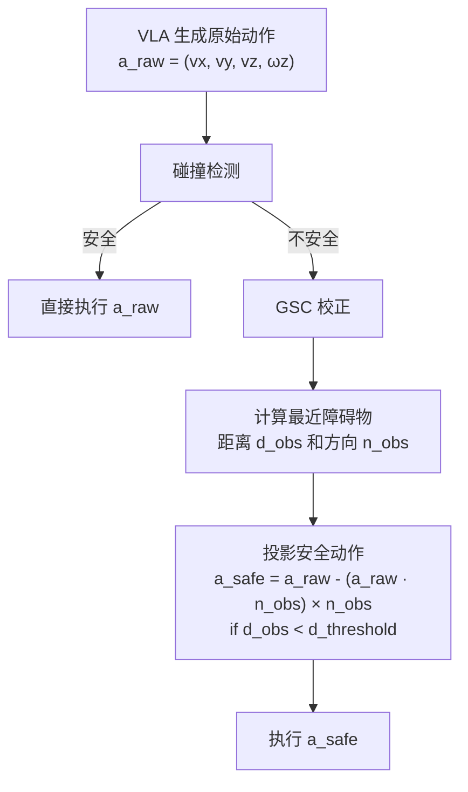
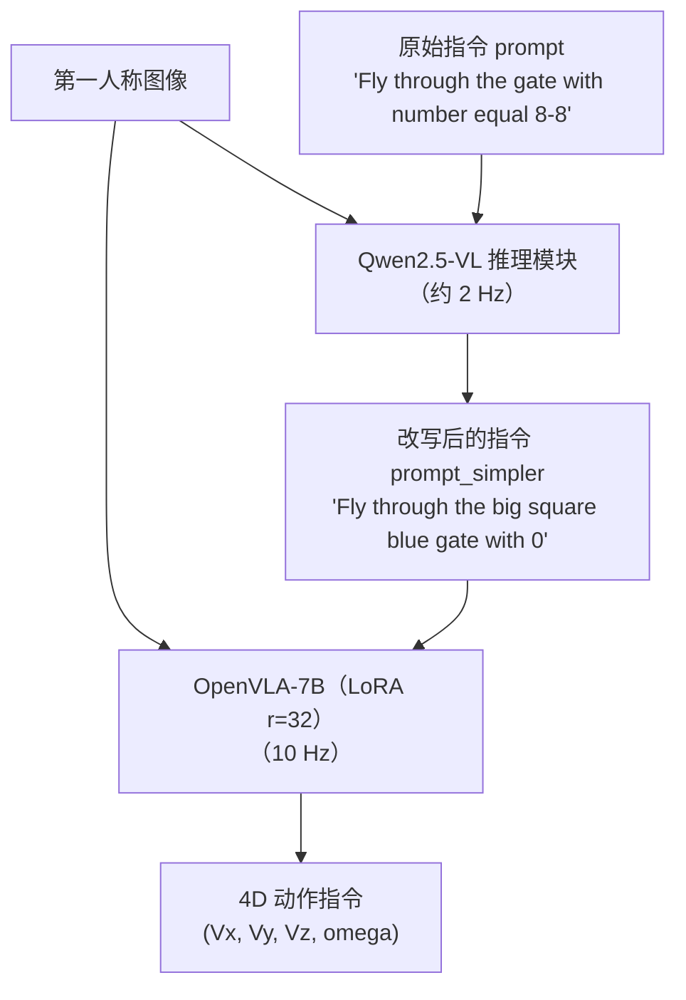
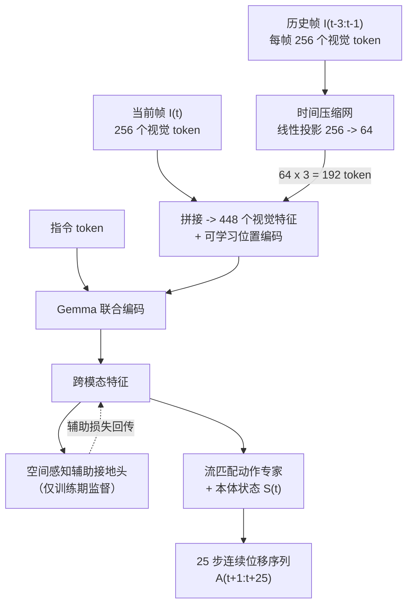
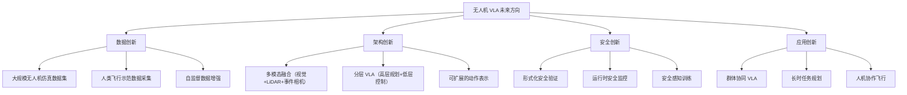
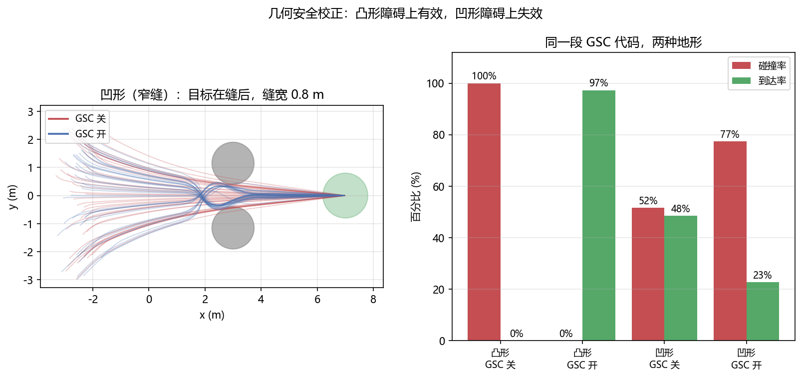

# 无人机 VLA 模型：专用架构与训练方法

> **预计阅读：24 分钟 | 前置知识：VLA 架构基础、无人机动力学基础、模仿学习概念**

---

## 1. 为什么需要无人机专用 VLA？

通用 VLA 模型（如 RT-2、OpenVLA）主要面向桌面机械臂操控任务，其设计假设和训练数据与无人机场景存在显著差异：

| 差异维度 | 桌面操控（通用 VLA） | 无人机场景 |
|---------|---------------------|-----------|
| 动作空间 | 6-7 DoF（位置+姿态+夹爪） | 4 DoF（油门+偏航+俯仰+横滚）或 6 DoF |
| 运动维度 | 主要是 2D 平面操作 | 完全 3D 空间运动 |
| 安全约束 | 碰撞可恢复 | 碰撞可能导致坠毁 |
| 控制频率 | 5-20 Hz 通常足够 | 需要 50-200 Hz |
| 环境动态性 | 相对静态 | 风扰、动态障碍物 |
| 观察视角 | 固定/受限视角 | 自由视角，视觉流剧烈变化 |
| 状态估计 | 相对精确（机械臂编码器） | 可能有漂移（IMU+视觉里程计） |

因此，直接将通用 VLA 应用于无人机效果有限。近年出现了专门的无人机 VLA 架构，三个代表是 VLA-AN、CognitiveDrone 和 UAV-TrackVLA。

---

## 2. VLA-AN：安全约束下的高效无人机 VLA

> **论文**：VLA-AN: An Efficient and Onboard Vision-Language-Action Framework for Aerial Navigation in Complex Environments
> **来源**：arXiv:2512.15258, 2025
> **关键成果**：98.1% 任务成功率，8.3× 推理加速

### 2.1 核心问题

VLA-AN 试图解决 VLA 在无人机导航中的两个核心问题：

1. **安全性**：VLA 作为端到端模型缺乏显式的安全约束，生成的动作可能导致碰撞
2. **实时性**：大型 VLA 模型推理速度慢，无法满足飞行控制的实时性要求

### 2.2 三阶段训练策略

VLA-AN 的训练是**渐进式**的，三个阶段按能力递进：**场景理解 → 核心飞行技能 → 复杂导航**。论文的原话是 *"progressive three-stage training framework … scene comprehension, core flight skills, and complex navigation"*。


```mermaid
graph LR
    subgraph "阶段一：场景理解"
        A1["大规模图文数据"] --> A2["视觉-语言表征"]
    end

    subgraph "阶段二：核心飞行技能"
        B1["飞行轨迹数据"] --> B2["行为克隆"]
    end

    subgraph "阶段三：复杂导航"
        C1["复杂导航任务"] --> C2["端到端飞行策略"]
    end

    A2 --> B1
    B2 --> C1
```

**阶段一：场景理解**

先让模型学会"看懂"，这一阶段不涉及动作生成：理解自然语言指令的语义、建立视觉场景与语言描述之间的对应关系、获得对 3D 空间结构的基本理解。

**阶段二：核心飞行技能**

在飞行数据上学基本的飞行控制。模型学习从视觉观测和语言指令到无人机控制命令的映射。

**阶段三：复杂导航**

在具备场景理解与基本飞行技能之后，再训练模型执行复杂度更高的导航任务。

**注意 GSC 不在这三个阶段里。** 几何安全校正作用在**推理时**——模型已经训练完了，它在每次输出动作之后做一次几何后处理，见下一节。

> **勘误（2026-10）**：本节早先写的是「阶段一：视觉-语言对齐预训练 / 阶段二：动作模仿学习 / 阶段三：**安全增强微调（几何安全校正）**」，并称"第三阶段是最关键的创新"。这个划分把**推理时的动作后处理**当成了**训练阶段**。arXiv:2512.15258 的三阶段逐字是 *"scene comprehension, core flight skills, and complex navigation"*；几何安全校正在论文里是**推理期**的稳健动作模块，不参与训练。三阶段的第二个名字（动作模仿学习）大致对应"核心飞行技能"，但第三阶段整个是错位的。

### 2.3 几何安全校正（GSC）

几何安全校正是 VLA-AN 的核心安全机制，作用在**推理时**：VLA 模型生成的动作可能不安全，但可以通过几何约束做一次后处理校正。

> **术语说明（2026-10）**：「几何安全校正」是论文里的说法（原文出现 3 次），但**论文从未使用「GSC」这个缩写**——它是本仓库为了行文方便自拟的简称，下文及本卷其它篇目沿用。对外引用时请写全称。


```mermaid
graph TB
    A["VLA 生成原始动作<br/>a_raw = (vx, vy, vz, ωz)"] --> B["碰撞检测"]
    B -->|"安全"| C["直接执行 a_raw"]
    B -->|"不安全"| D["GSC 校正"]
    D --> E["计算最近障碍物<br/>距离 d_obs 和方向 n_obs"]
    E --> F["投影安全动作<br/>a_safe = a_raw - (a_raw · n_obs) × n_obs<br/>if d_obs < d_threshold"]
    F --> G["执行 a_safe"]
```

GSC 的数学形式化：

给定原始动作 `a_raw` 和最近障碍物的法向量 `n_obs`，安全校正后的动作为：

```
if d_obs < d_threshold:
    a_safe = a_raw - max(0, a_raw · n_obs) × n_obs
else:
    a_safe = a_raw
```

这个公式的直觉是：将原始动作中"指向障碍物"的分量移除，保留"平行于障碍物表面"的分量。

### 2.4 关键实验结果

论文自报的两项结果（arXiv:2512.15258）：

| 指标 | 论文原值 |
|------|---------|
| 推理时间 | 从约 **4100 ms 降到 494 ms**（**8.3x 加速，减少 87.9%**） |
| 目标导航成功率 | **98.1%** |

> **口径提示**：8.3x 是论文里唯一有绝对数值对照的指标，它衡量的是**整条推理链路**（原文写 *"the total inference time is reduced from about 4100 ms to 494 ms (8.3x speedup, 87.9% reduction)"*）。链路的末端仍是毫秒级以外的时间尺度，端到端整环也还追不上实时控制的更高档位——[研究空白与机会](../08-研究前沿与开放问题/02-研究空白与机会.md) 2.1 节讨论的正是这件事。引用时请带上 4100 → 494 ms 这组数，不要只留一个倍数。

> **勘误（2026-10）**：本节早先有一张「VLA-AN 98.1% / 无 GSC 的 VLA 72.3% / 传统规划器 95.6%；碰撞率 1.2% vs 18.7% vs 3.1%；推理延迟 12 ms vs 100 ms」的表。**整张表都是编的**：论文里没有任何碰撞率对照表，也没有 72.3% / 18.7% / 3.1% / 95.6% 这些数字；12 ms 与 100 ms 是把 8.3 这个倍数反推出来的假绝对值，原文只有 4100 ms → 494 ms。下面那段「8.3x（从 100ms 降低到 12ms）」的口径提示因此也是二次论证一个不存在的数，已一并改写。

### 2.5 对无人机 VLA 的启示

VLA-AN 的贡献在于证明了 VLA 模型可以通过轻量级的安全后处理机制获得安全保障，而无需完全放弃端到端学习的优势。这种"学习+安全校正"的混合范式为后续工作提供了重要参考。

---

## 3. CognitiveDrone：面向认知飞行的 VLA

> **论文**：CognitiveDrone: A VLA Model and Evaluation Benchmark for Real-Time Cognitive Task Solving and Reasoning in UAVs
> **来源**：arXiv:2503.01378, 2025
> **关键成果**：基于 OpenVLA-7B 微调的无人机 VLA（LoRA r=32），8000+ 条仿真轨迹数据集，CognitiveDroneBench 基准上基座 59.6% / R1 77.2%

### 3.1 核心创新：认知任务基准 + 推理前置

CognitiveDrone 的贡献不在网络结构上——主干就是开源 OpenVLA-7B（论文原句：*"we integrate a VLA model adapted from the open-source OpenVLA model, which comprises 7 billion parameters"*）。它真正立起来的是两件事：

**一是把「认知任务」变成可打分的赛道。** 无人机沿一条多门赛道飞行，每段给一张第一人称图像和一条文本指令，指令里嵌着一个认知任务（认人 / 认符号 / 做一步推理），必须解出答案、选对门、再飞过去，选对得 1 分。这就是 CognitiveDroneBench。

**二是把「推理」提到控制之前。** 基座模型负责 4D 指令的高频生成，另挂一个 VLM（Qwen2.5-VL）在它前面把任务指令改写得更明确。论文原句是 *"simplify task directives prior to high-frequency control"*——注意是**改写指令**，不是输出动作。

**4D 动作是哪四维。** 论文记作机体速度与机头轮廓 `(Vx, Vy, Vz, omega)`，即三个方向的机体速度指令加偏航；采集脚本落盘成四列 `dx, dy, dz, angle`。论文明确写无人机由速度设定值控制：*"the drone in simulation is controlled using velocity setpoints, ensuring consistency with real-world drones running ArduPilot firmware"*。

> **勘误（2026-10）**：本节早先写「4D 动作空间 = Δx/Δy/Δz 前后左右上下**位移**（机体坐标系）+ Δψ 偏航角变化」，并称其优势是「直接输出**位移**而非**速度**」。
> **这一句是反的。** 论文报告的动作量逐字是 *"the UAV's velocity and the head profile (Vx, Vy, Vz, omega) was continuously logged"*，且仿真控制器吃的是速度设定值。四个维度本身没错，量纲说错了：那是**速度量纲的四维指令**。本文早先还给了 `[-5,5] / [-5,5] / [-3,3] / [-π,π]` 四组量程，**论文没有公布任何取值范围**，已删除。

### 3.2 大规模数据集构建

CognitiveDrone 团队构建的数据集规模是 **8,062 条**连续仿真飞行轨迹样本（摘要口径为「8000+」），论文里分成**三类**（arXiv:2503.01378 原句：*"over 8,000 simulated flight trajectories across three key categories—Human Recognition, Symbol Understanding, and Reasoning"*）：

| 场景类别 | 典型任务 |
|---------|---------|
| **Human Recognition**（人员识别） | 识别人体目标并按指令做出响应 |
| **Symbol Understanding**（符号理解） | 分辨符号并据此行动：字母数字、企业标识、动物图案 |
| **Reasoning**（推理） | 需要一步逻辑推演：飞到数字等于算式解的门；「有甜饮料的门」→ 选汽水标识 |

> **勘误（2026-10）**：本节早先有一张「室内导航 2500+ / 室外飞行 2000+ / 精准降落 1500+ / 编队飞行 1000+ / 紧急机动 1000+」的五类拆分表。**这五类和这些数量都是编的**——论文只有 Human Recognition / Symbol Understanding / Reasoning 三类，且没有公布按类拆分的确切条数（只说总数 8000+）。已整表替换。

### 3.3 CognitiveDrone-R1：把指令改写提到控制之前

CognitiveDrone-R1 在 VLA 前面挂一个 VLM（论文原句：*"we augment our system with an auxiliary reasoning module based on the VLM model Qwen2.5-VL"*）。它**不生成动作**，只负责把含混的任务指令压成一句更明确的表述，再交给 VLA 去做高频控制：


```mermaid
graph TB
    A["第一人称图像"] --> C["Qwen2.5-VL 推理模块<br/>（约 2 Hz）"]
    B["原始指令 prompt<br/>'Fly through the gate with number equal 8-8'"] --> C
    C --> D["改写后的指令 prompt_simpler<br/>'Fly through the big square blue gate with 0'"]
    A --> E["OpenVLA-7B（LoRA r=32）<br/>（10 Hz）"]
    D --> E
    E --> F["4D 动作指令<br/>(Vx, Vy, Vz, omega)"]
```

代价是两个可查的数：显存从**约 10 GB 涨到约 20 GB**（多一个 7B 模型），推理模块的运行频率只有**约 2 Hz**，而 VLA 保持 **10 Hz** 出控制指令。

收益的分布比直觉有意思。在 CognitiveDroneBench 上（各列为成功率）：

| 模型 | Reasoning | Human Recognition | Symbol Understanding | 总平均 |
|---|---|---|---|---|
| RaceVLA（赛车模型） | 36.2% | 23.1% | 34.6% | 31.3% |
| CognitiveDrone | 70.7% | 45.2% | 57.7% | 59.6% |
| **CognitiveDrone-R1** | **75.9%** | **76.8%** | **78.9%** | **77.2%** |

R1 涨得最多的是 Human Recognition（+31%）与 Symbol Understanding（+21%），Reasoning 只涨了约 6%。**推理模块补的是「指令说得不够清楚」这一类失败，不是推理能力本身**——基座的 Reasoning 本就不弱。另一条读法也在表里：RaceVLA 能稳稳穿门（论文说它 "robust understanding of UAV flight dynamics"）但选门接近随机，**飞得准和选得对是两种能力**，这正是这份基准想分开量的事。

> **勘误（2026-10）**：本节早先画的是「视觉输入 + 语言指令（例：'飞到红色屋顶后面'）→ VLM 推理模块 → 显式推理输出（场景理解 / 空间推理 / 路径规划）→ 动作生成模块 → 4D 动作」，并称其借鉴了 Chain-of-Thought。
> **那张图与那个例子都是编的**：论文里 R1 的输出是**改写后的一句指令**，不是三条分析；场景是赛道与门，不是建筑。真实证据在公开数据里——每条任务定义都带一对 `prompt` / `prompt_simpler` 字段，改写形如 *"Fly through the gate with number equal 8-8"* → *"Fly through the big square blue gate with 0"*，那正是这个模块的产物。**本节原先还完全没有那两组真实数字**（10 GB→20 GB、10 Hz / 2 Hz、上面那张成功率表），它们是 R1 的全部代价与收益。
>
> 本节早先还给过「CognitiveNet：ResNet-50 + 任务嵌入 + 6 层 TransformerEncoder + Linear 4D 头」的结构与伪代码，**那个网络不存在**（论文全篇无 ResNet-50、无 Transformer 编码器；主干逐字是 *"fine-tuned … based on the OpenVLA architecture"*）。

### 3.4 与 RT-2 涌现能力的对比

CognitiveDrone-R1 的显式推理能力与 RT-2 的涌现推理能力形成有趣对比：

| 维度 | RT-2 涌现推理 | CognitiveDrone-R1 显式推理 |
|------|-------------|--------------------------|
| 推理方式 | 隐式（模型内部） | 显式（前置的独立模块） |
| 可解释性 | 低（黑盒） | 高（改写结果是一句可读文本） |
| 推理速度 | 快（一次前向传播） | 慢（多一级 2 Hz 的 VLM） |
| 显存开销 | 单模型 | 约翻倍（10 GB → 20 GB） |
| 适用场景 | 简单语义理解 | 指令含混、需先澄清的任务 |

---

## 4. UAV-TrackVLA：基于 π₀.₅ 的跟踪专用 VLA

> **论文**：UAV-Track VLA: Embodied Aerial Tracking via Vision-Language-Action Models
> **来源**：arXiv:2604.02241, 2026
> **关键成果**：基于 π₀.₅ 架构，时间压缩网把 256×3 历史 token 压到 64×3，接地头 + 流匹配动作专家双分支；CARLA 里长距行人跟踪 61.76% SR / 269.65 平均跟踪帧，单步推理延迟降 33.4%（至 0.0571 s）

### 4.1 设计动机：两个被点名的问题

论文点的问题只有两个，都很具体：**时序特征冗余**（把多帧堆进去会让计算维度指数增长，而相邻帧的信息高度重叠），以及**空间几何先验缺失**（通用 VLA 直接拿来跟踪，缺目标相对无人机的精确空间关系）。前者用时间压缩网处理，后者用辅助接地头补。

同时论文给出了一个配套基准与数据集：**890K+ 帧、176 个任务、85 类目标**，在 CARLA 仿真里采集；评测指标是成功率 SR 与平均跟踪帧数 ATF。

### 4.2 架构：编码器 + 双分支解码器

主干是 π₀.₅ 的 Gemma。改动集中在两处——编码器侧加时间压缩网，解码器侧拆成两条互不干扰的支路：


```mermaid
graph TB
    A["历史帧 I(t-3:t-1)<br/>每帧 256 个视觉 token"] --> B["时间压缩网<br/>线性投影 256 -> 64"]
    C["当前帧 I(t)<br/>256 个视觉 token"] --> E
    B -->|"64 x 3 = 192 token"| E["拼接 -> 448 个视觉特征<br/>+ 可学习位置编码"]
    D["指令 token"] --> F["Gemma 联合编码"]
    E --> F
    F --> G["跨模态特征"]
    G --> H["空间感知辅助接地头<br/>（仅训练期监督）"]
    G --> I["流匹配动作专家<br/>+ 本体状态 S(t)"]
    H -.->|"辅助损失回传"| G
    I --> J["25 步连续位移序列<br/>A(t+1:t+25)"]
```

### 4.3 时间压缩网：把 768 个 token 压成 448

具体到数是可核的：对**三个历史帧** `I(t-3:t-1)`，用一个线性投影层把每帧的 **256 个视觉 token 压到 64 个**；三帧的 64×3 与当前帧原本的 256 个 token 在时间维上拼接，得到 **448 个**带时序信息的视觉特征；再显式加一层**可学习位置编码**，最后与指令 token 一起送进 Gemma。

论文给这个设计的理由是「防止堆叠多帧导致的计算维度指数增长与特征冗余」——**不是**为了多保留细节，而是为了在保留帧间运动趋势的前提下压住维度。

### 4.4 双分支解码器：一条接地、一条出动作

两条支路共享跨模态特征，但**前向推理时完全解耦**。论文明说这么拆是为了「避免显式的空间接地特征与连续动作生成之间的表征冲突」。

| 分支 | 结构与输出 | 在推理时做什么 |
|---|---|---|
| **空间感知辅助接地头** | Gemma 之后接一个小 Transformer，预测目标相对无人机的 **3D 相对位置**与**水平偏航角偏差** | **什么都不做** |
| **流匹配动作专家** | 把带空间先验的跨模态特征与无人机本体状态 `S(t)` 拼接，学理想跟踪轨迹的位移流场，输出 **25 步连续位移控制序列** `A(t+1:t+25)` | 出控制序列 |

接地头这一列是本篇最有意思的设计：它采用 **Bypass Auxiliary Design（旁路辅助）**，只在训练期通过辅助监督起作用，靠空间损失回传，**把几何先验压进跨模态 token**，推理时整条支路不参与。也就是说——**它不是一个「跟踪分支」，而是一个训练期的脚手架**。它不输出给谁当条件，而是改变主干特征本身。

### 4.5 为什么「拆开」比「串起来」更合适

一个自然的替代设计是把接地头的输出当成动作专家的额外条件输入（"先定位、再控制"）。论文没有这么做，理由是两类特征的**目标不一致**：接地要的是显式的空间坐标，动作要的是一个连续的位移流场；把它们耦合在同一条前向路径上，梯度会互相拉扯。解耦 + 旁路监督的做法让空间先验**只以特征的形式**进入动作分支，而不是以一串坐标的形式。

> **勘误（2026-10）**：本节早先的 §4.2–§4.5 有四处在论文里查不到。
> **（一）分支名字与输出**：早先写作「跟踪分支 → (x, y, w, h, confidence)」与「导航分支 → (Δx, Δy, Δz, Δψ)」，还说跟踪分支的输出作为导航分支的条件输入。真实的两条是 **spatial-aware auxiliary grounding head**（紧凑 Transformer，预测目标相对无人机的位置与水平偏航偏差）和 **flow matching action expert**（输出 25 步连续位移序列），而且接地头**推理时不参与**。早先那张表把「训练期脚手架」写成了「推理期的一条数据通路」。
> **（二）时间压缩的参数**：早先写「输入连续 N 帧（通常 N=4-8）」「输出固定数量 token（与单帧相同）」。真实是**三个历史帧**、每帧 **256 → 64**、拼出 **448** 个视觉特征。
> **（三）架构图**：早先那张 ASCII 图里的「状态编码器」「动作融合」两个模块不存在；论文的 `S(t)` 是直接拼进动作专家的，没有独立的编码器，也没有融合环节。
> **（四）§4.5 的五条控制规则**（"目标置信度高 + 距离过远 → 加速接近"等）：**论文没有这条规则表**，也没有"置信度低就扩大搜索范围"这类描述，已整段替换为论文实际给出的解耦理由。
> 以上四处都是照着「跟踪 VLA 应该长什么样」推出来的，本卷早先版本的 `关键成果` 行也因此漏掉了全部真实数字。

---

## 5. AutoFly：从"按指令飞"到"自主探索"的 VLA

> **论文**：AutoFly: Vision-Language-Action Model for UAV Autonomous Navigation in the Wild
> **来源**：arXiv:2602.09657, 2026
> **关键成果**：伪深度编码器 + 两阶段渐进训练；配套自主导航数据集

### 5.1 核心问题：指令粒度对不上

前三个模型的输入都是一条明确的指令（"飞到 A 点"、"跟踪那个人"）。AutoFly 问的是另一个问题：**真实户外探索里根本没有细粒度指令**。

它把现状说成一条落差：现行的无人机 VLN 研究依赖详细、预先给定的指令，把无人机沿预定路线引导；而真实的户外探索发生在未知环境中，能给的只有粗粒度的位置或方向提示。剩下的部分（连续规划与避障）必须由无人机自己完成。

这条落差不是模型容量问题，是**任务定义问题**：把"跟随一条详细指令"换成"在只有粗略提示时自主决策"，训练数据的分布也跟着变。所以 AutoFly 的工作里有一半不在模型上。

### 5.2 方法：伪深度编码与两阶段训练

两个设计点：

- **伪深度编码器**：从 RGB 输入导出深度感知特征，用来加强空间推理。无人机在三维空间中运动，而深度相机在小型机上往往没有或不可靠，所以"从单目图像里挤出几何线索"是空中 VLA 的常见补法。
- **两阶段渐进训练**：先对齐视觉、深度、语言三种表示，再对齐到动作策略。分两段的原因是动作策略的梯度信号比表示对齐弱得多，混在一起训会让表示学不充分。

数据集一侧的改动更关键：论文认为现有 VLN 数据集有两个根本局限——重度依赖"跟随显式指令"而非"自主决策"，以及真实世界数据不足。于是它构造了一个新的自主导航数据集，把数据采集的范式从指令跟随移到自主决策上。这和第 5.1 节那条落差是同一件事的两面。

### 5.3 与前三个模型的差别

| 维度 | VLA-AN / CognitiveDrone / UAV-TrackVLA | AutoFly |
|------|----------------------------------------|---------|
| 指令粒度 | 详细指令（点到点、跟踪目标） | 粗粒度位置/方向提示 |
| 任务定义 | 执行给定路线 | 未知环境中自主规划 + 避障 |
| 数据范式 | 指令跟随 | 自主决策 |
| 空间输入 | 视觉（部分含显式几何） | RGB + 伪深度特征 |

落到本仓库的分工上：AutoFly 问的"数据从哪来、按什么范式采"正是 [07 篇](./07-数据、预训练与跨具身.md) 的主题，它自己给出的答案（重采一个自主决策数据集）是那篇第 9 节"无人机数据从哪来"的一个实例。

---

## 6. 四大模型全面对比

### 6.1 核心特性对比

| 特性 | VLA-AN | CognitiveDrone | UAV-TrackVLA | AutoFly |
|------|--------|---------------|--------------|---------|
| 论文出处 | arXiv:2512.15258 | arXiv:2503.01378 | arXiv:2604.02241 | arXiv:2602.09657 |
| 核心任务 | 通用导航 | 认知飞行 | 视觉跟踪 | 野外自主导航 |
| VLM 基座 | 通用 VLA | OpenVLA-7B（LoRA 微调） | π₀.₅（Gemma） | 未公开 |
| 动作空间 | 4D 速度 | 4D 速度-偏航 | 25 步连续位移 | 未公开 |
| 安全机制 | 几何安全校正 (GSC) | 无显式安全层 | 无显式安全层（辅助接地头补几何先验） | 避障（无独立安全层） |
| 推理范式 | 直接映射 | 指令改写前置 (R1) | 时序压缩 + 双分支解耦 | 端到端（伪深度 + 两阶段） |
| 数据规模 | 未公开 | 8,062 条轨迹 | 890K+ 帧 / 176 任务 / 85 类目标 | 自建自主导航数据集（数量未公开） |
| 最高成功率 | 98.1% | 59.6%（R1 版 77.2%） | 61.76% | 未公开 |
| 推理加速 | 8.3×（4100 ms → 494 ms） | 无特殊优化 | 单步延迟 −33.4%（至 0.0571 s） | 未公开（未做推理优化） |

表里 AutoFly 一列的空格是刻意的：这篇工作的贡献在**任务定义与数据范式**上（5.1、5.2 节），不在推理效率或成功率数字上，把未公开的格子留空比填一个不可比的数字诚实。

### 6.2 技术路线对比


```mermaid
graph TB
    subgraph "VLA-AN 路线"
        A1["通用 VLA 基座"] --> A2["三阶段训练"]
        A2 --> A3["GSC 安全校正"]
        A3 --> A4["追求安全+高效"]
    end
    
    subgraph "CognitiveDrone 路线"
        B1["OpenVLA-7B + LoRA"] --> B2["8,062 条轨迹数据集"]
        B2 --> B3["指令改写前置 (R1)"]
        B3 --> B4["追求认知任务得分"]
    end
    
    subgraph "UAV-TrackVLA 路线"
        C1["π₀.₅ 基座"] --> C2["时间压缩（256x3 -> 64x3）"]
        C2 --> C3["双分支解码"]
        C3 --> C4["追求跟踪+实时"]
    end
```

### 6.3 适用场景分析

| 应用场景 | 最佳选择 | 原因 |
|---------|---------|------|
| 室内自主巡检 | VLA-AN | 安全性优先，室内环境障碍物密集 |
| 认知任务执行 | CognitiveDrone-R1 | 指令含混、需先把任务说清楚的赛段 |
| 目标跟踪任务 | UAV-TrackVLA | 专为跟踪设计，时序处理能力强 |
| 户外长距离飞行 | VLA-AN | 高效推理适合长时任务 |
| 人机交互任务 | CognitiveDrone | 语言理解能力强 |
| 动态环境导航 | UAV-TrackVLA | 时间压缩捕获运动信息 |
| 无地图野外探索 | AutoFly | 只有粗粒度位置/方向提示时的自主决策 |
| 带机械臂的空中作业 | 见 [09 篇](./09-评测基准与报告口径.md) | 空中操作是独立任务族，评估口径与纯飞行不同 |

---

## 7. 无人机 VLA 的共性挑战与未来方向

### 7.1 当前共性挑战

**挑战一：数据瓶颈**

无人机飞行数据的采集成本远高于桌面操控：
- 仿真数据：物理引擎的真实性有限（风、湍流等难以精确模拟）
- 真实数据：飞行实验的风险和成本高
- 数据标注：飞行轨迹的标注需要精确的状态估计

**挑战二：sim-to-real gap**

仿真环境与真实环境之间的差异（sim-to-real gap）在无人机领域尤为严重：
- 视觉差异：光照、纹理、动态模糊
- 动力学差异：风扰、气动效应
- 传感器差异：相机噪声、IMU 漂移

**挑战三：安全保障**

无人机 VLA 的安全保障比桌面操控更加关键：
- 碰撞后果严重（坠机、伤人）
- 需要实时安全检查（不能增加过多延迟）
- 安全约束需要形式化验证

### 7.2 未来研究方向


```mermaid
graph TB
    A["无人机 VLA 未来方向"] --> B["数据创新"]
    A --> C["架构创新"]
    A --> D["安全创新"]
    A --> E["应用创新"]
    
    B --> B1["大规模无人机仿真数据集"]
    B --> B2["人类飞行示范数据采集"]
    B --> B3["自监督数据增强"]
    
    C --> C1["多模态融合（视觉+LiDAR+事件相机）"]
    C --> C2["分层 VLA（高层规划+低层控制）"]
    C --> C3["可扩展的动作表示"]
    
    D --> D1["形式化安全验证"]
    D --> D2["运行时安全监控"]
    D --> D3["安全感知训练"]
    
    E --> E1["群体协同 VLA"]
    E --> E2["长时任务规划"]
    E --> E3["人机协作飞行"]
```

---

## 8. 关键论文

- **[arXiv'25.12] VLA-AN** — *VLA-AN: An Efficient and Onboard Vision-Language-Action Framework for Aerial Navigation in Complex Environments*  
  [](https://arxiv.org/abs/2512.15258)
  GSC 安全校正，8.3× 加速

- **[arXiv'25.03] CognitiveDrone** — *CognitiveDrone: A VLA Model and Evaluation Benchmark for Real-Time Cognitive Task Solving and Reasoning in UAVs*  
  [](https://arxiv.org/abs/2503.01378)
  OpenVLA-7B + LoRA 微调，8,062 条轨迹，CognitiveDroneBench 上 59.6%／R1 77.2%

- **[arXiv'26.04] UAV-Track VLA** — *UAV-Track VLA: Embodied Aerial Tracking via Vision-Language-Action Models*  
  [](https://arxiv.org/abs/2604.02241)
  π₀.₅ 基座，时间压缩（256→64），接地头 + 流匹配双分支，61.76% SR / −33.4% 延迟

- **[ICLR'26] AutoFly** — *AutoFly: Vision-Language-Action Model for UAV Autonomous Navigation in the Wild*  
  [](https://arxiv.org/abs/2602.09657)
  伪深度编码，两阶段训练，自主导航数据集

- **[arXiv'25.04] π₀.₅** — *π₀.₅: a Vision-Language-Action Model with Open-World Generalization*  
  [](https://arxiv.org/abs/2504.16054)
  原生动作 VLM


---

空中操作这一族（带机械臂的无人机）的基准另见 [09-评测基准与报告口径](./09-评测基准与报告口径.md) §5：AIR-VLA（`2601.21602`）与 AM-Bench（`2609.00641`）。本文不重复列，因为它们的产品是数据与评测协议，不是模型。

---

## 9. 动手验证：GSC 在什么形状的障碍物上会失效？

2.3 节那条公式只有一句"把指向障碍物的动作分量减掉"。这一节把它放进闭环里量出来。

两个场景的任务结构完全相同：目标都在障碍物正后方，都得从障碍物旁边过去。唯一的变量是障碍物的形状——凸形是一个球，绕过去的路只有一条；凹形是两个球，中间留一道 0.8 m 的缝，缝够一架半径 0.15 m 的无人机穿过去。

### 9.1 过滤器与它唯一看到的那个障碍物

```python
import torch
from common.quad_sim import QuadSim        # code/common/quad_sim.py：四旋翼质点模型
N, T = 256, 400                            # 256 架并行，400 步 = 8 秒
KV, V_MAX, KT, KA, TILT_MAX = 0.8, 3.0, 1.2, 3.0, 0.6
D_THRESH, DRONE_R, REACH_TOL = 1.5, 0.15, 0.8   # 触发距离须盖过 0.85 m 的刹车距离
GOAL = torch.tensor([7.0, 0.0, 1.5])       # 两个场景目标相同：都在障碍物正后方
# 唯一变量是形状。凹形是两个球留一道 0.8 m 的缝：够穿过去，但滤波器只看到最近的那个球。
SCENES = {"凸形": (torch.tensor([[3.0, 0.0]]), torch.tensor([1.2])),
          "凹形": (torch.tensor([[3.0, 1.15], [3.0, -1.15]]), torch.full((2,), 0.75))}
def gsc_filter(a_raw, p_xy, obstacles, d_thresh):
    """a_safe = a_raw - max(0, a_raw · n_obs) · n_obs。n_obs 须从无人机指向障碍物，
    写反成"障碍 -> 无人机"时 a_raw·n_obs 恒为负，clamp 到 0 后整段校正静默失效。"""
    cen, rad = obstacles; d = cen[None, :, :] - p_xy[:, None, :]            # 无人机 -> 球心 (N,M,2)
    d_obs = d.norm(dim=-1) - rad[None, :]             # 到球面的距离 (N,M)
    idx = d_obs.argmin(dim=1)                         # 只取最近的障碍，失效的根源
    ar = torch.arange(p_xy.shape[0]); n = d[ar, idx]; d_min = d_obs[ar, idx]
    n = n / (n.norm(dim=-1, keepdim=True) + 1e-8)
    proj = (a_raw * n).sum(-1, keepdim=True)          # a_raw · n_obs
    return a_raw - (d_min < d_thresh).unsqueeze(-1) * proj.clamp(min=0.) * n
def policy(env, goal, obstacles, use_gsc):
    """位置误差 -> 期望速度 ->[GSC 在速度层]-> 倾角 -> 角速率。"""
    v_des = torch.clamp(KV * (goal[:, :2] - env.p[:, :2]), -V_MAX, V_MAX)
    if use_gsc:
        v_des = gsc_filter(v_des, env.p[:, :2], obstacles, D_THRESH)
    tilt = torch.clamp(KT * (v_des - env.v[:, :2]), -TILT_MAX, TILT_MAX)
    a = torch.zeros(env.n, 4)
    a[:, 0] = 0.5 + 0.10 * (goal[:, 2] - env.p[:, 2]) - 0.30 * env.v[:, 2]   # 高度 -> 推力
    a[:, 1:3] = KA * (tilt - env.rpy[:, :2])                                # 倾角误差
    return a.clamp(-1, 1)
torch.manual_seed(0)
for name, (cen, rad) in SCENES.items():
    for use_gsc in (False, True):
        env = QuadSim(N); env.reset()
        env.p[:, 0] = -2.5 + 0.3 * torch.randn(N)     # 起点铺在障碍前一条横线上
        env.p[:, 1] = 3.0 * (torch.rand(N) * 2 - 1); env.p[:, 2] = 1.5   # 横向铺开
        hit = torch.zeros(N, dtype=torch.bool)
        for _ in range(T):
            env.step(policy(env, GOAL.repeat(N, 1), (cen, rad), use_gsc))
            hit |= (((env.p[:, :2].unsqueeze(1) - cen).norm(dim=-1) < rad + DRONE_R).any(1))
        ok = ((env.p - GOAL).norm(dim=-1) < REACH_TOL) & ~hit
        print(f"{name}  GSC {'开' if use_gsc else '关'}  碰撞 {hit.float().mean()*100:5.1f}%  到达 {ok.float().mean()*100:5.1f}%")
```

`idx = d_obs.argmin(dim=1)` 是关键的一行：整段校正只看**最近的一个**障碍物，用的是纯局部信息。凸形场景里这不成问题，球面的切向分量会带着无人机滑过去。凹形场景里两个球的法向量各指一边，只取最近的那个，等于用一个球的法向量去决定另一个球附近该怎么走。

### 9.2 本地实测结果

```text
凸形  GSC 关  碰撞 100.0%  到达   0.0%
凸形  GSC 开  碰撞   0.0%  到达  97.3%
凹形  GSC 关  碰撞  51.6%  到达  48.4%
凹形  GSC 开  碰撞  77.3%  到达  22.7%
```

同一个凸形场景上，GSC 把碰撞率从 100% 压到 0；同一个凹形场景上，它把碰撞率从 51.6% 抬到 77.3%。差别不在代码，在几何。

原因是无人机对准那道缝时，最近的那个球给出的法向量带横向分量。`a_raw - (a_raw · n_obs) · n_obs` 减掉朝前的分量之后，剩下的那个横向分量指向另一个球——校正量把无人机推进了陷阱。左图里 GSC 开启的那组蓝线在缝口挤成一束、随后擦上球面，就是这个过程。

> **触发距离不能小于刹车距离**：倾角限幅 0.6 rad 对应最大水平加速度 5.27 m/s²，3 m/s 巡航的刹车距离是 0.85 m。`D_THRESH` 调到 1.0 m 时凸形场景同样刹不住，碰撞率仍有 83.6%。上面这组数是在 `D_THRESH = 1.5` m 下跑的。



### 9.3 【待验证】接入 PX4 SITL：GSC 要跑在多少 Hz 上

> **未在本地验证**：本节代码需要 Ubuntu + PX4 + MicroXRCEAgent 才能运行，本仓库的验证环境是 Windows，没有跑过。**字段名请以你安装的 `px4_msgs` 版本为准。**

就计算量而言安全层不是瓶颈：`gsc_filter` 对每个障碍物做一次模长和一次点积，障碍物数量在几十的量级，是微秒级的运算。真正的开销在别处——它需要一张**世界坐标系下的障碍物表**，而这张表来自感知与建图，那一步的延迟和误差都不在安全层里。

**但预算怎么算要小心。** VLA-AN 论文自报的推理时间是约 494 ms（优化前 4100 ms），这是策略出一次动作的耗时，不是飞控内环的周期。想让外环策略的产物安全地落进内环，要在两个时间尺度之间对齐：策略多久给一个新目标，和飞控多久调一次电机。第 2.4 节的口径提示说的就是这件事，别拿策略推理时间去和内环周期做减法。

```python
from rclpy.qos import QoSProfile, ReliabilityPolicy, DurabilityPolicy, HistoryPolicy
from px4_msgs.msg import OffboardControlMode, TrajectorySetpoint, VehicleLocalPosition

def px4_qos(depth=1):
    """PX4 话题统一用 BEST_EFFORT + TRANSIENT_LOCAL，否则收不到数据。"""
    return QoSProfile(reliability=ReliabilityPolicy.BEST_EFFORT,
                      durability=DurabilityPolicy.TRANSIENT_LOCAL,
                      history=HistoryPolicy.KEEP_LAST, depth=depth)

class GscNode(Node):
    """安全层本身很便宜，贵的是喂给它的那张障碍物表。"""
    def __init__(self):
        super().__init__('gsc_safety')
        self.cen, self.rad, self.a_raw = None, None, None
        self.create_subscription(VehicleLocalPosition, '/fmu/out/vehicle_local_position',
                                 self.on_pos, px4_qos())

    def on_pos(self, m):
        if self.a_raw is None:
            return
        p_xy = torch.tensor([[m.y, m.x]])      # PX4 用 NED、训练用 ENU：x/y 互换且 y 取反
        a = self.a_raw if self.cen is None else gsc_filter(
            self.a_raw, p_xy, (self.cen, self.rad), D_THRESH)
        # 障碍物表为空时 gsc_filter 退化成直通，此时应降级到位置保持而不是继续飞
        self.pub_setpoint.publish(to_enu_setpoint(a))
```

三点补充：**坐标系**（`m.x/m.y` 是 NED 的北/东，直接当 ENU 的水平坐标用会得到一个镜像过的世界）、**障碍物表失效时的降级**（表为空或过期就切位置保持，别让一个空表伪装成"没有障碍"）、**只对最近障碍生效**（8.2 节量出来的失效模式在真机上是实打实的：窄缝、门框、走廊拐角都属这一类，需要换成 SDF 或把多个约束一起解）。

### 9.4 运行完整脚本

```bash
py -3.9 code/e_gsc_safety.py     # 约 4 秒，CPU 即可
```

完整脚本（含出生区自检、四组对照、出图）：[`code/e_gsc_safety.py`](../../code/e_gsc_safety.py)

---

## 10. 延伸阅读

- [01-VLA架构演进](./01-VLA架构演进.md) — 通用架构骨干：从 RT-2 到 2026 年的五条线
- [03-语言条件飞行控制](./03-语言条件飞行控制.md) — 深入了解如何用自然语言控制无人机
- [05-机载部署与优化](./05-机载部署与优化.md) — 将 VLA 模型部署到无人机机载平台的技术
- [07-数据、预训练与跨具身](./07-数据、预训练与跨具身.md) — §5 那个"自主导航数据集"往上游走的完整答案
- [09-评测基准与报告口径](./09-评测基准与报告口径.md) — 空中基准的碎片化，以及 AIR-VLA、AM-Bench 这两个空中操作基准
- [10-世界模型增强VLA](./10-世界模型增强VLA.md) — 空中方向上 2026 年最密集的一族：世界动作模型
- [02-世界模型专题/01-世界模型发展史](../02-世界模型专题/01-世界模型发展史.md) — 世界模型如何为无人机 VLA 提供环境先验知识

---

## 11. 思考题

**题目 1：GSC 的适用性边界**

VLA-AN 的几何安全校正（GSC）假设障碍物可以用法向量描述，这在室内环境中较为合理。请思考：(1) 在哪些场景下 GSC 的假设会失效？(2) 如何扩展 GSC 以处理更复杂的安全约束？

<details>
<summary>参考答案</summary>

**(1) GSC 假设失效的场景：**
- **动态障碍物**：移动的物体没有固定的法向量，需要预测其运动轨迹
- **非凸障碍物**：凹形障碍物（如 U 形槽）的法向量可能指向"陷阱"内部（第 9 节量了同一个机制：两个球之间留一道够穿过去的缝，只取最近障碍的法向量会把无人机推向另一个球，碰撞率从 51.6% 涨到 77.3%）
- **软约束场景**：有些区域不是绝对不能进入（如草坪），而是应该尽量避免
- **多约束耦合**：同时有碰撞约束、动力学约束、地理围栏等，GSC 难以统一处理

**(2) 扩展方案：**
- 引入障碍物的运动预测模块，使用时序信息估计未来位置
- 使用 Signed Distance Field (SDF) 替代法向量，提供更精确的安全距离信息
- 将 GSC 扩展为约束优化问题：`min ||a_safe - a_raw||² s.t. d(a_safe, obstacles) > d_min`
- 结合 Control Barrier Function (CBF) 理论，提供形式化的安全保证
</details>

---

**题目 2：CognitiveDrone-R1 的推理开销**

CognitiveDrone-R1 在 VLA 前面挂了一个 Qwen2.5-VL 做指令改写：VLA 保持 10 Hz 出控制指令，推理模块只有约 2 Hz，显存则从约 10 GB 涨到约 20 GB。在机载算力受限的无人机上，这个「差一个数量级的频率」会带来什么后果？如果推理模块的改写指令来晚了，控制层该怎么处理？

<details>
<summary>参考答案</summary>

**可能的平衡策略：**

1. **分层推理频率**：高层语义推理（"我要去哪里"）以低频运行（1-5 Hz），低层控制指令以高频运行（50-200 Hz）。这类似于人类的"思考-行动"分层。

2. **条件推理**：只在需要时触发深度推理（如遇到新场景、目标丢失），常规飞行使用快速直觉映射。类似于系统 1（直觉）和系统 2（深思）的切换。

3. **异步推理**：VLM 推理在后台异步进行，控制层使用最新的可用推理结果。当前推理未完成时，使用上一次的结果。

4. **推理缓存**：对于相似的场景，复用之前的推理结果，避免重复计算。

5. **预测性推理**：在动作执行的同时提前进行下一步推理，实现推理与执行的流水线化。

**权衡分析：**
- 推理越深 → 决策质量越高 → 但延迟越大
- 控制频率越高 → 飞行越平滑 → 但算力需求越大
- 最佳平衡点取决于具体任务（简单巡航 vs. 复杂避障）
</details>

---

**题目 3：三大模型的融合可能性**

VLA-AN 的安全机制、CognitiveDrone 的推理能力、UAV-TrackVLA 的时序处理能力，能否融合到一个统一的框架中？请设计一个概念架构。

<details>
<summary>参考答案</summary>

**概念融合架构：**

```
[视觉输入（多帧）]
        |
[UAV-TrackVLA 的时间压缩模块] → 时序特征
        |
[语言指令] + [任务上下文]
        |
[CognitiveDrone-R1 的 VLM 推理模块（低频，约 2 Hz）]
  - 消歧：把含混指令压成一句明确的表述
  - 只改指令，不生成动作
        |
[动作生成模块（π₀.₅ Flow Matching）]
  - 连续动作输出
        |
[VLA-AN 的 GSC 安全校正层]
  - 碰撞检测与校正
        |
[低层控制器]
  - 高频 PID/MPC 执行
        |
[无人机执行]
```

**各模块的协同：**
- 时间压缩模块以高频率处理视觉输入，为推理模块提供运动信息
- VLM 推理模块以低频率运行，提供高层决策指导
- 动作生成模块在推理指导下生成连续动作
- GSC 安全层对每个动作进行实时校正
- 低层控制器以最高频率执行校正后的动作

这种分层架构在保持各模块优势的同时，通过信息流的合理设计实现了能力互补。
</details>

---

> **下一节**：[03-语言条件飞行控制](./03-语言条件飞行控制.md) — 深入了解语言如何驱动无人机飞行控制
