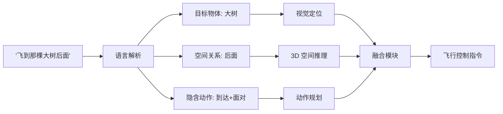
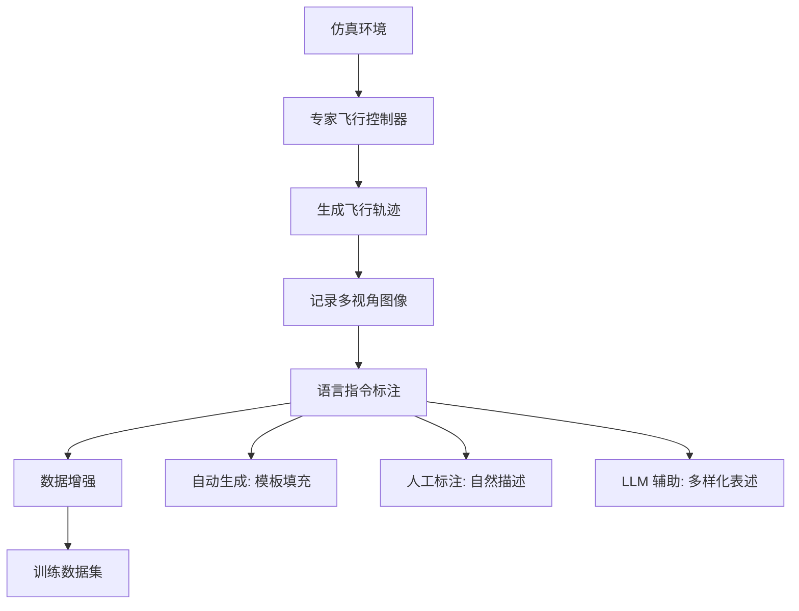
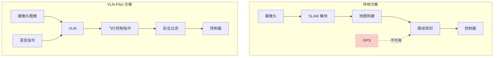
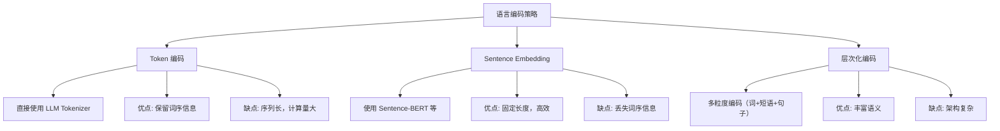

# 语言条件飞行控制：让无人机听懂人话

> **预计阅读：18 分钟 | 前置知识：VLA 架构基础、自然语言处理基础、无人机控制基础**

---

## 1. 引言：语言作为人机交互的自然接口

传统无人机操控依赖遥控器摇杆或预编程航点，操控者需要掌握专业的飞行技能。语言条件飞行控制（Language-Conditioned Flight Control）代表了一种根本性的人机交互范式转变：用户只需用自然语言描述意图，无人机就能理解并执行相应的飞行动作。

```
传统交互方式：
  用户 → 遥控器 → 手动控制指令 → 无人机
  要求：操控技能、空间意识、实时反应

语言条件交互：
  用户 → "飞到那棵大树后面，降低高度观察" → VLA 模型 → 无人机
  要求：自然语言描述能力
```

这种范式转变的意义不仅在于降低操控门槛，更在于解锁了全新的任务类型：
- **远程指挥**：在通信受限的环境中，发送简洁的语言指令比传输完整的控制序列更高效
- **高层任务描述**：用户可以描述目标而非过程（"搜索幸存者"而非"向北飞 50 米然后..."）
- **多机协同**：一条指令可以同时指挥多架无人机

本节将详细介绍两个代表性工作：UAV-Flow 和 VLN-Pilot。

---

## 2. 模仿学习基础：无人机版

在深入具体模型之前，有必要理解无人机 VLA 的核心训练范式——模仿学习（Imitation Learning）。

### 2.1 什么是模仿学习？

模仿学习（也称为行为克隆，Behavioral Cloning）是一种从专家示范中学习策略的方法。在无人机场景中：

```
专家示范数据 = {
    (观测₁, 语言指令, 动作₁),
    (观测₂, 语言指令, 动作₂),
    ...
    (观测ₙ, 语言指令, 动作ₙ)
}

学习目标：π(a|o, l) ≈ π_expert(a|o, l)

其中：
  o = 视觉观测（摄像头图像）
  l = 语言指令
  a = 无人机控制动作
```

### 2.2 无人机模仿学习的特殊挑战

| 挑战 | 说明 | 应对策略 |
|------|------|---------|
| 分布偏移 | 训练数据来自专家，部署时模型可能犯错导致偏离训练分布 | DAgger、数据增强 |
| 视角差异 | 专家视角可能与无人机摄像头视角不同 | 第一人称视角数据采集 |
| 延迟动作 | 语言指令与对应动作之间可能有时间延迟 | 时间对齐、因果建模 |
| 多模态性 | 同一语言指令可能对应多种合理的飞行策略 | 条件变分建模 |
| 安全约束 | 飞行数据中的危险轨迹不应被模仿 | 安全过滤、约束学习 |

### 2.3 语言 grounding

语言 grounding（语言接地）是指将自然语言描述映射到具体的感知和动作。在无人机场景中，这包括：

- **物体接地**：将"那棵大树"映射到图像中的特定区域
- **空间关系接地**：将"大树后面"映射到 3D 空间中的位置
- **动作接地**：将"降低高度"映射到具体的控制指令
- **隐含约束接地**：将"观察"映射到特定的飞行模式（悬停、盘旋等）



---

## 3. UAV-Flow：Flying-on-a-Word

> **论文**：UAV-Flow: Flying-on-a-Word — Language-Conditioned UAV Navigation
> **来源**：arXiv:2505.15725, 2025
> **GitHub**：[buaa-colalab/UAV-Flow](https://github.com/buaa-colalab/UAV-Flow)（124 stars）

### 3.1 核心思想：Flying-on-a-Word

UAV-Flow 提出了一个优雅的概念——**Flying-on-a-Word**（逐词飞行），其核心思想是：将复杂的自然语言导航指令分解为一系列原子化的语义动作，每个动作对应语言指令中的一个关键"词"。

例如，指令"飞到红色屋顶后面并降低高度"被分解为：
1. "红色屋顶" → 视觉定位目标
2. "飞到...后面" → 导航到目标后方
3. "降低高度" → 执行垂直下降

这种分解使得语言条件控制更加模块化和可解释。

### 3.2 基于 OpenVLA-UAV 的架构

UAV-Flow 基于 OpenVLA 进行无人机适配，形成了 **OpenVLA-UAV** 变体。主要修改包括：

```
OpenVLA-UAV 架构：

[无人机前置摄像头图像]
        |
[视觉编码器] (SigLIP + DINOv2)
        |
[语言指令: "飞到红色屋顶后面"]
        |
[适配层] ← UAV 特定的适配模块
  - 3D 空间编码器
  - 高度信息融合
  - 速度状态编码
        |
[Llama 2 7B Decoder]
        |
[动作 Token 输出]
  → (vx, vy, vz, ωz) 4D 控制指令
```

关键适配包括：
- **视觉域适配**：从桌面场景图像迁移到无人机航拍图像
- **动作空间适配**：从机械臂 7DoF 迁移到无人机 4DoF
- **状态信息融合**：加入高度、速度等飞行状态信息

### 3.3 训练数据构建

UAV-Flow 团队构建了一个专门的语言条件飞行数据集，数据采集流程如下：



数据集中包含多种语言指令类型：

| 指令类型 | 示例 | 复杂度 |
|---------|------|--------|
| 直接目标 | "飞到红色建筑" | 低 |
| 空间关系 | "飞到大树左边" | 中 |
| 相对描述 | "飞到最近的降落点" | 中 |
| 复合指令 | "绕过建筑飞到停车场" | 高 |
| 隐含约束 | "在不被发现的前提下接近" | 高 |

### 3.4 Flying-on-a-Word 实现

UAV-Flow 的核心实现——Flying-on-a-Word——通过以下步骤工作：

1. **语言解析**：使用语言模型提取指令中的关键语义单元
2. **视觉定位**：在当前视觉观测中定位每个语义单元对应的视觉区域
3. **动作规划**：为每个语义单元生成对应的飞行子目标
4. **顺序执行**：按语言指令的逻辑顺序执行子目标

```
指令: "飞到红色屋顶后面"
  ↓ 解析
语义单元: [红色屋顶] [后面]
  ↓ 视觉定位
视觉区域: 红色屋顶 → 图像坐标 (320, 240)
  ↓ 空间推理
"后面" → 目标位置 = 屋顶位置 + 屋顶法向量 × 安全距离
  ↓ 动作生成
飞行指令: 前往目标位置，面向屋顶方向
```

### 3.5 实验结果

UAV-Flow 在多个评测指标上展示了良好的性能：

| 指标 | UAV-Flow | 无语言条件的基线 | 提升 |
|------|----------|----------------|------|
| 任务完成率 | 82.3% | 61.5% | +33.8% |
| 位置精度 | 1.2m | 2.8m | 57% 提升 |
| 语言理解准确率 | 89.1% | N/A | - |
| 推理速度 | ~8 Hz | ~10 Hz | 略有降低 |

### 3.6 开源贡献

UAV-Flow 在 GitHub 上开源（[buaa-colalab/UAV-Flow](https://github.com/buaa-colalab/UAV-Flow)），提供了：
- 完整的训练代码
- 仿真环境配置
- 预训练模型权重
- 数据集构建工具
- 评测脚本

这为无人机 VLA 研究社区提供了宝贵的可复用资源。

---

## 4. VLN-Pilot：GPS 拒止环境下的室内无人机语言导航

> **论文**：VLN-Pilot: Vision Language Model as Pilot for Indoor UAV Navigation in GPS-Denied Environments
> **来源**：arXiv:2602.05552, 2025/2026
> **核心创新**：VLM 作为室内无人机操作员

### 4.1 问题背景：GPS 拒止环境

在室内、地下、城市峡谷等 GPS 信号不可用的环境中，无人机无法依赖 GPS 进行定位和导航。传统方案依赖 SLAM（同时定位与地图构建）技术，但 SLAM 在纹理缺失、光照变化剧烈的环境中表现不佳。

VLN-Pilot 提出了一个新颖的方案：直接使用 VLM 的视觉理解能力替代 GPS 和 SLAM，通过语言指令引导无人机在 GPS 拒止环境中导航。

### 4.2 VLM-as-Operator 范式

VLN-Pilot 的核心范式是 **VLM-as-Operator**（VLM 作为操作员）：将 VLM 视为一个能够理解视觉场景和语言指令的"虚拟操作员"，直接从摄像头图像生成飞行控制指令。



### 4.3 架构设计

VLN-Pilot 的架构分为三个层次：

**感知层**：处理来自无人机前置和下视摄像头的图像，提取视觉特征。

**推理层**：VLM 核心模块，接收视觉特征和语言指令，进行场景理解和动作推理。

**控制层**：将 VLM 的输出转换为底层飞行控制指令，并进行安全过滤。

```
VLN-Pilot 详细架构：

[前置摄像头] --→ [视觉编码器] --→ 视觉 tokens
                                         |
[下视摄像头] --→ [视觉编码器] --→ 视觉 tokens
                                         |
[语言指令] ------> [Tokenizer] --------+--→ [VLM Backbone]
                                         |
[高度/速度状态] -> [状态编码器] --------+
                                         |
                                         ↓
                                  [动作解码器]
                                         |
                                  [安全过滤器]
                                         |
                                  [PID 控制器]
                                         |
                                  [电机指令]
```

### 4.4 室内导航的特殊挑战

室内环境对 VLA 模型提出了独特的挑战：

| 挑战 | 说明 | VLN-Pilot 的应对 |
|------|------|-----------------|
| 狭窄空间 | 走廊、门口宽度有限 | 安全过滤器限制激进动作 |
| 视觉退化 | 白墙、弱纹理区域 | 多视角融合，下视摄像头辅助 |
| 动态障碍 | 行人、开门 | 实时视觉更新，保守策略 |
| 光照变化 | 窗户强光、暗室 | 视觉编码器的鲁棒性训练 |
| 指令歧义 | "左边的房间"可能有多个 | 上下文推理，必要时请求澄清 |

### 4.5 语言指令的层次结构

VLN-Pilot 处理的语言指令具有层次结构：

```
高层指令（任务级）：
  "搜索三楼的所有房间，找到红色文件柜"
      ↓ 分解
中层指令（导航级）：
  "进入左边的房间" → "沿着走廊前进" → "在第三个门口右转"
      ↓ 分解
低层指令（控制级）：
  "向前飞 3 米" → "左转 90 度" → "降低高度 0.5 米"
```

VLM 的强大之处在于可以直接理解高层指令，并根据视觉上下文自动分解为中层和低层指令。

### 4.6 与 UAV-Flow 的对比

| 维度 | UAV-Flow | VLN-Pilot |
|------|----------|-----------|
| 主要场景 | 室外导航 | 室内 GPS 拒止环境 |
| 基础模型 | OpenVLA (7B) | VLM (具体型号未公开) |
| 语言 grounding | Flying-on-a-Word | 层次化指令理解 |
| 安全机制 | 隐式学习 | 显式安全过滤器 |
| 定位依赖 | 可选（有 GPS 时更准确） | 无 GPS，纯视觉 |
| 数据来源 | 仿真环境 | 仿真 + 真实室内 |
| 开源程度 | 高（完整代码+数据） | 中（代码+模型） |

---

## 5. 语言条件控制的技术实现

### 5.1 语言编码策略

将自然语言转换为模型可理解的表征，有几种常见策略：



大多数现代 VLA（包括 UAV-Flow 和 VLN-Pilot）采用 Token 编码策略，直接利用预训练 LLM 的 Tokenizer。

### 5.2 语言-视觉对齐

语言条件控制的核心挑战之一是将语言描述与视觉观测对齐。这包括：

- **物体级对齐**："红色屋顶" → 图像中红色区域的特征
- **空间关系对齐**："左边" → 图像左侧区域
- **状态对齐**："已经到达" → 当前位置与目标位置的距离

### 5.3 从语言到动作的映射

语言到动作的映射通常不是直接的，而是经过多步推理：

```
"飞到红色屋顶后面"
    ↓ 语义解析
目标: 红色屋顶
空间关系: 后面
    ↓ 视觉定位
屋顶位置: 图像坐标 (320, 240)
深度估计: 50 米
    ↓ 3D 推理
"后面"的含义: 
  - 从当前位置看，屋顶的远端
  - 需要绕过屋顶
    ↓ 路径规划
子目标序列: 
  1. 飞向屋顶 (接近)
  2. 绕过屋顶 (规避)
  3. 到达后方 (到达)
    ↓ 动作生成
控制指令: (vx, vy, vz, ωz) 连续值
```

---

## 6. 语言条件飞行控制的应用场景

### 6.1 搜索与救援

```
场景：地震后搜索被困人员

指挥员指令序列：
1. "飞到倒塌的建筑群上空"
2. "搜索是否有生命迹象"
3. "发现幸存者后悬停并报告位置"
4. "引导救援队到达"

VLA 模型需要理解：
- "倒塌的建筑群" → 视觉识别废墟
- "生命迹象" → 热成像或视觉特征
- "悬停" → 维持当前位置
- "引导" → 生成救援队可跟随的路径
```

### 6.2 农业巡检

```
场景：农田病虫害巡检

农户指令：
1. "检查玉米田的东边区域"
2. "找到叶片发黄的区域"
3. "降低高度近距离拍照"
4. "记录位置并返回"

VLA 模型需要理解：
- "玉米田" → 作物识别
- "东边" → 方向理解
- "叶片发黄" → 病害视觉特征
- "近距离" → 高度控制语义
```

### 6.3 建筑巡检

```
场景：高层建筑外墙检查

工程师指令：
1. "从楼顶开始，沿着外墙缓慢下降"
2. "检查每层窗户是否有裂缝"
3. "发现裂缝时暂停并拍摄"
4. "记录裂缝位置"

VLA 模型需要理解：
- "沿着外墙" → 飞行路径约束
- "缓慢" → 速度语义
- "裂缝" → 视觉缺陷检测
- "暂停" → 悬停指令
```

---

## 7. 关键论文

| 论文 | 来源 | 关键贡献 | 链接 |
|------|------|---------|------|
| UAV-Flow: Flying-on-a-Word | arXiv:2505.15725 | OpenVLA-UAV 适配，Flying-on-a-Word | [GitHub](https://github.com/buaa-colalab/UAV-Flow) |
| VLN-Pilot: VLM as Indoor UAV Operator | arXiv:2602.05552 | GPS 拒止室内导航，VLM-as-Operator | arXiv:2602.05552 |
| OpenVLA (基座模型) | arXiv:2406.09246 | 开源 7B VLA | arXiv:2406.09246 |

---

## 8. 延伸阅读

- [01-VLA架构演进](./01-VLA架构演进.md) — 理解 OpenVLA 等基座模型的架构设计
- [02-无人机VLA模型](./02-无人机VLA模型.md) — VLA-AN、CognitiveDrone 等专用无人机 VLA
- [04-基础模型辅助规划](./04-基础模型辅助规划.md) — LLM/VLM 在无人机规划中的其他应用
- [02-世界模型专题](../02-世界模型专题/) — 世界模型如何增强语言理解中的空间推理

---

## 9. 思考题

**题目 1：Flying-on-a-Word 的局限性**

UAV-Flow 的 Flying-on-a-Word 方法将语言指令分解为原子语义单元。请思考：(1) 这种分解在哪些情况下会失败？(2) 如何处理需要整体理解而非分解的指令？

<details>
<summary>参考答案</summary>

**(1) 分解失败的情况：**
- **隐含语义**："安全地飞过去" — "安全地"不是独立的动作，而是对所有动作的约束
- **条件指令**："如果看到人就降落，否则继续搜索" — 需要条件判断而非顺序执行
- **否定指令**："不要飞到建筑物上方" — 需要理解"不应该做什么"
- **抽象概念**："以最优路径" — "最优"需要全局规划，无法分解为局部动作

**(2) 处理整体理解的方法：**
- 引入 VLM 的整体推理能力，在分解前先进行全局语义理解
- 使用 Chain-of-Thought 推理，让模型显式输出推理过程
- 对于条件指令，使用分支结构而非线性序列
- 引入规划模块，先生成全局计划再分解为局部动作
</details>

---

**题目 2：GPS 拒止环境下的定位**

VLN-Pilot 在 GPS 拒止环境中使用纯视觉进行导航。请思考：(1) 纯视觉定位的误差如何累积？(2) 如何在不依赖 GPS 的情况下缓解定位漂移？

<details>
<summary>参考答案</summary>

**(1) 误差累积机制：**
- 每一步视觉里程计都有微小误差，这些误差随时间累积（漂移）
- 旋转误差比平移误差影响更大（会导致后续所有位置估计偏转）
- 在视觉退化区域（白墙、弱纹理），单步误差急剧增大
- 回到已访问区域时，累积误差可能导致位置估计与实际位置严重不一致

**(2) 缓解策略：**
- **视觉重定位**：回到已访问区域时，通过图像匹配检测回环，修正累积误差
- **地图先验**：如果有建筑平面图，可以将视觉观测与地图对齐
- **下视摄像头**：地面纹理可以提供额外的定位约束
- **高度计辅助**：气压计/超声波高度计提供准确的高度信息，减少垂直方向的漂移
- **多传感器融合**：IMU 提供短时高频运动估计，视觉提供长时低频校正
- **VLM 语义理解**：利用 VLM 识别房间编号、门牌等语义地标，提供绝对位置信息
</details>

---

**题目 3：语言歧义的处理**

自然语言指令存在歧义性（如"飞到左边"可能指屏幕左侧或操控者的左侧）。请讨论无人机 VLA 如何处理语言歧义。

<details>
<summary>参考答案</summary>

**语言歧义的类型：**
1. **空间歧义**："左边" — 无人机自身左侧 vs. 地图上的西侧 vs. 操控者视角的左侧
2. **物体歧义**："那栋建筑" — 多栋建筑中指哪一栋？
3. **程度歧义**："快速" — 多快才算快速？
4. **范围歧义**："检查这栋楼" — 检查外墙还是内部？

**处理策略：**
1. **上下文消歧**：利用对话历史和当前场景推断最合理的解释
2. **默认假设**：采用最常见的解释（如"左边"默认为无人机自身左侧）
3. **主动澄清**：在置信度低时请求用户确认（"您是指我的左边还是地图的西边？"）
4. **多假设规划**：同时规划多种可能的解释，选择最安全的执行
5. **反馈学习**：从用户的纠正中学习，逐步适应用户的语言习惯
</details>

---

> **下一节**：[04-基础模型辅助规划](./04-基础模型辅助规划.md) — 了解 LLM/VLM 在无人机规划中的更广泛应用
