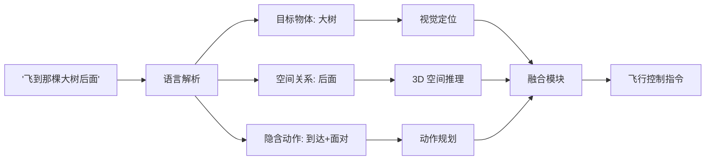
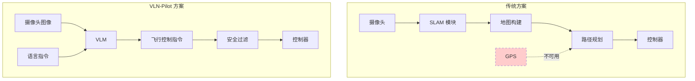
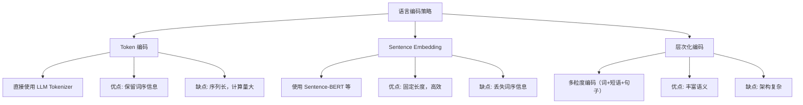
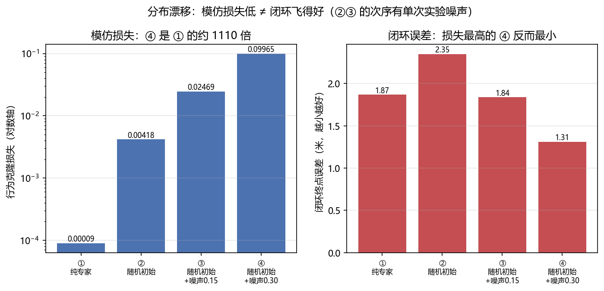
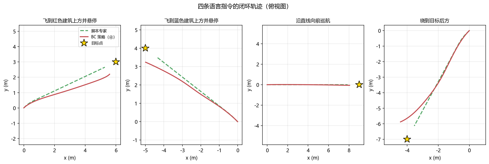

# 语言条件飞行控制：让无人机听懂人话

> **预计阅读：21 分钟 | 前置知识：VLA 架构基础、自然语言处理基础、无人机控制基础**

---

## 1. 语言作为人机交互的自然接口

传统无人机操控依赖遥控器摇杆或预编程航点，操控者需要掌握专业的飞行技能。语言条件飞行控制（Language-Conditioned Flight Control）代表了一种根本性的人机交互范式转变：用户只需用自然语言描述意图，无人机就能理解并执行相应的飞行动作。

```
传统交互方式：
  用户 → 遥控器 → 手动控制指令 → 无人机
  要求：操控技能、空间意识、实时反应

语言条件交互：
  用户 → "飞到那棵大树后面，降低高度观察" → VLA 模型 → 无人机
  要求：自然语言描述能力
```

这种范式转变的意义不仅在于降低操控门槛，更在于解锁了全新的任务类型：
- **远程指挥**：在通信受限的环境中，发送简洁的语言指令比传输完整的控制序列更高效
- **高层任务描述**：用户可以描述目标而非过程（"搜索幸存者"而非"向北飞 50 米然后..."）
- **多机协同**：一条指令可以同时指挥多架无人机

这一方向的两个代表是 UAV-Flow 和 VLN-Pilot。

---

## 2. 模仿学习基础：无人机版

在深入具体模型之前，有必要理解无人机 VLA 的核心训练范式——模仿学习（Imitation Learning）。

### 2.1 什么是模仿学习？

模仿学习（也称为行为克隆，Behavioral Cloning）是一种从专家示范中学习策略的方法。在无人机场景中：

```
专家示范数据 = {
    (观测₁, 语言指令, 动作₁),
    (观测₂, 语言指令, 动作₂),
    ...
    (观测ₙ, 语言指令, 动作ₙ)
}

学习目标：π(a|o, l) ≈ π_expert(a|o, l)

其中：
  o = 视觉观测（摄像头图像）
  l = 语言指令
  a = 无人机控制动作
```

### 2.2 无人机模仿学习的特殊挑战

| 挑战 | 说明 | 应对策略 |
|------|------|---------|
| 分布偏移 | 训练数据来自专家，部署时模型可能犯错导致偏离训练分布 | DAgger、数据增强 |
| 视角差异 | 专家视角可能与无人机摄像头视角不同 | 第一人称视角数据采集 |
| 延迟动作 | 语言指令与对应动作之间可能有时间延迟 | 时间对齐、因果建模 |
| 多模态性 | 同一语言指令可能对应多种合理的飞行策略 | 条件变分建模 |
| 安全约束 | 飞行数据中的危险轨迹不应被模仿 | 安全过滤、约束学习 |

### 2.3 语言 grounding

语言 grounding（语言接地）是指将自然语言描述映射到具体的感知和动作。在无人机场景中，这包括：

- **物体接地**：将"那棵大树"映射到图像中的特定区域
- **空间关系接地**：将"大树后面"映射到 3D 空间中的位置
- **动作接地**：将"降低高度"映射到具体的控制指令
- **隐含约束接地**：将"观察"映射到特定的飞行模式（悬停、盘旋等）


```mermaid
graph LR
    A["'飞到那棵大树后面'"] --> B["语言解析"]
    B --> C1["目标物体: 大树"]
    B --> C2["空间关系: 后面"]
    B --> C3["隐含动作: 到达+面对"]
    
    C1 --> D["视觉定位"]
    C2 --> E["3D 空间推理"]
    C3 --> F["动作规划"]
    
    D --> G["融合模块"]
    E --> G
    F --> G
    
    G --> H["飞行控制指令"]
```

---

## 3. UAV-Flow：Flying-on-a-Word

> **论文**：UAV-Flow Colosseo: A Real-World Benchmark for Flying-on-a-Word UAV Imitation Learning
> **来源**：arXiv:2505.15725, 2025
> **GitHub**：[buaa-colalab/UAV-Flow](https://github.com/buaa-colalab/UAV-Flow)（173 stars）
> **性质**：**基准论文**（首个真实世界的语言条件细粒度无人机控制基准），不是某个新模型的论文

### 3.1 核心思想：Flying-on-a-Word 这个任务

论文的贡献起点是把问题重新划一遍。此前的工作大多聚焦**高层规划与长时程导航**（"去那个街区"），这篇转向**语言引导的细粒度轨迹控制**：无人机根据语言指令执行**短程、反应式**的飞行动作。

论文把这个问题形式化为 **Flying-on-a-Word（Flow）** 任务，并提出用**无人机模仿学习**来解决：让无人机通过模仿**专家飞手的轨迹**来学细粒度控制策略，每条轨迹与**原子化的语言指令**配对。

这里的关键词是"原子化"。Flow 任务的指令不是长句任务描述，而是短、具体、对应一个即时动作的语言片段——这也正是"逐词飞行"这个名字的来源。

### 3.2 论文做了哪四件事

摘要列出的交付物有四项，注意这是一篇基准论文，四项都是"基础设施"而不是"模型改进"：

1. **任务形式化**（task formulation）：把 Flow 定义清楚
2. **大规模数据集**：在多样环境中采集，专家飞行轨迹配原子语言指令
3. **可部署的控制框架**：直接可上机的推理入口，论文声称支持**无 sim-to-real gap 的直接部署**
4. **仿真套件**：用于系统性评测

论文在 UAV-Flow 上做了扩展实验，**同时评测 VLN 与 VLA 两条范式**；结论是 **VLA 模型优于 VLN 基线**，并且指出在细粒度 Flow 场景下**空间接地（spatial grounding）是决定性的**。

论文采用 **OpenVLA** 与 **Pi-0** 作为基础 VLA 模型；对外发布的权重名为 **OpenVLA-UAV**（放在 `wangxiangyu0814/OpenVLA-UAV`），这是权重仓库名，不是论文里的新架构名。

### 3.3 数据集的形状

数据集在 Hugging Face 上以 `wangxiangyu0814/UAV-Flow` 发布。它的实际形态和"图像 + 轨迹 + 指令"三目录式的直觉不一样：**54 个 `train-*.parquet` 分片**，字段是 `[id, frame_idx, image, log]`——`log` 是原始遥测序列，指令与轨迹信息都编码在其中，而不是单独抽成 `instructions.jsonl`。

数据采集的关键点是：轨迹来自**真实环境中的专家飞手**，而不是仿真里的控制器。这正是这篇论文敢说"支持无 sim-to-real gap 的直接部署"的依据。

### 3.4 怎么评测

评估这条线在真实世界里的做法是**比较生成轨迹与参考轨迹的相似度**：仓库里的入口是先用 `openvla_act.py` + `batch_run_act_all.py` 跑出动作序列，再用 `metric.py` 算 **nDTW**（normalized Dynamic Time Warping），这是 VLN 领域常用的轨迹对齐指标，而不是"任务完成率 / 位置误差"这类绝对量。

值得记住的是论文自己承认的局限：在真实场景里采用定量评测指标**本身就很困难**。这句话比任何一张结果表都更该被引用——它说明这个领域目前的定量比较能力是有限的。

### 3.5 论文报告的结论

论文的结论是**定性的两条**：

1. **VLA 模型优于 VLN 基线**——在细粒度 Flow 任务上，直接输出动作的 VLA 比"先理解再导航"的 VLN 更合适
2. **空间接地（spatial grounding）是决定性的**——细粒度场景里，能不能把语言"钉"到具体的空间位置，是成败关键

摘要**没有给出按指标拆分的数字表**。

### 3.6 开源产物

仓库 [buaa-colalab/UAV-Flow](https://github.com/buaa-colalab/UAV-Flow) 有两条线：

- **`OpenVLA-UAV/`**：训练与推理侧的 OpenVLA 改造（内含 `prismatic/` 与 `vla-scripts/`），微调入口 `bash vla-scripts/finetune_uav.sh`，推理入口 `python vla-scripts/openvla_act.py`
- **`UAV-Flow-Eval/`** 与 **`dataset_tools/`**：评测侧与数据侧工具

权重与数据都在 Hugging Face：数据 `wangxiangyu0814/UAV-Flow`，权重 `wangxiangyu0814/OpenVLA-UAV`。

---

## 4. VLN-Pilot：GPS 拒止环境下的室内无人机语言导航

> **论文**：VLN-Pilot: Large Vision-Language Model as an Autonomous Indoor Drone Operator
> **来源**：arXiv:2602.05552, 2026
> **核心创新**：VLM 作为室内无人机操作员

### 4.1 问题背景：GPS 拒止环境

在室内、地下、城市峡谷等 GPS 信号不可用的环境中，无人机无法依赖 GPS 进行定位和导航。传统方案依赖 SLAM（同时定位与地图构建）技术，但 SLAM 在纹理缺失、光照变化剧烈的环境中表现不佳。

VLN-Pilot 提出了一个新颖的方案：直接使用 VLM 的视觉理解能力替代 GPS 和 SLAM，通过语言指令引导无人机在 GPS 拒止环境中导航。

### 4.2 VLM-as-Operator 范式

VLN-Pilot 的核心范式是 **VLM-as-Operator**（VLM 作为操作员）：将 VLM 视为一个能够理解视觉场景和语言指令的"虚拟操作员"，直接从摄像头图像生成飞行控制指令。


```mermaid
graph TB
    subgraph "传统方案"
        T1["摄像头"] --> T2["SLAM 模块"]
        T2 --> T3["地图构建"]
        T3 --> T4["路径规划"]
        T4 --> T5["控制器"]
        T6["GPS"] -.->|"不可用"| T4
    end
    
    subgraph "VLN-Pilot 方案"
        V1["摄像头图像"] --> V3["VLM"]
        V2["语言指令"] --> V3
        V3 --> V4["飞行控制指令"]
        V4 --> V5["安全过滤"]
        V5 --> V6["控制器"]
    end
    
    style T6 fill:#ffcccc,stroke-dasharray: 5 5
```

### 4.3 架构设计

VLN-Pilot 的架构分为三个层次：

**感知层**：处理来自无人机前置和下视摄像头的图像，提取视觉特征。

**推理层**：VLM 核心模块，接收视觉特征和语言指令，进行场景理解和动作推理。

**控制层**：将 VLM 的输出转换为底层飞行控制指令，并进行安全过滤。

```
VLN-Pilot 详细架构：

[前置摄像头] --→ [视觉编码器] --→ 视觉 tokens
                                         |
[下视摄像头] --→ [视觉编码器] --→ 视觉 tokens
                                         |
[语言指令] ------> [Tokenizer] --------+--→ [VLM Backbone]
                                         |
[高度/速度状态] -> [状态编码器] --------+
                                         |
                                         ↓
                                  [动作解码器]
                                         |
                                  [安全过滤器]
                                         |
                                  [PID 控制器]
                                         |
                                  [电机指令]
```

### 4.4 室内导航的特殊挑战

室内环境对 VLA 模型提出了独特的挑战：

| 挑战 | 说明 | VLN-Pilot 的应对 |
|------|------|-----------------|
| 狭窄空间 | 走廊、门口宽度有限 | 安全过滤器限制激进动作 |
| 视觉退化 | 白墙、弱纹理区域 | 多视角融合，下视摄像头辅助 |
| 动态障碍 | 行人、开门 | 实时视觉更新，保守策略 |
| 光照变化 | 窗户强光、暗室 | 视觉编码器的鲁棒性训练 |
| 指令歧义 | "左边的房间"可能有多个 | 上下文推理，必要时请求澄清 |

### 4.5 语言指令的层次结构

VLN-Pilot 处理的语言指令具有层次结构：

```
高层指令（任务级）：
  "搜索三楼的所有房间，找到红色文件柜"
      ↓ 分解
中层指令（导航级）：
  "进入左边的房间" → "沿着走廊前进" → "在第三个门口右转"
      ↓ 分解
低层指令（控制级）：
  "向前飞 3 米" → "左转 90 度" → "降低高度 0.5 米"
```

VLM 的强大之处在于可以直接理解高层指令，并根据视觉上下文自动分解为中层和低层指令。

### 4.6 与 UAV-Flow 的对比

| 维度 | UAV-Flow | VLN-Pilot |
|------|----------|-----------|
| 任务尺度 | 短程、反应式细粒度控制（Flow） | 室内导航 |
| 基础模型 | OpenVLA 与 Pi-0 | VLM（具体型号未核实） |
| 语言 grounding | 原子语言指令配专家轨迹 | 层次化指令理解（未核实） |
| 安全机制 | 未在摘要中说明 | 显式安全过滤器（未核实） |
| 定位依赖 | 未在摘要中说明 | 无 GPS，纯视觉（未核实） |
| 数据来源 | **真实世界**专家飞行轨迹 | 仿真 + 真实室内（未核实） |
| 开源程度 | 代码 + 数据 + 权重均公开 | 未核实 |

> **这张表的读法**：VLN-Pilot 一列除题名外**尚未逐条回原文核**，标"未核实"的格按字面读时请自行保留。UAV-Flow 一列中"数据来源 = 真实世界"是从摘要 *"the first real-world benchmark"* 与 *"mimicking expert pilot trajectories"* 直接得到的。

---

## 5. 语言条件控制的技术实现

### 5.1 语言编码策略

将自然语言转换为模型可理解的表征，有几种常见策略：


```mermaid
graph TB
    A["语言编码策略"] --> B["Token 编码"]
    A --> C["Sentence Embedding"]
    A --> D["层次化编码"]
    
    B --> B1["直接使用 LLM Tokenizer"]
    B --> B2["优点: 保留词序信息"]
    B --> B3["缺点: 序列长，计算量大"]
    
    C --> C1["使用 Sentence-BERT 等"]
    C --> C2["优点: 固定长度，高效"]
    C --> C3["缺点: 丢失词序信息"]
    
    D --> D1["多粒度编码（词+短语+句子）"]
    D --> D2["优点: 丰富语义"]
    D --> D3["缺点: 架构复杂"]
```

大多数现代 VLA（包括 UAV-Flow 和 VLN-Pilot）采用 Token 编码策略，直接利用预训练 LLM 的 Tokenizer。

### 5.2 语言-视觉对齐

语言条件控制的核心挑战之一是将语言描述与视觉观测对齐。这包括：

- **物体级对齐**："红色屋顶" → 图像中红色区域的特征
- **空间关系对齐**："左边" → 图像左侧区域
- **状态对齐**："已经到达" → 当前位置与目标位置的距离

### 5.3 从语言到动作的映射

语言到动作的映射通常不是直接的，而是经过多步推理：

```
"飞到红色屋顶后面"
    ↓ 语义解析
目标: 红色屋顶
空间关系: 后面
    ↓ 视觉定位
屋顶位置: 图像坐标 (320, 240)
深度估计: 50 米
    ↓ 3D 推理
"后面"的含义: 
  - 从当前位置看，屋顶的远端
  - 需要绕过屋顶
    ↓ 路径规划
子目标序列: 
  1. 飞向屋顶 (接近)
  2. 绕过屋顶 (规避)
  3. 到达后方 (到达)
    ↓ 动作生成
控制指令: (vx, vy, vz, ωz) 连续值
```

---

## 6. 语言条件飞行控制的应用场景

### 6.1 搜索与救援

```
场景：地震后搜索被困人员

指挥员指令序列：
1. "飞到倒塌的建筑群上空"
2. "搜索是否有生命迹象"
3. "发现幸存者后悬停并报告位置"
4. "引导救援队到达"

VLA 模型需要理解：
- "倒塌的建筑群" → 视觉识别废墟
- "生命迹象" → 热成像或视觉特征
- "悬停" → 维持当前位置
- "引导" → 生成救援队可跟随的路径
```

### 6.2 农业巡检

```
场景：农田病虫害巡检

农户指令：
1. "检查玉米田的东边区域"
2. "找到叶片发黄的区域"
3. "降低高度近距离拍照"
4. "记录位置并返回"

VLA 模型需要理解：
- "玉米田" → 作物识别
- "东边" → 方向理解
- "叶片发黄" → 病害视觉特征
- "近距离" → 高度控制语义
```

### 6.3 建筑巡检

```
场景：高层建筑外墙检查

工程师指令：
1. "从楼顶开始，沿着外墙缓慢下降"
2. "检查每层窗户是否有裂缝"
3. "发现裂缝时暂停并拍摄"
4. "记录裂缝位置"

VLA 模型需要理解：
- "沿着外墙" → 飞行路径约束
- "缓慢" → 速度语义
- "裂缝" → 视觉缺陷检测
- "暂停" → 悬停指令
```

---

## 7. 2026 年的空中 VLN：两份路线图

§3 与 §4 是两个具体模型。2026 年 4 月，这个子领域在**六天内**出了两份综述，各自把同一片地形画了一遍。它们的分类轴不同，合起来可以当索引读。

**[arXiv'26.04] Vision-Language Navigation for Aerial Robots: Towards the Era of Large Language Models**（[arXiv:2604.07705](https://arxiv.org/abs/2604.07705)，2026-04-09）把交互范式作为第一层切分：**单条指令**与**对话式**，并以此作为两条基础轴。方法层面分五类：序列到序列与注意力方法、端到端 LLM/VLM 方法、分层方法、多智能体方法、对话式导航方法。它同时对评测基础设施（数据集、仿真平台、指标）做了批判性评估，指出四项缺口：规模、环境多样性、真实世界落地程度、指标覆盖。最后收敛到七个开放问题，第一个是长时程指令 grounding。

**[arXiv'26.04] Vision-and-Language Navigation for UAVs: Progress, Challenges, and a Research Roadmap**（[arXiv:2604.13654](https://arxiv.org/abs/2604.13654)，2026-04-15）切的是技术代际：从早期模块化与深度学习方法，到由大基础模型驱动的当代智能体系统，其中**明确把"生成式世界模型与 VLA 架构的融合"列为新出现的一类**，理由是它提供物理落地的推理。部署侧它列了四条拦路虎：sim-to-real 落差、动态户外环境的稳健感知、语言歧义下的推理、大模型在受限硬件上的高效部署。路线图指向两个前沿：多智能体集群协同、空地协同机器人。

**两份综述在同一处给出负面结论：评测基础设施不够用。** 2604.07705 说的是四项缺口，2604.13654 说的是路线图里最难的一块，[09 篇](./09-评测基准与报告口径.md) §5 从基准侧给出的是同一件事的第三种说法（协议互不兼容，还伴随一次撞名）。三处独立得出同一结论，这一条可以当作已经确立的事实，而不是某篇文章的观点。

**它对本篇的含义，是 §3、§4 这两个模型所处的位置变了。** 两者都是"单条指令 + 端到端"这一格里的工作；2026 年往前推的两条路（分层、对话式）在这一格里看不到。2604.07705 的第三类"分层方法"，和 [04 篇](./04-基础模型辅助规划.md) 的 LLM 规划器路线是同一件事的两种叫法；而 2604.13654 点出的"世界模型 + VLA"，展开在 [10 篇](./10-世界模型增强VLA.md) §9。

| 切分轴 | 2604.07705 | 2604.13654 |
|--------|------------|------------|
| 第一层 | 交互范式（单指令 / 对话） | 技术代际（模块化 → 基础模型驱动） |
| 方法分类 | 五类架构 | 按演进阶段 |
| 独有落点 | 七个开放问题 | 多智能体集群、空地协同 |
| 共同的负面结论 | 评测基础设施不够用 | 同 |

---

## 8. 关键论文

- **[arXiv'25.05] UAV-Flow Colosseo** — *UAV-Flow Colosseo: A Real-World Benchmark for Flying-on-a-Word UAV Imitation Learning*  
  [](https://arxiv.org/abs/2505.15725) [](https://github.com/buaa-colalab/UAV-Flow)
  真实世界细粒度语言控制基准；评测 VLN 与 VLA 两条范式

- **[arXiv'26.02] VLN-Pilot** — *VLN-Pilot: Large Vision-Language Model as an Autonomous Indoor Drone Operator*  
  [](https://arxiv.org/abs/2602.05552)
  GPS 拒止室内导航，VLM-as-Operator

- **[arXiv'26.04] Vision-Language Navigation for Aerial Robots: Towards the Era of Large Language Models**  
  [](https://arxiv.org/abs/2604.07705)
  五类架构 + 交互范式两轴，七个开放问题

- **[arXiv'26.04] Vision-and-Language Navigation for UAVs: Progress, Challenges, and a Research Roadmap**  
  [](https://arxiv.org/abs/2604.13654)
  代际划分 + 四条部署拦路虎

- **[arXiv'24.06] OpenVLA** — *OpenVLA: An Open-Source Vision-Language-Action Model*  
  [](https://arxiv.org/abs/2406.09246)
  开源 7B VLA

---

## 9. 动手验证：模仿损失低，为什么闭环反而飞不好？

2.1 节提到模仿学习的核心难题是**分布漂移**。这一节把它量出来：用脚本专家采数据、训一个语言条件策略，然后对比四组数据配置的**模仿损失**和**闭环终点误差**。

### 9.1 策略与专家

```python
import torch, torch.nn as nn, torch.nn.functional as F

class LangPolicy(nn.Module):
    """观测 + 语言 -> 4 维动作。两个编码器各自升维后拼接再融合。"""
    def __init__(self, obs_dim=12, txt_dim=len(vocab), h=128, act_dim=4):
        super().__init__()
        self.obs_enc = nn.Sequential(nn.Linear(obs_dim, h), nn.SiLU())
        self.txt_enc = nn.Sequential(nn.Linear(txt_dim, h), nn.SiLU(), nn.Linear(h, h))
        self.fuse = nn.Sequential(nn.Linear(2 * h, h), nn.SiLU(),
                                  nn.Linear(h, h), nn.SiLU(), nn.Linear(h, act_dim))

    def forward(self, obs, txt):
        return torch.tanh(self.fuse(torch.cat([self.obs_enc(obs), self.txt_enc(txt)], -1)))

def expert(env, goal, kp=0.30, kd=0.70, ka=3.0, tilt_max=0.6):
    """脚本专家 = 串级控制：位置环 -> 期望倾角 -> 姿态内环 -> 角速率"""
    tilt_des = torch.stack([
        torch.clamp(kp * (goal[:, 0] - env.p[:, 0]) - kd * env.v[:, 0], -tilt_max, tilt_max),
        torch.clamp(kp * (goal[:, 1] - env.p[:, 1]) - kd * env.v[:, 1], -tilt_max, tilt_max)], -1)
    a = torch.zeros(env.n, 4)
    a[:, 0] = 0.5 + 0.10 * (goal[:, 2] - env.p[:, 2]) - 0.30 * env.v[:, 2]   # 高度环
    a[:, 1:3] = ka * (tilt_des - env.rpy[:, :2])                            # 姿态内环
    return a.clamp(-1, 1)

# 训练循环：随机采一个时间步做单步 BC（minibatch 128）
loss = F.mse_loss(pol(O[b, t], Txt[b, t]), A[b, t])
opt.zero_grad(); loss.backward(); opt.step()
```

语言指令用**字符袋 one-hot** 编码 —— 这是最粗糙的文本表示，只为演示"语言作为条件"这件事本身；真实 VLA（如 UAV-Flow 用的 OpenVLA 基座）走的是**预训练 LLM 自己的 tokenizer 与词嵌入**，而不是另配一个文本编码器。

四条指令：`飞到红色建筑上方并悬停` / `飞到蓝色建筑上方并悬停` / `沿直线向前巡航` / `绕到目标后方`。

### 9.2 本地实测结果

先确认专家自己是合格的（专家都到不了位，BC 就不可能到位）：

```text
【专家基线】脚本专家闭环表现：
  飞到红色建筑上方并悬停              距目标  1.23 m
  飞到蓝色建筑上方并悬停              距目标  1.20 m
  沿直线向前巡航                  距目标  1.27 m
  绕到目标后方                   距目标  1.13 m
```

再看四组数据配置（每组 1500 轮、同一个随机种子）：

```text
四指令闭环最终距目标 (m)   红建筑  蓝建筑  向前巡航  目标后方
  [① 纯专家数据                 ] BC损失 0.00009 |  1.64   2.52   1.82   1.49 | 平均  1.87 m
  [② +随机初始状态               ] BC损失 0.00418 |  2.34   1.73   4.16   1.16 | 平均  2.35 m
  [③ +随机初始+动作噪声0.15        ] BC损失 0.02469 |  1.97   0.78   1.59   3.00 | 平均  1.84 m
  [④ 噪声加大到0.30             ] BC损失 0.09965 |  1.62   1.11   1.25   1.26 | 平均  1.31 m
```

**这是本节最值得记住的一行**：④ 的模仿损失是 ① 的约 **1100 倍**，闭环误差反而从 1.87 m 降到 1.31 m —— 已经接近脚本专家自己的 1.13~1.27 m。

只有 ① 是"照着专家的轨迹、在同分布的初始状态上"训练的，模仿损失低到 `9e-5`；但也正因为训练分布太窄，策略一旦偏离专家轨迹就没有对应数据，误差累积、越飞越偏。②③④ 通过随机化初始状态、给专家动作加噪声，人为把"飞偏了"的状态塞进训练集 —— 这正是 DAgger 类方法的核心思想。

> 注意：`②` 比 `①` 差、`③` 又比 `②` 好，这个次序有单次实验的随机性，不要当成单调规律。稳健的结论只有 ① 与 ④ 的对比。





### 9.3 【待验证】接入 PX4 SITL：把策略放飞

> **未在本地验证**：本节代码需要 Ubuntu + PX4 + MicroXRCEAgent 才能运行，本仓库的验证环境是 Windows，没有跑过。**字段名请以你安装的 `px4_msgs` 版本为准。**

策略输出的是 `[thrust, ωx, ωy, ωz]`（归一化总距 + 机体角速率），天然对应 PX4 的**机体系速率 + 推力**接口，而不是位置接口。所以真机部署时映射到速率类 setpoint 比映射到 `TrajectorySetpoint` 更直接：

```python
from rclpy.qos import QoSProfile, ReliabilityPolicy, DurabilityPolicy, HistoryPolicy
from px4_msgs.msg import OffboardControlMode, VehicleCommand, VehicleLocalPosition

def px4_qos(depth=1):
    """PX4 话题统一用 BEST_EFFORT + TRANSIENT_LOCAL，否则收不到数据。"""
    return QoSProfile(reliability=ReliabilityPolicy.BEST_EFFORT,
                      durability=DurabilityPolicy.TRANSIENT_LOCAL,
                      history=HistoryPolicy.KEEP_LAST, depth=depth)

class PolicyNode(Node):
    """把 LangPolicy 的输出接到 PX4 offboard。"""
    def __init__(self):
        super().__init__('lang_policy')
        # map_location 不能省：训练通常在 GPU 上存，机载端是 CPU，不加会直接抛错
        self.pol = torch.load('policy.pt', map_location='cpu').eval()
        self.create_subscription(VehicleLocalPosition, '/fmu/out/vehicle_local_position',
                                 self.on_pos, px4_qos())
        self.pub_mode = self.create_publisher(OffboardControlMode, '/fmu/in/offboard_control_mode', px4_qos())

    def on_pos(self, m):
        # PX4 是 NED/FRD 坐标系，训练时是 ENU/对角约定 ——
        # 这里必须做一次坐标变换，否则策略会朝着错误的方向修正
        obs = build_obs(m)                                   # 拼 12 维观测
        with torch.no_grad():
            thrust, wx, wy, wz = self.pol(obs, self.txt)[0].tolist()
        # 归一化总距 [-1,1] -> PX4 推力 [0,1]
        self.pub_rates.publish(to_rates_setpoint((thrust + 1) / 2, wx, wy, wz))

    def loop(self):
        """OFFBOARD 的前置条件：切换之前就要持续发 setpoint。"""
        self.pub_mode.publish(OffboardControlMode(position=False, velocity=False,
                                                  acceleration=False, attitude=True,
                                                  body_rate=True))
        if not self.offboard_requested:
            self.switch_to_offboard(); self.offboard_requested = True
```

三个必须注意的点：

1. **坐标系**。PX4 用 NED（z 向下）+ FRD 机体系，训练时的仿真用 ENU + 对角约定。不做变换就上电，策略会朝反方向修正 —— 比不动更危险。
2. **起飞前先发 setpoint**。PX4 要求切换 OFFBOARD 之前已经在持续接收 setpoint，否则直接拒绝切换。
3. **失效保护**。策略输出要过一层限幅（倾角、角速率、推力上下限）；再挂一个独立的急停/降落链路，别让学出来的策略单独决定生死。

### 9.4 运行完整脚本

```bash
py -3.9 code/b_lang_cond_policy.py     # 约 40 秒，CPU 即可
```

完整脚本（含四条指令、四组数据配置、闭环评估、出图）：[`code/b_lang_cond_policy.py`](../../code/b_lang_cond_policy.py)

---

## 10. 延伸阅读

- [01-VLA架构演进](./01-VLA架构演进.md) — 理解 OpenVLA 等基座模型的架构设计
- [02-无人机VLA模型](./02-无人机VLA模型.md) — VLA-AN、CognitiveDrone 等专用无人机 VLA
- [04-基础模型辅助规划](./04-基础模型辅助规划.md) — LLM/VLM 在无人机规划中的其他应用；§7 讲的"分层方法"就是这条路线
- [07-数据、预训练与跨具身](./07-数据、预训练与跨具身.md) — 两份综述都点名的"数据与仿真平台"缺口，那篇展开
- [09-评测基准与报告口径](./09-评测基准与报告口径.md) — §7 那三项关于评测基础设施的结论，基准侧怎么说
- [10-世界模型增强VLA](./10-世界模型增强VLA.md) — 2604.13654 点名的"世界模型 + VLA"，空中方向的展开
- [02-世界模型专题/01-世界模型发展史](../02-世界模型专题/01-世界模型发展史.md) — 世界模型如何增强语言理解中的空间推理

---

## 11. 思考题

**题目 1：Flow 任务的能力边界**

UAV-Flow 把任务定义在**原子语言指令配短程反应式动作**这个尺度上（指令本身就是"一个词"级，不需要模型再去拆）。请思考：(1) 这个任务定义在哪些情况下会失效？(2) 如果指令需要整体理解而不只是单步反应，要补什么？

<details>
<summary>参考答案</summary>

**(1) 这个定义失效的情况：**
- **隐含语义**："安全地飞过去" — "安全地"不是独立的动作，而是对所有动作的约束
- **条件指令**："如果看到人就降落，否则继续搜索" — 需要条件判断而非单步反应
- **否定指令**："不要飞到建筑物上方" — 需要理解"不应该做什么"
- **长时程目标**："以最优路径" — "最优"需要全局规划，超出反应式控制的范围

论文自己也把边界划在这里：它明确说此前的工作聚焦**高层规划与长时程导航**，而这篇转向短程反应式控制——也就是说，长时程那一侧不是被解决了，而是被**排除在任务定义之外**。

**(2) 补法：**
- 引入 VLM 的整体推理能力，在动作之前先做全局语义理解
- 使用 Chain-of-Thought 推理，让模型显式输出推理过程
- 对于条件指令，使用分支结构而非线性序列
- 外接规划模块，先生成全局计划再落到局部动作
</details>

---

**题目 2：GPS 拒止环境下的定位**

VLN-Pilot 在 GPS 拒止环境中使用纯视觉进行导航。请思考：(1) 纯视觉定位的误差如何累积？(2) 如何在不依赖 GPS 的情况下缓解定位漂移？

<details>
<summary>参考答案</summary>

**(1) 误差累积机制：**
- 每一步视觉里程计都有微小误差，这些误差随时间累积（漂移）
- 旋转误差比平移误差影响更大（会导致后续所有位置估计偏转）
- 在视觉退化区域（白墙、弱纹理），单步误差急剧增大
- 回到已访问区域时，累积误差可能导致位置估计与实际位置严重不一致

**(2) 缓解策略：**
- **视觉重定位**：回到已访问区域时，通过图像匹配检测回环，修正累积误差
- **地图先验**：如果有建筑平面图，可以将视觉观测与地图对齐
- **下视摄像头**：地面纹理可以提供额外的定位约束
- **高度计辅助**：气压计/超声波高度计提供准确的高度信息，减少垂直方向的漂移
- **多传感器融合**：IMU 提供短时高频运动估计，视觉提供长时低频校正
- **VLM 语义理解**：利用 VLM 识别房间编号、门牌等语义地标，提供绝对位置信息
</details>

---

**题目 3：语言歧义的处理**

自然语言指令存在歧义性（如"飞到左边"可能指屏幕左侧或操控者的左侧）。请讨论无人机 VLA 如何处理语言歧义。

<details>
<summary>参考答案</summary>

**语言歧义的类型：**
1. **空间歧义**："左边" — 无人机自身左侧 vs. 地图上的西侧 vs. 操控者视角的左侧
2. **物体歧义**："那栋建筑" — 多栋建筑中指哪一栋？
3. **程度歧义**："快速" — 多快才算快速？
4. **范围歧义**："检查这栋楼" — 检查外墙还是内部？

**处理策略：**
1. **上下文消歧**：利用对话历史和当前场景推断最合理的解释
2. **默认假设**：采用最常见的解释（如"左边"默认为无人机自身左侧）
3. **主动澄清**：在置信度低时请求用户确认（"您是指我的左边还是地图的西边？"）
4. **多假设规划**：同时规划多种可能的解释，选择最安全的执行
5. **反馈学习**：从用户的纠正中学习，逐步适应用户的语言习惯
</details>

---

> **下一节**：[04-基础模型辅助规划](./04-基础模型辅助规划.md) — 了解 LLM/VLM 在无人机规划中的更广泛应用
