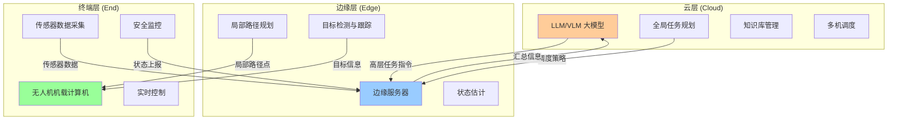
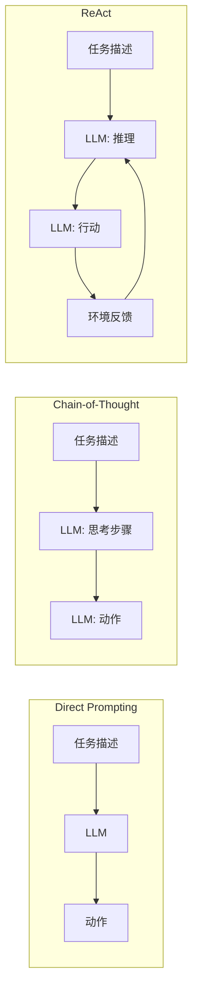
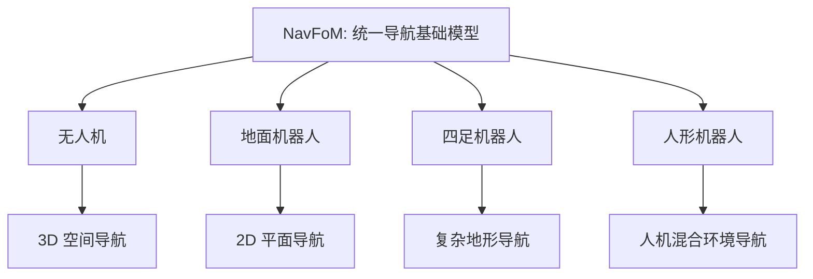
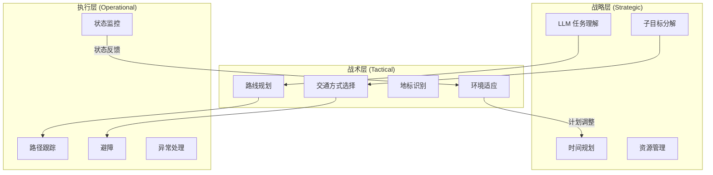
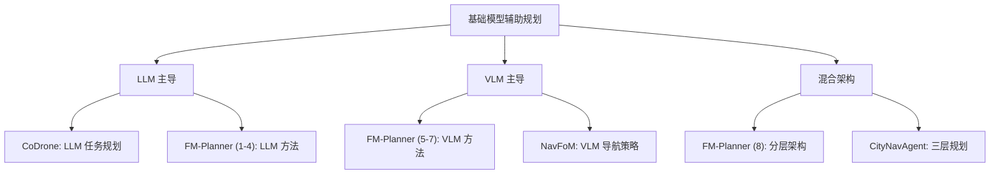
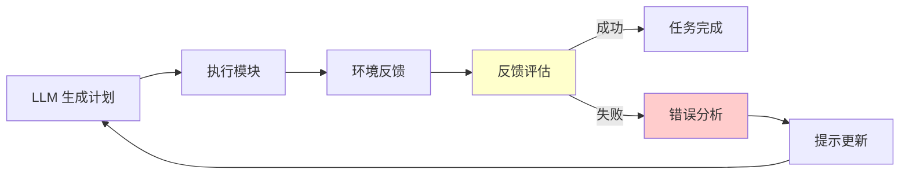

# 基础模型辅助规划：LLM/VLM 驱动的无人机智能决策

> **预计阅读：18 分钟 | 前置知识：大语言模型基础、无人机任务规划概念、强化学习基础**

---

## 1. 引言：从端到端到人机协同

前几节介绍的 VLA 模型采用端到端范式，直接从视觉和语言映射到动作。然而，在许多实际应用场景中，完全端到端的方案可能不是最优选择——复杂任务需要显式的规划和推理能力，而这正是大语言模型（LLM）和视觉语言模型（VLM）的强项。

基础模型辅助规划（Foundation Model-Assisted Planning）代表了另一种技术路线：利用 LLM/VLM 的强大推理能力进行高层任务规划和决策，而将低层控制交给传统的控制器或专门的策略网络。

```
端到端 VLA 范式：
  (图像 + 语言) → VLA 模型 → 动作
  优点：简洁，端到端优化
  缺点：可解释性差，难以融入先验知识

基础模型辅助规划范式：
  (图像 + 语言) → LLM/VLM → 高层规划 → 低层控制器 → 动作
  优点：可解释，可融入知识，模块化
  缺点：模块间信息损失，延迟更大
```

本节将介绍四个代表性工作：CoDrone、FM-Planner、NavFoM 和 CityNavAgent。

---

## 2. CoDrone：云边端协同的智能无人机框架

> **论文**：CoDrone: A Cloud-Edge-End Collaborative Framework for Intelligent UAV Systems
> **来源**：arXiv:2512.19083, IEEE Internet of Things Journal, 2024/2025
> **核心创新**：云边端三层架构，LLM 驱动的任务规划

### 2.1 问题动机

现代无人机系统面临一个核心矛盾：
- **任务复杂性**：实际应用中的任务越来越复杂（多机协同、长时任务、动态环境）
- **机载算力有限**：无人机的载重和功耗限制了机载计算能力

CoDrone 通过 **云边端协同**（Cloud-Edge-End Collaboration）架构解决这一矛盾：将不同计算需求的任务分配到不同层级的计算节点上。

### 2.2 三层架构



**云层**负责需要大模型推理能力的任务：
- 理解用户的高层任务描述（如"搜索整个区域并标记可疑目标"）
- 将复杂任务分解为子任务序列
- 管理多架无人机的协同调度
- 维护和更新知识库

**边缘层**负责需要中等计算能力的任务：
- 局部路径规划和避障
- 视觉目标检测和跟踪
- 状态估计和数据融合
- 与云端的通信中继

**终端层**负责需要实时性的任务：
- 飞行控制器的高频控制循环
- 传感器数据的实时采集
- 安全监控和紧急处理

### 2.3 LLM 驱动的任务规划

CoDrone 的核心创新在于使用 LLM 作为任务规划器。LLM 接收用户的自然语言任务描述，结合当前环境信息和无人机状态，生成结构化的任务计划。

```
用户输入: "在灾区搜索幸存者，优先搜索建筑废墟区域"

LLM 任务规划输出:
{
  "task": "search_and_rescue",
  "priority_areas": ["building_rubble_zone_A", "building_rubble_zone_B"],
  "subtasks": [
    {
      "id": 1,
      "action": "fly_to",
      "target": "building_rubble_zone_A",
      "altitude": 30,
      "pattern": "lawn_mower"
    },
    {
      "id": 2,
      "action": "search",
      "method": "thermal_visual_fusion",
      "duration": 300
    },
    {
      "id": 3,
      "action": "report",
      "condition": "if_survivor_detected",
      "content": "location_and_image"
    },
    ...
  ]
}
```

### 2.4 IEEE IoT Journal 的贡献

作为发表在 IEEE Internet of Things Journal 上的工作，CoDrone 的贡献在于：
- 提出了 LLM 与无人机系统集成的系统性框架
- 实际部署了云边端三层架构
- 验证了 LLM 在真实无人机任务规划中的有效性
- 讨论了通信延迟和可靠性等实际工程问题

---

## 3. FM-Planner：基础模型规划器的系统性比较

> **论文**：FM-Planner: A Systematic Comparison of Foundation Model-Based Planners for UAV Navigation
> **来源**：arXiv:2505.20783, NTU (南洋理工大学), 2025
> **GitHub**：[NTU-ICG/FM-Planner](https://github.com/NTU-ICG/FM-Planner)
> **核心贡献**：8 种 LLM/VLM 方法的系统性比较

### 3.1 研究动机

随着 LLM/VLM 的快速发展，越来越多的研究尝试将这些基础模型应用于无人机导航。然而，不同方法使用不同的模型、不同的提示策略、不同的评测基准，导致难以进行公平比较。

FM-Planner 的目标是提供一个 **标准化的评测框架**，在相同条件下系统性地比较各种基于基础模型的规划方法。

### 3.2 评测的 8 种方法

FM-Planner 比较了 8 种不同的 LLM/VLM 规划方法：

| 方法编号 | 方法名称 | 模型类型 | 核心思路 |
|---------|---------|---------|---------|
| 1 | Direct Prompting | LLM | 直接用 LLM 生成动作 |
| 2 | Chain-of-Thought | LLM | 思维链推理后生成动作 |
| 3 | ReAct | LLM | 推理-行动交替进行 |
| 4 | SayCan | LLM + 价值函数 | LLM 规划 + 可行性评估 |
| 5 | VLM-Direct | VLM | 直接从图像生成动作 |
| 6 | VLM-Describe | VLM + LLM | VLM 描述场景，LLM 规划 |
| 7 | VLM-Reason | VLM | VLM 进行视觉推理后规划 |
| 8 | Hierarchical | VLM + LLM + 控制器 | 分层架构 |

### 3.3 方法详解

**方法 1-3：纯 LLM 方法**



**方法 4：SayCan**

SayCan 的核心思想是将 LLM 的语义理解能力与环境相关的"可行性函数"结合。LLM 负责理解"应该做什么"，可行性函数负责评估"能做什么"。

```
最终得分 = LLM 语义得分 × 可行性得分

示例：
  指令: "把杯子放到桌子上"
  LLM 语义得分: pick_up_cup = 0.9, go_to_table = 0.8
  可行性得分: pick_up_cup = 0.7 (杯子在可达范围内), go_to_table = 0.3 (桌子较远)
  最终得分: pick_up_cup = 0.63, go_to_table = 0.24
  选择: pick_up_cup (先捡起杯子)
```

**方法 5-7：VLM 方法**

VLM 方法直接处理视觉输入，不需要额外的场景描述步骤。VLM-Describe 先用 VLM 描述场景再用 LLM 规划，VLM-Reason 则让 VLM 直接进行视觉推理。

**方法 8：分层架构**

分层架构将规划分为三个层次：
1. VLM 进行场景理解
2. LLM 进行任务规划
3. 低层控制器执行动作

### 3.4 评测结果

FM-Planner 的评测结果揭示了几个重要发现：

| 方法 | 任务成功率 | 推理延迟 | 泛化能力 | 可解释性 |
|------|----------|---------|---------|---------|
| Direct Prompting | 45% | 低 | 低 | 低 |
| Chain-of-Thought | 62% | 中 | 中 | 高 |
| ReAct | 68% | 高 | 中 | 高 |
| SayCan | 71% | 中 | 中 | 中 |
| VLM-Direct | 58% | 中 | 高 | 低 |
| VLM-Describe | 72% | 高 | 高 | 高 |
| VLM-Reason | 74% | 中 | 高 | 中 |
| Hierarchical | 78% | 高 | 高 | 高 |

**关键发现：**
1. VLM 通常优于纯 LLM，因为可以直接处理视觉信息
2. Chain-of-Thought 推理显著提升性能（+17% vs Direct Prompting）
3. 分层架构性能最好但延迟最高
4. 没有单一方法在所有指标上都最优——需要根据具体需求选择

### 3.5 开源贡献

FM-Planner 在 GitHub 上开源（[NTU-ICG/FM-Planner](https://github.com/NTU-ICG/FM-Planner)），提供了：
- 标准化的评测框架
- 8 种方法的统一实现
- 多个评测环境
- 详细的复现指南

---

## 4. NavFoM：跨具身导航基础模型

> **论文**：NavFoM: A Foundation Model for Cross-Embodiment Navigation
> **来源**：arXiv:2509.12129, PKU (北京大学), 2025
> **核心创新**：跨具身导航，8M 训练样本

### 4.1 核心思想

NavFoM（Navigation Foundation Model）由北京大学提出，旨在训练一个 **跨具身**（Cross-Embodiment）的导航基础模型——同一个模型可以为不同形态的机器人（无人机、地面机器人、四足机器人等）提供导航能力。



### 4.2 跨具身挑战

不同形态机器人的导航面临不同的挑战：

| 机器人形态 | 运动空间 | 传感器 | 约束 |
|-----------|---------|--------|------|
| 无人机 | 3D | 下视/前置摄像头, IMU | 功耗、安全 |
| 地面机器人 | 2D | 前置摄像头, LiDAR | 地形、障碍 |
| 四足机器人 | 2.5D | 深度相机, 关节编码器 | 地形适应 |
| 人形机器人 | 3D | 多视角摄像头 | 平衡、碰撞 |

NavFoM 的解决方案是学习一种 **与具身无关** 的导航表征，将不同机器人的观测和动作映射到统一的表征空间。

### 4.3 大规模训练数据

NavFoM 使用了 **800 万（8M）** 训练样本，数据来源包括：

| 数据来源 | 样本数量 | 机器人类型 |
|---------|---------|-----------|
| 仿真数据 (Habitat) | 3M | 地面机器人 |
| 仿真数据 (AirSim) | 1.5M | 无人机 |
| 真实数据 (公开数据集) | 2M | 混合 |
| 合成数据 (程序生成) | 1.5M | 混合 |

大规模多平台数据是 NavFoM 实现跨具身泛化的关键。

### 4.4 架构设计

NavFoM 的架构包含三个核心模块：

```
NavFoM 架构：

[多模态输入]
  - 图像（前置/下视/多视角）
  - 语言指令
  - 状态信息（高度、速度、关节角度等）
        |
[统一编码器]
  - 视觉编码器（处理不同视角的图像）
  - 语言编码器（处理自然语言指令）
  - 状态编码器（处理异构状态信息）
        |
[跨具身 Transformer]
  - 共享的注意力层
  - 具身特定的适配层
        |
[动作解码器]
  - 具身特定的动作头
  - 无人机: (vx, vy, vz, ωz)
  - 地面机器人: (v, ω)
  - 四足机器人: 关节角度序列
```

### 4.5 实验结果

NavFoM 在多个导航基准上展示了强大的跨具身泛化能力：

| 测试平台 | NavFoM | 专用模型 | 通用模型 |
|---------|--------|---------|---------|
| 无人机 (Habitat) | 82% | 85% | 61% |
| 地面机器人 (Habitat) | 79% | 83% | 58% |
| 四足机器人 (自建) | 75% | 80% | 45% |
| 跨平台平均 | 79% | 83% | 55% |

NavFoM 的性能接近专用模型（差距约 4-5%），但远超通用模型（提升约 24%），展示了跨具身泛化的可行性。

---

## 5. CityNavAgent：城市级导航智能体

> **论文**：CityNavAgent: A Hierarchical Planning Framework for Urban Navigation
> **来源**：ACL 2025
> **核心创新**：层次化规划，城市级导航

### 5.1 从室内到城市

大多数导航研究聚焦于室内或小范围户外场景。CityNavAgent 将导航规模扩展到 **城市级别**——在真实城市环境中，根据自然语言指令进行长距离导航。

```
场景示例：
  指令: "从公司出发，先去咖啡店买杯咖啡，然后去邮局寄包裹，最后到公园与朋友汇合"
  
  挑战：
  - 多个中间目标
  - 城市级路径规划
  - 交通规则约束
  - 动态环境（行人、车辆）
  - 时间约束（咖啡店营业时间）
```

### 5.2 层次化规划架构

CityNavAgent 采用三层规划架构：



**战略层**（LLM 驱动）：
- 理解用户的高层意图
- 将复杂任务分解为子目标序列
- 考虑时间、资源等约束
- 处理异常情况（如咖啡店关门）

**战术层**（VLM + 规划器）：
- 为每个子目标规划具体路线
- 选择合适的交通方式
- 识别和利用地标进行导航
- 适应环境变化

**执行层**（控制器）：
- 跟踪规划的路径
- 实时避障
- 监控系统状态
- 处理紧急情况

### 5.3 ACL 2025 的贡献

作为发表在 ACL（自然语言处理顶会）上的工作，CityNavAgent 的贡献在于：
- 将自然语言理解与城市级导航结合
- 提出了层次化规划的有效框架
- 构建了城市级导航的评测基准
- 展示了 LLM 在复杂现实场景中的规划能力

---

## 6. 四种方法的全面对比

### 6.1 核心特性对比

| 特性 | CoDrone | FM-Planner | NavFoM | CityNavAgent |
|------|---------|------------|--------|-------------|
| 发表来源 | IEEE IoT Journal | arXiv + GitHub | arXiv | ACL 2025 |
| 核心关注点 | 系统架构 | 方法比较 | 跨具身泛化 | 城市级规划 |
| LLM/VLM 角色 | 任务规划器 | 被评测对象 | 导航策略 | 层次化规划 |
| 规划层次 | 云边端分层 | 单层或多层 | 端到端 | 三层层次化 |
| 适用范围 | 系统级部署 | 研究评测 | 多机器人 | 城市导航 |
| 开源 | 部分 | 完整 | 部分 | 部分 |

### 6.2 技术路线对比



---

## 7. 基础模型辅助规划的关键技术

### 7.1 提示工程（Prompt Engineering）

提示的质量对 LLM/VLM 的规划性能有巨大影响。有效的提示通常包含：

```
提示模板：

[角色定义]
你是一个无人机任务规划专家...

[环境描述]
当前环境：{环境信息}
无人机状态：{状态信息}
可用传感器：{传感器列表}

[任务约束]
安全约束：{安全规则}
时间约束：{时间限制}
资源约束：{电量、带宽等}

[输出格式]
请以 JSON 格式输出任务计划...

[示例]
输入: ...
输出: ...
```

### 7.2 反馈机制

基础模型规划的一个关键问题是 **幻觉**（Hallucination）——模型可能生成看起来合理但实际上不可行的计划。反馈机制是解决这一问题的关键：



### 7.3 知识增强

将领域知识融入基础模型的规划过程，可以显著提升规划质量：

- **地图知识**：城市地图、建筑布局
- **常识知识**："下雨时应该飞低"、"人群密集区应减速"
- **安全知识**：禁飞区、最低安全高度
- **任务知识**：特定任务的标准操作流程

---

## 8. 关键论文

| 论文 | 来源 | 关键贡献 | 链接 |
|------|------|---------|------|
| CoDrone | IEEE IoT Journal, arXiv:2512.19083 | 云边端架构，LLM 任务规划 | arXiv:2512.19083 |
| FM-Planner | NTU, arXiv:2505.20783 | 8 种方法系统比较 | [GitHub](https://github.com/NTU-ICG/FM-Planner) |
| NavFoM | PKU, arXiv:2509.12129 | 跨具身导航，8M 样本 | arXiv:2509.12129 |
| CityNavAgent | ACL 2025 | 城市级层次化规划 | ACL 2025 |

---

## 9. 延伸阅读

- [01-VLA架构演进](./01-VLA架构演进.md) — 理解端到端 VLA 与基础模型辅助规划的互补关系
- [03-语言条件飞行控制](./03-语言条件飞行控制.md) — 语言如何直接驱动飞行控制
- [05-机载部署与优化](./05-机载部署与优化.md) — 云边端架构中边缘和终端的部署技术
- [02-世界模型专题](../02-世界模型专题/) — 世界模型如何增强基础模型的环境理解能力

---

## 10. 思考题

**题目 1：端到端 VLA vs. 基础模型辅助规划**

在什么场景下应该选择端到端 VLA，什么场景下应该选择基础模型辅助规划？请列出至少 3 个决策因素。

<details>
<summary>参考答案</summary>

**选择端到端 VLA 的场景：**
- 任务相对简单，直接感知-动作映射即可（如简单的视觉跟踪）
- 需要高频控制输出（端到端延迟更低）
- 训练数据充足，且与部署场景分布匹配
- 对可解释性要求不高

**选择基础模型辅助规划的场景：**
- 任务复杂，需要多步推理和规划（如搜索救援）
- 需要融入先验知识（地图、常识、安全规则）
- 需要可解释性（用户需要理解无人机的决策过程）
- 训练数据稀缺，但 LLM/VLM 有相关知识
- 需要处理长时任务和异常情况

**关键决策因素：**
1. **任务复杂度**：简单任务用 VLA，复杂任务用规划
2. **实时性要求**：高频控制用 VLA，低频规划用 LLM
3. **可解释性需求**：安全关键场景需要可解释的规划
4. **数据可用性**：数据少时利用 LLM 知识，数据多时用端到端学习
5. **部署约束**：机载算力有限时，边缘-云架构更合适
</details>

---

**题目 2：FM-Planner 的实验发现**

FM-Planner 发现分层架构（VLM + LLM + 控制器）性能最好但延迟最高。在实际无人机部署中，如何优化这种架构的延迟？

<details>
<summary>参考答案</summary>

**延迟优化策略：**

1. **并行化处理**：
   - VLM 场景理解和 LLM 任务规划可以部分并行（流水线化）
   - 当 LLM 在规划当前子任务时，VLM 可以提前处理下一阶段的视觉输入

2. **缓存与复用**：
   - 相似场景的 VLM 场景描述可以缓存复用
   - LLM 的规划结果可以缓存，遇到相似任务时直接调用

3. **模型压缩**：
   - 使用量化（INT8/INT4）减少模型大小和推理时间
   - 使用知识蒸馏将大模型的能力迁移到小模型

4. **异步规划**：
   - 高层规划异步进行，低层控制器使用最新的可用规划
   - 在等待新规划时，使用简单的局部控制器维持飞行

5. **预测性规划**：
   - 预测未来可能的场景，提前进行规划
   - 类似于计算机体系结构中的分支预测

6. **分层频率**：
   - 高层规划低频（1-5 Hz）
   - 中层战术中频（10-20 Hz）
   - 低层控制高频（50-200 Hz）
</details>

---

**题目 3：NavFoM 的跨具身泛化**

NavFoM 实现了跨具身导航，但性能仍低于专用模型（约 4-5% 差距）。请分析这个差距的可能来源，并提出缩小差距的方法。

<details>
<summary>参考答案</summary>

**差距来源分析：**

1. **表征冲突**：不同机器人的观测和动作空间差异大，统一表征可能无法同时最优地表示所有具身
2. **数据分布不均**：某些机器人的训练数据可能较少（如四足机器人），导致该平台性能偏低
3. **动作空间异构**：不同机器人的动作空间维度和语义不同，共享的动作解码器可能不够灵活
4. **传感器差异**：不同机器人的传感器配置差异大（如无人机有下视摄像头，地面机器人没有）
5. **动力学差异**：不同机器人的运动约束不同（如无人机可以原地悬停，地面机器人不能）

**缩小差距的方法：**

1. **适配层优化**：为每个具身设计更精细的适配层，而非简单共享
2. **数据平衡**：通过数据增强或主动学习平衡不同具身的训练数据
3. **分层共享**：底层特征（如边缘、纹理）共享，高层语义（如导航策略）具身特定
4. **元学习**：使用元学习框架，使模型能够快速适应新具身
5. **混合训练**：先在大规模混合数据上预训练，再在各具身数据上微调
</details>

---

> **下一节**：[05-机载部署与优化](./05-机载部署与优化.md) — 了解如何将这些模型部署到无人机机载平台
