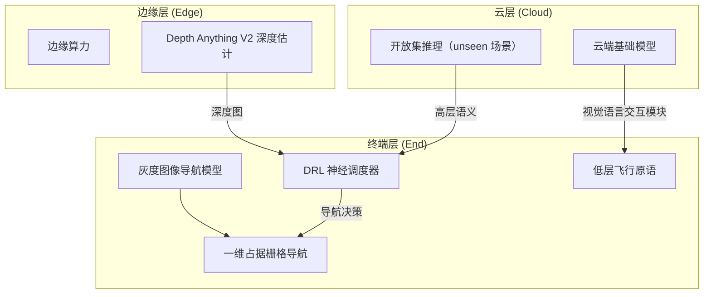
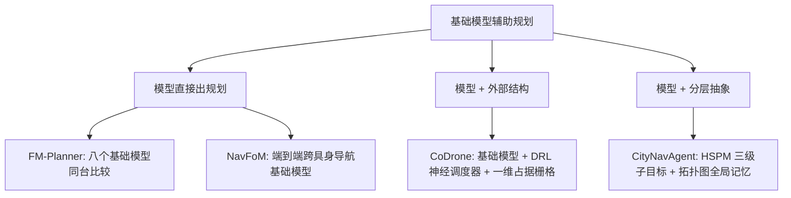
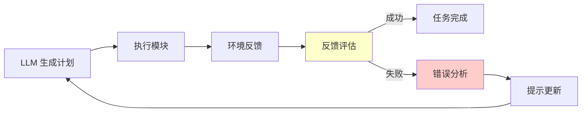

# 基础模型辅助规划：LLM/VLM 驱动的无人机智能决策

> **预计阅读：22 分钟 | 前置知识：大语言模型基础、无人机任务规划概念、强化学习基础**

---

## 1. 从端到端到人机协同

前几节介绍的 VLA 模型采用端到端范式，直接从视觉和语言映射到动作。然而，在许多实际应用场景中，完全端到端的方案可能不是最优选择——复杂任务需要显式的规划和推理能力，而这正是大语言模型（LLM）和视觉语言模型（VLM）的强项。

基础模型辅助规划（Foundation Model-Assisted Planning）代表了另一种技术路线：利用 LLM/VLM 的强大推理能力进行高层任务规划和决策，而将低层控制交给传统的控制器或专门的策略网络。

```
端到端 VLA 范式：
  (图像 + 语言) → VLA 模型 → 动作
  优点：简洁，端到端优化
  缺点：可解释性差，难以融入先验知识

基础模型辅助规划范式：
  (图像 + 语言) → LLM/VLM → 高层规划 → 低层控制器 → 动作
  优点：可解释，可融入知识，模块化
  缺点：模块间信息损失，延迟更大
```

这一类有四个代表工作：CoDrone、FM-Planner、NavFoM 和 CityNavAgent。

---

## 2. CoDrone：云边端协同的智能无人机框架

> **论文**：CoDrone: Autonomous Drone Navigation Assisted by Edge and Cloud Foundation Models
> **来源**：arXiv:2512.19083, IEEE Internet of Things Journal（已接收）
> **核心创新**：云边端协同框架，DRL 神经调度器 + VLM 交互模块

### 2.1 问题动机

现代无人机系统面临一个核心矛盾：
- **任务复杂性**：实际应用中的任务越来越复杂（多机协同、长时任务、动态环境）
- **机载算力有限**：无人机的载重和功耗限制了机载计算能力

CoDrone 通过 **云边端协同**（Cloud-Edge-End Collaboration）架构解决这一矛盾：将不同计算需求的任务分配到不同层级的计算节点上。

### 2.2 三层架构


```mermaid
graph TB
    subgraph "云层 (Cloud)"
        C1["云端基础模型"]
        C2["开放集推理（unseen 场景）"]
    end

    subgraph "边缘层 (Edge)"
        E1["边缘算力"]
        E2["Depth Anything V2 深度估计"]
    end

    subgraph "终端层 (End)"
        EN1["灰度图像导航模型"]
        EN2["一维占据栅格导航"]
        EN3["DRL 神经调度器"]
        EN4["低层飞行原语"]
    end

    C1 -->|"视觉语言交互模块"| EN4
    C2 -->|"高层语义"| EN3
    E2 -->|"深度图"| EN3
    EN3 -->|"导航决策"| EN2
    EN1 --> EN2
```

**云层**承担开放集推理：把基础模型（VLM）接进来，处理训练分布之外的复杂场景理解。

**边缘层**只做一件事——用 Depth Anything V2 做深度估计。论文的取舍是：机载导航模型只用**灰度图像**降低计算与传输开销，需要更细的环境感知时再向边缘侧要深度。

**终端层**（机载）跑灰度导航模型、一维占据栅格表示与 DRL 神经调度器。**一维占据栅格**是这篇的一个具体设计：把三维场景压成一维占据表示，简化导航问题的表达能力。

### 2.3 DRL 神经调度器与视觉语言交互模块

CoDrone 里真正承担"把深度估计接进导航决策"的是**基于深度强化学习的神经调度器**（DRL-based neural scheduler）：它在深度图与导航动作之间做实时适配，让系统能对动态环境作出反应，而不是预先写死一套规则。

基础模型与无人机之间的接口是**无人机专用的视觉语言交互模块**（UAV-specific vision language interaction module）。它把领域定制的**低层飞行原语**（low-level flight primitives）暴露给云端基础模型，使后者不必直接输出电机指令也能下达可执行的飞行动作。摘要里给这个模块的理由是引入 VLM 之后的**开放集推理能力**——在没见过的复杂场景里仍能给出合理判断。

实验结论：论文报的是在**不同飞行速度与网络条件**下优于基线，**平均飞行距离提升 40%**、**平均 Quality of Navigation 提升 5%**。

### 2.4 IEEE IoT Journal 的贡献

作为发表在 IEEE Internet of Things Journal 上的工作，CoDrone 的贡献在于：
- 提出首个把基础模型接进自主巡航的**云边端协同计算框架**
- 用灰度图像 + 边缘深度估计 + 一维占据栅格压住机载开销
- 用 DRL 神经调度器把深度估计与导航决策连起来
- 给出一条可落地的接口：VLM 通过低层飞行原语与无人机交互

---

## 3. FM-Planner：基础模型规划器的系统性比较

> **论文**：FM-Planner: Foundation Model Guided Path Planning for Autonomous Drone Navigation
> **来源**：arXiv:2505.20783, NTU (南洋理工大学), 2025
> **GitHub**：[NTU-ICG/FM-Planner](https://github.com/NTU-ICG/FM-Planner)
> **核心贡献**：八个代表性 LLM/VLM 模型的标准化比较，外加一个实机验证的集成规划器

### 3.1 研究动机

随着 LLM/VLM 的快速发展，越来越多的研究尝试将这些基础模型应用于无人机导航。然而，不同方法使用不同的模型、不同的提示策略、不同的评测基准，导致难以进行公平比较。

FM-Planner 的目标是提供一个 **标准化的评测框架**，在相同条件下系统性地比较各种基于基础模型的规划方法。

### 3.2 评测的八个基础模型

FM-Planner 在标准化仿真场景里评的是**八个具体的 LLM/VLM 模型**，而不是八种提示策略。摘要的说法是 *"we first systematically evaluate eight representative LLM and VLM approaches using standardized simulation scenarios"*。论文里出现的模型包括 Llama-3.1-8B-Instruct、DeepSeek-R1、Qwen-2.5（7B / 32B）、Gemma 等，对照组是经典的 A*、RRT 与 Q-learning 规划器。

### 3.3 从比较到落地：集成 LLM-Vision 规划器

这篇论文的工作分两步。第一步是比较：在标准化仿真场景里把八个基础模型和经典规划器放在同一套任务上跑。第二步是落地：为了让规划能实时执行，论文设计了一个**集成的 LLM-Vision 规划器**（integrated LLM-Vision planner），把语义推理和视觉感知拼在一起，然后在多种配置下做了**实机实验**。

论文报告的关键对比是一个"反直觉"的结果：**Llama-3.1-8B-Instruct 在两个场景里都追平了最优的 A* 规划器**，成功率 100%；而参数量大得多的 **DeepSeek-R1 在全部 10 次试验中都失败**。摘要里给出的定调是 *"In both scenarios, Llama-3.1-8B-Instruct matches the optimal A* planner"* 与 *"DeepSeek-R1 fails in all 10 trials"*。

这个结果比"哪个模型更强"更有信息量：在全局路径规划这种需要严格空间推理的任务上，**模型规模不是决定性变量**，推理链的组织方式才是。

### 3.4 论文报告的结论

论文的结论只有三条，都是定性的：
1. 基础模型用在全局路径规划上是**可行**的，但不是所有模型都可行
2. 比较研究的价值在于暴露"哪些模型能落、哪些不能落"，而非排名
3. 实机部署验证了集成规划器可用

### 3.5 开源贡献

FM-Planner 在 GitHub 上开源（[NTU-ICG/FM-Planner](https://github.com/NTU-ICG/FM-Planner)）。摘要给出的项目主页即是该仓库。

---

## 4. NavFoM：跨具身导航基础模型

> **论文**：Embodied Navigation Foundation Model
> **来源**：arXiv:2509.12129, PKU (北京大学), 2025
> **项目页**：[pku-epic.github.io/NavFoM-Web](https://pku-epic.github.io/NavFoM-Web/)
> **核心创新**：跨具身**且跨任务**的导航基础模型，8M 训练样本

### 4.1 核心思想

NavFoM（Navigation Foundation Model）由北京大学提出，训练一个**跨具身同时跨任务**的导航基础模型：同一个模型覆盖四足机器人、无人机、轮式机器人与车辆，任务面覆盖视觉语言导航、物体搜索、目标跟踪与自动驾驶。

论文对动机的表述是：通用 VLM 在一般视觉语言任务上零样本表现很好，但**在具身导航上的泛化仍被限制在窄任务与具身专用架构里**。NavFoM 要打破的正是这层限制——它在公开基准上**不做任务特定的微调**就达到 SOTA 或接近 SOTA。

注意"跨具身"在这里不是比喻：训练数据里确实有无人机。

### 4.2 要解决的两件事

跨具身导航的具体难点不是"动作空间不同"这么简单，而是：

- **相机配置不同**：不同具身的相机数量、安装位置、视角都不同
- **导航时程不同**：短程反应式导航与长程指令跟随需要不同的时间上下文

NavFoM 对这两件事各给了一个机制，见 §4.3。

### 4.3 架构：识别符 token + 采样预算

NavFoM 的架构要点有三条，都写在摘要里：

1. **统一的架构**处理来自不同相机配置、不同导航时程的多模态导航输入。
2. **识别符 token**（identifier tokens）：把具身的相机视角信息与任务的时间上下文嵌进 token 里。这是"跨具身"落地的关键——相机配置和时程不再是架构的输入参数，而是被编码进模型内部。
3. **动态调整的采样策略**：在**受限的 token 长度预算**下统一控制所有观测 token。这条对应的是实机部署需求——观测 token 会随序列长度膨胀，必须有一个全局预算来压。

### 4.4 训练数据

NavFoM 的训练数据规模是 **800 万（8M）条导航样本**，覆盖四足机器人、无人机、轮式机器人与车辆；任务涵盖视觉语言导航、物体搜索、目标跟踪与自动驾驶。摘要的原话是 *"trained on eight million navigation samples that encompass quadrupeds, drones, wheeled robots, and vehicles"*。

### 4.5 结果口径

论文的结论是定性的：在多个导航任务与多种具身上**达到 SOTA 或极具竞争力**，且**无需任务特定的微调**；另有实机实验验证泛化能力。摘要没有给出按具身拆分的成功率数字。

---

## 5. CityNavAgent：空中视觉语言导航

> **论文**：CityNavAgent: Aerial Vision-and-Language Navigation with Hierarchical Semantic Planning and Global Memory（[arXiv:2505.05622](https://arxiv.org/abs/2505.05622)）
> **来源**：arXiv:2505.05622（发表去向未在 arXiv 元数据中标出）
> **代码**：[VinceOuti/CityNavAgent](https://github.com/VinceOuti/CityNavAgent)
> **核心创新**：层次语义规划（HSPM）+ 拓扑图全局记忆

### 5.1 空中 VLN 的两个难点

CityNavAgent 做的是**空中**视觉语言导航（aerial VLN）：无人机在连续的城市环境里按自然语言指令飞行。论文指出，地面 VLN 的成熟方法搬到空中会失效，原因是两条：

- **没有预定义的导航图**：地面 VLN 常依赖预先建好的导航图（可通行点、边），空中没有这样的图可用
- **长时程探索下动作空间指数膨胀**：飞到高空后，可行方向与位置组合迅速变大

### 5.2 两个模块

**（一）层次语义规划模块 HSPM**。把一个长时程任务分解成不同语义层次的子目标，再用 LLM 的不同能力去达成不同层次的子目标，逐步逼近最终目标。论文的表述是 *"we design a hierarchical semantic planning module (HSPM) that decomposes the long-horizon task into sub-goals with different semantic levels"*，三个层次是 landmark 级、object 级、motion 级。

**（二）全局记忆模块**。把历史轨迹存进一张**拓扑图**，用它简化"已经到过的目标"的导航——不需要每次从零重新规划。

两个模块配合，在连续城市场景的基准上取得 SOTA，且论文有模块消融实验验证各自的作用。

### 5.3 这篇的位置

CityNavAgent 是"LLM 直接当规划器"这一路里少见的**明确针对空中**的工作。它和 FM-Planner 的区别在于：FM-Planner 评的是"哪个模型适合做全局路径规划"，CityNavAgent 关心的是"长时程、无先验导航图的空中探索该怎么组织"。

---

## 6. 四种方法的全面对比

### 6.1 核心特性对比

| 特性 | CoDrone | FM-Planner | NavFoM | CityNavAgent |
|------|---------|------------|--------|-------------|
| 发表来源 | IEEE IoT Journal | arXiv（投稿中） | arXiv | arXiv |
| 核心关注点 | 云边端协同框架 | 基础模型规划器比较 | 跨具身跨任务导航 | 空中 VLN 的长时程探索 |
| LLM/VLM 角色 | VLM 经低层飞行原语交互 | 被评测对象 | 导航策略本身 | 子目标分解的规划器 |
| 分层方式 | 云 / 边 / 端 | 无（单层） | 无（端到端） | HSPM 三级语义子目标 |
| 无人机适用性 | 巡航导航 | 全局路径规划 | 训练数据含无人机 | 直接针对无人机 |
| 开源 | 未见公开仓库 | 有（NTU-ICG） | 有项目页 | 有（VinceOuti） |

> **这张表的读法**：「发表来源」一列只写 arXiv 元数据能证实的去向；「开源」一列只区分"论文给了公开链接"与"没给"，**不代表仓库内容的完整度经过核实**。

### 6.2 技术路线对比


```mermaid
graph TB
    A["基础模型辅助规划"] --> B["模型直接出规划"]
    A --> C["模型 + 外部结构"]
    A --> D["模型 + 分层抽象"]

    B --> B1["FM-Planner: 八个基础模型同台比较"]
    B --> B2["NavFoM: 端到端跨具身导航基础模型"]

    C --> C1["CoDrone: 基础模型 + DRL 神经调度器 + 一维占据栅格"]

    D --> D1["CityNavAgent: HSPM 三级子目标 + 拓扑图全局记忆"]
```

---

## 7. 2026 年的两条分层路线

本篇前面四个方法都是分层的，但"分层"这个词盖住了至少两种不同的切法。2026 年两条新工作把切法写清楚了，而且分别落在**离线**和**在线**两侧 —— 这是本节要立的那根轴。

### 7.1 FlyMirage：LLM 当场景设计师，规划器保可行性

**[arXiv'26.05] FlyMirage** — *FlyMirage: A Fully Automated Generation Pipeline for Diverse and Scalable UAV Flight Data via Generative World Model*（[arXiv:2605.19600](https://arxiv.org/abs/2605.19600)，2026-05-19）。它要解决的是空中 VLN 数据集的老问题：规模、多样性、真实感三者难兼得，只能依赖昂贵的真实场景或视觉受限的仿真。

管线分四段：**LLM 当环境设计师**提出场景设计以保证多样性，**生成式世界模型**把这些设计实例化成高保真 3DGS 场景，再自动完成场景探索与语义信息获取，最后接一个**动力学可行规划器**生成无人机轨迹。用这条工具链产出一个大规模、多样、照片级真实的空中 VLN 数据集，并在其上微调 π₀：在完全未见过的环境中，仿真与真机上的导航能力都涨了。

**它对本篇的含义是把规划器用在了造数据上。** LLM 与规划器都不在推理回路里 —— 它们的产品是数据集，不是动作。这正好是 [10 篇](./10-世界模型增强VLA.md) 第 2 节四种用法里的"当数据源"，也说明同一套"慢推理 + 几何兜底"的结构既可以服务执行，也可以服务数据生成。

### 7.2 FLIGHT VLA：慢 VLM 与快扩散策略的异步解耦

**[arXiv'26.06] Think Like a Pilot** — *Think Like a Pilot: Fine-Grained Long-Horizon UAV Navigation*（[arXiv:2606.06836](https://arxiv.org/abs/2606.06836)，2026-06-05）。它先指出两个缺口：语言引导的 UAV 智能体要执行长时程语义指令并输出平滑、物理可行的连续飞行指令，但现有 VLN 基准用的是离散或粗粒度动作，而现有 UAV VLA 任务又偏短、偏原子化。

贡献分两层：

- **基准 FLIGHT**：多阶段指令配密集 6-DoF 轨迹标注，两个划分分别是细粒度 VLN 与长时程 Flow。
- **架构 FLIGHT VLA**：异步解耦 —— **低频的 Streaming Pilot VLM** 负责任务状态推理与任务规划，**高频的扩散动作模型**负责连续控制，中间用显式的 **Pilot Reasoning** 文本做监督，这些文本总结当前飞行状态并预告下一个子目标。

这和第 7.1 节是同一个思路的两种实现：都把"慢的部分"和"快的部分"拆开，区别在拆开的对象 —— FlyMirage 拆的是**数据生成与执行**（离线），FLIGHT 拆的是**推理与控制**（在线，异步）。前者省的是采集成本，后者省的是实时性预算。

### 7.3 一条共同点

把本篇六个方法按"分层切在哪"排一遍，会看到一条贯穿的约束：**没有一条路线让神经网络单独决定飞不飞。** CoDrone 用云端兜算力、FM-Planner 用规划器兜可行性、CityNavAgent 用层次化智能体兜长时程、FlyMirage 用动力学规划器兜数据、FLIGHT VLA 用低频 VLM 兜任务状态。[08-研究前沿与开放问题/04-最新进展与团队追踪](../08-研究前沿与开放问题/04-最新进展与团队追踪.md) §4.1 从团队侧读出了同一件事（浙大用几何规划器与安全滤波器、北航用显式推理链、VLA-AN 用 GSC 层）。

**这条约束对做真机的直接含义：架构里必须留出这一层。** 它不是保守，而是目前所有能上机的工作都收敛到的共识；[05 篇](./05-机载部署与优化.md) §5 讲的就是这一层具体怎么实现。

---

## 8. 基础模型辅助规划的关键技术

### 7.1 提示工程（Prompt Engineering）

提示的质量对 LLM/VLM 的规划性能有巨大影响。有效的提示通常包含：

```
提示模板：

[角色定义]
你是一个无人机任务规划专家...

[环境描述]
当前环境：{环境信息}
无人机状态：{状态信息}
可用传感器：{传感器列表}

[任务约束]
安全约束：{安全规则}
时间约束：{时间限制}
资源约束：{电量、带宽等}

[输出格式]
请以 JSON 格式输出任务计划...

[示例]
输入: ...
输出: ...
```

### 7.2 反馈机制

基础模型规划的一个关键问题是 **幻觉**（Hallucination）——模型可能生成看起来合理但实际上不可行的计划。反馈机制是解决这一问题的关键：


```mermaid
graph LR
    A["LLM 生成计划"] --> B["执行模块"]
    B --> C["环境反馈"]
    C --> D["反馈评估"]
    D -->|"成功"| E["任务完成"]
    D -->|"失败"| F["错误分析"]
    F --> G["提示更新"]
    G --> A
    
    style D fill:#ffffcc
    style F fill:#ffcccc
```

### 7.3 知识增强

融入规划过程的领域知识有三类：

- **地图知识**：城市地图、建筑布局
- **常识知识**："下雨时应该飞低"、"人群密集区应减速"
- **安全知识**：禁飞区、最低安全高度
- **任务知识**：特定任务的标准操作流程

---

## 9. 关键论文

- **[arXiv'25.12] CoDrone** — *CoDrone: Autonomous Drone Navigation Assisted by Edge and Cloud Foundation Models*  
  [](https://arxiv.org/abs/2512.19083)
  云边端协同，DRL 神经调度器 + VLM 交互模块

- **[arXiv'25.05] FM-Planner** — *FM-Planner: Foundation Model Guided Path Planning for Autonomous Drone Navigation*  
  [](https://arxiv.org/abs/2505.20783) [](https://github.com/NTU-ICG/FM-Planner)
  八个基础模型同台比较 + 实机验证

- **[arXiv'25.09] Embodied Navigation Foundation Model** — *Zhang et al.*  
  [](https://arxiv.org/abs/2509.12129)
  跨具身跨任务导航基础模型，8M 样本

- **[ACL'25] CityNavAgent** — *CityNavAgent: Aerial Vision-and-Language Navigation with Hierarchical Semantic Planning and Global Memory*  
  [](https://arxiv.org/abs/2505.05622) [](https://github.com/VinceOuti/CityNavAgent)
  空中 VLN：HSPM + 拓扑图全局记忆

- **[arXiv'26.05] FlyMirage** — *FlyMirage: A Fully Automated Generation Pipeline for Diverse and Scalable UAV Flight Data via Generative World Model*  
  [](https://arxiv.org/abs/2605.19600)
  LLM 场景设计 + 3DGS + 可行规划器造数据

- **[arXiv'26.06] FLIGHT VLA** — *Think Like a Pilot: Fine-Grained Long-Horizon UAV Navigation*  
  [](https://arxiv.org/abs/2606.06836)
  异步解耦：低频 VLM + 高频扩散策略

---

## 10. 延伸阅读

- [01-VLA架构演进](./01-VLA架构演进.md) — 理解端到端 VLA 与基础模型辅助规划的互补关系
- [03-语言条件飞行控制](./03-语言条件飞行控制.md) — 语言如何直接驱动飞行控制；§7.2 的 FLIGHT VLA 属于这条线
- [05-机载部署与优化](./05-机载部署与优化.md) — 云边端架构中边缘和终端的部署技术，以及 §7.3 说的"必须留出的那一层"怎么实现
- [07-数据、预训练与跨具身](./07-数据、预训练与跨具身.md) — §7.1 的 FlyMirage 造出来的数据要喂给谁、怎么喂
- [10-世界模型增强VLA](./10-世界模型增强VLA.md) — §7.1 那种"LLM + 生成式世界模型"的结构，在第 2 节的四种用法里怎么归类
- [08-研究前沿与开放问题/04-最新进展与团队追踪](../08-研究前沿与开放问题/04-最新进展与团队追踪.md) — 按团队读同一条线，含 FlyMirage 与 FLIGHT 的上下文
- [02-世界模型专题/01-世界模型发展史](../02-世界模型专题/01-世界模型发展史.md) — 世界模型如何增强基础模型的环境理解能力

---

## 11. 思考题

**题目 1：端到端 VLA vs. 基础模型辅助规划**

在什么场景下应该选择端到端 VLA，什么场景下应该选择基础模型辅助规划？请列出至少 3 个决策因素。

<details>
<summary>参考答案</summary>

**选择端到端 VLA 的场景：**
- 任务相对简单，直接感知-动作映射即可（如简单的视觉跟踪）
- 需要高频控制输出（端到端延迟更低）
- 训练数据充足，且与部署场景分布匹配
- 对可解释性要求不高

**选择基础模型辅助规划的场景：**
- 任务复杂，需要多步推理和规划（如搜索救援）
- 需要融入先验知识（地图、常识、安全规则）
- 需要可解释性（用户需要理解无人机的决策过程）
- 训练数据稀缺，但 LLM/VLM 有相关知识
- 需要处理长时任务和异常情况

**关键决策因素：**
1. **任务复杂度**：简单任务用 VLA，复杂任务用规划
2. **实时性要求**：高频控制用 VLA，低频规划用 LLM
3. **可解释性需求**：安全关键场景需要可解释的规划
4. **数据可用性**：数据少时利用 LLM 知识，数据多时用端到端学习
5. **部署约束**：机载算力有限时，边缘-云架构更合适
</details>

---

**题目 2：FM-Planner 的模型选择含义**

FM-Planner 在一个标准化场景里发现：Llama-3.1-8B-Instruct 追平了最优 A* 规划器（成功率 100%），而参数量大得多的 DeepSeek-R1 在全部 10 次试验中失败。假设你要给一个无人机路径规划任务选基础模型，这个结果说明你应该按什么顺序做筛选？

<details>
<summary>参考答案</summary>

**先别按参数量选。** 这个结果最直接的含义是：在需要严格空间推理的规划任务上，「模型更大」既不是必要条件也不是充分条件——8B 的模型可以做到 100%，而更大的推理型模型可以 0%。

**建议的筛选顺序：**

1. **先验任务适配性，再验规模**：把候选模型的排序建立在**同一套标准化任务上的实跑结果**上，而不是参数表或榜单排名。FM-Planner 的价值就在于提供了这样一套同台比较。
2. **推理链的组织方式优先于模型容量**：一个 8B 模型能追平 A*，说明决定上限的是"怎么让它做空间推理"（提示结构、是否给出可验证的中间量），而不是容量。
3. **把"失败模式"当成一等筛选条件**：DeepSeek-R1 的 10/10 失败比任何平均分都更有信息量——规划任务里失败是离散事件，不是可以平均掉的噪声。上线前必须问"它在什么情况下整片失败"。
4. **实机验证不能省**：论文在比较之外还做了集成规划器和实机实验，说明仿真里的排名不足以直接决定部署方案。
</details>


---

**题目 3：NavFoM 的跨具身泛化**

NavFoM 用同一个模型覆盖四足、无人机、轮式机器人与车辆，且声称**不做任务特定微调**就达到 SOTA 或接近 SOTA。请分析"一个模型通吃多种具身"可能付出的代价，并提出缓解方向。

<details>
<summary>参考答案</summary>

**差距来源分析：**

1. **表征冲突**：不同机器人的观测和动作空间差异大，统一表征可能无法同时最优地表示所有具身
2. **数据分布不均**：某些机器人的训练数据可能较少（如四足机器人），导致该平台性能偏低
3. **动作空间异构**：不同机器人的动作空间维度和语义不同，共享的动作解码器可能不够灵活
4. **传感器差异**：不同机器人的传感器配置差异大（如无人机有下视摄像头，地面机器人没有）
5. **动力学差异**：不同机器人的运动约束不同（如无人机可以原地悬停，地面机器人不能）

**缩小差距的方法：**

1. **适配层优化**：为每个具身设计更精细的适配层，而非简单共享
2. **数据平衡**：通过数据增强或主动学习平衡不同具身的训练数据
3. **分层共享**：底层特征（如边缘、纹理）共享，高层语义（如导航策略）具身特定
4. **元学习**：使用元学习框架，使模型能够快速适应新具身
5. **混合训练**：先在大规模混合数据上预训练，再在各具身数据上微调
</details>

---

> **下一节**：[05-机载部署与优化](./05-机载部署与优化.md) — 了解如何将这些模型部署到无人机机载平台
