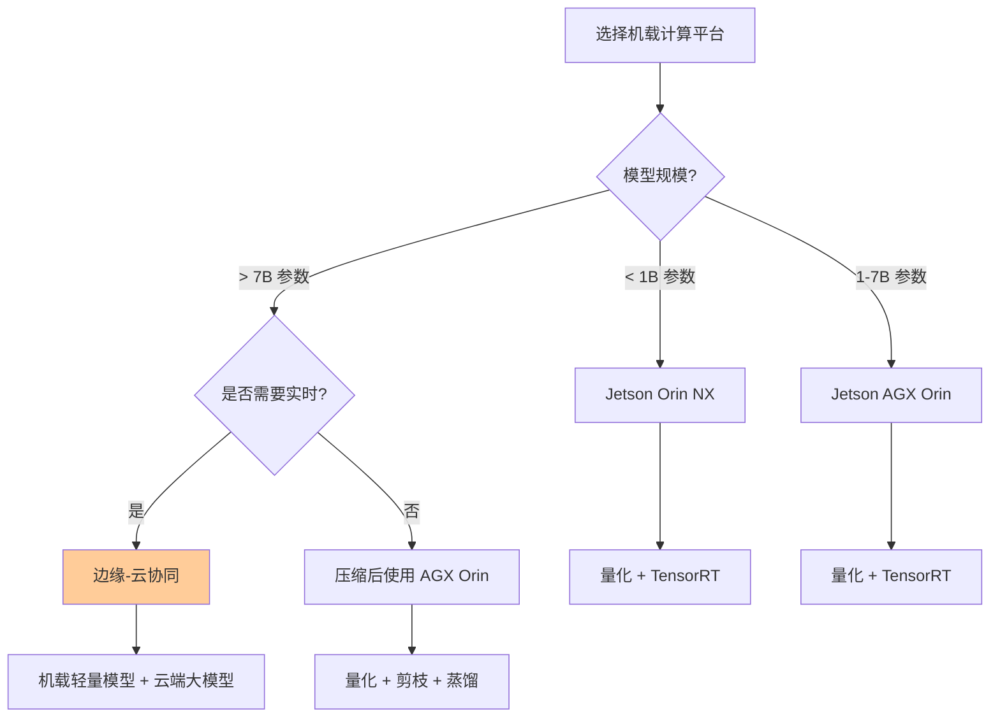
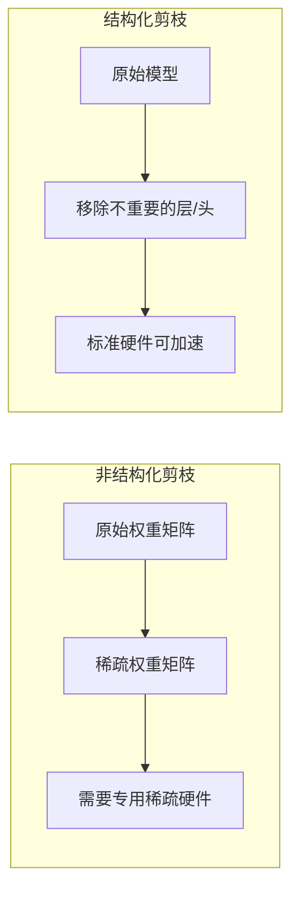
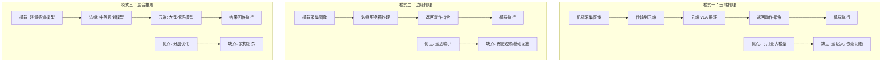
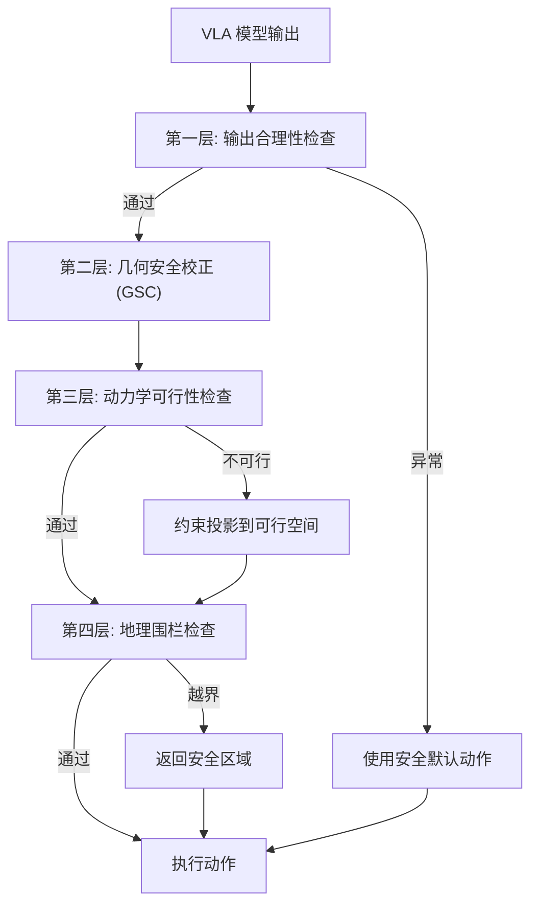
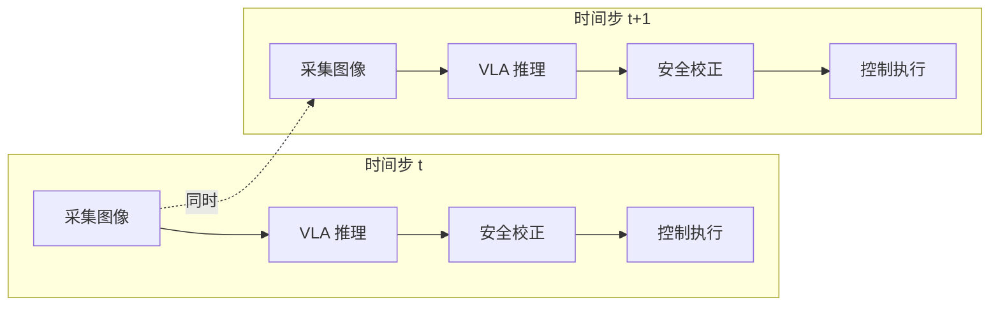

# 机载部署与优化：让 VLA 在无人机上实时运行

> **预计阅读：16 分钟 | 前置知识：深度学习推理基础、嵌入式系统概念、模型优化技术**

---

## 1. 引言：从研究到部署的鸿沟

VLA 模型在研究环境中展示了令人印象深刻的能力，但将其部署到真实无人机上面临巨大挑战。核心矛盾在于：

| 维度 | 研究环境 | 无人机机载环境 |
|------|---------|--------------|
| 计算资源 | 多张高端 GPU (A100/H100) | 嵌入式 GPU (Jetson Orin) 或 NPU |
| 内存 | 64-256 GB | 8-32 GB |
| 功耗 | 数百瓦 | 15-60 W（含计算+飞行） |
| 推理频率 | 1-10 Hz 可接受 | 50-200 Hz 控制需求 |
| 延迟容忍 | 秒级 | 毫秒级 |
| 模型大小 | 数十 GB | 数百 MB - 数 GB |

以 OpenVLA (7B) 为例：在 A100 GPU 上推理速度约 6 Hz，延迟约 160ms。而在 Jetson Orin NX (16GB) 上，直接推理可能只有 0.5-1 Hz，延迟超过 1 秒——完全无法满足飞行控制的实时性要求。

本节将介绍将 VLA 模型部署到无人机机载平台的关键技术和优化策略。

---

## 2. 机载计算平台概览

### 2.1 常用平台对比

| 平台 | 算力 (TOPS) | GPU 内存 | 功耗 (W) | 适用场景 |
|------|-----------|---------|---------|---------|
| NVIDIA Jetson Orin NX 16GB | 100 | 16GB 共享 | 25 | 轻量级 VLA 推理 |
| NVIDIA Jetson AGX Orin 64GB | 275 | 64GB 共享 | 60 | 中等规模 VLA 推理 |
| Qualcomm RB5 | 15 | 无独立 GPU | 5 | 轻量级视觉任务 |
| Intel Movidius (NCS2) | 4 | 无 | 2 | 专用推理加速 |
| Google Coral (Edge TPU) | 4 | 无 | 2 | 量化模型推理 |
| 自研 NPU (如地平线旭日) | 5-30 | 集成 | 5-15 | 定制化推理 |

### 2.2 平台选择决策树



---

## 3. 推理加速技术

### 3.1 概览

VLA 模型的推理加速技术可以分为以下几个层次：

| 技术层次 | 技术手段 | 加速比 | 精度损失 | 实现难度 |
|---------|---------|--------|---------|---------|
| 量化 | FP16/INT8/INT4 | 2-4× | 低-中 | 低 |
| 剪枝 | 结构化/非结构化 | 1.5-3× | 低-中 | 中 |
| 蒸馏 | 知识蒸馏 | 2-10× | 中 | 高 |
| 编译优化 | TensorRT/TVM | 1.5-3× | 无 | 低 |
| 架构优化 | 注意力优化/FlashAttention | 1.5-2× | 无 | 中 |
| 稀疏推理 | 稀疏注意力/条件计算 | 2-4× | 低 | 高 |

### 3.2 量化（Quantization）

量化是将模型权重和激活值从高精度浮点数（FP32/FP16）转换为低精度整数（INT8/INT4）的技术。

```
量化过程：

原始模型 (FP32):
  权重: [0.123456, -0.789012, 0.456789, ...]
  每个值占 4 字节

INT8 量化:
  量化公式: q = round(w / scale + zero_point)
  scale = (max - min) / 255
  权重: [32, -201, 117, ...]
  每个值占 1 字节

INT4 量化:
  量化公式: q = round(w / scale + zero_point)
  scale = (max - min) / 15
  权重: [2, -8, 5, ...]
  每个值占 0.5 字节
```

**量化对 VLA 的影响：**

| 量化精度 | 模型大小 | 推理速度 | 任务成功率 | 推荐场景 |
|---------|---------|---------|----------|---------|
| FP32 (原始) | 28 GB (7B) | 1× | 100% (基准) | 研究环境 |
| FP16 | 14 GB | 1.5-2× | ~99.9% | 有大显存的平台 |
| INT8 | 7 GB | 2-3× | ~98-99% | Jetson AGX Orin |
| INT4 | 3.5 GB | 3-4× | ~95-97% | Jetson Orin NX |
| INT4 + GPTQ | 3.5 GB | 3-5× | ~96-98% | 极致压缩 |

**注意事项：**
- VLA 的视觉编码器（如 ViT）对量化更敏感，建议使用混合精度（视觉编码器 FP16，语言模型 INT8）
- 动作生成部分的量化需要特别注意，因为动作精度直接影响控制质量
- 建议使用校准数据集（calibration dataset）进行量化感知训练

### 3.3 剪枝（Pruning）

剪枝是移除模型中冗余参数的技术。对于 VLA 模型，结构化剪枝（移除整个注意力头或层）比非结构化剪枝更适合硬件加速。



### 3.4 知识蒸馏（Knowledge Distillation）

知识蒸馏是将大模型（教师模型）的知识迁移到小模型（学生模型）的技术。对于 VLA，可以蒸馏的部分包括：

- **视觉特征蒸馏**：教师模型的视觉编码器输出 → 学生模型的视觉编码器
- **语言理解蒸馏**：教师模型的语言理解能力 → 学生模型
- **动作预测蒸馏**：教师模型的动作输出 → 学生模型的动作头

```
蒸馏训练损失：

L_total = α × L_task + β × L_KD + γ × L_feat

其中：
  L_task = 学生模型的任务损失（模仿学习）
  L_KD = KL 散度损失（学生输出匹配教师输出）
  L_feat = 特征匹配损失（中间层特征对齐）
```

### 3.5 TensorRT 编译优化

TensorRT 是 NVIDIA 提供的推理优化工具，可以自动进行多种优化：

| 优化技术 | 说明 | 加速效果 |
|---------|------|---------|
| 层融合 | 合并相邻的计算层 | 减少内存访问和 kernel 启动开销 |
| 内核自动调优 | 为每个层选择最优的 CUDA kernel | 提升计算效率 |
| 动态 batching | 动态批处理多个请求 | 提升吞吐量 |
| 图优化 | 优化计算图结构 | 减少冗余计算 |
| 精度校准 | 自动选择最优精度 | 平衡速度和精度 |

**TensorRT 对 VLA 的优化效果：**

| 模型 | 平台 | 原始延迟 | TensorRT 优化后 | 加速比 |
|------|------|---------|----------------|--------|
| OpenVLA (7B, FP16) | AGX Orin | ~500ms | ~200ms | 2.5× |
| OpenVLA (7B, INT8) | AGX Orin | ~500ms | ~120ms | 4.2× |
| VLA-AN (优化后) | Orin NX | ~100ms | ~12ms | 8.3× |

---

## 4. 边缘-云协同架构

### 4.1 动机

当模型过大无法完全在机载平台上运行时，边缘-云协同（Edge-Cloud Collaboration）是一种有效的解决方案。CoDrone 框架就是这种架构的典型代表。

### 4.2 协同模式



### 4.3 通信约束

边缘-云协同的一个关键挑战是通信约束：

| 约束 | 典型值 | 影响 |
|------|--------|------|
| 带宽 | 10-100 Mbps (4G/5G) | 限制图像传输频率 |
| 延迟 | 20-200 ms (取决于距离) | 限制实时性 |
| 可靠性 | 可能断连 | 需要断网降级策略 |
| 功耗 | 通信模块消耗 2-5 W | 影响飞行时间 |

### 4.4 通信优化策略

```
策略一：选择性传输
  - 只在场景变化显著时传输图像
  - 使用图像差异检测判断是否需要更新
  - 预期减少 50-80% 的通信量

策略二：渐进式传输
  - 先传输低分辨率图像获取粗略结果
  - 再传输高分辨率图像获取精确结果
  - 预期减少 30-50% 的延迟

策略三：预测性传输
  - 预测未来可能需要的场景
  - 提前传输相关数据
  - 减少等待时间

策略四：断网降级
  - 通信中断时切换到机载轻量模型
  - 维持基本的飞行安全能力
  - 恢复通信后自动同步
```

---

## 5. 安全约束机制

### 5.1 VLA 的安全性问题

VLA 模型作为数据驱动的学习系统，缺乏传统控制理论中的形式化安全保证。在无人机场景中，这尤为危险：

| 安全风险 | 说明 | 后果 |
|---------|------|------|
| 幻觉输出 | 模型生成不合理的动作 | 碰撞、坠机 |
| 分布偏移 | 部署场景与训练分布不同 | 行为异常 |
| 对抗攻击 | 恶意输入欺骗模型 | 失去控制 |
| 累积误差 | 长时间任务中误差累积 | 偏离航线 |

### 5.2 VLA-AN 的几何安全校正

VLA-AN 的几何安全校正（GSC）是一种轻量级的安全后处理机制：

```
GSC 实现流程：

输入: VLA 原始动作 a_raw = (vx, vy, vz, ωz)
      最近障碍物信息: (距离 d_obs, 法向量 n_obs)

步骤 1: 安全状态判断
  if d_obs > d_safe:
    return a_raw  # 安全，直接执行

步骤 2: 危险分量计算
  v_approach = dot(a_velocity, n_obs)  # 靠近障碍物的速度分量
  
步骤 3: 安全校正
  if v_approach > 0:  # 正在靠近障碍物
    a_safe = a_raw - v_approach * n_obs * correction_factor
  else:
    a_safe = a_raw  # 正在远离，无需校正

步骤 4: 输出限幅
  a_safe = clip(a_safe, a_min, a_max)

输出: a_safe
```

### 5.3 多层安全架构

实际部署中，通常采用多层安全架构：



**各层说明：**

| 层次 | 功能 | 延迟 | 说明 |
|------|------|------|------|
| 第一层 | 输出合理性检查 | < 0.1ms | 检查动作是否在合理范围内 |
| 第二层 | 几何安全校正 | < 0.5ms | 移除靠近障碍物的速度分量 |
| 第三层 | 动力学可行性 | < 0.2ms | 检查动作是否在动力学约束内 |
| 第四层 | 地理围栏 | < 0.1ms | 确保不飞出安全区域 |

总安全检查延迟 < 1ms，对控制频率影响极小。

### 5.4 安全监控模块

除了动作层面的安全检查，还需要运行时安全监控：

```
安全监控指标：

1. 姿态监控
   - 倾斜角度 > 45° → 触发姿态恢复
   - 角速度异常 → 触发紧急悬停

2. 高度监控
   - 高度 < 最低安全高度 → 自动拉升
   - 高度下降速度过大 → 触发紧急悬停

3. 电量监控
   - 电量 < 30% → 触发返航
   - 电量 < 15% → 触发紧急降落

4. 通信监控
   - 通信中断 > 30s → 触发自主返航
   - 信号强度持续下降 → 主动降低高度

5. 模型监控
   - VLA 推理延迟 > 阈值 → 切换到安全模式
   - VLA 输出置信度 < 阈值 → 使用保守策略
```

---

## 6. 实时性保障

### 6.1 控制频率需求

不同飞行任务对控制频率的需求不同：

| 任务类型 | 最低控制频率 | 推荐控制频率 | VLA 推理频率需求 |
|---------|------------|------------|----------------|
| 悬停 | 50 Hz | 100 Hz | 10-20 Hz |
| 航线飞行 | 20 Hz | 50 Hz | 5-10 Hz |
| 避障 | 50 Hz | 100 Hz | 20-50 Hz |
| 精准降落 | 100 Hz | 200 Hz | 20-50 Hz |
| 编队飞行 | 50 Hz | 100 Hz | 10-20 Hz |
| 跟踪 | 50 Hz | 100 Hz | 20-50 Hz |

### 6.2 分频控制架构

VLA 模型的推理频率（通常 1-20 Hz）远低于底层控制频率（50-200 Hz）。分频控制架构是解决这一矛盾的标准方案：

```
分频控制架构：

高频层 (100-200 Hz):
  - PID 控制器 / MPC 控制器
  - 接收 VLA 的速度/位置指令
  - 输出电机 PWM 信号
  - 延迟要求: < 5ms

中频层 (10-50 Hz):
  - VLA 模型推理
  - 接收视觉图像和语言指令
  - 输出速度/位置指令
  - 延迟要求: < 50ms

低频层 (1-5 Hz):
  - 任务规划和监控
  - 接收高层任务描述
  - 输出任务状态和子目标
  - 延迟要求: < 500ms
```

### 6.3 流水线优化

通过流水线化（pipelining）减少端到端延迟：



通过流水线化，图像采集和 VLA 推理可以并行进行，减少每个时间步的总延迟。

### 6.4 预测性控制

当 VLA 推理延迟无法进一步降低时，可以使用预测性控制：

```
预测性控制策略：

1. VLA 生成未来 N 步的动作预测（action chunk）
2. 按顺序执行预测的动作
3. 每 M 步用最新的 VLA 推理结果更新

示例：
  VLA 预测: [a₁, a₂, a₃, a₄, a₅, a₆, a₇, a₈]
  执行: a₁, a₂, a₃, a₄ (使用缓存的预测)
  更新: VLA 推理生成新的 [a₅', a₆', a₇', a₈', a₉', a₁₀', a₁₁', a₁₂']
  执行: a₅', a₆', a₇', a₈' (使用新预测)
  ...
```

这种策略将 VLA 的推理频率降低到原来的 1/N，同时保持高频控制输出。

---

## 7. 优化技术综合对比

| 技术 | 加速比 | 精度影响 | 实现复杂度 | 适用平台 | 推荐组合 |
|------|--------|---------|-----------|---------|---------|
| FP16 量化 | 1.5-2× | 极低 | 低 | 所有 NVIDIA GPU | 基础优化 |
| INT8 量化 | 2-3× | 低 | 中 | Jetson, 数据中心 GPU | 机载部署首选 |
| INT4 量化 | 3-4× | 中 | 高 | 支持 INT4 的平台 | 极致压缩 |
| 结构化剪枝 | 1.5-2× | 低-中 | 中 | 所有平台 | 配合量化使用 |
| 知识蒸馏 | 2-10× | 中 | 高 | 所有平台 | 需要小模型时 |
| TensorRT | 1.5-3× | 无 | 低 | NVIDIA GPU | 必选优化 |
| FlashAttention | 1.5-2× | 无 | 中 | 支持的 GPU | Transformer 优化 |
| 稀疏推理 | 2-4× | 低 | 高 | 支持稀疏计算的平台 | 前沿技术 |

**推荐的优化组合方案：**

```
方案一: 轻量级部署 (Jetson Orin NX)
  FP16 + INT8 混合量化 + TensorRT
  预期: 3-5× 加速, 精度损失 < 2%

方案二: 中等部署 (Jetson AGX Orin)
  INT8 量化 + TensorRT + FlashAttention
  预期: 4-6× 加速, 精度损失 < 3%

方案三: 极致压缩 (资源受限平台)
  知识蒸馏 (7B → 1B) + INT8 量化 + TensorRT
  预期: 10-20× 加速, 精度损失 5-10%

方案四: 边缘-云协同 (无算力限制)
  机载: 轻量感知模型 (INT8)
  边缘: 中等规划模型 (FP16)
  云端: 大型推理模型 (FP32)
```

---

## 8. 部署架构示例

### 8.1 完整的机载部署架构

```
完整的无人机 VLA 部署架构：

[传感器层]
  - 前置摄像头 (30-60 fps)
  - 下视摄像头 (30 fps)
  - IMU (200 Hz)
  - 气压计 (50 Hz)
  - 超声波高度计 (20 Hz)
        |
[预处理层]
  - 图像去畸变
  - 图像缩放/裁剪
  - 传感器数据同步
        |
[VLA 推理层]
  - 模型加载 (TensorRT 引擎)
  - INT8/FP16 混合推理
  - 动作 chunk 生成
        |
[安全层]
  - 输出合理性检查
  - 几何安全校正 (GSC)
  - 动力学可行性检查
  - 地理围栏检查
        |
[控制层]
  - PID/MPC 控制器 (100-200 Hz)
  - 位置/速度/姿态控制
  - 电机混控
        |
[执行层]
  - 电调 (ESC)
  - 电机
  - 螺旋桨
        |
[监控层]
  - 电量监控
  - 通信监控
  - 姿态监控
  - 日志记录
```

### 8.2 边缘-云协同部署架构

```
边缘-云协同部署架构：

[无人机端]
  轻量感知模型 (INT8, ~100ms)
  - 视觉特征提取
  - 简单动作生成
  - 安全监控
        |
[通信链路] (4G/5G, 延迟 20-100ms)
        |
[边缘服务器]
  中等规划模型 (FP16, ~200ms)
  - 场景理解
  - 路径规划
  - 目标管理
        |
[通信链路] (光纤/专线, 延迟 5-20ms)
        |
[云端服务器]
  大型推理模型 (FP32, ~500ms)
  - 复杂任务推理
  - 多机调度
  - 知识更新
```

---

## 9. 关键论文

| 论文 | 关键贡献 | 链接 |
|------|---------|------|
| VLA-AN | GSC 安全校正, 8.3× 加速 | arXiv:2512.15258 |
| CoDrone | 云边端协同框架 | arXiv:2512.19083 |
| TensorRT | NVIDIA 推理优化工具 | NVIDIA 官方文档 |
| GPTQ | INT4 量化方法 | arXiv:2210.17323 |
| FlashAttention | 高效注意力机制 | arXiv:2205.14135 |

---

## 10. 延伸阅读

- [01-VLA架构演进](./01-VLA架构演进.md) — 了解不同 VLA 架构的计算需求差异
- [02-无人机VLA模型](./02-无人机VLA模型.md) — VLA-AN 的安全校正和推理加速细节
- [04-基础模型辅助规划](./04-基础模型辅助规划.md) — CoDrone 的云边端架构详细设计
- [02-世界模型专题](../02-世界模型专题/) — 轻量级世界模型的机载部署方案
- [研究空白与机会](../08-研究前沿与开放问题/02-研究空白与机会.md) — VLA实时化等开放问题

---

## 11. 思考题

**题目 1：量化精度 vs. 控制安全**

INT4 量化可以将模型大小压缩到原来的 1/8，但会引入量化误差。在无人机控制场景中，如何评估量化误差对飞行安全的影响？

<details>
<summary>参考答案</summary>

**评估框架：**

1. **离线评估**：
   - 在测试集上比较量化前后的动作预测误差（MSE、MAE）
   - 统计量化后动作超出安全范围的频率
   - 分析量化误差在不同场景（简单/复杂）下的分布

2. **仿真评估**：
   - 在仿真环境中用量化模型控制无人机，统计碰撞率和任务完成率
   - 对比不同量化精度下的安全指标
   - 测试边缘情况（紧急避障、强风扰动等）

3. **安全裕度分析**：
   - 量化误差导致的动作偏差 Δa
   - 安全校正模块的校正能力 C
   - 安全条件：Δa < C（量化误差在安全校正能力范围内）

4. **建议策略**：
   - 关键安全模块（如动作输出层）保持较高精度（FP16/INT8）
   - 非关键模块（如中间特征层）可以使用 INT4
   - 使用混合精度量化，敏感层高精度，非敏感层低精度
   - 增加安全校正模块的校正裕度，补偿量化误差
</details>

---

**题目 2：边缘-云协同的断网处理**

在边缘-云协同架构中，如果无人机与边缘服务器的通信突然中断，系统应如何处理？请设计一个断网降级方案。

<details>
<summary>参考答案</summary>

**断网降级方案：**

**检测阶段（0-1s）：**
- 通信监控模块检测到连接中断
- 立即记录当前任务状态和位置
- 通知控制层切换到本地模式

**降级阶段（1-30s）：**
- 切换到机载轻量模型（已经预加载在内存中）
- 降低飞行速度到安全水平
- 启用更保守的安全策略（增大安全距离）
- 执行简化版任务（如悬停或缓慢返航）

**自主阶段（30s-5min）：**
- 如果电量充足且任务允许，继续执行简化版任务
- 如果电量不足或环境复杂，启动自主返航程序
- 使用机载 SLAM 进行本地定位
- 记录飞行轨迹，供恢复通信后同步

**紧急阶段（> 5min 或电量 < 20%）：**
- 启动紧急降落程序
- 选择最近的安全降落点
- 降落完成后等待人工干预

**恢复阶段（通信恢复后）：**
- 同步断网期间的飞行数据
- 评估当前任务状态
- 决定是继续任务还是返回起点
</details>

---

**题目 3：实时性与模型能力的权衡**

假设你有一个 7B 参数的 VLA 模型，推理延迟 200ms（5 Hz），但你的无人机需要 100 Hz 的控制频率。请设计一个完整的方案来平衡实时性和模型能力。

<details>
<summary>参考答案</summary>

**综合方案设计：**

**1. 分频控制架构：**
- 低频层 (5 Hz): VLA 模型推理，输出速度/位置指令
- 中频层 (20 Hz): 安全校正和状态估计
- 高频层 (100 Hz): PID 控制器，输出电机指令

**2. 动作预测 (Action Chunking)：**
- VLA 每次预测未来 20 步的动作（对应 5Hz × 4秒）
- 中间步骤使用缓存的预测动作
- 每 4 步用最新的 VLA 推理更新预测

**3. 推理优化：**
- INT8 量化 + TensorRT → 延迟降低到 ~80ms (12.5 Hz)
- 动作 chunk 大小调整为 8 步 → 每 80ms 更新一次

**4. 安全保障：**
- 在使用缓存动作期间，持续运行轻量级安全检查
- 如果安全检查失败，立即切换到安全默认动作
- VLA 推理延迟超过阈值时，切换到保守控制模式

**5. 预测性控制：**
- 基于历史动作预测未来状态
- 在 VLA 推理未完成时，使用预测的动作
- 推理完成后用实际结果修正预测

**最终效果：**
- 控制频率: 100 Hz（满足要求）
- VLA 推理频率: 12.5 Hz（优化后）
- 端到端延迟: ~120ms（可接受）
- 安全性: 多层安全检查保障
</details>

---

> **返回**：[01-VLA架构演进](./01-VLA架构演进.md) | [VLA 专题首页](./)
