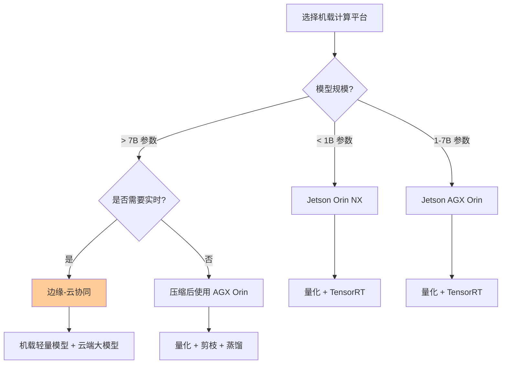
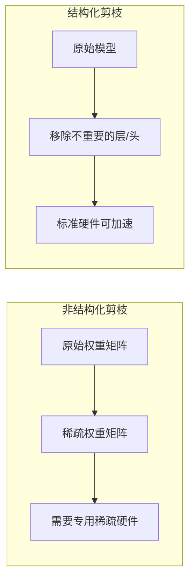
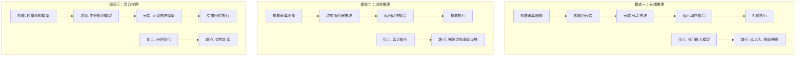
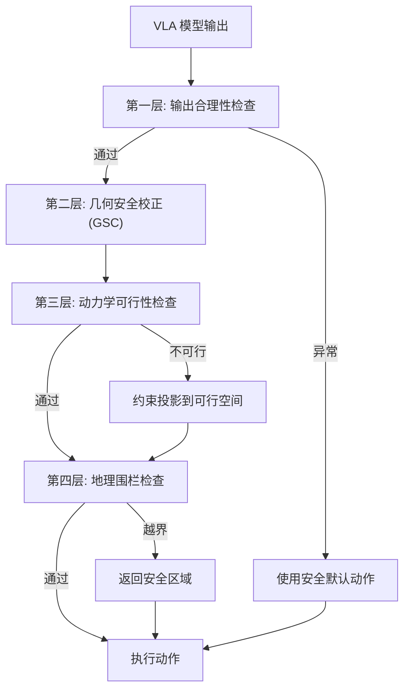
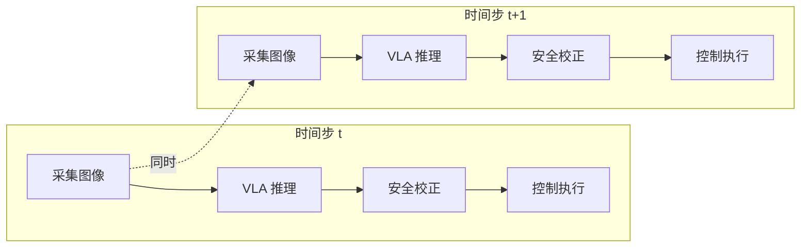
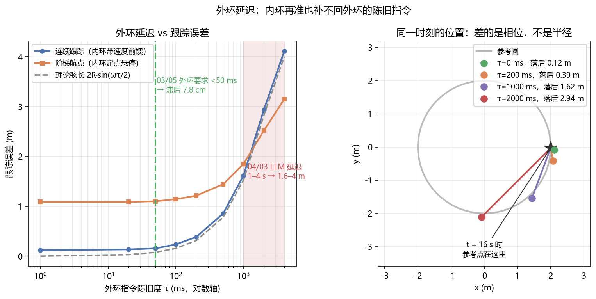

# 机载部署与优化：让 VLA 在无人机上实时运行

> **预计阅读：30 分钟 | 前置知识：深度学习推理基础、嵌入式系统概念、模型优化技术**

---

## 1. 从研究到部署的鸿沟

核心差距在算力和内存两端：

| 维度 | 研究环境 | 无人机机载环境 |
|------|---------|--------------|
| 计算资源 | 多张高端 GPU (A100/H100) | 嵌入式 GPU (Jetson Orin) 或 NPU |
| 内存 | 64-256 GB | 8-32 GB |
| 功耗 | 数百瓦 | 15-60 W（含计算+飞行） |
| 推理频率 | 1-10 Hz 可接受 | 与控制环是两个尺度，见下 |
| 延迟容忍 | 秒级 | 毫秒级 |
| 模型大小 | 数十 GB | 数百 MB - 数 GB |

> **「推理频率」这一行怎么读（2026-10）**：右列的「50-200 Hz 控制需求」是本仓库早先自拟的档位，无来源，已删。要区分两个量：**飞控内环**跑 IMU→电机的频率（各平台差异很大，本节不给统一数值），和**策略推理频率**（VLA-AN 自报约 494 ms 一次，即 2 Hz 量级）。两者差两三个数量级，硬凑成一个区间就会误导。

以 OpenVLA (7B) 为例：论文自报在**单张 NVIDIA RTX 4090 GPU** 上约 **6 Hz**（*"runs at approximately 6Hz on one NVIDIA RTX 4090 GPU"*）。论文**没有在 Jetson / Orin 这类嵌入平台上测过**，所以在机载平台上会慢到什么程度，属于外推而不是实测——做预算时不能把外推值当实测值用。

> **勘误（2026-10）**：本段早先写作「在 A100 GPU 上推理速度约 6 Hz，延迟约 160ms。而在 Jetson Orin NX (16GB) 上，直接推理可能只有 0.5-1 Hz，延迟超过 1 秒」。**两个平台都说错了**：论文测的是 RTX 4090 而不是 A100，且完全没有 Orin 上的数据。「0.5-1 Hz」「1 秒」是本仓库编的外推值。已改为论文原话。

---

## 2. 机载计算平台概览

### 2.1 常用平台对比

| 平台 | 算力 (TOPS) | GPU 内存 | 功耗 (W) | 适用场景 |
|------|-----------|---------|---------|---------|
| NVIDIA Jetson Orin NX 16GB | 100 | 16GB 共享 | 25 | 轻量级 VLA 推理 |
| NVIDIA Jetson AGX Orin 64GB | 275 | 64GB 共享 | 60 | 中等规模 VLA 推理 |
| Qualcomm RB5 | 15 | 无独立 GPU | 5 | 轻量级视觉任务 |
| Intel Movidius (NCS2) | 4 | 无 | 2 | 专用推理加速 |
| Google Coral (Edge TPU) | 4 | 无 | 2 | 量化模型推理 |
| 自研 NPU (如地平线旭日) | 5-30 | 集成 | 5-15 | 定制化推理 |

### 2.2 平台选择决策树


```mermaid
graph TB
    A["选择机载计算平台"] --> B{"模型规模?"}
    B -->|"< 1B 参数"| C["Jetson Orin NX"]
    B -->|"1-7B 参数"| D["Jetson AGX Orin"]
    B -->|"> 7B 参数"| E{"是否需要实时?"}
    
    E -->|"是"| F["边缘-云协同"]
    E -->|"否"| G["压缩后使用 AGX Orin"]
    
    C --> C1["量化 + TensorRT"]
    D --> D1["量化 + TensorRT"]
    F --> F1["机载轻量模型 + 云端大模型"]
    G --> G1["量化 + 剪枝 + 蒸馏"]
    
    style F fill:#ffcc99
```

---

## 3. 推理加速技术

### 3.1 概览

VLA 模型的推理加速技术可以分为以下几个层次：

| 技术层次 | 技术手段 | 加速比 | 精度损失 | 实现难度 |
|---------|---------|--------|---------|---------|
| 量化 | FP16/INT8/INT4 | 2-4× | 低-中 | 低 |
| 剪枝 | 结构化/非结构化 | 1.5-3× | 低-中 | 中 |
| 蒸馏 | 知识蒸馏 | 2-10× | 中 | 高 |
| 编译优化 | TensorRT/TVM | 1.5-3× | 无 | 低 |
| 架构优化 | 注意力优化/FlashAttention | 1.5-2× | 无 | 中 |
| 稀疏推理 | 稀疏注意力/条件计算 | 2-4× | 低 | 高 |

### 3.2 量化（Quantization）

量化是将模型权重和激活值从高精度浮点数（FP32/FP16）转换为低精度整数（INT8/INT4）的技术。

```
量化过程：

原始模型 (FP32):
  权重: [0.123456, -0.789012, 0.456789, ...]
  每个值占 4 字节

INT8 量化:
  量化公式: q = round(w / scale + zero_point)
  scale = (max - min) / 255
  权重: [32, -201, 117, ...]
  每个值占 1 字节

INT4 量化:
  量化公式: q = round(w / scale + zero_point)
  scale = (max - min) / 15
  权重: [2, -8, 5, ...]
  每个值占 0.5 字节
```

**量化对 VLA 的影响：**

| 量化精度 | 模型大小 | 推理速度 | 任务成功率 | 推荐场景 |
|---------|---------|---------|----------|---------|
| FP32 (原始) | 28 GB (7B) | 1× | 100% (基准) | 研究环境 |
| FP16 | 14 GB | 1.5-2× | ~99.9% | 有大显存的平台 |
| INT8 | 7 GB | 2-3× | ~98-99% | Jetson AGX Orin |
| INT4 | 3.5 GB | 3-4× | ~95-97% | Jetson Orin NX |
| INT4 + GPTQ | 3.5 GB | 3-5× | ~96-98% | 极致压缩 |

**注意事项：**
- VLA 的视觉编码器（如 ViT）对量化更敏感，建议使用混合精度（视觉编码器 FP16，语言模型 INT8）
- 动作生成部分的量化需要特别注意，因为动作精度直接影响控制质量
- 建议使用校准数据集（calibration dataset）进行量化感知训练

### 3.3 剪枝（Pruning）

剪枝是移除模型中冗余参数的技术。对于 VLA 模型，结构化剪枝（移除整个注意力头或层）比非结构化剪枝更适合硬件加速。


```mermaid
graph LR
    subgraph "非结构化剪枝"
        A1["原始权重矩阵"] --> A2["稀疏权重矩阵"]
        A2 --> A3["需要专用稀疏硬件"]
    end
    
    subgraph "结构化剪枝"
        B1["原始模型"] --> B2["移除不重要的层/头"]
        B2 --> B3["标准硬件可加速"]
    end
```

### 3.4 知识蒸馏（Knowledge Distillation）

知识蒸馏是将大模型（教师模型）的知识迁移到小模型（学生模型）的技术。对于 VLA，可以蒸馏的部分包括：

- **视觉特征蒸馏**：教师模型的视觉编码器输出 → 学生模型的视觉编码器
- **语言理解蒸馏**：教师模型的语言理解能力 → 学生模型
- **动作预测蒸馏**：教师模型的动作输出 → 学生模型的动作头

```
蒸馏训练损失：

L_total = α × L_task + β × L_KD + γ × L_feat

其中：
  L_task = 学生模型的任务损失（模仿学习）
  L_KD = KL 散度损失（学生输出匹配教师输出）
  L_feat = 特征匹配损失（中间层特征对齐）
```

### 3.5 TensorRT 编译优化

TensorRT 是 NVIDIA 提供的推理优化工具，可以自动进行多种优化：

| 优化技术 | 说明 | 加速效果 |
|---------|------|---------|
| 层融合 | 合并相邻的计算层 | 减少内存访问和 kernel 启动开销 |
| 内核自动调优 | 为每个层选择最优的 CUDA kernel | 提升计算效率 |
| 动态 batching | 动态批处理多个请求 | 提升吞吐量 |
| 图优化 | 优化计算图结构 | 减少冗余计算 |
| 精度校准 | 自动选择最优精度 | 平衡速度和精度 |

**VLA-AN 的推理优化**

| 模型 | 原始推理时间 | 优化后 | 加速比 |
|------|-------------|--------|--------|
| VLA-AN | 约 4100 ms | 494 ms | **8.3×**（减少 87.9%） |

> **口径提示**：8.3× 是论文里唯一有绝对数值对照的指标，衡量的是**整条推理链路**，不是某一块 kernel。端到端整环还要叠上图像采集、预处理与安全层后处理，仍追不上实时控制的更高档位 —— 见 [研究空白与机会](../08-研究前沿与开放问题/02-研究空白与机会.md) 2.1 节。第 10 节另量过外环延迟收进闭环的代价：外环慢到 1 秒，跟踪误差就是 1.62 m。拿这张表做实时性预算时，要按整环算，不要只盯着 494 ms。

> **勘误（2026-10）**：本表早先有三行——「OpenVLA FP16 AGX Orin ~500ms → ~200ms (2.5×)」「OpenVLA INT8 ~500ms → ~120ms (4.2×)」「VLA-AN Orin NX ~100ms → ~12ms (8.3×)」。**OpenVLA 的两行在论文里没有任何对应数据**（原论文只报告在单张 RTX 4090 上约 6 Hz，从未在 Jetson/AGX Orin 上测过）；**VLA-AN 的 ~100ms → ~12ms 也是编的**，原文是 4100 ms → 494 ms。三行已删，只保留论文可核的那一行。

---

## 4. 边缘-云协同架构

### 4.1 动机

当模型过大无法完全在机载平台上运行时，边缘-云协同（Edge-Cloud Collaboration）是一种有效的解决方案。CoDrone 框架就是这种架构的典型代表。

### 4.2 协同模式


```mermaid
graph TB
    subgraph "模式一：云端推理"
        A1["机载采集图像"] --> A2["传输到云端"]
        A2 --> A3["云端 VLA 推理"]
        A3 --> A4["返回动作指令"]
        A4 --> A5["机载执行"]
        
        A6["优点: 可用最大模型"] -.-> A7["缺点: 延迟大, 依赖网络"]
    end
    
    subgraph "模式二：边缘推理"
        B1["机载采集图像"] --> B2["边缘服务器推理"]
        B2 --> B3["返回动作指令"]
        B3 --> B4["机载执行"]
        
        B5["优点: 延迟较小"] -.-> B6["缺点: 需要边缘基础设施"]
    end
    
    subgraph "模式三：混合推理"
        C1["机载: 轻量感知模型"] --> C2["边缘: 中等规划模型"]
        C2 --> C3["云端: 大型推理模型"]
        C3 --> C4["结果回传执行"]
        
        C5["优点: 分层优化"] -.-> C6["缺点: 架构复杂"]
    end
```

### 4.3 通信约束

边缘-云协同的一个关键挑战是通信约束：

| 约束 | 典型值 | 影响 |
|------|--------|------|
| 带宽 | 10-100 Mbps (4G/5G) | 限制图像传输频率 |
| 延迟 | 20-200 ms (取决于距离) | 限制实时性 |
| 可靠性 | 可能断连 | 需要断网降级策略 |
| 功耗 | 通信模块消耗 2-5 W | 影响飞行时间 |

### 4.4 通信优化策略

```
策略一：选择性传输
  - 只在场景变化显著时传输图像
  - 使用图像差异检测判断是否需要更新
  - 预期减少 50-80% 的通信量

策略二：渐进式传输
  - 先传输低分辨率图像获取粗略结果
  - 再传输高分辨率图像获取精确结果
  - 预期减少 30-50% 的延迟

策略三：预测性传输
  - 预测未来可能需要的场景
  - 提前传输相关数据
  - 减少等待时间

策略四：断网降级
  - 通信中断时切换到机载轻量模型
  - 维持基本的飞行安全能力
  - 恢复通信后自动同步
```

---

## 5. 安全约束机制

### 5.1 VLA 的安全性问题

VLA 模型作为数据驱动的学习系统，缺乏传统控制理论中的形式化安全保证。在无人机场景中，这尤为危险：

| 安全风险 | 说明 | 后果 |
|---------|------|------|
| 幻觉输出 | 模型生成不合理的动作 | 碰撞、坠机 |
| 分布偏移 | 部署场景与训练分布不同 | 行为异常 |
| 对抗攻击 | 恶意输入欺骗模型 | 失去控制 |
| 累积误差 | 长时间任务中误差累积 | 偏离航线 |

### 5.2 VLA-AN 的几何安全校正

VLA-AN 的几何安全校正（GSC）是一种轻量级的安全后处理机制：

```
GSC 实现流程：

输入: VLA 原始动作 a_raw = (vx, vy, vz, ωz)
      最近障碍物信息: (距离 d_obs, 法向量 n_obs)

步骤 1: 安全状态判断
  if d_obs > d_safe:
    return a_raw  # 安全，直接执行

步骤 2: 危险分量计算
  v_approach = dot(a_velocity, n_obs)  # 靠近障碍物的速度分量
  
步骤 3: 安全校正
  if v_approach > 0:  # 正在靠近障碍物
    a_safe = a_raw - v_approach * n_obs * correction_factor
  else:
    a_safe = a_raw  # 正在远离，无需校正

步骤 4: 输出限幅
  a_safe = clip(a_safe, a_min, a_max)

输出: a_safe
```

### 5.3 多层安全架构

实际部署中，通常采用多层安全架构：


```mermaid
graph TB
    A["VLA 模型输出"] --> B["第一层: 输出合理性检查"]
    B -->|"通过"| C["第二层: 几何安全校正 (GSC)"]
    B -->|"异常"| F["使用安全默认动作"]
    C --> D["第三层: 动力学可行性检查"]
    D -->|"通过"| E["第四层: 地理围栏检查"]
    D -->|"不可行"| G["约束投影到可行空间"]
    E -->|"通过"| H["执行动作"]
    E -->|"越界"| I["返回安全区域"]
    
    F --> H
    G --> E
    I --> H
```

**各层说明：**

| 层次 | 功能 | 延迟 | 说明 |
|------|------|------|------|
| 第一层 | 输出合理性检查 | < 0.1ms | 检查动作是否在合理范围内 |
| 第二层 | 几何安全校正 | < 0.5ms | 移除靠近障碍物的速度分量 |
| 第三层 | 动力学可行性 | < 0.2ms | 检查动作是否在动力学约束内 |
| 第四层 | 地理围栏 | < 0.1ms | 确保不飞出安全区域 |

总安全检查延迟 < 1ms，对控制频率影响极小。

### 5.4 安全监控模块

除了动作层面的安全检查，还需要运行时安全监控：

```
安全监控指标：

1. 姿态监控
   - 倾斜角度 > 45° → 触发姿态恢复
   - 角速度异常 → 触发紧急悬停

2. 高度监控
   - 高度 < 最低安全高度 → 自动拉升
   - 高度下降速度过大 → 触发紧急悬停

3. 电量监控
   - 电量 < 30% → 触发返航
   - 电量 < 15% → 触发紧急降落

4. 通信监控
   - 通信中断 > 30s → 触发自主返航
   - 信号强度持续下降 → 主动降低高度

5. 模型监控
   - VLA 推理延迟 > 阈值 → 切换到安全模式
   - VLA 输出置信度 < 阈值 → 使用保守策略
```

---

## 6. 实时性保障

### 6.1 流传的控制频率需求，没有测量支撑

工程上流传着一套"什么任务需要多少 Hz"的数字：

| 任务类型 | 流传的最低控制频率 | 流传的推荐频率 | VLA 推理频率需求 |
|---------|------------------|--------------|----------------|
| 悬停 | 50 Hz | 100 Hz | 10–20 Hz |
| 航线飞行 | 20 Hz | 50 Hz | 5–10 Hz |
| 避障 | 50 Hz | 100 Hz | 20–50 Hz |
| 精准降落 | 100 Hz | 200 Hz | 20–50 Hz |
| 编队飞行 | 50 Hz | 100 Hz | 10–20 Hz |
| 跟踪 | 50 Hz | 100 Hz | 20–50 Hz |

**这套数字的出处是惯例，不是测量。** 本仓库 KH-6 的文献核验查过这一点：地面操作侧流传的"至少 10 Hz、20–30 Hz 理想"出自 ActionFlow 转引 Stremack 2024 与 Ashtiani 2021，另一篇 Reflex 写"manipulation requires 50–100 Hz"——两者都没有给出测量依据。有出处的反而是相反方向的一篇：*Is Data All That Matters? The Role of Control Frequency for Learning-Based Sampled-Data Control of Uncertain Systems*（[arXiv:2403.09504](https://arxiv.org/abs/2403.09504)，ACC 2024）用高斯过程加半定规划**算出**了四旋翼在采样数据控制下保证稳定所需的最小控制频率。

它的三条边界要说清：高斯过程而非神经策略、稳定性口径而非任务性能、零阶保持而非分块执行。所以它回答的不是本篇的问题，但它至少证明了这个数**是可以算出来的**，而不是只能抄。

**更实用的建议是别抄这张表。** §6.5 给出替代方案：报有效动作年龄的分布，而不是一个 Hz。

### 6.2 分频控制架构

VLA 模型的推理频率（通常 1-20 Hz）远低于底层控制频率（50-200 Hz）。分频控制架构是解决这一矛盾的标准方案：

```
分频控制架构：

高频层 (100-200 Hz):
  - PID 控制器 / MPC 控制器
  - 接收 VLA 的速度/位置指令
  - 输出电机 PWM 信号
  - 延迟要求: < 5ms

中频层 (10-50 Hz):
  - VLA 模型推理
  - 接收视觉图像和语言指令
  - 输出速度/位置指令
  - 延迟要求: < 50ms

低频层 (1-5 Hz):
  - 任务规划和监控
  - 接收高层任务描述
  - 输出任务状态和子目标
  - 延迟要求: < 500ms
```

### 6.3 流水线优化

通过流水线化（pipelining）减少端到端延迟：


```mermaid
graph LR
    subgraph "时间步 t"
        A1["采集图像"] --> A2["VLA 推理"]
        A2 --> A3["安全校正"]
        A3 --> A4["控制执行"]
    end
    
    subgraph "时间步 t+1"
        B1["采集图像"] --> B2["VLA 推理"]
        B2 --> B3["安全校正"]
        B3 --> B4["控制执行"]
    end
    
    A1 -.->|"同时"| B1
```

通过流水线化，图像采集和 VLA 推理可以并行进行，减少每个时间步的总延迟。

### 6.4 预测性控制

当 VLA 推理延迟无法进一步降低时，可以使用预测性控制：

```
预测性控制策略：

1. VLA 生成未来 N 步的动作预测（action chunk）
2. 按顺序执行预测的动作
3. 每 M 步用最新的 VLA 推理结果更新

示例：
  VLA 预测: [a₁, a₂, a₃, a₄, a₅, a₆, a₇, a₈]
  执行: a₁, a₂, a₃, a₄ (使用缓存的预测)
  更新: VLA 推理生成新的 [a₅', a₆', a₇', a₈', a₉', a₁₀', a₁₁', a₁₂']
  执行: a₅', a₆', a₇', a₈' (使用新预测)
  ...
```

这种策略将 VLA 的推理频率降低到原来的 1/N，同时保持高频控制输出。

### 6.5 该报什么：动作年龄的下限，而不是均值

前面四小节是工程做法。这一小节是**口径**：验收一个机载部署方案时该看哪个数。

**报告的执行率 `f_exec` 不是充分统计量。** KH-6 在 `code/common/quad_sim.py` 的四旋翼上跑了 126 个配置（推理时钟、推理延迟、执行率三维网格，网格点选在"还在跟踪"的区间内），各统计量与闭环 RMSE 的 Spearman 秩相关是：

| 统计量 | Spearman(RMSE) |
|--------|---------------|
| **报告的执行率 `f_exec`** | **−0.157** |
| 推理时钟 `f_inf` | −0.592 |
| 推理延迟 `Δ` | +0.512 |
| **实测平均动作年龄** | **+0.830** |

系统报出来的那个 Hz 对闭环性能几乎没有预测力，实测动作年龄的预测力是它的五倍以上。同一张网格上还有一条更陡的曲线：固定 `f_exec=50 Hz`、`Δ=0`，把推理时钟从 5 Hz 降到 2 Hz，RMSE 从 **0.0404 m 涨到 4.6671 m**，两个数量级。

**领域正在把 Hz 换成平均年龄，但这个替换不充分。** 2026 年已有工作把"平均反应时间"写进主结果：FASTER（[arXiv:2603.19199](https://arxiv.org/abs/2603.19199)）把反应时间建模成 `Δt_react ~ U(a,b)` 并报期望 `(a+b)/2`；ChunkTrust（[arXiv:2609.39754](https://arxiv.org/abs/2609.39754)）直接报 observation age（4.92 s 降到 3.07 s）；πR²（[arXiv:2607.26055](https://arxiv.org/abs/2607.26055)）把"每 40 ms 一次新鲜观测"写进主结果。

KH-6 给出的是**对这个做法的反例**：在执行率相同、**实测平均年龄也相同**（容差半个仿真步）的配对里，闭环跟踪精度中位差 **1.46 倍**、最大 **11.76 倍**，只有 37% 的配对落在 1.25 倍以内。方向是系统性的：

```
11.76×  f_inf=20 Δ=80ms age= 90.0ms RMSE=0.2250  ‖  f_inf=7 Δ=20ms age=80.2ms RMSE=0.0191
 8.84×  f_inf=20 Δ=60ms age= 70.0ms RMSE=0.1501  ‖  f_inf=7 Δ= 0ms age=60.1ms RMSE=0.0170
 7.29×  f_inf=15 Δ=60ms age= 80.0ms RMSE=0.1396  ‖  f_inf=7 Δ=20ms age=80.2ms RMSE=0.0191
```

每一对里输的都是「**推理频繁但观测陈旧**」，赢的都是「**推理稀疏但观测新鲜**」。

机制在一行里：固定年龄时 `age = Δ + T_inf/2` 让 `Δ` 与 `T_inf` **一比一互换**，所以"低推理频率赢"等价于"**低延迟下限赢**"。这造成一次辛普森式反转 —— 全局上 `ρ(f_inf) = −0.592`（推理越快越好），但在固定年龄下排序**翻过来**。

> **结论：平均年龄是个好的预测器，但不是充分统计量。决定闭环代价的是年龄的下限（等价地：是分布），不是它的均值。**

**这条结论的边界要一并说清**：单一对象（`quad_sim` 四旋翼，无真机）、单一策略（BC + DAgger 小 MLP，全速基线 0.0453 m）、单一任务带宽（0.15 Hz 圆）；RMSE > 0.25 m 的发散区间（71/126 个配置）未用于判读。它是**证伪性**结论（"均值不充分"），比成立性结论稳健：新增配置只可能加强它。可判伪的判据也在同一处 —— 若在其它对象或任务上，"同年龄同执行率"配对的比值中位数落到 1.1 倍以内，这一条就死。

**对机载部署的直接做法**：验收时同时报三项 —— 推理延迟 `Δ`（它同时是动作年龄的下限）、实测动作年龄的 P50、以及年龄的 P99。只报一个 Hz 的方案，说明不了它能不能跟上控制回路。[09 篇](./09-评测基准与报告口径.md) 第 7 节把这一条放进了报告口径。

---

## 7. 优化技术综合对比

| 技术 | 加速比 | 精度影响 | 实现复杂度 | 适用平台 | 推荐组合 |
|------|--------|---------|-----------|---------|---------|
| FP16 量化 | 1.5-2× | 极低 | 低 | 所有 NVIDIA GPU | 基础优化 |
| INT8 量化 | 2-3× | 低 | 中 | Jetson, 数据中心 GPU | 机载部署首选 |
| INT4 量化 | 3-4× | 中 | 高 | 支持 INT4 的平台 | 极致压缩 |
| 结构化剪枝 | 1.5-2× | 低-中 | 中 | 所有平台 | 配合量化使用 |
| 知识蒸馏 | 2-10× | 中 | 高 | 所有平台 | 需要小模型时 |
| TensorRT | 1.5-3× | 无 | 低 | NVIDIA GPU | 必选优化 |
| FlashAttention | 1.5-2× | 无 | 中 | 支持的 GPU | Transformer 优化 |
| 稀疏推理 | 2-4× | 低 | 高 | 支持稀疏计算的平台 | 前沿技术 |

**推荐的优化组合方案：**

```
方案一: 轻量级部署 (Jetson Orin NX)
  FP16 + INT8 混合量化 + TensorRT
  预期: 3-5× 加速, 精度损失 < 2%

方案二: 中等部署 (Jetson AGX Orin)
  INT8 量化 + TensorRT + FlashAttention
  预期: 4-6× 加速, 精度损失 < 3%

方案三: 极致压缩 (资源受限平台)
  知识蒸馏 (7B → 1B) + INT8 量化 + TensorRT
  预期: 10-20× 加速, 精度损失 5-10%

方案四: 边缘-云协同 (无算力限制)
  机载: 轻量感知模型 (INT8)
  边缘: 中等规划模型 (FP16)
  云端: 大型推理模型 (FP32)
```

---

## 8. 部署架构示例

### 8.1 完整的机载部署架构

```
完整的无人机 VLA 部署架构：

[传感器层]
  - 前置摄像头 (30-60 fps)
  - 下视摄像头 (30 fps)
  - IMU (200 Hz)
  - 气压计 (50 Hz)
  - 超声波高度计 (20 Hz)
        |
[预处理层]
  - 图像去畸变
  - 图像缩放/裁剪
  - 传感器数据同步
        |
[VLA 推理层]
  - 模型加载 (TensorRT 引擎)
  - INT8/FP16 混合推理
  - 动作 chunk 生成
        |
[安全层]
  - 输出合理性检查
  - 几何安全校正 (GSC)
  - 动力学可行性检查
  - 地理围栏检查
        |
[控制层]
  - PID/MPC 控制器 (100-200 Hz)
  - 位置/速度/姿态控制
  - 电机混控
        |
[执行层]
  - 电调 (ESC)
  - 电机
  - 螺旋桨
        |
[监控层]
  - 电量监控
  - 通信监控
  - 姿态监控
  - 日志记录
```

### 8.2 边缘-云协同部署架构

```
边缘-云协同部署架构：

[无人机端]
  轻量感知模型 (INT8, ~100ms)
  - 视觉特征提取
  - 简单动作生成
  - 安全监控
        |
[通信链路] (4G/5G, 延迟 20-100ms)
        |
[边缘服务器]
  中等规划模型 (FP16, ~200ms)
  - 场景理解
  - 路径规划
  - 目标管理
        |
[通信链路] (光纤/专线, 延迟 5-20ms)
        |
[云端服务器]
  大型推理模型 (FP32, ~500ms)
  - 复杂任务推理
  - 多机调度
  - 知识更新
```

---

## 9. 关键论文

- **[arXiv'25.12] VLA-AN** — *VLA-AN: An Efficient and Onboard Vision-Language-Action Framework for Aerial Navigation in Complex Environments*  
  [](https://arxiv.org/abs/2512.15258)
  GSC 安全校正, 8.3× 加速

- **[arXiv'25.12] CoDrone** — *CoDrone: Autonomous Drone Navigation Assisted by Edge and Cloud Foundation Models*  
  [](https://arxiv.org/abs/2512.19083)
  云边端协同框架

- **[Tool] TensorRT**  
  [](https://docs.nvidia.com/deeplearning/tensorrt/)
  NVIDIA 推理优化工具

- **[arXiv'22.10] GPTQ** — *GPTQ: Accurate Post-Training Quantization for Generative Pre-trained Transformers*  
  [](https://arxiv.org/abs/2210.17323)
  INT4 量化方法

- **[arXiv'22.05] FlashAttention** — *FlashAttention: Fast and Memory-Efficient Exact Attention with IO-Awareness*  
  [](https://arxiv.org/abs/2205.14135)
  高效注意力机制

- **[arXiv'24.03] Is Data All That Matters? The Role of Control Frequency for Learning-Based Sampled-Data Control of Uncertain Systems**  
  [](https://arxiv.org/abs/2403.09504)
  算出四旋翼稳定所需最小控制频率

- **[arXiv'26.03] FASTER** — *FASTER: Rethinking Real-Time Flow VLAs*  
  [](https://arxiv.org/abs/2603.19199)
  反应时间建模为均匀分布并报期望

- **[arXiv'26.09] ChunkTrust** — *ChunkTrust: Adapting Execution Horizons for Robot Policies with Action-Expert Evidence*  
  [](https://arxiv.org/abs/2609.39754)
  直接报 observation age

- **[arXiv'26.07] $π\mathbf{R}^2$: Reactive Real-time Flow Policies**  
  [](https://arxiv.org/abs/2607.26055)
  把"每 40 ms 一次新鲜观测"写进主结果

- **[arXiv'26.10] Measuring the Stability Assumption Behind Action Chunking**  
  [](https://arxiv.org/abs/2610.01626)
  稳定性假设只在收缩态成立

- **[arXiv'26.10] RealtimeWAM** — *RealtimeWAM: How Fast Can I Run My World Action Model?*  
  [](https://arxiv.org/abs/2610.10079)
  把推理速度当成评测问题

- **[arXiv'26.10] CARE** — *CARE: Certifying Acceleration for Vision-Language-Action Inference*  
  [](https://arxiv.org/abs/2610.08917)
  把加速做成可证明的

---

## 10. 动手验证：外环延迟 1 秒，无人机跑偏多少？

6.2 节的分频控制架构给三层的延迟要求分别开了 5 ms、50 ms、500 ms 三个数字，但没说这三个数字是怎么定下来的。这一节把外环延迟收进闭环里量出来。

做法是内环固定 50 Hz 正常跑，只让外环下发的目标点变陈旧，从 0 ms 一路加到 4000 ms。参考轨迹是一条半径 2 m 的圆，8 秒一圈。外环频率 f 与陈旧度 τ 是同一件事的两种说法，换算关系是 τ = 1/(2f)：外环 10 Hz 对应 τ = 50 ms。

### 10.1 参考轨迹与跟踪控制器

```python
import torch, math
from common.quad_sim import QuadSim

N, T, DT = 64, 800, 0.02          # 64 架并行；800 步 = 16 秒；内环 50 Hz
R, LAP, H = 2.0, 8.0, 1.5         # 参考圆半径 / 一圈秒数 / 巡航高度
OM = 2 * math.pi / LAP
TAUS = [0, 50, 100, 500, 1000, 4000]          # 外环指令陈旧度 (ms)

def ref(t, ph):                    # 参考位置，(N,3)；t 可为负，陈旧目标要回看过去
    a = OM * t + ph
    return torch.stack([R * torch.cos(a), R * torch.sin(a), torch.full_like(a, H)], -1)

def ref_v(t, ph):                  # 参考速度，(N,3)，对 ref 求导；z 分量必须补 0
    a = OM * t + ph
    return torch.stack([-R * OM * torch.sin(a), R * OM * torch.cos(a), torch.zeros_like(a)], -1)

def track(env, p_ref, v_ref, kp=0.9, kd=0.7, ka=3.0, tm=0.6):
    """与 quad_sim.expert() 的唯一差别：D 项比较速度误差 v - v_ref，而不是绝对速度。"""
    e = p_ref[:, :2] - env.p[:, :2]
    dv = env.v[:, :2] - v_ref[:, :2]
    tilt = torch.stack([torch.clamp(kp * e[:, 0] - kd * dv[:, 0], -tm, tm),
                        torch.clamp(kp * e[:, 1] - kd * dv[:, 1], -tm, tm)], -1)
    a = torch.zeros(env.n, 4)
    a[:, 0] = 0.5 + 0.10 * (H - env.p[:, 2]) - 0.30 * env.v[:, 2]
    a[:, 1:3] = ka * (tilt - env.rpy[:, :2])
    return a.clamp(-1, 1)

torch.manual_seed(0)
ph = 2 * math.pi * torch.arange(N) / N        # 均匀铺在圆周上
for tau in TAUS:
    k = round(tau / 1000 / DT)
    env = QuadSim(N); env.reset()
    env.p = ref(0.0, ph).clone(); env.v = ref_v(0.0, ph).clone()
    err = 0.0
    for t in range(T):
        ts = DT * (t - k)                     # <- 外环：下发的永远是 k 步前的点
        env.step(track(env, ref(ts, ph), ref_v(ts, ph)))
        if t >= 200:                          # 前 4 秒放掉起飞瞬态
            err += float(((env.p[:, :2] - ref(DT * t, ph)[:, :2]).norm(dim=-1) ** 2).sum())
    print(f"τ={tau:>4} ms  跟踪 RMSE {math.sqrt(err / ((T - 200) * N)):.2f} m")
```

`track` 与 `quad_sim.expert()` 只差一处：D 项比较的是速度误差 `v - v_ref` 而不是绝对速度。定点悬停时两者等价，参考点一动就不同了——`expert` 的速度反馈会产生一个反向倾角把无人机拽停，实测在 τ=0 时跟踪误差就有 1.86 m，几乎停在圆心。跟踪移动参考点必须加参考速度前馈。

### 10.2 本地实测结果

```text
τ=   0 ms  跟踪 RMSE 0.12 m
τ=  50 ms  跟踪 RMSE 0.16 m
τ= 100 ms  跟踪 RMSE 0.24 m
τ= 500 ms  跟踪 RMSE 0.85 m
τ=1000 ms  跟踪 RMSE 1.62 m
τ=4000 ms  跟踪 RMSE 4.11 m
```

τ=50 ms 时误差 16 cm，和 τ=0 的 12 cm 基准同量级；τ=1 s 时升到 1.62 m，τ=4 s 时 4.11 m，已经是圆的直径（4 m），无人机跑到了参考点的正对面。

误差是可以解析预测的。参考点在 τ 时间内在圆上转过的角度是 ωτ，弦长 2R·sin(ωτ/2) 就是无人机与参考点的距离。实测值与这个理论弦长之比在 τ ≥ 500 ms 时是 1.10 / 1.06 / 1.04 / 1.03，接近 1，说明内环几乎完美地执行了陈旧指令——误差全部来自外环的相位滞后，跟内环的控制器质量无关。这也是为什么加大内环增益救不回来：它执行得越准，越是准确地飞向一个过时的目标。

图上还有第二条曲线（橙色）。它换了一种外环设计：不下发连续轨迹，而是每隔 τ 秒给一个离散航点，内环只做定点悬停。这条曲线的基准就高得多（τ=0 时也有 1.09 m），但随延迟的增长平缓得多（4 s 时 3.15 m）。两种外环设计的取舍在 [LLM 驱动的无人机 Agent](../04-VLM专题/03-LLM驱动的无人机Agent.md) 那一节展开，本节关注的是上层的分频架构。

> **两个口径**：这里量的是跟踪误差，不是撞不撞。参考圆是周期轨迹，τ 等于整圈时长（8000 ms）时旧目标会绕回原位、误差假性归零，本节的 τ 最大 4000 ms（半圈）正好在单调区间内。换成非周期轨迹就没有这个别名问题，但误差的量级不变。



### 10.3 【待验证】接入 PX4 SITL：陈旧指令要在哪一层补回来

> **未在本地验证**：本节代码需要 Ubuntu + PX4 + MicroXRCEAgent 才能运行，本仓库的验证环境是 Windows，没有跑过。**字段名请以你安装的 `px4_msgs` 版本为准。**

知道了误差是相位滞后，就有两条标准的补救路线：让外环更快（做不到，模型就那么大），或者在两次外环更新之间做**插值**。6.4 节的动作分块属于后者：外环每 τ 秒给一个目标，内环在这两个目标之间线性插值，等效陈旧度从 τ 降到 τ/2。

```python
from rclpy.qos import QoSProfile, ReliabilityPolicy, DurabilityPolicy, HistoryPolicy
from px4_msgs.msg import OffboardControlMode, TrajectorySetpoint, VehicleLocalPosition

def px4_qos(depth=1):
    """PX4 话题统一用 BEST_EFFORT + TRANSIENT_LOCAL，否则收不到数据。"""
    return QoSProfile(reliability=ReliabilityPolicy.BEST_EFFORT,
                      durability=DurabilityPolicy.TRANSIENT_LOCAL,
                      history=HistoryPolicy.KEEP_LAST, depth=depth)

class InterpolatingOuterLoop(Node):
    """外环慢，内环在两个外环目标之间插值：等效陈旧度降到 τ/2。"""
    def __init__(self):
        super().__init__('outer_loop')
        self.prev, self.next, self.t_next = None, None, 0.0
        self.create_subscription(VehicleLocalPosition, '/fmu/out/vehicle_local_position',
                                 self.on_pos, px4_qos())

    def on_pos(self, m):
        now = m.timestamp / 1e6
        if self.next is None or now >= self.t_next:      # 外环更新（慢，比如 1 Hz）
            self.prev, self.next = self.next, self.vla_target()
            self.t_next = now + self.period
        if self.prev is None:
            return                                       # 第一帧没有可插值的起点
        w = min(max((now - (self.t_next - self.period)) / self.period, 0.0), 1.0)
        # 插值必须在收到新目标后立刻做，晚一拍就等于把省下的延迟又还回去
        sp = self.prev * (1 - w) + self.next * w
        self.pub_setpoint.publish(to_enu_setpoint(sp))
```

另外两点：**插值只在目标变化平滑时成立**，LLM 那种跳变的目标（"改去 B 楼"）插出来会是一条穿过障碍的直线，必须配一个重规划检查；**陈旧度要可观测**，把外环目标的年龄打进日志，否则你只能看到跟踪变差，不知道是模型变笨还是消息堵在队列里。

### 10.4 运行完整脚本

```bash
py -3.9 code/f_control_loop.py     # 约 12 秒，CPU 即可
```

完整脚本（含 9 个 τ 档位、理论弦长对照、出图）：[`code/f_control_loop.py`](../../code/f_control_loop.py)

---

## 11. 动手验证：推理的账里，有两项根本不存在

第 3.2 节那张精度-显存表给了四个数：FP32 28 GB、FP16 14 GB、INT8 7 GB、INT4 3.5 GB。这四个数逐格都是对的，但表头写的是"模型大小"——它只算了权重那一项。机载部署真正要问的是：**这 14 GB 之外还要留多少？**

显存一共四笔账：权重 / 梯度 / 优化器状态 / 激活。**推理时中间两笔根本不存在** —— 不反向就没有梯度，没有梯度就没有 Adam 的两份动量。这就是同一句"7B 模型"在训练和推理下能差好几倍的全部原因。剩下能变的只有权重精度、KV cache 和激活。

### 11.1 把 KV cache 加进那张表

```python
GB = 2 ** 30
P, LAYERS, D, BYTES = 7.0e9, 32, 4096, 2       # LLaMA-2 7B
def kv_gb(ctx):
    """KV cache：K 与 V 各一份，每层每 token 是 2 x d_model x 2 字节。"""
    return 2 * LAYERS * ctx * D * BYTES / GB
print("精度      权重   KV@2048   KV@8192   2048 合计   8192 合计  16G 板余量@2048")
for bits, name in ((32, "FP32"), (16, "FP16"), (8, "INT8"), (4, "INT4")):
    w = P * bits / 8 / GB
    t2, t8 = w + kv_gb(2048), w + kv_gb(8192)
    print(f"{name:<6} {w:>7.1f}G {kv_gb(2048):>8.1f}G {kv_gb(8192):>8.1f}G "
          f"{t2:>11.1f}G {t8:>10.1f}G {16 - t2:>15.1f}G")
print(f"\n按十进制 GB 写，同样的权重是 {P*4/1e9:.0f} / {P*2/1e9:.0f} / "
      f"{P/1e9:.0f} / {P/2/1e9:.1f} GB —— 和文档那张表逐格对上")
```

### 11.2 本地实测结果

```text
精度      权重   KV@2048   KV@8192   2048 合计   8192 合计  16G 板余量@2048
FP32      26.1G      1.0G      4.0G        27.1G       30.1G           -11.1G
FP16      13.0G      1.0G      4.0G        14.0G       17.0G             2.0G
INT8       6.5G      1.0G      4.0G         7.5G       10.5G             8.5G
INT4       3.3G      1.0G      4.0G         4.3G        7.3G            11.7G

按十进制 GB 写，同样的权重是 28 / 14 / 7 / 3.5 GB —— 和文档那张表逐格对上
```

**第一，那张表逐格都对，前提是按十进制 GB 算。** 28 / 14 / 7 / 3.5 是 `7e9 × 4 / 2 / 1 / 0.5` 字节的十进制结果。换成 `nvidia-smi` 和 `tegrastats` 用的 GiB，同一份权重要写成 26.1 / 13.0 / 6.5 / 3.3 —— **差了 7%**。在 16 GB 的板子上，7% 就是 1 GB，够放一段 2048 token 的 KV cache 了。

**第二，KV cache 是这张表没写、但机载上躲不掉的一项。** 它是 `K 和 V 各一份 × 层数 × token 数 × d_model × 2 字节`，换算成 **0.50 MB/token**，和权重精度无关（权重降到 INT4，KV cache 默认仍是 fp16）。2048 token 的上下文要 1.0 GB，8192 token 要 4.0 GB —— 在 16 GB 的板上是 6% 到 25%。

**第三，两笔加起来看，FP16 在 16 GB 板上只剩 2 GB 余量。** 而 Jetson Orin 系列的 16 GB 是**和 CPU 共享**的（第 2 节表格里"16GB 共享"那一列写的就是这件事），操作系统、ROS 节点、相机缓冲都在同一块内存里分。所以第 3.2 节把 FP16 标成"有大显存的平台"、把 INT8 标给 AGX Orin、INT4 标给 Orin NX，这个映射是站得住的：**FP16 的 14.0 GB 在名义上装得进 16 GB，实际上装不进那块共享的 16 GB。** INT8 的 7.5 GB 和 INT4 的 4.3 GB 才留得下余量。

> **限制**：这里只算权重和 KV cache，不含推理时的激活（前向不留反向图，只有当前层的中间结果，通常远小于权重），也不含框架自身的显存池、CUDA context 和碎片。机载上还要看带宽：Orin 系列的显存和 CPU 共享同一条总线，权重越大量化收益越不只在容量上。KV cache 按 fp16 算，实际框架支持 KV cache 也量化，那样这两列会小一半。


### 11.3 运行完整脚本

```bash
py -3.9 code/o_budget.py    # 约 2 分钟，CPU 即可，只需 torch 与 torchvision
```

---

## 12. 延伸阅读

- [01-VLA架构演进](./01-VLA架构演进.md) — 了解不同 VLA 架构的计算需求差异
- [02-无人机VLA模型](./02-无人机VLA模型.md) — VLA-AN 的安全校正和推理加速细节
- [04-基础模型辅助规划](./04-基础模型辅助规划.md) — CoDrone 的云边端架构详细设计
- [06-动作头与动作分块](./06-动作头与动作分块.md) — §6.4 那套"预测未来 N 步再按 M 步更新"的分块机制，那篇把它当自变量扫
- [09-评测基准与报告口径](./09-评测基准与报告口径.md) — §6.5 这条口径进入报告规范后的样子
- [10-世界模型增强VLA](./10-世界模型增强VLA.md) — 部署时要不要把世界模型放进推理回路，那篇第 6 节算这笔账
- [08-研究前沿与开放问题/02-研究空白与机会](../08-研究前沿与开放问题/02-研究空白与机会.md) — VLA 实时化等开放问题
- [02-世界模型专题/01-世界模型发展史](../02-世界模型专题/01-世界模型发展史.md) — 轻量级世界模型的机载部署方案

---

## 13. 思考题

**题目 1：量化精度 vs. 控制安全**

INT4 量化可以将模型大小压缩到原来的 1/8，但会引入量化误差。在无人机控制场景中，如何评估量化误差对飞行安全的影响？

<details>
<summary>参考答案</summary>

**评估框架：**

1. **离线评估**：
   - 在测试集上比较量化前后的动作预测误差（MSE、MAE）
   - 统计量化后动作超出安全范围的频率
   - 分析量化误差在不同场景（简单/复杂）下的分布

2. **仿真评估**：
   - 在仿真环境中用量化模型控制无人机，统计碰撞率和任务完成率
   - 对比不同量化精度下的安全指标
   - 测试边缘情况（紧急避障、强风扰动等）

3. **安全裕度分析**：
   - 量化误差导致的动作偏差 Δa
   - 安全校正模块的校正能力 C
   - 安全条件：Δa < C（量化误差在安全校正能力范围内）

4. **建议策略**：
   - 关键安全模块（如动作输出层）保持较高精度（FP16/INT8）
   - 非关键模块（如中间特征层）可以使用 INT4
   - 使用混合精度量化，敏感层高精度，非敏感层低精度
   - 增加安全校正模块的校正裕度，补偿量化误差
</details>

---

**题目 2：边缘-云协同的断网处理**

在边缘-云协同架构中，如果无人机与边缘服务器的通信突然中断，系统应如何处理？请设计一个断网降级方案。

<details>
<summary>参考答案</summary>

**断网降级方案：**

**检测阶段（0-1s）：**
- 通信监控模块检测到连接中断
- 立即记录当前任务状态和位置
- 通知控制层切换到本地模式

**降级阶段（1-30s）：**
- 切换到机载轻量模型（已经预加载在内存中）
- 降低飞行速度到安全水平
- 启用更保守的安全策略（增大安全距离）
- 执行简化版任务（如悬停或缓慢返航）

**自主阶段（30s-5min）：**
- 如果电量充足且任务允许，继续执行简化版任务
- 如果电量不足或环境复杂，启动自主返航程序
- 使用机载 SLAM 进行本地定位
- 记录飞行轨迹，供恢复通信后同步

**紧急阶段（> 5min 或电量 < 20%）：**
- 启动紧急降落程序
- 选择最近的安全降落点
- 降落完成后等待人工干预

**恢复阶段（通信恢复后）：**
- 同步断网期间的飞行数据
- 评估当前任务状态
- 决定是继续任务还是返回起点
</details>

---

**题目 3：实时性与模型能力的权衡**

假设你有一个 7B 参数的 VLA 模型，推理延迟 200ms（5 Hz），但你的无人机需要 100 Hz 的控制频率。请设计一个完整的方案来平衡实时性和模型能力。

<details>
<summary>参考答案</summary>

**综合方案设计：**

**1. 分频控制架构：**
- 低频层 (5 Hz): VLA 模型推理，输出速度/位置指令
- 中频层 (20 Hz): 安全校正和状态估计
- 高频层 (100 Hz): PID 控制器，输出电机指令

**2. 动作预测 (Action Chunking)：**
- VLA 每次预测未来 20 步的动作（对应 5Hz × 4秒）
- 中间步骤使用缓存的预测动作
- 每 4 步用最新的 VLA 推理更新预测

**3. 推理优化：**
- INT8 量化 + TensorRT → 延迟降低到 ~80ms (12.5 Hz)
- 动作 chunk 大小调整为 8 步 → 每 80ms 更新一次

**4. 安全保障：**
- 在使用缓存动作期间，持续运行轻量级安全检查
- 如果安全检查失败，立即切换到安全默认动作
- VLA 推理延迟超过阈值时，切换到保守控制模式

**5. 预测性控制：**
- 基于历史动作预测未来状态
- 在 VLA 推理未完成时，使用预测的动作
- 推理完成后用实际结果修正预测

**最终效果：**
- 控制频率: 100 Hz（满足要求）
- VLA 推理频率: 12.5 Hz（优化后）
- 端到端延迟: ~120ms（可接受）
- 安全性: 多层安全检查保障
</details>

---

> **下一节**：[06-动作头与动作分块](./06-动作头与动作分块.md) — 部署效率的上游是动作表示：一块提交多长，决定了要推理多少次
