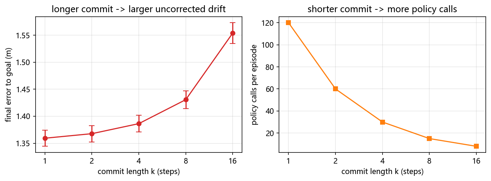

# 动作头与动作分块：从离散 token 到自适应 horizon

> **预计阅读：20 分钟 | 前置知识：Transformer 基础、模仿学习基础、本专题 [01-VLA架构演进](./01-VLA架构演进.md)**

---

## 1. 动作头的三个自由度

一个 VLA 拆开看就是三块：视觉编码器、语言主干、动作头。2026 年这一年的进展，多数不在主干上，而在动作头要回答的三个问题里：

1. **动作用什么表示** —— 离散 token，还是连续空间里生成
2. **一次输出多少步** —— 单步，还是一个 H 步的动作块（action chunk）
3. **执行多少步才重新规划** —— 全执行完，还是只执行前 k 步（commit length）

这三个自由度不是独立的。选了连续生成，就背上了迭代采样的延迟；选了大 H，就换来了闭环里的开环段。01 篇讲的是主干怎么演进（RT-2 → OpenVLA → π₀ → π₀.₅），这一篇把动作头这三条轴单独拆出来看。

> **判据**：这一节只界定问题边界。判断一个动作头设计属于哪一类，看它把"动作是什么"定义成了离散序列还是连续分布。

---

## 2. 动作表示之一：离散 token

把连续动作分箱，每个箱子给一个 token id，然后让语言模型像预测下一个词一样预测下一个动作。

**[arXiv'23.07] RT-2** — *RT-2: Vision-Language-Action Models Transfer Web Knowledge to Robotic Control* 用 256 个箱子把每一维动作离散化，动作就变成了可以被语言模型处理的符号序列。代价是量化误差：256 箱对应约 0.4% 的分辨率，而且动作维度一高，一个时间步就要吐出一长串 token。

**[arXiv'25.01] FAST** — *FAST: Efficient Action Tokenization for Vision-Language-Action Models* 针对的正是这个序列长度问题。它先对动作块做离散余弦变换（DCT），再对变换系数做字节对编码（BPE），把高频细节压掉、低频结构留下，token 序列因此短得多。

**[arXiv'26.07] OAT** — *Ordered Action Tokens for Visuomotor Policy Learning* 进一步把"什么叫好的动作 tokenizer"写成三条可检验的要求：**高压缩、完全可解码、token 空间有序**。前两条容易理解，第三条是它的核心主张：学出来的隐空间 tokenizer 往往没有结构，而下游策略需要一个能比较大小、能插值的 token 空间。OAT 用一个学出来的 tokenizer 同时满足三条。

离散表示的价值在于复用语言模型的生成范式：训练稳定，能吃到预训练知识，推理路径和文本生成完全一样。它的问题也很清楚：精度上限被箱数锁死，序列长度随动作维度线性增长。

> **判据**：离散 token 方案的适用边界是"动作精度要求低于量化步长"。超过这个边界，分箱就是精度的天花板。

---

## 3. 动作表示之二：连续生成

不做分箱，直接在连续空间里生成动作。

**[RSS'23] Diffusion Policy** — *Diffusion Policy: Visuomotor Policy Learning via Action Diffusion*（[arXiv:2303.04137](https://arxiv.org/abs/2303.04137)）把动作生成写成去噪过程：从高斯噪声出发，迭代若干步得到一段动作序列。它同时解决了两个问题：没有量化误差，而且因为生成的是分布，同一个观测下的多种合理动作都能被采样出来，不会像 MSE 回归那样塌到模态平均上。

**[RSS'24] 3D DP** — *3D Diffusion Policy: Generalizable Visuomotor Policy Learning via Simple 3D Representations*（[arXiv:2403.03954](https://arxiv.org/abs/2403.03954)）把条件从 2D 图像换成 3D 点云，用更少的示范达到更好的泛化，说明扩散头吃什么模态的观测是可以换的。

**[arXiv'24.10] RDT-1B** — *RDT-1B: a Diffusion Foundation Model for Bimanual Manipulation* 和 **[arXiv'24.11] CogACT** — *CogACT: A Foundational Vision-Language-Action Model for Synergizing Cognition and Action* 把扩散头接到十亿参数级的主干上，是这个方向从方法验证走向规模化的两步。

**[arXiv'24.10] π₀** 用的是流匹配（flow matching）：同为迭代采样，但训练目标是把噪声直接回归到速度场，采样步数通常比扩散少。01 篇第 5 节已经展开过 π₀ 与 π₀.₅，这里只取它对动作头的结论——连续生成换来了精度和多模态，代价是**每一步推理都要跑若干次去噪**。

**[arXiv'26.09] Quantile Head** — *Quantile Head for Vision-Language-Action Models* 想把这条代价压掉。它指出两类常见动作头各有短板：点回归只给一个点估计，标准流匹配采样要迭代。它把回归和流匹配统一到同一个目标下，再推广出分位数目标，让动作头**一次前向**就输出一组有序的分位数（中位数加正间隔），采样时按需取哪个分位。

> **判据**：连续生成方案的代价是推理延迟，不是精度。判断一个连续头好不好，先看它要几次前向，再看它精度多高。

---

## 4. 动作分块：ACT 的动机与"固定前缀"假设

**[RSS'23] ACT** — *Learning Fine-Grained Bimanual Manipulation with Low-Cost Hardware*（[arXiv:2304.13705](https://arxiv.org/abs/2304.13705)）提出了动作分块（action chunking）：不让策略每步都输出一个动作，而是一次输出未来 H 步的动作序列。

原始动机是**时序一致性**。单步策略在每一步独立预测，相邻两步的预测之间没有约束，噪声会让动作抖动。一次预测一整块，块内是一起生成的，抖动就小得多。

分块带进来一个新的设计参数：预测出 H 步之后，执行多少步才重新规划？这就是**提交长度 k**。绝大多数系统取 k = H，也就是把整块执行完再重规划，这个选择通常不写进论文正文，也不做消融。

> **判据**：动作分块的定义特征是"一次推理换多步执行"。看到一篇论文声称用了 chunking，先找它的 k 是多少。

---

## 5. 分块不是越长越好：误差在哪一段积累

"一次预测多步能减少误差累积"是面试里最常听到的一句话。2026 年有三篇工作从不同角度限定或推翻了它。

**[arXiv'26.10] RACE** — *When to Switch: Reliable Action-Chunk Extension for Vision-Language-Action Models* 直接分析了长动作块内部的动作误差分布，发现误差**集中出现在操作子技能的切换处**，并且随块长急剧增长。也就是说，块长本身不是问题，块里跨过了几次子技能边界才是问题。RACE 因此把注意力从"块多长"移到"什么时候切换子技能"。

**[arXiv'26.10] CA³C** — *Commit While Futures Agree: Consequence-Aware Adaptive Action Chunking for Robot Manipulation* 质疑的是判断依据。已有自适应方法靠动作之间的相似度或稳定性来估计该执行多长，CA³C 指出这个依据是错的：**不同的动作可以导向同一个成功结果，相似的动作也可能导向完全不同的未来**。所以该不该提交，应该由想象出来的未来是否一致决定，而不是动作空间里的相似度。

**[arXiv'26.10] FreeSpeed** — *Training-Free Speed Control for Generative Robot Policies* 观察到一个相关的量：动作块内部方向的不一致程度，反映了当前任务阶段的**关键程度**——也就是动作步长还能被改动多少而不破坏任务。

本仓库自己量过的 **[arXiv'26.10] KH-6** — *Measuring the Stability Assumption Behind Action Chunking*（[arXiv:2610.01626](https://arxiv.org/abs/2610.01626)）把这件事推到了更基础的一层。它的结论是：无论被动开环动力学还是策略重规划，都**不能稳定地收缩被注入的误差**，重规划也很少能把开环放大转成有信心的收缩，而"自信稳定"的状态本身就很少见。它给出的建议是显式地训练闭环反应性，而不是继续依赖分块带来的稳定性。

分块之所以在演示里有效，是因为演示状态大多落在会被修正的区域。这个前提在论文里很少被检验。

> **判据**：说"分块减少误差累积"之前，先说出它在什么状态下成立。KH-6 表明这个集合比通常假设的小。

---

## 6. 自适应 horizon：让策略自己决定提交多少

既然固定块长和固定提交长度都站不住，那就让模型自己决定。

**[arXiv'26.09] SplineWAM** — *SplineWAM: Adaptive Action Horizons for World Action Models via B-Spline Representations*（[arXiv:2609.39873](https://arxiv.org/abs/2609.39873)）把手里的问题说得很直白：世界动作模型每次推理吐一个固定长度的动作块，等于**把算力在时间上平均分配**——它没法在自由飞行段多跑一会儿，也没法在接触密集段多花算力。SplineWAM 把动作轨迹压缩成固定大小的三次 B 样条参数，结点时间按运动特性拟合，于是同一个参数预算能解码出不同时间分辨率和时长的块，执行跨度和下一次调用的间隔都随之自适应。它关心的指标是云端服务的吞吐。

**[arXiv'26.10] Vela** — *Vela: Scaling Vision-Language-Action Models with Adaptive Action Curve Parametrization* 走的是同一条思路：用自适应的动作曲线参数化替代固定步长的块。

方向是一致的：**把块长从一个超参数变成一个模型输出**。

> **判据**：自适应 horizon 方案与固定块长方案的差别，不在于精度更高，而在于算力不再被均摊到时间上。

---

## 7. 单步生成与异步重规划

迭代采样带来的直接后果是**走走停停**：机器人执行完一块动作，停下来等下一次推理，再动。

**[arXiv'26.09] IMLE-VLA** — *IMLE-VLA: Fast Single-Step Action Generation for Vision-Language-Action Policies* 把问题量化了：π₀.₅ 的流匹配头要 10 步 Euler 采样，这个迭代是推理瓶颈，直接造成机器人的走走停停和任务完成变慢。它用条件隐式最大似然估计（cIMLE）训练一个**单步**条件生成器，整个替换掉迭代动作头。

**[arXiv'26.09] GR00T N1.7 的 drift 动作头** — *Technical Report: One-Step Drifting Action Heads for GR00T N1.7*（[arXiv:2609.18108](https://arxiv.org/abs/2609.18108)）给出了这个方向的实测账。把 GR00T N1.7 里迭代的扩散 transformer 动作头换成单步 drifting 动作头，在 LIBERO 上：

- 动作头本身的平均前向时间：约 45.3 ms → 5.0 ms
- 主干加动作头的总时间：约 70.0 ms → 30.6 ms

这份报告值得单独提一句的地方是它的措辞：它明确写了这个加速**伴随代价**，没有只报速度。单步头部对闭环任务成功率的影响，它当成一个开放问题留下来。这正是这一节要的读法——单步生成把延迟压了近一个数量级，代价需要单独量。

异步重规划还有第二个问题：**块与块之间的一致性**。**[arXiv'26.10] EAPN** — *Execution-Aligned Progressive Noise for Consistent Asynchronous Replanning in Generative Robot Policies* 指出，每次重规划独立随机初始化会导致模式切换，相邻两块接不上。它让噪声轨迹跨重规划步传播并对齐实际执行位移，块内再建模时间相关性，从而让异步接续保持一致。

> **判据**：单步生成解决的是延迟，不自动解决一致性。异步重规划的接缝要单独处理。

---

## 8. 动作头设计：哪个轴真的重要

前面七节列了很多动作头设计选择。**[arXiv'26.09] What Makes an Efficient VLA?** — *What Makes an Efficient VLA? Navigating Action-Head Design, Scaling, and Latency*（[arXiv:2609.13984](https://arxiv.org/abs/2609.13984)）是这批工作里少见的**受控对比**：固定主干家族（SigLIP2 与 Qwen2.5）和训练流程，扫动作头设计与模块规模，并且给每个配置配了**实测的端上延迟**，而不是只报参数量。

它的主要结论是：**动作头的性能主要由初始化决定，而不是解码器结构、损失或推理预算。** 其中最大的单一杠杆是**把语言主干最后几层 transformer 拷贝进动作头**——这一条不增加延迟，而且在每个模块规模上都有效。

这条结论对上面几节有直接影响。如果初始化是主因，那么选择离散还是连续、扩散还是流匹配，对最终性能的影响都排在初始化之后。这也解释了为什么单步头能在压掉一个数量级延迟的同时，任务性能不必然崩掉。

> **判据**：比较两个动作头时，先对齐初始化来源；否则比的很可能不是头部本身。

---

## 9. 对无人机的含义

上面四条轴在操作臂上都成立。搬到无人机，有四处不一样。

**一是动作空间的精度需求更硬。** 操作臂的末端位移有接触约束兜底，偏一点可能还能抓上；四旋翼没有接触。姿态控制要求的是连续的高精度指令，256 箱的离散化分辨率在操作任务里够用，在 4 到 6 自由度的连续高速控制上就可能成为瓶颈。这是无人机侧更偏向连续生成头的一个具体理由，不是"连续更先进"这种一般性说法。

**二是分块在无人机上不是优化，是硬需求。** 控制回路要跑 50 到 200 Hz，而机载 VLA 推理的实测水平在 0.5 到 12 Hz 这一档（05 篇第 6 节有本仓库自己的账）。推理频率比控制频率低一到两个数量级，除了分块执行没有别的办法。这意味着**块长和提交长度在无人机上直接是安全参数**，而不是效率参数。

**三是子技能边界在空中可能不存在。** RACE 的核心发现是误差集中在操作子技能的切换处。空中飞行任务里没有"抓取—移动—放置"这种由接触状态定义的天然分段，flight 段之间的边界是语义上的而不是物理上的。RACE 的结论能不能迁移到空中，是一个**未经检验的问题**，不能默认成立。

**四是开环段没有兜底。** 操作臂开环跑偏通常只是抓空，四旋翼开环跑偏是失控。第 11 节的实测给出了这个代价的具体数字。

无人机主线上的对应工作：**[arXiv'26.07] AeroAct** — *AeroAct: Action-Centered World-Action Models for Language-Conditioned Quadrotor Flight*（[arXiv:2607.14997](https://arxiv.org/abs/2607.14997)）是目前少见的、把语言条件的世界动作模型真正放到四旋翼飞行上做的工作。世界模型 × VLA 这条线在 10 篇展开。

> **判据**：把操作臂上的动作头结论搬到无人机之前，先检查这四处，尤其是第三处——子技能边界的缺失会让"误差集中在切换处"这条结论失去前提。

---

## 10. 关键论文

- **[arXiv'23.04] ACT** — *Learning Fine-Grained Bimanual Manipulation with Low-Cost Hardware*  
  [](https://arxiv.org/abs/2304.13705)
  提出动作分块

- **[RSS'23] Diffusion Policy** — *Diffusion Policy: Visuomotor Policy Learning via Action Diffusion*  
  [](https://arxiv.org/abs/2303.04137)
  扩散动作头，建模多模态

- **[RSS'24] 3D Diffusion Policy (DP3)** — *3D Diffusion Policy (DP3): Generalizable Visuomotor Policy*  
  [](https://arxiv.org/abs/2403.03954)
  3D 条件扩散，少样本泛化

- **[arXiv'24.10] RDT-1B** — *RDT-1B: a Diffusion Foundation Model for Bimanual Manipulation*  
  [](https://arxiv.org/abs/2410.07864)
  十亿参数扩散基础模型

- **[arXiv'24.11] CogACT** — *CogACT: A Foundational Vision-Language-Action Model for Synergizing Cognition and Action in Robotic Manipulation*  
  [](https://arxiv.org/abs/2411.19650)
  认知与动作协同的 VLA

- **[arXiv'25.01] FAST** — *FAST: Efficient Action Tokenization for Vision-Language-Action Models*  
  [](https://arxiv.org/abs/2501.09747)
  DCT+BPE 压缩动作 token

- **[arXiv'25.02] Fine-Tuning Vision-Language-Action Models: Optimizing Speed and Success** — *Stanford*  
  [](https://arxiv.org/abs/2502.19645)
  OpenVLA-OFT，并行解码提速

- **[arXiv'26.09] What Makes an Efficient VLA? Navigating Action-Head Design, Scaling, and Latency**  
  [](https://arxiv.org/abs/2609.13984)
  受控对比：初始化是主要杠杆

- **[arXiv'26.09] SplineWAM** — *SplineWAM: Adaptive Action Horizons for World Action Models via B-Spline Representations*  
  [](https://arxiv.org/abs/2609.39873)
  B 样条自适应块长

- **[arXiv'26.09] IMLE-VLA** — *IMLE-VLA: Fast Single-Step Action Generation for Vision-Language-Action Policies*  
  [](https://arxiv.org/abs/2609.10915)
  单步生成替换迭代头

- **[arXiv'26.09] Technical Report: One-Step Drifting Action Heads for GR00T N1.7** — *NVIDIA*  
  [](https://arxiv.org/abs/2609.18108)
  45.3→5.0 ms，附代价说明

- **[arXiv'26.09] Quantile Head for Vision-Language-Action Models**  
  [](https://arxiv.org/abs/2609.34061)
  一次前向出分位数

- **[arXiv'26.10] When to Switch: Reliable Action-Chunk Extension for Vision-Language-Action Models**  
  [](https://arxiv.org/abs/2610.05719)
  误差集中在子技能切换处

- **[arXiv'26.10] Commit While Futures Agree: Consequence-Aware Adaptive Action Chunking for Robot Manipulation**  
  [](https://arxiv.org/abs/2610.07949)
  按未来一致性决定提交

- **[arXiv'26.10] FreeSpeed** — *FreeSpeed: Training-Free Speed Control for Generative Robot Policies*  
  [](https://arxiv.org/abs/2610.05734)
  动作方向不一致反映阶段关键度

- **[arXiv'26.10] Execution-Aligned Progressive Noise for Consistent Asynchronous Replanning in Generative Robot Policies**  
  [](https://arxiv.org/abs/2610.06090)
  跨块噪声传播保一致

- **[arXiv'26.07] Ordered Action Tokens for Visuomotor Policy Learning**  
  [](https://arxiv.org/abs/2607.21670)
  动作 tokenizer 三条准绳

- **[arXiv'26.10] Measuring the Stability Assumption Behind Action Chunking**  
  [](https://arxiv.org/abs/2610.01626)
  稳定性假设很少成立

- **[arXiv'26.07] AeroAct** — *AeroAct: Action-Centered World-Action Models for Language-Conditioned Quadrotor Flight*  
  [](https://arxiv.org/abs/2607.14997)
  语言条件世界动作模型上四旋翼

---

## 11. 动手验证：提交长度 → 闭环精度

第 4 节说提交长度 k 是个通常不被消融的参数，第 9 节说它在无人机上是安全参数。这一节把 k 的代价量出来。

**为什么不用学出来的策略。** 本仓库 [`code/b_lang_cond_policy.py`](../../code/b_lang_cond_policy.py)（Demo B）已经量过"模仿损失低、闭环飞不好"。如果这里也训一个 BC 策略，它本身会在 100 步里发散到 6 m 以外，把 k 的效应整个淹掉，结论还和那篇重复。所以这里把变量隔离出来：动作块由**标称无风模型**把专家律展开成 H 步得到，再在**有阵风**的真实环境里开环执行前 k 步。策略对风一无所知，风就是"预测时看不到、执行时才出现"的那部分偏差。

自变量是 k，不是动作头类型。后者是另一题，见 [`code/c_action_heads.py`](../../code/c_action_heads.py)。

### 11.1 核心代码

```python
H = 16                 # 预测的动作块长度（步）
T_EP = 120             # 每回合步数
WIND_STD = 1.2         # 阵风加速度标准差 (m/s^2)，每回合固定、策略不可见
KS = [1, 2, 4, 8, 16]  # 提交长度扫描

def predict_chunk(obs, goal):
    """在当前状态上，用标称无风动力学把专家律展开成 H 步动作块。"""
    env = QuadSim(obs.shape[0], dt=DT)
    env.p, env.v = obs[:, 0:3].clone(), obs[:, 3:6].clone()
    env.rpy, env.om = obs[:, 6:9].clone(), obs[:, 9:12].clone()
    acts = []
    for _ in range(H):
        a = expert(env, goal)
        acts.append(a)
        env.step(a)                    # 标称动力学：这里没有风
    return torch.stack(acts, dim=1)    # (n, H, 4)

def rollout(k, rep):
    """闭环：预测 H 步 -> 开环执行前 k 步（期间有阵风）-> 重规划。"""
    torch.manual_seed(1000 + rep)
    env = QuadSim(N_EP, dt=DT); env.reset(rand=True, pos_std=0.6, vel_std=0.4)
    wind = WIND_STD * torch.randn(N_EP, 3)      # 策略全程不知道风的存在
    calls, t = 0, 0
    while t < T_EP:
        chunk = predict_chunk(env.obs(), goal)
        calls += 1
        for j in range(k):
            env.step(chunk[:, j])
            env.v = env.v + wind * DT            # 风只在这里起作用
            t += 1
            if t >= T_EP: break
    return torch.norm(env.p - goal, dim=-1).mean().item(), calls
```

### 11.2 本地实测结果

```
窗口：256 回合 × 120 步｜动作块 H=16｜阵风 σ=1.2 m/s^2（策略不可见）

闭环扫描（每档重复 5 次，报均值 ± 标准差）
     k            终点误差(m)       策略调用
     1      1.3593 ± 0.0150        120
     2      1.3677 ± 0.0152         60
     4      1.3863 ± 0.0156         30
     8      1.4307 ± 0.0165         15
    16      1.5539 ± 0.0192          8
```

三点读法。

**误差随 k 单调上升，且远高于噪声。** 从 k=1 的 1.359 m 到 k=16 的 1.554 m，涨了 14.3%；同一档内 5 次重复的标准差在 0.015 到 0.019 之间，档间差异是几十个标准差。这不是噪声。

**算力换回的是量级。** 策略调用从 120 次降到 8 次，15 倍；换来的误差代价是 14.3%。也就是说把 k 从 1 提到 16 是笔划算的交易——但"划算"是算出来的，不是默认成立的。第 5 节引的 KH-6 表明，在另一些状态分布下这个交易会反过来。

**k=1 的残差不是零。** 1.359 m 是常值阵风下 P-D 控制器的稳态偏差，与分块无关。把 k=1 当作"无分块基线"时，这部分要扣掉——真正属于分块的代价是 1.554 − 1.359 = 0.195 m。

单次实验的替代：脚本固定了三个随机种子（示范用 `SEED=0`，每档重复换 `1000+rep`），图上的误差棒来自这 5 次重复。



### 11.3 运行完整脚本

```bash
py -3.9 code/p_chunk_horizon.py
```

依赖 `torch`、`numpy`、`matplotlib`（见 [`code/requirements.txt`](../../code/requirements.txt)），纯 CPU 约 10 秒。

---

## 12. 延伸阅读

- [05-机载部署与优化](./05-机载部署与优化.md) — 第 6 节的实时性账，是第 9 节"分块在无人机上是硬需求"的数字来源
- [07-数据、预训练与跨具身](./07-数据、预训练与跨具身.md) — 动作表示决定了跨具身共享发生在哪个空间
- [10-世界模型增强VLA](./10-世界模型增强VLA.md) — SplineWAM 与 AeroAct 都属于世界动作模型，这一篇展开
- [01-VLA架构演进](./01-VLA架构演进.md) — 主干侧的演进，本篇只讲动作头

---

## 13. 思考题

**题目 1：为什么离散 token 方案在无人机上更吃亏？**

RT-2 用 256 个箱子离散化每一维动作，在操作任务上表现正常。请从动作空间的性质出发，说明为什么同样的离散化在四旋翼姿态控制上会更早遇到瓶颈。

<details>
<summary>参考答案</summary>

**量化误差的量级不同。** 256 箱把每一维归一化动作切成约 0.4% 的分辨率。操作臂的末端位移有接触约束：抓取时位置偏几毫米，往往仍能靠摩擦和柔顺性完成抓取，误差被任务本身吸收。四旋翼没有接触，姿态和角速率的偏差会直接积分进轨迹，0.4% 的分辨率作用在角速率指令上，随时间是累积的。

**维度数和频率都更高。** 操作臂常见 7 维动作、频率 10 到 50 Hz；四旋翼是 4 维推力加角速率、控制回路 50 到 200 Hz。离散化之后一个时间步要吐出的 token 数随维度和频率一起增长，而语言模型的序列长度是有成本的。

**结论：** 离散 token 的适用边界是"动作精度要求低于量化步长"，这个边界在无人机上更早被撞到。但这不意味着离散方案在无人机上不可用——它换来的训练稳定性和语言模型复用仍然有价值，只是需要更细的分箱或更短的块来补偿。这是一条需要用实验确认的取舍，不是可以事先断言的结论。

</details>

---

**题目 2：把 RACE 的结论搬到无人机，缺了什么前提？**

RACE（arXiv:2610.05719）发现长动作块里的误差集中在操作子技能的切换处，因此主张把注意力从块长移到"什么时候切换子技能"。如果把这条结论直接搬到空中飞行任务，需要补上什么前提？

<details>
<summary>参考答案</summary>

**缺的是"子技能边界存在且可检测"这个前提。** RACE 能在操作任务里定位切换点，是因为操作任务的分段由**接触状态**定义：抓取、移动、放置各自对应明确的接触事件，边界是物理的、可从观测中识别的。子技能切换处误差大，很可能正是因为接触切换本身带来了动力学突变。

**空中飞行任务的边界是语义的。** 一条"从 A 飞到 B 再绕开障碍"的指令里，飞行段之间的边界不由物理事件标记，而由任务语言划分。这意味着两件事：一是没有天然的可检测信号来定位切换点，RACE 的"什么时候切换"在空中可能无从下手；二是误差是否也会在这些语义边界处聚集，是一个**未经检验的经验问题**——空中没有接触突变，误差的聚集机制可能完全不同，也可能根本不存在聚集。

**结论：** 可以提出的假设是"空中的分段边界需要由语言或任务结构显式给出，而不是从接触状态自动检测"；但不能直接把 RACE 的结论当作空中也成立。这正是本仓库 CONTRIBUTING 要求的写法：写明迁移点，或写明不可迁移的原因。这里属于后者，且这个"不可迁移"本身是一个可以做的研究问题。

</details>

---

**题目 3：动作头的初始化为什么比结构更重要？**

arXiv:2609.13984 在固定主干和训练流程的条件下，发现动作头性能主要由初始化决定，其中最大的杠杆是把语言主干最后几层 transformer 拷贝进动作头。请解释为什么这个操作有效，以及它对"该选哪种动作头"这个问题的影响。

<details>
<summary>参考答案</summary>

**有效的原因在于表示对齐。** 动作头要吃主干输出的隐表征，再把它映射成动作。如果动作头从随机初始化开始，它必须先学一套能读懂主干特征的映射，再学从特征到动作的映射，两件事一起学。把主干最后几层拷进动作头，等于让动作头一开始就带着主干的表示空间——它只需要学"从这个已有表示到动作"这一步。

**这也解释了摘要里的另一句话。** 该文说对齐也解释了其他轴：动作头的解码器结构、损失函数、推理预算，都是在**已经对齐**的前提下才有意义的次要因素。没有对齐时，这几个轴的影响被初始化误差掩盖。

**对选型的影响：** "该选扩散头还是流匹配头、离散还是连续"这类问题的答案，取决于初始化方案而不是头本身。比较两个动作头时如果初始化来源不同，比出来的很可能是初始化而不是头部设计。这条对第 3 节和第 7 节的所有结论都构成一个约束：那些结论成立的前提是初始化已对齐。

**结论：** 动作头选型的第一步不是选结构，是把初始化对齐。在这一点上，无人机没有特殊之处——但无人机上动作头必须小（机载算力），拷贝主干层会增加参数，这个权衡需要单独算。

</details>

---

> **下一节**：[07-数据、预训练与跨具身](./07-数据、预训练与跨具身.md) — 动作表示决定了跨具身共享发生在哪个空间
