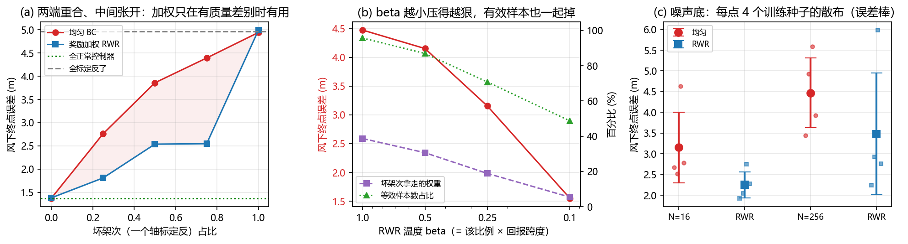

# 强化学习后训练与自我改进：奖励是数据之外的第二类信息

> **预计阅读：22 分钟 | 前置知识：策略梯度与优势函数的基础、[07-数据、预训练与跨具身](./07-数据、预训练与跨具身.md) 第 9 节**

---

## 1. 模仿之后为什么还要接一段奖励

07 篇的结论是数据是第一约束。这一篇要处理的是数据之外的那条路：**不用更多示范，改成给好坏打分**。

模仿学习有一个无法用更多数据补上的上限：它学的是演示数据的中心趋势。本仓库 [Demo B](../../code/b_lang_cond_policy.py) 已经量过这件事的另一面：给专家数据加噪声，模仿损失涨 1000 倍，闭环终点误差反而降 30%。模仿损失低不等于策略好，说明"拟合数据"和"会飞"是两件事。

奖励提供的是性质不同的信息。给示范，你等于告诉策略**该怎么做**，一条轨迹一个样本。给奖励，你只需要告诉它**这次做得怎么样**，一个标量。前者是逐时刻的、稠密的、要求你写出正确答案；后者是回合级的、稀疏的、只要求你能判断好坏。当"好坏"比"正确答案"容易给的时候，第二条路就更便宜。

本仓库 [08-研究前沿与开放问题/04-最新进展与团队追踪](../08-研究前沿与开放问题/04-最新进展与团队追踪.md) 里的判断是，SFT 之后再上一段 RL 已经从加分项变成默认流程。这一篇要把这个默认流程拆开看。

> **判据**：判断一件事该不该用 RL 做，先问"这个信息在有标注的示范里出现过吗"。出现过就是拟合问题，更多数据能解；只以好坏的形式存在，才是 RL 的输入。

---

## 2. 奖励从哪来

RL 的第一步不是算法，是奖励。文献里的来源归成五类。

**稀疏成功信号。** 最原始的形式：任务成功给 1，失败给 0。便宜，但信用分配难，一个回合几百步里只有最后一刻有信号。

**学出来的成功概率。** **[arXiv'26.09] Demonstration-Free Success-Probability Reward Learning** — *Demonstration-Free Success-Probability Reward Learning for Generalist Robot Policies*（[arXiv:2609.33653](https://arxiv.org/abs/2609.33653)）从标题给出的立场是：不依赖示范，直接学一个"当前状态还能不能成功"的概率函数当奖励。这条路的价值在于通用策略的奖励不必每个任务重写。

**值模型。** **[arXiv'26.08] RynnValue** — *RynnValue: Scaling Robotic Value Foundation Models with Temporal Distance*（[arXiv:2608.09853](https://arxiv.org/abs/2608.09853)）用的信号是**时间距离**：离目标还有多久。它比二值成功稠密得多，而且不需要任务专属的奖励工程。

**人类偏好。** 不写数值奖励，只给两个结果排个先后。**[arXiv'23.05] DPO** — *Direct Preference Optimization: Your Language Model is Secretly a Reward Model*（[arXiv:2305.18290](https://arxiv.org/abs/2305.18290)）把"偏好 → 奖励 → 策略"三步压成一步直接优化策略。VLA 侧的对应工作是 **[arXiv'26.08] Beyond Pairwise Feedback** — *Beyond Pairwise Feedback: Listwise Vision-Language Supervision for Preference-Based Reward Learning*（[arXiv:2608.25350](https://arxiv.org/abs/2608.25350)），把两两比较推广到一整列候选的排序。

**视觉奖励。** 用图像判断任务是否完成，不需要真值状态。它的风险在 **[arXiv'26.10] CriticHack** — *CriticHack: Evaluating Visual Rewards Under Robot Policy Optimization*（[arXiv:2610.02527](https://arxiv.org/abs/2610.02527)）的标题里：视觉奖励不该在静态数据集上评，而该放在**被它优化的策略**里评——因为策略会去找奖励的漏洞。

> **判据**：检验奖励函数的方式不是"它是否描述了任务意图"，而是"在这个奖励下最优的那个策略，是不是我要的行为"。CriticHack 这类工作存在的理由，就是这条判据很少被执行。

---

## 3. 策略梯度在 VLA 上的形态：从 PPO 到 GRPO

算法侧要解决的核心矛盾是：**主干很大，值函数也很贵**。

**[arXiv'17.07] PPO** — *Proximal Policy Optimization Algorithms*（[arXiv:1707.06347](https://arxiv.org/abs/1707.06347)）是这一路的基线。它需要一个和策略同规模的值网络（critic）来估优势，再用裁剪的重要性比限制每次更新幅度。在 7B 级 VLA 上挂一个 7B 的 critic，显存翻倍，而且 critic 自己要训得准。

**[arXiv'24.02] GRPO** — *DeepSeekMath: Pushing the Limits of Mathematical Reasoning in Open Language Models*（[arXiv:2402.03300](https://arxiv.org/abs/2402.03300)）给出了一个去掉 critic 的办法：同一个提示采样一组回答，用**组内均值**当基线，组内的相对好坏就是优势。省掉一个与策略同规模的值网络，对机载部署是直接的收益。

GRPO 到 VLA 上有两个已知的钝角。**[arXiv'26.08] Prism-GRPO** — *Prism-GRPO: Faster VLA Policy Optimization via Splitting Same-outcome Groups*（[arXiv:2608.17423](https://arxiv.org/abs/2608.17423)）指出，一组采样如果结果全都一样，组内相对比较给不出任何梯度；它按结果把组拆开以提高有效梯度密度。**[arXiv'26.10] eRLT** — *eRLT: Efficient VLA Reinforcement Learning via Action-Relevant Token Routing*（[arXiv:2610.00913](https://arxiv.org/abs/2610.00913)）针对的是算力分配：VLA 的序列里大多数 token 与动作无关，RL 的梯度只该落在与动作相关的那些上。

另两篇把这件事往更基础的一层推。**[arXiv'26.06] Z-1** — *Z-1: Efficient Reinforcement Learning for Vision-Language-Action Models*（[arXiv:2606.31846](https://arxiv.org/abs/2606.31846)）是效率方向的方法工作。**[arXiv'26.09] The Low-Rank Structure of VLA Reinforcement Learning** — *The Low-Rank Structure of VLA Reinforcement Learning*（[arXiv:2609.34599](https://arxiv.org/abs/2609.34599)）从标题看，研究的正是"RL 到底在改哪几个自由度"：如果更新落在低秩子空间，那么 RL 微调真正改动的维度远小于参数量，这对 LoRA 类部署方案是一个直接相关的结构问题。

**[arXiv'26.09] Dissecting Advantage-Guided Post-Training** — *Dissecting Advantage-Guided Post-Training for Vision-Language-Action Policies*（[arXiv:2609.28161](https://arxiv.org/abs/2609.28161)）从标题看是把优势引导的后训练拆开：这一类方法里，哪一部分才是真正起作用的那一部分。

> **判据**：评价一个 VLA 的 RL 方案，除了成功率还要看它报不报 critic 的显存与每步前向次数。省掉 critic 是 GRPO 唯一的卖点，不报就等于没报。

---

## 4. 优势条件化：把 RL 装进监督学习的外壳

上面那一节是"在策略上做梯度估计"。还有一条完全不同的路：**不估梯度，改成给数据加权**。

**[arXiv'19.10] AWR** — *Advantage-Weighted Regression: Simple and Scalable Off-Policy Reinforcement Learning*（[arXiv:1910.00177](https://arxiv.org/abs/1910.00177)）的做法是：把优势取指数当权重，然后照常做监督回归。训练循环和模仿学习一模一样，只是在损失里乘了 `exp(A/β)`。它天然支持离策略数据，也不需要重要性比。

这条线在 VLA 上的代表是 **[arXiv'25.11] RECAP** — *π\*₀.₆: a VLA That Learns From Experience*（[arXiv:2511.14759](https://arxiv.org/abs/2511.14759)）。RECAP 是 RL with Experience and Corrections via Advantage-conditioned Policies 的缩写，做法是把优势当成**策略的输入条件**：训练时告诉模型"这条数据是在多大优势下产生的"，推理时指定一个高优势条件，策略就偏向那类行为。它的三个设计点值得记：

- 优势条件化让**示范、自主采集、人工干预**三类异质数据能进同一个训练目标，而不需要各自单独处理
- 在真实家庭折衣服、装箱、用专业咖啡机做浓缩这些最难的任务上，吞吐翻倍以上，失败率大致减半
- 因为它还是监督回归，训练稳定性接近 SFT，而不是 PPO 那一类

代价要说清楚：**加权只能在数据集支持的区域里重新分配质量，不能产生数据里没有的行为。** 这是它和策略梯度之间的分界线，也是第 11 节 Demo Q 量出来的那个东西——软加权压不干净。

> **判据**：优势条件化把 RL 变成了数据加权问题。它的收益上界由数据集里已有的行为多样性决定，不由算法决定。数据集里没有的机动，加权一万次也拿不到。

---

## 5. 算力放在哪一栏

RL 后训练比 SFT 贵得多，因为要采样。贵在哪一栏是个独立的问题。

**[arXiv'26.07] Where Should RL Post-Training Compute Go?** — *Where Should RL Post-Training Compute Go? Model Size, Search, Learning, and Feedback*（[arXiv:2607.13389](https://arxiv.org/abs/2607.13389)）从标题就把账分成了四栏：模型规模、搜索（采样）、学习（更新）、反馈（奖励与评估）。分栏的意义在于这四者是可替换的：更大的模型、更多的采样、更好的反馈，都可能是同一个成功率提升的来源，而只有明确分栏才能知道该买哪一个。

两篇和具体架构绑定的工作是这条账目落到 VLA 上的例子。**[arXiv'26.07] PAC-ACT** — *PAC-ACT: Post-training Actor-Critic for Action Chunking Transformers*（[arXiv:2607.09590](https://arxiv.org/abs/2607.09590)）给 06 篇讲过的 ACT 动作分块架构接 actor-critic：分块架构下"一个动作"其实是一个块，信用分配的时间粒度因此和单步策略不同。**[arXiv'26.08] RL Bootstrapping of OpenVLA-OFT** — *RL Bootstrapping of OpenVLA-OFT for a Novel Robot Embodiment*（[arXiv:2608.01013](https://arxiv.org/abs/2608.01013)）做的是把 RL 用在适配新具身上，和 07 篇的跨具身话题相接。

> **判据**：RL 后训练的算力要按四栏报（模型、采样、学习、反馈），只报总数等于没报。四栏之间是可替换的，不拆开就无法判断该加哪一栏。

---

## 6. 在世界模型内部做 RL

采样贵，于是有人问：能不能在想象里采。

**[arXiv'26.09] Imagine-RL** — *Imagine-RL: Residual-Confidence-Guided Cross-Attention for World-Model-Augmented VLA Reinforcement Learning*（[arXiv:2609.24033](https://arxiv.org/abs/2609.24033)）把世界模型当作 RL 的额外信息源接到 VLA 上。**[arXiv'26.09] RoboCoach** — *RoboCoach: World Models as Active Coaches for Compositional Robot Skills*（[arXiv:2609.39685](https://arxiv.org/abs/2609.39685)）的角色更主动：世界模型不只是生成 rollout，还用来**教练**组合技能。**[arXiv'26.09] Prioritized Rollouts** — *Prioritized Rollouts for Efficient World Model-based Vision-Language-Action Policy Optimization*（[arXiv:2609.22879](https://arxiv.org/abs/2609.22879)）处理的是采样预算怎么分配。**[arXiv'26.09] Direct Experience World-Model Optimization** — *Direct Experience World-Model Optimization: Learning the World Beyond Action Imitation*（[arXiv:2609.37398](https://arxiv.org/abs/2609.37398)）和 **[arXiv'26.07] WorldSample** — *WorldSample: Closed-loop Real-robot RL with World Modelling*（[arXiv:2607.02431](https://arxiv.org/abs/2607.02431)）都在真机闭环这一侧用法不同。

这一节有一个必须先回答的问题：**策略学会的是任务，还是世界模型的偏差？** 世界模型在长 rollout 上的误差会增长，而策略恰好擅长寻找这个误差最大的地方——它只要在那里拿到高回报，就能在真实环境里拿到零回报。所以世界模型内的 RL 必须报想象 rollout 的误差随步长的增长曲线；不报这一条，成功率提升分不清是学会了任务还是过拟合了模型。

> **判据**：评价世界模型内的 RL，第一张图不是学习曲线，是"想象 rollout 的误差 vs 步数"。这条曲线决定了想象能替代真实环境多少步。

世界模型与 VLA 的完整接缝在 10 篇展开。

---

## 7. 自我改进飞轮

把上面几节合起来，就得到一个循环：策略跑任务、采到成功与失败、用奖励重新训练、再跑。这个循环叫自我改进飞轮，2026 年它在"谁来提供失败"这一点上分成了几条路。

**[arXiv'26.09] Find Something You Can't Do** — *Find Something You Can't Do: Agentic Real-World Reinforcement Learning for Self-Improving VLA Models*（[arXiv:2609.32069](https://arxiv.org/abs/2609.32069)）让模型自己去**找**它做不了的任务，再针对这些任务训练。这解决的是飞轮最常见的一种空转：如果每次都采已经会做的任务，采到的数据对提升没有贡献。

**[arXiv'26.09] F4R** — *F4R: Failure-Driven Recognition, Reconstruction, Refinement, and Redeployment for Continual Robot Self-Improvement*（[arXiv:2609.35575](https://arxiv.org/abs/2609.35575)）把失败当成一等输入，走识别—重建—精修—重部署四步。**[arXiv'26.10] EmbodiedSmith** — *EmbodiedSmith: Scaling Embodied Data through Recursive Self-Improvement Flywheel in Simulation*（[arXiv:2610.07969](https://arxiv.org/abs/2610.07969)）在仿真里跑这个飞轮来造数据，直接对着 07 篇的数据稀缺问题。**[arXiv'26.09] BEE** — *BEE: Intervention-Adaptive Real-World Reinforcement Learning with Vision-Language-Action Models*（[arXiv:2609.27450](https://arxiv.org/abs/2609.27450)）处理人的干预：什么时候需要人接手、接手后这份数据怎么用。

还有一批工作在优化"重新训练之前发生什么"。**[arXiv'26.07] Learning from Hindsight** — *Learning from Hindsight for VLA Reinforcement Learning*（[arXiv:2607.09042](https://arxiv.org/abs/2607.09042)）用后见之明重标注失败轨迹的目标，把失败转成可用的监督。**[arXiv'26.08] Beyond Imitation** — *Beyond Imitation: Self-Improving Robot Policies via Off-Policy Q-Planning*（[arXiv:2608.21204](https://arxiv.org/abs/2608.21204)）和 **[arXiv'26.08] Max-Q Selective Imitation** — *Max-Q Selective Imitation for Human-in-the-Loop Online Robot Learning*（[arXiv:2608.15088](https://arxiv.org/abs/2608.15088)）都在问同一个问题：手上有 Q 值之后，该继续模仿谁的示范。

> **判据**：飞轮的转速由"谁来提供失败"决定，而不是由"谁来提供成功"决定。一个只会采成功样本的飞轮会停在当前水平上打转。

---

## 8. 这一层的真正难点：奖励会被钻空子

前面几节把奖励当输入。这一节要说的是，奖励本身是被优化的对象。

**[arXiv'26.10] CriticHack** 的立场已经说明了问题的性质。这不是新问题，是 RL 的固有性质：策略优化的是奖励，不是任务；两者只要不完全一致，优化压力就会找到缝。VLA 上这条缝有几种具体形态：

- **视觉奖励**：策略学会让画面看起来像成功，而不是成功
- **成功的多样性坍缩**：一个奖励如果只认一种完成方式，策略就会丢掉其余方式。**[arXiv'26.10] Many Ways to Succeed** — *Many Ways to Succeed: Diversity-Driven RL Fine-Tuning for VLA Generalization*（[arXiv:2610.09943](https://arxiv.org/abs/2610.09943)）针对的正是这个
- **安全项激励反向**：把碰撞写成一个负奖励项，训练早期的探索会为了试探边界而穿过它。地面碰撞的代价可能是抓空，空中是坠机

第三条对无人机是硬约束。本仓库 Part 2 的安全那一线（CBF 与安全层）走的是**在动作上做投影**这条路：安全由约束或过滤层保证，不由奖励项保证。这两条路在实现上是接缝——RL 后训练会主动寻找动作空间里没被约束住的方向，而如果安全层的投影把那些方向全部切掉，RL 在这类状态上就学不到任何梯度。这个矛盾在文献里还没有标准答案，本篇只能指出它存在。

> **判据**：RL 后训练上线前的检查表，第一条不是成功率涨了多少，而是"这个策略有没有学会奖励函数里的捷径"。成功率提升和奖励作弊在训练曲线上长得一样。

---

## 9. 对无人机的含义

空中的 RL 后训练已经有一批直接做在飞行任务上的工作。

**[arXiv'26.06] Expert-Guided GRPO** — *Towards Precise Intent-Aligned VLA Aerial Navigation via Expert-Guided GRPO*（[arXiv:2606.02313](https://arxiv.org/abs/2606.02313)）是目前最直接的一条：用专家引导的 GRPO 把飞行策略对齐到语言意图上。**[arXiv'26.08] RefineFly** — *RefineFly: Failure-Aware Post-Training for Aerial Vision-Language Navigation*（[arXiv:2608.09467](https://arxiv.org/abs/2608.09467)）做的是失败感知的空中视觉语言导航后训练。**[arXiv'26.08] AeroDPO** — *AeroDPO: Unleashing Lightweight UAV Navigation with High-Fidelity Perception and Automated Preference Optimization*（[arXiv:2608.07557](https://arxiv.org/abs/2608.07557)）用的是偏好优化这一路，说明空中也有人走"不需要仿真器、只需要排序"的轻量后训练。**[arXiv'26.09] AeroManip-VLA** — *AeroManip-VLA: Scalable Vision-Language-Action Learning for Aerial Manipulation with RL-Generated Demonstrations*（[arXiv:2609.36915](https://arxiv.org/abs/2609.36915)）把 RL 用在更前面一步：不是改进策略，而是**生成示范**，绕开真机采集（07 篇第 9 节已经引过）。

把这批工作读到一起，空中相比地面多出三个约束。

> **题名口径（2026-10）**：`arXiv:2608.09467` 的题名**改过**。v1（2026-08-10）与 v2（2026-08-28）是 *"RecoverFly: A Failure-Aware Reinforcement Learning Post-Training Framework for Aerial Vision-Language Navigation"*；v3（2026-09-26）改名为 *"RefineFly: Failure-Aware Post-Training for Aerial Vision-Language Navigation"*。本仓库按**当前版本**写作 RefineFly，**不要**按 v1/v2 回改成 RecoverFly。同篇 `arXiv:2608.01013` 的题名逐字是 *"RL Bootstrapping of OpenVLA-OFT for a Novel Robot Embodiment"*，正文与第 10 节的引用均已按此写全。

**一是 reset 不是免费的。** 地面抓取失败，重试的代价是几秒和一个动作。飞行失败要重新起飞、重新进空域、耗一截电池，如果带螺旋桨和机身损伤，代价还要再加。真机在线 RL 依赖大量重置，空中给不出这个量级的重置预算。这不是"贵一点"，是样本预算小一到两个数量级。

**二是仿真器保真度直接是 RL 的上界。** 世界模型内的 RL 会把策略推向仿真器与真实世界的偏差处。操作臂上的偏差表现为穿透、漂浮、物体不真实；四旋翼上的偏差是气动力、桨叶下洗、风扰、电池电压曲线。策略只要能利用其中任何一项拿到回报，它就会利用。所以空中 RL 的仿真器保真度不是一个工程细节，而是这套方法的性能上限，而这正是本仓库 02-世界模型专题关心的对象。

**三是安全不能当奖励项。** 第 8 节第三条。

这三个约束指向同一个结论：空中 RL 的第一选择是**离线或半离线**（加权、优势条件化、离线 Q），第二选择是仿真内 RL 加严格的安全层，真机在线 RL 只在有专门硬件和保护措施时成立。

> **判据**：评价一个空中 RL 方案，先问两件事：每单位提升花了多少次真机重置，以及安全是由奖励项还是由约束层实现的。答不上这两条的，成功率数字不可比。

---

## 10. 关键论文

- **[arXiv'17.07] Proximal Policy Optimization Algorithms** — *OpenAI*  
  [](https://arxiv.org/abs/1707.06347)
  PPO，值网络 + 裁剪重要性比

- **[arXiv'19.10] Advantage-Weighted Regression: Simple and Scalable Off-Policy Reinforcement Learning**  
  [](https://arxiv.org/abs/1910.00177)
  AWR，优势取指数当权重

- **[NeurIPS'23] Direct Preference Optimization** — *Direct Preference Optimization: Your Language Model is Secretly a Reward Model*  
  [](https://arxiv.org/abs/2305.18290)
  DPO，偏好直接优化策略

- **[arXiv'24.02] DeepSeekMath** — *DeepSeekMath: Pushing the Limits of Mathematical Reasoning in Open Language Models*  
  [](https://arxiv.org/abs/2402.03300)
  GRPO，组内基线去掉 critic

- **[arXiv'25.11] $π^{*}_{0.6}$: a VLA That Learns From Experience** — *Physical Intelligence*  
  [](https://arxiv.org/abs/2511.14759)
  RECAP，优势条件化吃三类异质数据

- **[arXiv'26.06] Towards Precise Intent-Aligned VLA Aerial Navigation via Expert-Guided GRPO**  
  [](https://arxiv.org/abs/2606.02313)
  专家引导 GRPO 对齐飞行意图

- **[arXiv'26.06] Z-1** — *Z-1: Efficient Reinforcement Learning for Vision-Language-Action Models*  
  [](https://arxiv.org/abs/2606.31846)
  VLA 的高效 RL

- **[arXiv'26.07] WorldSample** — *WorldSample: Closed-loop Real-robot RL with World Modelling*  
  [](https://arxiv.org/abs/2607.02431)
  真机闭环 RL + 世界模型

- **[arXiv'26.07] Learning from Hindsight for VLA Reinforcement Learning**  
  [](https://arxiv.org/abs/2607.09042)
  后见之明重标注失败轨迹

- **[arXiv'26.07] PAC-ACT** — *PAC-ACT: Post-training Actor-Critic for Action Chunking Transformers*  
  [](https://arxiv.org/abs/2607.09590)
  给动作分块接 actor-critic

- **[arXiv'26.07] Where Should RL Post-Training Compute Go? Model Size, Search, Learning, and Feedback**  
  [](https://arxiv.org/abs/2607.13389)
  算力四栏拆分

- **[arXiv'26.08] RL Bootstrapping of OpenVLA-OFT for a Novel Robot Embodiment**  
  [](https://arxiv.org/abs/2608.01013)
  RL 适配新具身

- **[arXiv'26.08] AeroDPO** — *AeroDPO: Unleashing Lightweight UAV Navigation with High-Fidelity Perception and Automated Preference Optimization*  
  [](https://arxiv.org/abs/2608.07557)
  空中偏好优化后训练

- **[arXiv'26.08] RefineFly** — *RefineFly: Failure-Aware Post-Training for Aerial Vision-Language Navigation*  
  [](https://arxiv.org/abs/2608.09467)
  失败感知的空中 VLN 后训练

- **[arXiv'26.08] RynnValue** — *RynnValue: Scaling Robotic Value Foundation Models with Temporal Distance*  
  [](https://arxiv.org/abs/2608.09853)
  时间距离当奖励信号

- **[arXiv'26.08] Max-Q Selective Imitation for Human-in-the-Loop Online Robot Learning**  
  [](https://arxiv.org/abs/2608.15088)
  用 Q 值筛选该模仿谁

- **[arXiv'26.08] Prism-GRPO** — *Prism-GRPO: Faster VLA Policy Optimization via Splitting Same-outcome Groups*  
  [](https://arxiv.org/abs/2608.17423)
  同结果分组不给梯度，拆组

- **[arXiv'26.08] Beyond Imitation: Self-Improving Robot Policies via Off-Policy Q-Planning**  
  [](https://arxiv.org/abs/2608.21204)
  离策略 Q 规划自我改进

- **[arXiv'26.08] Beyond Pairwise Feedback: Listwise Vision-Language Supervision for Preference-Based Reward Learning**  
  [](https://arxiv.org/abs/2608.25350)
  偏好从两两排推广到整列

- **[arXiv'26.10] eRLT** — *eRLT: Efficient VLA Reinforcement Learning via Action-Relevant Token Routing*  
  [](https://arxiv.org/abs/2610.00913)
  梯度只落在动作相关 token

- **[arXiv'26.09] Prioritized Rollouts for Efficient World Model-based Vision-Language-Action Policy Optimization**  
  [](https://arxiv.org/abs/2609.22879)
  想象采样预算分配

- **[arXiv'26.09] Imagine-RL** — *Imagine-RL: Residual-Confidence-Guided Cross-Attention for World-Model-Augmented VLA Reinforcement Learning*  
  [](https://arxiv.org/abs/2609.24033)
  世界模型增强的 VLA RL

- **[arXiv'26.09] BEE** — *BEE: Intervention-Adaptive Real-World Reinforcement Learning with Vision-Language-Action Models*  
  [](https://arxiv.org/abs/2609.27450)
  人的干预何时介入

- **[arXiv'26.09] Dissecting Advantage-Guided Post-Training for Vision-Language-Action Policies**  
  [](https://arxiv.org/abs/2609.28161)
  拆解优势引导后训练的增益来源

- **[arXiv'26.09] VLaRL** — *VLaRL: Augmenting Vision-Language-Action Models with Simulation-Trained Latent-Conditioned Residual RL*  
  [](https://arxiv.org/abs/2609.30868)
  仿真训残差 RL

- **[arXiv'26.09] Find Something You Can't Do: Agentic Real-World Reinforcement Learning for Self-Improving VLA Models**  
  [](https://arxiv.org/abs/2609.32069)
  模型自己找失败任务

- **[arXiv'26.09] Demonstration-Free Success-Probability Reward Learning for Generalist Robot Policies**  
  [](https://arxiv.org/abs/2609.33653)
  直接学成功概率当奖励

- **[arXiv'26.09] The Low-Rank Structure of VLA Reinforcement Learning**  
  [](https://arxiv.org/abs/2609.34599)
  RL 更新落在低秩子空间

- **[arXiv'26.09] F4R** — *F4R: Failure-Driven Recognition, Reconstruction, Refinement, and Redeployment for Continual Robot Self-Improvement*  
  [](https://arxiv.org/abs/2609.35575)
  失败驱动的四步自改进

- **[arXiv'26.09] AeroManip-VLA** — *AeroManip-VLA: Scalable Vision-Language-Action Learning for Aerial Manipulation with RL-Generated Demonstrations*  
  [](https://arxiv.org/abs/2609.36915)
  RL 生成示范绕开真机采集

- **[arXiv'26.09] Direct Experience World-Model Optimization: Learning the World Beyond Action Imitation**  
  [](https://arxiv.org/abs/2609.37398)
  超越动作模仿学世界

- **[arXiv'26.09] RoboCoach** — *RoboCoach: World Models as Active Coaches for Compositional Robot Skills*  
  [](https://arxiv.org/abs/2609.39685)
  世界模型当练习教练

- **[arXiv'26.10] CriticHack** — *CriticHack: Evaluating Visual Rewards Under Robot Policy Optimization*  
  [](https://arxiv.org/abs/2610.02527)
  视觉奖励要在策略里评

- **[arXiv'26.10] Many Ways to Succeed: Diversity-Driven RL Fine-Tuning for VLA Generalization**  
  [](https://arxiv.org/abs/2610.09943)
  防成功模式坍缩

- **[arXiv'26.10] EmbodiedSmith** — *EmbodiedSmith: Scaling Embodied Data through Recursive Self-Improvement Flywheel in Simulation*  
  [](https://arxiv.org/abs/2610.07969)
  仿真里的递归自我改进飞轮

---

## 11. 动手验证：奖励加权买到的是什么

第 4 节说优势条件化的收益上界由数据集里的行为多样性决定。这一节把这个说法量出来。

**装置。** 数据集模拟机队里常见的一种情况：一部分架次的**一个轴标定反了**（比例项符号错），飞得又慢又偏，但仍被录进示范库。均匀 BC 把两类架次一视同仁地拟合，学到的动作是两种行为的**平均**——标定反的那一半把修正量抵消掉一截。RWR 按回报给架次加权，坏架次被折价。

两个问题是可量的：同一份数据、同一个网络，均匀 BC 和奖励加权谁好；如果是加权更好，把数据量翻几倍能不能补上。

**为什么不用控制器增益当自变量。** 先试过增益这条轴，不成立。在这个被控对象上回报曲线在最优点附近很平：kp 从 0.9 到 1.2，终点误差只从 0.795 m 变到 0.787 m。均值增益和最优增益的性能差不到 2%，加权没有可赚的差别。要量出加权的判别力，数据集里必须混进**增益表达不了的差别**，这里就是符号错了的那一类。

### 11.1 核心代码

```python
def act(env, goal, bad):
    """bad[i]=True 时该回合的 y 轴比例项符号取反（模拟标定/接线错误）。"""
    kpv = torch.ones(env.n, 2)
    kpv[bad, 1] = -1.0
    e = goal[:, :2] - env.p[:, :2]
    tilt = torch.clamp(KP * e * kpv - KD * env.v[:, :2], -0.6, 0.6)
    a = torch.zeros(env.n, 4)
    a[:, 0] = 0.5 + 0.10 * (goal[:, 2] - env.p[:, 2]) - 0.30 * env.v[:, 2]
    a[:, 1:3] = KA * (tilt - env.rpy[:, :2])
    return a.clamp(-1, 1)

def rwr_weights(ret):
    """奖励加权：w ∝ exp(R/beta)，beta 取回报跨度的一个比例。"""
    beta = BETA_FRAC * (ret.max() - ret.min())
    return torch.softmax(ret / beta, dim=0) * ret.numel()      # 归一化到均值 1

def train(obs, act_t, ret, w=None, seed=SEED):
    """w=None 是均匀 BC；w 给出逐回合权重就是 RWR。"""
    ...
    wt = None if w is None else w.repeat_interleave(T_EP)   # 回合权重 -> 逐样本
```

只换损失里的一个权重向量，网络、数据、训练步数、评测用的那批风全部相同。

### 11.2 本地实测结果

```
参照（脚本控制器，同 256 回合、同一批风）：
  全部正常架次的控制器  1.3724 m
  全部标定反了的控制器  4.9668 m（差 3.5944 m，3.6 倍）

扫描一：坏架次比例（数据量固定 N=256，每档 2 组数据）
       坏架次占比      均匀 BC        RWR         权重等效样本数         坏人拿走的权重
        0.00     1.3719     1.3799           163.0            0.0%
        0.25     2.7606     1.8090           207.9            5.6%
        0.50     3.8593     2.5375           177.2           19.5%
        0.75     4.3943     2.5467           148.4           39.5%
        1.00     4.9442     4.9954           158.0          100.0%

扫描二：数据量 —— 先量噪声底（坏架次比例 0.5，每档换 4 个训练种子重跑同一份数据）
      N             均匀 BC 均值±标准差               RWR 均值±标准差        均值差
     16        3.1504 ± 0.8574          2.2494 ± 0.3123       0.9011
     32        4.7392 ± 0.6953          3.2148 ± 0.7910       1.5244
     64        4.7236 ± 0.9122          3.4169 ± 1.8649       1.3067
    128        4.4379 ± 1.1500          2.6313 ± 0.9347       1.8066
    256        4.4707 ± 0.8374          3.4801 ± 1.4680       0.9906

扫描三：RWR 温度 beta（坏架次比例 0.5，N=256）
        beta      终点误差(m)         权重等效样本数         坏人拿走的权重
        1.00       4.4719           245.0           38.7%
        0.50       4.1508           222.5           30.6%
        0.25       3.1529           181.2           18.8%
        0.10       1.5517           124.6            5.4%
```

四点读法。

**两端必须重合，这是设计的自检。** 坏架次占 0.00 时两种方法差 0.0081 m，占 1.00 时差 0.0512 m。数据里没有质量差别时加权无从判别，全是坏数据时加权也无从判别，差别只出现在中间——这两端的重合说明量到的是权重在两种行为之间的取舍，不是随机噪声。如果两端也分开了，那说明装置里混进了和加权无关的差异。

**中间张开的那部分是加权买到的。** 坏架次占比从 0.00 到 0.50，均匀 BC 从 1.3719 m 涨到 3.8593 m（2.8 倍）；RWR 从 1.3799 m 涨到 2.5375 m（1.8 倍）。同一份数据、同一个网络，差别只来自损失里那个权重向量。

**软加权压不干净，这是第 4 节那条上界的直接证据。** 坏架次占 0.50 时 RWR 是 2.5375 m，对照全正常架次的脚本控制器 1.3724 m，还差 1.1651 m。坏架次那时仍拿走 19.5% 的权重，残留误差就来自这里。把 beta 调小能压得更狠：扫描三里 beta 从 1.0 降到 0.1，误差从 4.4719 降到 1.5517 m；但代价是权重等效样本数从 245.0 掉到 124.6，用的是同一份 256 条数据里的更少信息。这是加权方法的基本权衡，不是实现问题。

**计划里那条"加数据能不能补上"的轴，在这个装置上量不出来。** 扫描二本来要量的是样本效率，做下来发现这个闭环指标对策略的微小差别极其敏感：同一个配置只换训练种子重跑 4 次，各档标准差落在 0.3123 到 1.8649 m 之间。N=32 时均值差 1.5244 m 是标准差 0.6953 m 的 2.2 倍，读得出来；到 N=256 时均值差 0.9906 m 只有标准差的 1.2 倍，要分辨就得把每档重跑次数加上去。各档标准差没有随 N 单调变化的趋势，所以也不能反过来读成"数据越多越不稳"。**这一条不作为结论**，它在这里的作用是说明这条轴需要多少算力才立得住——而那已经超出这次实验的预算。本仓库 [Demo B](../../code/b_lang_cond_policy.py) 也报过同类现象：那篇的图上 ②③ 之间明确标了"次序有单次实验噪声"。



### 11.3 运行完整脚本

```bash
py -3.9 code/q_rl_posttrain.py
```

依赖 `torch`、`numpy`、`matplotlib`（见 [`code/requirements.txt`](../../code/requirements.txt)），纯 CPU 约 2 分钟。

---

## 12. 延伸阅读

- [07-数据、预训练与跨具身](./07-数据、预训练与跨具身.md) — 数据是第一约束，本篇讲数据之外的第二个信息源
- [10-世界模型增强VLA](./10-世界模型增强VLA.md) — 第 6 节的想象 rollout 在这里展开
- [06-动作头与动作分块](./06-动作头与动作分块.md) — PAC-ACT 是给分块动作头接 actor-critic
- [05-机载部署与优化](./05-机载部署与优化.md) — 第 3 节省掉 critic 的动机来自机载算力
- [08-研究前沿与开放问题/04-最新进展与团队追踪](../08-研究前沿与开放问题/04-最新进展与团队追踪.md) — "SFT 之后必须再上 RL"这个判断的出处

---

## 13. 思考题

**题目 1：为什么 GRPO 在 VLA 上比 PPO 更有吸引力？**

PPO（arXiv:1707.06347）是 RL 微调大模型的经典算法，GRPO（arXiv:2402.03300）是它在语言模型上的一种变体。请说明 GRPO 相对 PPO 省掉了什么，以及为什么这个"省"在 VLA 上比在纯文本模型上更值钱。

<details>
<summary>参考答案</summary>

**省掉的是 critic。** PPO 需要一个与策略同规模的值网络来估计优势，用它作为优势的基线。GRPO 改用同一个提示下采样出的一组回答，用**组内均值**当基线，组内相对好坏就是优势。值网络因此可以整个去掉。

**在纯文本模型上，这个省的收益是显存和训练稳定性。** 在 VLA 上多一层：VLA 的动作输出是连续的、高频的，它的价值函数要对"当前状态离任务成功还有多远"给出估计，这比文本任务里对"这句话好不好"估值难得多。一个学不准的 critic 会把噪声直接注进优势里，而优势的符号决定了策略往哪个方向走。省掉 critic 不只是省钱，也是去掉一个难训的组件。

**再往下一层，VLA 的部署约束放大了显存的权重。** 机载算力是硬上限（05 篇第 6 节有账）。训练预算和部署预算通常共享同一批机器，critic 占掉的那份显存是直接从部署侧扣的。GRPO 把这份开销变成零。

**但要注意 GRPO 的代价。** 组内基线要求一组采样结果**有差异**。如果一组全都成功或全都失败，组内相对比较给不出梯度。Prism-GRPO（arXiv:2608.17423）针对的正是这一点。所以 GRPO 在 VLA 上的实际收益，取决于任务的成功率分布是不是恰好落在能产生组内差异的区间里——成功率太高或太低，它都会退化成无效更新。

**结论：** GRPO 的价值在于去掉一个难训且昂贵的组件，但这个收益有条件：组内必须有结果差异。报 GRPO 结果时同时报组内结果分布，否则看不出这次提升是不是来自有效的梯度。

</details>

---

**题目 2：为什么"世界模型内的 RL"必须先报想象误差曲线？**

第 6 节把世界模型当作 RL 的采样来源。请说明：如果不报想象 rollout 的误差随步长的增长曲线，成功率提升这件事可以被误读成什么，以及为什么这个误读在无人机上比在操作臂上更危险。

<details>
<summary>参考答案</summary>

**会被误读成"策略学会了解任务"。** 世界模型内的 RL 里，回报是模型给的，不是环境给的。策略的优化压力全部指向"在模型里拿高回报"。模型和真实环境有偏差，而策略的搜索恰好会找到偏差最大的方向——在那里拿到的高回报在真实环境里对应零回报甚至负回报。所以模型内成功率上升和真实成功率上升是两个不同的量，中间隔着的就是想象误差。

**为什么误差曲线是必需的那张图。** 单步误差小不代表多步可用：误差会随 rollout 长度积累，而 RL 要的 rollout 通常比模仿学习长得多。这条曲线决定了想象能替代真实环境多少步，也就是整个方法的适用范围。没有它，"我们用了世界模型加速训练"这句话无法判断是加速还是引入了偏差。

**在无人机上更危险的原因有两条。** 一是保真度的短板不同：操作臂的世界模型偏差通常表现为穿透和漂浮，这些偏差对应的失败是抓空；四旋翼的偏差在气动力、桨叶下洗、风扰和电池电压曲线上，对应的失败是失控。偏差被利用的后果量级不同。二是修正机会不同：地面抓取失败可以重试，飞行失控没有第二次机会。第一条决定偏差会不会被利用，第二条决定利用之后的代价。

**还有一层是第 9 节说的 reset 成本。** 真机验证想象出来的策略要花重置预算。如果想象本身不可信，这些预算就白花了，而空中恰好是重置最贵的那一类。

**结论：** 世界模型内的 RL，要报的第一个量是"想象误差 vs 步数"，第二个才是成功率。缺第一个，第二个数字无法解释。

</details>

---

**题目 3：把安全写成奖励里的负项，为什么在无人机上不成立？**

第 8 节指出，把碰撞写成一个负奖励项，训练早期的探索会为了试探边界而穿过它。请解释这个机制，并说明本仓库 Part 2 的安全那一线用的是哪种做法，以及两者为什么会打架。

<details>
<summary>参考答案</summary>

**机制是探索和奖励的相互作用。** RL 需要探索：策略必须试过某个动作，才知道它的后果。如果碰撞只是一个负奖励项，那么在策略还没学会避开它之前，"撞一次"是一个可支付的成本——它只让这条轨迹的回报低一点，而这条轨迹仍然能提供关于任务其他部分的梯度。优化压力会持续把策略推向这个成本能被其他收益抵掉的区域。奖励项的惩罚越小，越容易被抵掉；越大，早期梯度又被这一个项主导，任务学不动。

**Part 2 安全那一线用的是投影，不是惩罚。** CBF 与安全层在动作空间上做一次投影或过滤：给定一个"安全"集合，把策略输出的动作改成集合内最接近的那个。差异在于——安全不看回报，也不参与优化。它不是一个可以被权衡的东西，是一个硬约束。这样做的好处是安全性与策略质量解耦：策略变差不会让安全变差。

**两者打架的位置在梯度上。** 安全层把动作投影到集合内，意味着集合外那部分状态上，策略的输出对最终执行的动作没有影响：投影把不同的动作映射到同一个点上，梯度在那里被截断。RL 在最需要学习的那些状态（接近边界、快要撞上的状态）恰好拿不到梯度，因为这些状态正是安全层起作用的地方。这是一个真实的结构性矛盾，不是调参能绕过的。

**可行的方向是把两者放在不同时间尺度上。** 安全层负责在任何时刻都不越界；RL 的训练只在校验器允许的状态分布里做，也就是说采集阶段就避开边界，让安全层平时不起作用。代价是策略永远学不到边界附近的精细操作，收益是它不会在边界上盲目探索。

**结论：** 安全与 RL 的关系不是"把安全加进奖励"，而是"把 RL 限制在安全层的惰性区内"。任何把安全写成奖励项的方案，都需要先说清楚它的惩罚系数是怎么定的，以及早期探索会不会穿过这个惩罚。

</details>

---

> **下一节**：[09-评测基准与报告口径](./09-评测基准与报告口径.md) — 上面的所有成功率，取决于用哪个基准、以及怎么报
