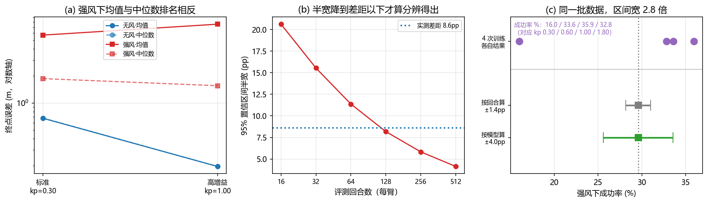

# 评测基准与报告口径：一个成功率背后的三个选择

> **预计阅读：22 分钟 | 前置知识：[08-强化学习后训练与自我改进](./08-强化学习后训练与自我改进.md) 第 8 节、[05-机载部署与优化](./05-机载部署与优化.md) 第 6 节**

---

## 1. 口径为什么是结论的一部分

06 到 08 三篇讲的是怎么做。这一篇讲怎么知道做得好不好。

这件事看起来不如方法重要，但它有一个特殊的性质：**它是唯一一层，读论文的人无法靠自己重算**。别人报的动作头结构你可以复现，别人报的 RL 算法你可以复现，别人报的"成功率 61.76%"你复现不了——因为它还取决于基准选择、回合数、初始条件采样、和这批回合被怎么汇总。

本篇第 11 节的实测把这句话落到了具体数字上：同一批 512 个回合，同一列指标，只换汇总方式，两个策略的名次会反过来；同一份 1024 个回合的数据，只换"独立单元"的定义，置信区间从 ±1.4pp 变成 ±4.0pp，宽 2.8 倍。

所以这一篇要回答三个问题：**用什么基准**（第 2 到第 6 节）、**报什么指标**（第 7 节）、**这批数字怎么汇总**（第 8、9 节）。

本仓库 [05-综述论文精读/05-基准与评估](../05-综述论文精读/05-基准与评估.md) 已经列过无人机侧的世界模型与 VLM 基准清单（AeroVerse、MotionScape、CARLA-Air、UAVBench、BEDI、Embodied4C）。那一篇回答"有哪些基准"，这一篇不重复清单，只回答**策略侧的基准和口径**，尤其是"同一批回合怎么报才立得住"。

> **判据**：判断一个评测结论是否可用，问三件事：在哪个基准上、多少回合、独立单元是什么。三件里缺一件，这个数字就不能和别人的数字放一起比。

---

## 2. 操作基准的三代

通用操作基准大致分三代，分界线是**评测的东西是否在训练分布之内**。

**[arXiv'23.06] LIBERO** — *LIBERO: Benchmarking Knowledge Transfer for Lifelong Robot Learning*（[arXiv:2306.03310](https://arxiv.org/abs/2306.03310)）把"终身学习"做成了可测的量：给四个任务套件（空间关系、物体、目标、长时程），每个套件里任务共享场景但目标不同，评测的不是单个任务的成功率，而是**学到的东西能不能迁移到同一套件里的新任务**。

它成为 2026 年的默认基准，是因为它便宜且可复现，而不是因为它难。这一点值得单独记：**一个基准被广泛采用，通常是因为它好跑，不是因为它好**。LIBERO 上的成功率因此容易出现天花板效应——[06 篇](./06-动作头与动作分块.md) 第 7 节引的 GR00T N1.7 报告在 LIBERO 上换动作头，报的是延迟账而不是成功率账，因为成功率那一列已经没有分辨力了。

> **判据**：看一个基准上的结论时，先看基线方法的成功率是不是已经贴着 1.0。贴着的话，这一列的分辨力已经用完，上面再高的分数没有信息量。

---

## 3. 仿真代理与真机评测

LIBERO 这一类基准的问题是纯仿真。[arXiv'24.05] SimplerEnv 那一篇的标题就把立场写在脸上：*Evaluating Real-World Robot Manipulation Policies in Simulation*（[arXiv:2405.05941](https://arxiv.org/abs/2405.05941)）。它不问"仿真里谁强"，问的是**仿真排名能不能预测真机排名**——也就是仿真作为评测代理的效度。这是评测这一层最该被问、也最少被问的问题。

真机侧 2025 年出现了两种组织方式。**[arXiv'25.06] RoboArena** — *RoboArena: Distributed Real-World Evaluation of Generalist Robot Policies*（[arXiv:2506.18123](https://arxiv.org/abs/2506.18123)）走的是**分布式**：多个实验室各自用自己的机器人跑同一套协议，再汇总。**[arXiv'25.10] RoboChallenge** — *RoboChallenge: Large-scale Real-robot Evaluation of Embodied Policies*（[arXiv:2510.17950](https://arxiv.org/abs/2510.17950)）走的是**集中式**：统一场地、统一硬件、第三方执行。

这两种组织方式解决的是同一个问题：真机评测一直被"自己在自己实验室里报数"污染，因为初始条件、硬件状态、甚至操作者的手法都不可控。分布式和集中式各有代价——前者受制于实验室之间的硬件差异，后者受制于场地规模，但方向都是把评测从论文作者手里拿走。

> **判据**：真机成功率如果由论文作者自己在自己实验室采集，它和仿真成功率是两种不同可信度的数字。看真机结论时先问谁执行的。

---

## 4. 语言条件与长时程

**[arXiv'24.12] VLABench** — *VLABench: A Large-Scale Benchmark for Language-Conditioned Robotics Manipulation with Long-Horizon Reasoning Tasks*（[arXiv:2412.18194](https://arxiv.org/abs/2412.18194)）针对的是 LIBERO 那一代的短板：指令只是任务标签，不构成长时程推理的负担。

VLA 是语言条件的，于是多出一个别的领域没有的评测维度：**指令换个说法，分数会变吗。**

**[arXiv'26.10] Rephrase Before You Act** — *Rephrase Before You Act: Characterizing and Mitigating Language Sensitivity in Vision-Language-Action Models*（[arXiv:2610.10526](https://arxiv.org/abs/2610.10526)）把这个维度单独提出来研究：把同一件事换个说法，策略的行为会偏。**[arXiv'26.10] Do Vision-Language-Action Models Understand Instructions?** — *Do Vision-Language-Action Models Understand Instructions? A Mechanistic Interpretability Study on Language Grounding*（[arXiv:2610.10178](https://arxiv.org/abs/2610.10178)）从机制可解释性那一侧问同一件事：模型到底有没有在用指令，还是只把语言当作一个弱条件。**[arXiv'26.07] Reasoning as a Double-Edged Sword** — *Reasoning as a Double-Edged Sword: Architecture and Cross-Stage Robustness in Vision-Language-Action Models*（[arXiv:2607.17786](https://arxiv.org/abs/2607.17786)）把鲁棒性按阶段拆开测。

这三篇合起来说明：**指令的措辞是一个隐藏的自变量**。两个模型在同一个基准上分数不同，可能只是因为基准的指令模板恰好更接近其中一个模型的训练分布。

> **判据**：语言条件模型的成功率，只有在"指令被改写过之后分数不掉"的前提下才是语言能力的证据。不报改写测试的，报的是模板匹配能力。

---

## 5. 空中基准：碎片化和一次撞名

UAV 侧的基准数量不少，问题不是缺，是**协议互不兼容**。[08-研究前沿与开放问题/04-最新进展与团队追踪](../08-研究前沿与开放问题/04-最新进展与团队追踪.md) 第 3.4 节把这件事列为这个领域的方法论危机，两篇 2026 年的综述也这么写：*Vision-and-Language Navigation for UAVs: Progress, Challenges, and a Research Roadmap*（[arXiv:2604.13654](https://arxiv.org/abs/2604.13654)）和 *Vision-Language Navigation for Aerial Robots: Towards the Era of Large Language Models*（[arXiv:2604.07705](https://arxiv.org/abs/2604.07705)）。

几个可以点名的：

- **[arXiv'26.03] HUGE-Bench** — *HUGE-Bench: A Benchmark for High-Level UAV Vision-Language-Action Tasks*（[arXiv:2603.19822](https://arxiv.org/abs/2603.19822)）：面向高层 VLA 任务。
- **[arXiv'26.09] AM-Bench** — *AM-Bench: A Modular Simulation Suite and Benchmark for Aerial Manipulation Policy Learning*（[arXiv:2609.00641](https://arxiv.org/abs/2609.00641)）：模块化仿真套件，面向**空中操作**。[07 篇](./07-数据、预训练与跨具身.md) 第 9 节把"纯飞行"和"空中操作"分成两类，这里是那个分类在基准上的体现——两者的第一约束不同，基准也不能共用。它的自变量是**系统级**的：涵盖欠驱动、全驱动、过驱动三类构型、12 个任务（接触、运输、受限交互）、可配置的气动扰动与执行器饱和，以及标准低层控制器，因此能测"构型、控制、扰动、策略选择如何交互"。
- **[arXiv'26.01] AIR-VLA** — *AIR-VLA: Vision-Language-Action Systems for Aerial Manipulation*（[arXiv:2601.21602](https://arxiv.org/abs/2601.21602)）：同在空中操作，但落点完全不同——它给的是**数据与评测协议**：3000 条人工遥操作示教，任务分底盘操作、物体与空间理解、语义推理、长时程规划四类，并用针对空中任务的多维指标去测主流 VLA 与 SOTA VLM，结论是现行模型在无人机机动性、机械臂控制与高层规划三处各有边界。代码在 [SpencerSon2001/AIR-VLA](https://github.com/SpencerSon2001/AIR-VLA)。
- **[arXiv'25.05] UAV-Flow Colosseo** — *UAV-Flow Colosseo: A Real-World Benchmark for Flying-on-a-Word UAV Imitation Learning*（[arXiv:2505.15725](https://arxiv.org/abs/2505.15725)）：真机的"说着飞"模仿学习基准，本仓库 Part 7 有复现指南。
- **[arXiv'26.02] AutoFly** — *AutoFly: Vision-Language-Action Model for UAV Autonomous Navigation in the Wild*（[arXiv:2602.09657](https://arxiv.org/abs/2602.09657)）：野外自主导航。

**AIR-VLA 与 AM-Bench 相隔八个月，都在空中操作上，但两者不是竞争关系**，它们切的是同一领域的两个不同面：AIR-VLA 给数据与评测协议（示教从哪来、任务怎么分），AM-Bench 给系统变量（构型、扰动、控制器、策略怎么交互）。这种"同一任务族、几个月内出两个互补基准"是碎片化的另一种形态，比撞名更难察觉 —— 撞名至少能被发现，互补的基准则会被各自的论文当成唯一参照系引用，于是两条线上的成功率数字看起来可比、实际不可比。

**一次撞名值得单独说，因为它直接影响怎么引用。** 这个名字叫 AerialVLA 的条目，在本仓库的追踪里是两篇不同组的工作：一篇是北航 Colab 的 AerialVLA（AAAI 2026，**没有 arXiv 预印本**），另一篇是 [arXiv:2603.14363](https://arxiv.org/abs/2603.14363) 上的 *AerialVLA: A Vision-Language-Action Model for UAV Navigation via Minimalist End-to-End Control*（另一个组）。同名，不同工作，引用时必须写清是哪一篇。

这件事和第 8 节的口径问题是同一类：**一个名字不是标识符**。

> **判据**：跨论文比较 UAV 成功率之前，先确认两件事：是不是同一个基准、是不是同一篇同名工作。这条在空中尤其必要，因为基准碎片化和重名同时在发生。

---

## 6. 过程指标与结果指标

前面几节讲的都是"最后成没成"。有一类错误是"成了，但过程是错的"——比如靠撞过去的、靠超时前最后一秒蹭到的。

**[arXiv'26.09] MEMOBench** — *MEMOBench: A Process Level Memory Benchmark for Robotic Manipulation*（[arXiv:2609.07047](https://arxiv.org/abs/2609.07047)）的定位就是过程级：它测的不是最终结果，而是任务进行中记忆有没有被正确使用。**[arXiv'26.10] ManiPhysicsBench** — *ManiPhysicsBench: Physics-Based Assessment of Object Preservation in VLA Manipulation*（[arXiv:2610.02802](https://arxiv.org/abs/2610.02802)）测的是物体守恒——把东西弄坏了也算失败，这在只看"任务完成"的基准里不看。**[arXiv'26.06] Drop-Then-Recovery** — *Drop-Then-Recovery: How Redundant Are Vision-Language-Action Models?*（[arXiv:2606.27755](https://arxiv.org/abs/2606.27755)）用"中途丢掉一部分能力，还能不能恢复"来测冗余度。

这条线索的意义在于：**结果指标和过程指标会给出不同的排名，而且结果指标通常更宽松。** 本仓库 [Demo G](../../code/g_eval_metrics.py) 量过这件事的极端版本。

完成率这一列把 PID 和高增益都判成 100%，分不开。而它们其实一个用 0.97 倍路程、一个用 2.00 倍路程，是路径长度比和 SPL 把这两者分开的。动作 MSE 那一列更直接：随机策略（完成率 0%）报 0.426，高增益策略（完成率 100%）报 0.412，只差 3%，这一列看不出这两者有天壤之别。偏航误差那一列则反过来把随机策略排在第二位（27.62° 优于高增益的 34.22°），因为随机策略压根不朝目标飞，它的"机头稳"没有意义。

[Demo L](../../code/l_seq_metrics.py) 是同一个现象在序列指标上的版本。一次 0.442 m 的全局错位，刚体对齐后 ATE 剩 8.25e-16 m、RPE 剩 3.14e-16 m，两个指标都说"没有误差"；而 2% 的尺度慢漂移，对齐不含尺度所以消不掉，ATE 仍报 0.0318 m，RPE 只报 6.57e-04 m。**对"最能说明轨迹质量变差"的那一类误差，RPE 几乎不响应。**

> **判据**：一个基准如果只报结果指标，那么"完成任务"这件事的定义就成了唯一的判准。看它对"完成"的定义有多宽松，就知道这个基准的分辨力在哪一档。

---

## 7. 报告的 Hz 不是充分统计量

这一节接 [05 篇第 6 节](./05-机载部署与优化.md) 的实测结论，并接上 *Measuring the Stability Assumption Behind Action Chunking*（[arXiv:2610.01626](https://arxiv.org/abs/2610.01626)）：那篇把状态分成收缩与扩张两类，说明"分块能减少误差累积"只在收缩态成立；本仓库 KH-6 量的是另一个量（动作年龄），两者指向同一件事 —— **均值不足以描述闭环**。

VLA 论文普遍报推理频率。这个数字在无人机上几乎是必报项，因为 [06 篇](./06-动作头与动作分块.md) 第 9 节指出控制回路要跑 50 到 200 Hz，而机载推理实测在 0.5 到 12 Hz 这一档。问题在于，**Hz 是一个只描述了硬件吞吐的统计量，它没有描述闭环里真正起作用的东西。**

原因有三层：

- **Hz 是平均，不是每步。** [05 篇第 6 节](./05-机载部署与优化.md) 的账是平均值。真实推理延迟有长尾，而"最慢的那一次"才决定闭环会不会在那个时刻失控。
- **Hz 没算进延迟的结构。** 一次推理从观测到动作的端到端延迟包括采集、传输、前向、解码。本仓库 [Demo F](../../code/f_control_loop.py) 量过外环延迟收进闭环的代价：连续轨迹指令下 τ=50 ms 误差 16 cm，τ=1 s 就是 1.62 m。同样的推理 Hz，如果延迟的构成不同，闭环代价完全不同。
- **真正进闭环的是"有效动作年龄"，不是 Hz。** 但年龄**也不能只看平均**：本仓库 KH-6 在 126 个配置上量到，执行率相同、实测平均年龄也相同的配对之间，闭环精度中位仍差 1.46 倍、最大 11.76 倍，且方向系统性地偏向"低延迟下限 + 宽分布"。决定闭环代价的是年龄的**下限（等价地：分布）**，不是均值。装置、数字与边界见 [05 篇第 6.5 节](./05-机载部署与优化.md)。

2026 年有工作开始把延迟当成一等的评测对象。**[arXiv'26.10] RealtimeWAM** — *RealtimeWAM: How Fast Can I Run My World Action Model?*（[arXiv:2610.10079](https://arxiv.org/abs/2610.10079)）的标题就是一个评测问题。**[arXiv'26.10] CARE** — *Certifying Acceleration for Vision-Language-Action Inference*（[arXiv:2610.08917](https://arxiv.org/abs/2610.08917)）把加速做成可证明的，而不只是实测的。

> **判据**：报延迟要报三样：P50、P99、以及从观测到动作的整条链路。只报平均 Hz 的，说明不了这个策略能不能跟上控制回路。

---

## 8. 报告口径：均值、回合数、独立单元

前两节讲基准和指标。这一节讲最容易被忽略的一层：**同一批回合，怎么汇总成那一个数字。**

**第一件事是摘要用什么。** 终点误差这类指标是重尾的，少数飞出去的回合会把均值整个拖走。第 11 节的实测里，同一批强风回合，用均值排名两个策略的名次和用中位数排名**相反**。这不是说中位数一定更好——均值对应期望代价，中位数对应典型表现，用哪个取决于你关心哪一个；问题是很多论文不写它用的是哪个。

**第二件事是多少回合。** 成功率是 0/1 的平均，置信区间半宽按 `1/sqrt(N)` 缩。第 11 节的实测：两个策略的实测差距是 8.6 个百分点，32 个回合时置信区间半宽是 15.5pp，是差距的 1.8 倍——分辨不了；要到每臂约 120 回合才降到差距以下。**32 到 64 回合是 VLA 论文里常见的量级**，而这个量级只能分辨二三十个百分点的差距。

**第三件事是独立单元是什么。** 这是三条里最少被提的。一个方法跑 4 次独立训练，每次评测 256 个回合，一共 1024 个回合。把这 1024 个回合合起来按二项分布算，得到 ±1.4pp；按 4 次训练算标准误，得到 ±4.0pp，是前者的 2.8 倍。原因是回合之间共享同一个策略，它们不是独立的观测——**独立单元是训练次数，不是回合数**。用回合当独立单元，等于把 1024 个相关的观测当成 1024 个独立样本。

本仓库 [Demo Q](../../code/q_rl_posttrain.py) 从另一个方向量到过同一件事：同一个配置只换训练种子重跑 4 次，闭环误差在 0.31 到 1.86 m 之间起伏，这个量级比任何按回合算的误差棒都大。

[08 篇](./08-强化学习后训练与自我改进.md) 第 9 节引的 RefineFly（[arXiv:2608.09467](https://arxiv.org/abs/2608.09467)）给了这条口径一个正面例子：它在 TravelUAV 基准上比对照方法高 3.12 到 8.37 个百分点，同时报了两件别的东西——训练 rollout 预算约为训练集规模的 30%，以及**"从失败中持续学习的收益在不同评测划分上不一致"**。后一句正是这里说的分层信息：只报总分会掩盖它。

> **判据**：报成功率时必须同时给出回合数和独立单元。缺独立单元的那一个 ± 无法解释，因为它可以是 ±1.4pp 也可以是 ±4.0pp，取决于算法实现者对"什么是一次实验"的默认。

---

## 9. 对无人机的含义

空中评测比地面多三个约束。

**一是安全必须单列，不能折进成功率。** 一个"成功率 85%、坠机率 3%"的策略和一个"成功率 85%、坠机率 0.3%"的策略，在地面基准上可能报成同一个数，在空中是两个不同的产品。[05-综述论文精读/05-基准与评估](../05-综述论文精读/05-基准与评估.md) 的思考题里已经提过"把安全指标作为一票否决项"，这里补上它在 VLA 侧的对应：**安全违规次数要单独一列报，并且要报它是在多少回合里发生的。** 3% 的坠机率在 32 个回合里对应约 1 次，这个样本量说明不了 3% 和 1% 的区别。

**二是分层的维度比地面多，而且每一维都可能翻转排名。** 第 11 节的实测给了个具体例子：两个策略在无风下差 3.5 倍，在强风下顺序反过来。空中的分层维度至少包括风速、光照、目标遮挡（[07 篇](./07-数据、预训练与跨具身.md) 第 9 节引的 CosFly-VLA 指出遮挡是空中数据分布里的长尾）、以及是否带操作。只报一个总分的空中评测，掩盖掉的正是这些。

**三是在真机上做足够回合的评测本身很贵。** 第 7 节说每臂要约 120 回合才能分辨 8.6 个百分点的差距。120 次真实起降加上每次的重置，成本远高于操作臂在桌面上跑 120 次。这形成了一个尴尬的局面：**空中的评测最需要大样本，而空中的大样本最贵。** 出口有两条：把仿真作为主评测场（但那要先用 SimplerEnv 那种办法证明仿真的排名能预测真机排名），或者接受真机只做"通过/不通过"的验证而不报精确数字。

> **判据**：读空中 VLA 的成功率，先找三样东西：安全是不是单独一列、有没有分风况/遮挡分层、以及真机回合数是多少。三样都没有的，那个数字只能当"跑通了"看，不能当"多好"看。

---

## 10. 关键论文

- **[arXiv'23.06] LIBERO** — *LIBERO: Benchmarking Knowledge Transfer in Lifelong Robot Learning*  
  [](https://arxiv.org/abs/2306.03310)
  四套件的迁移基准，2026 默认基准

- **[arXiv'24.05] SIMPLER** — *Evaluating Real-World Robot Manipulation Policies in Simulation (SIMPLER)*  
  [](https://arxiv.org/abs/2405.05941)
  SimplerEnv，问仿真排名能不能预测真机

- **[arXiv'24.12] VLABench** — *VLABench: A Large-Scale Benchmark for Language-Conditioned Robotics Manipulation with Long-Horizon Reasoning Tasks*  
  [](https://arxiv.org/abs/2412.18194)
  语言条件 + 长时程推理

- **[arXiv'26.10] RealtimeWAM** — *RealtimeWAM: How Fast Can I Run My World Action Model?*  
  [](https://arxiv.org/abs/2610.10079)
  把延迟当成评测对象

- **[arXiv'24.08] AeroVerse** — *AeroVerse: UAV-Agent Benchmark Suite for Simulating, Pre-training, Finetuning, and Evaluating Aerospace Embodied World Models*  
  [](https://arxiv.org/abs/2408.15511)
  五个下游任务的无人机世界模型基准

- **[arXiv'25.05] UAV-Flow Colosseo** — *UAV-Flow Colosseo: A Real-World Benchmark for Flying-on-a-Word UAV Imitation Learning*  
  [](https://arxiv.org/abs/2505.15725)
  真机"说着飞"模仿学习基准

- **[arXiv'25.06] RoboArena** — *RoboArena: Distributed Real-World Evaluation of Generalist Robot Policies*  
  [](https://arxiv.org/abs/2506.18123)
  多实验室分布式真机评测

- **[arXiv'25.10] RoboChallenge** — *RoboChallenge: Large-scale Real-robot Evaluation of Embodied Policies*  
  [](https://arxiv.org/abs/2510.17950)
  集中式第三方真机评测

- **[ICLR'26] AutoFly** — *AutoFly: Vision-Language-Action Model for UAV Autonomous Navigation in the Wild*  
  [](https://arxiv.org/abs/2602.09657)
  野外自主导航

- **[arXiv'26.03] AerialVLA** — *AerialVLA: A Vision-Language-Action Model for UAV Navigation via Minimalist End-to-End Control*  
  [](https://arxiv.org/abs/2603.14363)
  与北航同名工作**不是同一篇**

- **[arXiv'26.03] HUGE-Bench** — *HUGE-Bench: A Benchmark for High-Level UAV Vision-Language-Action Tasks*  
  [](https://arxiv.org/abs/2603.19822)
  高层空中 VLA 任务基准

- **[arXiv'26.04] Vision-and-Language Navigation for UAVs: Progress, Challenges, and a Research Roadmap**  
  [](https://arxiv.org/abs/2604.13654)
  把基准碎片化列为核心问题

- **[arXiv'26.04] Vision-Language Navigation for Aerial Robots: Towards the Era of Large Language Models**  
  [](https://arxiv.org/abs/2604.07705)
  同上，另一篇综述

- **[arXiv'26.06] Drop-Then-Recovery** — *Drop-Then-Recovery: How Redundant Are Vision-Language-Action Models?*  
  [](https://arxiv.org/abs/2606.27755)
  用中途失效测冗余度

- **[arXiv'26.07] Reasoning as a Double-Edged Sword: Architecture and Cross-Stage Robustness in Vision-Language-Action Models**  
  [](https://arxiv.org/abs/2607.17786)
  鲁棒性按阶段拆开测

- **[arXiv'26.09] MEMOBench** — *MEMOBench: A Process Level Memory Benchmark for Robotic Manipulation*  
  [](https://arxiv.org/abs/2609.07047)
  过程级而非结果级

- **[arXiv'26.09] AM-Bench** — *AM-Bench: A Modular Simulation Suite and Benchmark for Aerial Manipulation Policy Learning*  
  [](https://arxiv.org/abs/2609.00641)
  空中操作专用基准

- **[arXiv'26.01] AIR-VLA** — *AIR-VLA: Vision-Language-Action Systems for Aerial Manipulation*  
  [](https://arxiv.org/abs/2601.21602)
  首个空中操作 VLA 基准，3000 条示教

- **[arXiv'26.10] ManiPhysicsBench** — *ManiPhysicsBench: Physics-Based Assessment of Object Preservation in VLA Manipulation*  
  [](https://arxiv.org/abs/2610.02802)
  物体守恒也算指标

- **[arXiv'26.10] CARE** — *CARE: Certifying Acceleration for Vision-Language-Action Inference*  
  [](https://arxiv.org/abs/2610.08917)
  加速做成可证明的

- **[arXiv'26.10] Do Vision-Language-Action Models Understand Instructions? A Mechanistic Interpretability Study on Language Grounding**  
  [](https://arxiv.org/abs/2610.10178)
  机制可解释性检验语言接地

- **[arXiv'26.10] Rephrase Before You Act: Characterizing and Mitigating Language Sensitivity in Vision-Language-Action Models**  
  [](https://arxiv.org/abs/2610.10526)
  指令改写是隐藏自变量

- **[arXiv'26.08] RefineFly** — *RefineFly: Failure-Aware Post-Training for Aerial Vision-Language Navigation*  
  [](https://arxiv.org/abs/2608.09467)
  正面例子：报分层与算力预算

---

## 11. 动手验证：同一批回合，三种报法

第 8 节说成功率这个数字背后有三个选择。这一节把它们各自量一遍。

装置是 [`code/common/quad_sim.py`](../../code/common/quad_sim.py) 的四旋翼，任务是 6 秒内飞到 (8, 0, 1.5)，起点散布 σ=0.6 m，风每回合固定、策略不可见。第一种风况无风，第二种风况风加速度标准差 3.0 m/s²。

**为什么不用学出来的策略。** 这一节要量的是汇总口径，不是策略质量。用脚本控制器可以把"策略本身有多少随机性"这个额外变量去掉，量到的差异只能归因于汇总方式。

### 11.1 核心代码

```python
def wilson(k, n):
    """成功率的 Wilson 区间（中心, 半宽）。比正态近似在 p 靠近 0/1 时稳。"""
    if n == 0:
        return 0.0
    p = k / n
    z2 = Z95 ** 2
    c = (p + z2 / (2 * n)) / (1 + z2 / n)
    h = Z95 * math.sqrt(p * (1 - p) / n + z2 / (4 * n * n)) / (1 + z2 / n)
    return c, h

def halfwidth_at(x01, n, reps=400):
    """在每回合 0/1 结果里无放回抽 n 个，复现 reps 次，报半宽均值。"""
    g = torch.Generator().manual_seed(SEED + n)
    hs = []
    for _ in range(reps):
        idx = torch.randperm(x01.numel(), generator=g)[:n]
        hs.append(wilson(int(x01[idx].sum()), n)[1])
    return sum(hs) / len(hs)
```

第 3 格里"按回合算"和"按模型算"分别指：

```python
se_episode = math.sqrt(p_pool * (1 - p_pool) / k_all.numel())   # 把 1024 个回合当独立样本
se_model   = sd_seed / math.sqrt(K_SEEDS)                      # 把 4 次训练当独立样本
```

### 11.2 本地实测结果

```
任务：6 秒内飞到 (8.0, 0.0, 1.5)，起点散布 σ=0.6 m｜风：无风 / σ=3.0 m/s^2

第 1 格：两个策略 × 两种风况，终点误差的两个摘要
  策略          风况           均值(m)      中位数(m)      均值排名       中位数排名
  标准 kp=0.30  无风           0.676       0.679         2           2
  高增益 kp=1.00 无风           0.196       0.196         1           1
  标准 kp=0.30  强风           5.712       1.869         1           2
  高增益 kp=1.00 强风           7.563       1.558         2           1
  （把两种风况的回合合并后）
  标准 kp=0.30  合并           3.194       0.761
  高增益 kp=1.00 合并           3.880       0.321

第 2 格：两个增益接近的策略（kp=0.5 vs 0.6），容差 0.25 m，无风
  实测成功率 64.1% vs 72.7%，差 8.6 个百分点（每档 512 回合）
      回合数          95% 置信区间半宽         实测差距 / 半宽
                                     (>1 才分辨得出)
       16              20.6pp             0.42
       32              15.5pp             0.55
       64              11.4pp             0.76
      128               8.2pp             1.05
      256               5.8pp             1.47
      512               4.1pp             2.07
  半宽降到实测差距（8.6pp）以下，每臂约需 120 回合

第 3 格：同一个方法跑 4 次独立训练，评测回合数相同
       第几次训练      增益       成功率
           1    0.30     16.0%
           2    0.60     33.6%
           3    1.00     35.9%
           4    1.80     32.8%
  合并成功率 29.6%（1024 个回合）
  按回合算（二项）：± 1.4pp
  按模型算（4 次训练的标准误）：± 4.0pp，是前者的 2.78 倍
```

三点读法。

**摘要的选择能翻转名次，而且翻转的方向有物理原因。** 无风时两种策略差得远，均值和中位数说的是同一件事（0.676 vs 0.196 m，高增益好 3.5 倍）。强风时两个摘要打架：均值说标准增益好（5.712 vs 7.563 m），中位数说高增益好（1.869 vs 1.558 m）。原因是重尾——标准增益那组的均值是它中位数的 3.1 倍，高增益是 4.9 倍。**谁更重尾，取决于谁的失败更彻底**，而均值恰恰由最彻底的那几次失败决定。把两种风况合并后，均值读起来是"两者接近"（3.194 vs 3.880 m），完全看不出无风差 3.5 倍、强风反过来。

**回合数这条轴有一个可算的门槛。** 第 2 格最后那一列问的是一个很直接的问题：实测差距是置信区间半宽的几倍。大于 1 才分辨得出，小于 1 就在噪声里。这一列在 64 回合时是 0.76，在 128 回合时是 1.05——**门槛正好落在这两档之间**，和脚本另算的"每臂约需 120 回合"一致。32 回合时是 0.55，也就是半宽比差距还大 1.8 倍，这个量级分辨不了。**32 到 64 回合是 VLA 论文里常见的量级**，而这个量级只能分辨二三十个百分点的差距。

**独立单元这条轴的代价最大，也最少被写。** 1024 个回合按二项算得到 ±1.4pp，按 4 次训练算得到 ±4.0pp，宽 2.78 倍。差别的来源是回合之间共享同一个策略：4 次训练得到 4 个成功率（16.0% / 33.6% / 35.9% / 32.8%），它们之间的散布（标准差 0.085）本身就是要报的不确定性，而这部分被"按回合算"完全吃掉了。同一批数据，换个单位，区间宽近三倍。

**一条方法上的说明。** 第 3 格里的四个"训练"用四个不同增益代表，因为这一节要隔离的是汇总口径，不是训练随机性。真实情况下 4 次训练的差异来自初始化和数据顺序，量级只会更大——[Demo Q](../../code/q_rl_posttrain.py) 第 11 节量到过：同一个配置只换训练种子重跑，闭环误差在 0.31 到 1.86 m 之间起伏。所以这里的 2.78 倍是一个**下界**。



### 11.3 运行完整脚本

```bash
py -3.9 code/r_eval_protocol.py
```

依赖 `torch`、`numpy`、`matplotlib`（见 [`code/requirements.txt`](../../code/requirements.txt)），纯 CPU 约 2 分钟。

---

## 12. 延伸阅读

- [05-综述论文精读/05-基准与评估](../05-综述论文精读/05-基准与评估.md) — 无人机侧的世界模型与 VLM 基准清单，本篇不重复
- [08-强化学习后训练与自我改进](./08-强化学习后训练与自我改进.md) — 第 8 节的 RL 结论全部建立在评测口径上
- [05-机载部署与优化](./05-机载部署与优化.md) — 第 6 节的实时性账，是本篇第 7 节引用的数字来源
- [06-动作头与动作分块](./06-动作头与动作分块.md) — 第 7 节 GR00T N1.7 报延迟不报成功率的原因
- [10-世界模型增强VLA](./10-世界模型增强VLA.md) — 用世界模型当评测代理，和 SimplerEnv 是同一类问题

---

## 13. 思考题

**题目 1：为什么"在 LIBERO 上高 3 个百分点"可能没有信息量？**

LIBERO（arXiv:2306.03310）是 2026 年 VLA 论文最常用的基准。请从基准的分辨力和评测样本量两个角度，说明在什么情况下这个提升说明不了问题。

<details>
<summary>参考答案</summary>

**第一层是天花板效应。** 一个基准被广泛采用之后，基线方法会逐步逼近它的上限。当多个方法在 LIBERO 上的成功率都在 0.9 以上时，剩下的几个百分点空间里，方法差异和评测噪声已经分不开。06 篇第 7 节引的 GR00T N1.7 报告就是这个状态：它在 LIBERO 上换动作头，报的是延迟从 45.3 ms 降到 5.0 ms，把成功率当成开放问题留下——因为那一列已经没有分辨力了。

**第二层是样本量的算术。** 第 8 节的实测给了一个可以套用的数：8.6 个百分点的差距，每臂约需 120 回合才能让置信区间半宽降到差距以下。LIBERO 的常规评测协议是每任务若干回合、十个任务——如果提升只有 3 个百分点，需要的回合数比这更多。不报回合数和独立单元的，无法判断这 3 个百分点是不是落在噪声里。

**第三层是基准和真实任务的距离。** LIBERO 的任务套件共享场景、目标明确、指令是任务标签；第 4 节引的 Rephrase Before You Act 说明指令措辞本身就是一个自变量。在模板化的指令上高 3 个点，不必然意味着在改写过的、含歧义的指令上也好。

**结论：** "在 LIBERO 上高 3 个点"这条信息要能用，至少得补上三样：基线是不是已经贴天花板、每臂多少回合、以及有没有在改写指令或别的基准上也报数。这三样缺哪一样，这个数字就只能当"模型跑通了"看。

</details>

---

**题目 2：为什么"独立单元是训练次数而不是回合数"？**

第 8 节说，同一个方法的 4 次训练、每次 256 个回合，合起来按二项分布算得到 ±1.4pp，按训练次数算得到 ±4.0pp。请解释这两个数字为什么都对，以及它们各自回答的是哪个问题。

<details>
<summary>参考答案</summary>

**两个数字回答的是两个不同的问题。** ±1.4pp 回答的是："如果把这 4 个已经训练好的模型固定下来，让它们在新的随机初始条件下再跑 256 个回合，平均成功率会在多大范围内波动。" 这个量的来源只有评测时的随机性（初始条件、风），所以它小。±4.0pp 回答的是："如果重新训练 4 次，平均成功率会在多大范围内波动。" 这个量的来源多了训练本身的随机性（初始化、数据顺序、采样），所以它大。

**论文要报的是后者。** 说"我的方法比基线好"这句话里的"我的方法"，指的是一个训练流程，不是一个具体的权重文件。评估一个流程，独立单元就是一次完整的训练。用回合当独立单元，等于假设四次训练得到的模型完全相同，然后把差异全部归给评测噪声——这个假设不成立。

**为什么这个错误特别容易犯。** 因为它不体现在任何代码错误里。生成回合数的循环和生成训练次数的循环都在代码里，选哪个当分母纯粹是统计判断，而不是实现细节。而且评测代码通常是先写好的，它天然以回合为循环单位。

**在本仓库的装置上这个影响有多大。** 第 11 节量到的是 2.78 倍，但那是四个不同增益之间的差异，训练随机性被低估了。真实情况下，Demo Q 量到的种子间误差标准差在 0.31 到 1.86 m，比任何按回合算的误差棒都大。所以 2.78 倍是个下界，真实倍数只多不少。

**结论：** ± 的宽窄不取决于用哪个公式，取决于"一次实验"定义成什么。方法和流程比，独立单元是训练；固定模型比，独立单元是回合。论文里那种把两者混用的报法，会让读者把"训练不稳定"误读成"评测波动"。

</details>

---

**题目 3：为什么在无人机上，"安全"不能只作为一个成功率之外的附注？**

第 9 节说安全要单独一列报，并且要报它发生在多少回合里。请说明为什么，以及这和 [08 篇](./08-强化学习后训练与自我改进.md) 第 8 节说的"安全不能写成奖励项"是不是同一个问题。

<details>
<summary>参考答案</summary>

**它们是同一个问题的两端，但不是一个问题。** 08 篇说的是**训练时**不能被安全项带偏：奖励里的安全项是一个可被权衡的代价，优化压力会去试探它的边界。这一节说的是**评测时**不能把安全折进总分：成功率是所有回合的聚合，坠机只占其中一小部分，聚合会把它的权重稀释掉。

**为什么附注不够。** 两个策略成功率和坠机率都报了出来，读者仍然无法判断哪个能用——因为在无人机上这两者不可通约。地面抓取失败可以重试，飞行器坠毁是资产损失和空域风险。给它们一个隐式的兑换率（比如"成功率优先"）等于替用户做了一个价值判断，而这个判断应该由用户做。所以要做的是并排列出，让读者自己定权。

**为什么还要报回合数。** 坠机率是低频事件。3% 和 1% 的区别在 32 个回合里对应约 1 次和约 0.3 次，样本量根本不足以区分；而在 1000 个回合里对应 30 次和 10 次，是能分辨的。不报回合数的坠机率，读者无法判断这个数是不是 "0/30" 这种零事件估计——而零事件估计的置信上界比 0 大得多。

**为什么这件事在无人机上比在地面更硬。** 第 8 节说过空中的真机评测本来就贵。贵意味着回合数少，回合数少意味着低频事件的估计最不可靠，而少数几次坠机恰恰是成本最高的。这个矛盾没有办法靠统计绕开，只能靠把安全做成独立的通过/不通过判定，而不是一个参与平均的比例。

**结论：** 安全和成功率的关系不是"两个指标"，是"约束和指标"——和 [08 篇](./08-强化学习后训练与自我改进.md) 第 8 节里 CBF 层与策略的关系完全同构。训练时安全是约束而不是奖励项，评测时安全是门槛而不是成功率的注脚。两条线要在同一套口径上保持一致，否则训练里守住的边界会在报告时被平均掉。

</details>

---

> **下一节**：[10-世界模型增强VLA](./10-世界模型增强VLA.md) — 世界模型既能当策略的一部分，也能当评测的代理
