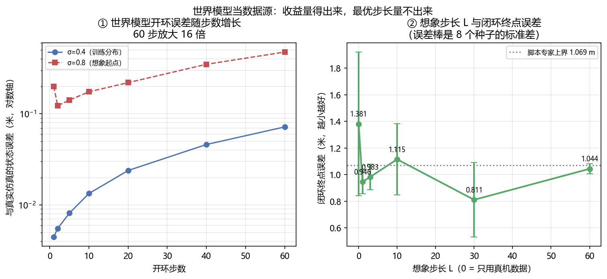

# 世界模型增强 VLA

> **预计阅读：40 分钟 | 前置知识：读完 06–09 篇；了解世界模型的基本形态（[02-世界模型专题](../02-世界模型专题/01-世界模型发展史.md)）**
>
> 世界模型和 VLA 是两条各自长出来的线。这一篇讲它们接在一起之后世界模型能当什么用、共同的上限在哪，以及为什么空中方向是这批工作最密集的地方。

---

## 1. 接缝在哪

VLA 学的是"看到什么就做什么"：观测加指令进去，动作出来。它的数据单位是 **(状态, 动作) 对**，而这类数据在地上要遥操作采、在空中要飞一次采一次，是整条链路里最贵的一环（07 篇第 9 节量过：本仓库收录的无人机工作里，单份真机数据集最小的是 507 条）。

世界模型学的是"如果我这么做，接下来会怎样"：状态加动作进去，下一个状态出来。它的数据单位也是 (状态, 动作) 对。

两条线吃的是同一种数据，但产出的东西不同。**这就构成了接缝**：当 (状态, 动作) 对不够时，一个能接受动作输入、并且预测还算准的世界模型，可以自己生成更多的 (状态, 动作) 对，补到 VLA 的训练集里。

这条接缝有三个前提，缺一个就不成立。

**一是世界模型必须接受动作。** 只预测"下一帧长什么样"的视频模型不能直接接过来，因为它没有动作这个入口。把动作接进去的模型才叫 action-conditioned，这类模型才有资格给策略造数据。

**二是它的误差要在可接受的步数内不炸。** 第 4 节量这条曲线。它是所有接法的共同上限，不是某一种接法的工程细节。

**三是生成的数据要落在策略真的会去的状态上。** 世界模型在它没见过的状态上，一步就能不准到 45 倍（第 11 节的实测）。造出来的数据看着合理、位置却是策略永远到不了的地方，补进去只会把训练集带偏。

> **判据**：看到一个"世界模型增强 VLA"的方案，先问它的世界模型是不是 action-conditioned，以及在多少步的开环 rollout 内误差还在可用范围。答不上第二条的，后面所有收益数字都无法归因。

---

## 2. 世界模型在 VLA 里当什么：四种接法

按世界模型的产物拿去干什么分，这批工作落在四个位置上。

**当数据源**：离线用世界模型造 (状态, 动作) 对，塞进策略的训练集。世界模型在训练时用一次就丢掉，部署时不在回路里。第 5 节讲。

**当策略的一部分**：世界模型进推理回路，每一步或每几步在隐空间里"想象"一下再出动作。部署时它在回路里。第 6 节讲。

**当模拟器**：在它内部跑强化学习，用想象出来的回报更新策略。第 7 节讲。

**当评测代理**：用它替代真机回合来排名和筛选策略。第 8 节讲。

这四种接法不是四个架构，是四种用法：同一个世界模型可以被用在任意一种上，决定分类的是产物去向。这和 [05-综述论文精读/02-世界模型作为策略](../05-综述论文精读/02-世界模型作为策略.md) 里那套按架构分（IDM / 单骨干 / MoE-MoT / 统一 VLA / 隐空间）的分类是两个正交的轴：那篇回答"模型长什么样"，这一篇回答"模型的输出被拿去做什么"。

四种用法的失败模式也不同：当数据源会栽在分布外，当策略的一部分会栽在延迟，当模拟器会栽在模型偏差被策略利用，当评测代理会栽在代理本身对动作不敏感。第 8 节会给出这条的实测证据。

> **判据**：读一篇世界模型 × VLA 的工作，先确认自己知道它的世界模型部署时在不在回路里。在回路里的，要报延迟；不在回路里的，要报分布外误差。两个账不能混。

---

## 3. 世界动作模型：把"预测未来"换成"预测动作"

2026 年这条线上冒出来一个已经叫开的词：**世界动作模型**（World-Action Model, WAM）。

**[arXiv'26.09] WAM 综述** — *World-Action Models for Robot Learning and Control: A Survey*（[arXiv:2609.16074](https://arxiv.org/abs/2609.16074)）给的定义是"把未来世界预测与可执行动作生成耦合成一体"的模型，并明确把它和三类邻居区分开：传统世界模型、基于模型的强化学习、以及反应式 VLA 策略。它的分类维度是表示、转移建模、动作接口、架构、训练流程、数据模态、扩展策略。

这个方向在 2026 年 5 月到 9 月出了**三篇标题几乎一样的综述**，另两篇是 *World Action Models: A Survey*（[arXiv:2606.20781](https://arxiv.org/abs/2606.20781)）和 *World Action Models: The Next Frontier in Embodied AI*（[arXiv:2605.12090](https://arxiv.org/abs/2605.12090)）。一个术语在四个月内被三篇综述同时抢注，说明它还没有稳定下来。本篇以 2609.16074 为脊柱，理由是它的标题里限定了"for Robot Learning and Control"，覆盖面最窄、定义最不含糊；引用另外两篇时要注意它们对 WAM 边界的划法并不相同。

代表工作按"预测什么"分成两路。

**一路预测像素层面未来。** *τ₀-WM: A Unified Video-Action World Model for Robotic Manipulation*（[arXiv:2606.01027](https://arxiv.org/abs/2606.01027)）把视频生成和动作生成放在一个模型里。*Magic-W0: A Structured World-Action Foundation Model for Physical Intelligence*（[arXiv:2609.39870](https://arxiv.org/abs/2609.39870)）换成面向控制的结构化表示，而不是像素重建。

**一路质疑像素这一步是不是必需的。** *ImageWAM: Do World Action Models Really Need Video Generation, or Just Image Editing?*（[arXiv:2606.19531](https://arxiv.org/abs/2606.19531)）标题就把问题摆出来了。它列了视频式 WAM 的三个耦合代价：多帧未来 token 让推理变贵、整段视频预测把容量花在与动作无关的时间与外观细节上、长时程想象引入的误差会误导动作预测。它的替代方案是复用预训练的图像编辑模型，并且**推理时不解码目标帧**，只把编辑去噪产生的 KV cache 当作紧凑的世界动作上下文。代价对比是 FLOPs 降到视频式 WAM 的 1/6、延迟降到 1/4。

**动作接口这一侧**，06 篇第 6 节提过的 SplineWAM（[arXiv:2609.39873](https://arxiv.org/abs/2609.39873)）和 Vela（[arXiv:2610.05230](https://arxiv.org/abs/2610.05230)）属于同一族：把动作轨迹参数化成曲线，让模型自己决定时间分辨率，而不是每个推理吐一个定长块。

无人机主线上的对应工作是 **[arXiv'26.07] AeroAct** — *AeroAct: Action-Centered World-Action Models for Language-Conditioned Quadrotor Flight*（[arXiv:2607.14997](https://arxiv.org/abs/2607.14997)），06 篇第 9 节已经引出。它把语言条件的世界动作模型放到四旋翼飞行上，动作中心而不是像素中心。

> **判据**：判断一个 WAM 值不值得跟，看它的动作接口定义在哪一层。落在像素或隐空间、再由另一个头解码成动作的，和直接输出动作曲线的，延迟与可控性完全是两笔账。

---

## 4. 共同的上限：想象 rollout 能走多长

第 1 节的前提二说，误差要在可接受的步数内不炸。这条曲线是四种接法共同的天花板，所以先量它。

**误差随步数单调增长。** 第 11 节的实测（[Demo S](../../code/s_wm_data_source.py)）用 1600 个真机 (状态, 动作) 对训一个一步动力学模型，在训练分布内它的单步误差是 0.0045 m，60 步之后变成 0.0719 m，**放大 16.1 倍**，全程单调上升。这个模型的单步精度并不差（训练集上 0.0058 m），但它仍然会被自己的预测误差一路推着走。08 篇第 6 节要求"世界模型内的 RL 必须报想象 rollout 的误差随步长增长曲线"，原因就在这里：这条曲线决定了想象能替代真实环境多少步。

**但真正卡住规划的不是精度，是跨度。** *The Planning Limits of Latent World Models*（[arXiv:2609.39235](https://arxiv.org/abs/2609.39235)）把这一点量得很干净。它用五个冻结的自监督视觉骨干（V-JEPA 2、V-JEPA 2.1、VideoMAEv2、VideoPrism、DINOv2）搭 action-conditioned 预测器，在 Meta-World 和 BridgeData V2 上测。结论分三层：

- 世界模型只在**目标落在它想象的那段轨迹之内、或略微超出**时才能可靠地排序动作。用 5 步 rollout（就是预测器训练时的长度）时，它只能可靠地对 5 到 10 个控制步之后的目标排序，而任务目标普遍在 **16 到 53 步**之外。
- **把预测器放大 81 倍、或者用更长的 rollout 训练，都不能扩展这个范围。**
- 更关键的一层是"完美预测"对照：换成真仿真器、误差为零，目标从 5 步外移到 20 步外，成功率照样从 **92% 掉到 41%**。

第三层是这一节最要紧的发现。它说明限制来自**规划跨度和想象跨度的错位**，而不是模型准不准。既然模型再准也没用，那么把预算花在"把世界模型训得更准"上，在长目标上收效有限；有效的方向是把目标切近（论文里用近端专家子目标，成功率从纯想象的 23% 提到 76%）。

**分布外的一步就不准。** 第 11 节的同一个模型换到训练分布之外的起点（σ=0.8 对训练时的 0.4），第一步误差就是分布内的 **45 倍**。这条和上一条是一体两面：世界模型的有效范围是一个有边界的管子，管子内可以想象，管子外一步都不该信。

> **判据**：任何依赖想象 rollout 的方法，先要两个数：想象跨度是多少步，任务目标离当前状态多少步。前者小于后者的，纯想象不可靠，必须配反馈或近端子目标。

---

## 5. 当数据源：想象轨迹能补多少真机数据

07 篇第 9 节把无人机侧的数据来源拆成三块：真机遥操作、仿真合成、RL 生成示范，并说三块都绕不开仿真。这一节补上第四块的机制：由学出来的世界模型生成示范。

用法很直接：从真机数据里的状态出发，用世界模型配合控制器滚若干步，把沿途的 (状态, 动作) 对收进训练集。训练时世界模型在回路里，部署时不在。

它的价值区间很窄，原因在上一节。想象数据要能帮忙，生成的 (状态, 动作) 对必须满足两条：状态落在策略真会去的区域（否则补的是无效覆盖），标签要与状态自洽（否则补的是错误监督）。这两条对想象步长的要求相反：

- 步长太短，想象数据基本是真机数据的复制品，只是把起点撒得密一点，填不满真机没覆盖到的状态。
- 步长太长，世界模型自己的误差已经积累起来（第 4 节的 16.1 倍曲线），存下来的状态和标签不再自洽，数据从"扩充"变成"污染"。

第 11 节在一份**只有 1600 个真机对**的数据集上量了这条轴。可以确定的是想象数据确实补上了缺口：加上想象数据后，闭环终点误差从 1.3807 m 降到 0.81 到 1.12 m 这一档，全部低于只用真机。而**想象步长的最优值没量出来**——各档之间的差异只有种子间离散的 1.66 倍。详细数字和第 11 节的三点读法在那。

这里要提醒一个容易被当成结论的量：**想象数据降低的主要是离散度，不是均值。** 第 11 节的 8 个训练种子里，只用真机时最差一个训到 2.73 m（比其余种子差一倍以上），加上想象数据后最差的降到 1.78 m。真机数据少的时候，BC 策略训崩的风险本身就是主要矛盾，"补数据"首先补的是这条尾部。

> **判据**：报"用世界模型造数据提升了 X%"时，必须同时报三个数：真机数据量、造出来的数据量与想象步长、以及训练种子的离散度。第三个不报的，无法判断提升是不是把某几个训崩的种子救回来了。

---

## 6. 当策略的一部分：隐空间想象进回路

换一种用法：世界模型不离线造数据，而是在推理时进回路。策略先想象若干步未来，再据此出动作。这条路上最大的工程分歧是**想象发生在哪一层**。

**像素层。** 生成未来帧再据此动作，信息最全，代价是每步都要跑一次生成模型，延迟直接压在控制回路上。08 篇第 6 节引的 VPP 系（[arXiv:2412.14803](https://arxiv.org/abs/2412.14803)）和它的续作 *Video Prediction Policy 2: Predict Better, Act Better*（[arXiv:2610.10270](https://arxiv.org/abs/2610.10270)）是从这条线长出来的。

**隐空间层。** 不生成像素，只在表示空间里前推。*JEPA-VLA: Video Predictive Embedding is Needed for VLA Models*（[arXiv:2602.11832](https://arxiv.org/abs/2602.11832)）走的是这里的根。*SLIP-VLA: Single-Step Latent Imagination for Policy Learning in Vision-Language-Action Models*（[arXiv:2609.33575](https://arxiv.org/abs/2609.33575)）把想象压成单步，理由是迭代式的稠密未来建模太贵。*DreamFormer: Dream Imitation with a Transformer World Model for Language-Conditioned Robotic Manipulation*（[arXiv:2610.04540](https://arxiv.org/abs/2610.04540)）是 Dreamer 那一路（02 篇第 3 节）在 VLA 上的最直接对应：先学一个任务无关的 Transformer 世界模型，再在隐空间想象内部模仿专家。

**表示层，连预测器都不要。** 这是最激进的一档。**[arXiv'26.09] Skytopia** — *Skytopia: Monocular Drone Navigation with Action-Conditioned Latent World Models*（[arXiv:2609.26007](https://arxiv.org/abs/2609.26007)）的论证是：单目飞行时，执行的动作几乎解释了相邻观测之间的全部变化，于是"预测下一帧"退化成"在已知位移下重投影一个静态场景"。它因此提出策略需要的不是预测本身，而是**产生预测所必需的那份表示**。落地做法是一个前向目标（从意图运动预测下一观测的表示）加一个逆向目标（从预测出的转移里反推运动），**部署时把预测器整个丢掉**，只留表示。代价对比写在摘要里：丢掉预测器省掉 **59.4%** 的推理开销，同一个策略覆盖点目标、图像目标、无目标三种导航设置。

这条路的取舍值得记住：想象的价值可能不在"想出来的画面"，而在"为了想出画面而被迫学到的表示"。如果表示才是收益来源，那么推理时保留生成器就是在为副产品付全价。

> **判据**：隐空间想象方案要报两件事：想象在推理回路里要多跑多少计算，以及把生成部分去掉之后性能掉多少。后一个数决定了这份表示是自足的还是依赖生成器兜底的。

---

## 7. 当模拟器：在世界模型内部做 RL

第三种用法把世界模型当训练环境，8 篇第 6 节已经列出这批工作（Imagine-RL `2609.24033`、RoboCoach `2609.39685`、Prioritized Rollouts `2609.22879`、Direct Experience World-Model Optimization `2609.37398`、WorldSample `2607.02431`）。这一节补的是接口层面的几条。

**把世界模型当模拟器的前置条件比当数据源更硬。** 当数据源时，世界模型的偏差只是让标签不精确；当模拟器时，偏差会变成**奖励**，而 RL 会专门去最大化奖励。策略只要能利用模型的任何一处偏差拿到回报，它就会利用。08 篇第 9 节把这条称为"仿真器保真度直接是 RL 的上界"，接口层面它意味着世界模型要报的不只是预测误差，还有**偏差在回报上的方向**。

**2026 年有一批工作在做这件事的工程化。** *WoVR: World Models as Reliable Simulators for Post-Training VLA Policies with RL*（[arXiv:2602.13977](https://arxiv.org/abs/2602.13977)）的落点就是"可靠"两个字。*WCM: A World Critic Model for Vision-Language-Action Reinforcement Learning*（[arXiv:2607.29613](https://arxiv.org/abs/2607.29613)）把价值估计从单帧隐状态移到多帧与世界模型隐状态上，解决的是评论家看不到足够历史的问题。*WISE: World-model-guided Imagination Scheduling for Efficient Post-training of Vision-Language-Action Models*（[arXiv:2609.03681](https://arxiv.org/abs/2609.03681)）问的是想象该在什么时候花，把算力预算当成自变量。*WorldSample: Closed-loop Real-robot RL with World Modelling*（[arXiv:2607.02431](https://arxiv.org/abs/2607.02431)）则反过来，用世界模型减少真机上的实际 rollout 次数。

**一个正在被明确否定的做法。** *World Action Verifier: Self-Improving World Models via Forward-Inverse Asymmetry*（[arXiv:2604.01985](https://arxiv.org/abs/2604.01985)）利用正向预测与逆向推断的不对称性来验证并自我改进世界模型。它属于校验层：承认世界模型会错，加一层判别来少信它一点。

> **判据**：在世界模型内做 RL 的方案，要报的不是"成功率涨了多少"，而是"想象回报与真实回报的一致性随步长怎么变"。一致性曲线不报的，成功率提升分不清是学会了任务还是过拟合了模型。

---

## 8. 当评测代理：它能替代多少真机回合

第四种用法不训练策略，只给策略排名：用世界模型跑想象回合，拿想象成功率替代真机成功率。动机很直接，09 篇第 8 节算过真机评测的账，空中尤其贵。

这条线的时间结构很有意思，值得单独讲，因为它是本仓库收录范围内少见的"方案先提、随后被自己的实验证伪"的完整序列。

**2025 年是提出年。** *WorldGym: World Model as An Environment for Policy Evaluation*（[arXiv:2506.00613](https://arxiv.org/abs/2506.00613)）和 *WorldEval: World Model as Real-World Robot Policies Evaluator*（[arXiv:2505.19017](https://arxiv.org/abs/2505.19017)）在 2025 年 5 月先后提出把自回归动作条件视频模型当代理环境。它们解决的是"真机评测太贵"。

**2026 年是把代理做大、做实。** *dWorldEval: Scalable Robotic Policy Evaluation via Discrete Diffusion World Model*（[arXiv:2604.22152](https://arxiv.org/abs/2604.22152)）用离散扩散世界模型扩大覆盖的环境与任务；*MiraBench: Evaluating Action-Conditioned Reliability in Robotic World Models*（[arXiv:2605.29360](https://arxiv.org/abs/2605.29360)）问的是"世界模型的预测到底跟不跟动作变"；*Interactive World Simulator for Robot Policy Training and Evaluation*（[arXiv:2603.08546](https://arxiv.org/abs/2603.08546)）把训练和评测一起接进来。

**也是 2026 年的拆台年。** *World Models Dream of Success: Diagnosing and Repairing Failure Insensitivity in Robot World Models*（[arXiv:2610.09134](https://arxiv.org/abs/2610.09134)）测了**两个架构族、四个已发布的 checkpoint**，观察到两件事同时成立：模型对动作变化的敏感度很弱，以及在**已验证的失败**上给出"像成功"的预测。它给出的修复是 CureWM：从成功示范出发沿一个严重度网格构造反事实动作、执行验证后再微调。数字上，484 个留出的 LIBERO 失败反事实上，乐观率从官方数据微调后的 **80%** 降到 30 到 43%（均值 38%）；在真机机械臂上，被判为"像成功"的失败从只用成功示范微调的 **90%** 降到 **33%**。

这条结果对"世界模型当评测代理"是釜底抽薪的：代理的用处建立在它能把失败和成功分开，而实测是它给了失败一个高分。用这种代理筛出来的策略，排名是自指的。

**度量层面的诊断同样指向这里。** *Do World Models Make Better Robots? A Survey of Evaluation Benchmarks for Predictive Embodied Intelligence*（[arXiv:2609.29669](https://arxiv.org/abs/2609.29669)）编目了 2017 到 2026 年的 160 个基准，发现 138 个是模型无关的，而**只有 11 个（7%）真正构造了 VLA 与世界模型的对照**，只有 4 个把预测变成了实际执行的动作。它的组织性判断值得抄下来：VLA 由闭环任务成功率打分，世界模型由开环预测或生成质量打分，这是两条几乎不相交的轨道，所以"世界模型到底有没有用"这个问题在当前的度量下**答不了**——缺的是度量，不是模型。*How Should World Models Be Evaluated for Embodied Decision-Making?*（[arXiv:2606.15032](https://arxiv.org/abs/2606.15032)）从定义入手，把"世界模型"这个词拆成六种不同的对象（动作条件环境模型、隐空间想象模型、未来视频预测器、交互式神经模拟器、隐预测表示、合成数据引擎），并给出一个从视觉可信度到策略优化效用的 L0–L7 证据阶梯，指出常见问题是**主张强于证据**。

> **判据**：拿世界模型当评测代理之前，先做那个最便宜的检验：把已验证的失败回放给它，看它给高分还是低分。分不开的话，后面所有的排名都不必看。

---

## 9. 对无人机的含义

空中是这批工作 2026 年最密集的地方。下面按第 2 节的四种用法归类。

**当策略的一部分**（最多的一类）：*DroneWAM: Efficient World Action Model for Drone Visual Navigation*（[arXiv:2609.33148](https://arxiv.org/abs/2609.33148)）走 JEPA 式、避开图像生成；*ForeFly: A Dual-Horizon World Action Model for Aerial Vision-Language Navigation*（[arXiv:2609.33581](https://arxiv.org/abs/2609.33581)）用双时间尺度；*WorldVLN: Autoregressive World Action Model for Aerial Vision-Language Navigation*（[arXiv:2605.15964](https://arxiv.org/abs/2605.15964)）把空中 VLN 表述成预测驱动的问题；*ImagineUAV: Aerial Vision-Language Navigation via World-Action Modeling and Kinodynamic Planning*（[arXiv:2606.01205](https://arxiv.org/abs/2606.01205)）把世界动作建模和动力学可行规划接在一起；*Skytopia*（`2609.26007`）走第 6 节说的表示层；*DiffWAM: A Fast and Efficient Navigation World Action Model*（[arXiv:2609.39763](https://arxiv.org/abs/2609.39763)）的卖点是效率；*WAM-Nav: Asymmetric Latent World-Action Modeling for Unified Visual Navigation*（[arXiv:2606.04907](https://arxiv.org/abs/2606.04907)）用非对称的隐空间建模。

**当数据源**：*AirDreamer: Generalist Drone Navigation with World Models*（[arXiv:2606.03252](https://arxiv.org/abs/2606.03252)）关心的是跨未见过布局的泛化，这是数据源用法的直接指标。

**当模拟器**：Dreamer 那一路（02 篇第 3 节的 Dream to Fly）加上 *MAD: Mapping-Aware World Models for Agile Quadrotor Flight*（[arXiv:2606.04534](https://arxiv.org/abs/2606.04534)）的几何感知世界模型、*SkyJEPA: Learning Long-Horizon World Models for Zero-Shot Sim-to-Real Control of Quadrotors*（[arXiv:2606.23444](https://arxiv.org/abs/2606.23444)）的长时程隐空间动力学。

**当评测代理**：这一类的空中证据目前是负面的，而且证据正好落在四旋翼上。*Same World, Different Knowledge: When Isolated Audits Misjudge World-Model Repairs*（[arXiv:2609.21155](https://arxiv.org/abs/2609.21155)）在仿真四旋翼的模型预测控制上做信息接口审计，把两类缺陷分开：**保真度缺口**（精确输入变成了估计）与**可用性缺口**（输入直接缺失）。它的结果很硬：**耦合的、符号相反的 10% 质量/推力标定误差，把一个物理锚定模型的成功率从 69% 打到 8%**；用不确定性训练能恢复到 65%。风的重建能恢复控制收益，却继承了标定依赖。

这条对空中的含义比在地面更重：四旋翼的质量与推力系数正是最容易标定错、也最容易被 RL 利用的两个量，而它们的误差在 10% 量级就能造成 8 倍的成功率落差。地面操作里同量级的参数错误往往只是抓得不准。

**三条空中特有的约束**（07、08 两篇已经分别给出，这里只做归并）：真机数据量小一到两个数量级；reset 不免费，所以在线 RL 的样本预算给不出来；安全不能折进奖励。这三条恰好各自压住一种用法：数据少让"当数据源"最有吸引力，reset 贵让"当评测代理"最有动机，安全不能折进奖励让"当模拟器"在飞行任务上必须单独配约束层。

一个术语上的提醒：这批工作里 "World-Action Model / WAM"、"world model + VLA"、"VLA-World" 三种叫法都在用，第 3 节那三篇同名综述就是证据。看到一个新词先确认它指的是本节的哪一种用法。

> **判据**：读空中世界模型的工作，先找它的世界模型误差是怎么报的。只报单步预测误差的，不足以支撑任何长时程结论；报了几何参数（质量、推力系数）标定误差下的表现的，才谈得上能不能上机。

---

## 10. 关键论文

- **[arXiv'25.06] WorldVLA** — *WorldVLA: Towards Autoregressive Action World Model*  
  [](https://arxiv.org/abs/2506.21539)
  自回归动作世界模型，统一动作与图像理解生成

- **[arXiv'25.05] UniVLA** — *UniVLA: Learning to Act Anywhere with Task-centric Latent Actions*  
  [](https://arxiv.org/abs/2505.06111)
  任务中心隐动作，跨具身共享

- **[arXiv'24.12] Video Prediction Policy: A Generalist Robot Policy with Predictive Visual Representations**  
  [](https://arxiv.org/abs/2412.14803)
  预测式视觉表示做策略

- **[arXiv'25.03] Unified Video Action Model**  
  [](https://arxiv.org/abs/2503.00200)
  视频与动作联合建模

- **[arXiv'25.01] UP-VLA** — *UP-VLA: A Unified Understanding and Prediction Model for Embodied Agent*  
  [](https://arxiv.org/abs/2501.18867)
  在 VLM 上加未来预测目标

- **[arXiv'25.07] DreamVLA** — *DreamVLA: A Vision-Language-Action Model Dreamed with Comprehensive World Knowledge*  
  [](https://arxiv.org/abs/2507.04447)
  世界知识作为训练目标

- **[arXiv'24.08] AeroVerse** — *AeroVerse: UAV-Agent Benchmark Suite for Simulating, Pre-training, Finetuning, and Evaluating Aerospace Embodied World Models*  
  [](https://arxiv.org/abs/2408.15511)
  无人机世界模型基准套件

- **[arXiv'25.06] WorldGym** — *WorldGym: World Model as An Environment for Policy Evaluation*  
  [](https://arxiv.org/abs/2506.00613)
  首个把世界模型当代理环境的方案

- **[arXiv'25.05] WorldEval** — *WorldEval: World Model as Real-World Robot Policies Evaluator*  
  [](https://arxiv.org/abs/2505.19017)
  同上，真机策略评测

- **[arXiv'25.06] World Models for Cognitive Agents: Transforming Edge Intelligence in Future Networks**  
  [](https://arxiv.org/abs/2506.00417)
  Wireless Dreamer 框架

- **[arXiv'26.06] How Should World Models Be Evaluated for Embodied Decision-Making? A Decision-Making-Centric Position**  
  [](https://arxiv.org/abs/2606.15032)
  拆词 + L0–L7 证据阶梯

- **[arXiv'26.09] Do World Models Make Better Robots? A Survey of Evaluation Benchmarks for Predictive Embodied Intelligence**  
  [](https://arxiv.org/abs/2609.29669)
  160 个基准里只有 11 个做 VLA 对照

- **[arXiv'26.09] The Planning Limits of Latent World Models**  
  [](https://arxiv.org/abs/2609.39235)
  完美预测下 92% → 41%，放大 81 倍无效

- **[arXiv'26.10] World Models Dream of Success** — *World Models Dream of Success: Diagnosing and Repairing Failure Insensitivity in Robot World Models*  
  [](https://arxiv.org/abs/2610.09134)
  已发布 checkpoint 给失败打高分

- **[arXiv'26.09] Same World, Different Knowledge** — *Same World, Different Knowledge: When Isolated Audits Misjudge World-Model Repairs*  
  [](https://arxiv.org/abs/2609.21155)
  10% 标定误差把成功率从 69% 打到 8%

- **[arXiv'26.02] WoVR** — *WoVR: World Models as Reliable Simulators for Post-Training VLA Policies with RL*  
  [](https://arxiv.org/abs/2602.13977)
  世界模型当 RL 后训练的模拟器

- **[arXiv'26.09] Imagine-RL** — *Imagine-RL: Residual-Confidence-Guided Cross-Attention for World-Model-Augmented VLA Reinforcement Learning*  
  [](https://arxiv.org/abs/2609.24033)
  世界模型当 VLA 的额外信息来源

- **[arXiv'26.09] RoboCoach** — *RoboCoach: World Models as Active Coaches for Compositional Robot Skills*  
  [](https://arxiv.org/abs/2609.39685)
  世界模型主动指导技能组合

- **[arXiv'26.09] Prioritized Rollouts for Efficient World Model-based Vision-Language-Action Policy Optimization**  
  [](https://arxiv.org/abs/2609.22879)
  想象 rollout 的优先级采样

- **[arXiv'26.09] Direct Experience World-Model Optimization: Learning the World Beyond Action Imitation**  
  [](https://arxiv.org/abs/2609.37398)
  学到动作模仿之外的世界

- **[arXiv'26.07] WorldSample** — *WorldSample: Closed-loop Real-robot RL with World Modelling*  
  [](https://arxiv.org/abs/2607.02431)
  用世界模型减少真机 rollout

- **[arXiv'26.09] SLIP-VLA** — *SLIP-VLA: Single-Step Latent Imagination for Policy Learning in Vision-Language-Action Models*  
  [](https://arxiv.org/abs/2609.33575)
  单步隐空间想象

- **[arXiv'26.10] DreamFormer** — *DreamFormer: Dream Imitation with a Transformer World Model for Language-Conditioned Robotic Manipulation*  
  [](https://arxiv.org/abs/2610.04540)
  在隐空间想象内部模仿专家

- **[arXiv'26.02] JEPA-VLA** — *JEPA-VLA: Video Predictive Embedding is Needed for VLA Models*  
  [](https://arxiv.org/abs/2602.11832)
  隐预测嵌入的必要性

- **[arXiv'26.09] World-Action Models for Robot Learning and Control: A Survey**  
  [](https://arxiv.org/abs/2609.16074)
  本篇脊柱：WAM 的定义与分类

- **[arXiv'26.06] World Action Models: A Survey**  
  [](https://arxiv.org/abs/2606.20781)
  同名综述，WAM 分两族

- **[arXiv'26.05] World Action Models: The Next Frontier in Embodied AI**  
  [](https://arxiv.org/abs/2605.12090)
  同名综述，早期的接缝叙述

- **[arXiv'26.06] ImageWAM** — *ImageWAM: Do World Action Models Really Need Video Generation, or Just Image Editing?*  
  [](https://arxiv.org/abs/2606.19531)
  FLOPs 降到 1/6、延迟降到 1/4

- **[arXiv'26.06] $τ_0$-WM: A Unified Video-Action World Model for Robotic Manipulation**  
  [](https://arxiv.org/abs/2606.01027)
  视频-动作统一世界模型

- **[arXiv'26.09] Magic-W0** — *Magic-W0: A Structured World-Action Foundation Model for Physical Intelligence*  
  [](https://arxiv.org/abs/2609.39870)
  面向控制的结构化表示

- **[arXiv'26.09] SplineWAM** — *SplineWAM: Adaptive Action Horizons for World Action Models via B-Spline Representations*  
  [](https://arxiv.org/abs/2609.39873)
  B 样条自适应块长

- **[arXiv'26.10] Vela: Scaling Vision-Language-Action Models with Adaptive Action Curve Parametrization**  
  [](https://arxiv.org/abs/2610.05230)
  自适应动作曲线参数化

- **[arXiv'26.07] AeroAct** — *AeroAct: Action-Centered World-Action Models for Language-Conditioned Quadrotor Flight*  
  [](https://arxiv.org/abs/2607.14997)
  语言条件 WAM 上四旋翼

- **[arXiv'26.09] DroneWAM** — *DroneWAM: Efficient World Action Model for Drone Visual Navigation*  
  [](https://arxiv.org/abs/2609.33148)
  JEPA 式，避开图像生成

- **[arXiv'26.09] ForeFly** — *ForeFly: A Dual-Horizon World Action Model for Aerial Vision-Language Navigation*  
  [](https://arxiv.org/abs/2609.33581)
  双时间尺度

- **[arXiv'26.05] WorldVLN** — *WorldVLN: Autoregressive World Action Model for Aerial Vision-Language Navigation*  
  [](https://arxiv.org/abs/2605.15964)
  空中 VLN 表述成预测驱动

- **[arXiv'26.06] ImagineUAV** — *ImagineUAV: Aerial Vision-Language Navigation via World-Action Modeling and Kinodynamic Planning*  
  [](https://arxiv.org/abs/2606.01205)
  世界动作建模 + 动力学可行规划

- **[arXiv'26.09] Skytopia** — *Skytopia: Monocular Drone Navigation with Action-Conditioned Latent World Models*  
  [](https://arxiv.org/abs/2609.26007)
  丢掉预测器省 59.4% 推理

- **[arXiv'26.06] AirDreamer** — *AirDreamer: Generalist Drone Navigation with World Models*  
  [](https://arxiv.org/abs/2606.03252)
  跨未见布局的泛化

- **[arXiv'26.06] WAM-Nav** — *WAM-Nav: Asymmetric Latent World-Action Modeling for Unified Visual Navigation*  
  [](https://arxiv.org/abs/2606.04907)
  非对称隐空间建模

- **[arXiv'26.06] SkyJEPA** — *SkyJEPA: Learning Long-Horizon World Models for Zero-Shot Sim-to-Real Control of Quadrotors*  
  [](https://arxiv.org/abs/2606.23444)
  长时程隐空间 + 零样本 sim-to-real

- **[arXiv'26.06] MAD** — *MAD: Mapping-Aware World Models for Agile Quadrotor Flight*  
  [](https://arxiv.org/abs/2606.04534)
  几何感知的 Dreamer 系

---

## 11. 动手验证：世界模型当数据源，收益与步长

第 5 节说想象数据的价值区间很窄，第 4 节说误差随步长增长是共同上限。这一节把两件事一起量出来。

装置是 [`code/common/quad_sim.py`](../../code/common/quad_sim.py) 的四旋翼。三层结构：

**真机数据**只有 8 条轨迹、每条 200 步，起点散布 σ=0.4 m，共 1600 个 (状态, 动作) 对。这个量级是刻意的，空中数据稀缺是这套方法的前提；真机给得多的话，补数据的收益本来就该小。

**世界模型**是一个一步动力学模型（残差 MLP，学状态增量），只用那 1600 对训练。

**想象数据**用世界模型自己滚 L 步得到，**预算固定为 6400 对**。这一条是关键对照：L 变大时起点数变少、每条滚得更深，数据的绝对量不变，所以量到的差异只能归因于步长，不能归因于数据多少。

闭环评估用比真机更散的起点（σ=1.0 m 对训练时的 0.4 m），于是真机数据在评估分布上留了一段缺口——这正是想象数据要填的地方。每个 L 换 8 个训练种子。

### 11.1 核心代码

```python
class WorldModel(nn.Module):
    """一步动力学：s' = s + f(s, a)。残差形式，学增量不学绝对值。"""

    def __init__(self, sd=12, ad=4, h=128):
        super().__init__()
        self.net = nn.Sequential(
            nn.Linear(sd + ad, h), nn.SiLU(),
            nn.Linear(h, h), nn.SiLU(),
            nn.Linear(h, sd),
        )

    def forward(self, s, a):
        return s + self.net(torch.cat([s, a], dim=-1))


@torch.no_grad()
def wm_open_loop_error(wm, S0, steps):
    """从给定起点出发，用世界模型开环滚 steps 步，与真实仿真比误差。

    两边的动作序列完全相同（都由同一控制器对真实状态给出），所以量到的差
    只来自世界模型的预测误差。起点从真机数据里抽，保证落在训练分布上。
    """
    env = _env_at(S0)
    g = GOAL.repeat(S0.shape[0], 1)
    s_wm = S0.clone()
    errs = []
    for _ in range(steps):
        a = expert(env, g)
        s_true = env.step(a)
        s_wm = wm(s_wm, a)
        errs.append((s_wm - s_true).norm(dim=-1).mean().item())
    return errs


@torch.no_grad()
def imagine(wm, L, seed):
    """用世界模型自己滚 L 步，凑够 N_IMAG 个 (s, a) 对。

    预算固定：L 越大，起点越少、每条滚得越深。
    """
    n_start = max(1, N_IMAG // L)
    s = torch.zeros(n_start, 12)
    s[:, :3] = START_STD_IMAG * torch.randn(n_start, 3)
    S, A = [], []
    for _ in range(L):
        a = expert(_View(s), GOAL.repeat(n_start, 1))
        S.append(s); A.append(a)
        s = wm(s, a)
    return torch.cat(S), torch.cat(A)
```

### 11.2 本地实测结果

```
真机数据：8 条轨迹 × 200 步 = 1600 个 (s, a) 对，起点散布 σ=0.4 m
脚本专家闭环终点误差：1.0694 m（这是策略能达到的上界）

世界模型用全部 1600 个真机 (s, a) 对训练，训练集上的一步预测误差 0.0058 m
① 世界模型的开环误差随步数增长（同一个起点，动作序列完全相同）
      步数            真机分布起点          想象起点 σ=0.8
       1          0.0045 m            0.1993 m
       2          0.0055 m            0.1230 m
       5          0.0081 m            0.1416 m
      10          0.0134 m            0.1747 m
      20          0.0239 m            0.2202 m
      40          0.0461 m            0.3499 m
      60          0.0719 m            0.4770 m
   真机分布起点：0.0045 → 0.0719 m，60 步放大 16.1 倍，单调上升。
   想象起点 σ=0.8：第 1 步的误差就已经是真机分布起点的 45 倍（世界模型在训练分布外一步就不准），之后 60 步再放大 2.4 倍。

② 想象步长 L → 闭环终点误差（真机 1600 对 + 想象 6400 对，每个 L 换 8 个种子）
      L           闭环终点误差(m)          相对只用真机       想象起点数
      0           1.3807 ± 0.5409          1.000×           —
      1           0.9459 ± 0.0885          0.685×        6400
      3           0.9826 ± 0.0963          0.712×        2133
     10           1.1151 ± 0.2675          0.808×         640
     30           0.8106 ± 0.2794          0.587×         213
     60           1.0436 ± 0.0373          0.756×         106

  逐种子明细（看离散度，别只看均值）：
   L=0   1.1990  1.5816  1.1058  1.2969  0.9368  2.7312  1.1328  1.0611
   L=1   0.9526  1.0250  0.8772  0.8250  1.0159  1.0048  0.8140  1.0524
   L=3   1.0074  1.0491  1.0404  1.0075  1.0126  0.7332  0.9833  1.0276
   L=10  1.0698  1.1775  0.8352  1.0408  1.0135  0.9582  1.0449  1.7807
   L=30  1.0046  1.0770  0.5042  1.1089  0.3935  0.4980  0.8429  1.0560
   L=60  1.0655  1.0210  0.9783  1.0677  1.0824  1.0850  0.9982  1.0508
```

三点读法。

**误差曲线是干净的，而且是单调的。** 第 1 格从 0.0045 m 涨到 0.0719 m，60 步放大 16.1 倍，中间没有回落。这条曲线就是第 4 节说的那个天花板，它是一个训练集误差只有 0.0058 m 的模型给出的——**单步准不代表多步可用**，这是全篇最要紧的一句话。同一格里 σ=0.8 那一列说明了另一半：起点稍微离开训练分布，第 1 步的误差就是分布内的 45 倍，随后才按自己的斜率增长。两个效应叠加起来，世界模型的有效范围就是一个有边界的管子。

**想象数据的收益量得出来，而且是尾部收益。** 第 2 格里 L=0 是 1.3807 ± 0.5409 m，加想象数据之后的各档落在 0.81 到 1.12 m，全部低于它。但两个量必须分开看：**均值**的变化在各档噪声之内，**离散度**的变化是明确的——L=0 的标准差 0.5409 m，非零各档合起来约 0.1834 m，只有前者的 34%。逐种子明细把来源写在明面上：L=0 的 8 个种子里有一个训到 2.7312 m，比同组最好的 0.9368 m 差近三倍；非零各档最差的是 L=10 的 1.7807 m。**想象数据先解决的是"有些种子会训崩"，不是"平均更准"。**

**想象步长的最优值没量出来。** 非零各档的极差是 0.3044 m，只有种子间标准差 0.1834 m 的 1.66 倍；L=30 还跑出过 0.3935 m 的离群好值。8 个种子定不住哪一档最好，所以这一条**不作为结论**，只作为装置的边界写在这里：要量最优步长，得把种子数加上去，或者把真机数据压得更少让缺口更大。

**一条观察，不是结论。** 最好的策略（L=30 的 0.8106 m、L=1 的 0.9459 m）低于脚本专家的 1.0694 m。这可以说得通：策略是一个 12 维状态输入的非线性律，而专家是四条固定增益，前者在宽起点上更平滑。但两者不是在同一批回合上评的（每个种子重新抽 256 个回合），所以只作观察。



### 11.3 运行完整脚本

```bash
py -3.9 code/s_wm_data_source.py
```

依赖 `torch`、`numpy`、`matplotlib`（见 [`code/requirements.txt`](../../code/requirements.txt)），纯 CPU 约 4 分钟（8 个种子 × 6 档）。

---

## 12. 延伸阅读

- [02-世界模型专题/01-世界模型发展史](../02-世界模型专题/01-世界模型发展史.md) — 世界模型这一侧的完整脉络，本篇只讲它与 VLA 的接缝
- [02-世界模型专题/03-模型强化学习世界模型](../02-世界模型专题/03-模型强化学习世界模型.md) — Dreamer 系列与潜空间想象，第 6、7 节的上游
- [02-世界模型专题/05-无人机世界模型综述](../02-世界模型专题/05-无人机世界模型综述.md) — 空中世界模型的物理残差与漂移，第 4 节同一现象在另一套装置上的版本
- [05-综述论文精读/02-世界模型作为策略](../05-综述论文精读/02-世界模型作为策略.md) — 按架构分的五种范式，与本篇按用法分的四种接法正交
- [06-动作头与动作分块](./06-动作头与动作分块.md) — 第 3 节的 WAM 与动作接口定义在动作表示之上，上游在那里
- [07-数据、预训练与跨具身](./07-数据、预训练与跨具身.md) — 第 5 节接的就是它对"无人机数据从哪来"的承诺
- [08-强化学习后训练与自我改进](./08-强化学习后训练与自我改进.md) — 第 7 节的想象误差曲线这个要求出自它的第 6 节
- [09-评测基准与报告口径](./09-评测基准与报告口径.md) — 第 8 节的代理评测是它的评测口径问题在世界模型上的版本

---

## 13. 思考题

**题目 1：为什么"把世界模型训得更准"解决不了长时程规划？**

第 4 节引的 *The Planning Limits of Latent World Models* 发现，换成真仿真器、预测误差为零时，目标从 5 步外移到 20 步外，成功率照样从 92% 掉到 41%。请解释这个结果为什么不是"模型不够好"，以及它把改进方向指向了哪里。

<details>
<summary>参考答案</summary>

**因为它把模型误差这一项整个拿掉了，结果还是掉。** 换成真仿真器意味着"下一步会发生什么"这一环永远正确，剩下的只有规划本身。成功率仍然从 92% 掉到 41%，说明掉的那部分不是预测误差造成的。

**掉的是规划的跨度问题。** 用 5 步 rollout 排序动作，等于假设"目标在 5 步之内"。目标在 20 步外时，前 5 步内看起来好的动作，未必通向 20 步后的目标——因为 5 步之内的动作质量排序，和 20 步之后的目标能不能达成，是两个不同的判据。论文的另一条证据支持这个解释：5 步 rollout 只对 5 到 10 步之后的目标可靠排序，而任务目标普遍在 16 到 53 步外。

**所以放大模型没有用。** 论文试了把预测器放大 81 倍、也试了用更长的 rollout 训练，都不能扩展这个范围。前者加的是容量，后者加的是训练分布里的步长，但两者都没改变"用 5 步的想象去评价 20 步之外的目标"这个结构错位。

**改进方向因此是改变结构，不是提高精度。** 论文给的对照是：纯想象 23%、加反馈的 MPC 30%、一直想象到目标处 47%、换成近端专家子目标 76%。四条路的排序说明有效的是**缩短单次判断到目标的距离**（近端子目标），其次是**让反馈进来纠偏**（MPC），而"想象得更远"收益有限。这也解释了为什么 08 篇第 6 节的判据要的是"想象 rollout 误差随步数的曲线"：它给的是想象可用的步数上限，而这个上限要和任务目标距离放在一起看才有意义。

**对无人机的直接推论：** 空中任务的目标距离往往是几十米到上百米，飞行一步 0.02 s，目标在几百步之外。这意味着纯想象在空中更不可靠，必须配反馈或近端子目标。

</details>

---

**题目 2：为什么"用世界模型造数据"提升的主要是离散度，而不是均值？**

第 11 节的 8 个种子里，只用真机数据时最差一个训到 2.7312 m，比同组最好的 0.9368 m 差近三倍；加上想象数据后最差的降到 1.7807 m，而各档的均值变化落在噪声之内。请解释这个现象，并说明它为什么与"世界模型补的是数据覆盖"这个说法一致。

<details>
<summary>参考答案</summary>

**训崩的来源是覆盖不足。** 真机只有 1600 对，来自 8 条轨迹、起点散布 σ=0.4 m。而闭环评估用的起点散布是 σ=1.0 m。策略在那段没见过的起点区域上靠外推，外推得好不好取决于训练时的随机初始化落在哪——落在合适的解附近就还行（0.9368 m），落在差的解附近就一路跑偏（2.7312 m）。这就是"训崩"，它的随机性来自数据不足，不是来自优化器。

**想象数据把那段区域填上了。** 想象轨迹的起点散布 σ=0.8 m，落在真机（0.4）和评估（1.0）之间，正是缺口所在。填上之后，每个种子的外推任务都变容易了，于是最差的种子从 2.73 m 提到 1.78 m，而本来就不差的种子提升有限——**尾部收得比头部多，均值就被离散度的下降盖住**。

**这与"补覆盖"的说法一致，而且解释了收益的形状。** 如果想象数据的作用是"提供更多同分布的样本"，那么它提升的应该是所有种子的精度，均值会明确下降。实测是均值不动、离散度收窄，说明它补的是**策略会去但真机没覆盖到的状态**，收益集中在那些原本会外推失败的种子上。这个解释也预测了一件事：如果评估起点散布和真机一样（没有缺口），想象数据就不该有收益——收益来自缺口，不来自数据量。

**报数上的含义：** 只报均值会看不见这个效应。1.3807 ± 0.5409 和某个非零档的 0.9459 ± 0.0885 放一起,如果只比均值差（约 0.44 m），读者会以为这是"平均更准了"；而逐种子看才知道 L=0 的那 0.44 m 差距主要由一个训崩的种子贡献。这就是第 5 节那条判据要求报离散度的原因。

</details>

---

**题目 3：为什么"世界模型当评测代理"这条路在 2026 年反而被自己的实验证伪了？**

第 8 节说 2025 年提出用世界模型替代真机评测，2026 年却测出已发布的模型对动作变化不敏感、并且在已验证的失败上给出"像成功"的预测。请说明这两个结果分别打在这个方案的哪个环节上，以及为什么第二条比第一条更致命。

<details>
<summary>参考答案</summary>

**第一条打在有效性上：代理要跟动作变。** 评测代理的用途是区分不同策略。如果它对动作的变化不敏感，那么喂给它两个不同的策略，它给出的预测差不多，排名就没有分辨力。这属于代理的灵敏度问题，是可以靠更好的模型、更大的数据缓解的；MiraBench（`2605.29360`）就是专门测这一条的基准。

**第二条打在方向性上：代理给失败打了高分。** *World Models Dream of Success*（`2610.09134`）测的是"在已验证的失败上，模型预测得有多像成功"，量出的乐观率是 80%（官方数据微调后）。这不是灵敏度不足，而是**符号错了**：一个不敏感的代理最多是排名含噪，一个乐观的代理会系统性地把失败的策略排在前面。用这种代理筛策略，筛出来的排名是自指的——模型越自信于"这样能成"，越容易选出实际会失败的策略。

**为什么第二条更致命。** 灵敏度不足是可以被发现的：喂同一策略两次、喂不同策略各一次，看输出有没有区分度，一次实验就能测出来。乐观偏差不会自己暴露——代理给出的高分看起来像成功，除非拿真机回放去核对，否则没有人会怀疑。而核对恰恰是用来替代真机评测的，这就构成了循环。第 8 节那条判据（把已验证的失败回放给代理，看它给高分还是低分）就是为了打断这个循环，它的成本远低于跑完整轮真机评测，应该在任何代理评测之前做。

**对空中方向的具体含义。** 第 9 节引的 `2609.21155` 给出了四旋翼上的同类证据：耦合的、符号相反的 10% 质量/推力标定误差，把物理锚定模型的成功率从 69% 打到 8%。这说明空中的世界模型对参数误差的敏感度比地面高得多，而这类误差在真实飞行器上是常态（质量随载荷变、推力系数随电压变）。所以空中用代理评测的前置检查要更严：不只回放失败，还要在标定误差下重跑一遍。

</details>

---

> **返回**：[VLA 专题首页](./) | [01-VLA架构演进](./01-VLA架构演进.md)
>
> **回到上游**：[05-综述论文精读/02-世界模型作为策略](../05-综述论文精读/02-世界模型作为策略.md) — 按架构分的五种范式，与本篇按用法分的四种接法互补
>
> **读完了自测**：[VLA 专题自测](../09-专题自测与考察/01-VLA专题自测.md) — 三层考察加无人机专场，答不上来的顺着指针回读
