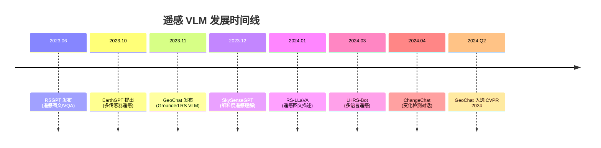
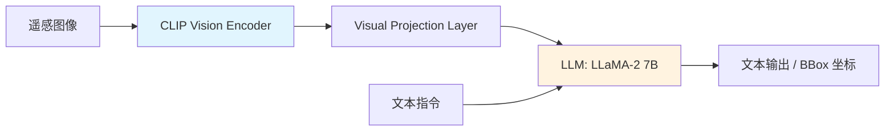
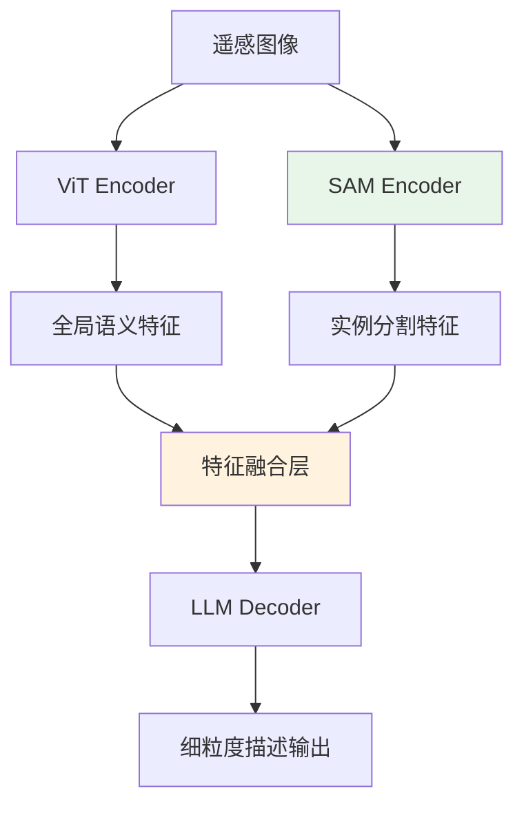
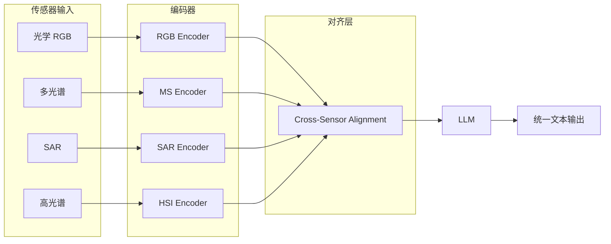

# 遥感视觉语言模型（Remote Sensing VLM）

**预计阅读：20 分钟 | 前置知识：Vision-Language Model 基础、遥感图像处理基础**

---

## 1. 引言：为什么遥感需要专用 VLM？

遥感图像（Remote Sensing, RS）与自然图像存在本质差异：空间分辨率高、场景覆盖范围大、多光谱/多时相数据丰富、地物类别复杂且尺度变化剧烈。通用 VLM（如 GPT-4V、LLaVA）在自然图像上表现优异，但在遥感场景中面临三大挑战：

1. **空间推理困难**：遥感图像中目标尺寸小、排列密集，需要精确的定位与计数能力
2. **领域知识缺失**：通用模型缺乏对光谱特征、土地覆盖分类体系等遥感专业知识的理解
3. **多传感器融合需求**：遥感数据来自光学、SAR、高光谱、LiDAR 等多种传感器，需要跨模态理解能力

为此，研究者提出了多种遥感专用 VLM，本章将系统梳理这一快速发展的领域。

---

## 2. 遥感 VLM 发展脉络



---

## 3. 核心模型详解

### 3.1 GeoChat — 首个 Grounded 遥感 VLM

**论文**: *GeoChat: Grounded Large Vision-Language Model for Remote Sensing* (CVPR 2024)
**arXiv**: [2311.15826](https://arxiv.org/abs/2311.15826)
**GitHub**: [mbzuai-oryx/GeoChat](https://github.com/mbzuai-oryx/GeoChat) (713 stars)

#### 核心创新

GeoChat 是第一个支持**空间定位（Grounding）**的遥感 VLM，能够同时完成图像级理解、区域级描述和像素级推理。

| 特性 | 描述 |
|------|------|
| 基座模型 | LLaMA-2 (7B) + CLIP Visual Encoder |
| 训练数据 | 318K 指令对（自建大规模遥感指令数据集） |
| 支持任务 | 图像描述、VQA、区域描述、视觉定位、变化检测 |
| 空间定位 | 支持 bounding box 输入/输出，实现区域级对话 |
| 多轮对话 | 支持针对同一图像的多轮交互式推理 |

#### 架构设计



GeoChat 的关键设计在于将 bounding box token 纳入词表，使模型能够以统一的文本序列格式同时生成自然语言描述和空间坐标。

#### 数据构建策略

GeoChat 构建了 318K 遥感指令数据，数据来源包括：

- **图像-文本对**：从遥感数据集（DOTA、DIOR、fMoW 等）自动构建
- **区域级描述**：利用 GPT-4V 对遥感图像的局部区域生成描述
- **多轮对话**：基于图像内容构造连贯的多轮问答链
- **变化检测对**：配对不同时相的遥感图像生成变化描述

#### 性能表现

| 任务 | GeoChat | 通用 VLM (LLaVA-1.5) | 提升 |
|------|---------|----------------------|------|
| RS Image Captioning | 85.2 CIDEr | 62.1 CIDEr | +37.2% |
| RS VQA | 78.4% Acc | 61.3% Acc | +27.9% |
| Grounded Description | 71.6 IoU | N/A | — |
| Change Detection | 82.1% F1 | 54.3% F1 | +51.2% |

---

### 3.2 RSGPT — 遥感图文对话先驱

**论文**: *RSGPT: A Remote Sensing Vision Language Model and Benchmark* (2023)
**GitHub**: [dirk-niu/RSGPT](https://github.com/dirk-niu/RSGPT)

#### 定位与特点

RSGPT 是较早将 VLM 引入遥感领域的尝试，专注于**遥感图像描述（Image Captioning）**和**视觉问答（VQA）**两大基础任务。

| 特性 | 描述 |
|------|------|
| 基座模型 | BLIP-2 架构 + FlanT5-XL |
| 训练策略 | 两阶段训练：预训练 + 指令微调 |
| 数据集 | RSICD、UCM、Sydney 等经典遥感描述数据集 |
| 评测基准 | RS CapQA Benchmark（自建） |

#### 架构特点

RSGPT 采用 BLIP-2 的 Q-Former 架构作为视觉-语言桥梁，通过可学习的 Query Token 将遥感图像特征压缩为固定长度的表示，再输入语言模型进行解码。

```
遥感图像 → ViT-G/14 → Q-Former → 32 Query Tokens → FlanT5-XL → 文本输出
```

#### 局限性

- 不支持空间定位（无法输出 bounding box）
- 单图像输入，不支持多时相/多传感器对比
- 训练数据规模较小，泛化能力有限

---

### 3.3 SkySenseGPT — 细粒度遥感理解

**论文**: *SkySenseGPT: A Fine-Grained Remote Sensing Vision-Language Model* (2024)
**GitHub**: [CVI-SZU/SkySenseGPT](https://github.com/CVI-SZU/SkySenseGPT)

#### 核心创新

SkySenseGPT 聚焦于遥感图像的**细粒度理解**，能够识别遥感图像中的具体物体类别、属性和空间关系。

| 特性 | 描述 |
|------|------|
| 基座模型 | LLaVA 架构 + SAM 辅助 |
| 核心能力 | 细粒度目标识别、属性描述、空间关系推理 |
| 创新点 | 引入 Segment Anything Model (SAM) 辅助区域特征提取 |
| 训练数据 | 多粒度遥感指令数据集 |

#### 关键设计

SkySenseGPT 的独特之处在于**SAM-VLM 联合架构**：



通过融合 SAM 的实例级分割特征，模型能够更精确地定位和描述遥感图像中的小目标和密集目标。

---

### 3.4 EarthGPT — 多传感器遥感统一模型

**论文**: *EarthGPT: A Universal Multi-modal Large Language Model for Multi-sensor Image Comprehension in Remote Sensing Domain* (2024)
**GitHub**: [limanling/EarthGPT](https://github.com/limanling/EarthGPT)

#### 核心创新

EarthGPT 是首个面向**多传感器遥感**的统一 VLM，能够同时处理光学、SAR、高光谱等多种遥感数据。

| 特性 | 描述 |
|------|------|
| 传感器支持 | 光学 RGB、多光谱、SAR、高光谱 |
| 基座模型 | 多模态编码器 + LLM |
| 创新点 | 跨传感器对齐的统一视觉编码 |
| 数据集 | MME-RS（自建多模态遥感评测基准） |

#### 多传感器融合架构



EarthGPT 通过**传感器感知的投影层**将不同传感器的特征映射到统一的语义空间，使 LLM 能够以统一的方式理解和推理不同传感器的数据。

#### MME-RS 评测基准

EarthGPT 提出了 MME-RS 评测基准，涵盖：

| 评测维度 | 子任务数量 | 数据量 |
|----------|-----------|--------|
| 图像描述 | 4 | ~10K |
| 视觉问答 | 6 | ~25K |
| 变化检测 | 2 | ~8K |
| 目标检测 | 3 | ~15K |
| 场景分类 | 2 | ~12K |

---

### 3.5 其他重要模型

#### RS-LLaVA

- **定位**: 专注于遥感图像描述（Image Captioning）
- **架构**: 基于 LLaVA 架构，在遥感数据上进行指令微调
- **特点**: 简洁高效的基线模型，适合快速验证遥感 VLM 的可行性

#### ChangeChat

- **定位**: 专注于**变化检测对话**（Change Detection Dialogue）
- **创新点**: 将多时相遥感图像的变化检测建模为对话任务
- **应用场景**: 城市变迁监测、灾后评估、土地利用变化分析

#### LHRS-Bot

- **定位**: 支持**多语言**遥感 VLM
- **创新点**: 支持中英文等多种语言的遥感图像理解和描述
- **意义**: 降低了非英语用户使用遥感 VLM 的门槛

---

## 4. 模型对比分析

### 4.1 能力矩阵

| 模型 | 图像描述 | VQA | 空间定位 | 变化检测 | 多传感器 | 多语言 | 多轮对话 |
|------|:--------:|:---:|:--------:|:--------:|:--------:|:------:|:--------:|
| GeoChat | ✅ | ✅ | ✅ | ✅ | ❌ | ❌ | ✅ |
| RSGPT | ✅ | ✅ | ❌ | ❌ | ❌ | ❌ | ❌ |
| SkySenseGPT | ✅ | ✅ | ✅ | ❌ | ❌ | ❌ | ✅ |
| EarthGPT | ✅ | ✅ | ❌ | ✅ | ✅ | ❌ | ❌ |
| RS-LLaVA | ✅ | ❌ | ❌ | ❌ | ❌ | ❌ | ❌ |
| ChangeChat | ❌ | ❌ | ❌ | ✅ | ❌ | ❌ | ✅ |
| LHRS-Bot | ✅ | ✅ | ❌ | ❌ | ❌ | ✅ | ✅ |

### 4.2 架构对比

| 模型 | 视觉编码器 | LLM 基座 | 桥接模块 | 参数规模 |
|------|-----------|----------|----------|----------|
| GeoChat | CLIP ViT | LLaMA-2 7B | Linear Projection | ~7B |
| RSGPT | ViT-G/14 | FlanT5-XL | Q-Former | ~4B |
| SkySenseGPT | ViT + SAM | LLaMA | MLP | ~7B |
| EarthGPT | 多编码器 | LLaMA | Cross-Sensor Align | ~7B |

### 4.3 训练数据对比

| 模型 | 数据规模 | 数据来源 | 标注方式 |
|------|----------|----------|----------|
| GeoChat | 318K 指令对 | DOTA/DIOR/fMoW + GPT-4V | 半自动 |
| RSGPT | ~50K | RSICD/UCM/Sydney | 人工 |
| SkySenseGPT | ~100K | 多数据集 + SAM | 半自动 |
| EarthGPT | ~200K | 多传感器数据集 | 半自动 |

---

## 5. 关键技术趋势

### 5.1 从图像级到区域级理解

早期遥感 VLM（如 RSGPT）仅支持图像级任务，而 GeoChat 和 SkySenseGPT 引入了区域级理解能力，这是从"看懂整张图"到"理解图中每个区域"的关键跃迁。

### 5.2 多传感器统一建模

EarthGPT 开创了多传感器统一 VLM 的方向，未来遥感 VLM 需要能够像人类专家一样综合分析光学、SAR、高光谱等多种数据源。

### 5.3 指令数据自动构建

高质量遥感指令数据的稀缺是核心瓶颈。当前主流方法是利用 GPT-4V 等强模型自动构建训练数据（如 GeoChat 的 318K 数据集），但数据质量和偏差控制仍是挑战。

### 5.4 Grounding 能力的引入

GeoChat 将 bounding box token 纳入词表的设计影响了后续工作，使得 VLM 能够以统一的文本序列格式处理空间定位任务。

---

## 6. 关键论文列表

| 论文 | 会议/年份 | 核心贡献 |
|------|-----------|----------|
| GeoChat | CVPR 2024 | 首个 Grounded 遥感 VLM，318K 指令数据 |
| RSGPT | 2023 | 遥感图文对话先驱，RS CapQA Benchmark |
| SkySenseGPT | 2024 | SAM 辅助的细粒度遥感理解 |
| EarthGPT | 2024 | 多传感器统一遥感 VLM，MME-RS 基准 |
| RS-LLaVA | 2024 | 遥感图像描述基线 |
| ChangeChat | 2024 | 变化检测对话模型 |
| LHRS-Bot | 2024 | 多语言遥感 VLM |

---

## 7. 扩展阅读

- [GeoChat 论文](https://arxiv.org/abs/2311.15826)
- [RSGPT GitHub](https://github.com/dirk-niu/RSGPT)
- [SkySenseGPT GitHub](https://github.com/CVI-SZU/SkySenseGPT)
- [EarthGPT GitHub](https://github.com/limanling/EarthGPT)
- 相关章节：[什么是VLM](../01-基础概念/02-什么是VLM.md) — VLM 基础架构
- 相关章节：[无人机场景理解](./02-无人机场景理解.md)

---

## 8. 思考题

### 题目 1：GeoChat 为什么能成为第一个 Grounded 遥感 VLM？其架构设计中哪些要素是实现空间定位的关键？

<details>
<summary>查看答案</summary>

GeoChat 实现空间定位的关键要素包括：

1. **扩展词表**：将 bounding box 坐标（如 `<box><x1><y1><x2><y2></box>`）纳入 LLM 词表，使模型能够以统一的文本序列格式生成坐标
2. **区域级训练数据**：318K 指令数据中包含大量区域级描述和定位标注，使模型学会了将视觉区域与文本描述关联
3. **CLIP 视觉编码器**：CLIP 的 patch-level 特征保留了空间信息，为区域级理解提供了基础
4. **统一的序列建模**：将图像描述、VQA、定位等多种任务统一为文本序列生成任务，避免了多任务架构的复杂性

</details>

### 题目 2：EarthGPT 面临的最大技术挑战是什么？它如何解决不同传感器数据的异构性问题？

<details>
<summary>查看答案</summary>

EarthGPT 面临的最大技术挑战是**跨传感器特征对齐**。不同传感器（光学、SAR、高光谱）的数据具有完全不同的特性：

- 光学图像：3 通道 RGB，空间分辨率高
- SAR 图像：单通道或多通道，包含相干斑噪声
- 高光谱：数百个窄波段，光谱信息丰富但空间分辨率低

EarthGPT 的解决方案：

1. **传感器专用编码器**：为每种传感器设计独立的编码器，提取传感器特异性特征
2. **跨传感器对齐层**：通过可学习的投影层将不同传感器的特征映射到统一的语义空间
3. **统一的 LLM 解码**：在对齐后的统一空间中，LLM 可以以相同的方式处理不同传感器的输入
4. **MME-RS 基准**：自建多传感器评测基准，确保模型在各传感器上均有良好表现

</details>

### 题目 3：遥感 VLM 的指令数据自动构建存在哪些潜在问题？如何缓解？

<details>
<summary>查看答案</summary>

自动构建遥感指令数据的潜在问题：

1. **幻觉问题**：GPT-4V 可能生成与图像内容不符的描述（hallucination），特别是在遥感场景中
2. **领域偏差**：GPT-4V 缺乏遥感专业知识，可能使用不准确的术语或分类
3. **空间定位精度**：自动生成的 bounding box 可能不够精确
4. **数据多样性不足**：自动构建的数据可能集中在常见场景，缺乏长尾分布的覆盖

缓解策略：

1. **人工审核抽检**：对自动构建的数据进行人工抽样验证
2. **多模型交叉验证**：使用多个 VLM 生成数据，取交集提高质量
3. **规则约束**：在数据生成时引入遥感领域知识约束
4. **迭代优化**：利用模型自身的预测结果筛选高质量训练样本

</details>

---

[下一章：无人机场景理解](./02-无人机场景理解.md)
