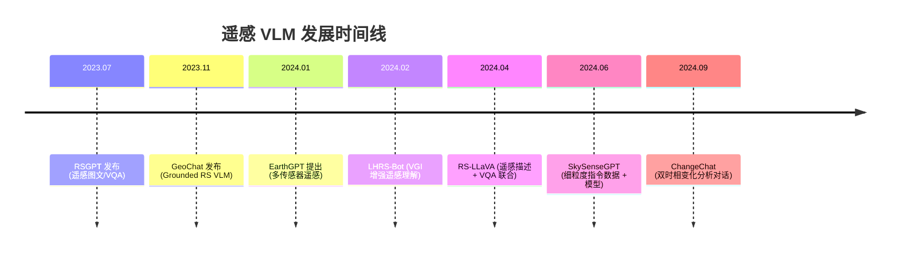
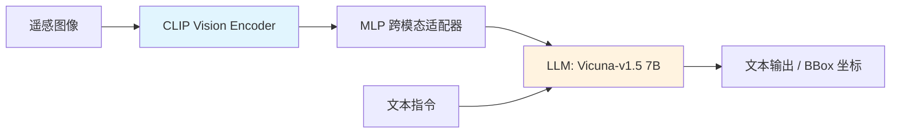
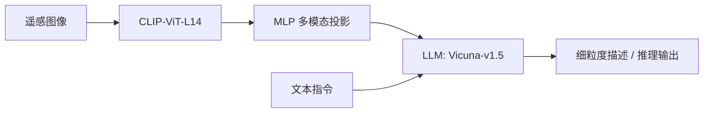
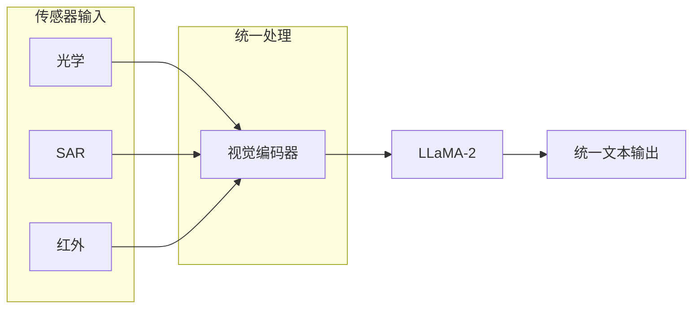

# 遥感视觉语言模型（Remote Sensing VLM）

> **预计阅读：20 分钟 | 前置知识：Vision-Language Model 基础、遥感图像处理基础**

---

## 1. 为什么遥感需要专用 VLM？

遥感图像（Remote Sensing, RS）与自然图像存在本质差异：空间分辨率高、场景覆盖范围大、多光谱/多时相数据丰富、地物类别复杂且尺度变化剧烈。通用 VLM（如 GPT-4V、LLaVA）在自然图像上表现优异，但在遥感场景中面临三大挑战：

1. **空间推理困难**：遥感图像中目标尺寸小、排列密集，需要精确的定位与计数能力
2. **领域知识缺失**：通用模型缺乏对光谱特征、土地覆盖分类体系等遥感专业知识的理解
3. **多传感器融合需求**：遥感数据来自光学、SAR、高光谱、LiDAR 等多种传感器，需要跨模态理解能力

为此出现了多种遥感专用 VLM。

---

## 2. 遥感 VLM 发展脉络


```mermaid
timeline
    title 遥感 VLM 发展时间线
    2023.07 : RSGPT 发布 (遥感图文/VQA)
    2023.11 : GeoChat 发布 (Grounded RS VLM)
    2024.01 : EarthGPT 提出 (多传感器遥感)
    2024.02 : LHRS-Bot (VGI 增强遥感理解)
    2024.04 : RS-LLaVA (遥感描述 + VQA 联合)
    2024.06 : SkySenseGPT (细粒度指令数据 + 模型)
    2024.09 : ChangeChat (双时相变化分析对话)
```

---

## 3. 核心模型详解

### 3.1 GeoChat — 首个 Grounded 遥感 VLM

**论文**: *GeoChat: Grounded Large Vision-Language Model for Remote Sensing* (CVPR 2024)
**arXiv**: [2311.15826](https://arxiv.org/abs/2311.15826)
**GitHub**: [mbzuai-oryx/GeoChat](https://github.com/mbzuai-oryx/GeoChat)（2026-10 查：759 stars）

#### 核心创新

GeoChat 是第一个支持**空间定位（Grounding）**的遥感 VLM，能够同时完成图像级理解、区域级描述和像素级推理。

| 特性 | 描述 |
|------|------|
| 基座模型 | CLIP-ViT（冻结）+ Vicuna-v1.5 (7B) |
| 桥接模块 | MLP 跨模态适配器（一层 hidden） |
| 训练数据 | 318K 指令对（论文原文 "nearly 318k"，306k 训练 + 12k 测试） |
| 支持任务 | 图像描述、VQA、区域描述、视觉定位、指代检测 |
| 空间定位 | 支持 bounding box 输入/输出，实现区域级对话 |
| 多轮对话 | 支持针对同一图像的多轮交互式推理 |

#### 架构设计


```mermaid
graph LR
    A[遥感图像] --> B[CLIP Vision Encoder]
    B --> C[MLP 跨模态适配器]
    C --> D[LLM: Vicuna-v1.5 7B]
    E[文本指令] --> D
    D --> F[文本输出 / BBox 坐标]
    
    style B fill:#e1f5fe
    style D fill:#fff3e0
```

GeoChat 的关键设计在于将 bounding box token 纳入词表，使模型能够以统一的文本序列格式同时生成自然语言描述和空间坐标。

#### 数据构建策略

GeoChat 构建了 318K 遥感指令数据，数据来源包括：

- **图像-文本对**：从公开遥感数据集（DOTA、DIOR、FAIR1M、LRBEN、NWPU-RESISC45、FloodNet）自动构建
- **区域级描述**：用 Vicuna-v1.5 驱动的自动流水线对遥感图像的局部区域生成描述
- **多轮对话**：基于图像内容构造连贯的多轮问答链
- **指代检测**：把目标框坐标纳入对话格式

#### 性能表现

论文报的指标按任务分成三组，**没有一张跨任务的汇总表**：

| 任务 | 指标 | GeoChat | LLaVA-1.5 |
|------|------|---------|-----------|
| 场景分类 | UCMerced Acc | 84.43 | 68.00 |
| 场景分类 | AID Acc | 72.03 | 51.00 |
| RSVQA-HRBEN | 平均 Acc | 90.70 | — |
| 图像描述 | ROUGE-1 | 87.3 | — |
| 图像描述 | METEOR | 83.9 | — |

---

### 3.2 RSGPT — 遥感图文对话先驱

**论文**: *RSGPT: A Remote Sensing Vision Language Model and Benchmark* (2023)
**GitHub**: [Lavender105/RSGPT](https://github.com/Lavender105/RSGPT)

#### 定位与特点

RSGPT 是较早将 VLM 引入遥感领域的尝试，专注于**遥感图像描述（Image Captioning）**和**视觉问答（VQA）**两大基础任务。

| 特性 | 描述 |
|------|------|
| 基座模型 | EVA-G 视觉编码器 + Vicuna-7B/13B，权重由 InstructBLIP 初始化 |
| 桥接模块 | Q-Former（K 个可学习 query embedding，论文未给 K 的具体值） |
| 训练数据 | RSICap 数据集：2,585 条人工标注图文对（源自 DOTA） |
| 评测基准 | RSIEval（论文自建评测集） |

#### 架构特点

RSGPT 采用 Q-Former 架构作为视觉-语言桥梁，通过可学习的 Query Token 将遥感图像特征压缩为固定长度的表示，再输入语言模型进行解码。

```
遥感图像 → EVA-G → Q-Former → K 个 Query Token → Vicuna-7B/13B → 文本输出
```

#### 局限性

- 不支持空间定位（无法输出 bounding box）
- 单图像输入，不支持多时相/多传感器对比
- 训练数据规模较小，泛化能力有限

---

### 3.3 SkySenseGPT — 细粒度遥感理解

**论文**: *SkySenseGPT: A Fine-Grained Instruction Tuning Dataset and Model for Remote Sensing Vision-Language Understanding* (2024)
**GitHub**: [Luo-Z13/SkySenseGPT](https://github.com/Luo-Z13/SkySenseGPT)

#### 核心创新

SkySenseGPT 的贡献分两半：一个大规模细粒度指令数据集，和一个在其上微调的模型。前者往往比后者更值得引用。

| 特性 | 描述 |
|------|------|
| 架构 | CLIP-ViT-L14 视觉编码器 + MLP 投影 + Vicuna-v1.5 |
| 数据集 | FIT-RS，**1,800,851 条指令样本** |
| 核心能力 | 细粒度目标识别、属性描述、空间关系推理 |
| 数据来源 | REL 系列子集 + 半自动标注流水线 |

#### 关键设计

SkySenseGPT 跟随主流 LMM 的三段式结构：


```mermaid
graph LR
    A[遥感图像] --> B[CLIP-ViT-L14]
    B --> C[MLP 多模态投影]
    C --> D[LLM: Vicuna-v1.5]
    E[文本指令] --> D
    D --> F[细粒度描述 / 推理输出]
```

论文的重点不在架构（架构是标准的），而在**指令数据的构造**：把细粒度任务拆成可自动生成的模板，再靠规则与模型交叉校验筛选。

---

### 3.4 EarthGPT — 多传感器遥感统一模型

**论文**: *EarthGPT: A Universal Multi-modal Large Language Model for Multi-sensor Image Comprehension in Remote Sensing Domain* (2024)
**GitHub**: [wivizhang/EarthGPT](https://github.com/wivizhang/EarthGPT)

#### 核心创新

EarthGPT 是面向**多传感器遥感**的统一 VLM，能够处理光学、SAR、红外三种模态的图像。

| 特性 | 描述 |
|------|------|
| 传感器支持 | 光学、SAR、红外（论文原文三种模态） |
| 基座模型 | LLaMA-2 + 可学习新增参数 |
| 创新点 | 跨传感器统一的任务指令格式与训练数据 |
| 数据集 | MMRS-1M：>1M 图文对，基于 34 个公开遥感数据集 |

#### 多传感器建模


```mermaid
graph LR
    subgraph 传感器输入
        A1[光学]
        A2[SAR]
        A3[红外]
    end
    subgraph 统一处理
        A1 --> C[视觉编码器]
        A2 --> C
        A3 --> C
    end
    C --> D[LLaMA-2] --> E[统一文本输出]
```

EarthGPT 的做法是**统一任务格式**：把分类、检测、描述、VQA、视觉定位都写成同一套指令-回答模板，让一个 LLaMA-2 同时学会三种模态上的五类任务，而不是为每种模态配一个专用编码器。

#### MMRS-1M 数据集

| 项 | 内容 |
|------|--------|
| 规模 | >1M 图文对 |
| 来源 | 34 个公开遥感数据集 |
| 模态 | 光学、红外、SAR |
| 覆盖任务 | 场景分类、图像描述、区域描述、VQA、视觉定位、水平框与旋转框检测 |

---

### 3.5 其他重要模型

#### RS-LLaVA

- **定位**: 遥感图像**描述与 VQA 的联合建模**（论文题名即 "Joint Captioning and Question Answering"）
- **架构**: 基于 LLaVA 架构，在遥感指令数据（RS-instructions）上微调
- **特点**: 简洁高效的基线模型，适合快速验证遥感 VLM 的可行性

#### ChangeChat

- **定位**: 专注于**双时相变化分析对话**（bitemporal change analysis）
- **创新点**: 把多时相遥感图像的变化检测建模为对话任务
- **应用场景**: 城市变迁监测、灾后评估、土地利用变化分析

#### LHRS-Bot

- **定位**: 用**视觉-地理定位（VGI）数据**增强的遥感 VLM
- **创新点**: 借助地理坐标等元信息提升遥感图像理解与定位能力
- **意义**: 展示了非视觉先验（地理元数据）对遥感任务的增益

---

## 4. 模型对比分析

### 4.1 能力矩阵

| 模型 | 图像描述 | VQA | 空间定位 | 变化检测 | 多传感器 | 多轮对话 |
|------|:--------:|:---:|:--------:|:--------:|:--------:|:--------:|
| GeoChat | ✅ | ✅ | ✅ | ❌ | ❌ | ✅ |
| RSGPT | ✅ | ✅ | ❌ | ❌ | ❌ | ❌ |
| SkySenseGPT | ✅ | ✅ | ✅ | ❌ | ❌ | ✅ |
| EarthGPT | ✅ | ✅ | ✅ | ❌ | ✅ | ❌ |
| RS-LLaVA | ✅ | ✅ | ❌ | ❌ | ❌ | ❌ |
| ChangeChat | ❌ | ❌ | ❌ | ✅ | ❌ | ✅ |
| LHRS-Bot | ✅ | ✅ | ✅ | ❌ | ❌ | ✅ |

### 4.2 架构对比

| 模型 | 视觉编码器 | LLM 基座 | 桥接模块 |
|------|-----------|----------|----------|
| GeoChat | CLIP ViT（冻结） | Vicuna-v1.5 7B | MLP 适配器 |
| RSGPT | EVA-G | Vicuna-7B/13B | Q-Former |
| SkySenseGPT | CLIP-ViT-L14 | Vicuna-v1.5 | MLP |
| EarthGPT | 视觉编码器 | LLaMA-2 | 统一任务指令格式 |

### 4.3 训练数据对比

| 模型 | 数据规模 | 数据来源 |
|------|----------|----------|
| GeoChat | 318K 指令对 | DOTA / DIOR / FAIR1M / LRBEN / NWPU-RESISC45 / FloodNet |
| RSGPT | 2,585 图文对 | RSICap（源自 DOTA） |
| SkySenseGPT | 1,800,851 指令样本 | FIT-RS |
| EarthGPT | >1M 图文对 | 34 个公开遥感数据集 |

---

## 5. 关键技术趋势

### 5.1 从图像级到区域级理解

早期遥感 VLM（如 RSGPT）仅支持图像级任务，GeoChat 和 SkySenseGPT 把粒度下推到了区域级。

### 5.2 多传感器统一建模

EarthGPT 把光学、SAR、红外三种模态收进同一个模型，也把分类、检测、描述、VQA、视觉定位五类任务收进同一套指令格式。真正的多传感器统一尚未解决：三种模态的训练数据量并不均衡，跨模态零样本（如只用光学训、直接考 SAR）仍是空白。

### 5.3 指令数据自动构建

高质量遥感指令数据的稀缺是核心瓶颈。当前主流方法是用一个现成的强模型驱动自动流水线来构建训练数据（GeoChat 用的是 Vicuna-v1.5，不是 GPT-4V），但数据质量和偏差控制仍是挑战。

### 5.4 Grounding 能力的引入

GeoChat 将 bounding box token 纳入词表的设计影响了后续工作，使得 VLM 能够以统一的文本序列格式处理空间定位任务。

---

## 6. 关键论文

- **[CVPR'24] GeoChat** — *GeoChat: Grounded Large Vision-Language Model for Remote Sensing*  
  [](https://arxiv.org/abs/2311.15826)
  首个 Grounded 遥感 VLM，318K 指令数据

- **[arXiv'23.07] RSGPT** — *RSGPT: A Remote Sensing Vision Language Model and Benchmark*  
  [](https://arxiv.org/abs/2307.15266)
  遥感图文对话先驱，RSICap 数据集 + RSIEval 评测集

- **[arXiv'24.06] SkySenseGPT** — *SkySenseGPT: A Fine-Grained Instruction Tuning Dataset and Model for Remote Sensing Vision-Language Understanding*  
  [](https://arxiv.org/abs/2406.10100)
  FIT-RS 指令数据集（1.8M 条）与细粒度遥感理解

- **[arXiv'24.01] EarthGPT** — *EarthGPT: A Universal Multi-modal Large Language Model for Multi-sensor Image Comprehension in Remote Sensing Domain*  
  [](https://arxiv.org/abs/2401.16822)
  多传感器（光学/SAR/红外）统一遥感 VLM，MMRS-1M

- **[MDPI RS'24] RS-LLaVA** — *RS-LLaVA: A Large Vision-Language Model for Joint Captioning and Question Answering in Remote Sensing Imagery*  
  [](https://github.com/BigData-KSU/RS-LLaVA)
  遥感描述 + VQA 联合基线

- **[arXiv'24.09] ChangeChat** — *ChangeChat: An Interactive Model for Remote Sensing Change Analysis via Multimodal Instruction Tuning*  
  [](https://arxiv.org/abs/2409.08582)
  双时相变化分析对话模型

- **[ECCV'24] LHRS-Bot** — *LHRS-Bot: Empowering Remote Sensing with VGI-Enhanced Large Multimodal Language Model*  
  [](https://arxiv.org/abs/2402.02544)
  VGI（视觉-地理定位）增强的遥感 VLM

---

## 7. 扩展阅读

- [GeoChat 论文](https://arxiv.org/abs/2311.15826)
- [RSGPT GitHub](https://github.com/Lavender105/RSGPT)
- [SkySenseGPT GitHub](https://github.com/Luo-Z13/SkySenseGPT)
- [EarthGPT GitHub](https://github.com/wivizhang/EarthGPT)
- 相关章节：[什么是VLM](../01-基础概念/02-什么是VLM.md) — VLM 基础架构
- 相关章节：[无人机场景理解](./02-无人机场景理解.md)

---

## 8. 思考题

### 题目 1：GeoChat 为什么能成为第一个 Grounded 遥感 VLM？其架构设计中哪些要素是实现空间定位的关键？

<details>
<summary>查看答案</summary>

GeoChat 实现空间定位的关键要素包括：

1. **扩展词表**：将 bounding box 坐标（如 `<box><x1><y1><x2><y2></box>`）纳入 LLM 词表，使模型能够以统一的文本序列格式生成坐标
2. **区域级训练数据**：318K 指令数据中包含大量区域级描述和定位标注，使模型学会了将视觉区域与文本描述关联
3. **CLIP 视觉编码器**：CLIP 的 patch-level 特征保留了空间信息，为区域级理解提供了基础
4. **统一的序列建模**：将图像描述、VQA、定位等多种任务统一为文本序列生成任务，避免了多任务架构的复杂性

</details>

### 题目 2：EarthGPT 面临的最大技术挑战是什么？它如何把三种模态的任务统一到同一个模型里？

<details>
<summary>查看答案</summary>

EarthGPT 面临的最大技术挑战是**跨模态的任务与表达统一**。论文涉及的三种模态特性差异很大：

- 光学：3 通道 RGB，空间分辨率高，符合直觉
- 红外：单通道，反映热辐射，与可见光的纹理语义不通用
- SAR：包含相干斑噪声，成像几何与光学完全不同

EarthGPT 的解决方案：

1. **统一任务指令格式**：把分类、检测、描述、VQA、视觉定位都写成同一套指令-回答模板
2. **多模态训练数据**：MMRS-1M 用 34 个公开数据集拼出 >1M 图文对，覆盖三种模态
3. **单一 LLM 解码**：任务与模态的差异全部由指令文本区分，不需要为每种模态配专用编码器
4. **在 LLaMA-2 上引入可学习新增参数**：原文 *"introduce new learnable parameters into the LLaMA-2 model"*

</details>

### 题目 3：遥感 VLM 的指令数据自动构建存在哪些潜在问题？如何缓解？

<details>
<summary>查看答案</summary>

自动构建遥感指令数据的潜在问题：

1. **幻觉问题**：GPT-4V 可能生成与图像内容不符的描述（hallucination），特别是在遥感场景中
2. **领域偏差**：GPT-4V 缺乏遥感专业知识，可能使用不准确的术语或分类
3. **空间定位精度**：自动生成的 bounding box 可能不够精确
4. **数据多样性不足**：自动构建的数据可能集中在常见场景，缺乏长尾分布的覆盖

缓解策略：

1. **人工审核抽检**：对自动构建的数据进行人工抽样验证
2. **多模型交叉验证**：使用多个 VLM 生成数据，取交集提高质量
3. **规则约束**：在数据生成时引入遥感领域知识约束
4. **迭代优化**：利用模型自身的预测结果筛选高质量训练样本

</details>

---

> **下一节**：[02-无人机场景理解](./02-无人机场景理解.md) — 从卫星视角下沉到无人机视角，理解任务要处理的新变量
