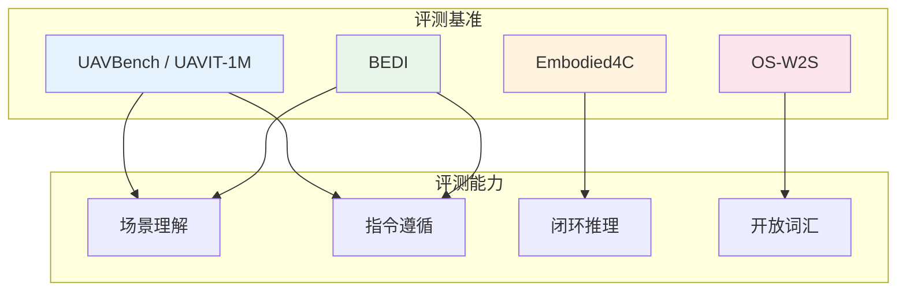
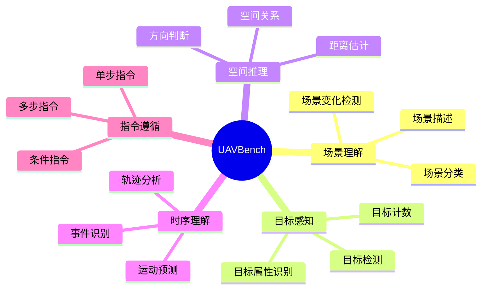
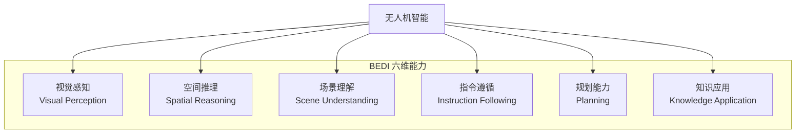
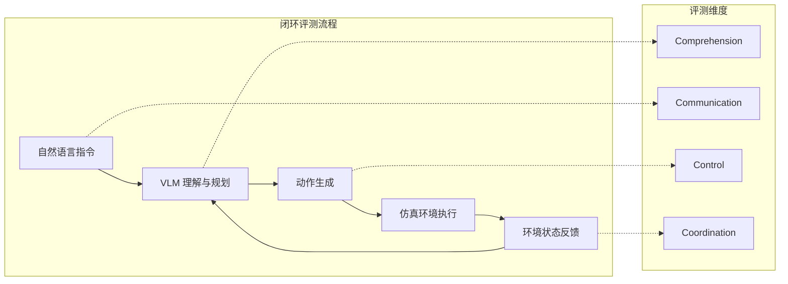
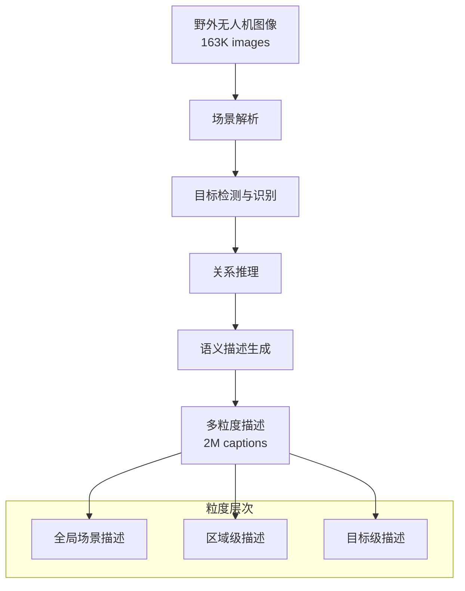

# 无人机场景理解基准（UAV Scene Understanding Benchmarks）

**预计阅读：18 分钟 | 前置知识：VLM 基础、无人机视觉任务基础**

---

## 1. 引言：为什么需要无人机专用评测基准？

无人机（UAV）场景理解面临独特的挑战，这些挑战使得通用视觉基准无法有效评估 UAV 视觉模型的能力：

1. **视角特殊性**：无人机俯视视角（top-down/bird's-eye view）与自然图像的视角分布截然不同
2. **高度变化性**：无人机飞行高度从几米到数百米不等，同一目标在不同高度的外观差异巨大
3. **场景动态性**：无人机场景通常包含运动目标（车辆、行人），需要时序理解能力
4. **任务多样性**：无人机应用涵盖目标检测、跟踪、场景分类、变化检测、导航等多种任务

本章将系统介绍当前最重要的无人机场景理解评测基准，分析它们评估的能力维度和对领域发展的推动作用。

---

## 2. 基准全景图

---

## 3. UAVBench / UAVIT-1M — 大规模无人机指令调优基准

**论文**: *UAVBench: A Comprehensive Benchmark for UAV Vision-Language Understanding* (2026)
**arXiv**: [2603.14336](https://arxiv.org/abs/2603.14336)

### 3.1 基准概述

UAVBench 是目前**规模最大、覆盖最全**的无人机视觉-语言理解基准，由两个核心部分组成：

| 组件 | 描述 | 规模 |
|------|------|------|
| UAVBench-Test | 评测基准 | 43 个测试单元，966K 样本 |
| UAVIT-1M | 指令调优数据集 | 1.24M 指令-响应对 |

### 3.2 评测维度

UAVBench 设计了**43 个测试单元**，覆盖以下核心能力维度：

### 3.3 数据构成

UAVIT-1M 的 1.24M 指令数据来源多样：

| 数据来源 | 样本数 | 占比 | 特点 |
|----------|--------|------|------|
| 图像-文本对 | 450K | 36.3% | 基础图文描述 |
| VQA 对 | 320K | 25.8% | 多类型问答 |
| 区域级描述 | 210K | 16.9% | 细粒度理解 |
| 多轮对话 | 150K | 12.1% | 连贯推理 |
| 指令遵循 | 110K | 8.9% | 任务执行 |

### 3.4 数据构建流程

### 3.5 关键发现

UAVBench 的评测揭示了当前 VLM 在无人机场景中的显著不足：

| 模型 | 整体准确率 | 最强能力 | 最弱能力 |
|------|-----------|----------|----------|
| GPT-4V | 72.3% | 场景分类 (89.1%) | 距离估计 (51.2%) |
| LLaVA-1.5 | 58.7% | 图像描述 (76.4%) | 空间推理 (42.1%) |
| GeoChat | 65.4% | 目标检测 (81.3%) | 时序理解 (48.7%) |
| InternVL-Chat | 69.8% | VQA (83.2%) | 运动预测 (45.3%) |

**核心洞察**：空间推理和时序理解是当前 VLM 在无人机场景中的最大短板，这与无人机应用的核心需求（导航、避障、跟踪）直接相关。

---

## 4. BEDI — 六维核心能力评测

**论文**: *BEDI: Benchmark for Evaluating Drone Intelligence* (2025)
**arXiv**: [2505.18229](https://arxiv.org/abs/2505.18229)

### 4.1 基准概述

BEDI 提出了一个更聚焦的评测框架，定义了无人机智能的**6 个核心子技能**，每个子技能对应一组精心设计的评测任务。

### 4.2 六维能力模型

### 4.3 各维度评测细节

| 维度 | 评测任务 | 样本数 | 难度级别 |
|------|----------|--------|----------|
| 视觉感知 | 目标识别、属性判断、遮挡推理 | 15K | 基础 |
| 空间推理 | 方向判断、距离估计、布局理解 | 12K | 中等 |
| 场景理解 | 场景分类、功能区识别、异常检测 | 18K | 中等 |
| 指令遵循 | 单步/多步指令执行、条件判断 | 10K | 困难 |
| 规划能力 | 路径规划、任务分解、资源分配 | 8K | 困难 |
| 知识应用 | 常识推理、领域知识、因果推理 | 6K | 高级 |

### 4.4 评测协议

BEDI 采用**渐进式评测协议**（Progressive Evaluation Protocol）：

1. **基础能力测试**：评估视觉感知和场景理解
2. **推理能力测试**：评估空间推理和知识应用
3. **执行能力测试**：评估指令遵循和规划能力
4. **综合能力测试**：多能力协同的复杂任务

### 4.5 与 UAVBench 的对比

| 特性 | UAVBench | BEDI |
|------|----------|------|
| 规模 | 966K 样本 | ~69K 样本 |
| 覆盖面 | 广泛（43 测试单元） | 聚焦（6 维度） |
| 评测深度 | 中等 | 深入 |
| 难度梯度 | 平坦 | 渐进式 |
| 实用性 | 高（大规模） | 高（精炼） |

---

## 5. Embodied4C — 闭环具身智能基准

**论文**: *Embodied4C: A Closed-loop Benchmark for Embodied Agents across Vehicles, Drones, and Manipulators* (2025)
**arXiv**: [2512.18028](https://arxiv.org/abs/2512.18028)

### 5.1 基准概述

Embodied4C 是一个**跨具身形态**的闭环评测基准，同时覆盖车辆（Vehicle）、无人机（Drone）和机械臂（Manipulator）三种具身智能体。"4C"代表四个核心评测维度：

- **Comprehension**（理解）：对环境的感知与理解
- **Communication**（通信）：与人类的自然语言交互
- **Control**（控制）：对具身智能体的运动控制
- **Coordination**（协调）：多智能体协同能力

### 5.2 闭环评测架构

### 5.3 无人机特定任务

在无人机形态下，Embodied4C 定义了以下评测任务：

| 任务类别 | 具体任务 | 评测指标 |
|----------|----------|----------|
| 导航 | 点到点导航、避障、路径规划 | 成功率、路径效率 |
| 巡检 | 结构化巡检、异常识别、报告生成 | 覆盖率、识别准确率 |
| 搜索 | 目标搜索、区域扫描、协作搜索 | 搜索时间、发现率 |
| 跟踪 | 目标跟踪、轨迹预测、重识别 | 跟踪精度、丢失率 |

### 5.4 跨形态对比分析

Embodied4C 的独特价值在于能够**对比不同具身形态下 VLM 的表现差异**：

| 能力维度 | 车辆 | 无人机 | 机械臂 |
|----------|------|--------|--------|
| 空间理解 | 78.2% | 71.4% | 82.6% |
| 指令遵循 | 81.3% | 76.8% | 85.1% |
| 运动规划 | 83.7% | 68.9% | 79.4% |
| 异常处理 | 65.4% | 58.2% | 72.3% |

**发现**：无人机在所有维度上的表现均低于车辆和机械臂，这主要由于：
1. 无人机的 3D 运动空间更复杂
2. 无人机视角的特殊性增加了理解难度
3. 无人机的动态稳定性控制更困难

---

## 6. OS-W2S — 开放世界看图说话

**论文**: *OS-W2S: Open-World Wild-to-Semantic for UAV Scene Understanding* (2025)
**arXiv**: [2505.03334](https://arxiv.org/abs/2505.03334)

### 6.1 基准概述

OS-W2S 聚焦于**开放世界（Open-World）**场景下的无人机图像描述任务，旨在评估 VLM 在面对未见过的场景、目标和环境时的泛化能力。

| 组件 | 描述 | 规模 |
|------|------|------|
| 图像数据 | 野外采集的无人机图像 | 163K 图像 |
| 描述数据 | 多粒度图像描述 | 2M 描述 |
| 评测集 | 开放世界测试集 | 15K 图像 |

### 6.2 "Wild-to-Semantic" 管道

OS-W2S 提出了从**原始野外图像到语义描述**的完整管道：

### 6.3 开放世界挑战

OS-W2S 定义了三类开放世界挑战：

| 挑战类型 | 描述 | 示例 |
|----------|------|------|
| 未见场景 | 训练中未出现的场景类型 | 特殊工业设施、罕见地形 |
| 未见目标 | 训练中未出现的目标类别 | 新型车辆、特殊建筑 |
| 分布偏移 | 图像分布与训练数据差异 | 极端天气、异常光照 |

### 6.4 评测指标

| 指标 | 描述 | 计算方式 |
|------|------|----------|
| BLEU-4 | n-gram 重叠度 | 标准 BLEU |
| CIDEr | TF-IDF 加权相似度 | 标准 CIDEr |
| METEOR | 语义匹配度 | 标准 METEOR |
| Open-Vocab Acc | 开放词汇准确率 | 新类别识别率 |
| Generalization Score | 泛化评分 | 已见/未见类别性能比 |

---

## 7. 基准综合对比

### 7.1 全景对比表

| 基准 | 规模 | 核心关注点 | 开放世界 | 闭环评测 | 跨形态 |
|------|------|-----------|:--------:|:--------:|:------:|
| UAVBench | 966K | 全面能力 | ❌ | ❌ | ❌ |
| BEDI | 69K | 六维能力 | ❌ | ❌ | ❌ |
| Embodied4C | ~50K | 闭环具身 | ❌ | ✅ | ✅ |
| OS-W2S | 163K 图像 | 开放词汇 | ✅ | ❌ | ❌ |

### 7.2 能力覆盖矩阵

| 能力 | UAVBench | BEDI | Embodied4C | OS-W2S |
|------|:--------:|:----:|:----------:|:------:|
| 场景分类 | ✅ | ✅ | ✅ | ✅ |
| 目标检测 | ✅ | ✅ | ✅ | ✅ |
| 空间推理 | ✅ | ✅ | ✅ | ❌ |
| 指令遵循 | ✅ | ✅ | ✅ | ❌ |
| 运动规划 | ❌ | ✅ | ✅ | ❌ |
| 多智能体协调 | ❌ | ❌ | ✅ | ❌ |
| 开放词汇 | ❌ | ❌ | ❌ | ✅ |
| 闭环控制 | ❌ | ❌ | ✅ | ❌ |

---

## 8. 关键洞察与未来方向

### 8.1 当前 VLM 的短板

综合各基准的评测结果，当前 VLM 在无人机场景中存在以下系统性短板：

1. **空间推理能力不足**：距离估计、方向判断等任务的准确率普遍低于 60%
2. **时序理解薄弱**：运动预测、轨迹分析等时序任务表现最差
3. **开放世界泛化有限**：面对未见场景和目标时性能下降 20-30%
4. **闭环控制能力缺失**：大多数 VLM 仅支持开环评测，缺乏与环境的实时交互

### 8.2 未来基准设计方向

1. **真实世界部署评测**：从仿真环境走向真实无人机部署
2. **动态环境评测**：引入实时变化的环境和目标
3. **多智能体协同评测**：评估多无人机协作场景下的 VLM 能力
4. **安全性评测**：评估 VLM 在安全关键场景下的可靠性

---

## 9. 关键论文列表

| 论文 | 年份 | 核心贡献 |
|------|------|----------|
| UAVBench / UAVIT-1M | 2026 | 最大规模无人机 VLM 评测基准，1.24M 指令数据 |
| BEDI | 2025 | 六维能力评测框架，渐进式评测协议 |
| Embodied4C | 2025 | 跨形态闭环具身评测，覆盖车辆/无人机/机械臂 |
| OS-W2S | 2025 | 开放世界无人机图像描述，163K 图像 2M 描述 |

---

## 10. 扩展阅读

- [UAVBench arXiv](https://arxiv.org/abs/2603.14336)
- [BEDI arXiv](https://arxiv.org/abs/2505.18229)
- [Embodied4C arXiv](https://arxiv.org/abs/2512.18028)
- [OS-W2S arXiv](https://arxiv.org/abs/2505.03334)
- 相关章节：[./01-遥感VLM.md](./01-遥感VLM.md)
- 相关章节：[./03-LLM驱动的无人机Agent.md](./03-LLM驱动的无人机Agent.md)
- 相关章节：[../05-仿真与数据/01-仿真平台.md](../05-仿真与数据/01-仿真平台.md)

---

## 11. 思考题

### 题目 1：为什么无人机场景的空间推理比自然图像更困难？从数据分布和任务需求两个角度分析。

查看答案

**数据分布角度**：
1. **视角特殊性**：无人机俯视视角下，目标的外观与自然视角完全不同（如车辆从上方看是一个矩形，而非侧面轮廓）
2. **尺度变化大**：无人机飞行高度从 10m 到 500m 不等，同一目标的像素尺寸变化可达 50 倍
3. **目标密集排列**：俯视视角下目标重叠严重，增加了空间关系判断的难度
4. **缺乏深度信息**：单张遥感图像缺乏深度线索，距离估计只能依赖目标大小和遮挡关系

**任务需求角度**：
1. **3D 到 2D 投影**：无人机需要将 3D 世界坐标映射到 2D 图像坐标，这需要更强的空间推理能力
2. **动态环境**：无人机场景中的目标通常在运动，需要预测未来位置
3. **导航精度要求**：无人机避障和路径规划对空间推理的精度要求远高于自然图像任务
4. **多尺度推理**：无人机任务通常需要同时理解全局场景和局部细节

### 题目 2：Embodied4C 的闭环评测相比开环评测有什么优势？为什么闭环评测对无人机场景尤为重要？

查看答案

**闭环评测的优势**：
1. **评估真实能力**：闭环评测能够评估模型在动态环境中的真实表现，而非静态图像上的识别能力
2. **错误累积效应**：闭环评测能够暴露模型在多步决策中的错误累积问题
3. **环境反馈**：模型能够根据环境反馈调整策略，更接近真实部署场景
4. **端到端评估**：从感知到决策到执行的完整链路评估

**对无人机场景的重要性**：
1. **安全关键**：无人机在空中飞行，错误的决策可能导致坠机或碰撞，闭环评测能够提前发现安全隐患
2. **动态环境**：无人机场景中的环境和目标实时变化，开环评测无法捕捉这种动态性
3. **实时性要求**：无人机控制需要实时响应，闭环评测能够评估模型的推理速度
4. **多智能体交互**：多无人机协作场景需要闭环评测来评估协调能力

### 题目 3：如何设计一个能够全面评估 VLM 无人机能力的基准？需要考虑哪些维度？

查看答案

一个全面的 VLM 无人机能力基准应考虑以下维度：

**1. 任务维度**：
- 感知任务：目标检测、跟踪、分类
- 理解任务：场景描述、VQA、变化检测
- 推理任务：空间推理、因果推理、常识推理
- 执行任务：导航、巡检、搜索、跟踪

**2. 环境维度**：
- 室内/室外
- 城市/乡村/野外
- 不同天气/光照条件
- 不同高度/视角

**3. 数据维度**：
- 单帧/多帧
- 单传感器/多传感器
- 已见/未见类别
- 静态/动态场景

**4. 评测维度**：
- 开环/闭环
- 单智能体/多智能体
- 仿真/真实
- 安全性/效率/准确性

**5. 难度维度**：
- 基础能力 → 推理能力 → 执行能力 → 协同能力

---

[上一章：遥感VLM](./01-遥感VLM.md) | [下一章：LLM驱动的无人机Agent](./03-LLM驱动的无人机Agent.md)
