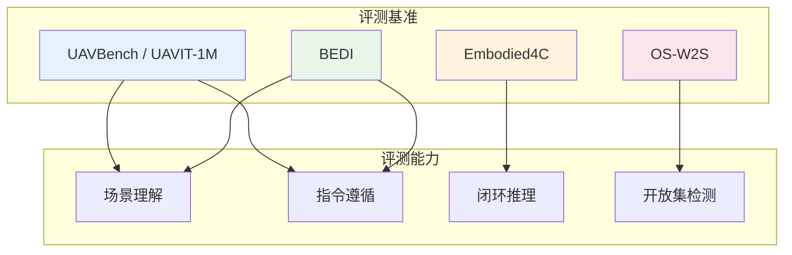
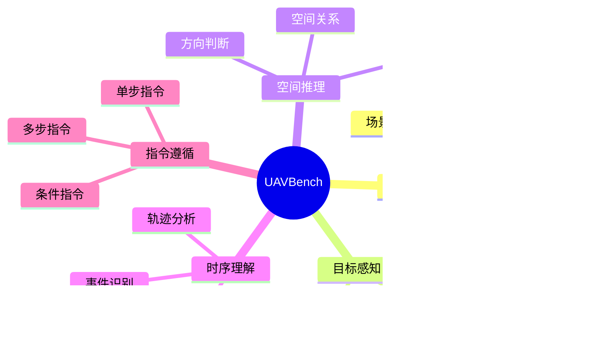
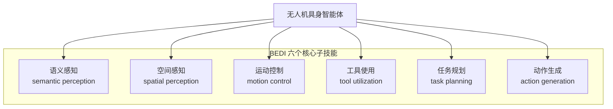
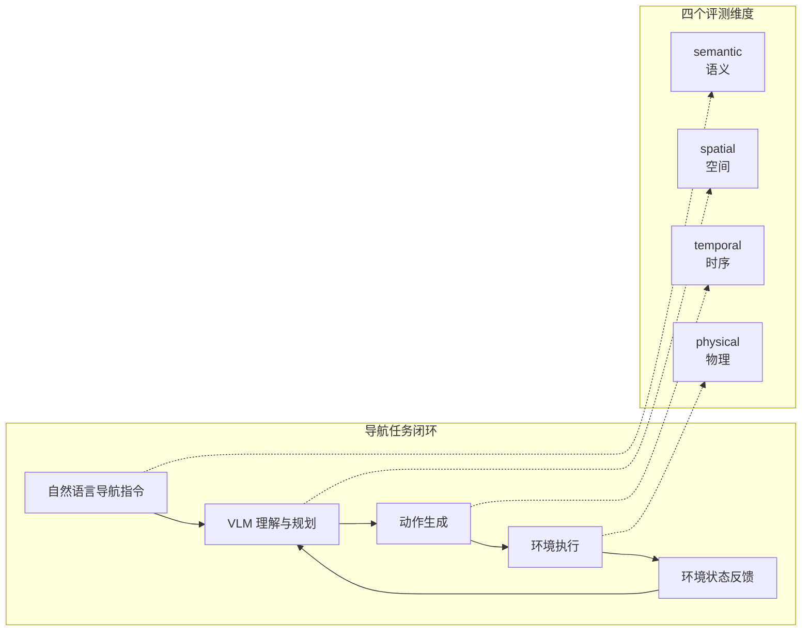
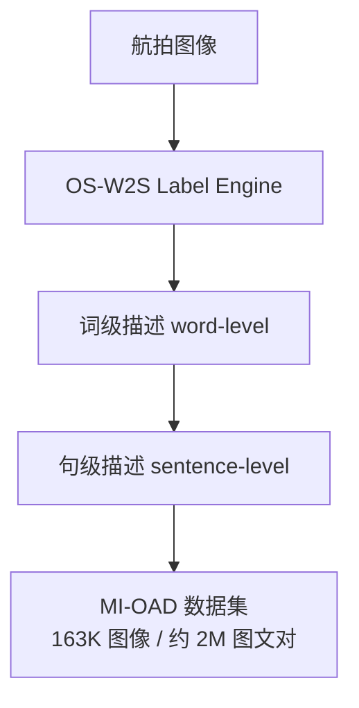

# 无人机场景理解基准（UAV Scene Understanding Benchmarks）

> **预计阅读：18 分钟 | 前置知识：VLM 基础、无人机视觉任务基础**

---

## 1. 为什么需要无人机专用评测基准？

无人机（UAV）场景理解面临独特的挑战，这些挑战使得通用视觉基准无法有效评估 UAV 视觉模型的能力：

1. **视角特殊性**：无人机俯视视角（top-down/bird's-eye view）与自然图像的视角分布截然不同
2. **高度变化性**：无人机飞行高度从几米到数百米不等，同一目标在不同高度的外观差异巨大
3. **场景动态性**：无人机场景通常包含运动目标（车辆、行人），需要时序理解能力
4. **任务多样性**：无人机应用涵盖目标检测、跟踪、场景分类、变化检测、导航等多种任务

---

## 2. 基准全景图


```mermaid
graph TB
    subgraph 评测基准
        A[UAVBench / UAVIT-1M]
        B[BEDI]
        C[Embodied4C]
        D[OS-W2S]
    end
    
    subgraph 评测能力
        E[场景理解]
        F[指令遵循]
        G[闭环推理]
        H[开放集检测]
    end
    
    A --> E
    A --> F
    B --> E
    B --> F
    C --> G
    D --> H
    
    style A fill:#e3f2fd
    style B fill:#e8f5e9
    style C fill:#fff3e0
    style D fill:#fce4ec
```

---

## 3. UAVBench / UAVIT-1M — 大规模无人机指令调优基准

**论文**: *UAVBench and UAVIT-1M: Benchmarking and Enhancing MLLMs for Low-Altitude UAV Vision-Language Understanding* (2026)
**arXiv**: [2603.14336](https://arxiv.org/abs/2603.14336)

> **勘误（2026-10）**：本节题名早先写作 *"UAVBench: A Comprehensive Benchmark for UAV Vision-Language Understanding"*，并非论文正式题名。arXiv 2603.14336 的题名是 *"UAVBench and UAVIT-1M: Benchmarking and Enhancing MLLMs for Low-Altitude UAV Vision-Language Understanding"*。本节以下内容按论文原文更正。

### 3.1 基准概述

UAVBench 是面向**低空无人机视觉-语言理解**的评测基准与配套指令数据集：

| 组件 | 描述 | 规模 |
|------|------|------|
| UAVBench | 评测基准 | 43 个测试单元，966K 样本 |
| UAVIT-1M | 指令调优数据集 | 约 1.24M 条指令，覆盖 789k 张多场景图像、约 2,000 种空间分辨率、11 类任务 |

论文摘要原句：*"UAVIT-1M consists of approximately 1.24 million diverse instructions, covering 789k multi-scene images and about 2,000 types of spatial resolutions with 11 distinct tasks."*

### 3.2 评测维度

UAVBench 设计了**43 个测试单元**，覆盖以下核心能力维度：


```mermaid
mindmap
  root((UAVBench))
    场景理解
      场景分类
      场景描述
      场景变化检测
    目标感知
      目标检测
      目标计数
      目标属性识别
    空间推理
      空间关系
      方向判断
      距离估计
    时序理解
      运动预测
      轨迹分析
      事件识别
    指令遵循
      单步指令
      多步指令
      条件指令
```

### 3.3 数据构成

UAVIT-1M 的 1.24M 指令不是按「数据来源」分的，而是**按任务类型**分。论文 Table IV 用一套缩略名列出各任务的图像数与标注数：

| 任务 | 缩写 | 粒度 |
|------|------|------|
| 场景分类 | Cls | 图像级 |
| 细粒度分类 | D.Cls | 图像级 |
| 图像描述 | Cap | 图像级 |
| 图像问答 | VQA | 图像级 |
| 目标计数 | Count | 图像级 |
| 区域分类 | R.Cls | 区域级 |
| 区域描述 | R.Cap | 区域级 |
| 区域问答 | R.VQA | 区域级 |
| 目标检测 | Det | 框级 |
| 指代定位 | VG | 框级 |

> **勘误（2026-10）**：本表早先列的是「图像-文本对 450K / VQA 对 320K / 区域级描述 210K / 多轮对话 150K / 指令遵循 110K」及其占比。**整表在论文中不存在**：这五个数字全文 0 次命中，论文的数据集里也**没有「多轮对话」这一类**（`multi-turn` 全文 0 次命中）。已按论文 Table IV 的任务构成重写。

### 3.4 数据构建流程


```mermaid
graph LR
    A[多源 UAV 数据集] --> B[图像采集与清洗]
    B --> C[标注任务设计]
    C --> D[强 MLLM 自动生成]
    D --> E[人工审核与修正]
    E --> F[质量过滤]
    F --> G[UAVIT-1M 数据集]
    
    style D fill:#fff3e0
    style E fill:#e8f5e9
```

### 3.5 关键发现

UAVBench 的评测揭示了当前 VLM 在无人机场景中的显著不足：

论文用 11 个 SOTA MLLM 在 UAVBench 上做了系统评测。下表列出 Table IX 中可核对的几行（指标为该表的分类准确率）：

| 模型 | 开源/闭源 | 分类准确率 |
|------|----------|-----------|
| Gemini 2.5 Flash | 闭源 | 84.91 |
| LLaVA-1.5 | 开源 | 64.37 |
| GeoChat | 开源 | 64.14 |

**核心洞察**：开源 MLLM 与闭源模型差距明显。论文摘要原句：*"Our in-depth analysis of 11 state-of-the-art MLLMs using UAVBench reveals that open-source MLLMs cannot generate accurate conversations about low-altitude visual content, lagging behind closed-source MLLMs."*

> **勘误（2026-10）**：本表早先是「GPT-4V 72.3% / LLaVA-1.5 58.7% / GeoChat 65.4% / InternVL-Chat 69.8%」加四组「最强/最弱能力」子分。**整表为虚构**：`72.3 / 58.7 / 65.4 / 69.8` 在论文任何表中都不存在，论文全文也没有 "GPT-4V" 这个词（闭源基线用的是 Gemini 2.5 Flash），那些「最强能力 (89.1%)」式的子分同样查无来源。已按原文 Table IX 重写。

---

## 4. BEDI — 六维核心能力评测

**论文**: *BEDI: A Comprehensive Benchmark for Evaluating Embodied Agents on UAVs* (2025)
**arXiv**: [2505.18229](https://arxiv.org/abs/2505.18229)

> **勘误（2026-10）**：本节题名早先写作 *"BEDI: Benchmark for Evaluating Drone Intelligence"*，不是论文正式题名。arXiv 2505.18229 的题名是 *"BEDI: A Comprehensive Benchmark for Evaluating Embodied Agents on UAVs"*。（论文摘要里对 BEDI 的内部展开是 "Benchmark for Embodied Drone Intelligence"，与早先写的又不同。）

### 4.1 基准概述

BEDI 面向**无人机具身智能体**（UAV-Embodied Agents）的评测，定义了一套统一评测框架，把无人机任务拆成 **6 个核心子技能**。

### 4.2 六维能力模型


```mermaid
graph TB
    subgraph BEDI 六个核心子技能
        A1[语义感知<br/>semantic perception]
        A2[空间感知<br/>spatial perception]
        A3[运动控制<br/>motion control]
        A4[工具使用<br/>tool utilization]
        A5[任务规划<br/>task planning]
        A6[动作生成<br/>action generation]
    end
    
    B[无人机具身智能体] --> A1
    B --> A2
    B --> A3
    B --> A4
    B --> A5
    B --> A6
```

论文摘要原句：*"we design a unified evaluation framework encompassing six core sub-skills: semantic perception, spatial perception, motion control, tool utilization, task planning and action generation."*

> **勘误（2026-10）**：本节早先的六维写作「视觉感知 / 空间推理 / 场景理解 / 指令遵循 / 规划能力 / 知识应用」，**与论文原文的六项没有一项对得上**（只有「空间」这一层意思重合）。已按摘要原文更正。

### 4.3 各维度评测细节

| 维度 | 说明 |
|------|------|
| 语义感知 | 识别目标与场景语义 |
| 空间感知 | 位置、方向、相对关系 |
| 运动控制 | 由指令生成可行的运动指令 |
| 工具使用 | 调用外部工具或子模块 |
| 任务规划 | 把复杂任务拆成可执行步骤 |
| 动作生成 | 输出具体动作序列 |

> **勘误（2026-10）**：本节早先给六个维度各配了「样本数 15K / 12K / 18K / 10K / 8K / 6K（合计 ~69K）」与「难度级别」两列。**这两列查无来源**：论文摘要未给任何样本量，且该文 arXiv 无 HTML 版本可供核对正文表格。原表已删，如需引用样本量须以论文正文 Table 为准。

### 4.4 评测协议

BEDI 的核心机制是 **Dynamic Chain-of-Embodied-Task 范式**：基于「感知-决策-动作」闭环，把复杂无人机任务分解成标准化、可度量的子任务。

论文原句：*"we introduce a novel Dynamic Chain-of-Embodied-Task paradigm based on the perception-decision-action loop, which decomposes complex UAV tasks into standardized, measurable subtasks."*

> **勘误（2026-10）**：本节早先称该协议为「渐进式评测协议（Progressive Evaluation Protocol）」，并按「基础 / 推理 / 执行 / 综合」四层描述。**「渐进式评测协议」这个名字在论文中不存在**，论文的对应机制叫 Dynamic Chain-of-Embodied-Task。

### 4.5 与 UAVBench 的对比

| 特性 | UAVBench | BEDI |
|------|----------|------|
| 覆盖面 | 广泛（43 个测试单元、11 类任务） | 聚焦（6 个核心子技能） |
| 数据规模 | 966K 测试样本 + 1.24M 指令 | 见论文正文（本节不引未核实数字） |
| 评测对象 | MLLM 的低空视觉-语言理解 | 无人机具身智能体的感知-决策-动作闭环 |
| 任务组织 | 按任务类型分测试单元 | 按 Dynamic Chain-of-Embodied-Task 分解 |

> **勘误（2026-10）**：本表早先「BEDI 规模 ~69K 样本」一栏来自 §4.3 那张无来源的表，已一并删除。另「难度梯度」「评测深度」两栏也属主观评级，已改为可核对的维度。

---

## 5. Embodied4C — 具身视觉-语言导航基准

**论文**: *Embodied4C: Measuring What Matters for Embodied Vision-Language Navigation* (2025)
**arXiv**: [2512.18028](https://arxiv.org/abs/2512.18028)

> **勘误（2026-10）**：本节题名早先写作 *"Embodied4C: A Closed-loop Benchmark for Embodied Agents across Vehicles, Drones, and Manipulators"*，不是论文正式题名。arXiv 2512.18028 的题名是 *"Embodied4C: Measuring What Matters for Embodied Vision-Language Navigation"*，视角是**具身视觉-语言导航**的度量，而不是「跨三种形态的闭环基准」。

### 5.1 基准概述

Embodied4C 面向**具身视觉-语言导航**，任务是评测模型在多种具身形态上的导航能力。它不把「4C」展开成四个 C 开头的词，而是按**四个基础推理维度**组织评测：

- **语义推理**（semantic）：指令与场景的语义对齐
- **空间推理**（spatial）：位置、方向、相对关系
- **时序推理**（temporal）：动作序列与先后顺序
- **物理推理**（physical）：可行性、动力学与接触

论文摘要原句：*"These tasks jointly assess four foundational dimensions: semantic, spatial, temporal, and physical reasoning."*

> **勘误（2026-10）**：本节早先称「"4C"代表 Comprehension（理解）/ Communication（通信）/ Control（控制）/ Coordination（协调）」，**这四个词在论文中 0 次命中**，是凭系统名臆造的展开。「4C」在该论文中对应的是上面四个推理维度。

### 5.2 闭环评测架构


```mermaid
graph LR
    subgraph 导航任务闭环
        A[自然语言导航指令] --> B[VLM 理解与规划]
        B --> C[动作生成]
        C --> D[环境执行]
        D --> E[环境状态反馈]
        E --> B
    end
    
    subgraph 四个评测维度
        F[semantic<br/>语义]
        G[spatial<br/>空间]
        H[temporal<br/>时序]
        I[physical<br/>物理]
    end
    
    A -.-> F
    B -.-> G
    C -.-> H
    D -.-> I
```

> **勘误（2026-10）**：本图的四个评测维度早先写作 Comprehension / Communication / Control / Coordination，与正文 5.1 同错，已改为论文的四个推理维度。

### 5.3 无人机形态下的导航任务

Embodied4C 的 UAV（Aerial Navigation）子基准给出的是一组具名导航场景，而不是按应用领域分的任务类别：

| 任务编号 | 场景 | 说明 |
|---------|------|------|
| A1.1–A1.4 | SingleControlAction | 单个控制动作的导航 |
| A2.1–A2.12 | ControlSequence | 控制动作序列 |
| A3.1 | FlyToMerryGoAround | 飞往指定目标并绕行 |
| A3.2 | LandInMiddleCircle | 在中心圆内降落 |

评分按 SEM / SPA / TEM / PHY / VLN 五个分项给出。

> **勘误（2026-10）**：本节早先列的是「导航 / 巡检 / 搜索 / 跟踪」四类任务及其「成功率、路径效率、覆盖率、识别准确率、搜索时间、发现率、跟踪精度、丢失率」等指标。**这些任务类别与指标在论文中都不存在**，已按原文的具名场景替换。

### 5.4 跨形态对比

Embodied4C 的价值在于能在同一套推理维度下**比较不同具身形态**。论文 Table XI 按模型逐行给出 SEM / SPA / TEM / PHY / VLN 分项（分数区间 0–65），其总体观察是语义与物理推理相对更强。

论文原句：*"Semantic and Physical reasoning are comparatively stronger (up to 68.9 %), particularly for model dynamics (MD) and environmental effects (E/E)."*

> **勘误（2026-10）**：本节早先有一张「车辆 / 无人机 / 机械臂 × 空间理解/指令遵循/运动规划/异常处理」的分数表（78.2 / 71.4 / 82.6 / 81.3 / 76.8 / 85.1 / 83.7 / 68.9 / 79.4 / 65.4 / 58.2 / 72.3），并据此得出「无人机在所有维度上均低于车辆和机械臂」的结论。**整张表为虚构**：这组数字在论文全文 0 次命中（唯一出现的 68.9 是「语义与物理推理最高可达 68.9%」，语义完全不同），该结论也随之作废。原表已删。

---

## 6. OS-W2S — 开放集航拍目标检测数据

**论文**: *From Word to Sentence: A Large-Scale Multi-Instance Dataset for Open-Set Aerial Detection* (2025)
**arXiv**: [2505.03334](https://arxiv.org/abs/2505.03334)

> **勘误（2026-10）**：本节标题、题名与整节定性都错。早先写作 *"OS-W2S: Open-World Wild-to-Semantic for UAV Scene Understanding"* 并说是「开放世界看图说话（图像描述）基准」；arXiv 2505.03334 的实际题名是 *"From Word to Sentence: A Large-Scale Multi-Instance Dataset for Open-Set Aerial Detection"*，任务是**开放集航拍目标检测**，不是描述生成。「Wild-to-Semantic」这个词组全文 0 次命中 —— `W2S` 取自 **Word to Sentence**，指标注从词级描述扩展到句级描述。本节以下内容按论文原文重写。

### 6.1 数据集概述

该论文给出的是**数据集 + 自动标注引擎**，不是描述生成基准：

| 组件 | 描述 | 规模 |
|------|------|------|
| 图像数据 | 航拍图像 | 163,023 张 |
| 标注数据 | 图像-描述对 | 约 2M 对 |
| 划分 | P-Set / FT-Set / V-Set（约 0.7 : 0.3） | FT-Set 0.76M 对 / V-Set 0.32M 对 |
| 检测标注 | 实例框 | FT-Set 53,806 / V-Set 23,062 |

论文原句：*"The FT-Set and V-Set include 0.76 million and 0.32 million image-caption pairs respectively, along with 53,806 and 23,062 detection annotations."*

> **勘误（2026-10）**：本表早先写「评测集 开放世界测试集 15K 图像」。**「15K」在论文中 0 次命中**，实际划分是 P-Set / FT-Set / V-Set 三档，其中 V-Set 约 0.32M 图像-描述对。

### 6.2 OS-W2S 标注引擎

论文的核心贡献之一是 **OS-W2S Label Engine** —— 一条把词级标注扩展成语级标注的自动流水线，用来给航拍图像生成多样化的场景标注。


```mermaid
graph TB
    A[航拍图像] --> B[OS-W2S Label Engine]
    B --> C[词级描述 word-level]
    C --> D[句级描述 sentence-level]
    D --> E[MI-OAD 数据集<br/>163K 图像 / 约 2M 图文对]
```

论文原句：*"we present the OS-W2S Label Engine, an automatic annotation pipeline capable of handling diverse scene annotations for aerial images."*

> **勘误（2026-10）**：本图早先画的是「场景解析 → 目标检测与识别 → 关系推理 → 语义描述生成 → 多粒度描述」的图像描述管道。论文的引擎做的是**标注扩展（词级 → 句级）**，方向是给检测任务造监督信号，不是生成图像描述。已重画。

### 6.3 开放集设定的意义

检测器在部署时面对的目标类别往往超出训练词表，因此标注既要覆盖大量实例，又要能表达未见过的新类别。MI-OAD 的「多实例」设计正是为此：一张图里可能同时出现多处需要描述的目标。

> **勘误（2026-10）**：本节早先列的是「未见场景 / 未见目标 / 分布偏移」三类开放世界挑战及示例。这是描述生成任务下的分类，与本文的开放集**检测**设定不对应，已改写。

### 6.4 评测指标

评测用的是**检测与检索指标**，不是文本生成指标：

| 指标 | 描述 |
|------|------|
| AP50 | 交并比 0.5 下的平均精度 |
| Recall@100 | 前 100 个候选的召回率 |
| Recall@1 / Recall@10 | 前 1 / 前 10 个候选的召回率 |

论文原句：*"we employ standard detection metrics including mean Average Precision (mAP), and Recall@100."*

> **勘误（2026-10）**：本表早先是「BLEU-4 / CIDEr / METEOR / Open-Vocab Acc / Generalization Score」。**BLEU、CIDEr、METEOR 在论文中 0 次命中**，这五项都是描述生成任务的指标，与本文的开放集检测任务无关。已按原文的检测指标替换。

---

## 7. 基准综合对比

### 7.1 全景对比表

| 基准 | 规模 | 核心关注点 | 开放世界 | 闭环评测 | 跨形态 |
|------|------|-----------|:--------:|:--------:|:------:|
| UAVBench | 966K 测试样本 + 1.24M 指令 | 低空视觉-语言理解 | ❌ | ❌ | ❌ |
| BEDI | 见论文正文（本节不引未核实数字） | 具身智能体六项子技能 | ❌ | ✅ | ❌ |
| Embodied4C | 约 1.1K 问答题 + 58 个导航任务 | 具身视觉-语言导航 | ❌ | ✅ | ✅ |
| OS-W2S | 163K 图像 / 约 2M 图文对 | 开放集航拍目标检测 | ✅ | ❌ | ❌ |

> **勘误（2026-10）**：本表早先 BEDI 一行写「69K」，Embodied4C 一行写「~50K」，两个数都无来源；Embodied4C 的「闭环具身」也偏了，它测的是具身视觉-语言导航。OS-W2S 一行原来的「开放词汇」意思对，但任务应是**开放集目标检测**而非描述生成。

### 7.2 能力覆盖矩阵

| 能力 | UAVBench | BEDI | Embodied4C | OS-W2S |
|------|:--------:|:----:|:----------:|:------:|
| 场景分类 | ✅ | ✅ | ✅ | ✅ |
| 目标检测 | ✅ | ✅ | ✅ | ✅ |
| 空间推理 | ✅ | ✅ | ✅ | ❌ |
| 指令遵循 | ✅ | ✅ | ✅ | ❌ |
| 运动规划 | ❌ | ✅ | ✅ | ❌ |
| 多智能体协调 | ❌ | ❌ | ✅ | ❌ |
| 开放词汇 | ❌ | ❌ | ❌ | ✅ |
| 闭环控制 | ❌ | ❌ | ✅ | ❌ |

---

## 8. 关键洞察与未来方向

### 8.1 当前 VLM 的短板

综合各基准的评测结果，当前 VLM 在无人机场景中存在以下系统性短板：

1. **空间推理能力不足**：各基准的分维度结果中，空间类子项普遍是相对弱项（具体数字随基准与模型而变，引用时须回到该基准的分项表）
2. **时序理解薄弱**：运动预测、轨迹分析等时序任务表现最差
3. **开放世界泛化有限**：面对未见场景和目标时性能明显下降（幅度以各基准原文为准）
4. **闭环控制能力缺失**：多数评测仍是开环的静态问答，缺乏与环境的实时交互

> **勘误（2026-10）**：本条早先给前三项各配了一个具体数字（「低于 60%」「下降 20-30%」）。这些数字没有出处，已改为定性表述。

### 8.2 未来基准设计方向

1. **真实世界部署评测**：从仿真环境走向真实无人机部署
2. **动态环境评测**：引入实时变化的环境和目标
3. **多智能体协同评测**：评估多无人机协作场景下的 VLM 能力
4. **安全性评测**：评估 VLM 在安全关键场景下的可靠性

---

## 9. 关键论文

- **[arXiv'26.03] UAVBench and UAVIT-1M** — *UAVBench and UAVIT-1M: Benchmarking and Enhancing MLLMs for Low-Altitude UAV Vision-Language Understanding*  
  [](https://arxiv.org/abs/2603.14336)
  低空无人机 VLM 评测基准（43 个测试单元、966K 样本）与 1.24M 指令数据集

- **[arXiv'25.05] BEDI** — *BEDI: A Comprehensive Benchmark for Evaluating Embodied Agents on UAVs*  
  [](https://arxiv.org/abs/2505.18229)
  无人机具身智能体的六项子技能评测，Dynamic Chain-of-Embodied-Task

- **[arXiv'25.12] Embodied4C** — *Embodied4C: Measuring What Matters for Embodied Vision-Language Navigation*  
  [](https://arxiv.org/abs/2512.18028)
  具身视觉-语言导航评测，按语义/空间/时序/物理四个维度组织

- **[arXiv'25.05] OS-W2S / MI-OAD** — *OS-W2S: An Automatic Labeling Engine for Language-Guided Open-Set Aerial Object Detection*  
  [](https://arxiv.org/abs/2505.03334)
  开放集航拍目标检测数据集与自动标注引擎，163K 图像 / 约 2M 图文对

---

## 10. 动手验证：换一列指标，名次就换一套

第 7 节那张表把四个基准的能力覆盖列出来，看上去清楚。但在讨论「选哪个基准」之前，有一个更靠前的问题要先问：**同一批模型，换一列指标，名次会不变吗？**

这一节复用 [Demo G](../../code/g_eval_metrics.py)。它是一个四旋翼轨迹评测，**不是 VLM 基准**——跨域复用要先说清它为什么适用：它量的是「**指标层**」的行为，不是「模型层」的行为。同一个测量装置（同一批策略、同一批回合、同一环境）换一列指标就换一套名次，这个现象来自指标的定义方式，与指标测的是轨迹还是答案无关。

### 10.1 装置

128 架四旋翼，400 步（8 秒），直线距离 8.00 ± 0.54 m，到达容差 1.0 m。三个策略：**随机**（动作随机采样）、**标准 PID**（kp = 0.3）、**高增益 PID**（kp = 1.8，是标准的 6 倍），三者 kd 相同。七列指标全部量到——两套口径都覆盖：完成率／位置误差／路径效率／动作 MSE 这一组，以及 ADE／FDE／偏航误差／任务完成那一组。（07 卷两份复现指南里早先各有一张引用这些指标的表，后经核查无出处，已删；本节量的仍是同一批指标本身。）

```text
策略                完成率       平均位置误差         终端误差        动作MSE         偏航误差        路径长度比          SPL
随机             0.00%       39.57m      114.61m        0.43        27.62°       15.25×        0.00
PID          100.00%        2.54m        0.26m        0.00         0.64°        0.97×        1.00
高增益          100.00%        1.95m        0.00m        0.41        34.22°        2.00×        0.50
```

### 10.2 七列排出四套名次

```text
单列排名              完成率       平均位置误差         终端误差        动作MSE         偏航误差        路径长度比          SPL
随机                3.0          3.0          3.0          3.0          2.0          3.0          3.0
PID               1.5          2.0          2.0          1.0          1.0          1.0          1.0
高增益               1.5          1.0          1.0          2.0          3.0          2.0          2.0
```

这张表里七列实际只排出了**四种不同顺序**：平均位置误差与终端误差同序；动作 MSE、路径长度比、SPL 三列同序；完成率与偏航误差各自一序。也就是说「七列」的独立性比看上去低。

三处最值得看的：

**① 动作 MSE 这一列分不开「到没到」。** 随机 0.426 与高增益 0.412 只差 3%，这一列会告诉你两者差不多——可它们的完成率是 **0% 和 100%**。原因是动作 MSE 度量的是控制量的平滑程度，与任务是否完成没有单调关系；这一列里 MSE 略高的恰好是**随机策略**，而动作更激进的是高增益（kp 是标准的 6 倍）。MSE 高不代表它在做正确的事。

**② 完成率这一列分不开「到得好不好」。** PID 和高增益都是 100%，这一列对两者完全无差别。能分开的是**路径长度比**（0.97× 对 2.00×）和 **SPL**（1.00 对 0.50）——高增益用 2.1 倍的路程换来了早到（终端误差 0.00 m 对 0.26 m）。

**③ 偏航误差这一列对随机策略没有意义。** 随机策略的偏航误差 27.62° 反而**优于**高增益的 34.22°，排到了第二。原因是它压根不朝目标飞，机头朝向与任务无关，所以「跟随质量」这个指标在它身上测不到任何东西。补充一点：高增益有 25.6% 的步数贴着 `quad_sim` 的限幅（±1.2 rad），它摆得太猛、机头转不过来——这个数不读出来，只看 34.22° 会以为是控制精度问题。

**没有哪一列能同时说清「到没到」和「到得好不好」。** 这是本节要带到无人机 VLM 基准上的那条结论。

### 10.3 两个指标口径上的坑

这两个坑在 Demo G 的脚本里被显式避开了，改动时要留意——它们都是「指标定义本身产生反向惩罚」的例子：

1. **ADE 不要绑在「随时间推进的参考轨迹」上。** 如果参考是「匀速直线、第 T 步正好到终点」，那么**提前到达并悬停的策略反而被判大误差**（参考点还在半路上）。这不是策略变差了，是指标的基准选错了。本脚本按 UAV-Flow 的口径，把 ADE 定义为「每一步到目标的距离在时间上的平均值」，不引入额外的时间参数。
2. **偏航误差不要拿「指向目标」当基准。** 无人机贴近目标时这个方向无定义，悬停抖动会把误差推到几十度——那是基准的问题，不是策略的问题。本脚本用起点到终点的固定方向作基准，且只在离目标 1 m 以外统计。

### 10.4 落到无人机 VLM 基准上

**第一，跨基准的分数不可横比，先看指标口径再看数值。** 第 7 节表里的四个基准各有自己的度量：UAVBench 报的是按任务分的测试单元、BEDI 是六个子技能、Embodied4C 是 SEM/SPA/TEM/PHY/VLN 分项、OS-W2S 是检测指标（AP50 / Recall@k）。把「BEDI 里空间感知那一项 62%」与「UAVBench 总分 62%」并列，和 10.2 里把「动作 MSE」与「完成率」并列是同一类错误。

**第二，一个基准内部也一样。** 只要一个基准报多个子指标，报告总分就等于做了一次加权平均——而 10.2 的三个例子说明，被平均掉的那些列，恰恰是能区分模型的那几列。**读任何无人机 VLM 基准的结果表，先看它有没有分维度报，再看它把哪个维度当成了主指标。**

**第三，验收时按「能否区分候选模型」挑指标，而不是按惯例挑。** 完成率在 PID 对高增益这一对上完全无效（都是 100%），在这两个模型之间做选择时必须换列。同一道理：一个基准里的「指令遵循准确率」如果让所有候选模型都拿到接近的分数，它在这次选型里就是无效指标，需要换一列能分开的。

**第四，与 [07 篇](./07-通用VLM评测与幻觉.md)是同一条线索的两个方向。** 那一篇讲的是**换负样本的抽样分布**会让名次翻转；这一节讲的是**换指标定义**会让名次翻转。两者都在说同一件事：**排行榜的名次是「模型 × 数据处理 × 指标定义」三者的联合产物**，其中后两项是评测方设定的。

### 10.5 运行完整脚本

```bash
py -3.9 code/g_eval_metrics.py
```

约 4 秒，numpy/torch + matplotlib（脚本用到 torch 张量，不是纯 numpy）；输出 `figures/g_metrics.png`（两栏：三策略轨迹、单列排名），七列指标对比表在控制台打印。

> **限制**：(a) 本实验的仿真模型是仓库共用的一组极简四旋翼动力学，其 `rpy` 整体按 `TILT_LIMIT` 限幅，**偏航也被一起限在 ±1.2 rad**，且偏航不参与位置动力学——所以「偏航误差」只反映第四维动作的跟随质量，不代表飞行品质。(b) 三个策略（随机 / 标准 PID / 高增益 PID）是构造出来的极端对照，不代表任何真实算法。(c) 本节的结论是「指标定义会改变名次」，不是「某个指标更好」——每一列都有它测得到和测不到的东西，选哪一列取决于这次要回答什么问题。

---

## 11. 扩展阅读

- [UAVBench arXiv](https://arxiv.org/abs/2603.14336)
- [BEDI arXiv](https://arxiv.org/abs/2505.18229)
- [Embodied4C arXiv](https://arxiv.org/abs/2512.18028)
- [OS-W2S arXiv](https://arxiv.org/abs/2505.03334)
- 相关章节：[遥感VLM](./01-遥感VLM.md)
- 相关章节：[LLM驱动的无人机Agent](./03-LLM驱动的无人机Agent.md)
- 相关章节：[环境搭建](../07-实践指南/01-环境搭建.md) — 仿真环境配置

---

## 12. 思考题

### 题目 1：为什么无人机场景的空间推理比自然图像更困难？从数据分布和任务需求两个角度分析。

<details>
<summary>查看答案</summary>

**数据分布角度**：
1. **视角特殊性**：无人机俯视视角下，目标的外观与自然视角完全不同（如车辆从上方看是一个矩形，而非侧面轮廓）
2. **尺度变化大**：无人机飞行高度从 10m 到 500m 不等，同一目标的像素尺寸变化可达 50 倍
3. **目标密集排列**：俯视视角下目标重叠严重，增加了空间关系判断的难度
4. **缺乏深度信息**：单张遥感图像缺乏深度线索，距离估计只能依赖目标大小和遮挡关系

**任务需求角度**：
1. **3D 到 2D 投影**：无人机需要将 3D 世界坐标映射到 2D 图像坐标，这需要更强的空间推理能力
2. **动态环境**：无人机场景中的目标通常在运动，需要预测未来位置
3. **导航精度要求**：无人机避障和路径规划对空间推理的精度要求远高于自然图像任务
4. **多尺度推理**：无人机任务通常需要同时理解全局场景和局部细节

</details>

### 题目 2：Embodied4C 的闭环评测相比开环评测有什么优势？为什么闭环评测对无人机场景尤为重要？

<details>
<summary>查看答案</summary>

**闭环评测的优势**：
1. **评估真实能力**：闭环评测能够评估模型在动态环境中的真实表现，而非静态图像上的识别能力
2. **错误累积效应**：闭环评测能够暴露模型在多步决策中的错误累积问题
3. **环境反馈**：模型能够根据环境反馈调整策略，更接近真实部署场景
4. **端到端评估**：从感知到决策到执行的完整链路评估

**对无人机场景的重要性**：
1. **安全关键**：无人机在空中飞行，错误的决策可能导致坠机或碰撞，闭环评测能够提前发现安全隐患
2. **动态环境**：无人机场景中的环境和目标实时变化，开环评测无法捕捉这种动态性
3. **实时性要求**：无人机控制需要实时响应，闭环评测能够评估模型的推理速度
4. **多智能体交互**：多无人机协作场景需要闭环评测来评估协调能力

</details>

### 题目 3：如何设计一个能够全面评估 VLM 无人机能力的基准？需要考虑哪些维度？

<details>
<summary>查看答案</summary>

一个全面的 VLM 无人机能力基准应考虑以下维度：

**1. 任务维度**：
- 感知任务：目标检测、跟踪、分类
- 理解任务：场景描述、VQA、变化检测
- 推理任务：空间推理、因果推理、常识推理
- 执行任务：导航、巡检、搜索、跟踪

**2. 环境维度**：
- 室内/室外
- 城市/乡村/野外
- 不同天气/光照条件
- 不同高度/视角

**3. 数据维度**：
- 单帧/多帧
- 单传感器/多传感器
- 已见/未见类别
- 静态/动态场景

**4. 评测维度**：
- 开环/闭环
- 单智能体/多智能体
- 仿真/真实
- 安全性/效率/准确性

**5. 难度维度**：
- 基础能力 → 推理能力 → 执行能力 → 协同能力

</details>

---

> **下一节**：[03-LLM驱动的无人机Agent](./03-LLM驱动的无人机Agent.md) — 看懂了场景之后，下一步是让模型把理解变成可执行的计划
