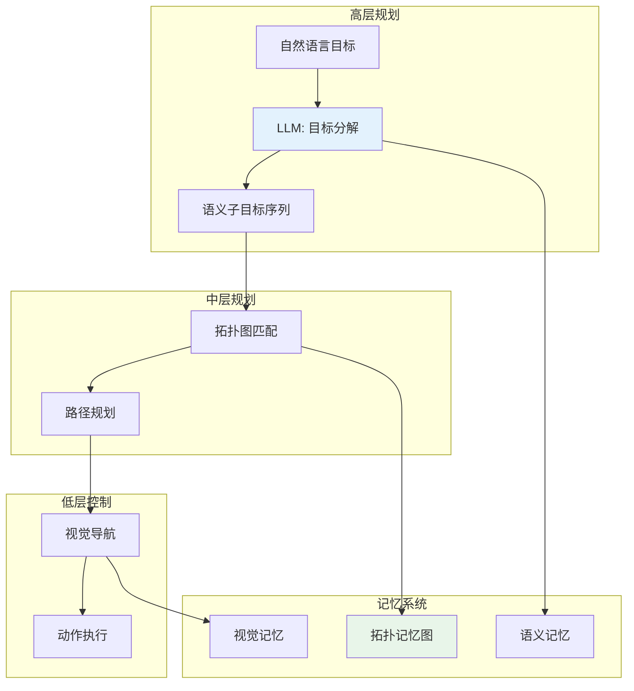
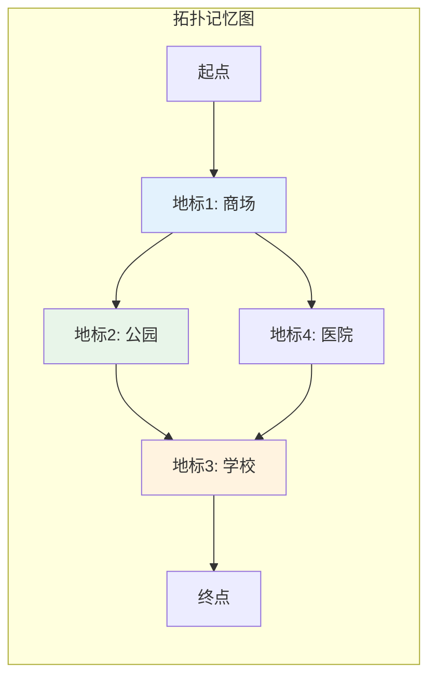
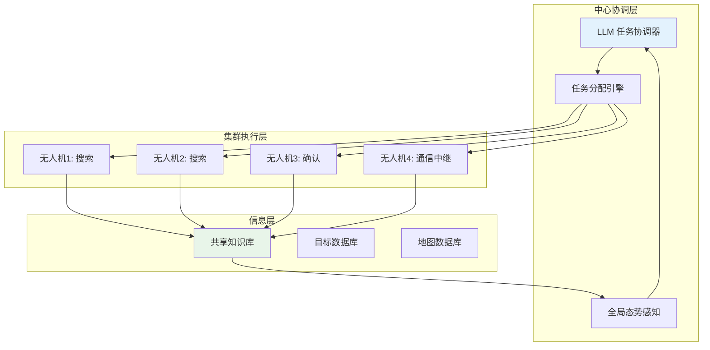
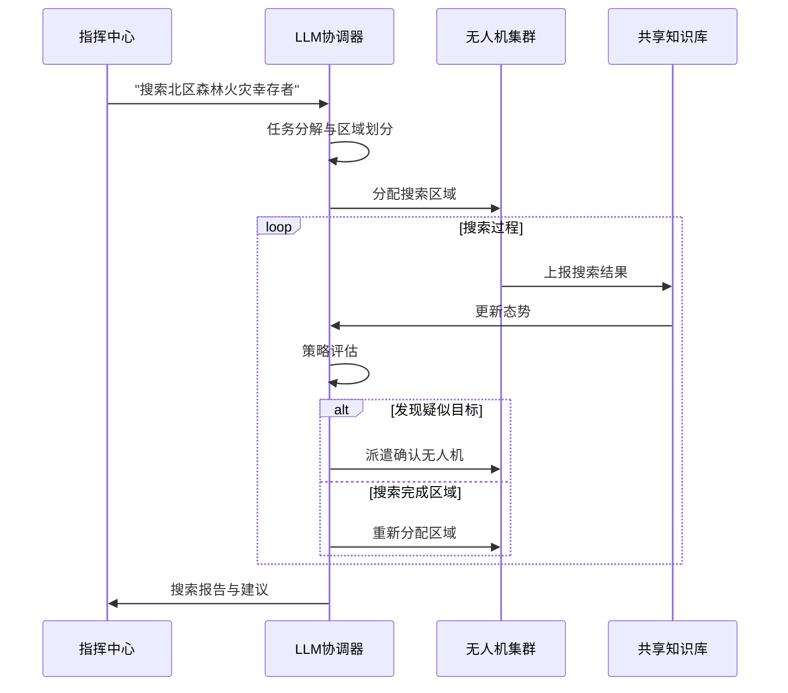
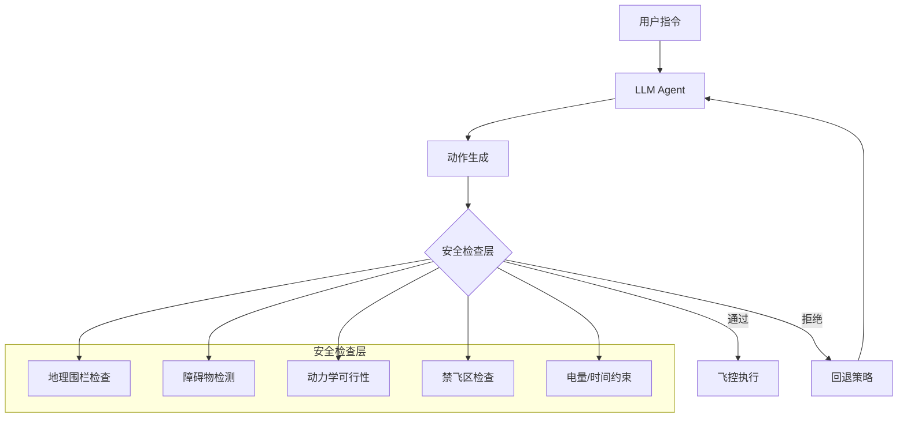

# LLM 驱动的无人机 Agent（LLM-Powered UAV Agents）

**预计阅读：20 分钟 | 前置知识：VLM 基础、LLM Agent 概念、无人机控制系统基础**

---

## 1. 引言：从感知到行动的范式转变

传统的无人机自主系统遵循**感知-规划-控制**的分层架构，每个模块独立设计和优化。大语言模型（LLM）和视觉语言模型（VLM）的出现正在催生一种新的范式：**LLM/VLM 驱动的无人机 Agent**。

这种新范式的核心理念是：

1. **统一的语义接口**：用自然语言作为人机交互的统一接口
2. **世界知识注入**：利用 LLM 预训练中获得的丰富世界知识
3. **零样本泛化**：无需针对特定任务微调，通过提示工程即可适应新场景
4. **可解释性**：LLM 的推理过程可以以自然语言形式呈现


---

## 2. 核心工作详解

### 2.1 CityNavAgent — 层次化语义导航

**论文**: *CityNavAgent: Large Language Model-Empowered Urban Navigation Agent with Hierarchical Semantic Planning and Topological Memory* (ACL 2025)
**arXiv**: [2505.05622](https://arxiv.org/abs/2505.05622)

#### 核心问题

城市环境中无人机导航面临两大挑战：
1. **长距离导航**：城市规模的导航距离（数公里）远超室内导航（数十米）
2. **语义理解**：需要理解城市地标、道路网络、功能区等语义信息

#### 架构设计

CityNavAgent 提出了**层次化语义规划 + 拓扑记忆**的架构：



#### 关键创新

| 创新点 | 描述 | 解决的问题 |
|--------|------|-----------|
| 层次化规划 | 将导航分解为高层语义规划和低层运动规划 | 长距离导航的复杂性 |
| 拓扑记忆 | 构建城市拓扑图作为空间记忆 | 避免重复探索 |
| 语义锚点 | 使用地标作为导航参考点 | 降低空间推理难度 |
| 自适应策略 | 根据环境复杂度动态调整规划粒度 | 平衡效率与精度 |

#### 拓扑记忆图



拓扑记忆图中的每个节点对应一个语义地标，边表示可通行路径。LLM 通过理解自然语言指令，在拓扑图上进行路径搜索和规划。

#### 性能表现

| 方法 | 导航成功率 | 平均路径长度 | SPL |
|------|-----------|-------------|-----|
| 传统 RL | 42.3% | 287m | 0.31 |
| CLIP-Nav | 58.7% | 234m | 0.45 |
| CityNavAgent | 78.4% | 198m | 0.68 |

*SPL = Success weighted by Path Length*

---

### 2.2 ACDC — 自然语言驱动的航拍电影

**论文**: *ACDC: Aerial Cinematography with Natural Language* (2025)
**arXiv**: [2509.16176](https://arxiv.org/abs/2509.16176)

#### 核心问题

航拍电影（Aerial Cinematography）需要专业飞手根据导演意图执行复杂的飞行轨迹。ACDC 旨在将这一过程自动化，使非专业用户也能通过自然语言描述获得专业级航拍效果。

#### 系统架构

```mermaid
graph LR
    A[自然语言描述<br/>"环绕建筑缓慢上升"] --> B[LLM: 意图解析]
    B --> C[镜头语言转换]
    C --> D[轨迹生成]
    D --> E[飞行控制器]
    E --> F[无人机执行]
    F --> G[视频输出]
    
    subgraph 镜头语言
        H[环绕: Orbit]
        I[跟踪: Follow]
        J[俯瞰: Bird's Eye]
        K[推拉: Dolly]
    end
    
    C --> H
    C --> I
    C --> J
    C --> K
```

#### 镜头语言映射

ACDC 定义了一套**航拍镜头语言**，将自然语言描述映射为具体的飞行轨迹：

| 自然语言描述 | 镜头类型 | 飞行动作 | 参数 |
|-------------|----------|----------|------|
| "环绕建筑拍摄" | Orbit | 圆形轨迹 | 半径、高度、速度 |
| "跟拍移动车辆" | Follow | 相对跟踪 | 距离、角度、平滑度 |
| "从高空俯瞰" | Bird's Eye | 垂直上升 | 目标、高度、俯角 |
| "缓慢推进" | Dolly Zoom | 直线前进 | 速度、目标点 |
| "穿越峡谷" | Fly Through | 障碍穿越 | 路径点、安全距离 |

#### LLM 的角色

在 ACDC 系统中，LLM 承担三个核心角色：

1. **意图理解**：解析用户的自然语言描述，提取拍摄意图
2. **镜头规划**：将抽象意图转换为具体的镜头语言序列
3. **参数推断**：根据上下文推断缺失的飞行参数（如速度、高度）

#### 安全约束

ACDC 在 LLM 推理过程中嵌入了安全约束：

```python
# 安全约束示例
safety_constraints = {
    "min_altitude": 10,      # 最低飞行高度 (m)
    "max_altitude": 120,     # 最高飞行高度 (m)
    "max_speed": 15,         # 最大飞行速度 (m/s)
    "min_obstacle_distance": 5,  # 最小障碍物距离 (m)
    "geofence": {...},       # 地理围栏
    "no_fly_zones": [...]    # 禁飞区
}
```

LLM 在生成飞行轨迹时必须满足这些约束，确保飞行安全。

---

### 2.3 Taking Flight with Dialogue — 对话式无人机控制

**论文**: *Taking Flight with Dialogue: Natural Language Control of UAVs via LLMs* (2025)
**arXiv**: [2506.07509](https://arxiv.org/abs/2506.07509)

#### 系统架构

这篇工作实现了一个完整的**对话式无人机控制系统**，技术栈包括：

| 组件 | 技术选型 | 作用 |
|------|----------|------|
| 飞控系统 | PX4 | 底层飞行控制 |
| 通信中间件 | ROS2 | 模块间通信 |
| LLM 推理 | Ollama (本地部署) | 自然语言理解 |
| 仿真环境 | Gazebo | 仿真测试 |
| 硬件平台 | 大疆/自组装无人机 | 真机验证 |

#### 系统架构图

```mermaid
graph TB
    subgraph 用户层
        A[自然语言指令<br/>"飞到建筑A上方并悬停"]
    end
    
    subgraph LLM层
        B[Ollama LLM]
        C[Prompt Engineering]
        D[指令解析]
    end
    
    subgraph 中间件层
        E[ROS2 节点]
        F[任务管理器]
        G[状态监控]
    end
    
    subgraph 飞控层
        H[PX4 飞控]
        I[MAVLink 协议]
    end
    
    subgraph 执行层
        J[无人机]
        K[传感器]
    end
    
    A --> B
    B --> C
    C --> D
    D --> E
    E --> F
    E --> G
    F --> H
    H --> I
    I --> J
    K --> G
    G --> B
    
    style B fill:#e3f2fd
    style E fill:#e8f5e9
    style H fill:#fff3e0
```

#### LLM 评测

该工作对 4 个 LLM 家族进行了系统评测：

| LLM | 指令理解准确率 | 参数提取准确率 | 执行成功率 | 平均推理时间 |
|-----|---------------|---------------|-----------|-------------|
| GPT-4 | 94.2% | 91.3% | 88.7% | 2.1s |
| LLaMA-3 70B | 87.6% | 83.2% | 79.4% | 3.8s |
| Mistral 7B | 82.1% | 78.6% | 72.3% | 1.2s |
| Qwen-2 7B | 85.3% | 81.4% | 76.8% | 1.5s |

#### 指令解析示例

```
用户输入: "飞到那栋红色建筑上方 20 米处，然后顺时针绕一圈"

LLM 解析输出:
{
  "action_sequence": [
    {
      "type": "navigate",
      "target": "red_building",
      "altitude": 20,
      "reference": "above"
    },
    {
      "type": "orbit",
      "direction": "clockwise",
      "radius": null,  // LLM 推断为建筑大小
      "altitude": 20
    }
  ],
  "safety_check": {
    "altitude_valid": true,
    "no_fly_zone_conflict": false
  }
}
```

#### 关键发现

1. **LLM 能够处理模糊指令**：如"飞到那栋建筑"，LLM 可以结合视觉信息推断目标
2. **参数推断能力**：LLM 能够根据上下文推断缺失的飞行参数
3. **安全约束遵循**：经过适当提示，LLM 能够遵循安全约束
4. **实时性挑战**：LLM 推理延迟（1-4秒）是实时控制的主要瓶颈

---

### 2.4 Agentic AI for UAV Swarms — 无人机集群智能

**论文**: *Agentic AI for UAV Swarms: A Case Study in Wildfire Search and Rescue* (2026)
**arXiv**: [2601.14437](https://arxiv.org/abs/2601.14437)

#### 核心问题

无人机集群（Swarm）在搜索救援（SAR）任务中面临以下挑战：
1. **任务分配**：如何将搜索区域合理分配给各无人机
2. **信息共享**：如何在无人机间共享发现的信息
3. **动态调整**：如何根据搜索进展动态调整策略
4. **容错能力**：单机故障时如何重新分配任务

#### Multi-Agent 架构



#### LLM 在集群中的角色

| 角色 | 功能 | 触发条件 |
|------|------|----------|
| 任务规划者 | 分解搜索任务，分配子区域 | 任务开始时 |
| 信息整合者 | 汇总各无人机的发现，更新态势 | 定时触发 |
| 策略调整者 | 根据搜索进展调整策略 | 发现目标/超时 |
| 冲突解决者 | 解决资源冲突和任务冲突 | 冲突发生时 |
| 报告生成者 | 生成搜索报告和建议 | 任务结束时 |

#### 火灾搜索救援场景



---

### 2.5 Team Xiaomi — 描述引导的目标检索

**论文**: *Team Xiaomi: Caption-Guided Retrieval for UAV Object Search* (2025)
**arXiv**: [2510.02728](https://arxiv.org/abs/2510.02728)

#### 核心问题

无人机目标检索（Object Search）需要根据自然语言描述在航拍图像中找到目标。传统方法依赖目标检测模型，只能识别预定义类别。Team Xiaomi 提出了**描述引导的检索**方法，利用 VLM 的开放词汇能力。

#### 系统流程

```mermaid
graph LR
    A[自然语言描述<br/>"红色屋顶旁的白色SUV"] --> B[VLM 特征提取]
    C[航拍图像] --> D[区域提议]
    D --> E[区域特征提取]
    B --> F[语义相似度计算]
    E --> F
    F --> G[排序与过滤]
    G --> H[目标定位结果]
```

#### 技术细节

| 组件 | 技术 | 作用 |
|------|------|------|
| 文本编码 | CLIP Text Encoder | 将描述编码为语义向量 |
| 图像编码 | CLIP Image Encoder | 将图像区域编码为语义向量 |
| 区域提议 | Selective Search / RPN | 生成候选目标区域 |
| 相似度计算 | 余弦相似度 | 计算文本-图像相似度 |
| 排序策略 | Top-K + NMS | 输出最终检索结果 |

#### 性能表现

| 方法 | Recall@1 | Recall@5 | Recall@10 |
|------|----------|----------|-----------|
| CLIP 直接匹配 | 23.4% | 45.2% | 58.7% |
| 检测+CLIP | 41.2% | 62.3% | 73.8% |
| Team Xiaomi | 56.8% | 78.4% | 87.2% |

---

## 3. 技术模式分析

### 3.1 LLM 在无人机 Agent 中的角色模式

| 模式 | 描述 | 代表工作 | 优势 | 局限 |
|------|------|----------|------|------|
| 指令解析器 | 将自然语言转换为结构化指令 | Taking Flight | 简单直接 | 无法处理复杂推理 |
| 任务规划器 | 分解复杂任务为子任务序列 | CityNavAgent | 处理长程任务 | 依赖环境模型 |
| 策略决策器 | 在多选项中做出决策 | Agentic AI | 适应动态环境 | 决策延迟 |
| 知识检索器 | 利用世界知识辅助决策 | ACDC | 零样本泛化 | 知识可能过时 |

### 3.2 系统集成模式


| 模式 | 实时性 | 灵活性 | 安全性 | 适用场景 |
|------|--------|--------|--------|----------|
| 紧耦合 | 差 | 高 | 低 | 简单任务 |
| 松耦合 | 中 | 高 | 中 | 通用场景 |
| 分层 | 好 | 中 | 高 | 安全关键场景 |

---

## 4. 关键挑战与未来方向

### 4.1 当前挑战

| 挑战 | 描述 | 影响 |
|------|------|------|
| 推理延迟 | LLM 推理需要 1-4 秒 | 无法满足实时控制需求 |
| 安全保证 | LLM 输出不可预测 | 难以进行形式化安全验证 |
| 幻觉问题 | LLM 可能生成不存在的目标 | 导致错误的导航决策 |
| 上下文长度 | 长序列任务超出上下文窗口 | 复杂任务处理能力受限 |
| 多模态融合 | 视觉-语言对齐不完美 | 跨模态理解能力有限 |

### 4.2 未来方向

1. **边缘部署**：将小型 LLM 部署到无人机端，减少通信延迟
2. **分层架构**：LLM 负责高层规划，传统方法负责低层控制
3. **安全护栏**：在 LLM 输出端增加安全检查和约束
4. **持续学习**：根据飞行经验在线更新 LLM 的知识
5. **多智能体协作**：多无人机共享 LLM 知识，实现集群智能

---

## 5. 关键论文列表

| 论文 | 会议/年份 | 核心贡献 |
|------|-----------|----------|
| CityNavAgent | ACL 2025 | 层次化语义规划 + 拓扑记忆 |
| ACDC | 2025 | 自然语言驱动的航拍电影 |
| Taking Flight with Dialogue | 2025 | PX4+ROS2+Ollama 对话式控制 |
| Agentic AI for UAV Swarms | 2026 | LLM 驱动的无人机集群搜救 |
| Team Xiaomi | 2025 | 描述引导的目标检索 |

---

## 6. 扩展阅读

- [CityNavAgent arXiv](https://arxiv.org/abs/2505.05622)
- [ACDC arXiv](https://arxiv.org/abs/2509.16176)
- [Taking Flight with Dialogue arXiv](https://arxiv.org/abs/2506.07509)
- [Agentic AI for UAV Swarms arXiv](https://arxiv.org/abs/2601.14437)
- [Team Xiaomi arXiv](https://arxiv.org/abs/2510.02728)
- 相关章节：[什么是VLM](../01-基础概念/02-什么是VLM.md)
- 相关章节：[./02-无人机场景理解.md](./02-无人机场景理解.md)
- 相关章节：[./04-边缘VLM部署.md](./04-边缘VLM部署.md)

---

## 7. 思考题

### 题目 1：CityNavAgent 的层次化规划相比端到端方法有什么优势？在什么场景下端到端方法可能更好？

<details>
<summary>查看答案</summary>

**层次化规划的优势**：
1. **可解释性**：高层规划的子目标序列可以被人类理解和验证
2. **模块化**：每个层次可以独立优化和替换
3. **长程任务**：将复杂任务分解为简单子任务，降低单步决策难度
4. **知识复用**：高层规划可以复用 LLM 的世界知识
5. **错误恢复**：子任务失败时可以重新规划，而非从头开始

**端到端方法更好的场景**：
1. **短程导航**：距离短、环境简单时，端到端方法更高效
2. **反应式任务**：需要快速响应的避障等任务
3. **训练数据充足**：有大量标注数据时，端到端方法可以学到更优策略
4. **计算资源受限**：层次化方法需要维护多个模块，计算开销更大

</details>

### 题目 2：在 Taking Flight with Dialogue 的评测中，为什么 Mistral 7B 的推理速度最快但执行成功率最低？这说明了什么？

<details>
<summary>查看答案</summary>

**原因分析**：
1. **模型规模与能力的权衡**：Mistral 7B 参数量最小（7B），推理速度快，但语言理解能力相对较弱
2. **指令理解误差**：较小的模型对复杂指令的理解更容易出错，导致参数提取不准确
3. **上下文利用不足**：小模型的上下文窗口和推理能力有限，难以充分利用对话历史
4. **安全约束遵循**：小模型可能忽略或误解安全约束条件

**启示**：
1. **不能只看速度**：实时控制场景中，准确率和速度需要平衡
2. **模型选择需权衡**：需要根据任务复杂度选择合适的模型规模
3. **提示工程很重要**：好的提示可以弥补小模型的能力不足
4. **可能需要分层部署**：简单指令用小模型，复杂指令用大模型

</details>

### 题目 3：LLM 驱动的无人机 Agent 如何保证飞行安全？设计一个安全架构。

<details>
<summary>查看答案</summary>

**安全架构设计**：



**关键安全机制**：
1. **地理围栏**：限制飞行区域，防止飞出安全边界
2. **障碍物检测**：独立于 LLM 的实时避障系统
3. **动力学约束**：确保生成的动作在无人机动力学范围内
4. **回退策略**：LLM 输出不安全时，回退到预设安全动作
5. **人工监督**：关键操作需要人工确认
6. **心跳监控**：定期检查 LLM 响应，超时则执行安全着陆

</details>

---

[上一章：无人机场景理解](./02-无人机场景理解.md) | [下一章：边缘VLM部署](./04-边缘VLM部署.md)
