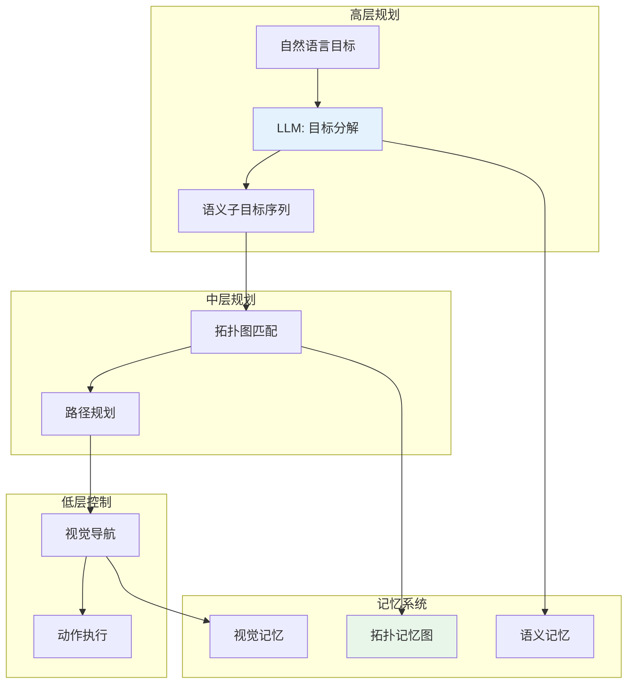
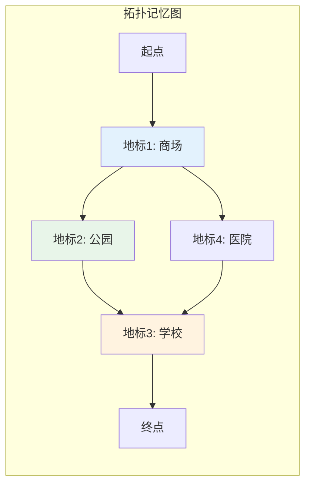
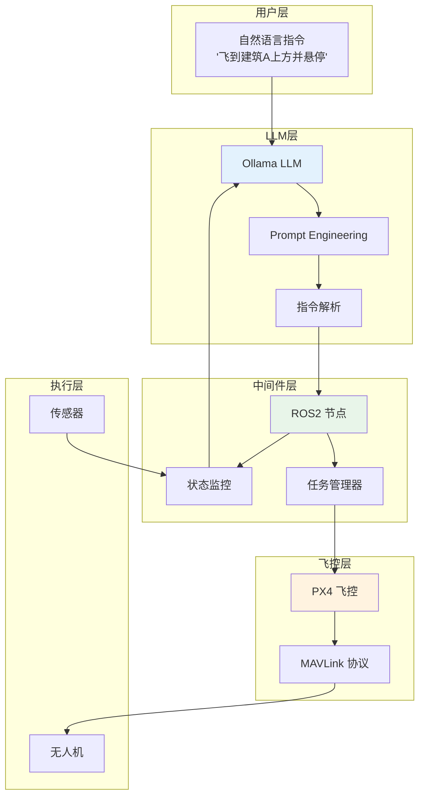
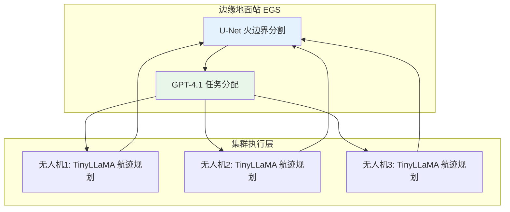
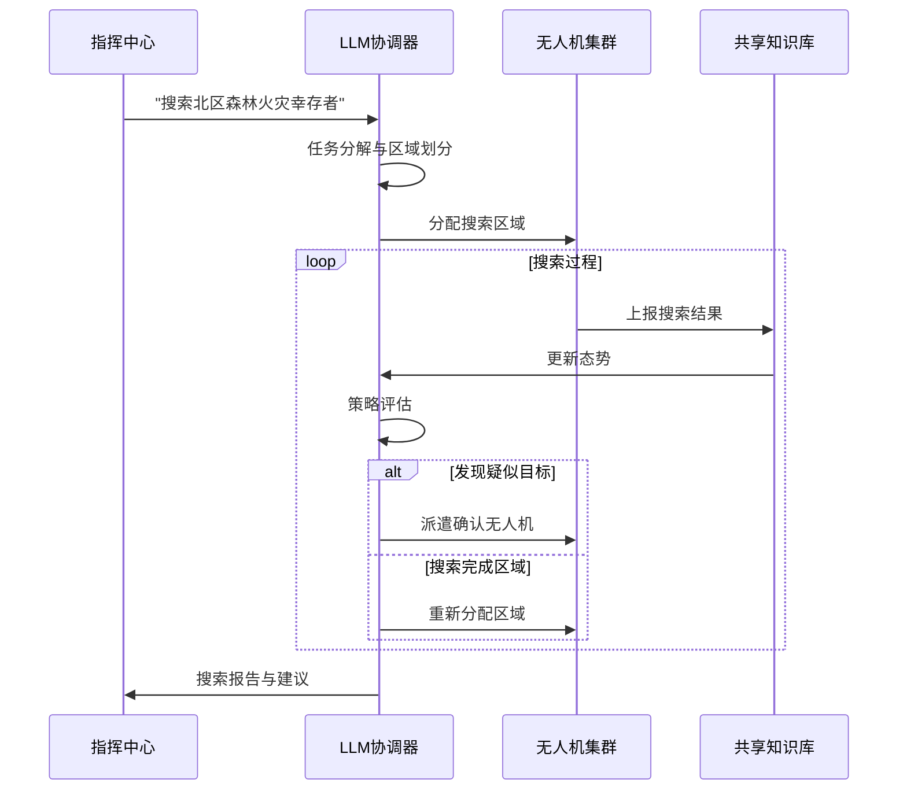
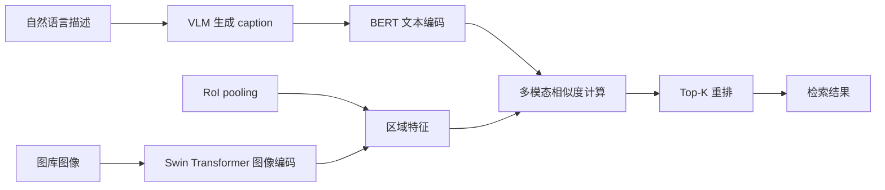
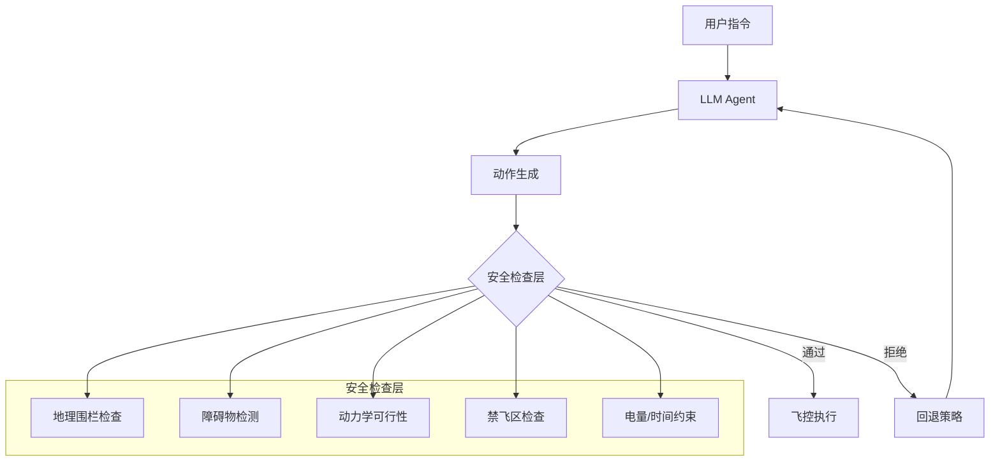

# LLM 驱动的无人机 Agent（LLM-Powered UAV Agents）

> **预计阅读：20 分钟 | 前置知识：VLM 基础、LLM Agent 概念、无人机控制系统基础**

---

## 1. 从感知到行动的范式转变

传统的无人机自主系统遵循**感知-规划-控制**的分层架构，每个模块独立设计和优化。大语言模型（LLM）和视觉语言模型（VLM）的出现正在催生一种新的范式：**LLM/VLM 驱动的无人机 Agent**。

这种新范式的核心理念是：

1. **统一的语义接口**：用自然语言作为人机交互的统一接口
2. **世界知识注入**：利用 LLM 预训练中获得的丰富世界知识
3. **零样本泛化**：无需针对特定任务微调，通过提示工程即可适应新场景
4. **可解释性**：LLM 的推理过程可以以自然语言形式呈现


```mermaid
graph TB
    subgraph 传统架构
        A1[感知模块] --> A2[规划模块]
        A2 --> A3[控制模块]
        A3 --> A4[执行器]
    end
    
    subgraph LLM Agent 架构
        B1[多模态输入] --> B2[LLM/VLM Agent]
        B2 --> B3[自然语言推理]
        B3 --> B4[动作生成]
        B4 --> B5[执行器]
        B5 --> B6[环境反馈]
        B6 --> B2
    end
    
    style B2 fill:#e3f2fd
    style B3 fill:#e8f5e9
```

---

## 2. 核心工作详解

### 2.1 CityNavAgent — 层次化语义导航

**论文**: *CityNavAgent: Aerial Vision-and-Language Navigation with Hierarchical Semantic Planning and Global Memory* (ACL 2025, [arXiv:2505.05622](https://arxiv.org/abs/2505.05622))
**arXiv**: [2505.05622](https://arxiv.org/abs/2505.05622)

#### 核心问题

城市环境中无人机导航面临两大挑战：
1. **长距离导航**：城市环境的导航距离远超室内导航（数十米）；AirVLN 数据集平均轨迹约 **321 m**（Hard 档 235.8 m），是数百米量级
2. **语义理解**：需要理解城市地标、道路网络、功能区等语义信息

#### 架构设计

CityNavAgent 提出了**层次化语义规划 + 拓扑记忆**的架构：


```mermaid
graph TB
    subgraph 高层规划
        A[自然语言目标] --> B[LLM: 目标分解]
        B --> C[语义子目标序列]
    end
    
    subgraph 中层规划
        C --> D[拓扑图匹配]
        D --> E[路径规划]
    end
    
    subgraph 低层控制
        E --> F[视觉导航]
        F --> G[动作执行]
    end
    
    subgraph 记忆系统
        H[拓扑记忆图]
        I[视觉记忆]
        J[语义记忆]
    end
    
    D --> H
    F --> I
    B --> J
    
    style B fill:#e3f2fd
    style H fill:#e8f5e9
```

#### 关键创新

| 创新点 | 描述 | 解决的问题 |
|--------|------|-----------|
| 开放词汇感知模块 | Open-vocabulary Perception Module，不做固定类别检测 | 城市目标类别开放 |
| 层次化语义规划 | Hierarchical Semantic Planning Module，按 Landmark / Object / Motion 三级分解 | 长距离导航的复杂性 |
| 全局记忆模块 | Global Memory Module，用拓扑图维护已探索区域 | 避免重复探索 |

> **勘误（2026-10）**：本表早先有「语义锚点（使用地标作为导航参考点）」与「自适应策略（根据环境复杂度动态调整规划粒度）」两行。**两个模块论文里都没有** —— 全文 "anchor" 出现 0 次、"adaptive" 出现 0 次。已按论文实际的三个模块替换（地标这一层对应的是层次化规划里的 Landmark-level）。

#### 拓扑记忆图


```mermaid
graph LR
    subgraph 拓扑记忆图
        A[起点] --> B[地标1: 商场]
        B --> C[地标2: 公园]
        C --> D[地标3: 学校]
        D --> E[终点]
        B --> F[地标4: 医院]
        F --> D
    end
    
    style B fill:#e3f2fd
    style C fill:#e8f5e9
    style D fill:#fff3e0
```

拓扑记忆图中的每个节点对应一个语义地标，边表示可通行路径。LLM 通过理解自然语言指令，在拓扑图上进行路径搜索和规划。

#### 性能表现

论文在 AirVLN 上报告的核心数字（SR = 成功率，SPL = Success weighted by Path Length，NE = 导航误差，单位米）：

| 设定 | SR | SPL | NE |
|------|----|-----|-----|
| Val Seen | 13.9% | 10.2 | 80.8 m |
| Val Unseen | 11.7% | 9.9 | 60.2 m |
| AirVLN-E | 28.3% | 23.5 | 95.1 m |

论文自述的领先幅度很小 —— 原句：*"CityNavAgent outperforms the best of them by 1.3%, 0.8%, 0.5%, and 16.1% in SR, SPL, SDTW and NE for validation seen dataset"*。

> **勘误（2026-10）**：本表早先是「传统 RL 42.3% / CLIP-Nav 58.7% / CityNavAgent 78.4%」加上「平均路径长度 287m / 234m / 198m」与「SPL 0.31 / 0.45 / 0.68」。**整表为虚构**：78.4 / 198 / 0.68 / 42.3 在论文 17 张表里都搜不到，基线里也没有「传统 RL」和「CLIP-Nav」（真实基线是 RS、AC、Seq2seq、CMA、NavGPT、MapGPT、VELMA、LM-Nav、STMR）；论文报的是导航误差 NE 而不是「平均路径长度」；真实的 SPL 量级是 10–23，不是 0.31–0.68（数量级也错）。已按论文 Table 1/2 重写。

---

### 2.2 ACDC — 自然语言驱动的航拍电影

**论文**: *Agentic Aerial Cinematography: From Dialogue Cues to Cinematic Trajectories* (ACDC, 2025)
**arXiv**: [2509.16176](https://arxiv.org/abs/2509.16176)

#### 核心问题

航拍电影（Aerial Cinematography）需要专业飞手执行复杂的飞行轨迹。ACDC 面向**室内无人机视频导览**，目标是让非专业用户用自然语言描述就能得到可用的拍摄轨迹。论文明确把「固定镜头语法」列为要绕开的东西 —— 原句：*"these works largely rely on fixed shot grammars or hand-tuned objectives and discrete shot modes rather than free-form natural language."*

#### 系统架构


```mermaid
graph LR
    A["自然语言描述"] --> B[视觉-语言检索<br/>选初始航点]
    B --> C[偏好贝叶斯优化<br/>preference-based BO]
    C --> D[位姿精修]
    D --> E[运动规划<br/>生成可行轨迹]
    E --> F[无人机执行]
```

#### 三步流水线

| 步骤 | 做什么 | 用什么 |
|------|--------|--------|
| 1. 初始航点 | 从场景中检索与描述相关的候选位置 | 视觉-语言检索 |
| 2. 位姿精修 | 按「更像不像描述里的画面」反复比较、择优 | 偏好式贝叶斯优化 |
| 3. 轨迹生成 | 在精修后的位姿之间生成可行轨迹 | 运动规划 |

> **勘误（2026-10）**：本节早先有一张「航拍镜头语言映射」表，把 Orbit / Follow / Bird's Eye / Dolly Zoom / Fly Through 五类镜头与「半径、高度、速度」等参数对应起来，并配了「镜头语言转换」的架构图。**这些在论文中一个都不存在** —— `Orbit`、`Follow`、`Bird`、`Dolly`、`Fly Through` 各 0 次命中，而且论文的卖点恰恰是**不依赖固定镜头语法**。已按论文真实的三步流水线替换。

#### LLM 的角色

1. **意图理解**：解析用户的自然语言描述，把它变成可优化的目标
2. **检索目标编写**：把描述转成检索用的查询，选出初始航点
3. **美学偏好判定**：在贝叶斯优化里充当「哪个更符合描述」的判据

> **勘误（2026-10）**：本节早先列的第三个角色是「参数推断：根据上下文推断缺失的飞行参数（如速度、高度）」。论文没有这一步。

#### 安全约束

ACDC 不给出显式的安全参数表，安全性由**运动规划**保证：生成的轨迹本身要求碰撞自由且动力学可行。

> **勘误（2026-10）**：本节早先有一段 Python 代码，列出 `min_altitude: 10` / `max_altitude: 120` / `max_speed: 15` / `min_obstacle_distance: 5` 以及 geofence、no_fly_zones。**论文全文没有 safety、altitude、geofence 任何一个词**，也没有高度/速度约束表；而且它是面向**室内**的，120 m 这种飞行高度约束与场景不符。该代码块已删。

---

### 2.3 Taking Flight with Dialogue — 对话式无人机控制

**论文**: *Taking Flight with Dialogue: Enabling Natural Language Control for PX4-based Drone Agent* (2025)
**arXiv**: [2506.07509](https://arxiv.org/abs/2506.07509)

> **勘误（2026-10）**：本节题名早先写作 *"Taking Flight with Dialogue: Natural Language Control of UAVs via LLMs"*，副标题不是论文正式题名。arXiv 2506.07509 的题名是 *"Taking Flight with Dialogue: Enabling Natural Language Control for PX4-based Drone Agent"*。

#### 系统架构

这篇工作实现了一个完整的**对话式无人机控制系统**，技术栈包括：

| 组件 | 技术选型 | 作用 |
|------|----------|------|
| 飞控系统 | PX4 | 底层飞行控制 |
| 通信中间件 | ROS2 | 模块间通信 |
| LLM 推理 | Ollama (本地部署) | 自然语言理解 |
| 仿真环境 | NVIDIA Isaac Sim | 仿真测试 |
| 硬件平台 | 自组装四旋翼（custom quadcopter） | 真机验证 |

> **勘误（2026-10）**：本表早先「仿真环境」写 Gazebo、「硬件平台」写「大疆/自组装无人机」。论文用的是 **NVIDIA Isaac Sim**（Gazebo 只在相关工作里作为别人家的系统被提过一次），硬件是 *"a custom quadcopter platform"*，全文 "DJI" 出现 0 次。

#### 系统架构图


```mermaid
graph TB
    subgraph 用户层
        A["自然语言指令<br/>'飞到建筑A上方并悬停'"]
    end
    
    subgraph LLM层
        B[Ollama LLM]
        C[Prompt Engineering]
        D[指令解析]
    end
    
    subgraph 中间件层
        E[ROS2 节点]
        F[任务管理器]
        G[状态监控]
    end
    
    subgraph 飞控层
        H[PX4 飞控]
        I[MAVLink 协议]
    end
    
    subgraph 执行层
        J[无人机]
        K[传感器]
    end
    
    A --> B
    B --> C
    C --> D
    D --> E
    E --> F
    E --> G
    F --> H
    H --> I
    I --> J
    K --> G
    G --> B
    
    style B fill:#e3f2fd
    style E fill:#e8f5e9
    style H fill:#fff3e0
```

#### LLM 评测

该工作评测了 4 个 LLM 家族，考的是两件事：**指令是否有效**（能否生成合法的飞行指令）与**任务是否完成**。

| LLM 家族 | 指令有效率 | 任务成功率 |
|---------|-----------|-----------|
| Gemma3 | 100% | 40% |
| Qwen2.5 | 100% | 30% |
| Llama-3.2 | 100% | 30% |
| DeepSeek-LLM | 38% | 0% |

论文原句：*"the LLMs, specifically Gemma3, Qwen2.5, and Llama-3.2, consistently produced 100% valid flight commands, while DeepSeek-LLM demonstrated significantly lower performance at 38%."*

需要加一条重要限定：**评测里没有闭源模型**。原句：*"Proprietary models requiring paid Application Programming Interface (API) access, such as OpenAI's ChatGPT-4 and Anthropic's Claude, were omitted from the analysis."*

> **勘误（2026-10）**：本表早先是「GPT-4 94.2% / LLaMA-3 70B 87.6% / Mistral 7B 82.1% / Qwen-2 7B 85.3%」加上「参数提取准确率」「平均推理时间」两列。**整表为虚构**：论文评的是 Gemma3、Qwen2.5、Llama-3.2、DeepSeek-LLM 四个家族，且明确**排除了 GPT-4**；"accuracy" 一词全文 0 次，94.2 这组数字也不存在，Mistral 根本不在评测之列。已按论文原文重写。

#### 指令解析示例

```
用户输入: "飞到那栋红色建筑上方 20 米处，然后顺时针绕一圈"

LLM 解析输出:
{
  "action_sequence": [
    {
      "type": "navigate",
      "target": "red_building",
      "altitude": 20,
      "reference": "above"
    },
    {
      "type": "orbit",
      "direction": "clockwise",
      "radius": null,  // LLM 推断为建筑大小
      "altitude": 20
    }
  ],
  "safety_check": {
    "altitude_valid": true,
    "no_fly_zone_conflict": false
  }
}
```

#### 关键发现

1. **LLM 能够处理模糊指令**：如"飞到那栋建筑"，LLM 可以结合视觉信息推断目标
2. **有效性不等于成功率**：三个模型能做到 100% 生成合法指令，但任务成功率最高只有 40% —— 指令合法与任务完成之间还差很远
3. **小模型的短板集中在指令有效性**：DeepSeek-LLM 的指令有效率只有 38%，任务成功率为 0
4. **缺少端到端延迟数据**：论文**没有测延迟**，作者把它列为局限 —— 原句：*"The current evaluation also lacks a quantitative analysis of several vital system metrics, including end-to-end latency, token usage of the language model, and path optimality"*

> **勘误（2026-10）**：本条早先是「参数推断能力」「安全约束遵循」加「实时性挑战：LLM 推理延迟（1-4秒）是实时控制的主要瓶颈」。前两条在论文里没有对应内容；第四条把「1-4 秒」归到论文名下也不对 —— **论文自述没有测端到端延迟**。第 6 节的动手验证正是用仓库自己的仿真把这个缺口补成一个可量的数（见下）。

---

### 2.4 Agentic AI for UAV Swarms — 无人机集群智能

**论文**: *Agentic AI Meets Edge Computing in Autonomous UAV Swarms* (2026)
**arXiv**: [2601.14437](https://arxiv.org/abs/2601.14437)

> **勘误（2026-10）**：本节题名早先写作 *"Agentic AI for UAV Swarms: A Case Study in Wildfire Search and Rescue"*。arXiv 2601.14437 的题名是 *"Agentic AI Meets Edge Computing in Autonomous UAV Swarms"* —— 论文的主线是 **LLM 与边缘计算的三种部署架构**（standalone / edge-enabled / edge-cloud hybrid），wildfire SAR 只是其中一个 use case，不是题名里的 case study。

#### 核心问题

论文讨论的是边缘算力受限时，LLM 该放在哪里、能做什么：
1. **部署架构**：LLM 放机上、放边缘地面站（EGS），还是两者分工
2. **机上能力边界**：轻量模型能做哪一级决策
3. **任务分配**：如何把巡测点分给各无人机
4. **动态调整**：如何根据火情进展重新分配

#### 部署架构


```mermaid
graph TB
    subgraph 边缘地面站 EGS
        A[U-Net 火边界分割]
        B[GPT-4.1 任务分配]
    end
    
    subgraph 集群执行层
        D1[无人机1: TinyLLaMA 航迹规划]
        D2[无人机2: TinyLLaMA 航迹规划]
        D3[无人机3: TinyLLaMA 航迹规划]
    end
    
    A --> B
    B --> D1
    B --> D2
    B --> D3
    D1 --> A
    D2 --> A
    D3 --> A
    
    style A fill:#e3f2fd
    style B fill:#e8f5e9
```

论文原句：*"the lightweight TinyLLaMA model is used onboard for route planning, while the more capable GPT-4.1 model is employed at the EGS"*。

#### 四类任务的分工

| 任务 | 在哪算 | 用什么 |
|------|-------|-------|
| 图像分割 | 边缘地面站 | U-Net |
| 巡测点生成 | 边缘地面站 | GPT-4.1 |
| 巡测点分配 | 边缘地面站 | GPT-4.1 |
| 无人机路径规划 | 机上 | TinyLLaMA |

> **勘误（2026-10）**：本节早先画的是「无人机3: 确认 / 无人机4: 通信中继」式的按功能分工，并配了一张「任务规划者 / 信息整合者 / 策略调整者 / **冲突解决者** / **报告生成者**」的角色表。**这些都查无来源**：论文全文 "relay"、"confirmation" 各 0 次，没有「确认机」「中继机」这类功能分工，也没有「冲突解决者」「报告生成者」两个角色。已按论文的 EGS + TinyLLaMA 分工替换。

#### 火灾搜索救援场景


```mermaid
sequenceDiagram
    participant 指挥中心
    participant LLM协调器
    participant 无人机集群
    participant 共享知识库
    
    指挥中心->>LLM协调器: "搜索北区森林火灾幸存者"
    LLM协调器->>LLM协调器: 任务分解与区域划分
    LLM协调器->>无人机集群: 分配搜索区域
    loop 搜索过程
        无人机集群->>共享知识库: 上报搜索结果
        共享知识库->>LLM协调器: 更新态势
        LLM协调器->>LLM协调器: 策略评估
        alt 发现疑似目标
            LLM协调器->>无人机集群: 派遣确认无人机
        else 搜索完成区域
            LLM协调器->>无人机集群: 重新分配区域
        end
    end
    LLM协调器->>指挥中心: 搜索报告与建议
```

---

### 2.5 Team Xiaomi — 描述引导的跨模态检索

**论文**: *Team Xiaomi EV-AD VLA: Caption-Guided Retrieval System for Cross-Modal Drone Navigation*（IROS 2025 RoboSense Challenge Track 4 技术报告，2025）
**arXiv**: [2510.02728](https://arxiv.org/abs/2510.02728)

> **勘误（2026-10）**：本节题名早先写作 *"Team Xiaomi: Caption-Guided Retrieval for UAV Object Search"*。arXiv 2510.02728 的题名是 *"Team Xiaomi EV-AD VLA: Caption-Guided Retrieval System for Cross-Modal Drone Navigation — Technical Report for IROS 2025 RoboSense Challenge Track 4"*。

#### 核心问题

这个任务**不是在一张图里框目标**，而是**跨视图图像检索**：给定自然语言描述，从大规模图像库里检索出相关图像，覆盖无人机、卫星、地面相机三种视角。

论文原句：*"requiring efficient retrieval of relevant images from large-scale databases based on natural language descriptions... focusing on robust, natural language-guided cross-view image retrieval across multiple platforms (drones, satellites, and ground cameras)"*。

> **勘误（2026-10）**：本节早先把它写成「无人机目标检索（Object Search）：根据自然语言描述在航拍图像中找到目标，传统方法依赖目标检测模型，只能识别预定义类别」。任务定义与基线都错：它是检索任务，官方基线不是目标检测模型而是检索基线 GeoText-1652。

#### 系统流程


```mermaid
graph LR
    A["自然语言描述"] --> B[VLM 生成 caption]
    B --> C[BERT 文本编码]
    D[图库图像] --> E[Swin Transformer 图像编码]
    F[RoI pooling] --> G[区域特征]
    E --> G
    C --> H[多模态相似度计算]
    G --> H
    H --> I[Top-K 重排]
    I --> J[检索结果]
```

#### 技术细节

| 组件 | 技术 | 作用 |
|------|------|------|
| 图像编码 | Swin Transformer | 提取视觉特征 |
| 文本编码 | BERT | 提取文本特征 |
| 区域特征 | 特征图上的 RoI pooling | 取候选区域表示 |
| 相似度计算 | 余弦相似度 | 计算文本-图像相似度 |
| 排序策略 | 用 VLM 生成的 caption 做多模态重排 | 输出最终检索结果 |

> **勘误（2026-10）**：本表早先写的是「CLIP Text Encoder / CLIP Image Encoder / Selective Search 或 RPN / Top-K + NMS」。论文的实际编码器是 **Swin Transformer（图像）+ BERT（文本）**，区域靠 **RoI pooling**；`Selective`、`RPN`、`NMS` 全文各 0 次。只有「余弦相似度」一项与论文一致。

#### 性能表现

官方榜成绩（8 支队伍中排第 2）：

| 方法 | R@1 | R@5 | R@10 |
|------|-----|-----|------|
| RoboSense2025 官方基线 | 25.44% | 40.61% | 49.10% |
| Team Xiaomi | 31.33% | 49.09% | 57.15% |

论文原句：*"ranking second with R@1 scores of 31.33%, R@5 scores of 49.09%, and R@10 scores of 57.15%. Our R@1 score is 5.89% higher than the official baseline"*。

> **勘误（2026-10）**：本表早先是「CLIP 直接匹配 23.4/45.2/58.7」「检测+CLIP 41.2/62.3/73.8」「Team Xiaomi 56.8/78.4/87.2」。**整表为虚构**：前两行是不存在的基线，第三行的三个数也不是论文值（真实是 31.33 / 49.09 / 57.15）。官方基线那一行的数字由论文给出的领先幅度（+5.89 / +8.48 / +8.05）反推得到。

---

## 3. 技术模式分析

### 3.1 LLM 在无人机 Agent 中的角色模式

| 模式 | 描述 | 代表工作 | 优势 | 局限 |
|------|------|----------|------|------|
| 指令解析器 | 将自然语言转换为结构化指令 | Taking Flight with Dialogue | 简单直接 | 无法处理复杂推理 |
| 任务规划器 | 分解复杂任务为子任务序列 | CityNavAgent | 处理长程任务 | 依赖环境模型 |
| 检索目标编写器 | 把自然语言意图改写成可检索的查询，并对结果重排 | ACDC、Team Xiaomi | 零样本泛化，无需预定义类别 | 受底层检索器召回率限制 |
| 任务分配器 | 在边缘侧把巡测任务分配给各机 | Agentic AI（EGS 上的 GPT-4.1） | 适应动态集群 | 依赖边缘侧算力 |

> **勘误（2026-10）**：本表早先的两行是「策略决策器 | 在多选项中做出决策 | Agentic AI」与「知识检索器 | 利用世界知识辅助决策 | ACDC」。两条都与论文对不上：Agentic AI 的模型在边缘地面站上做的是**巡测点分配**，不是通用策略决策；ACDC 的 LLM 做的是**把意图改写成检索目标**和**判定美学偏好**，并**不**检索世界知识。已按各篇正文的实际分工改写。

### 3.2 系统集成模式


```mermaid
graph TB
    subgraph 紧耦合模式
        A1[LLM] --> A2[飞控]
    end
    
    subgraph 松耦合模式
        B1[LLM] --> B2[中间件]
        B2 --> B3[飞控]
    end
    
    subgraph 分层模式
        C1[LLM: 高层规划]
        C2[传统规划器: 中层]
        C3[飞控: 低层]
        C1 --> C2 --> C3
    end
```

| 模式 | 实时性 | 灵活性 | 安全性 | 适用场景 |
|------|--------|--------|--------|----------|
| 紧耦合 | 差 | 高 | 低 | 简单任务 |
| 松耦合 | 中 | 高 | 中 | 通用场景 |
| 分层 | 好 | 中 | 高 | 安全关键场景 |

---

## 4. 关键挑战与未来方向

### 4.1 当前挑战

| 挑战 | 描述 | 影响 |
|------|------|------|
| 推理延迟 | 本卷所引论文均未测端到端延迟（Taking Flight with Dialogue 作者自列为局限） | 实时控制能力缺少可比的量化基线 |
| 安全保证 | LLM 输出不可预测 | 难以进行形式化安全验证 |
| 幻觉问题 | LLM 可能生成不存在的目标 | 导致错误的导航决策 |
| 上下文长度 | 长序列任务超出上下文窗口 | 复杂任务处理能力受限 |
| 多模态融合 | 视觉-语言对齐不完美 | 跨模态理解能力有限 |

### 4.2 未来方向

1. **边缘部署**：将小型 LLM 部署到无人机端，减少通信延迟
2. **分层架构**：LLM 负责高层规划，传统方法负责低层控制
3. **安全护栏**：在 LLM 输出端增加安全检查和约束
4. **持续学习**：根据飞行经验在线更新 LLM 的知识
5. **多智能体协作**：多无人机共享 LLM 知识，实现集群智能

---

## 5. 关键论文

- **[ACL'25] CityNavAgent** — *CityNavAgent: Aerial Vision-and-Language Navigation with Hierarchical Semantic Planning and Global Memory*  
  [](https://arxiv.org/abs/2505.05622)
  层次化语义规划（Landmark/Object/Motion）+ 全局记忆模块

- **[arXiv'25.09] ACDC** — *Agentic Aerial Cinematography: From Dialogue Cues to Cinematic Trajectories*  
  [](https://arxiv.org/abs/2509.16176)
  自然语言驱动的室内航拍巡游：视觉-语言检索 + 偏好贝叶斯优化

- **[arXiv'25.06] Taking Flight with Dialogue: Enabling Natural Language Control for PX4-based Drone Agent**  
  [](https://arxiv.org/abs/2506.07509)
  PX4 + ROS2 + Ollama 对话式控制

- **[arXiv'26.01] Agentic AI Meets Edge Computing in Autonomous UAV Swarms**  
  [](https://arxiv.org/abs/2601.14437)
  LLM + 边缘计算的三种集群部署架构

- **[IROS'25] Team Xiaomi EV-AD VLA: Caption-Guided Retrieval System for Cross-Modal Drone Navigation -- Technical Report for IROS 2025 RoboSense Challenge Track 4**  
  [](https://arxiv.org/abs/2510.02728)
  描述引导的跨视图图像检索


---

> **勘误（2026-10）**：本表早先的题名是「Agentic AI for UAV Swarms」「Team Xiaomi」两项简写，核心贡献一列也按旧描述写成了「集群搜救」「目标检索」。已同步为 2.4、2.5 节改写后的正式题名与真实贡献。

---

## 6. 动手验证：LLM 慢一秒，无人机偏几米？

4.1 节把「推理延迟」列为实时控制的头号挑战，但本卷所引论文都**没有测过端到端延迟**（2.3 节的论文甚至把它写进局限）。这是一个从定性判断到一个数之间的空档，这一节用仓库自己的仿真把它填上。

> **勘误（2026-10）**：本段早先写作「4.1 节把"LLM 推理延迟 1-4 秒"列为实时控制的主要瓶颈，"无法满足实时控制需求"」。「1-4 秒」既不来自本节任何一篇论文，也不是任何一处实测，属于凭印象填入的数值，已删。下面的仿真量的是**外环航点刷新周期**对轨迹跟踪误差的影响，量的是内环跟得上跟不上，不是 LLM 的推理耗时。

做法是内环固定 50 Hz 正常跑，外环每 τ 秒重新下发一个目标点，从 0 扫到 4 秒。参考轨迹是一条半径 2 m 的圆，8 秒一圈。外环用的是**离散航点**而不是连续轨迹：LLM agent 给的是"去哪儿"，不是每一步的速度，内环收到航点后就地悬停。

### 6.1 慢外环 + 定点悬停内环

```python
import torch, math
from common.quad_sim import QuadSim

N, DT, R, OM, H = 64, 0.02, 2.0, 2 * math.pi / 8.0, 1.5
ph = 2 * math.pi * torch.arange(N) / N

def ref(t):
    a = OM * t + ph
    return torch.stack([R * torch.cos(a), R * torch.sin(a), torch.full_like(a, H)], -1)

def hold(env, goal):                 # 定点悬停控制器：D 项作用于绝对速度
    e = goal[:, :2] - env.p[:, :2]
    tilt = torch.stack([torch.clamp(0.9 * e[:, 0] - 0.7 * env.v[:, 0], -0.6, 0.6),
                        torch.clamp(0.9 * e[:, 1] - 0.7 * env.v[:, 1], -0.6, 0.6)], -1)
    a = torch.zeros(env.n, 4)
    a[:, 0] = 0.5 + 0.10 * (H - env.p[:, 2]) - 0.30 * env.v[:, 2]
    a[:, 1:3] = 3.0 * (tilt - env.rpy[:, :2])
    return a.clamp(-1, 1)

torch.manual_seed(0)
for tau in (0, 1, 2, 4):
    k = round(tau / DT)              # 外环每 k 步更新一次航点
    env = QuadSim(N); env.reset()
    env.p = ref(0.0).clone(); env.v.zero_()
    goal = ref(0.0)
    err = 0.0
    for t in range(800):
        if t % max(k, 1) == 0:       # <- LLM 只在此时重新规划一次
            goal = ref(DT * t)
        env.step(hold(env, goal))
        if t >= 200:
            err += float(((env.p[:, :2] - ref(DT * t)[:, :2]).norm(dim=-1) ** 2).sum())
    print(f"τ={tau} s  跟踪 RMSE {math.sqrt(err / (600 * N)):.2f} m")
```

### 6.2 本地实测结果

```text
τ=0 s  跟踪 RMSE 1.09 m
τ=1 s  跟踪 RMSE 1.85 m
τ=2 s  跟踪 RMSE 2.52 m
τ=4 s  跟踪 RMSE 3.15 m
```

4 秒的规划周期对应 3.15 m 的路径偏差，已经超过无人机的机身尺度，在半径 2 m 的圆上等于跑到了圆周的另一侧。这就把「外环慢到什么程度就不能再算跟踪」落成了一个数。**注意这只覆盖了链路里的一环**：它量的是「规划周期」这一项，不是 LLM 的推理耗时——推理耗时叠加上去只会更长。

值得注意的是 τ=0 那一行：外环每一步都更新，误差仍有 1.09 m。这部分与延迟无关，是定点悬停的固有代价——内环收到航点就停在那儿，而参考点在持续移动，两次规划之间"世界已经变了"。换句话说，慢外环的代价由两部分组成：延迟本身，加上"悬停"这个动作与移动任务之间的错配。

这与连续轨迹指令的对照很有意思：连续轨迹那套（内环带速度前馈）基准只有 0.12 m，但延迟一上来就陡增，4 秒时 4.11 m；航点这套基准高出一大截（1.09 m），增长却平缓得多。两条曲线的对照见 [机载部署与优化](../03-VLA专题/05-机载部署与优化.md) 第 10 节。

> **单次实验，固定种子**：这里用的是周期轨迹，τ 等于整圈时长（8000 ms）时旧目标会绕回原位、误差假性归零。本节 τ 最大 4000 ms（半圈），在单调区间内。换成非周期任务时趋势不变，但具体数值会随任务曲率变化。


### 6.3 【待验证】接入 PX4 SITL：LLM 迟到时谁来兜底

> **未在本地验证**：本节代码需要 Ubuntu + PX4 + MicroXRCEAgent 才能运行，本仓库的验证环境是 Windows，没有跑过。**字段名请以你安装的 `px4_msgs` 版本为准。**

航点式架构有一个连续轨迹没有的好处：LLM 迟到时，无人机只是停在原地，不会执行一条过时的轨迹。代价是 6.2 节量出来的高基准误差。真要上机，关键是在这条慢链路上加一个**超时兜底**。

```python
from rclpy.qos import QoSProfile, ReliabilityPolicy, DurabilityPolicy, HistoryPolicy
from px4_msgs.msg import OffboardControlMode, TrajectorySetpoint, VehicleLocalPosition
import rclpy

def px4_qos(depth=1):
    """PX4 话题统一用 BEST_EFFORT + TRANSIENT_LOCAL，否则收不到数据。"""
    return QoSProfile(reliability=ReliabilityPolicy.BEST_EFFORT,
                      durability=DurabilityPolicy.TRANSIENT_LOCAL,
                      history=HistoryPolicy.KEEP_LAST, depth=depth)

class WaypointAgent(Node):
    """LLM 给航点，飞控执行；LLM 迟到超过 timeout 就地悬停。"""
    def __init__(self, timeout=5.0):
        super().__init__('waypoint_agent')
        self.timeout, self.wp, self.t_wp = timeout, None, 0.0
        self.create_subscription(VehicleLocalPosition, '/fmu/out/vehicle_local_position',
                                 self.on_pos, px4_qos())

    def on_pos(self, m):
        now = self.get_clock().now().nanoseconds / 1e9
        if self.wp is None or now - self.t_wp > self.timeout:
            # 兜底：LLM 超时就用当前位置当航点，等价于原地悬停
            self.wp = (m.x, m.y, m.z)
            self.get_logger().warn('LLM 超时，切换到原地悬停')
        self.pub_setpoint.publish(to_enu_setpoint(self.wp))
```

三点补充：**航点要用世界坐标而不是机体坐标**（LLM 输出"向前 10 米"时必须先用当前航向换算，否则一转机头目标就飘了）、**兜底阈值要与任务匹配**（悬停 5 秒安全，但"穿越移动目标"这类任务必须换成重新规划）、**把 LLM 的延迟打进日志**（它是 6.2 节那条曲线唯一的自变量，不测就不知道什么时候会出事）。

### 6.4 运行完整脚本

```bash
py -3.9 code/f_control_loop.py     # 约 12 秒，CPU 即可
```

完整脚本（含连续轨迹与阶梯航点两种外环的对照、9 个延迟档位、出图）：[`code/f_control_loop.py`](../../code/f_control_loop.py)

---

## 7. 扩展阅读

- [CityNavAgent arXiv](https://arxiv.org/abs/2505.05622)
- [ACDC arXiv](https://arxiv.org/abs/2509.16176)
- [Taking Flight with Dialogue: Enabling Natural Language Control for PX4-based Drone Agent](https://arxiv.org/abs/2506.07509)
- [Agentic AI Meets Edge Computing in Autonomous UAV Swarms](https://arxiv.org/abs/2601.14437)
- [Team Xiaomi EV-AD VLA: Caption-Guided Retrieval System for Cross-Modal Drone Navigation](https://arxiv.org/abs/2510.02728)
- 相关章节：[什么是VLM](../01-基础概念/02-什么是VLM.md)
- 相关章节：[./02-无人机场景理解.md](./02-无人机场景理解.md)
- 相关章节：[./04-边缘VLM部署.md](./04-边缘VLM部署.md)

---

## 8. 思考题

### 题目 1：CityNavAgent 的层次化规划相比端到端方法有什么优势？在什么场景下端到端方法可能更好？

<details>
<summary>查看答案</summary>

**层次化规划的优势**：
1. **可解释性**：高层规划的子目标序列可以被人类理解和验证
2. **模块化**：每个层次可以独立优化和替换
3. **长程任务**：将复杂任务分解为简单子任务，降低单步决策难度
4. **知识复用**：高层规划可以复用 LLM 的世界知识
5. **错误恢复**：子任务失败时可以重新规划，而非从头开始

**端到端方法更好的场景**：
1. **短程导航**：距离短、环境简单时，端到端方法更高效
2. **反应式任务**：需要快速响应的避障等任务
3. **训练数据充足**：有大量标注数据时，端到端方法可以学到更优策略
4. **计算资源受限**：层次化方法需要维护多个模块，计算开销更大

</details>

### 题目 2：在 Taking Flight with Dialogue 的评测中，三个 7B 以下的模型都做到了 100% 生成合法指令，但最高任务成功率只有 40%。这个落差说明了什么？

<details>
<summary>查看答案</summary>

**先看事实**：论文评的是 Gemma3、Qwen2.5、Llama-3.2、DeepSeek-LLM 四个家族。前三个的**指令有效率都是 100%**，DeepSeek-LLM 只有 38%；对应的**任务成功率**分别是 40% / 30% / 30% / 0%。作者还明确把需要付费 API 的 GPT-4、Claude 排除在评测之外。

**落差说明的问题**：
1. **「指令合法」与「任务完成」是两件事**：检查的是参数能不能解析、字段有没有缺，与"飞到那儿对不对"之间隔着感知、规划、控制三层
2. **失败主要不在指令解析层**：三个模型解析全对，成功率却卡在 30–40%，说明瓶颈更可能在视觉理解与空间推理
3. **指令有效率仍然是一道真实的门槛**：DeepSeek-LLM 的 38% 直接把它压到 0% 成功率——解析不出来的指令没有后续可言
4. **评测口径决定了结论能推到哪**：论文没有测端到端延迟、token 用量与路径最优性（作者自列为局限），所以「哪个模型更适合上机」这个问题在本篇数据下无法回答

**启示**：
1. **报告数字要带上它所在的层**：把「指令有效率」当成「任务成功率」读，会高估十倍以上
2. **分层部署有依据**：解析层小模型够用，能力短板在感知与推理层，补也该补在那里
3. **看基准要看它测了什么、没测什么**：缺延迟数据意味着这一篇不能用来做实时性选型

</details>

> **勘误（2026-10）**：本题早先的题干是「为什么 Mistral 7B 的推理速度最快但执行成功率最低？」。Mistral **根本不在该论文的评测之列**，四个模型家族是 Gemma3 / Qwen2.5 / Llama-3.2 / DeepSeek-LLM，论文里也没有测推理速度。整道题已按论文真实数据重写（原答案的「参数提取准确率」「安全约束遵循」两条同样是编造内容）。

### 题目 3：LLM 驱动的无人机 Agent 如何保证飞行安全？设计一个安全架构。

<details>
<summary>查看答案</summary>

**安全架构设计**：


```mermaid
graph TB
    A[用户指令] --> B[LLM Agent]
    B --> C[动作生成]
    C --> D{安全检查层}
    D -->|通过| E[飞控执行]
    D -->|拒绝| F[回退策略]
    F --> B
    
    subgraph 安全检查层
        G[地理围栏检查]
        H[障碍物检测]
        I[动力学可行性]
        J[禁飞区检查]
        K[电量/时间约束]
    end
    
    D --> G
    D --> H
    D --> I
    D --> J
    D --> K
```

**关键安全机制**：
1. **地理围栏**：限制飞行区域，防止飞出安全边界
2. **障碍物检测**：独立于 LLM 的实时避障系统
3. **动力学约束**：确保生成的动作在无人机动力学范围内
4. **回退策略**：LLM 输出不安全时，回退到预设安全动作
5. **人工监督**：关键操作需要人工确认
6. **心跳监控**：定期检查 LLM 响应，超时则执行安全着陆

</details>

---

> **下一节**：[04-边缘VLM部署](./04-边缘VLM部署.md) — 计划再合理，也要落到机载算力与显存的预算里
