# 边缘 VLM 部署（Edge Deployment of VLMs）

**预计阅读：18 分钟 | 前置知识：模型压缩基础、嵌入式系统基础、VLM 架构**

---

## 1. 引言：为什么需要边缘部署？

VLM 通常包含数十亿参数，需要强大的 GPU 进行推理。然而，无人机等边缘设备面临严格的资源约束：

| 约束维度 | 云端服务器 | 无人机边缘设备 | 差距 |
|----------|-----------|---------------|------|
| 计算能力 | 100+ TFLOPS (A100) | 0.5-20 TFLOPS (Jetson) | 50-200x |
| 内存容量 | 80GB+ | 4-32GB | 5-20x |
| 功耗 | 300W+ | 5-30W | 10-60x |
| 延迟 | 100-500ms (网络) | 10-50ms (本地) | 低 |
| 带宽 | 充分 | 有限/不稳定 | 限制 |

边缘部署 VLM 的核心动机：

1. **低延迟**：实时应用（避障、跟踪）需要毫秒级响应
2. **离线能力**：无人机可能在无网络覆盖区域作业
3. **隐私保护**：敏感数据（军事、安防）不应上传云端
4. **带宽节省**：高清视频流上传消耗大量带宽

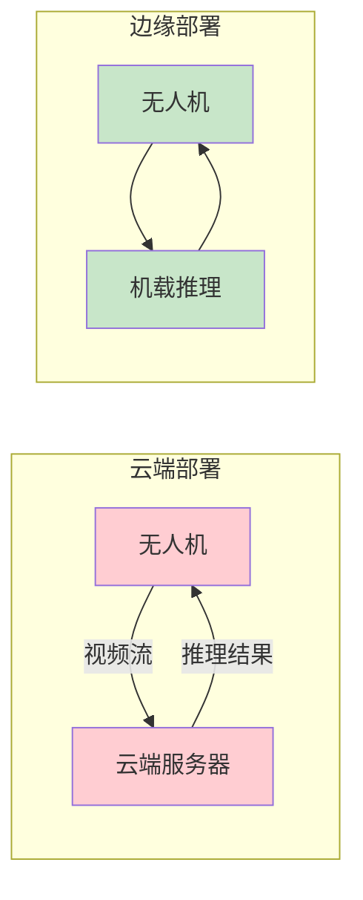

---

## 2. 模型压缩技术全景

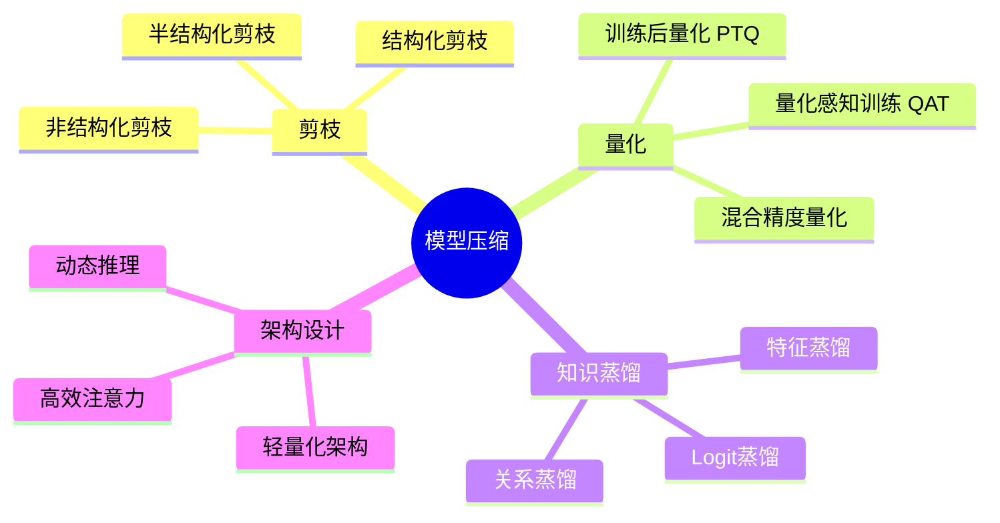

---

## 3. 核心技术详解

### 3.1 模型剪枝（Pruning）

剪枝通过移除模型中不重要的参数或结构来减小模型体积和计算量。

#### 剪枝策略对比

| 策略 | 描述 | 压缩率 | 精度损失 | 硬件友好 |
|------|------|--------|----------|:--------:|
| 非结构化剪枝 | 移除单个权重 | 高 (90%+) | 低 | 差 |
| 结构化剪枝 | 移除整个通道/层 | 中 (50-80%) | 中 | 好 |
| 半结构化剪枝 | N:M 稀疏模式 | 中 (50%) | 低 | 中 |

#### VLM 剪枝的特殊考虑

VLM 包含视觉编码器和语言模型两个主要组件，剪枝策略需要分别考虑：

| 组件 | 推荐策略 | 原因 |
|------|----------|------|
| 视觉编码器 | 结构化剪枝 | 视觉特征冗余度高 |
| 语言模型 | 半结构化剪枝 | 保持生成质量 |
| 连接器 | 轻量化 | 参数量小，整体替换 |

### 3.2 模型量化（Quantization）

量化将模型权重和激活从高精度（FP32）转换为低精度（INT8、INT4）表示。

#### 量化方法对比

| 方法 | 描述 | 精度影响 | 训练需求 | 工具支持 |
|------|------|----------|----------|----------|
| PTQ (训练后量化) | 直接量化已训练模型 | 中 | 无需训练 | TensorRT, ONNX |
| QAT (量化感知训练) | 训练时模拟量化 | 低 | 需要训练 | PyTorch, TF |
| 混合精度 | 不同层使用不同精度 | 低 | 可选 | 自定义 |

#### 量化精度-性能权衡

| 精度 | 模型大小 | 推理速度 | 精度保持 | 适用场景 |
|------|----------|----------|----------|----------|
| FP32 | 1x | 1x | 100% | 训练/调试 |
| FP16 | 0.5x | 2x | 99.5% | 云端推理 |
| INT8 | 0.25x | 3-4x | 97-99% | 边缘推理 |
| INT4 | 0.125x | 5-8x | 93-97% | 极端压缩 |

#### VLM 量化的挑战

1. **多模态对齐**：视觉和语言特征的数值范围差异大
2. **注意力机制**：Softmax 对量化精度敏感
3. **生成质量**：语言模型的自回归生成对误差累积敏感

### 3.3 知识蒸馏（Knowledge Distillation）

知识蒸馏通过训练小模型（Student）模仿大模型（Teacher）的行为来实现模型压缩。

#### 蒸馏策略

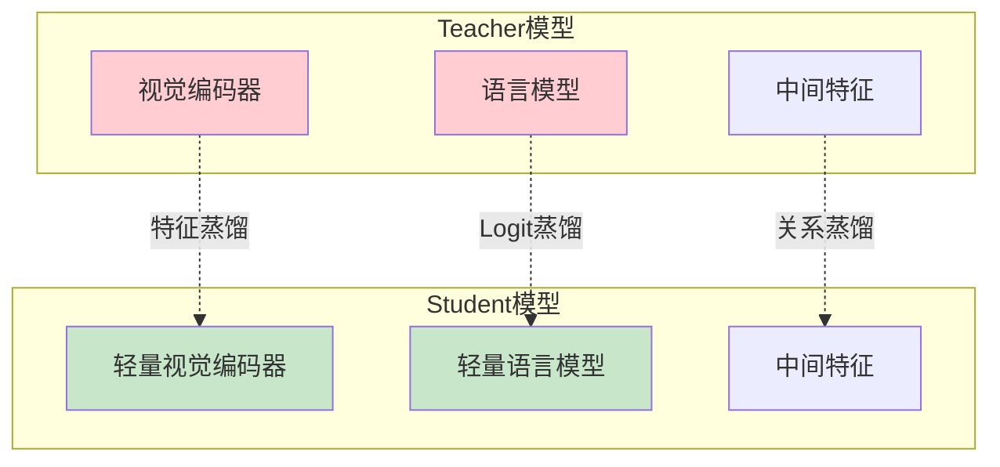

| 蒸馏类型 | 描述 | 优势 | 局限 |
|----------|------|------|------|
| Logit 蒸馏 | 匹配输出概率分布 | 简单有效 | 信息损失大 |
| 特征蒸馏 | 匹配中间层特征 | 信息保留多 | 需要设计对齐 |
| 关系蒸馏 | 匹配样本间关系 | 泛化性好 | 计算开销大 |

---

## 4. 核心工作详解

### 4.1 Edge-Optimized BLIP-2 — 轻量化多模态平台

**论文**: *Edge-Optimized BLIP-2: A Lightweight Multimodal Platform for UAV Applications* (2026)
**arXiv**: [2601.08408](https://arxiv.org/abs/2601.08408)

#### 核心创新

Edge-Optimized BLIP-2 针对无人机场景对 BLIP-2 架构进行了全面的轻量化改造。

| 组件 | 原始 BLIP-2 | Edge-Optimized | 压缩率 |
|------|-------------|----------------|--------|
| 视觉编码器 | ViT-G/14 (1.9B) | EfficientViT-L (0.3B) | 6.3x |
| Q-Former | 188M | Lite-Q-Former (32M) | 5.9x |
| 语言模型 | FlanT5-XL (3B) | TinyLLaMA-1.1B | 2.7x |
| **总计** | **~5.1B** | **~1.4B** | **3.6x** |

#### 架构对比

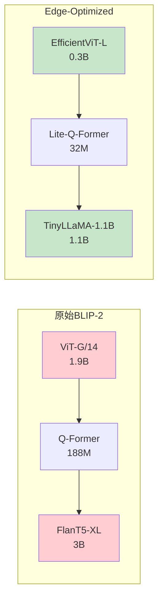

#### 关键优化技术

| 技术 | 描述 | 效果 |
|------|------|------|
| EfficientViT | 高效视觉 Transformer | 6.3x 参数减少，保持 95% 精度 |
| Lite-Q-Former | 轻量化 Q-Former | 5.9x 参数减少 |
| TinyLLaMA | 小型语言模型 | 2.7x 参数减少 |
| INT8 量化 | 权重和激活量化 | 2x 推理加速 |
| 稀疏注意力 | 降低注意力计算复杂度 | 1.5x 推理加速 |

#### 部署性能

| 平台 | 推理延迟 | 内存占用 | 功耗 |
|------|----------|----------|------|
| Jetson Orin NX (16GB) | 85ms | 4.2GB | 15W |
| Jetson AGX Orin (64GB) | 42ms | 4.2GB | 25W |
| Jetson Nano (4GB) | 320ms | 3.8GB | 10W |
| Raspberry Pi 5 (8GB) | 850ms | 3.5GB | 8W |

#### 精度对比

| 任务 | 原始 BLIP-2 | Edge-Optimized | 保持率 |
|------|-------------|----------------|--------|
| 图像描述 (CIDEr) | 121.4 | 112.8 | 92.9% |
| VQA (Acc) | 78.2% | 72.6% | 92.8% |
| 视觉推理 | 65.3% | 59.8% | 91.6% |
| 遥感描述 | 89.7 | 83.2 | 92.8% |

---

### 4.2 AVION — 遥感知识蒸馏

**论文**: *AVION: Adaptive Vision-Language Distillation for Remote Sensing* (CVPR 2026)
**arXiv**: [2603.12659](https://arxiv.org/abs/2603.12659)

#### 核心创新

AVION 提出了**自适应知识蒸馏**方法，专门针对遥感 VLM 的边缘部署。

| 特性 | 描述 |
|------|------|
| Teacher | 大规模遥感 VLM (7B+) |
| Student | 轻量级模型 (0.5-1B) |
| 蒸馏策略 | 自适应多层次蒸馏 |
| 目标平台 | Jetson 系列、手机端 |

#### 自适应蒸馏架构

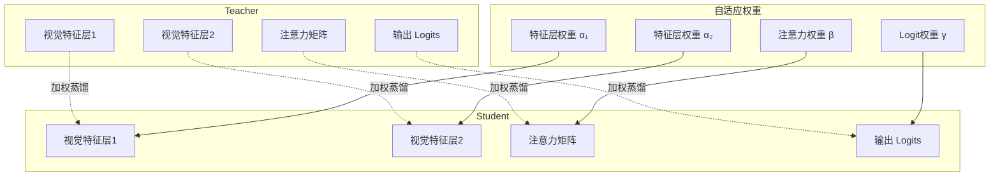

#### 自适应权重学习

AVION 的核心创新在于**自适应学习蒸馏权重**：

```python
# 自适应蒸馏损失
L_total = α₁ * L_feat1 + α₂ * L_feat2 + β * L_attn + γ * L_logit

# 权重通过元学习自动调整
α₁, α₂, β, γ = MetaLearner(student_performance)
```

不同层的蒸馏权重根据 Student 在验证集上的表现自动调整，避免了手动调参的繁琐。

#### 遥感特定优化

| 优化点 | 描述 | 效果 |
|--------|------|------|
| 多尺度特征对齐 | 对齐不同分辨率的遥感特征 | 小目标检测提升 8% |
| 光谱感知蒸馏 | 考虑多光谱数据的特殊性 | 多光谱理解提升 12% |
| 空间关系蒸馏 | 保持空间关系推理能力 | 空间推理提升 6% |

---

### 4.3 CARLA-Air — 仿真测试平台

**论文**: *CARLA-Air: A Simulation Platform for UAV VLM Deployment Evaluation* (2026)
**arXiv**: [2603.28032](https://arxiv.org/abs/2603.28032)

#### 核心问题

在真实无人机上测试 VLM 部署方案成本高、风险大。CARLA-Air 提供了一个**仿真测试平台**，可以在虚拟环境中评估 VLM 的部署效果。

#### 平台架构

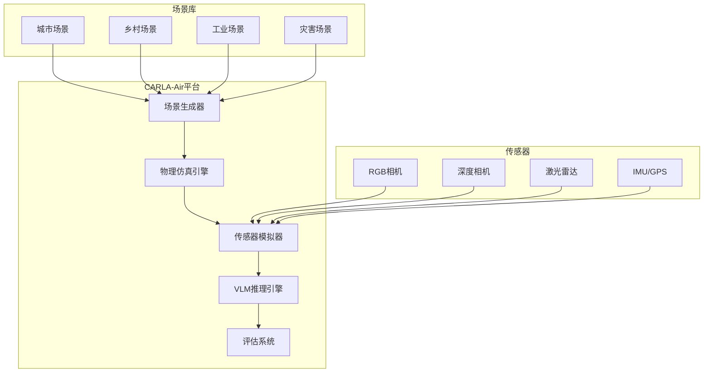

#### 评测维度

| 维度 | 评测内容 | 指标 |
|------|----------|------|
| 推理性能 | 延迟、吞吐量、内存 | ms, FPS, GB |
| 任务精度 | 检测、描述、VQA | mAP, CIDEr, Acc |
| 能耗效率 | 功耗、电池续航 | W, min |
| 鲁棒性 | 不同天气、光照 | 精度下降率 |
| 实时性 | 端到端延迟 | ms |

#### 仿真到真实迁移

CARLA-Air 支持**Sim-to-Real 迁移测试**：

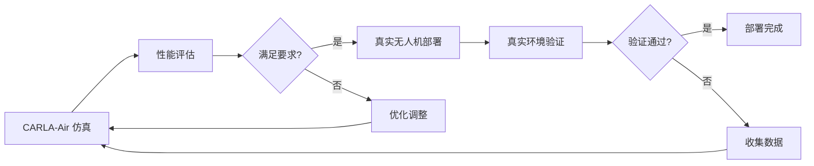

---

## 5. 部署架构设计

### 5.1 纯边缘部署


**适用场景**：无网络环境、低延迟需求、隐私敏感
**挑战**：计算资源受限、模型大小受限

### 5.2 云边协同部署

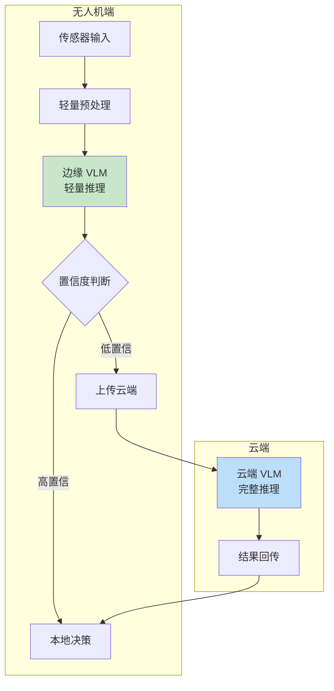

**适用场景**：有网络环境、复杂任务、精度优先
**优势**：平衡延迟和精度

### 5.3 分层部署

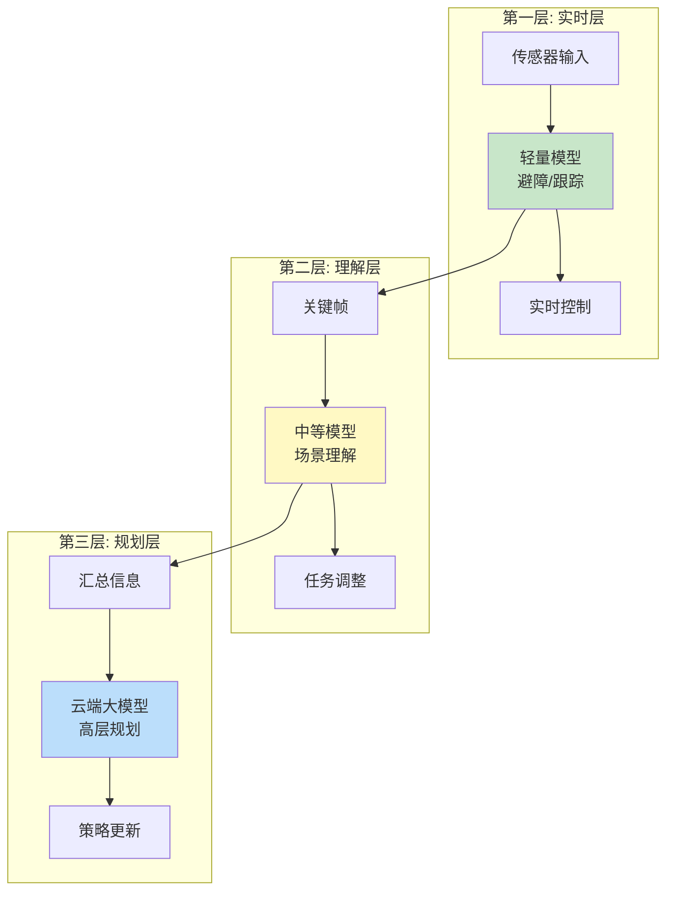

**适用场景**：复杂任务、多时间尺度需求
**优势**：不同层次使用不同规模的模型

---

## 6. 技术选型指南

### 6.1 硬件平台对比

| 平台 | 算力 | 内存 | 功耗 | 价格 | 适用场景 |
|------|------|------|------|------|----------|
| Jetson Orin NX | 100 TOPS | 16GB | 25W | $699 | 高性能边缘推理 |
| Jetson Orin Nano | 40 TOPS | 8GB | 15W | $249 | 中等性能 |
| Jetson Nano | 472 GFLOPS | 4GB | 10W | $149 | 入门级 |
| Raspberry Pi 5 | ~2 TOPS | 8GB | 8W | $80 | 轻量推理 |
| 手机 NPU | 10-30 TOPS | 8-16GB | 5W | - | 移动端 |

### 6.2 压缩技术选型

| 需求 | 推荐技术 | 预期效果 |
|------|----------|----------|
| 快速部署 | PTQ (INT8) | 2-3x 加速，精度损失小 |
| 极致压缩 | INT4 量化 + 剪枝 | 8-10x 压缩，需要验证精度 |
| 精度优先 | 知识蒸馏 | 3-5x 压缩，精度保持好 |
| 灵活部署 | 混合精度 | 根据层重要性分配精度 |

### 6.3 软件工具链

| 工具 | 用途 | 特点 |
|------|------|------|
| TensorRT | NVIDIA GPU 推理优化 | 最佳 Jetson 支持 |
| ONNX Runtime | 跨平台推理 | 平台无关 |
| OpenVINO | Intel 设备优化 | Intel 硬件最佳 |
| TFLite | 移动端部署 | 手机端成熟 |
| MLC-LLM | LLM 边缘部署 | 专门优化 LLM |

---

## 7. 实践建议

### 7.1 部署流程

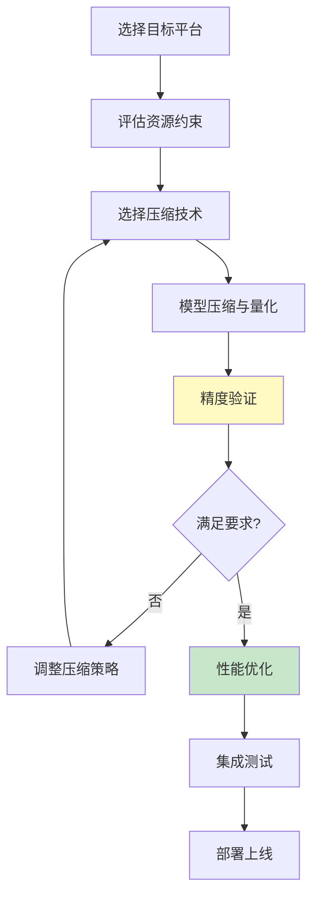

### 7.2 常见问题与解决方案

| 问题 | 原因 | 解决方案 |
|------|------|----------|
| 精度下降过大 | 量化过度 | 使用混合精度或 QAT |
| 推理速度慢 | 模型未优化 | 使用 TensorRT 加速 |
| 内存溢出 | 模型太大 | 更激进的压缩或云边协同 |
| 功耗过高 | 持续推理 | 动态推理，按需触发 |
| 部署失败 | 算子不支持 | 替换不支持的算子 |

---

## 8. 关键论文列表

| 论文 | 会议/年份 | 核心贡献 |
|------|-----------|----------|
| Edge-Optimized BLIP-2 | 2026 | 轻量化多模态平台，3.6x 压缩 |
| AVION | CVPR 2026 | 自适应知识蒸馏，遥感 VLM 压缩 |
| CARLA-Air | 2026 | 仿真测试平台，Sim-to-Real 迁移 |

---

## 9. 扩展阅读

- [Edge-Optimized BLIP-2 arXiv](https://arxiv.org/abs/2601.08408)
- [AVION arXiv](https://arxiv.org/abs/2603.12659)
- [CARLA-Air arXiv](https://arxiv.org/abs/2603.28032)
- 相关章节：[../02-架构演进/01-视觉编码器.md](../02-架构演进/01-视觉编码器.md)
- 相关章节：[../02-架构演进/02-视觉语言连接器.md](../02-架构演进/02-视觉语言连接器.md)
- 相关章节：[./03-LLM驱动的无人机Agent.md](./03-LLM驱动的无人机Agent.md)

---

## 10. 思考题

### 题目 1：Edge-Optimized BLIP-2 将模型从 5.1B 压缩到 1.4B，精度保持率约 92%。在实际无人机应用中，这个精度损失是否可以接受？需要考虑哪些因素？

<details>
<summary>查看答案</summary>

**是否可以接受取决于具体应用场景**：

**可以接受的场景**：
1. **辅助决策**：VLM 仅提供参考信息，最终决策由人类做出
2. **非安全关键**：场景描述、图像分类等任务，8% 错误率可接受
3. **粗粒度任务**：场景级别的理解，不需要像素级精度

**不可接受的场景**：
1. **安全关键**：避障、着陆等任务，任何错误都可能导致事故
2. **精确目标识别**：军事侦察、精确打击等任务
3. **法规要求**：某些应用可能有最低精度要求

**需要考虑的因素**：
1. **任务容错性**：任务对错误的容忍度
2. **冗余机制**：是否有其他传感器或方法作为备份
3. **人类监督**：是否有人类实时监控
4. **环境条件**：恶劣环境可能进一步降低精度
5. **成本效益**：精度提升带来的收益是否值得使用更大模型

</details>

### 题目 2：AVION 的自适应蒸馏权重学习相比手动调参有什么优势？在什么情况下手动调参可能更好？

<details>
<summary>查看答案</summary>

**自适应蒸馏的优势**：
1. **自动化**：无需人工尝试不同权重组合，节省时间和人力
2. **任务自适应**：不同任务自动学习最优权重，而非使用统一权重
3. **数据驱动**：根据 Student 的实际表现调整权重，更客观
4. **可扩展性**：可以轻松扩展到更多蒸馏损失项

**手动调参更好的情况**：
1. **领域专家可用**：有经验丰富的专家可以快速确定合理权重
2. **简单任务**：蒸馏损失项少（2-3个），手动调参工作量不大
3. **计算资源受限**：自适应学习需要额外的验证集评估，增加计算开销
4. **可解释性需求**：手动调参的权重有明确的物理意义
5. **小数据集**：数据量不足以可靠地学习自适应权重

</details>

### 题目 3：设计一个无人机 VLM 边缘部署方案，需要考虑哪些关键因素？画出系统架构图。

<details>
<summary>查看答案</summary>

**关键考虑因素**：

1. **硬件选择**：根据算力、功耗、尺寸、成本选择合适的计算平台
2. **模型选择**：根据任务需求选择合适的 VLM 规模
3. **压缩策略**：根据精度要求选择压缩技术
4. **推理优化**：使用 TensorRT 等工具优化推理
5. **系统集成**：与飞控、传感器等模块的集成
6. **安全机制**：故障检测、降级策略、人工接管
7. **更新机制**：模型在线更新、A/B 测试

**系统架构图**：

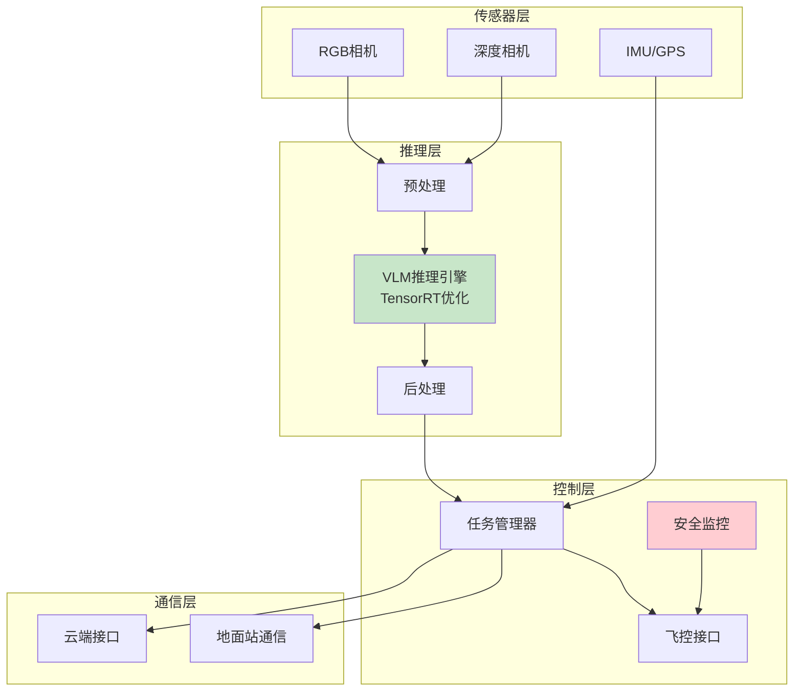

</details>

---

[上一章：LLM驱动的无人机Agent](./03-LLM驱动的无人机Agent.md) | [返回目录](../README.md)
