# 边缘 VLM 部署（Edge Deployment of VLMs）

> **预计阅读：18 分钟 | 前置知识：模型压缩基础、嵌入式系统基础、VLM 架构**

---

## 1. 为什么需要边缘部署？

VLM 通常包含数十亿参数，需要强大的 GPU 进行推理。然而，无人机等边缘设备面临严格的资源约束：

| 约束维度 | 云端服务器 | 无人机边缘设备 | 差距 |
|----------|-----------|---------------|------|
| 计算能力 | ~312 TFLOPS (A100, FP16 稠密) | 40–100 TOPS (Jetson Orin Nano/NX, INT8 稀疏) | 约 3–8x |
| 内存容量 | 80GB+ | 4-32GB | 5-20x |
| 功耗 | 300W+ | 5-30W | 10-60x |
| 延迟 | 100-500ms (网络) | 10-50ms (本地) | 低 |
| 带宽 | 充分 | 有限/不稳定 | 限制 |

> **口径说明**：算力一行两侧单位不同——云侧是 **FP16 稠密 TFLOPS**，边侧是 **INT8 稀疏 TOPS**（NVIDIA 对 Jetson Orin 的官方口径）。INT8 相对 FP16 大约有 2 倍吞吐，稀疏又再翻一倍，所以「约 3–8x」只是个量级，不要当精确比值用。**跨口径直接比大小是这一行最容易出错的地方。**

边缘部署 VLM 的核心动机：

1. **低延迟**：实时应用（避障、跟踪）需要毫秒级响应
2. **离线能力**：无人机可能在无网络覆盖区域作业
3. **隐私保护**：敏感数据（军事、安防）不应上传云端
4. **带宽节省**：高清视频流上传消耗大量带宽

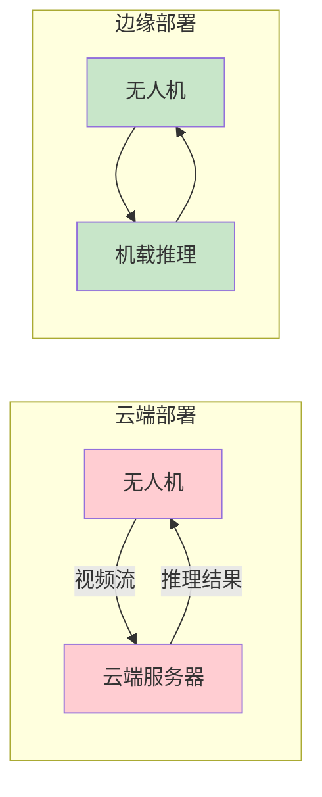
```mermaid
graph LR
    subgraph 云端部署
        A[无人机] -->|视频流| B[云端服务器]
        B -->|推理结果| A
    end
    
    subgraph 边缘部署
        C[无人机] --> D[机载推理]
        D --> C
    end
    
    style A fill:#ffcdd2
    style B fill:#ffcdd2
    style C fill:#c8e6c9
    style D fill:#c8e6c9
```

---

## 2. 模型压缩技术全景

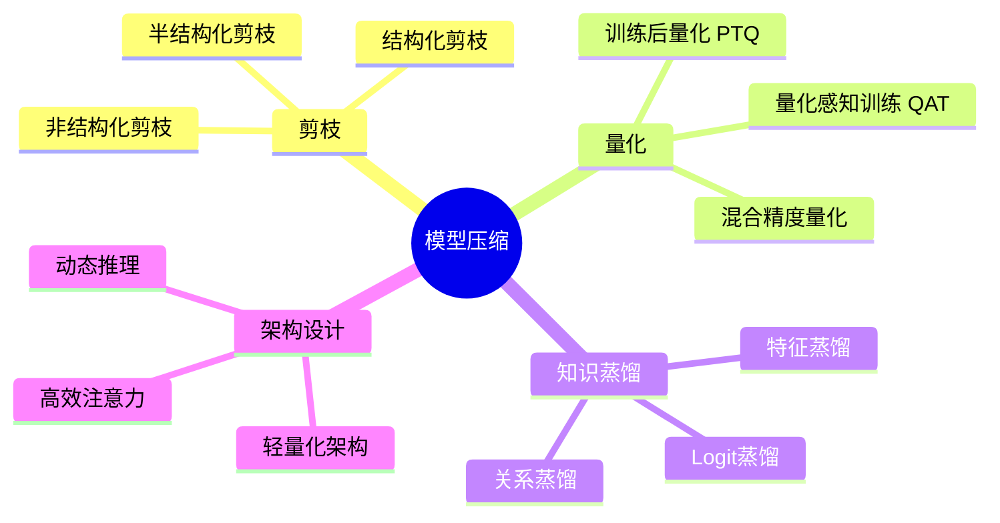
```mermaid
mindmap
  root((模型压缩))
    剪枝
      非结构化剪枝
      结构化剪枝
      半结构化剪枝
    量化
      训练后量化 PTQ
      量化感知训练 QAT
      混合精度量化
    知识蒸馏
      特征蒸馏
      Logit蒸馏
      关系蒸馏
    架构设计
      轻量化架构
      高效注意力
      动态推理
```

---

## 3. 核心技术详解

### 3.1 模型剪枝（Pruning）

剪枝通过移除模型中不重要的参数或结构来减小模型体积和计算量。

#### 剪枝策略对比

| 策略 | 描述 | 压缩率 | 精度损失 | 硬件友好 |
|------|------|--------|----------|:--------:|
| 非结构化剪枝 | 移除单个权重 | 高 (90%+) | 低 | 差 |
| 结构化剪枝 | 移除整个通道/层 | 中 (50-80%) | 中 | 好 |
| 半结构化剪枝 | N:M 稀疏模式 | 中 (50%) | 低 | 中 |

#### VLM 剪枝的特殊考虑

VLM 包含视觉编码器和语言模型两个主要组件，剪枝策略需要分别考虑：

| 组件 | 推荐策略 | 原因 |
|------|----------|------|
| 视觉编码器 | 结构化剪枝 | 视觉特征冗余度高 |
| 语言模型 | 半结构化剪枝 | 保持生成质量 |
| 连接器 | 轻量化 | 参数量小，整体替换 |

### 3.2 模型量化（Quantization）

量化将模型权重和激活从高精度（FP32）转换为低精度（INT8、INT4）表示。

#### 量化方法对比

| 方法 | 描述 | 精度影响 | 训练需求 | 工具支持 |
|------|------|----------|----------|----------|
| PTQ (训练后量化) | 直接量化已训练模型 | 中 | 无需训练 | TensorRT, ONNX |
| QAT (量化感知训练) | 训练时模拟量化 | 低 | 需要训练 | PyTorch, TF |
| 混合精度 | 不同层使用不同精度 | 低 | 可选 | 自定义 |

#### 量化精度-性能权衡

| 精度 | 模型大小 | 推理速度 | 精度保持 | 适用场景 |
|------|----------|----------|----------|----------|
| FP32 | 1x | 1x | 100% | 训练/调试 |
| FP16 | 0.5x | 2x | 99.5% | 云端推理 |
| INT8 | 0.25x | 3-4x | 97-99% | 边缘推理 |
| INT4 | 0.125x | 5-8x | 93-97% | 极端压缩 |

> **注意**：**前两列（模型大小、推理速度）是确定的算术与硬件事实**——模型大小 = 位宽比，推理速度随硬件与算子支持变化。**后两列（精度保持）是经验区间，没有统一来源**，不应作为选型依据。本卷第 9 节的动手验证正是要说明这一点：在可分辨的任务上，「精度保持 97-99%」这类数字**根本量不出来**，不同任务、不同标定集能差出十几个点。要判断某一档能不能用，只能拿你自己的任务集测——这张表能告诉你的只有「INT8 的权重占地是 FP16 的一半」这种算术。

#### VLM 量化的挑战

1. **多模态对齐**：视觉和语言特征的数值范围差异大
2. **注意力机制**：Softmax 对量化精度敏感
3. **生成质量**：语言模型的自回归生成对误差累积敏感

### 3.3 知识蒸馏（Knowledge Distillation）

知识蒸馏通过训练小模型（Student）模仿大模型（Teacher）的行为来实现模型压缩。

#### 蒸馏策略

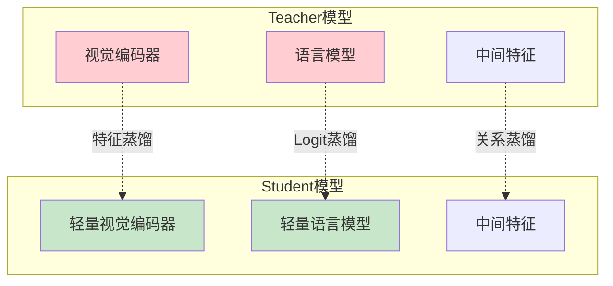
```mermaid
graph TB
    subgraph Teacher模型
        A1[视觉编码器]
        A2[语言模型]
        A3[中间特征]
    end
    
    subgraph Student模型
        B1[轻量视觉编码器]
        B2[轻量语言模型]
        B3[中间特征]
    end
    
    A1 -.->|特征蒸馏| B1
    A2 -.->|Logit蒸馏| B2
    A3 -.->|关系蒸馏| B3
    
    style A1 fill:#ffcdd2
    style A2 fill:#ffcdd2
    style B1 fill:#c8e6c9
    style B2 fill:#c8e6c9
```

| 蒸馏类型 | 描述 | 优势 | 局限 |
|----------|------|------|------|
| Logit 蒸馏 | 匹配输出概率分布 | 简单有效 | 信息损失大 |
| 特征蒸馏 | 匹配中间层特征 | 信息保留多 | 需要设计对齐 |
| 关系蒸馏 | 匹配样本间关系 | 泛化性好 | 计算开销大 |

---

## 4. 核心工作详解

### 4.1 Edge-Optimized BLIP-2 — 外挂检测器的无人机视频理解平台

**论文**: *Edge-Optimized Multimodal Learning for UAV Video Understanding via BLIP-2*（DMBD 2025）
**arXiv**: [2601.08408](https://arxiv.org/abs/2601.08408)

#### 核心做法

这篇论文**不做架构替换**。它保留原版 BLIP-2（冻结视觉编码器 + Q-Former + LLM），在**外面挂两个检测器**（YOLO-World 与 YOLOv8-Seg）来补上无人机视频里小目标与实例分割的短板。

论文原句：*"a lightweight multimodal task platform based on BLIP-2, integrated with YOLO-World and YOLOv8-Seg models"*。

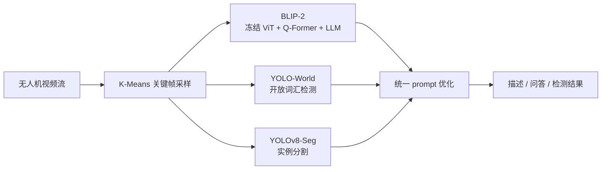
```mermaid
graph LR
    A[无人机视频流] --> B[K-Means 关键帧采样]
    B --> C[BLIP-2<br/>冻结 ViT + Q-Former + LLM]
    B --> D[YOLO-World<br/>开放词汇检测]
    B --> E[YOLOv8-Seg<br/>实例分割]
    C --> F[统一 prompt 优化]
    D --> F
    E --> F
    F --> G[描述 / 问答 / 检测结果]
```

#### BLIP-2 基线的真实规模

若要对照原版 BLIP-2 的体量，应按 BLIP-2 原文（arXiv:2301.12597）表 2：`ViT-g + FlanT5-XL` 配置**总参数约 4.1B**，其中 Q-Former 188M、FlanT5-XL 约 3B，而 ViT-g/14 由差值反推约 **1.0B**。

#### 论文自报的开销

论文的核心结论之一恰恰是**没省下来**：它自己报的峰值 GPU 显存约 **17 GB**（Table 1 的 GPU(GB) 列在 14.68–15.93 之间）。

论文原句：*"maintaining peak GPU memory usage at approximately 17GB"*。

论文只有两张表——Table 1 是「载入 / 速度 / 显存 / GPU 占用」的消融，Table 2 是 LVIS minival 上的零样本检测 AP。

---

### 4.2 AVION — 遥感视觉-语言模型的提示微调式蒸馏

**论文**: *AVION: Aerial Vision-Language Instruction from Offline Teacher to Prompt-Tuned Network* (CVPR 2026)
**arXiv**: [2603.12659](https://arxiv.org/abs/2603.12659)

#### 核心思路

AVION 的框架确实是「冻结的大 teacher → 轻量 student」，但**「轻量」指的不是换了个小模型，而是只训练提示参数**：teacher 与 student 都是 GeoRSCLIP，学生一侧只加可学习的 deep prompt（约 98K 参数，不到骨干的 1%）。

论文原句：*"the student backbone is GeoRSCLIP(ViT-B/32) and the frozen teacher is GeoRSCLIP(ViT-H/14)"*、*"A frozen large teacher model is employed to distill knowledge into a lightweight student model that is later used for inference."*

| 特性 | 描述 |
|------|------|
| Teacher | GeoRSCLIP (ViT-H/14)，冻结 |
| Student | GeoRSCLIP (ViT-B/32) + 可学习 deep prompt（约 98K 参数，<1% backbone） |
| 蒸馏策略 | LLM 生成文本原型 + 选择性原型聚合 + 三方面对齐（Tri-Aspect Alignment） |
| 适用任务 | 遥感分类与跨模态检索的 PEFT 适配 |

#### 蒸馏架构

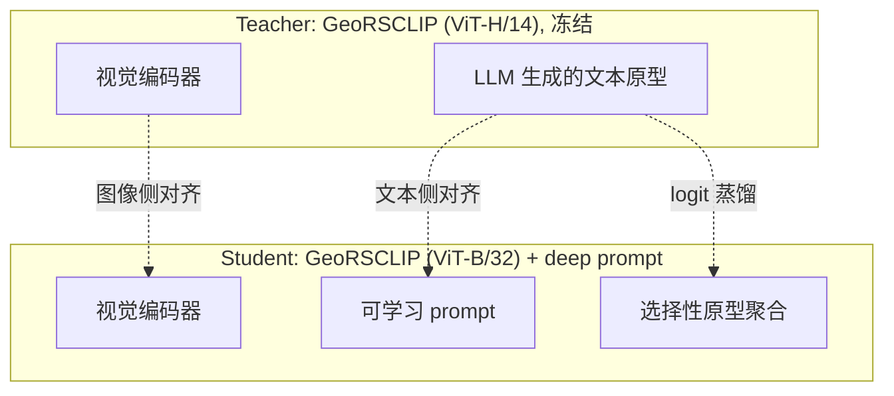
```mermaid
graph TB
    subgraph Teacher["Teacher: GeoRSCLIP (ViT-H/14), 冻结"]
        T1[视觉编码器]
        T2[LLM 生成的文本原型]
    end

    subgraph Student["Student: GeoRSCLIP (ViT-B/32) + deep prompt"]
        S1[视觉编码器]
        S2[可学习 prompt]
        S3[选择性原型聚合]
    end

    T1 -.->|图像侧对齐| S1
    T2 -.->|文本侧对齐| S2
    T2 -.->|logit 蒸馏| S3
```

#### 损失权重的真实设置

论文的损失权重是**固定常数，不是学出来的**：λ_img = 0.5、λ_text = 0.5、λ_logit = 1.0，蒸馏温度 τ 固定为 2。

论文原句：*"we set the final weights to λ_img = 0.5, λ_text = 0.5, and λ_logit = 1.0 ... The distillation temperature τ is fixed at 2"*。

#### 论文报告的真实增幅

这篇的提升落在分类与检索指标上，量级是「几个百分点」，不是两位数百分比：

| 数据集 | 指标 | 增幅 |
|--------|------|------|
| RSITMD | mR | +1.11 pp |
| RSICD | mR | +0.93 pp |
| RESISC-45 | 准确率 | +5.46% / +2.88% |

论文原句：*"AVION improves mR by +1.11 pp (RSITMD) and +0.93 pp (RSICD)"*。

---

### 4.3 CARLA-Air — 仿真测试平台

**论文**: *CARLA-Air: Fly Drones Inside a CARLA World — A Unified Infrastructure for Air-Ground Embodied Intelligence* (2026)
**arXiv**: [2603.28032](https://arxiv.org/abs/2603.28032)

#### 核心问题

在真实无人机上测试 VLM 部署方案成本高、风险大。CARLA-Air 把 CARLA 的**高保真城市驾驶仿真**与**物理精确的多旋翼飞行**统一到同一个世界里，为 air-ground 具身智能提供一套仿真基础设施。

论文原句：*"unifies high-fidelity urban driving and physics-accurate multirotor flight"*；覆盖的工作负载是 *"cooperation, embodied navigation and vision-language action, multi-modal perception and dataset construction"*。

#### 平台架构

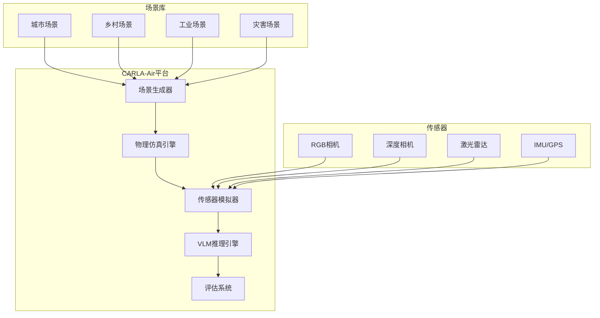
```mermaid
graph TB
    subgraph CARLA-Air平台
        A[场景生成器]
        B[物理仿真引擎]
        C[传感器模拟器]
        D[VLM推理引擎]
        E[评估系统]
    end
    
    subgraph 场景库
        F[城市场景]
        G[乡村场景]
        H[工业场景]
        I[灾害场景]
    end
    
    subgraph 传感器
        J[RGB相机]
        K[深度相机]
        L[激光雷达]
        M[IMU/GPS]
    end
    
    A --> B
    B --> C
    C --> D
    D --> E
    
    F --> A
    G --> A
    H --> A
    I --> A
    
    J --> C
    K --> C
    L --> C
    M --> C
```

#### 论文实测的三项

CARLA-Air 的性能评估只有三项：

| 实验 | 内容 |
|------|------|
| 帧率与资源伸缩 | 负载上升时帧率与计算资源如何变化 |
| 持续运行下的显存稳定性 | 长时间运行（3 小时）无显存泄漏 |
| 通信延迟 | 仿真与外部模块之间的通信开销 |

论文原句：*"three experiments: frame-rate and resource scaling ..., memory stability under sustained operation ..., and communication latency"*。

#### 关于 Sim-to-Real

---

## 5. 部署架构设计

### 5.1 纯边缘部署


```mermaid
graph TB
    subgraph 无人机端
        A[传感器输入] --> B[预处理]
        B --> C[VLM 推理]
        C --> D[后处理]
        D --> E[控制输出]
    end
    
    style C fill:#c8e6c9
```

**适用场景**：无网络环境、低延迟需求、隐私敏感
**挑战**：计算资源受限、模型大小受限

### 5.2 云边协同部署

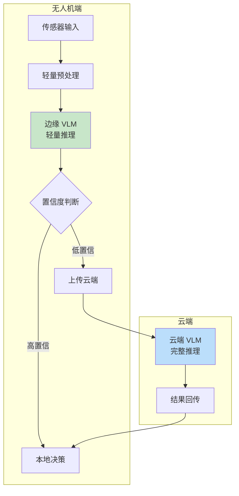
```mermaid
graph TB
    subgraph 无人机端
        A[传感器输入] --> B[轻量预处理]
        B --> C[边缘 VLM<br/>轻量推理]
        C --> D{置信度判断}
        D -->|高置信| E[本地决策]
        D -->|低置信| F[上传云端]
    end
    
    subgraph 云端
        G[云端 VLM<br/>完整推理]
        G --> H[结果回传]
    end
    
    F --> G
    H --> E
    
    style C fill:#c8e6c9
    style G fill:#bbdefb
```

**适用场景**：有网络环境、复杂任务、精度优先
**优势**：平衡延迟和精度

### 5.3 分层部署

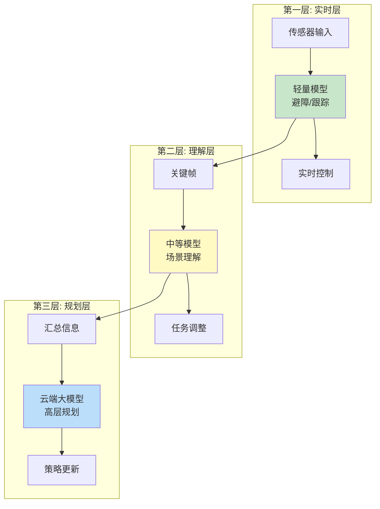
```mermaid
graph TB
    subgraph 第一层: 实时层
        A[传感器输入] --> B[轻量模型<br/>避障/跟踪]
        B --> C[实时控制]
    end
    
    subgraph 第二层: 理解层
        D[关键帧] --> E[中等模型<br/>场景理解]
        E --> F[任务调整]
    end
    
    subgraph 第三层: 规划层
        G[汇总信息] --> H[云端大模型<br/>高层规划]
        H --> I[策略更新]
    end
    
    B --> D
    E --> G
    
    style B fill:#c8e6c9
    style E fill:#fff9c4
    style H fill:#bbdefb
```

**适用场景**：复杂任务、多时间尺度需求
**优势**：不同层次使用不同规模的模型

---

## 6. 技术选型指南

### 6.1 硬件平台对比

| 平台 | 算力（INT8） | 内存 | 功耗 | 价格 | 适用场景 |
|------|------|------|------|------|----------|
| Jetson Orin NX 16GB | 100 TOPS | 16GB | 10–25W | $599（模组首发价） | 高性能边缘推理 |
| Jetson Orin Nano 8GB | 40 TOPS | 8GB | 15W | $249 | 中等性能 |
| Jetson Nano | 472 GFLOPS（FP16） | 4GB | 5–10W | $99（2019 发布价，已停产） | 入门级 |
| Raspberry Pi 5 | 无 NPU；加 AI HAT+ 后 13 / 26 / 40 TOPS | 8GB | ~12W | $80（主板） | 轻量推理 |
| 手机 NPU | 10–30 TOPS | 8–16GB | ~5W | — | 移动端 |

### 6.2 压缩技术选型

| 需求 | 推荐技术 | 预期效果 |
|------|----------|----------|
| 快速部署 | PTQ (INT8) | 2-3x 加速，精度损失小 |
| 极致压缩 | INT4 量化 + 剪枝 | 8-10x 压缩，需要验证精度 |
| 精度优先 | 知识蒸馏 | 3-5x 压缩，精度保持好 |
| 灵活部署 | 混合精度 | 根据层重要性分配精度 |

> **这些「倍数」只是量级，不要当承诺**：
> - **压缩倍数**（INT4 + 剪枝的 8-10x、蒸馏的 3-5x）是**参数量比**，可以精确预期——但它和「省了多少延迟」不是一回事，权重变小不会让激活和运行时开销跟着变小（见第 10 节）。
> - **加速倍数**（PTQ 的 2-3x）**依赖硬件与算子支持**：同一份 INT8 权重在没有对应 Tensor Core 路径的板子上可能一点不提速，甚至更慢（需要插入反量化）。
> - **「精度损失小」「精度保持好」这两句在本卷被自己的实验否掉了**：第 9 节点明在能分辨小退化的任务上，同一个 INT8 档 10 颗种子给出的退化从 −9.1% 摆到 +56.4%，**区间跨过 0**。选型时能信的是第 1 条，后两条只能拿你自己的任务集测。

### 6.3 软件工具链

| 工具 | 用途 | 特点 |
|------|------|------|
| TensorRT | NVIDIA GPU 推理优化 | 最佳 Jetson 支持 |
| ONNX Runtime | 跨平台推理 | 平台无关 |
| OpenVINO | Intel 设备优化 | Intel 硬件最佳 |
| TFLite | 移动端部署 | 手机端成熟 |
| MLC-LLM | LLM 边缘部署 | 专门优化 LLM |

---

## 7. 实践建议

### 7.1 部署流程

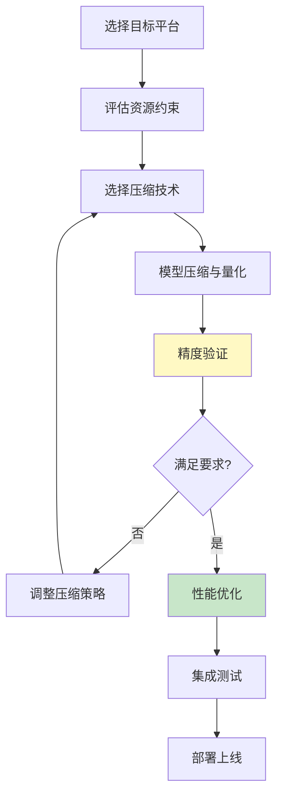
```mermaid
graph TB
    A[选择目标平台] --> B[评估资源约束]
    B --> C[选择压缩技术]
    C --> D[模型压缩与量化]
    D --> E[精度验证]
    E --> F{满足要求?}
    F -->|否| G[调整压缩策略]
    G --> C
    F -->|是| H[性能优化]
    H --> I[集成测试]
    I --> J[部署上线]
    
    style E fill:#fff9c4
    style H fill:#c8e6c9
```

### 7.2 常见问题与解决方案

| 问题 | 原因 | 解决方案 |
|------|------|----------|
| 精度下降过大 | 量化过度 | 使用混合精度或 QAT |
| 推理速度慢 | 模型未优化 | 使用 TensorRT 加速 |
| 内存溢出 | 模型太大 | 更激进的压缩或云边协同 |
| 功耗过高 | 持续推理 | 动态推理，按需触发 |
| 部署失败 | 算子不支持 | 替换不支持的算子 |

---

## 8. 关键论文

- **[DMBD'25] Edge-Optimized Multimodal Learning for UAV Video Understanding via BLIP-2**  
  [](https://arxiv.org/abs/2601.08408)
  冻结 BLIP-2 外挂 YOLO-World / YOLOv8-Seg 的无人机视频理解平台

- **[CVPR'26] AVION** — *AVION: Aerial Vision-Language Instruction from Offline Teacher to Prompt-Tuned Network*  
  [](https://arxiv.org/abs/2603.12659)
  冻结 GeoRSCLIP 大模型 → 只训 prompt 的小模型（遥感 PEFT 蒸馏）

- **[arXiv'26.03] CARLA-Air** — *CARLA-Air: Fly Drones Inside a CARLA World -- A Unified Infrastructure for Air-Ground Embodied Intelligence*  
  [](https://arxiv.org/abs/2603.28032)
  仿真基础设施：统一城市驾驶与多旋翼飞行


---

---

## 9. 动手验证：量化的代价为什么不是一个固定折扣率？

3.2 节的表把量化写成一行一行的折扣率：INT8 保持 97-99%，INT4 保持 93-97%，仿佛损失只由位宽决定、与任务无关。这个说法可以直接测，前置条件只有一个——找一个能分辨小退化的任务。

分类任务做不到。第一版在左亮右暗对上下亮暗的二分类上试，INT8、INT6、INT4 的准确率全是 1.0000，一位没掉：任务太容易，网络饱和到量化伤不到它。换成回归（从 32×32 的图预测光斑的连续侧向偏移）曲线才出来。

做法是最朴素的训练后量化（PTQ）：正常训练一个三层小卷积网，训练完把权重按对称均匀量化折到整数格点上，激活动保持 FP32 不动。真正要小心的地方不在量化，在训练本身——1500 步 Adam 最后落在哪个盆地，本身就带随机性，同一段代码换个 BLAS 线程数，INT8 的退化就能从 +16% 翻到 −6%。所以每一档都跑 10 颗独立种子，先看它在种子之间会不会翻号。

### 9.1 逐通道一个 scale，然后逐档量化

```python
import copy
import torch, torch.nn as nn, torch.nn.functional as F
torch.manual_seed(0); torch.set_num_threads(4)      # 线程数会改归约顺序，数字跟着变
SIZE, N, SWING, SIG, SEEDS = 32, 4096, 9.0, 2.0, range(10); deg = {b: [] for b in (8,6,4,3,2)}
def data(n, seed):                                  # 目标 = 光斑的归一化侧向偏移
    g = torch.Generator().manual_seed(seed)
    t = torch.rand(n, generator=g) * 2 - 1
    ax = torch.arange(SIZE, dtype=torch.float32); cx = (16 + SWING * t)[:, None, None]
    img = torch.exp(-((ax[None,None,:]-cx)**2 + (ax[None,:,None]-16)**2) / (2*SIG**2))
    return img[:, None], t
class Net(nn.Module):                               # 三层小卷积 + 线性头，回归出偏移量
    def __init__(s):
        super().__init__()
        s.body = nn.Sequential(nn.Conv2d(1,8,3,padding=1), nn.ReLU(),
                               nn.Conv2d(8,16,3,padding=1,stride=2), nn.ReLU(),
                               nn.Conv2d(16,16,3,padding=1,stride=2), nn.ReLU(),
                               nn.AdaptiveAvgPool2d(2), nn.Flatten(), nn.Linear(64,1))
    def forward(s, x): return s.body(x).squeeze(-1)
def quant(w, bits):                                 # 对称均匀量化：逐输出通道各用一个 scale
    qmax = 2**(bits-1) - 1
    sc = w.abs().flatten(1).amax(1).clamp(min=1e-12) / qmax
    sc = sc.view(-1, *[1] * (w.dim() - 1))          # 广播回权重形状
    return (w / sc).round().clamp(-qmax-1, qmax) * sc
for s in SEEDS:                                     # 每颗种子重采训练集与初始化
    torch.manual_seed(s)
    xtr, ttr = data(N, s); xte, tte = data(1024, s + 100)
    net = Net(); opt = torch.optim.Adam(net.parameters(), lr=3e-3)
    g = torch.Generator().manual_seed(s + 1)
    for _ in range(1500):                           # 训练用的全是真值目标，与量化无关
        i = torch.randint(0, N, (64,), generator=g)
        opt.zero_grad(); F.mse_loss(net(xtr[i]), ttr[i]).backward(); opt.step()
    net.eval(); base = (net(xte) - tte).abs().mean().item()
    for bits in deg:                                # 只换权重，激活动都不动（PTQ）
        q = copy.deepcopy(net)
        with torch.no_grad():
            for m in q.modules():
                if isinstance(m, (nn.Conv2d, nn.Linear)): m.weight.copy_(quant(m.weight, bits))
        deg[bits].append((q(xte) - tte).abs().mean().item() / base - 1)
for bits, d in deg.items():
    print(f"INT{bits} 均值 {sum(d)/len(d):+7.1%} {min(d):+7.1%} ~ {max(d):+7.1%}{'   跨过 0' if min(d) < 0 < max(d) else ''}")
```

注意第 3 行的 `set_num_threads`：它看着与量化无关，实际上决定了后面所有数字。这不是讲究，是这次测量的前提。

### 9.2 本地实测结果

```text
PTQ 只量化权重、激活不动；10 次独立训练（训练集与初始化都重采）
  FP32 基准自身：0.0093 ~ 0.0180（0.08 ~ 0.16 像素），光是换颗种子训练就差 93%
  —— 网络落在哪个盆地是随机的，所以下面每一档都是配对比较（同一颗种子训出的模型，只换权重），
     判据是：这一档的退化在 10 颗种子上会不会翻号

  位宽            相对 FP32 均值        最小        最大          跨过 0（分辨不出）
  INT8               8.2%     -9.1%     56.4%                  是
  INT6              54.4%    -19.3%    222.5%                  是
  INT4             371.3%     23.5%    874.7%                  否
  INT3            1108.9%    490.7%   2716.0%                  否
  INT2            3377.7%   1340.0%   6283.1%                  否
```

先看一个容易忽略的对照：FP32 基准自身在各颗种子之间就相差 93%。也就是说这张网每次训练落到哪里，带来的波动比 INT8 那一档的效应还大。

于是第一件事的结论只能是负面的：**INT8 这一档，10 颗种子给出的退化从 −9.1% 摆到 +56.4%，区间跨过 0；INT6 同样跨过 0。** 说 INT8 几乎无损，和说 INT8 退化一半，都能从这簇实验里挑出证据来。文档那句 INT8 保持 97-99% 在这个规模上既证实不了也证伪不了——它不是错，是量不出来。而从 INT4 往下 10 颗种子全部同号，最乐观的一颗也涨了 23.5%，已经远超文档给 INT4 的 93-97%。**能确定的是断崖存在，不是打折的倍数；门槛具体落在哪一格，这个规模的实验定不出来。**

第二件事是文档列为 VLM 量化首条挑战的数值范围差异，它也可以量。造一个把视觉特征投到语言维度的投影层，256 个输出通道里有 3 个的量级是其余的 40 倍（真实 VLM 里视觉侧总有几个暴走通道），再用两种 scale 策略量化：

```text
一个投影层里混进 3 个量级 40 倍的离群通道后，权重的相对误差
  方案                            全体       离群那 3 个通道      其余 253 个
  INT8 逐张量                  33.1%           0.8%        33.5%
  INT8 逐通道                   0.7%           0.7%         0.7%
  INT4 逐张量                  99.0%          15.1%       100.0%
  INT4 逐通道                  13.5%          14.1%        13.5%
```

全张量共用一个 scale 时，分辨率被那 3 个离群通道吃光：它们自己只差 0.8%，其余 253 个通道却差 33.5%；到 INT4 更是 100%，即普通通道的权重被整体舍入到 0。改成逐通道各用一个 scale，两组都回到 0.7%。**同一个位宽，代价可以差近 50 倍，全看 scale 怎么给。** 这就是为什么把视觉编码器和语言模型塞进同一套量化配置会出事：两边数值范围不同，共享 scale 总有一边被牺牲——它不表现为整体精度下降，而表现为其中一侧静默失效。

第三件事针对生成任务。语言模型的输出要 argmax，没有轻微的错这一档，所以量化对它的伤害方式与回归不同。把注意力的 logits 量化，同时看概率偏移和 argmax 翻转：

```text
注意力 logits 量化后（64 个 key、256 个 query）

  已除 sqrt(d)：logits 标准差 0.99，量程 ±4.3
    位宽          步长     softmax L1 偏移      argmax 翻转率        翻转上界
    8        0.034            0.84%           0.8%       9.4%
    6        0.140            3.41%           6.6%      32.4%
    4        0.620           15.00%          32.8%      84.0%
    3        1.447           34.41%          58.2%      99.2%
```

INT8 档概率只偏了 0.84%，argmax 已经翻了 0.8%；到 INT4 翻了 32.8%。翻转需要前两名的间隔被量化步长盖过——这一步不量化也能算出来，表里最后一列就是满足它的行占比，因此是翻转率的严格上界。但它松得多，实测只有它的十分之一到五分之三：满足条件的行里大多数并没有真的翻。

顺带一个反直觉的副产品：同一份 q/k，把 sqrt(d) 缩放去掉（logits 量程从 ±4.3 涨到 ±34.7），argmax 翻转率一模一样，一位不差。原因是量化步长取自本张量的 amax，整体乘一个常数会把步长和前两名间隔按同一比例缩放，谁赢谁输不变。但 softmax 不是尺度不变的，同样的相对量化误差在没缩放的那组造成的概率偏移大得多（INT4：15.0% → 46.8%）。**缩放错误伤的不是排序，是注意力有多集中。**

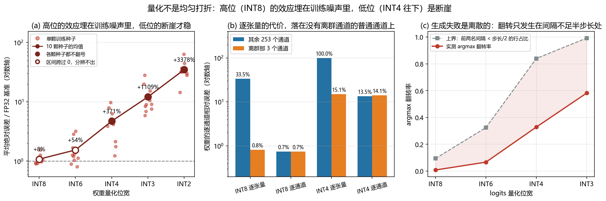

> **限制**：这是 32×32 的玩具回归加一个几千参数的小卷积网，不是真 VLM。绝对值不能外推到任何 benchmark 数字上，它能支撑的只有位宽与退化的关系不是线性折扣这个定性结论。
> 只量化了权重，激活保持 FP32。真实的 PTQ 通常连激活一起量化，而激活的动态范围比权重更难处理，逐张量的激活量化会比这里的数字更差。
> 量化方式是没有任何补偿的对称均匀量化，没有用 QAT、GPTQ、AWQ 这类方法，所以这是坏情况，不代表这些方法能达到的水平。体积比那张表也只看权重，不含激活与 KV cache。
> 10 颗种子的区间只是粗估。区间跨过 0 不等于真的没有效应，只说明这个规模分辨不出来——要缩小区间得加种子，不是加结论。

### 9.3 运行完整脚本

```bash
py -3.9 code/n_quant_bits.py    # 约 1 分 40 秒，CPU 即可，只需 torch
```

完整脚本在 [`code/n_quant_bits.py`](../../code/n_quant_bits.py)，额外打印 FP32/FP16/INT8/INT4/INT3 的体积比精确算术（7B 参数下依次 28.0 / 14.0 / 7.0 / 3.5 / 2.6 GB）、上面第三件事里没缩放那一组的完整对照表，并输出本节这张三格图。

---

## 10. 动手验证：模型那一侧的账，换板子压不动

论文没有给出 Jetson 上的实测数据，4.1 节因此不给部署性能表。这里换一个更基本的问题：**一个模型的显存占用里，哪些值换板子能变，哪些换了也带不走？**

先把能溯源的部分算清楚。BLIP-2 的 `ViT-g + FlanT5-XL` 配置共约 **4.1B** 参数（`arXiv:2301.12597` 表 2），权重单独一项在各精度下是：

| 权重精度 | 权重占用 | 16 GB 板 | 8 GB 板 | 4 GB 板 |
|---------|---------|---------|---------|---------|
| fp16 | 7.6 GB | 装得下 | 装不下 | 装不下 |
| INT8 | 3.8 GB | 装得下 | 装得下 | 临界 |
| INT4 | 1.9 GB | 装得下 | 装得下 | 装得下 |

算法只有一步：`4.1e9 × 2 / 1 / 0.5 字节 ÷ 2^30`。**只算权重，不含激活、KV cache 与运行时开销。**

这张表只回答「权重放不放得进去」，不回答「跑不跑得动」。论文自己在离散 GPU 上量到的**峰值是约 17 GB**——权重按 fp16 只有 7.6 GB，多出来的约 9 GB 是激活、KV cache 和框架开销。**这一块换板子不会变小。**

### 10.1 正确的读法

把显存拆成两截看：**权重那一截是模型的属性**（换板子压不动，只能动精度或动结构）；**剩下那一截是运行时与任务规模的属性**（换板子同样压不动，只能动序列长度和 batch）。而能靠「换硬件」改变的只有**延迟本身**，延迟恰恰是本卷三篇论文都没有测的东西——这也正是 4.1 节不给部署性能表的原因：论文没有端侧的延迟与内存数字，任何把两者并排的对比都无源可溯。

### 10.2 这笔账怎么算出来

`code/o_budget.py` 把四项开销分开量：**权重 / 梯度 / 优化器状态是精确算术**（直接给公式，优化器状态还真走一步 Adam 数字节），**激活用 `saved_tensors_hooks` 实测**（并按 storage 指针剔除参数本身，避免重复计入）。

它同时演示了「同一件事各处算出来不一样」的成因：同一个 7B 模型的 LoRA 微调，一处写 18 GB、一处 24 GB、一处 40 GB——差的不是精度，是那张表从没写过的自变量**序列长度**。

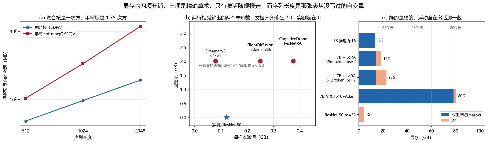

### 10.3 运行完整脚本

```bash
py -3.9 code/o_budget.py    # 约 2 分钟，CPU 即可，只需 torch 与 torchvision
```

---

## 11. 扩展阅读

- [Edge-Optimized Multimodal Learning for UAV Video Understanding via BLIP-2](https://arxiv.org/abs/2601.08408)
- [AVION: Aerial Vision-Language Instruction from Offline Teacher to Prompt-Tuned Network](https://arxiv.org/abs/2603.12659)
- [CARLA-Air: Fly Drones Inside a CARLA World](https://arxiv.org/abs/2603.28032)
- [BLIP-2: Bootstrapping Language-Image Pre-training with Frozen Image Encoders and Large Language Models](https://arxiv.org/abs/2301.12597) — 4.1 节参数规模的出处
- 相关章节：[什么是VLM](../01-基础概念/02-什么是VLM.md) — VLM 基础架构
- 相关章节：[LLM驱动的无人机Agent](./03-LLM驱动的无人机Agent.md)
- [研究空白与机会](../08-研究前沿与开放问题/02-研究空白与机会.md) — VLM方向的开放问题
- [论文批判性阅读](../08-研究前沿与开放问题/03-论文批判性阅读.md) — 如何评价VLM论文
- [可复现项目候选清单](../07-实践指南/08-可复现项目候选清单.md) — 选择复现项目

---

## 12. 思考题

### 题目 1：4.1 节那篇论文自己报的峰值显存约 17 GB。如果要在 8 GB 的 Jetson Orin Nano 上跑它，你能从论文里得到什么结论、又不能得到什么结论？

<details>
<summary>查看答案</summary>

**能得到的结论**：
1. **17 GB 是在离散 GPU 上量到的峰值**，且论文只有 Table 1（载入/速度/显存/GPU 占用）与 Table 2（LVIS 零样本检测 AP）两张表，**没有任何边缘平台上的数据**
2. 权重按 fp16 只有 7.6 GB（4.1B 参数），所以 17 GB 里约 9 GB 是激活、KV cache 与运行时开销——**这一部分换板子不会变小**
3. 因此「这篇论文证明了 BLIP-2 能跑在 Jetson 上」**不成立**：论文没有做这个实验

**不能得到的结论**：
1. **不能说它在 Orin Nano 上跑不动** —— 论文没测，任何方向的断言都缺证据
2. **不能拿 17 GB 去减 8 GB 算缺口** —— 峰值显存随序列长度与 batch 变化，不是模型的常数属性
3. **不能靠降精度直接推** —— 把权重压到 INT8 只省下 3.8 GB 权重差，那 9 GB 的运行时开销不随权重精度线性下降

**真要回答这个问题，需要做的测量**：在同一块板子上，用同一份输入规格（分辨率、序列长度、batch），量 INT8/INT4 下的峰值显存与端到端延迟。这正是本卷反复出现的缺口——**三篇论文都没有端侧数字**。

</details>

### 题目 2：AVION 的蒸馏权重是手设常数（λ_img=0.5、λ_text=0.5、λ_logit=1.0，τ=2），不是学出来的。什么情况下值得改成自适应权重，什么情况下不值得？

<details>
<summary>查看答案</summary>

**值得改成自适应的情形**：
1. **损失项之间量纲冲突**：图像对齐、文本对齐、logit 蒸馏三项的梯度尺度不固定，手设常数要反复试
2. **数据分布差异大**：多个遥感数据集混训时，各数据集的「该学哪一侧」不同
3. **有可靠的验证集**：自适应权重需要一个能代表目标分布的验证集来驱动，没有它就是在噪声上调参
4. **损失项多**：超过 3–4 项以后手调组合爆炸

**不值得改的情形**：
1. **损失项少且同量纲**：AVION 就是这一种——三项权重、量级接近，0.5/0.5/1.0 一套常数跨六个数据集都成立
2. **验证集小或带偏**：自适应机制会把验证集的偏差学进权重，比固定权重更不稳
3. **要可复现**：固定常数是别人抄得走的，学出来的权重还依赖随机种子
4. **算力紧**：自适应权重需要额外的验证集前向，本身就是额外开销

**关键判据**：先问「这套常数是不是已经在多个数据集上都成立」。AVION 的答案是「是」——那就说明这一层的任务**不需要**自适应，加机制只是加复杂度。

</details>

### 题目 3：设计一个无人机 VLM 边缘部署方案，需要考虑哪些关键因素？画出系统架构图。

<details>
<summary>查看答案</summary>

**关键考虑因素**：

1. **硬件选择**：根据算力、功耗、尺寸、成本选择合适的计算平台
2. **模型选择**：根据任务需求选择合适的 VLM 规模
3. **压缩策略**：根据精度要求选择压缩技术
4. **推理优化**：使用 TensorRT 等工具优化推理
5. **系统集成**：与飞控、传感器等模块的集成
6. **安全机制**：故障检测、降级策略、人工接管
7. **更新机制**：模型在线更新、A/B 测试

**系统架构图**：

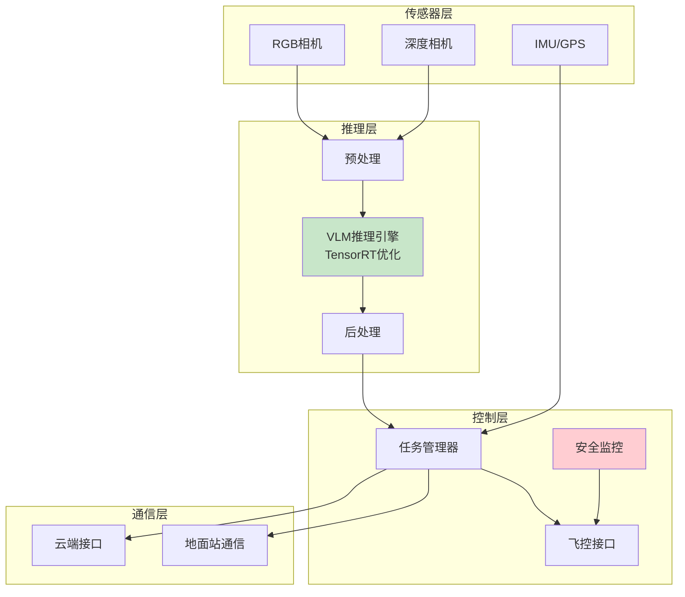
```mermaid
graph TB
    subgraph 传感器层
        A1[RGB相机]
        A2[深度相机]
        A3[IMU/GPS]
    end
    
    subgraph 推理层
        B1[预处理]
        B2[VLM推理引擎<br/>TensorRT优化]
        B3[后处理]
    end
    
    subgraph 控制层
        C1[任务管理器]
        C2[安全监控]
        C3[飞控接口]
    end
    
    subgraph 通信层
        D1[地面站通信]
        D2[云端接口]
    end
    
    A1 --> B1
    A2 --> B1
    A3 --> C1
    
    B1 --> B2
    B2 --> B3
    B3 --> C1
    
    C1 --> C3
    C2 --> C3
    
    C1 --> D1
    C1 --> D2
    
    style B2 fill:#c8e6c9
    style C2 fill:#ffcdd2
```

</details>

---

> **读完了自测**：[VLM 专题自测](../09-专题自测与考察/03-VLM专题自测.md) — 三层考察加无人机专场 12 问，答不上来的顺着指针回读
