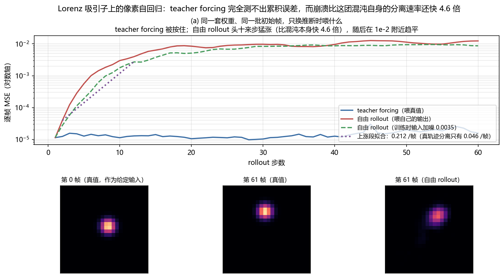

# 视频生成世界模型 (Video Generation World Models)

> 预计阅读：12 分钟 | 前置知识：了解扩散模型和视频生成基础
>
> **范围说明（2026-10）**：本篇的"四种能力阶段"来自综述 §5.1 与 Table 2；下面「通用视频世界模型」表**不是综述的引用**，是本仓库补的知名工作；「无人机视频世界模型」整张表也是本仓库补充——arXiv:2605.00080 全文不含任何无人机内容。文内已逐处标注。

---

## 核心思想

用**视频生成模型**作为世界模型的实现——给定当前帧和动作条件，生成未来的视频帧。

```
输入: 当前帧 + 动作条件 → 视频生成模型 → 输出: 预测的未来视频
```

---

## 四种能力阶段

综述 §5.1 把这条线分成**四个**阶段（Table 2 同此分组）：*"we organize the literature into four stages of progression: video generation as imagination for policy learning, action-controllable rollout models, structure-aware generation with richer interaction priors, and foundation-scale video backbones adapted into reusable world models."*

### 阶段一：想象式生成 (Imagination-based)

从当前帧"想象"未来可能发生什么：

```
当前帧 → 扩散模型 → 多种可能的未来视频
```

**特点**：
- 多样性：可以生成多种不同的未来
- 创造性：可以"想象"未见过的场景
- 不确定性：每一步都可能有多种结果

### 阶段二：动作可控的 rollout (Action-Controllable)

把动作作为显式条件接进生成过程，生成的是"在这个动作下会发生什么"，而不只是"可能发生什么"。这一步让生成结果能被策略用起来。

### 阶段三：结构感知生成 (Structure-Aware)

在生成里注入更丰富的交互先验（几何、物理、3D 结构），让生成出的未来更符合真实世界约束。

### 阶段四：基础规模公式化 (Foundation-scale)

用大规模预训练的视频生成模型作为通用世界模型：

```
大规模视频预训练 → 通用世界模型 → 微调到特定领域
```

**特点**：
- 通用性：预训练后可适配多种场景
- 质量：大规模数据带来更好的生成质量
- 成本：需要大量计算和数据

> **勘误（2026-10）**：本节早先写作「**两种范式**：想象式 / 基础规模」，把综述的四阶段压成了两类。综述 §5.1 与 Table 2 明确是四阶段（想象式生成 / 动作可控 / 结构感知 / 基础规模），已补齐。

---

## 代表模型

### 通用视频世界模型（非综述引用，本仓库补充）

| 模型 | 年份 | 核心创新 |
|------|------|----------|
| **Cosmos** (NVIDIA) | 2025 | 大规模视频世界模型（综述只引用了 *Cosmos Predict 2.5 (Ali et al., 2025)*） |
| **Genie** (DeepMind) | 2024 | 从视频学习交互式世界（综述未引用原版 Genie，只引了 Genie Envisioner） |
| **Sora** (OpenAI) | 2024 | 视频生成的里程碑（综述未引用） |
| **GAIA-1** (Wayve) | 2023 | 自动驾驶世界模型（综述在 §6.2 驾驶章引用） |

### 无人机视频世界模型（非综述引用，本仓库补充）

| 模型 | 年份 | 核心创新 |
|------|------|----------|
| **FlightDiffusion** | 2025 | 扩散模型生成FPV视频 |
| **AirScape** | 2025 | 可控相机运动（文本"运动意图"）的航空世界模型 |
| **MotionScape** | 2026 | 运动分层的无人机视频基准（228 段 / 62,700 帧） |
| **Genie Envisioner** | 2025 | 机器人视频生成 |

---

## 扩散模型作为世界模型

### 基本原理

```
前向过程: 真实视频 → 逐步加噪 → 纯噪声
反向过程: 纯噪声 → 逐步去噪 → 生成视频
```

### 条件生成

```
输入: 当前帧 (作为条件) + 动作序列 (作为条件)
         ↓
   条件扩散模型
         ↓
输出: 符合条件的未来视频
```

---

## 无人机领域的应用

### FlightDiffusion

**论文**：FlightDiffusion: Revolutionising Autonomous Drone Training with Diffusion Models Generating FPV Video

**核心思路**：
1. 从单帧生成多样FPV视频轨迹
2. 同时生成对应的action space
3. 用合成数据训练飞行策略

**关键结果**：
- 位置误差：0.25m (RMSE 0.28m)
- 姿态误差：0.19 rad (RMSE 0.24rad)
- 仿真和真实无显著差异 (p=0.541)
- 成功率：仿真和真实均约62%

**范式创新**："扩散推理作为统一导航、动作生成和数据合成的范式"

### AirScape

**核心创新**：
- 专门为航空视角设计的世界模型
- 可控制相机运动参数
- 生成逼真的航空视频序列

---

## 视频世界模型的用途

### 1. 数据增强

```
少量真实数据 → 视频世界模型 → 大量合成数据 → 训练策略
```

### 2. 想象训练

```
在世界模型中"想象"飞行 → 训练策略 → 部署到真实环境
```

### 3. 演示生成

```
语言描述 → 视频世界模型 → 生成演示视频 → 模仿学习
```

### 4. 安全评估

```
候选动作 → 视频世界模型 → 预测后果 → 评估安全性
```

---

## 视频世界模型的挑战

### 1. 计算成本高

视频生成需要大量计算：
- 训练：需要大规模GPU集群
- 推理：单帧生成需要数秒到数分钟

### 2. 物理一致性

生成的视频可能不遵守物理规律：
- 物体穿模
- 不合理的运动轨迹
- 光照不一致

### 3. 长视频一致性

多步生成后，视频质量下降：
- 累积误差
- 风格漂移
- 时间不一致

### 4. 无人机特殊挑战

- 3D视角变化大
- 快速运动模糊
- 光照变化剧烈
- 需要6-DoF轨迹控制

---

## 与世界模型作为模拟器的区别

| 维度 | 视频生成世界模型 | 隐空间世界模型 |
|------|----------------|---------------|
| **输出** | 像素级视频 | 隐空间表示 |
| **质量** | 视觉上逼真 | 可能不直观 |
| **计算成本** | 高 | 低 |
| **物理一致性** | 可能违反 | 通常更好 |
| **用途** | 数据增强、可视化 | 策略训练、规划 |

---

## 动手验证：多步生成的质量是怎么"累积"掉的？

「长视频一致性」一节把多步生成后的质量下降归成三条：累积误差、风格漂移、时间不一致。第一条是根子，但它光靠文字说不透——"累积"到底是线性的还是指数的、涨多快、会不会一直涨下去，都不是一眼能看出来的。这一节把一条自回归视频模型的误差曲线量出来。

做法是造一条能自己滚下去的像素序列：一个高斯亮斑沿 Lorenz 吸引子的 (x, y) 投影移动，每帧 24×24 像素、帧间 dt = 0.05。世界模型就是最朴素的像素自回归——看连续两帧、预测下一帧，训练时喂的全是真值帧对（teacher forcing）。**训练和推断唯一的差别，是推断时喂的是它自己刚生成的帧。**

选 Lorenz 是有意的。第一版让亮斑走正弦轨迹，结果 teacher forcing 和自由 rollout 的误差**都是平的**——那条轨迹的动力学是稳定的，模型每步重看完整画面就把误差纠了回来。得动力学本身会把邻近轨迹推开，"累积"才会显形。Lorenz 是混沌的，邻近轨迹按 e^(λ₁t) 分离，这个速率可以自己数值量出来，正好当参照。

> 本节量的是**机制**，不是某个真实视频模型的指标：24×24 的灰度亮斑、MLP 世界模型、没有纹理也没有光照，与 FlightDiffusion 那类扩散模型的退化形态（风格漂移、闪烁）不是一回事。这里的动力学还是确定的混沌系统，没有随机性成分。

### 两行输入、一行输出，只差喂什么

```python
import numpy as np, torch, torch.nn as nn
torch.manual_seed(0); D, T, DT, H = 24, 64, 0.05, 60    # 画面 24x24、每条 64 帧、帧间 0.05 s
SIG, LO, HI = 1.3, np.array([-20., -28.]), np.array([20., 28.])
def rk4(s, dt):                                     # Lorenz: sigma=10, rho=28, beta=8/3
    f = lambda a: np.array([10*(a[1]-a[0]), a[0]*(28-a[2])-a[1], a[0]*a[1]-8/3*a[2]])
    k1 = f(s); k2 = f(s+dt/2*k1); k3 = f(s+dt/2*k2)
    return s + dt/6*(k1 + 2*k2 + 2*k3 + f(s+dt*k3))
def seqs(n, seed):                                  # 混沌轨迹 -> 高斯亮斑视频，展平成像素向量
    rng, g, out = np.random.default_rng(seed), np.arange(D, dtype=float), []
    for _ in range(n):
        s = rng.normal(0, 8, 3)
        for _ in range(4000): s = rk4(s, DT)        # 先跑掉瞬态，落到吸引子上
        one = []
        for _ in range(T):
            px, py = 3 + (s[:2]-LO)/(HI-LO)*(D-7)   # (x, y) 铺到画布中间
            one.append(np.exp(-((g[None,:,None]-px)**2 + (g[None,None,:]-py)**2)/(2*SIG**2)))
            s = rk4(s, DT)
        out.append(np.stack(one))
    return torch.tensor(np.stack(out), dtype=torch.float32).reshape(n, T, -1)
def train(fr, steps=2000):                          # 训练对全部采自真值序列
    m = nn.Sequential(nn.Linear(2*D*D,256), nn.SiLU(), nn.Linear(256,256), nn.SiLU(),
                      nn.Linear(256,D*D))            # D*D：一帧展平后的像素数
    opt, rng = torch.optim.Adam(m.parameters(), lr=2e-3), torch.Generator().manual_seed(1)
    cur = torch.cat([fr[:,:-2], fr[:,1:-1]], -1).reshape(-1, 2*D*D); nxt = fr[:,2:].reshape(-1, D*D)
    for _ in range(steps):
        i = torch.randint(0, cur.shape[0], (64,), generator=rng)   # 与完整脚本同一套种子
        opt.zero_grad(); (m(cur[i]) - nxt[i]).pow(2).mean().backward(); opt.step()
    return m.eval()
@torch.no_grad()
def rollout(m, fr):                                 # 同一套权重跑两遍，只有「喂什么」不同
    err_tf, err_free, free = [], [], torch.stack([fr[:,0], fr[:,1]], 1)     # 自由 rollout 只能靠自己
    for k in range(H):
        truth, p = fr[:, k+2], m(torch.cat([free[:,0], free[:,1]], -1)).clamp(0,1)
        err_tf.append((m(torch.cat([fr[:,k], fr[:,k+1]], -1)).clamp(0,1) - truth).pow(2).mean(-1))
        err_free.append((p - truth).pow(2).mean(-1))
        free = torch.stack([free[:,1], p], 1)
    return torch.stack(err_tf).mean(1), torch.stack(err_free).mean(1)
tf, free = rollout(train(seqs(64, 0)), seqs(32, 99))
for k in (1, 6, 12, 24, 48, 60):
    print(f"第 {k:2d} 步  teacher forcing {tf[k-1]:.2e}   自由 rollout {free[k-1]:.2e}")
```

`rollout` 里这两行是本节的全部：`err_tf` 那行走的是真值帧对 `fr[:, k]` 和 `fr[:, k+1]`，`err_free` 那行走的是 `free` 里的两帧，而 `free` 只由模型自己的输出更新。同一个 `m`、同一个循环，两条曲线从此分道扬镳。

`.clamp(0, 1)` 是必要的：真实像素生成器的输出有界，不钳的话线性输出头会一路飘到 `inf`，量到的就成了"数值溢出"而不是"画面崩了"。

### 本地实测结果

```text
真轨迹对的实测分离速率 = 0.0460 /帧（256 对初始点、60 帧上平均，全程在线性区）
每条序列 64 帧，每帧 24x24 = 576 像素；训练 64 条，留出 32 条

  rollout 步数                1           6          12          24          48          60
  teacher forcing    1.14e-05    1.45e-05    1.29e-05    1.15e-05    1.59e-05    1.59e-05
  自由 rollout         1.14e-05    1.01e-03    3.97e-03    8.40e-03    1.24e-02    1.24e-02
  自由+输入加噪            1.16e-05    3.29e-04    2.71e-03    6.93e-03    9.14e-03    8.69e-03
```

teacher forcing 那一行从第 1 步到第 60 步只在 9.77e-06–3.02e-05 之间浮动，不随步数增长——每步都从真值出发，误差没有机会留下来。同一套权重、同一批初始帧，只把"喂真值"换成"喂自己的输出"，第 60 步的误差就变成 1.24e-02，是第 1 步的 1084 倍、同时刻 teacher forcing 的 778 倍。

这个数折算成画面更直观：1.24e-02 的 MSE 相当于亮斑位置偏了 **2.7 个像素**，而 teacher forcing 的 1.59e-05 只相当于 0.08 个像素。也就是说训练时那个"完美"的读数完全没有预警作用——它盯着的是一条永远不会出错的输入，而推断时喂进去的东西第一帧就已经不对了。

上涨集中在头十来步：第 2→12 步的等效放大速率是 0.212 /帧，比真轨迹之间的 0.046 /帧 **快 4.6 倍**。这一点值得留意——如果崩溃只是混沌固有的可预报性极限，模型误差该按 0.046 /帧 涨；快出 4.6 倍说明这段塌方主要是模型自己的问题：一旦输入的帧偏离了它训练时见过的分布，网络的外推行为就不受任何约束了。第 12 步之后曲线在 1e-2 附近趋平，画面崩到一个"糊掉"的稳定状态，不是无限发散。

对照组把训练时的输入掺上噪声（DART 的做法，让模型见过不完美的上一帧），扫了三档：

```text
      输入噪声 sigma              单步误差        第60步误差       放大速率 /帧
      0.0000              1.14e-05      1.24e-02        0.2124
      0.0035              1.16e-05      8.69e-03        0.2302
      0.0100              2.63e-05      1.66e-02        0.1951
      0.0300              9.71e-05      1.89e-02        0.1681
```

噪声的作用是双向的，而且两个方向都看得见：从 0 加到 0.03，单步误差涨了 8.5 倍，放大速率从 0.212 降到 0.168 /帧（降 21%）——抗扰动这一面确实买到了。但代价先到：第 60 步的总误差反而从 1.24e-02 涨到 1.89e-02，比不加噪还差 1.5 倍。

中间那档 σ = 0.0035 是笔不赚不赔的买卖：单步几乎没动（差 1.02 倍），放大速率略升（0.230 对 0.212），而长程 8.69e-03 反过来比基线的 1.24e-02 低——**这一档不要再往下读了**，原因见下面的限制说明。

所以想只靠"在输入上撒噪声"压住累积是划不来的：噪声有效的尺度得跟最终偏差相当，可最终偏差 2.7 个像素远大于单步误差 0.06 个像素，等噪声大到那个份上，单步精度早就赔光了。要真正压住累积，得直接对着 rollout 训练。

> **限制**：本节是 24×24 灰度亮斑 + 三层的 MLP，画面里没有纹理、光照、遮挡，这些正是真实视频模型里最先糊掉的东西；这里的"崩"只表现为亮斑错位和重影。Lorenz 轨迹是确定性的，所以曲线里没有随机种子带来的抖动，但也因此没能覆盖扩散模型采样噪声那一类误差源。误差折算成像素用的是单个高斯亮斑的位移-重合度关系，是个等效读数：模型崩掉时不只是位移，还会把亮斑糊开。放大速率 0.212 /帧 是在第 2–12 步上拟合的，第 12 步之后曲线已经趋平，把整段 60 步一起拟合会得到一个小得多的数。
>
> **σ = 0.0035 那一档为什么不能读**：它不是随机种子那种抖动（本节的轨迹、初始化、批采样全是定死的，同一次设置重跑一定复现），而是它对**画布映射范围**这类与结论无关的设定敏感。把 (x, y) 到像素的映射范围从"由数据算出"改成"写死成 ±20 / ±28"，其余一切不动，这一档的长程读数就从比基线**差** 7% 翻成比基线**好** 30%。同一档在两个稳定复现的设置下给出相反结论，说明这个差别不在该方法本身，而在噪声水平之内。σ = 0.01 与 0.03 两档在两次设置下都稳定地更差，只有它们能当结论。



### 运行完整脚本

```bash
py -3.9 code/m_exposure_bias.py     # 约 2 分钟，CPU 即可，只需 torch + numpy
```

完整脚本在 [`code/m_exposure_bias.py`](../../code/m_exposure_bias.py)，额外打印真轨迹对的分离速率测量细节（256 对初始点、扰动 1e-8、全程在线性区）、三档噪声的完整扫描表，并输出上面这张图，其中第三格并排给出同一时刻的真值帧与自由 rollout 帧。

---

## 延伸阅读

- [生成式世界模型](../02-世界模型专题/02-生成式世界模型.md) — 无人机生成式世界模型详解
- [关键数据集与基准](../02-世界模型专题/06-关键数据集与基准.md) — MotionScape等数据集
- [FlightDiffusion复现指南](../07-实践指南/04-复现指南-FlightDiffusion.md) — 动手实践

---

## 思考题

1. **基本理解**：视频生成世界模型的核心优势是什么？

2. **对比分析**：想象式生成和基础规模公式化有什么区别？各适合什么场景？

3. **无人机应用**：FlightDiffusion如何用扩散模型生成FPV视频？

4. **挑战分析**：视频世界模型的物理一致性问题如何影响无人机应用？

5. **进阶思考**：如何保证生成的视频既视觉逼真又物理正确？

<details><summary>参考答案</summary>

1. 视频生成世界模型的核心优势是可以从当前帧和动作条件直接生成像素级的未来视频，实现数据增强、想象训练、演示生成和安全评估等多种用途，且生成的视频视觉上直观逼真。

2. 想象式生成侧重从当前帧"想象"多种可能的未来，适合需要多样性和不确定性的场景（如数据增强）；基础规模公式化用大规模预训练模型作为通用世界模型再微调，适合需要通用性和高质量的场景，但计算和数据成本更高。

3. FlightDiffusion使用条件扩散模型，以当前帧和动作序列为条件，通过反向去噪过程从纯噪声逐步生成符合动作条件的FPV视频，同时生成对应的action space，实现"扩散推理作为统一导航、动作生成和数据合成的范式"。

4. 生成的视频可能出现物体穿模、不合理的运动轨迹、光照不一致等违反物理规律的问题，在无人机场景下还面临3D视角变化大、快速运动模糊等挑战，这些会导致基于合成数据训练的策略在真实环境中表现下降。

5. 可以采用物理模拟器作为约束或后处理，在扩散过程中引入物理先验（如碰撞检测、运动学约束），或使用物理一致性损失函数训练模型；同时结合隐空间世界模型（物理一致性通常更好）进行联合验证，兼顾视觉逼真性和物理正确性。

</details>
