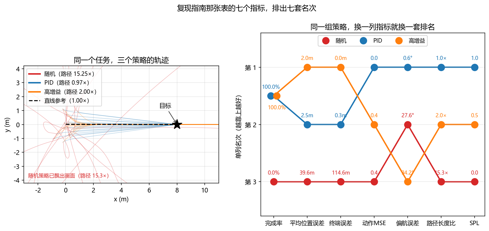

# 03 - 复现指南：CognitiveDrone — 认知任务的无人机 VLA 数据采集与基准

> **预计阅读：14 分钟 | 前置知识：Docker 基本操作、ROS 1 概念、Gazebo 仿真**

CognitiveDrone 有两个部分，常被混为一谈：一篇**论文**（模型 + 基准），和一个**数据采集器仓库**。前者给出方法与数字，后者给出可运行的采集环境。分开看，这份指南才知道自己承诺了什么。

> **本指南的可复现边界（2026-10）**
> - **能复现的**：在 Gazebo + ArduPilot SITL 里搭起认知任务场景、采集并落盘飞行数据、按类别组织验证集。这些都有仓库文件与命令支撑。
> - **不能复现的**：论文里 59.6% / 77.2% 那两个成功率。论文用的是在 4×A100 上微调的 OpenVLA-7B，**没有发布训练代码**；公开产物只有数据集。
> - **本指南早先的版本在这三点上都写错了**：它把采集器描述成 AirSim 环境、把数据说成 HDF5、把模型说成自研的 `CognitiveNet`（ResNet-50 + Transformer）。三处都不是采集器的写法，也不是论文的内容。本版按仓库实际文件与论文原文重写，改动处各留 `> **勘误（2026-10）**`。

---

## 目录

1. [项目概述](#1-项目概述)
2. [仓库结构](#2-仓库结构)
3. [Docker 环境配置](#3-docker-环境配置)
4. [数据采集](#4-数据采集)
5. [模型与推理](#5-模型与推理)
6. [训练流程](#6-训练流程)
7. [评估基准](#7-评估基准)
8. [常见问题与解决方案](#8-常见问题与解决方案)

---

## 1. 项目概述

- **论文**：*CognitiveDrone: A VLA Model and Evaluation Benchmark for Real-Time Cognitive Task Solving and Reasoning in UAVs* — [arXiv:2503.01378](https://arxiv.org/abs/2503.01378)（2025-03）
- **项目页**：<https://cognitivedrone.github.io/>
- **采集器仓库**：[SerValera/docker_CognitiveDrone_DataCollector](https://github.com/SerValera/docker_CognitiveDrone_DataCollector)（46 stars，默认分支 `main`）
- **数据集**：Hugging Face [`ArtemLykov/CognitiveDrone_dataset`](https://huggingface.co/datasets/ArtemLykov/CognitiveDrone_dataset)

论文的贡献是三件：一个无人机 VLA 模型（CognitiveDrone）、它的推理增强版（CognitiveDrone-R1）、以及一个专门评测认知任务的基准（CognitiveDroneBench）。

**谁提供什么**：

| 产物 | 在哪 | 本指南第几节 |
|---|---|---|
| 采集环境（Gazebo + SITL + Realsense 插件） | 采集器仓库 | §3、§4 |
| 训练数据（RLDS 格式的 TFRecord） | HF 数据集 `data/rlds/train/` | §4.5 |
| 评测用的场景 JSON | HF 数据集 `data/benchmark/validation/` | §4.6 |
| 训练好的模型权重 | **未发布** | — |
| 训练与推理代码 | **未发布** | §6 只能给出论文参数 |

**任务设定**：无人机沿一条由多个门（gate）串成的赛道飞行。每一段收到一张第一人称图像和一条文本指令，指令里嵌着一个认知任务（认人、认符号、或做一步推理），无人机必须解出答案、从中选出正确的门、并生成 4D 动作命令飞过去。选对了得 1 分。

**4D 动作的四个维度**：论文记作机体速度与机头轮廓 `(Vx, Vy, Vz, omega)`——三个方向的机体速度指令加偏航。采集脚本把它落盘成四列 `dx, dy, dz, angle`。

> **勘误（2026-10）**：本节早先写「与传统无人机控制使用 4 自由度（油门+偏航+俯仰+横滚）不同，CognitiveDrone 输出**位移增量**……`dx/dy` 限 [-5, 5] 米、`dz` 限 [-3, 3] 米、`dyaw` 限 [-π, π] 弧度」，并称「直接输出位移而非速度，更符合高层语义指令」。
> **这一段是反的，那四组量程也没有出处。** 论文明确写无人机由速度设定值控制：*"the drone in simulation is controlled using velocity setpoints, ensuring consistency with real-world drones running ArduPilot firmware"*，记录的量逐字是 *"the UAV's velocity and the head profile (Vx, Vy, Vz, omega) was continuously logged"*。四个维度本身是真的（采集脚本确实按四列存），但那是**速度量纲的四维指令**，不是位移增量。

### 1.1 三种任务类别

| 类别 | 要求 | 论文原句里的例子 |
|---|---|---|
| **Human Recognition** | 按文本描述的外部特征识别人物 | 导航到某位知名人物对应的门 |
| **Symbol Understanding** | 分辨符号：字母数字、企业标识、动物图案 | — |
| **Reasoning** | 需要一步逻辑推演 | 飞到数字等于算式解的门；「飞到有甜饮料的门」→ 选汽水标识 |

> **勘误（2026-10）**：本节早先写的是「室内导航 2500+ / 室外飞行 2000+ / 精准降落 1500+ / 编队飞行 1000+ / 紧急机动 1000+」五类，还说这是数据集拆分。
> **这五类和这五个数量都是编的。** 论文的三类是认知任务类型，不是飞行场景类型；数据集的按类拆分并未公布。原文：*"over 8,000 simulated flight trajectories across three key categories—Human Recognition, Symbol Understanding, and Reasoning"*。

---

## 2. 仓库结构

```text
docker_CognitiveDrone_DataCollector/
├── Dockerfile                    # 基础镜像 px4io/px4-dev-ros-noetic
├── README.md
├── docker-compose.yaml           # 服务 drone_sim，容器名 sim_workspace
├── config.yaml                   # 采集配置：录哪一类、哪一子类
├── doc/                          # 三份操作手册
│   ├── 0_docker.md               #   容器构建与启动
│   ├── 1_data_sctructure.md      #   数据组织约定（原文件名拼写如此）
│   └── 2_recording.md            #   启动仿真与录制
├── catkin_ws/                    # ROS 1 工作空间
│   └── src/drone_sim/
│       ├── CMakeLists.txt  package.xml
│       ├── launch/               #   launch_world.launch / launch_world_drone.launch / record.launch
│       ├── scripts/              #   spawn_model.py / spawn_model_drone.py / gates_move.py
│       │                         #   camera_move.py / camera_move_bench.py / spline_traj.py
│       │                         #   animate_frame_vector.py
│       ├── objects_tasks/        #   scene_setup.csv（门与标签的位姿清单）
│       ├── models/               #   门、标签等 Gazebo 模型
│       └── worlds/
├── model_for_data_collection/    # 采集用的场景素材
│   ├── Human Recognition/        #   Celebrities/ + Celebrities.json + Patterns/ + Patterns.json
│   └── Reasoning/                #   含 celebs_create_file.ipynb
├── Validation/                   # 一批已采集的验证样本
│   ├── Celebrities_valid.json
│   ├── Math_prompt_valid.json
│   └── Math_prompt_valid/<时间戳>/{setup.json, data.csv, images/image_*.jpg}
└── eval_after_reasoning/         # 推理模块改写后的评测指令
    ├── after_reasoning/          #   各子类的 *_valid.json 与 *_updated.json
    ├── after_reasoning.zip
    ├── combine.py                #   把各 Setup 目录里的 setup.json 汇总成一个 json
    ├── Math_prompt_valid/  Validation_Human_recog/  Validation_reasoning/
    └── ...
```

> **勘误（2026-10）**：本节早先给的结构是 `collector/`、`model/`、`training/`、`evaluation/`、`data/`、`scripts/` 六个顶层目录，下面挂着 `data_collector.py`、`cognitive_net.py`、`train.py`、`evaluate.py` 等等。
> **那整棵树都是编的，一个路径都对不上。** 真实的顶层只有 `Dockerfile`、`README.md`、`Validation/`、`catkin_ws/`、`config.yaml`、`doc/`、`docker-compose.yaml`、`eval_after_reasoning/`、`model_for_data_collection/`。

---

## 3. Docker 环境配置

### 3.1 前置要求

- Docker + Docker Compose
- 一块能被容器访问的 GPU（论文训练用 4×A100，但采集本身不吃多少显存）
- **一个能开 X11 的桌面环境**：Gazebo 与 RViz 都要往宿主机的 X 服务上画窗口

```bash
docker --version
docker compose version
xhost +local:docker          # 放行容器连 X11，重启后要重做
```

### 3.2 克隆并构建镜像

```bash
git clone https://github.com/SerValera/docker_CognitiveDrone_DataCollector.git
cd docker_CognitiveDrone_DataCollector

sudo docker-compose build    # 产出镜像 ardupilot_docker-drone_sim
```

`Dockerfile` 的基础镜像是 `px4io/px4-dev-ros-noetic`，在它之上装 `ros-noetic-rviz`、`ros-noetic-mavros`、`ros-noetic-gazebo-ros-pkgs`、`python3-opencv` 等。

### 3.3 启动容器

手册 `doc/0_docker.md` 给的是这条（要挂 X11 socket 与 `~/.Xauthority`，并映射 14570/udp 给 Gazebo）：

```bash
sudo docker run -it --privileged --ipc=host --net=host \
  -v /tmp/.X11-unix:/tmp/.X11-unix:rw \
  -v ~/.Xauthority:/home/sim/.Xauthority \
  -v ./:/home/sim/ardupilot_docker:rw \
  -e DISPLAY=$DISPLAY -p 14570:14570/udp --name=ardupilot \
  ardupilot_docker-drone_sim:latest bash
```

`--privileged --ipc=host --net=host` 三项都不能省：Gazebo 要共享内存，ROS 主节点和 ArduPilot 的 MAVLink 端口要落在同一网络命名空间里。

如果要用 GPU，手册给了第二条带 `--gpus=all --runtime=nvidia` 的版本。之后进入容器用：

```bash
docker exec -it ardupilot bash
```

`docker-compose.yaml` 里的服务名是 `drone_sim`、容器名 `sim_workspace`，暴露 `14540-14550/udp`、`14570/udp`、`14580/udp` 和 ROS 主节点端口 `11311`。

### 3.4 容器内的一次性安装

`doc/0_docker.md` 把这部分标为「**run ONCE**」，在容器内执行：

```bash
cd ardupilot_docker

# 1) Realsense 的 Gazebo 插件
git clone https://github.com/intel/gazebo-realsense
copy_realsense_plugin

# 2) ArduPilot 本体与依赖
cd ardupilot
Tools/environment_install/install-prereqs-ubuntu.sh -y
. ~/.profile
git submodule update --init --recursive

# 3) ArduPilot 的 Gazebo 插件
cd && git clone https://github.com/khancyr/ardupilot_gazebo
cd ardupilot_gazebo && mkdir build && cd build
cmake .. && make -j4 && sudo make install
```

手册随后还让装 `libcanberra-gtk-module`、`libcanberra-gtk3-module`、`dbus-x11`。

> **注意**：`copy_realsense_plugin` 是容器里预置的脚本（不在仓库里），手册假定它已在 `PATH` 上。找不到就说明用的是没重新 build 的旧镜像。

### 3.5 验证环境

```bash
cd ~/ardupilot_docker
cat config.yaml          # 能读到就说明挂载成功
rosversion -d            # 期望 noetic
```

> **勘误（2026-10）**：本节早先写的是 `docker run --gpus all ... nvidia/cuda:12.1.0-base-ubuntu22.04 nvidia-smi` 加一串 NVIDIA Container Toolkit 的 apt 配置，还有「验证 Python 环境 `python -c "import torch; ..."`」。
> 那套是通用 GPU 容器的模板，**和这个仓库无关**：它的镜像基于 `px4io/px4-dev-ros-noetic`（Ubuntu 20.04 + ROS Noetic），采集器本身是 ROS 节点，跑 `python3-opencv` 而**不依赖 PyTorch**。torch 只出现在论文那侧的模型微调里，而那部分代码没有公开。

---

## 4. 数据采集

### 4.1 配置要录什么

编辑容器内的 `config.yaml`（仓库里就这一份，路径按手册是 `/home/sim/ardupilot_docker/config.yaml`）：

```yaml
DATA_SET_TO_RECORD_PATH: "/home/sim/ardupilot_docker/model_for_data_collection"
CATEGORY: "Reasoning"      # Human Recognition / Symbol Understanding / Reasoning
TYPE: "Animals"            # 该类别下的子类
IS_MATH: False
```

`CATEGORY` 与 `TYPE` 两个字段决定加载 `model_for_data_collection/` 下的哪一组素材与哪份 JSON。`record.launch` 会把这份 `config.yaml` 当 ROS 参数读进去：

```xml
<rosparam command="load" file="/home/sim/ardupilot_docker/config.yaml" />
<node name="spawn" pkg="drone_sim" type="spawn_model.py" output="screen" />
```

### 4.2 启动采集

手册 `doc/2_recording.md` 给的是两个终端（都在容器内）：

```bash
# 终端 1：起仿真。首次运行要等几秒
run

# 终端 2：等 Gazebo 完全加载后开始录制
rec
```

`run` 拉起 Gazebo 世界与 SITL ArduPilot，`rec` 开始往磁盘写这一趟飞行的数据。仿真的物理部分由 **Gazebo + ArduPilot Gazebo 插件 + SITL** 承担，视觉部分由 **Realsense 插件**提供。

> **勘误（2026-10）**：本节早先的配置块是 `environment: {type: "airsim", scene: "neighborhood", weather: [...]}` 加 `sensors: {camera, depth, imu}`、`collection: {num_episodes: 1000, ...}`，并让你跑 `python collector/data_collector.py --config collector/collect_config.yaml`。
> **AirSim、`neighborhood` 场景、`num_episodes`、那个 Python 采集脚本全都不存在。** 仓库 README 逐字写：*"The collector uses a Docker container that integrates ROS1, ArduPilot, Gazebo Classic and the Realsense plugin"*；论文第 III-B 节写 *"The simulation environment is built using Gazebo with the ArduPilot Gazebo plugin and SITL ArduPilot"*。**AirSim 是凭空加进去的**，采集入口是两个 shell 命令 `run` 与 `rec`，不是 Python 脚本。

### 4.3 场景素材怎么组织

`doc/1_data_sctructure.md` 定的约定：一个**类别目录**下放若干个**子类目录**，每个子类目录里放 `.dae` 模型文件，同级的同名 `.json` 提供元数据。

```text
model_for_data_collection/
├── Human Recognition/
│   ├── Celebrities/          # 若干 .dae
│   ├── Celebrities.json
│   ├── Patterns/
│   └── Patterns.json
└── Reasoning/
    └── ...
```

**JSON 里的 `options` 必须与目录里的文件名逐字对上**，手册原话是「Make sure that the items of option parameter of the *.json file have same names from Type folder folder」。例：

```json
"options": ["ten.dae", "eight.dae", "one.dae"]
```

场景里每个门与标签的位姿写在 `catkin_ws/src/drone_sim/objects_tasks/scene_setup.csv`：

```csv
setup,id,model_name,x,y,z,roll,pitch,yaw
setup1,1,gate,4.0,4.0,0.0,0.0,0.0,2.0
setup1,2,gate,5.0,0.0,0.0,0.0,0.0,1.57
setup1,1,label,4.0,4.0,2.75,0.0,0.0,3.57
```

同一套坐标里 `gate` 是门框、`label` 是贴在门上的标签，标签比门高约 2.75 m。

### 4.4 一次任务长什么样

任务是 JSON 定义的。下面是一份真实样本（`Validation/.../setup.json`，只留结构）：

```json
{
    "prompt": "Fly through the gate with number equal 8-8",
    "prompt_simpler": "Fly through the big square blue gate with 0",
    "options": ["zero.dae", "four.dae", "nine.dae"],
    "correct": 1,
    "gates": [
        {"gate": "1", "size": "big",   "shape": "square", "color": "blue"},
        {"gate": "2", "size": "small", "shape": "round",  "color": "red"},
        {"gate": "3", "size": "small", "shape": "triangle", "color": "green"}
    ],
    "background": "room"
}
```

四个字段值得停一下：

- **`prompt`** 是给人看的原始指令，认知任务嵌在里面（`8-8` 要算）。
- **`prompt_simpler`** 是**推理模块改写后的版本**——把「算 8-8 然后选那个数字」压成「选大门里蓝方框上写着 0 的那个」。这正是 CognitiveDrone-R1 里 Qwen2.5-VL 那一步在干的事（§5.2），也是 `eval_after_reasoning/after_reasoning/*_updated.json` 这批文件的内容。
- **`correct`** 是正确选项在 `options` 里的下标。
- **`gates`** 给出每扇门的尺寸/形状/颜色，用于自动判定是否飞对了门。

> **勘误（2026-10）**：本节早先写「数据以 HDF5 格式存储」，并给了一份 `episode_0001.hdf5` 的内含（`rgb / depth / imu / pose / action` 五个数据集），还配了 `python collector/preprocess.py --image_size 224 --normalize_actions true`。
> **HDF5 与那个预处理脚本都不存在。** 数据一是落成 CSV（下一节），二是发到 Hugging Face 时用 **RLDS**（TFRecord）格式。论文原文：*"The collected data was structured in accordance with the Reinforcement Learning Dataset (RLDS) format to ensure seamless compatibility with OpenVLA"*，**RLDS 是 OpenVLA 的输入格式**，不是 HDF5。

### 4.5 落盘的数据长什么样

每一趟飞行在 `Validation/<子类>/<时间戳>/` 下产出三样：`images/image_*.jpg`、`setup.json`（就是上节那份任务定义）、`data.csv`。`data.csv` 的表头是：

```text
frame_id,dx,dy,dz,angle,x,y,z,qx,qy,qz,qw
```

前四列是那一步的 4D 动作（三轴机体速度 + 偏航），后七列是当时的位姿（位置 + 四元数），用来核账。`frame_id` 只是帧序号，**文件里没有时间列**——采样间隔由仿真侧的图像发布频率决定。

真实的前两行（同一趟 `Math_prompt_valid` 的 66 帧里的）：

```text
1,-0.30086071005609044,0.0,0.03553100640177442,0.6682699391985022, ...
2,-0.2971226389535662,0.0,0.03553100640177442,0.6426387677378069, ...
```

`dy` 一直是 0、`dz` 只有 0.036 m/帧，是因为这一趟是直线穿门；`angle` 从 0.668 落到 0.643，正是机头在慢慢对正。**这四列就是「4D 动作」在磁盘上的形态**——不是 §1 勘误里那个位移增量的说法。

### 4.6 公开的数据集怎么用

HF 上的 `ArtemLykov/CognitiveDrone_dataset`（2025-03 上传）分两块：

```text
data/rlds/train/cognitive_drone-train.tfrecord-*-of-00128   # 训练数据，RLDS，128 个分片
data/benchmark/validation/<类别>/<子类>/<时间戳>/setup.json   # 评测用任务定义，218 份
```

按类别数一遍验证集：

| 类别 | 子类（份数） | 小计 |
|---|---|---|
| Human Recognition | celebrities 26、patterns 30 | 56 |
| Reasoning | food 29、math 29 | 58 |
| Symbol Understanding | animal 29、digit 29、letters 24、logo 22 | 104 |
| **合计** | | **218** |

论文正文写训练集是 **8,062 条连续轨迹样本**（摘要里说「over 8,000」），并按类别均衡地分出了训练子集与测试子集——测试子集就是 CognitiveDroneBench。

> **注意分片数**：文件名里的 `of-00128` 说明训练集共 128 个 TFRecord 分片，别按当前能列出的文件数去估规模。

---

## 5. 模型与推理

### 5.1 主干：OpenVLA-7B 微调

论文的模型不是从头设计的网络，是在开源 OpenVLA 上微调的。论文原文：

> *"we integrate a VLA model adapted from the open-source OpenVLA model, which comprises 7 billion parameters"*
> *"The VLA model was fine-tuned using our custom training dataset based on the OpenVLA architecture"*

选 OpenVLA 的理由论文也写了：它擅长捕捉飞行器动力学、以 10 Hz 出高频控制指令；但它对「该选哪扇门」这类任务理解不足——这正是 R1 要补的。

动作侧继承 OpenVLA 的离散化动作 token：论文训练指标里的一项就是 *"Cross-entropy loss measures performance on discretized action tokens"*。

### 5.2 R1：外挂一个 VLM 做「先想后做」

CognitiveDrone-R1 在 VLA 前面加一级 **Qwen2.5-VL** 推理模块，论文原文是 *"we augment our system with an auxiliary reasoning module based on the VLM model Qwen2.5-VL"*。它的作用**不是**自己输出动作，而是**把指令改写得更明确**再交给 VLA：

> *"This reasoning module … is intended to enhance task comprehension … simplify task directives prior to high-frequency control"*

落到数据上就是 §4.4 那个 `prompt` → `prompt_simpler` 的改写。两级分工带来两个硬约束：

| 量 | 只用 VLA | 加推理模块 |
|---|---|---|
| 显存 | 约 10 GB | 约 20 GB |
| 频率 | 10 Hz（出控制指令） | 推理模块约 2 Hz |

> **勘误（2026-10）**：本节早先画的是「视觉输入 + 语言指令 → VLM 推理模块 → 显式推理输出（场景理解 / 空间推理 / 路径规划 / 规划结果）→ 动作生成模块 → 4D 动作」，指令例子是「飞到红色屋顶后面」，还说这是借鉴 Chain-of-Thought 的显式推理链。
> **那张图与那个例子都是编的。** 论文里 R1 的输出是**改写后的一句简化指令**，不是三条分析；场景是赛道与门，不是建筑。真凭实据在数据里：`eval_after_reasoning/` 那批 `*_updated.json` 与每条任务自带的 `prompt_simpler` 字段，就是这个模块的产物。另外本节原先完全没提两个数——**显存 10 GB→20 GB、频率 10 Hz / 2 Hz**——它们才是 R1 的真实代价。
>
> 本节早先还给过一张「自研 `CognitiveNet`：ResNet-50 + 任务嵌入 + 6 层 TransformerEncoder + Linear 4D 头」的结构图与 Python 伪代码。
> **那个网络不存在。** 论文全篇没有 `CognitiveNet`、没有 ResNet-50、没有 Transformer 编码器；模型逐字是 *"The VLA model was fine-tuned … based on the OpenVLA architecture"*。

---

## 6. 训练流程

**代码没有公开**，所以这一节给的是论文里的配置，供你对比自己的实现——不是一份可执行的指南。

| 项 | 值 |
|---|---|
| 基座 | OpenVLA-7B |
| 微调方式 | LoRA，**rank-32** 适配器 |
| batch size | 64 |
| 学习率 | 5 × 10⁻⁴ |
| 梯度步数 | 4000 |
| 图像增强 | **关闭** |
| 硬件 | 4 × NVIDIA A100 |
| 训练侧观测指标 | L1 loss、动作准确率、离散动作 token 的交叉熵 |

论文对 LoRA 的选择给的理由是「optimize memory usage while adjusting a minimal set of trainable weights」——r=32 是在显存与可训练参数量之间取的折中。

> **勘误（2026-10）**：本节早先给过一份 `training/config.yaml`（`backbone: resnet50`、`num_epochs: 50`、`optimizer: adamw`、`loss.action_weight: [1.0, 1.0, 1.0, 0.5]`）、`python training/train.py` 的启动命令、TensorBoard 监控，以及一张三行的显存-时间表（`ResNet-50 batch=16 约 8 GB / batch=32 约 14 GB / ViT-B/16 约 12 GB`）。
> **配置、脚本、表格全是编的**：论文既没有 ResNet-50 这些骨干，也没有那套权重方案，更没有公布任何显存/耗时数字。已整段删除。下面「动手验证」的第一节拿这张表做了一次对账——不是为了复现它，而是为了说明**小模型的显存账为什么算不出来**。
>
> 顺带纠正一个容易传开的说法：**这里的训练不是「无需大量试错」的在线学习**。它是在仿真里采完 8,062 条轨迹后离线做模仿学习，没有用强化学习试错。

---

## 7. 评估基准

### 7.1 CognitiveDroneBench 怎么算分

赛道由多扇门顺序组成，每段给一张第一人称图像和一条指令。**飞对了那扇门得 1 分**，类别得分 = 该类别累计得分 / 该类别满分数；再加一个跨类别的总平均。判定是自动的：门上有标签、`setup.json` 里有 `correct` 下标与 `gates` 位姿，飞错门就没有分。论文原话：*"passing through the correct gate earns the drone 1 point"*。

### 7.2 论文报告的成绩

评测覆盖三个模型。RaceVLA 是在赛车场景训的模型、CognitiveDrone 是本文的基座、CognitiveDrone-R1 加了推理模块：

| 模型 | Reasoning | Human Recognition | Symbol Understanding | **总平均** |
|---|---|---|---|---|
| RaceVLA | 36.2% | 23.1% | 34.6% | **31.3%** |
| CognitiveDrone | 70.7% | 45.2% | 57.7% | **59.6%** |
| **CognitiveDrone-R1** | **75.9%** | **76.8%** | **78.9%** | **77.2%** |

这张表里有三条读法：

1. **赛车模型会飞，但不会选门**。RaceVLA 能稳稳穿过一排门（论文说它「robust understanding of UAV flight dynamics」），可选门的正确率接近随机。**飞得准和选得对是两种能力**，这是本篇 benchmark 想立的那根轴。
2. **基座模型的短板在人身上**。CognitiveDrone 在 Reasoning 上已有 70.7%，但 Human Recognition 只有 45.2%。
3. **推理模块主要补的是人和符号，不是推理**。R1 把 Human Recognition 从 45.2% 提到 76.8%（+31%）、Symbol Understanding 从 57.7% 提到 78.9%（+21%），而 Reasoning 只从 70.7% 到 75.9%（约 +6%）。总平均涨了约 17.6%。**「加个推理模块提升最大的一定是推理任务」这个直觉在这里是错的**——基座的推理本就不弱，被改写指令救回来的是最弱的那两项。

> **勘误（2026-10）**：本节早先给过一张四行的基线对比表，指标是 `ADE / FDE / Yaw Error / Task Completion`，数值是 Random `3.21 / 5.87 / 45.2° / 12.3%`、PID `1.45 / 2.34 / 18.7° / 56.8%`、CNN `0.98 / 1.67 / 12.3° / 72.1%`、CognitiveDrone `0.62 / 1.05 / 8.1° / 87.6%`，还配了一句「先跑 `python evaluation/evaluate.py --model_path ...`」。
> **整表按「合理数值」编造。** 论文的评测指标是**任务成功率**，不是轨迹误差；报告的对照组也不是 Random/PID/CNN，而是 RaceVLA 这个同领域模型。而且表里给 CognitiveDrone 的 `Task Completion 87.6%` 本身就和论文的 59.6% 打架。已整表删除，换成上面的真实分数。
> 还有一处连带差错：实验记录里的 `87.6%` 与本仓库另一篇文档里的 `85.6%` 曾互相矛盾——现在两者都不再作为「CognitiveDrone 的成绩」出现。

---

## 8. 常见问题与解决方案

### Q1: 容器里看不见 Gazebo 窗口

```bash
# 宿主机上先放行 X11
xhost +local:docker

# 确认容器挂上了 DISPLAY 与 socket
docker exec -it ardupilot bash -c 'echo $DISPLAY; ls /tmp/.X11-unix'
```

拿不到 `DISPLAY` 或 `X0` 不在时，检查 `docker run` 那行有没有带 `-e DISPLAY=$DISPLAY -v /tmp/.X11-unix:/tmp/.X11-unix:rw -v ~/.Xauthority:/home/sim/.Xauthority`。`xhost` 的重启后失效是常见坑。

### Q2: `run` 起来了但 Gazebo 里没有 Realsense 插件

`copy_realsense_plugin` 是**镜像里预置**的脚本，来自 `intel/gazebo-realsense`。它是 §3.4 的一次性安装步骤之一——如果直接 `docker-compose up` 而没有重建镜像、也没有在容器里跑过那一步，插件就不会被编译安装。

### Q3: 读 RLDS 训练数据报 TFRecord 错误

`data/rlds/train/` 下是 `*.tfrecord-*-of-00128`，要用 TensorFlow 的 RLDS 加载器读，不能当 pickle 或 numpy 打开：

```python
import tensorflow_datasets as tfds

builder = tfds.builder_from_directory("path/to/cognitive_drone")
ds = builder.as_dataset(split="train")
```

要读的是采集过程中的逐步记录，直接看 `data.csv`（§4.5）更快——十一列，没有嵌套结构。

### Q4: 微调时 loss 变 NaN

论文没给调参 troubleshooting，这里只能按通用做法排查：确认 RLDS 里的动作已按 OpenVLA 的离散化口径转好（对不上就会出极端 target）、把 5e-4 的学习率往下调一档试、加梯度裁剪。**注意 5e-4 配 r=32 的 LoRA 不是小学习率**，全参数微调的经验值直接搬过来会偏大。

### Q5: 换一个场景后认人这一项掉得厉害

论文的数据里 Human Recognition 是基座模型最弱的一项（45.2%），也是 R1 提升最大的一项（→76.8%）。这说明这一项对**指令是否被改写清楚**高度敏感。改场景时先看 `prompt` 的表述是否含混：如果人肉的你都答不干脆，那不是模型的问题，是 `prompt_simpler` 那一步没做够。

---

## 动手验证：那张基线表里，换一列指标会不会换一个名次？

7 节早先有一张四行基线表（已按 §7 的勘误删除）。那张表在 ADE、FDE、Yaw Error、Task Completion 四列上一致地往好里走，看着让人放心。

这一节用一个本地跑得动的实验问一句：**这四列总是同向吗？** 答案是不总是。存在两个策略在某一列上完全分不开、在另一列上差一倍的情况；也存在某一列把明显更差的策略排在前面。

三个策略：随机动作、标准串级 PID、把位置环增益调大 6 倍的 PID。第三个是关键，它飞得急，照样到得了目标，但路径是标准 PID 的两倍。

> 本节实验跑在 `quad_sim` 的简化质点模型上，不是 Gazebo + ArduPilot；PID 增益也是本节自己定的。这里要证的是**指标之间的关系**，不是复现论文里的成功率。

### 三个策略与七个指标

```python
import torch
from common.quad_sim import QuadSim, expert
N, T, GOAL = 128, 400, torch.tensor([8.0, 0.0, 1.5])
KP_PID, KP_HOT, KD, REACH_TOL = 0.30, 1.80, 0.70, 1.0   # 标准增益 / 调大 6 倍 / 容差
torch.manual_seed(0); start = 0.6 * torch.randn(N, 2)   # 起点铺在原点附近，直线距离 8 m
def policy(env, goal, kp):
    """kp=0 退回随机动作；否则串级 PID，第四维让机头指向目标。"""
    if kp == 0:
        return 2 * torch.rand(env.n, 4) - 1
    a = expert(env, goal, kp=kp, kd=KD)
    err = torch.atan2(goal[:, 1] - env.p[:, 1], goal[:, 0] - env.p[:, 0]) - env.rpy[:, 2]
    a[:, 3] = (2.0 * torch.atan2(torch.sin(err), torch.cos(err)) / 5.0).clamp(-1, 1)
    return a
def rollout(kp):
    env = QuadSim(N); env.reset()
    env.p[:, :2], env.p[:, 2] = start, GOAL[2]
    goal = GOAL[None, :].repeat(N, 1)
    ps, obs = [env.p[:, :2].clone()], [env.obs()]
    for _ in range(T):
        env.step(policy(env, goal, kp))
        ps.append(env.p[:, :2].clone()); obs.append(env.obs())
    return torch.stack(ps), torch.stack(obs)
def action_mse(kp, obs):
    """离线指标：同一批状态上比较策略动作与专家动作，只算前三维。"""
    e = QuadSim(obs.shape[0])              # 借一个空壳当状态容器
    e.p, e.v, e.rpy, e.om = obs[:, :3], obs[:, 3:6], obs[:, 6:9], obs[:, 9:]
    g = GOAL[None, :].repeat(obs.shape[0], 1)
    return ((policy(e, g, kp) - expert(e, g))[:, :3] ** 2).mean().item()
_, pid_obs = rollout(KP_PID)
batch = pid_obs[::8].reshape(-1, 12)       # 离线数据集：三条策略共用同一批状态
for nm, kp in (("随机", 0), ("PID", KP_PID), ("高增益", KP_HOT)):
    pos, _ = rollout(kp)
    d = (pos - GOAL[:2]).norm(dim=-1)                        # 到目标的距离 (T+1, N)
    seg = (pos[1:] - pos[:-1]).norm(dim=-1).sum(dim=0)       # 实际路程
    straight = (GOAL[:2] - start).norm(dim=-1)               # 直线距离
    done = d[-1] < REACH_TOL                                 # 终端误差落在容差内
    print(f"{nm:<4} 完成率 {done.float().mean()*100:5.1f}%  平均位置误差 "
          f"{d.mean(0).mean():5.2f}m  终端误差 {d[-1].mean():6.2f}m  动作MSE "
          f"{action_mse(kp, batch):5.2f}  路径 {(seg/straight).mean():5.2f}x  "
          f"SPL {(done*straight/torch.maximum(seg, straight)).mean():5.2f}")
```

`SPL` 那一行的 `torch.maximum(seg, straight)` 不能省，SPL 的定义要保证不超过 1，去掉之后标准 PID 会算出 1.03。`action_mse` 里"借一个空壳当状态容器"那句则是有意为之：离线指标的定义就是**在同一批状态上**比较动作，所以三条策略共用从 PID 轨迹里采出来的同一批状态。改成各自在自己的轨迹上算，随机策略会被放到远离目标的分布外状态上评估，MSE 涨到 1.26、高增益落到 0.09，结论正好反过来。

### 本地实测结果

```text
随机   完成率   0.0%  平均位置误差 39.57m  终端误差 114.61m  动作MSE  0.43  路径 15.25x  SPL  0.00
PID  完成率 100.0%  平均位置误差  2.54m  终端误差   0.26m  动作MSE  0.00  路径  0.97x  SPL  1.00
高增益  完成率 100.0%  平均位置误差  1.95m  终端误差   0.00m  动作MSE  0.41  路径  2.00x  SPL  0.50
```

按每一列单独排名：

| 指标 | 随机 | PID | 高增益 |
|---|---|---|---|
| 完成率 ↑ | 3 | 1.5 | 1.5 |
| ADE 平均位置误差 ↓ | 3 | 2 | 1 |
| FDE 终端误差 ↓ | 3 | 2 | 1 |
| 动作 MSE ↓ | 3 | 1 | 2 |
| 偏航误差 ↓ | 2 | 1 | 3 |
| 路径长度比 ↓ | 3 | 1 | 2 |
| SPL ↑ | 3 | 1 | 2 |

三处值得停下来看的地方。

**完成率这一列分不开 PID 和高增益**，两个都是 100%。能分开它们的是路径长度比：0.97× 对 2.00×。高增益用多飞一倍的路换来了早到，ADE 1.95 m 对 2.54 m、FDE 0.00 m 对 0.26 m。两个方向都有指标"更好"，谁赢取决于你要的是什么。

**动作 MSE 这一列会骗人**。随机的 0.43 和高增益的 0.41 只差 3%，只看这一列会得出"两者差不多"，而它们的完成率是 0% 和 100%。动作 MSE 衡量的是动作像不像专家，不是飞得好不好。

**偏航误差这一列把随机排在了高增益前面**（27.6° 对 34.2°）。随机策略压根不朝目标飞，这一列对它没有意义；高增益的机头之所以差，是因为它摆得太猛，转向指令有 25.6% 的时间贴着限幅，机头跟不上。

> 全部数字来自 `quad_sim` 的简化质点模型（无风、无传感器噪声、无视觉），128 架并行、8 秒固定回合、到达容差 1.0 m。回合长度是硬的：标准 PID 在 8 秒里还没收敛完，那个 0.26 m 是 P 控制的稳态余差，换个回合长度这几个数都会动。另外 `quad_sim` 的 `rpy` 是整体按 1.2 rad 限幅的，**偏航也被一起限住**，所以偏航那一列只能当"第四维动作的跟随质量"看，不代表飞行品质。



### 【待验证】接入 PX4 SITL：指标口径要跟着改哪几处

> **未在本地验证**：本节代码需要 Ubuntu + PX4 + MicroXRCEAgent 才能运行，本仓库的验证环境是 Windows，没有跑过。**字段名请以你安装的 `px4_msgs` 版本为准。**

要在真机上算同一组指标，至少有三处口径必须重新对齐。

**到达判定**。本节用"终端误差 < 1.0 m"当到达。PX4 定点悬停的水平稳态误差在 GPS 定位下通常有 0.5 m 量级，换到光流或动捕能到 0.1 m 量级；容差不跟着改，完成率换个定位源就会变一个数。

**时间戳对齐**。ADE 和平均位置误差都对时间求平均，采样率一变权重就变了。PX4 的 `vehicle_local_position` 大约 30 Hz，而本节按 50 Hz 积分，直接拿包里的位置序列求平均等于给慢的那一段加了权，要先重采样到同一条时间轴。

**偏航基准**。本节拿"起点到终点的固定方向"当基准，因为仿真里偏航不参与位置动力学。真机上偏航由姿态控制器管，基准应该换成 VLA 指令给出的期望航向，否则量到的是控制器跟踪误差、不是策略误差。

```python
from rclpy.qos import QoSProfile, ReliabilityPolicy, DurabilityPolicy, HistoryPolicy
from px4_msgs.msg import VehicleLocalPosition

def px4_qos(depth=10):
    """PX4 话题统一用 BEST_EFFORT + TRANSIENT_LOCAL，否则收不到数据。"""
    return QoSProfile(reliability=ReliabilityPolicy.BEST_EFFORT,
                      durability=DurabilityPolicy.TRANSIENT_LOCAL,
                      history=HistoryPolicy.KEEP_LAST, depth=depth)

class MetricRecorder(Node):
    """先在机上按时间戳把轨迹攒下来，回到地面再算指标。"""
    def __init__(self):
        super().__init__('metric_recorder')
        self.t0, self.track = None, []
        self.create_subscription(VehicleLocalPosition, '/fmu/out/vehicle_local_position',
                                 self.on_pos, px4_qos())

    def on_pos(self, m):
        if self.t0 is None:
            self.t0 = m.timestamp          # 起飞时刻当原点，别用 wall clock
        # PX4 用 NED、本节用 ENU：x/y 互换且 y 取反，z 取负
        self.track.append((m.timestamp - self.t0, m.y, m.x, -m.z, m.heading))

    def finish(self, goal_enu):
        t = torch.tensor([r[0] for r in self.track], dtype=torch.float64) / 1e6
        p = torch.tensor([[r[1], r[2], r[3]] for r in self.track])
        # 时间戳是微秒且可能不均匀：重采样到固定步长，否则 ADE 的权重被采样率污染
        p = resample_uniform(t, p, dt=0.02)
        return ade_fde(p, goal_enu), path_ratio(p), yaw_error(self.track, goal_enu)
```

三点补充：**NED 与 ENU**（`m.x/m.y` 是北/东，直接当 ENU 水平坐标用会得到一个镜像过的世界，ADE 照样算得出数、只是错的）、**时间戳不均匀**（丢包会让采样间隔忽长忽短，重采样是必须的而不是优化）、**到达时刻的判定**（真机上要连续若干帧都落在容差内才算到达，单帧判定会被一次定位跳变骗过去）。

### 运行完整脚本

```bash
py -3.9 code/g_eval_metrics.py     # 约 4 秒，CPU 即可
```

完整脚本（含七列指标的排名表、并列名次的处理、名次折线图）：[`code/g_eval_metrics.py`](../../code/g_eval_metrics.py)

---

## 动手验证：那三行显存表为什么对不上账面？

6 节早先给过三行显存表（已按 §6 的勘误删除）：ResNet-50 `batch=16` 要 8 GB、`batch=32` 要 14 GB、ViT-B/16 `batch=16` 要 12 GB。这三个数单独看都很合理，但把它们按「固定项 + batch × 每样本项」去解，会发现它们和真的去数一遍差得很远。

关键在于 **ResNet-50 一共才 25.6M 参数**。fp16 权重加梯度加 Adam 两份动量，12 字节一个参数，一共 **0.29 GB** —— 和 8 GB 比是个零头。所以那张表里的数字几乎全是激活和框架开销，参数量本身说明不了任何事。

### 数一遍：ResNet-50 与 ViT-B/16 的激活

```python
import torch, torch.nn as nn, torchvision
GB = 2 ** 30
P50 = 25.6e6                                  # ResNet-50 的参数量
def activation_bytes(m, x):                   # 只数激活，参数要按 storage 剔掉
    ps = {p.untyped_storage().data_ptr() for p in m.parameters()}
    tot = [0]
    def pack(t):
        if t.untyped_storage().data_ptr() not in ps:
            tot[0] += t.numel() * t.element_size()
        return t
    with torch.autograd.graph.saved_tensors_hooks(pack, lambda t: t):
        m(x).sum()
    return tot[0]
def static_gb(n_trainable):                   # fp16 权重 + fp16 梯度 + fp32 两份动量
    return 12 * n_trainable / GB
def solve(b1, g1, b2, g2):                    # 设 g = 固定项 + batch x 每样本项
    per = (g2 - g1) / (b2 - b1)
    return g1 - per * b1, per
model = torchvision.models.resnet50(weights=None)
torch.manual_seed(0)
got = {}
for bs in (16, 32):
    x = torch.randn(bs, 3, 224, 224, requires_grad=True)
    got[bs] = activation_bytes(model, x) / GB
    print(f"bs={bs:<3} 静态 {static_gb(P50):>4.2f}G + 激活 {got[bs]:>4.2f}G = {static_gb(P50) + got[bs]:>4.2f}G")
m_per = (got[32] - got[16]) / 16
print(f"实测两行解出：固定项 {got[16] - m_per * 16:>5.2f}G   每样本 {m_per:>5.3f}G")
d_fixed, d_per = solve(16, 8.0, 32, 14.0)
print(f"文档两行解出：固定项 {d_fixed:>5.2f}G   每样本 {d_per:>5.3f}G")
```

### 本地实测结果

```text
bs=16  静态 0.29G + 激活 1.94G = 2.23G
bs=32  静态 0.29G + 激活 3.89G = 4.17G
实测两行解出：固定项  0.00G   每样本 0.121G
文档两行解出：固定项  2.00G   每样本 0.375G
```

两个固定项对不上，是这张表最要紧的地方。**实测解出来的固定项是 0.00 GB** —— 因为参数在测量时已经被单独剔掉了，激活里本来就不该有它。而文档那两行解出来是整整 **2.00 GB**，而且每样本项还比实测大 3.1 倍。

同一张表的第三行也能量。ViT-B/16 有 86.6M 参数，静态 0.97 GB，`batch=16` 的激活是 **1.86 GB**，每样本 0.116 GB —— 和 ResNet-50 的 0.121 GB 几乎一样。所以文档里「ResNet-50 8 GB / ViT-B 12 GB」那一档 4 GB 的差，按账面是算不出来的：两者的激活实测只差 4%，参数差 3.4 倍也只值 0.68 GB。

**结论分两半。** 7B 那一类模型（大头是权重和优化器状态）能用精确算术核算，静态账一算就是几十 GB，账面上装不装得下是清楚的。这张表算不出来，因为小模型的账里参数只占零头，剩下的是 cuDNN workspace、显存碎片和框架自己的开销 —— 那些东西只能从 nvidia-smi 读出来，不能按算法量算：`batch=32` 那条的 14 GB 里，只有 4.17 GB 是能算出来的。

> **注意**：这里说「7B 那一类能算」，指的是**账能不能算**，不是说 07/02、07/06 那几张 7B 表本身可信 —— 那两张表已因**无出处**被删除（见各自的勘误块）。**算得通与有出处是两件事**：算得通只说明它内部一致。

> **限制**：这里量的是 PyTorch eager 模式下 autograd 保留的张量，跑的是 torchvision 原版结构、`224x224` 输入，而且没开 AMP、没开梯度检查点。真机上还会多出 cuDNN workspace 和显存碎片，所以账面 4.17 GB 不等于 nvidia-smi 显示 4.17 GB —— 反而文档那 14 GB 更接近后者。
> 
> 训练时 BatchNorm 会额外保留统计量，本节测量走的是训练模式，这一部分已计入。反解出的「固定项 2.00 GB」只有在两行确实是同一模型、同一输入尺寸时才成立。**顺带一句**：论文的实际配置是 OpenVLA-7B + LoRA r=32，属于 7B 那一类——大头是权重与优化器状态，所以本节这套小模型的账**不能**拿来估论文的显存。


### 运行完整脚本

```bash
py -3.9 code/o_budget.py    # 约 2 分钟，CPU 即可，只需 torch 与 torchvision
```

---

## 参考资源

- CognitiveDrone 项目页: https://cognitivedrone.github.io/
- CognitiveDrone 论文: https://arxiv.org/abs/2503.01378
- 采集器仓库: https://github.com/SerValera/docker_CognitiveDrone_DataCollector
- 数据集: https://huggingface.co/datasets/ArtemLykov/CognitiveDrone_dataset
- OpenVLA（基座模型）: https://github.com/openvla/openvla
- ArduPilot Gazebo 插件: https://github.com/khancyr/ardupilot_gazebo
- Intel Realsense 的 Gazebo 插件: https://github.com/intel/gazebo-realsense
- Docker 官方文档: https://docs.docker.com/

## 延伸阅读

- [什么是VLA](../01-基础概念/03-什么是VLA.md) — 理解 VLA 的核心概念
- [无人机VLA模型](../03-VLA专题/02-无人机VLA模型.md) — CognitiveDrone 的理论背景
- [机载部署与优化](../03-VLA专题/05-机载部署与优化.md) — VLA 部署到无人机的技术

## 思考题

1. **边界判断**：你想复现论文里 CognitiveDrone-R1 的 77.2%，手上有采集器仓库和 HF 数据集。列出你还缺什么，以及缺的东西论文有没有可能给出来。

2. **数据格式**：论文说数据按 RLDS 组织是为了 OpenVLA 的兼容性。RLDS 里一条样本包含哪些部分？为什么这个格式直接决定了「能不能用现成的 OpenVLA 微调脚本」。

3. **推理模块的位置**：`prompt` 与 `prompt_simpler` 成对出现在每条任务定义里。R1 的推理模块改写的是哪一个、消耗给哪个模块？如果把它挪到 VLA 输出动作之后，还讲得通吗？

4. **分数读法**：R1 把总平均从 59.6% 提到 77.2%，但 Reasoning 一项只从 70.7% 到 75.9%。这说明了什么样的失败分布？

5. **动作维度**：论文的 4D 是 `(Vx, Vy, Vz, omega)` 这类速度量纲的指令，采集脚本落盘成 `dx, dy, dz, angle`。假设你把 `angle` 那一维在训练时冻结不动，飞机会出现什么行为？

<details><summary>参考答案</summary>

1. **缺训练代码、缺权重、缺评测执行脚本**，而这三样论文都没给——公开产物只有数据集。数据集里的 `data/rlds/train/` 是**数据**不是模型，`data/benchmark/validation/` 是**任务定义**不是评测器。所以能走的路径有两条：自己按 §6 的参数在 OpenVLA 上微调（需要 OpenVLA 的训练侧代码，那是第三方公开的）、再自己写评测循环去跑那 218 份 `setup.json`。论文的 77.2% 是这么来的数字，不是你打开某个脚本就能打印出来的。

2. RLDS（Reinforcement Learning Datasets）是 TFDS 之上的一套 episode 组织约定，一条 episode 里按 step 存观测与动作。OpenVLA 的训练侧就吃这个格式，所以论文强调 *"ensure seamless compatibility with OpenVLA"*——**把数据整成 RLDS 省掉的正是「写 dataset 适配层」这一步**。反过来，如果数据是 HDF5 或裸 CSV，就必须自己写 collate 逻辑把图像、指令、离散化动作 token 拼成 OpenVLA 期望的样本。本仓库早先那版指南正是把它错写成了 HDF5。

3. 改写的是 **`prompt`**，产物是 **`prompt_simpler`**，交给 **VLA** 去出动作。论文的定位是推理模块工作在**控制之前**、频率更低（约 2 Hz 对 10 Hz），作用是「先把任务说清楚」。挪到动作之后就不成立了：动作一旦生成，能做的只剩事后校验，而 R1 的全部收益（Human Recognition +31%）来自**让模型更容易选对门**，那是个前置于决策的动作。顺带说，这也解释了为什么它补得最多的是最弱的两项。

4. 说明**基座模型的失败并不主要发生在推理上**。CognitiveDrone 在 Reasoning 上已有 70.7%，而 Human Recognition 只有 45.2%——短板集中在识别类任务，以及指令本身含混的地方。推理模块的作用主要是「把含混的指令说清楚」，所以它对含混程度最高的两项收益最大，对本来就不弱的推理项只加约 6 个点。**如果只盯着总平均 +17.6%，会误以为这个模块是个通用的推理增强器。**

5. `angle` 那一维对应机头朝向。论文的赛道是顺序穿门，机头朝向直接决定**看到的是哪扇门**——冻结它之后，飞机的位置会被前三维带去目标，但相机始终盯着同一个方向，视角不再跟着任务切换，「看哪个门」这件事就失效了。更具体地说：`data.csv` 里 `dy` 恒为 0、`angle` 逐帧从 0.668 降到 0.643 的那趟飞行，正是靠这一维把机头对准门中心的；冻结后这趟飞行会变成侧着穿门。这也说明**四个维度不宜等权重对待**——第四个维度的作用不是「更精细的位移」，而是控制观测。

</details>
