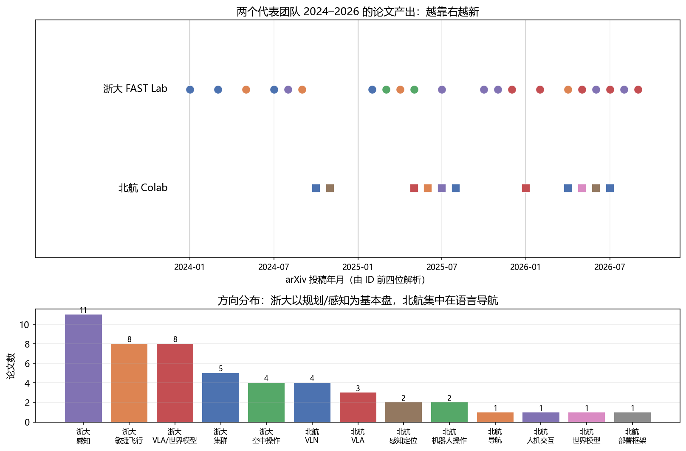

# 最新进展与团队追踪：2025–2026 的无人机世界模型 / VLA

> 预计阅读：28 分钟 | 前置知识：已完成基础概念学习（Part 1-4）

---

## 为什么"按团队读"

前三篇讲的是**怎么读一篇论文**、**有哪些空白**。这一篇换个角度：**追团队**。

理由很实际。前沿论文是零散出现的，但问题意识是按团队延续的 —— 一个组今年做的四篇论文，往往在回答同一个问题，只是每次换一个角度。你追一个组，等于一次拿到四篇的上下文；你追一百篇零散论文，得到的是没有主线的列表。

而且追团队能让你提前看到下一步。一个组把某个方向的开源库维护了五年，他们的下一篇大概率还在这里；反过来，一个组今年突然在某个新方向连出三篇，说明那里刚被验证可行 —— 这两种信号，单看某一天的 arXiv 列表都读不出来。

下面先解剖两个有代表性的组：**浙大高飞团队**（从几何规划器一路做到具身智能，是"经典派转过来"的样本）和**北航 Colab**（多模态视觉组切入低空，是"AI 派压过来"的样本）。然后跳出这两个组，看整个版图在收敛到什么共识上。

> **关于本文的可靠性**：文中共出现 48 个不同的 arXiv 号，2026-09 全部通过 `export.arxiv.org` 的 API 逐条 resolve 成功，标题、作者、摘要均为该 API 直接返回。**具体的数字**分两档：带引号的量化结论我都读了摘要原文（并在下文注明出处）；转引自二手综述、我没能读到原文的，另行标注"—（未核实）"。会议/期刊归属以正式论文集为准，预印本信息可能后续变更。
>
> **一条先行的警告**：这个领域的 AI 生成摘要不可信。我核对时发现，某搜索结果把 FlyMirage（2605.19600）的作者列表安到了另一篇毫不相干的论文头上 —— 两篇论文、不同国家、不同作者，只是名字里都有 "飞"。**任何你没有亲自 resolve 过的 arXiv 号，都当它是错的。**

---

## 一、浙江大学 FAST Lab（高飞 / 许超）

### 1.1 这个组是谁

浙江大学控制科学与工程学院，另有湖州研究院的编制。**高飞**（长聘副教授/研究员）、**许超**（教授级 PI，湖州研究院院长）。GitHub 组织 [`ZJU-FAST-Lab`](https://github.com/ZJU-FAST-Lab)，70 个公开仓库。

它在这个领域最广为人知的成果是**微型无人机集群**：2022 年 *Science Robotics* 封面文章 "Swarm of micro flying robots in the wild"（一作周鑫，通讯高飞、许超）。更早的 **EGO-Planner**（RA-L 2021）和 **Fast-Drone-250** 两个仓库至今仍是很多无人机课程实验的默认选项 —— 前者 2600+ 星，后者 2500+ 星。

### 1.2 三条研究线

这个组的产出可以按"离飞行器有多远"分成三层：

```
顶层   具身智能化（2025–2026 明显加速）
       ├─ 强化学习端到端飞行：Flying on Point Clouds、Safety-Shielded RL、AgilePE
       └─ 生成式世界模型与 VLA：FlyMirage、NavDreamer、NavGen、TADreamer、VLA-AN
                ↑ 本文重点
中层   感知—规划—控制的闭环系统化
       把底层那套规划器塞进越来越难的场景：LiDAR 感知规划、旋翼失效容错、
       空地协同无全局定位避障、陆空双模态车、全驱动/可变形新平台
                ↑ 共同主题：去掉对 GPS / SLAM / 先验地图的依赖
底层   可证明的最优与安全轨迹规划
       Teach-Repeat-Replan → EGO-Planner/Swarm → GCOPTER → FIRI → Primitive-Swarm
                ↑ 特征：坚持几何/动力学可解释，用凸优化 + MINCO + 微分平坦做机载实时规划
```

底层是这个组的"看家本领"，也是它的代码库被广泛复用的原因。注意它的方法论取向：不接受端到端黑箱，坚持在最优化框架里给出可行性与安全性的证明。这个取向会直接决定他们在顶层怎么做世界模型 —— 见下。

### 1.3 一个关键判断：这个组怎么做"世界模型"

这是本文最值得记住的一段。

2025 年之后，这个组出了一串带 "world model" 字样的工作：FlyMirage、NavDreamer、NavGen、TADreamer。但它们不是 Part 2 讲的那种世界模型。

Part 2 讲的路线（Dreamer / RSSM / TD-MPC）是：学一个隐空间的动力学模型，在里面做 rollout —— 世界模型是被策略"用"的、内生的。

这个组走的是另一条：把视频生成模型当作零样本导航器和数据引擎。典型流程是：

```
语言指令 + 当前视角
      ↓
视频生成模型（如 Wan / Marble 3DGS）想象"往前飞会看到什么"
      ↓
Qwen3-VL 打分，挑出最符合指令的那条想象
      ↓
π³ 逆动力学解码出航点；MoGe2 恢复米制尺度
      ↓
Ego-Planner 兜底，规划出保证安全可行的轨迹
      ↓
执行
```

关键在最后一步：生成模型只负责"出意图"，安全性交给几何规划器。这和他们底层十几年的积累是一脉相承的 —— 神经网络可以提建议，但能不能飞由可证明的规划器说了算。

其中 **FlyMirage**（arXiv:2605.19600）最能代表这个组的思路：LLM 当场景设计师 → 生成式世界模型把设计实例化成照片级 3DGS 场景 → 自动探索与语义标注 → 动力学可行的规划器生成轨迹。该工作的题目就是 *A Fully Automated Generation Pipeline for Diverse and Scalable UAV Flight Data via Generative World Model*——**它只建数据生成管线**，论文没有报告下游策略微调的结果，也没有真机验证。这里世界模型的产出不是控制器，是训练集。

> **勘误（2026-10）**：本节早先写作「拿这批数据去微调 π₀。在完全没见过的环境里，导航能力真的涨了（仿真和真机都验过）」。**这一段是编的**——FlyMirage 原文没有任何「微调 π₀」的实验，也没有仿真/真机的导航增益数据；它的贡献停在数据管线本身。已删除该结论。

> **对做研究的读者的含义**：这个组把"动力学建模"这块整个让给了经典规划器。代价是它拿不到**回报估计** —— 生成式路线能告诉你"往前飞大概会看到什么"，但给不出"这个状态值多少分"，所以没法直接做 model-based RL。
>
> 但请注意：**这恰恰是 2026 年整个领域正在攻的方向**，而且已经有了名字 —— **World-Action Model（WAM，世界-动作模型）**。它不是"世界模型 + 策略"两个模型拼起来，而是**一个模型同时预测隐空间未来状态并从中解码动作**。见第三节 3.1。我在初稿里曾把这里写成"完全空白"，核对完 2026 年的工作后必须修正：**空白不在"有没有人做"，而在"做到什么程度算解决"** —— 目前还没有公认的判据。

### 1.4 2025–2026 代表工作

| arXiv | 工作 | 方向 | 一句话 |
|---|---|---|---|
| 2512.15258 | VLA-AN | VLA | 机载 VLA 导航框架，带几何安全校正层 |
| 2602.00708 | USS-Nav | 导航 | 统一时空场景图的轻量零样本目标导航 |
| 2602.09765 | NavDreamer | 世界模型 | 视频模型当零样本 3D 导航器 |
| 2605.19600 | FlyMirage | 世界模型 | 生成式世界模型自动造 UAV 飞行数据 |
| 2606.02313 | Expert-Guided GRPO | VLA | 用专家引导的 GRPO 对齐飞行意图 |
| 2607.29009 | D-VLC | 多机 | 异构多机器人去中心化视觉语言协作 |
| 2609.19824 | TADreamer | 世界模型 | 陆空双模态零样本语言导航 |
| 2609.30770 | NavGen | 世界模型 | 视觉生成模型当具身导航数据引擎 |
| 2604.05828 | Precise Aggressive Maneuvers | 敏捷飞行 | *Science Robotics* 2026，传感器运动策略 |
| 2602.08653 | Safety-Shielded RL | 敏捷飞行 | 安全滤波器 + RL 的高速视觉飞行 |
| 2608.14135 | AgilePE | 敏捷飞行 | 自博弈 RL 做追逃 |
| 2502.16887 | Primitive-Swarm | 集群 | 超轻量大规模集群规划器（T-RO 2025） |
| 2403.02977 | FIRI | 规划 | 凸无障碍区域快速膨胀（T-RO 2025） |
| 2503.00785 | FLOAT Drone | 空中操作 | 全驱动同轴空中机器人 |
| 2505.15010 | Shape-Adaptive Quadrotor | 空中操作 | 可变形四旋翼的规划与控制 |

另外两项不属于 arXiv 但分量更重，值得单独记：

- **"Unlocking aerobatic potential of quadcopters"** —— *Science Robotics* 2025，特技飞行自主生成与执行。人机对比的数字很直观：自主系统穿越六道 1.2 米门 **100%** 通过，顶尖人类飞手 **12.5%**。
- **HI-ARM** —— *Nature Communications* 2026，带机械手的自主飞行机器人，做空中抓取与交互。

### 1.5 开源资产

想上手的话，这几个仓库的性价比最高（星数为 2026-09 前后量级）：

| 仓库 | 星数 | 用途 |
|---|---|---|
| `ego-planner` | 2.6k | 入门机载规划的标准起点 |
| `Fast-Drone-250` | 2.5k | 一整套可复现的自主飞行硬件方案 |
| `ego-planner-swarm` | 2.2k | 集群规划 |
| `GCOPTER` | 1.3k | 几何约束轨迹优化 |
| `Aerobatic-Planner` | 160 | SR 2025 特技论文的代码 |
| `Terrestrial-Aerial-Navigation` | 110 | 陆空双模态导航 |

### 1.6 避坑：四处常见的张冠李戴

这几条在中文二手资料里流传很广，进组之前先对齐：

1. **"Champion-level drone racing"（*Nature* 2023, Swift）不是浙大的**，是苏黎世大学 Scaramuzza 团队。浙大在竞速方向的实际产出是 RA-L 2021 的 Fast-Racing 开源基线 + 2022 年国内赛事冠军 + SR 2025 的特技飞行，**没有** Nature/Science 级的竞速论文。
2. **`Fast-Planner` 不是这个组的仓库**（属 HKUST 的 Boyu Zhou）。因为高飞博士毕业于 HKUST，这两者常被误挂到一起。
3. **USS-Nav 不是"Nature 子刊"**。中文自媒体把 *Nature Communications* 上的 HI-ARM 和 USS-Nav 打包宣传，但 USS-Nav 在 arXiv（2602.00708）之外没有任何期刊记录。
4. **arXiv:2405.07736 与 RA-L 2025 的同一工作标题不同**（arXiv 版叫 "Learning to Plan Maneuverable and Agile Flight Trajectory..."，期刊版叫 "Dynamically Feasible Trajectory Generation..."）。引用时二选一，不要拼在一起。

---

## 二、北京航空航天大学 Colab（刘偲）

### 2.1 这个组是谁

北京航空航天大学人工智能学院的 **Colab 实验室**（口语里也叫"可乐实验室"），PI 是**刘偲**教授（IEEE T-PAMI 副主编）。实验室主页 [colalab.net](https://colalab.net/)，GitHub 组织 [`buaa-colalab`](https://github.com/buaa-colalab)，另有一个低空方向的专门页面 [Colab UAVs](https://buaa-colalab.github.io/colab_uav.github.io/)。

**先明确它的性质**：这是一个**计算机视觉 / 多模态内容理解**组，具身智能（学生条目里叫"空天具身智能"）是应用线之一。**它不是飞控组，也不做低层控制。**

这一点决定了它的技术取向，也是理解它所有无人机论文的钥匙 —— 你在这个组的工作里不会看到串级 PID 或微分平坦，但会看到大量语言、视觉、推理、数据集和基准。他们切入无人机的方式，是把语言变成无人机的接口。

### 2.2 以"语言"为核心的导航栈

从 2024 到 2026，这个组的无人机论文连起来是一条很清晰的线：

```
2024-10  OpenUAV                先造平台和基准（不开源就没人跟你比）
2025-05  UAV-Flow Colosseo      把任务定义清楚：Flying-on-a-Word
2025-08  AeroDuo                双高度协同：高空想、低空飞
2026-06  FLIGHT                 细粒度 + 长时程，慢 VLM 配快扩散策略
2026-07  Parse-Search-Confirm   免训练的对话式导航
```

一条从"造基础设施"到"做系统"的推进路径。其中两步有特殊意义：

**UAV-Flow Colosseo**（arXiv:2505.15725）定义了 **Flying-on-a-Word** 任务 —— 短距离、语言条件的**精细控制**（不是"飞到 A 点"，而是"从窗户和树之间穿过去"）。它同时给出了第一个真机基准和数据集，并对比了 VLN 与 VLA 两条范式，报告了首次真机部署的语言引导 VLA 控制。**本仓库 Part 3 的 [`03-语言条件飞行控制`](../03-VLA专题/03-语言条件飞行控制.md) 讲的就是这项工作** —— 你读的那一节的实验，其任务定义者就是这里。

**FLIGHT / Think Like a Pilot**（arXiv:2606.06836）代表了这个组最新的架构取舍：**异步的"慢 VLM + 快扩散策略"**，外加显式的"飞行员推理"文本做监督。这个"慢想快做"的分工和上面浙大的"生成模型出意图 + 规划器兜底"是同一个思路的两种实现 —— 都在回答**大模型的推理速度配不上飞行控制频率**这个共同难题。

### 2.3 代表工作

低空无人机方向：

| arXiv | 工作 | 一句话 |
|---|---|---|
| 2410.07087 | OpenUAV | 照片级 UAV 飞行仿真平台 + 1.2 万条轨迹数据集 + UAV-Need-Help 基准 |
| 2505.15725 | UAV-Flow Colosseo | 定义 Flying-on-a-Word 任务，首个真机基准 |
| 2508.15232 | AeroDuo | 双高度协同 VLN，HaL-13k 数据集（13,838 条轨迹） |
| 2507.04430 | AirStar | 语音 + 手势驱动的空中具身助手（无遥控器） |
| 2604.17190 | LookasideVLN | 用"侧视"方向线索做航空 VLN，对标 CityNavAgent 且更省算力 |
| 2606.06836 | Think Like a Pilot（FLIGHT） | 细粒度长时程 VLN 基准 + 异步慢 VLM / 快扩散策略 |
| 2607.11529 | Parse, Search, and Confirmation | 免训练对话式航空导航，配结构化空间记忆 |
| 2411.13610 | Video2BEV | 无人机视频 → 鸟瞰图，做跨视角地理定位 |
| — | AerialVLA | 端到端对话导航，自己决定何时提问（AAAI 2026，**无 arXiv 版**） |

相邻的通用具身方向（同一组，非无人机）：**OctoNav**（arXiv:2506.09839，CVPR 2026，通用导航基准 + Think-Before-Action 的 VLA 式 MLLM）、**ACoT-VLA**（arXiv:2601.11404，CVPR 2026，把推理链直接放进动作空间）、**RoboCerebra**（arXiv:2506.06677，NeurIPS 2025 D&B，长时程操作基准）、**GE-Sim 2.0**（arXiv:2605.27491，闭环视频世界模拟器）。

### 2.4 避坑：三条

1. **两个 AerialVLA 不是一回事。** 这个组的 AerialVLA 发在 AAAI 2026，**没有 arXiv 预印本**；arXiv 上确实存在一个叫 `AerialVLA` 的条目（2603.14363），但那是**另一个组**的工作。这两篇撞名的程度很高，值得把区别记清楚：

   | | 北航 Colab 的 AerialVLA | arXiv:2603.14363 的 AerialVLA |
   |---|---|---|
   | 作者 | 刘偲组（AAAI 2026） | Peng Xu, Zhengnan Deng, Jiayan Deng, Zonghua Gu, Shaohua Wan |
   | 方法核心 | 对话导航，自己决定何时提问 | 极简端到端，双视角感知 + 模糊方向提示，3-DoF 连续控制 |
   | 评测 | 对话式导航任务 | TravelUAV 基准 |

   另外有二手来源称 2603.14363 在 ECCV 2026 上改名成了 "AeroVLA"（未核实——我没能访问 ECCV 2026 的正式论文集）。若属实，同一篇论文在 arXiv 和会议录里就是两个名字。无论属实与否，结论都一样：检索时认作者单位和年份，不要认名字。
2. **会议归属以正式论文集为准。** LookasideVLN 与 ACoT-VLA 的 CVPR 2026 在 CVF 开放获取里已能查到，可信；FLIGHT 和 Beyond 2D Matching 的会议归属尚无第三方来源（未核实），引用时写 arXiv 更稳妥。
3. **AirStar 的 ACM MM 2025 Demo 由实验室主页自述**（未核实），ACM 数字图书馆在本环境访问受限，未能独立确认。

---

## 三、更大的版图：世界-动作模型（WAM）成为主流

跳出这两个组看全局。如果只记住 2026 年的一件事，应该是这个：世界模型和策略正在合并成一个模型。

### 3.1 从"两个模型"到"一个模型"

2025 年的做法是把世界模型并排放在策略旁边 —— 世界模型负责"想象"，策略负责"决策"，两者各训各的。

2026 年 5 月之后，主流变成了一个模型同时干两件事：预测隐空间的未来状态，再从它解码出动作。这个范式有了统一的名字：**World-Action Model（WAM）**。代表工作有 WorldVLN、ForeFly、DroneWAM、AeroAct、ImagineUAV、WAM-Nav。

**为什么这个变化重要**：它正面回答了 1.3 节留下的问题 —— "能不能既做 rollout 又给语义"。把动作解码器直接挂到未来状态预测上，回报估计就不再需要单独学一个 value head。**但这是不是真的解决了问题，目前没有定论** —— 这类工作普遍只有成功率的提升，没看到谁把"想象出的回报"和真实回报做过系统性对比。这正是值得做的题。

### 3.2 三个正在收敛的技术判断

**判断一：latent 战胜 pixel。**

这是最明显的一次集体转向。Part 2 讲的"生成式世界模型"默认要生成图像/视频；2026 年的新工作刻意避免生成图像：

- **Skytopia**（arXiv:2609.26007）走得最远 —— 它的论点是：策略需要的是世界模型产生的**表征**，不是它的**预测**。因为飞行中帧间变化几乎完全由已执行的动作解释，预测退化成"在已知位移下重投影静态场景"。于是它在部署时**直接扔掉预测器**，省掉 59.4% 的推理开销。一个策略同时支持点目标、图像目标和自由导航，装到真机上不用微调。
- **DroneWAM**（arXiv:2609.33148）明确选 JEPA 架构，就是为了不生成图像。
- **WorldVLN**（arXiv:2605.15964）预测**短时程隐状态转移**，而不是生成整段视频。

**判断二：世界模型的价值在"造数据"，不在"做规划"。**

FlyMirage 是最干净的例证（见 1.3）。**AeroManip-VLA**（arXiv:2609.36915）在空中操作上做同样的事：用 RL 生成示范，喂给下游策略。这个转向的潜台词是：仿真器的瓶颈不是物理精度，是场景多样性 —— 而生成模型恰好擅长造多样性。

顺带一个可用的量化锚点：**GRaD-Nav++**（arXiv:2506.14009，Stanford，一作 Qianzhong Chen）给出了 sim-to-real 的分项数字 —— 注意它不是一个数，而是两对：

| 任务类型 | 仿真成功率 | 真机成功率 | 落差 |
|---|---|---|---|
| 训练过的任务 | 83% | 67% | **−16** |
| 没见过的任务 | 75% | 50% | **−25** |

（多环境适配那组：仿真均值 81% → 真机均值 67%，−14。）"sim-to-real 掉约 16%"这个常被引用的说法，只是训练任务那一行。 泛化到没见过的任务时落差接近 1.5 倍 —— 这提示一件事：仿真里"泛化好"这件事本身在真机上最不可信。

**判断三：RL 后训练成了标配。**

SFT 之后必须再上 RL，已经从"加分项"变成"默认流程"：Expert-Guided GRPO（arXiv:2606.02313）、RefineFly（arXiv:2608.09467）、WorldVLN 里的 Action-aware GRPO。共识是纯 SFT 不足以支撑闭环飞行 —— 这一点和本仓库 Part 3 的实验结论（模仿损失低 ≠ 闭环飞得好）是同一件事的两种说法。

### 3.3 一个新现象：无人机制造商开始发论文

这一条值得单独说，因为它是领域成熟的信号。

2026 年出现了消费/工业无人机厂商直接参与研究的情况：

- **Autel Robotics（道通智能）** —— 发布低空 VLA 的路线图综述（arXiv:2604.13654），并做了 **CosFly-VLA**（arXiv:2607.15004）。一家无人机制造商来写领域路线图，商业意图很明确。
- **ACE Robotics（大晓机器人）** —— **ACE-Brain-0**（arXiv:2603.03198），8B 空间智能基础模型，拉上上交、南洋理工、港中文等一起开源。宣称在 24 个基准上拿到 19 个 SOTA（**厂商自述，未独立验证**）。许可证类型（"MIT 许可"）与"19/24 SOTA"的具体数字我们**均未能从论文或官方页面核实（待核实）**，引用时请自行复核原始发布页。
- **小米汽车**参与 FutureNav（arXiv:2606.30367）；**Differential Robotics** 参与 FlyMirage；**CowaRobot** 参与 DroneWAM。

同时出现的缺席名单也值得注意：没有找到 Google DeepMind、NVIDIA、Meta、OpenAI 专门针对无人机世界模型的工作。 NVIDIA 的 Cosmos 被当作通用底座引用，但在这个窗口里没有被用到无人机上。

### 3.4 一个方法论危机：基准碎片化

这一条对我们读论文的人有直接影响。

2026 年的两篇综述（arXiv:2604.13654、2604.07705）明确把基准碎片化列为这个领域的核心方法论问题。现在同时存在的 UAV 导航/世界模型基准至少有：TravelUAV、UAV-Flow、FLIGHT、UAV-Track、AirNav、SatNav、HUGE-Bench、AeroVerse、SpatialUAV、MotionScape……

问题在于它们的协议互不兼容，导致两个后果：

1. **论文之间的数字没法直接比。** "A 方法成功率 61.76%，B 方法 57.8%" 这种比较，如果不在同一个基准上，是没有意义的 —— 而二手报道经常这么比。
2. **"SOTA" 这个词在这个领域目前是失灵的。** 看到 SOTA 先问一句：在哪个基准上、跟谁比、是不是同一个评测协议。

> **给你的实际建议**：读一篇 UAV VLN 论文时，第一件事是找它的**评测基准**，第二件事是看**有没有在别人的基准上也报数**。只在自己的新基准上刷分的论文，可比性要打个问号。

### 3.5 谁在做：一份不完全名单

除了上面两个组，2026 年 aerial world model / VLA 的主要力量：

| 机构 | 代表工作 | 备注 |
|---|---|---|
| **清华大学** | WorldFly、WorldVLN、AirDreamer、AirScape、FutureNav | 这个方向最活跃的机构之一，散在 SIGS / AIR / 自动化系等多个组 |
| **中科院自动化所（CASIA）** | ForeFly、AIR-VLA、UAV-Track VLA | 导航子方向存在感最强 |
| **北京理工大学** | MAD、AeroAct | 同一作者在具身无人系统全国重点实验室连出两篇 |
| **东南大学 + 紫金山实验室** | AutoFly（ICLR 2026） | 少见的 ICLR 正刊接收 |
| **南洋理工大学** | Skytopia | 表征派代表作 |
| **香港科技大学（广州）** | SatNav（NeurIPS 2026 D&B） | 用卫星影像绕开 3D 资产成本 |
| 德国帕德博恩大学 / 奥地利克拉根福大学 / 中佛罗里达大学 / 墨尔本大学 | Exp2VLA、Cloud-Edge-or-Split、Aero-World、HUGE-Bench | 非中国团队的代表 |

> **这张表的读法（2026-10）**：机构归属取自论文的作者单位，**未逐条核实**。其中 AirDreamer（清华 AIR）、SatNav（NeurIPS 2026 D&B）、AutoFly（arXiv:2602.09657）、HUGE-Bench（arXiv:2603.19822）已单独核过；其余格子（如 CASIA / 北理工 / 南洋理工 / 港科大广州的对应关系）属按作者单位推断，请当作线索而不是定论。

**用这张表要注意方法**：上面两个组（浙大 FAST Lab、北航 Colab）是**一个组打一个方向**，所以"追团队"有效。**清华不适用这条** —— 它的产出散在好几个互不统属的组里，追"清华大学"等于追了个校名。对这类机构，**得下钻到 PI 一级**再追。

这也是判断该"追团队"还是"追人"的一条简单规则：看这个机构的论文是不是同一个通讯作者。 是，就追团队；不是，就追人。

---

## 四、从这些线能读出什么

### 4.1 三个判断

**判断一：世界模型与策略正在合并，但"合并之后是否真的能算回报"仍是开放的。**
WAM 在架构上把两者统一了（3.1），这是 2026 年最大的结构性变化。但统一架构 ≠ 解决了回报估计 —— 我没有看到任何一篇把"模型想象的回报"和"真实回报"做系统性对比的工作。这是一个具体的、可做的题。

**判断二：语言导航已经是低空无人机最大的论文产出方向，而且竞争已经白热化。**
上面两个组的清单里，"语言 / VLN / VLA" 占比都不低；放到全局，2026 年光新的 UAV VLN 基准就有五六个。对新进入者来说，"再做一个 VLN 基准"的边际价值已经很低了 —— 除非你解决的是碎片化本身（统一协议、跨基准评测）。

**判断三："安全兜底"是所有组的公约数。**
浙大用几何规划器和安全滤波器，北航用显式推理链 + 分层架构，VLA-AN 用几何安全校正层。没有人让神经网络单独决定飞不飞。 这一点对做真机的人尤其重要：你的架构里必须留出这一层。

### 4.2 与本仓库既有判断的对照

[`02-研究空白与机会.md`](02-研究空白与机会.md) 写过"无人机专属世界模型匮乏"，理由是该综述引用的 40+ 篇论文里只有 2-3 篇聚焦无人机。**这个理由已被证伪**：arXiv:2605.00080 全文检索 UAV / drone / aerial 命中数为 0，它压根没有纳入无人机专属世界模型，而不是"纳入了少数"。结论方向没错，但论据要换成下面这些实查到的论文。

| 说法 | 现在是否成立 |
|---|---|
| "无人机专属世界模型匮乏" | **需要修正**。2025 年底之后已密集出现（FlyMirage、NavDreamer、NavGen、TADreamer、Skytopia、DroneWAM、ANWM、AirScape…） |
| "无人机专属世界模型**在某个子方向上**匮乏" | **成立**。见下 |
| "缺少多机协同的世界模型" | **仍然成立**。2026 年综述明确指出：**目前所有 VLA 方法都是单机的**，没有一个解决多无人机协同决策 |

> **勘误（2026-10）**：本段早先引用了「综述引用的 40+ 篇世界模型论文里，仅 2-3 篇聚焦无人机」。该综述（*World Model for Robot Learning: A Comprehensive Survey*）全文不含任何无人机内容，"2-3 篇"是本仓库虚构的折中说法。

至于子方向，按 3.2 的两条路线分开看：

- **生成式视频 / 生成式数据引擎路线** —— 已经不匮乏，2026 年很拥挤。
- **隐空间动力学路线**（Part 2 讲的 Dreamer/RSSM 那种）—— **仍然稀缺**。现有工作里 Dreaming Falcon（arXiv:2511.18243）让模型预测**力和力矩**而不是像素，MAD（arXiv:2606.04534）让隐状态重建**机器人中心的占据与可见性栅格**而不是图像，都属于少数派的修正尝试。**这是本仓库读者最容易切入的空白 —— 而且现在有明确的负面结果可以当起点。**

  值得单独说 **Dreaming Falcon**：它把四旋翼当自由刚体，世界模型预测净力与力矩，再经 6-DOF Runge-Kutta 积分器（RK4）推出未来状态。这个物理先验的设计很干净，但论文报告的结论是负面的 —— 原文摘要原话是：两种世界模型（物理先验版和标准 RNN 版）在训练数据上都表现良好，但都无法泛化到新轨迹，导致状态 rollout 快速发散、策略无法收敛。

  换句话说：把物理先验塞进世界模型，并没有解决"无人机世界模型泛化不了"这件事。 这比"这里有一片空白"有价值得多 —— 它告诉你哪条路已经有人试过并且没走通。想切入这个方向，起点是这篇的失败，而不是从零开始。

也就是说，"匮乏"要按路线分开说，不能再笼统讲。这正是追踪团队才能得到的修正 —— 单看综述的引用列表，这些新工作还没进来。

---

## 五、动手：自己追踪一个团队

### 5.1 三个入口

| 入口 | 怎么用 |
|---|---|
| **arXiv API** | `https://export.arxiv.org/api/query?id_list=<逗号分隔的ID>&max_results=100` —— 批量拿权威标题、作者、日期。**注意必须走 HTTPS，HTTP 会失败** |
| **实验室主页** | 论文页通常比 arXiv 更新得早（录用未挂 arXiv 的会先出现），但可能有宣传性表述 |
| **GitHub 组织** | 看仓库的更新时间和 star 增长，比看论文更能判断"哪个方向真的有人在用" |

### 5.2 跑一下追踪脚本

`code/d_track_papers.py` 把上面两个团队的论文清单固化下来，做两件事：从 arXiv 号前四位解析投稿年月画时间线；可选地联网核对元数据。

```bash
py -3.9 code/d_track_papers.py             # 离线出图
py -3.9 code/d_track_papers.py --verify    # 联网核对 51 个 ID 的权威标题
```

实测输出（2026-09，字体 Microsoft YaHei）：

```text
【浙江大学 FAST Lab（高飞 / 许超）】共 36 篇
  分年度: 2024年  8 篇  2025年 11 篇  2026年 17 篇
  分方向: 感知 11  敏捷飞行 8  VLA/世界模型 8  集群 5  空中操作 4

【北京航空航天大学 Colab（刘偲）】共 15 篇
  分年度: 2024年  2 篇  2025年  5 篇  2026年  8 篇
  分方向: VLN 4  VLA 3  感知定位 2  机器人操作 2  导航 1  人机交互 1  世界模型 1  部署框架 1
```

加 `--verify` 时，51 个 ID 全部命中（下面是逐条核对的前五行，标题按 78 字符截断，完整 51 行在本地运行时输出）：

```text
【联网核对】向 arXiv API 查询 51 个 ID ...
  命中 51/51
  逐条核对（本地短标题只是备注，不做严格比对；这里看的是权威标题）:
    2401.07784  [集群] Certifiable Mutual Localization and Trajectory Planning for Bearing-Based Robo
    2403.02977  [集群] Fast Iterative Region Inflation for Computing Large 2-D/3-D Convex Regions of 
    2403.04586  [敏捷飞行] Learning Speed Adaptation for Flight in Clutter
    2403.13455  [集群] FACT: Fast and Active Coordinate Initialization for Vision-based Drone Swarms
    2405.07736  [敏捷飞行] Learning to Plan Maneuverable and Agile Flight Trajectory with Optimization Em
```

这一步的价值在"命中 51/51" 之外：真正要看的是每一行的标题和你记忆里的是不是一回事。下面 5.3 节就是被这一步抓出来的例子。



时间线里最值得注意的一点：浙大 FAST Lab 的 VLA/世界模型方向，全部出现在 2025-12 之后。一个做了十五年几何规划器的组，最近一年才切入这条线 —— 这本身就说明了这个方向现在的吸引力。

### 5.3 一条经验：先核对元数据

追踪团队时最容易出错的地方不是判断，是元数据。整理本仓库时踩到的真实例子：

- **π₀.₅ 的 arXiv 号写成了 `2502.01494`** —— 这个号确实存在，但它是一篇**流体力学论文**（"Instantaneous convective heat transfer at the wall"），和机器人毫无关系。正确的号是 `2504.16054`。
- **VLA-AN 的标题在三个文件里有三种写法**，其中一种（"Adaptive Safety Correction"）是把论文里的模块名当成了标题。权威标题是 "An Efficient and Onboard Vision-Language-Action Framework for Aerial Navigation in Complex Environments"。
- **UAV-TrackVLA** 在正文四处标 2025，但它的 arXiv 号 `2604.02241` 说明是 2026 年 4 月 —— 年份和 ID 自相矛盾，肉眼很难发现。

这三个错误都不是理解问题，是没核对。而且它们揭示了更根本的一点：`YYMM.xxxxx` 这个编号本身就带着日期。任何"年份"和"arXiv 号前四位"对不上的地方，一定是其中一个错了 —— 这条自检规则能免费抓出一大批错误。

所以养成一个习惯：任何 arXiv 号进正文之前，批量拉一次 API 对标题。这正是 `--verify` 那一小节在做的事，一分钟能省掉后面很久的返工。

---

## 延伸阅读

- [`02-研究空白与机会.md`](02-研究空白与机会.md) —— 本文 4.2 节修正的那份空白清单
- [`../02-世界模型专题/03-模型强化学习世界模型.md`](../02-世界模型专题/03-模型强化学习世界模型.md) —— Part 2 讲的隐空间动力学路线，与本文 1.3、3.2 对照阅读
- [`../03-VLA专题/03-语言条件飞行控制.md`](../03-VLA专题/03-语言条件飞行控制.md) —— UAV-Flow / Flying-on-a-Word 的详细解读
- [`../06-论文导读合集/world-model-papers.md`](../06-论文导读合集/world-model-papers.md) —— 本文提到的部分工作的论文卡片
- [`code/d_track_papers.py`](../../code/d_track_papers.py) —— 追踪脚本完整源码

---

## 思考题

1. **实验设计**：3.1 节指出 WAM 把世界模型和策略合并成了一个模型，但"没有看到谁把想象出的回报和真实回报做过系统性对比"。请设计一个实验来验证 WAM 的隐空间预测是否真能当回报估计用 —— 你需要哪些基线？怎么排除"性能提升其实来自更大的模型"这个混淆因素？

2. **审稿人视角**：3.4 节说基准碎片化被两篇 2026 年综述列为核心方法论问题。如果一篇论文只在作者自己新造的基准上刷到了 SOTA，你会要求作者补充什么？请写出一份具体、可执行的要求清单。

3. **方法迁移**：1.3 节说浙大 FAST Lab 把"动力学建模"整个让给了经典规划器，代价是拿不到回报估计。如果要在他们的生成式数据引擎（比如 FlyMirage）上补一个 value head 来做 model-based RL，最先会缺什么？

4. **动手统计**：4.2 节指出隐空间动力学路线的无人机世界模型仍然稀缺（Dreaming Falcon、MAD 是少数派）。请用 `d_track_papers.py` 的方法，统计 2025 年之后新增的无人机世界模型工作里，"生成式视频/数据引擎"和"隐空间动力学/表征"各占多少 —— 数字和你预期的差多少？

5. **交叉验证**：5.3 节给了三个引用错误的实例（π₀.₅ 的 arXiv 号、VLA-AN 的标题、UAV-TrackVLA 的年份）。请说出一条能同时抓住这三类错误的自检规则，并解释它为什么有效。

<details><summary>参考答案</summary>

1. 关键是把"预测"和"回报"分开评。基线至少三类：(a) 不用世界模型的纯 BC/RL；(b) 直接用真实环境 rollout 的 oracle 上界；(c) 一个同等参数的普通策略网络。排除混淆的办法是**控制参数量** —— 让 WAM 和基线尽量同规模，再看差距是否还在；若 WAM 明显更大，就得补参数匹配的消融。核心指标不是任务成功率，而是**想象的回报与真实回报的相关性/偏差**（本仓库 Demo A 在玩具环境上做的就是这件事）。

2. 至少要求：(a) 在**至少一个公开基准**上报数，并与该基准上已发表的结果同协议对比；(b) 说明新基准与既有基准的差异在哪、为什么不复用；(c) 给出评测协议细节（成功判据、初始状态分布、超时阈值），让别人能复现；(d) 报告在**别人的**基准上是否也涨。只在自己基准上刷分的论文，可比性要打个问号。

3. 最先缺的是**回报信号本身**。生成式路线能回答"往前飞会看到什么"，但拿不到"这个状态值多少分" —— 它的产出是数据（轨迹、3DGS 场景），不是 value。要补 value head，得先有能判定成功/失败的奖励定义，而这在有安全兜底的系统里往往是隐含的（"没撞上"就算好）。所以第一步不是加网络，而是把隐含判据显式化成可优化的奖励。

4. 动手题，没有唯一答案，但有几个容易踩的坑：一是**分类边界**，很多工作同时用生成模型和规划器（FlyMirage 生成数据、Ego-Planner 规划轨迹），算哪一类取决于你按"模型学到什么"分还是按"系统怎么用"分，**先把判据写下来再统计**；二是**样本量**，这个交叉领域一年可能只有二三十篇，比例放在这么大方差上没有说服力，诚实写法是给绝对数字和清单而不是只报百分比；三是**"声称"和"实际"的差距**，不少 2026 年的工作标题带 "World Model" 但正文里只是个辅助模块，按标题统计会高估。至于预期差：多数人以为"隐空间动力学"更主流（Part 2 篇幅多），但实际 2025 年之后**生成式路线的新增明显更多** —— 因为它能直接复用大模型和视频生成的基础设施，RSSM 那套要重新训。

5. 规则是：**任何 arXiv 号进正文之前，先看它 YYMM 的前四位和文中标注的年份/月份是否自洽。** 它有效是因为 arXiv 号自带日期，而年份是人手写的、容易沿用上一篇的模板。π₀.₅ 写成 `2502.01494` 时，2502 和它"2025 年 4 月"的定位已经打架（正确号是 `2504.16054`）；UAV-TrackVLA 标 2025 但号是 2604（2026-04），直接矛盾；VLA-AN 的标题错误则要靠 API 拉权威标题才能发现 —— 所以完整的规则是"**先查号内日期是否自洽，再批量拉 API 对标题**"。

</details>
