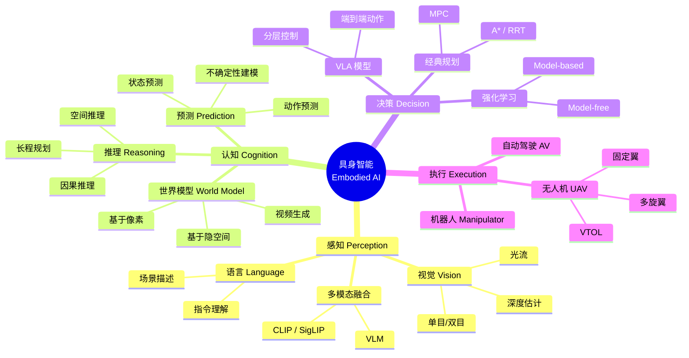
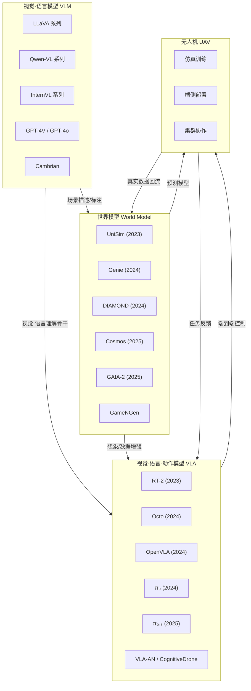
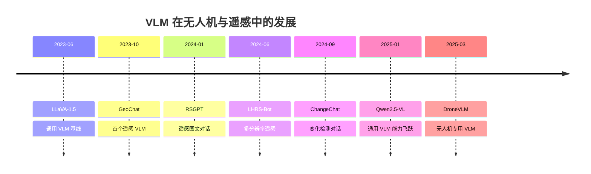
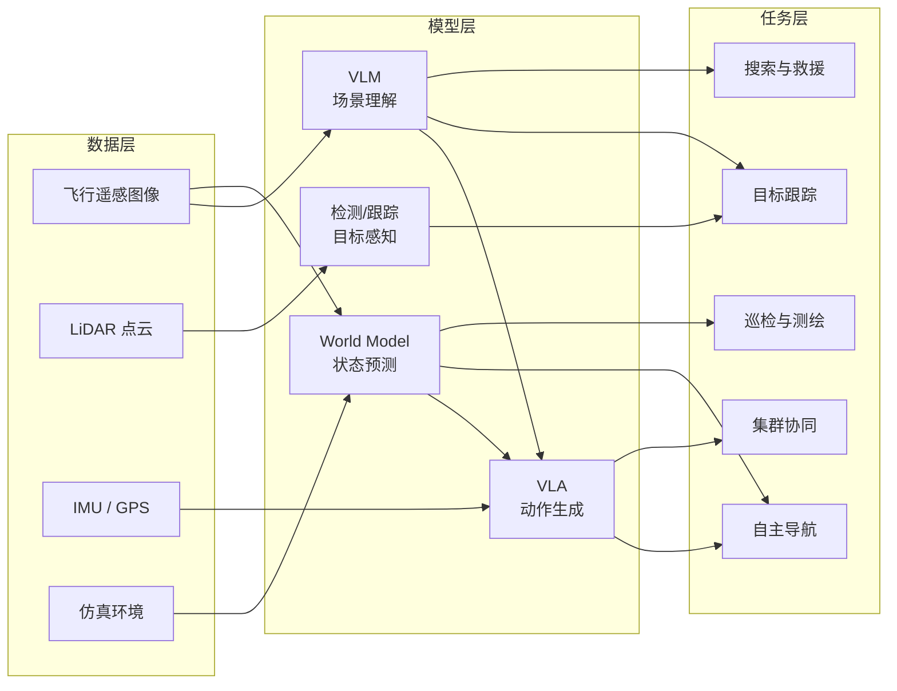
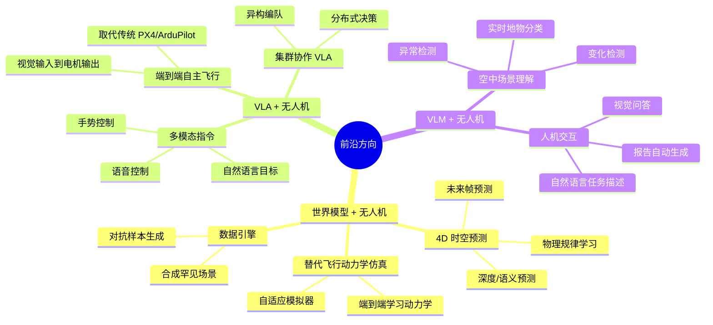
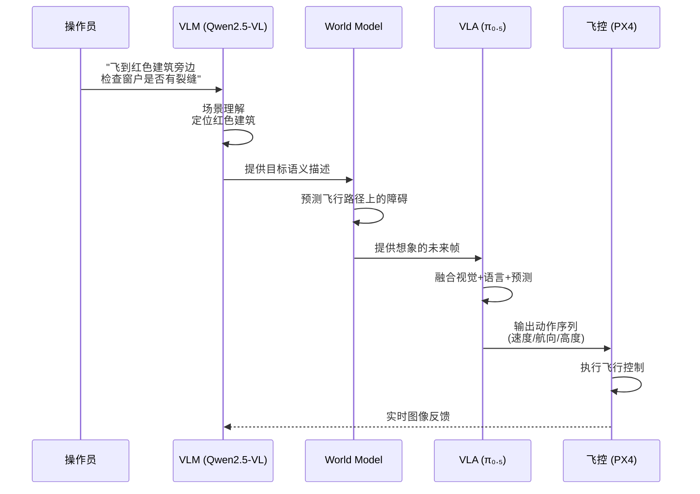
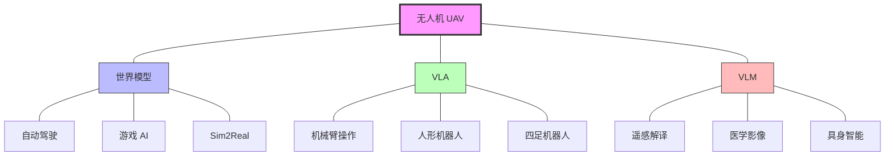

# World Models / VLA / VLM 领域全景图

> 本文以 Mermaid 思维导图与结构化文字，梳理世界模型（World Model）、视觉-语言-动作模型（VLA）、视觉-语言模型（VLM）在无人机/UAV 领域的整体关系。
> 适合初学者建立全局认知，也适合研究者快速定位自己所在的位置。

---

## 一、核心技术族谱总览

---

## 二、三大模型之间的关系

---

## 三、技术路线分类

### 3.1 世界模型的三大角色

| 角色 | 核心功能 | 代表工作 | 与无人机的关系 |
|:---:|:---:|:---:|:---|
| **策略模型** | 直接输出动作 | IRIS、DIAMOND | 可用于无人机导航策略学习 |
| **模拟器** | 预测下一状态 | UniSim、Cosmos | 替代/增强飞行动力学仿真器 |
| **视频生成** | 生成逼真视频帧 | Sora、GAIA-2 | 合成训练数据、场景预览 |

### 3.2 VLA 模型的架构分代

| 代次 | 时间 | 核心思路 | 代表模型 | 关键突破 |
|:---:|:---:|:---|:---|:---|
| 第一代 | 2023 | VLM + 动作 token 化 | RT-2 | 证明大模型可以直接输出动作 |
| 第二代 | 2024 初 | 开源 + 高效训练 | OpenVLA, Octo | 降低门槛，社区可复现 |
| 第三代 | 2024 末 | 流匹配 + 扩散 | π₀ | 连续动作输出，表达力更强 |
| 第四代 | 2025 | 推理增强 + 世界模型 | π₀.₅, VLA-AN | 融入世界模型进行"想象" |
| 第五代 | 2025+ | 具身基础模型 | CognitiveDrone | 无人机专用，长程推理 |

### 3.3 VLM 在遥感/无人机中的演进

---

## 四、无人机场景下的技术栈

---

## 五、关键问题与研究前沿

### 5.1 核心挑战

| 挑战 | 描述 | 相关研究方向 |
|:---|:---|:---|
| **sim-to-real gap** | 仿真与真实飞行环境差异大 | 域随机化、世界模型作为自适应模拟器 |
| **实时性** | VLA/VLM 推理延迟 vs 飞控 50-200Hz | 模型蒸馏、量化、边缘部署 |
| **安全性** | 无人机坠毁代价高 | 安全 RL、约束优化、形式化验证 |
| **长程决策** | 电池续航有限，需要高效规划 | 层次化 VLA、世界模型 + 搜索 |
| **数据稀缺** | 真实飞行数据收集成本高 | 仿真器合成、世界模型生成、少样本学习 |
| **集群可扩展** | 多机通信与协作策略 | 多智能体 VLA、分布式世界模型 |

### 5.2 前沿方向

---

## 六、典型应用案例

### 6.1 从语言指令到飞行动作

### 6.2 检查巡检场景

| 阶段 | 技术 | 说明 |
|:---|:---|:---|
| 起飞规划 | World Model | 预测天气、风场对飞行的影响 |
| 航线跟踪 | VLA | 根据视觉实时调整航迹 |
| 异常检测 | VLM | 理解"正常 vs 异常"语义 |
| 报告生成 | VLM | 自然语言描述发现的问题 |
| 返航决策 | World Model + VLA | 预测电量、规划最优返航路径 |

---

## 七、与其他领域的交叉

---

## 八、学习路线建议

| 阶段 | 目标 | 建议时长 |
|:---:|:---|:---:|
| **入门** | 理解 VLM 基础、Transformer、多模态 | 2-3 周 |
| **基础** | 掌握 World Model 核心概念（表征、预测） | 2-3 周 |
| **进阶** | 深入 VLA 架构（RT-2, OpenVLA, π₀） | 3-4 周 |
| **专题** | 无人机 VLA/WM 前沿论文 | 2-4 周 |
| **实践** | 仿真环境搭建 + 模型微调/部署 | 4-8 周 |

> 详细的论文阅读顺序请参考 [reading-order.md](reading-order.md)。
> 完整论文列表请参考 [../references/paper-list.md](../references/paper-list.md)。

---

*本文件为 UAV-WM-VLA-Learning 项目的一部分，最后更新：2026-05-10。*
