# 论文阅读路线图

> 本文为不同学习目标的读者提供结构化的论文阅读建议。按难度分级、按主题分组，配合前置知识依赖关系，帮助你高效地进入世界模型与 VLA 领域。

---

## 一、总体阅读路线图

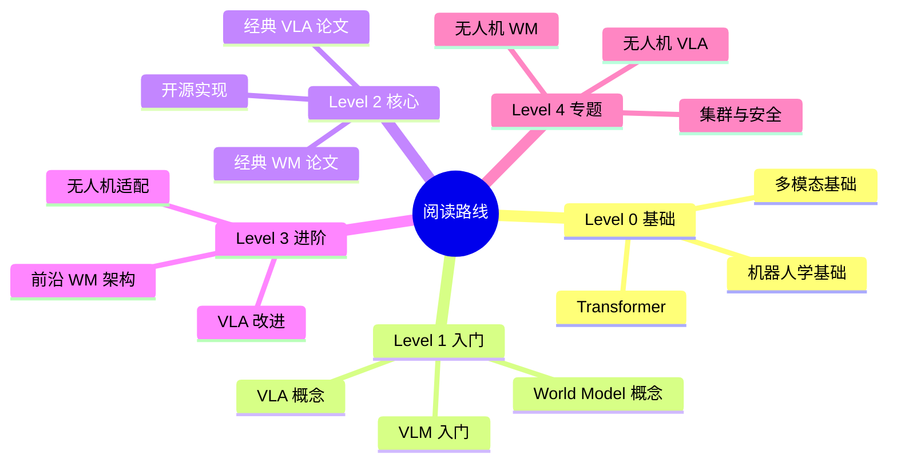

---

## 二、按目标的阅读路径

### 路径 A：理解基础概念（2-3 周）

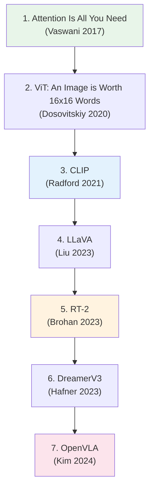

| 序号 | 论文 | 年份 | 阅读目的 | 预计时间 |
|:---:|:---|:---:|:---|:---:|
| 1 | Attention Is All You Need | 2017 | 理解 Transformer 基础 | 3h |
| 2 | ViT | 2020 | 视觉 Transformer 入门 | 2h |
| 3 | CLIP | 2021 | 视觉-语言对齐 | 2h |
| 4 | LLaVA | 2023 | 理解 VLM 基本架构 | 3h |
| 5 | RT-2 | 2023 | VLA 的开创性工作 | 3h |
| 6 | DreamerV3 | 2023 | 世界模型经典方法 | 4h |
| 7 | OpenVLA | 2024 | 开源 VLA 基线 | 3h |

### 路径 B：深入世界模型（3-4 周）

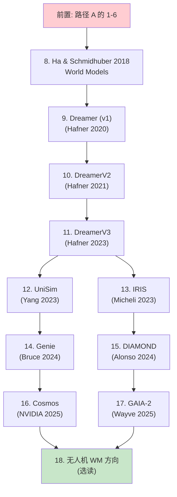

**世界模型必读清单：**

| 序号 | 论文 | 核心贡献 | 难度 |
|:---:|:---|:---|:---:|
| 8 | World Models (Ha 2018) | 首个神经网络世界模型 | ★★ |
| 9 | Dreamer (2020) | 隐空间 + RL | ★★★ |
| 10 | DreamerV2 (2021) | 离散隐变量 | ★★★ |
| 11 | DreamerV3 (2023) | 通用隐空间世界模型 | ★★★ |
| 12 | UniSim (2023) | 统一模拟器概念 | ★★★ |
| 13 | IRIS (2023) | Transformer + IDM | ★★★★ |
| 14 | Genie (2024) | 11B 交互世界模型 | ★★★★ |
| 15 | DIAMOND (2024) | 扩散世界模型 | ★★★★ |
| 16 | Cosmos (2025) | 物理世界基础模型 | ★★★★★ |
| 17 | GAIA-2 (2025) | 自动驾驶世界模型 | ★★★★★ |

### 路径 C：深入 VLA（3-4 周）

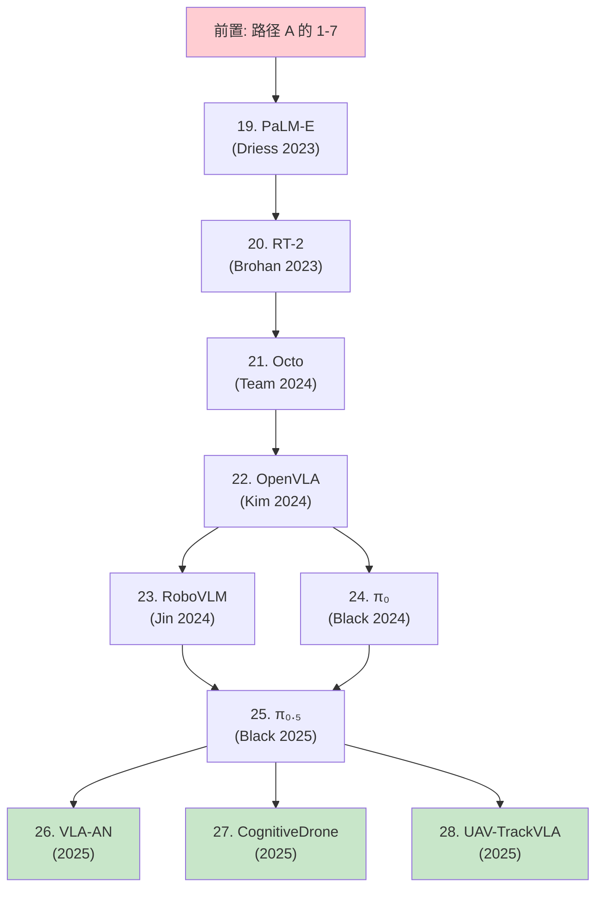

**VLA 必读清单：**

| 序号 | 论文 | 核心贡献 | 难度 |
|:---:|:---|:---|:---:|
| 19 | PaLM-E (2023) | 首个具身多模态大模型 | ★★★ |
| 20 | RT-2 (2023) | 动作 token 化 | ★★★ |
| 21 | Octo (2024) | 开源通用机器人策略 | ★★★ |
| 22 | OpenVLA (2024) | 开源 VLA 基线 | ★★★ |
| 23 | RoboVLM (2024) | VLA 架构系统研究 | ★★★★ |
| 24 | π₀ (2024) | 流匹配 VLA | ★★★★ |
| 25 | π₀.₅ (2025) | 世界模型增强 VLA | ★★★★★ |
| 26 | VLA-AN (2025) | 无人机专用 VLA | ★★★★ |
| 27 | CognitiveDrone (2025) | 认知无人机 | ★★★★★ |
| 28 | UAV-TrackVLA (2025) | 跟踪任务 VLA | ★★★★ |

### 路径 D：实用项目导向（4-8 周）

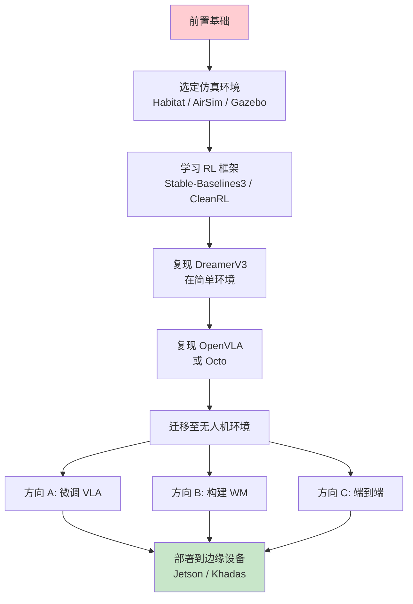

**实践项目建议：**

| 阶段 | 任务 | 产出 |
|:---:|:---|:---|
| 1 | 搭建仿真环境（AirSim / Gazebo + PX4） | 可运行的无人机仿真 |
| 2 | 训练基础策略（PPO/SAC） | 简单导航策略 |
| 3 | 集成 VLM 做场景理解 | 语言指令 -> 场景描述 |
| 4 | 复现 OpenVLA/π₀ 在仿真中 | VLA 在仿真中工作 |
| 5 | 添加世界模型辅助 | 提升策略性能 |
| 6 | 部署到真实/边缘设备 | 端侧推理演示 |

---

## 三、按主题的详细阅读清单

### 3.1 世界模型主题

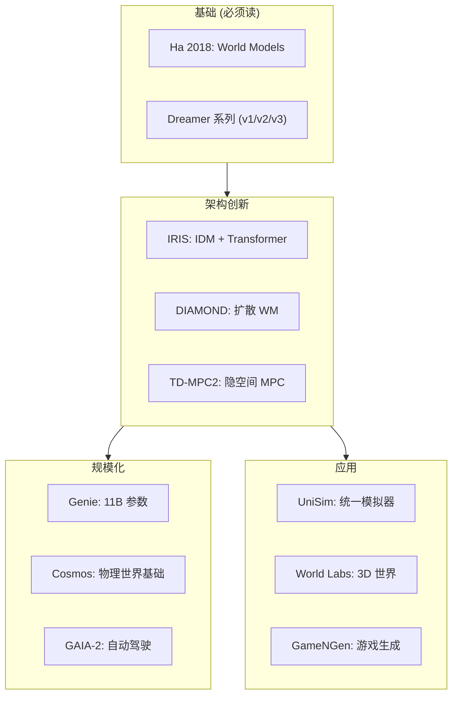

### 3.2 VLA 主题

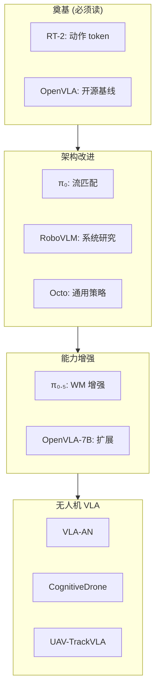

### 3.3 VLM 主题

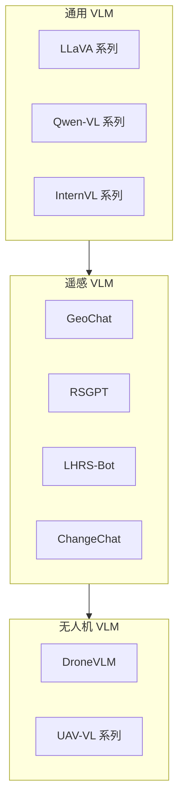

---

## 四、按难度分级

### Level 0：前置知识（1-2 周）

| 主题 | 推荐资源 | 备注 |
|:---|:---|:---|
| Transformer 原理 | Attention Is All You Need | 必读 |
| 视觉 Transformer | ViT, DeiT | 必读 |
| 多模态基础 | CLIP, SigLIP | 必读 |
| 扩散模型基础 | DDPM, DDIM | 世界模型方向必读 |
| 强化学习基础 | Spinning Up in Deep RL | WM+RL 方向必读 |
| 机器人学基础 | 任意 ROS2 教程 | 实践方向必读 |

### Level 1：入门论文（2-3 周）

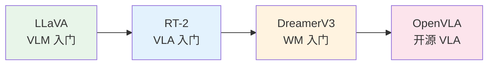

### Level 2：核心论文（3-4 周）

| 方向 | 必读论文 | 推荐论文 |
|:---|:---|:---|
| WM 架构 | IRIS, DIAMOND | TD-MPC2, GameNGen |
| WM 规模化 | Genie, Cosmos | GAIA-2, World Labs |
| VLA 架构 | π₀, Octo | RoboVLM |
| VLM 遥感 | GeoChat, RSGPT | LHRS-Bot, ChangeChat |

### Level 3：前沿论文（2-4 周）

| 方向 | 论文 | 难度 |
|:---|:---|:---:|
| WM + VLA 融合 | π₀.₅ | ★★★★★ |
| 无人机 VLA | VLA-AN, CognitiveDrone | ★★★★ |
| 无人机 WM | Neural Flyer 相关 | ★★★★ |
| 3D 世界模型 | World Labs | ★★★★★ |
| 集群 VLA | 多智能体方向 | ★★★★★ |

### Level 4：专题深入（按需）

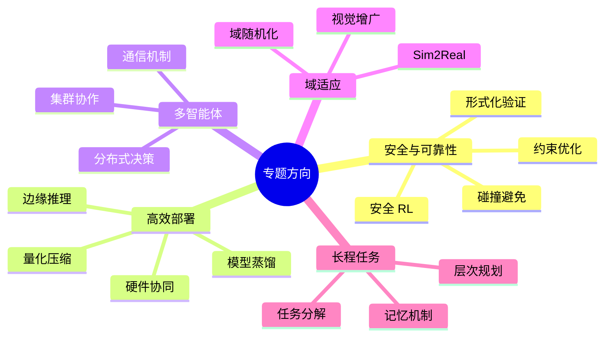

---

## 五、论文阅读技巧

### 5.1 三遍阅读法

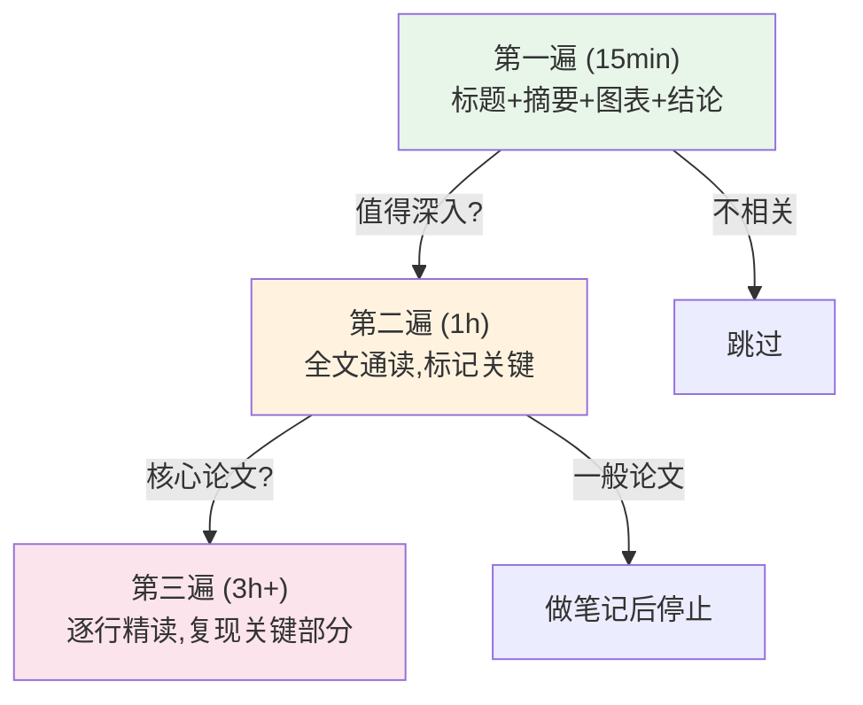

### 5.2 阅读笔记模板

```markdown
## [论文标题]

**一句话总结:** ...

**核心问题:** 这篇论文试图解决什么问题？

**关键方法:**
- 创新点 1: ...
- 创新点 2: ...

**实验结果:**
- 在 XX 数据集上，XX 指标提升了 XX%
- 与 YY 方法相比，优势在于...

**对无人机方向的启示:**
- 这个方法如何应用到无人机场景？
- 需要做哪些适配？

**相关论文:** [列出相关/引用论文]
```

### 5.3 建立知识图谱

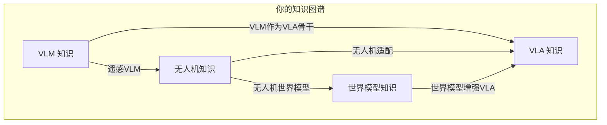

---

## 六、推荐学习周历

### 周历总览（16 周计划）

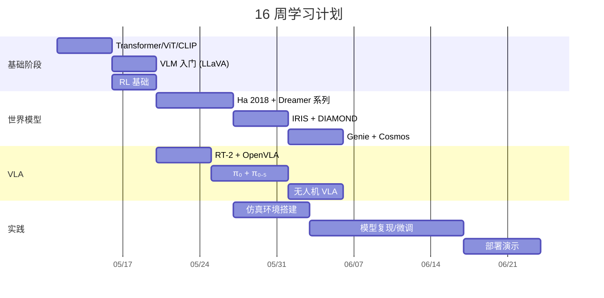

### 每周建议

| 周 | 主题 | 论文/任务 | 产出 |
|:---:|:---|:---|:---|
| 1 | 基础 | Transformer, ViT, CLIP | 笔记总结 |
| 2 | VLM 入门 | LLaVA, SigLIP | 概念笔记 |
| 3 | WM 入门 | Ha 2018, DreamerV3 | 对比笔记 |
| 4 | VLA 入门 | RT-2, OpenVLA | 架构分析 |
| 5 | WM 进阶 | IRIS, DIAMOND | 深度笔记 |
| 6 | WM 规模化 | Genie, Cosmos | 趋势分析 |
| 7 | VLA 进阶 | π₀, Octo | 技术分析 |
| 8 | VLA 增强 | π₀.₅, RoboVLM | 创新点总结 |
| 9 | 无人机 VLA | VLA-AN, CognitiveDrone | 应用分析 |
| 10 | 仿真搭建 | AirSim/PX4 环境 | 可运行环境 |
| 11 | WM 复现 | 简单环境 WM | 代码仓库 |
| 12 | VLA 复现 | 微调 OpenVLA/π₀ | 微调模型 |
| 13 | 无人机适配 | 无人机仿真集成 | 初步结果 |
| 14 | 优化调试 | 性能调优 | 改进结果 |
| 15 | 部署准备 | 模型压缩/量化 | 部署就绪 |
| 16 | 演示总结 | 整理成果 | 演示视频 |

---

## 七、学习资源推荐

### 7.1 在线课程

| 课程 | 平台 | 相关度 | 备注 |
|:---|:---|:---:|:---|
| CS231n | Stanford | ★★★ | 视觉基础 |
| CS224n | Stanford | ★★★ | NLP 基础 |
| Deep RL Course | HuggingFace | ★★★★ | RL 实践 |
| Embodied AI Survey | arXiv 综述 | ★★★★★ | 领域全景 |

### 7.2 GitHub 仓库

| 仓库 | 内容 | 推荐度 |
|:---|:---|:---:|
| octo-models/octo | Octo 开源实现 | ★★★★ |
| openvla/openvla | OpenVLA 开源 | ★★★★★ |
| NVlabs/cosmos | NVIDIA Cosmos | ★★★★ |
| worldmodels/worldmodels | 经典 WM 教程 | ★★★ |
| NTUMARS/Awesome-World-Model | WM 论文列表 | ★★★★★ |

### 7.3 综述论文

| 综述 | 主题 | 推荐度 |
|:---|:---|:---:|
| "A Survey on Vision-Language-Action Models" | VLA 综述 | ★★★★★ |
| "World Models for Autonomous Driving" | WM + 自动驾驶 | ★★★★ |
| "Foundation Models for Robotics" | 机器人基础模型 | ★★★★ |
| "A Survey of Embodied AI" | 具身 AI 综述 | ★★★★ |

---

## 八、常见问题

**Q: 我没有机器人学背景，能学 VLA 吗？**
> 可以。VLA 更偏重深度学习和多模态，机器人学基础可以通过 ROS2 教程快速补充。建议先走路径 A 建立基础。

**Q: 我主要关注无人机，需要读所有论文吗？**
> 不需要。建议先走路径 A，然后直接跳到无人机专用论文（路径 C 的后半部分）。世界模型可以选读 DreamerV3 和 Cosmos。

**Q: 理论 vs 实践如何平衡？**
> 建议 40% 理论 + 60% 实践。每读 2-3 篇论文就尝试复现或修改代码。路径 D 的实践导向最适合。

**Q: 需要什么硬件？**
> - 学习理论：普通笔记本即可
> - 模型训练：至少 1x RTX 4090 (24GB)
> - 无人机仿真：RTX 3060 以上 + 16GB RAM
> - 边缘部署：Jetson Orin Nano / Khadas VIM4

---

*本文件为 UAV-WM-VLA-Learning 项目的一部分，最后更新：2026-05-10。*
