# VLA 演进时间线

> 本文以 Mermaid 时间线与思维导图，追踪视觉-语言-动作模型（VLA）从 2023 年至 2025 年的演进历程，并专门梳理无人机领域的 VLA 研究进展。

---

## 一、VLA 发展全景时间线

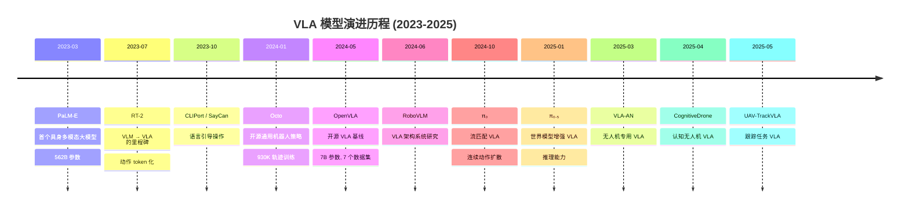

---

## 二、第一代：奠基之作 (2023)

### 2.1 PaLM-E (2023.03)

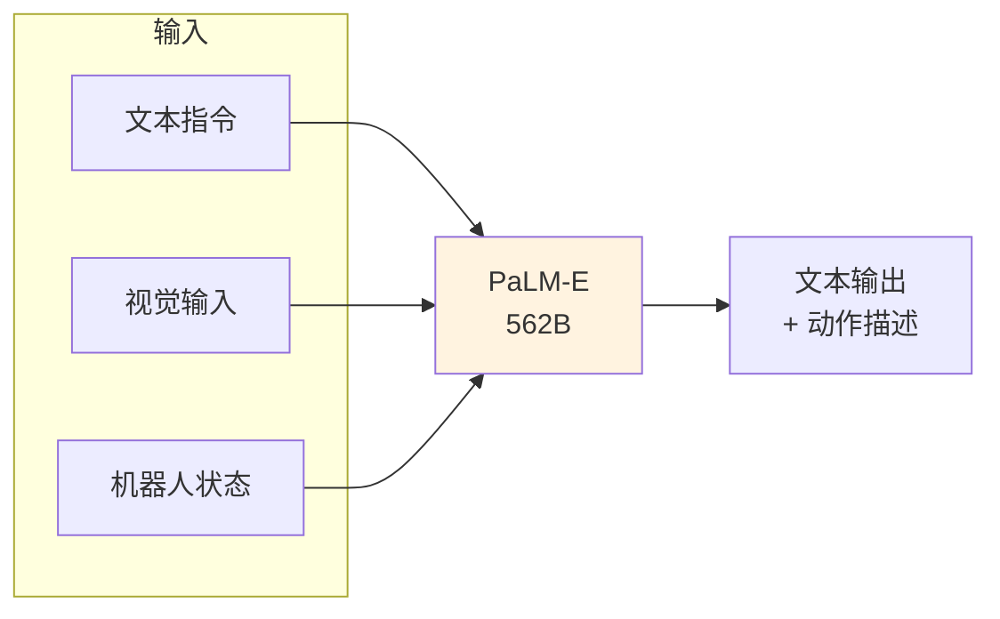

**核心创新：**
- 将多种模态（文本、图像、状态）直接嵌入到大语言模型 PaLM 中
- 端到端训练，不需要单独的视觉编码器
- 562B 参数，展示了具身推理能力

**局限性：**
- 模型太大，无法实时部署
- 动作输出仍以文本描述为主，非直接控制

### 2.2 RT-2 (2023.07) — VLA 的开创者

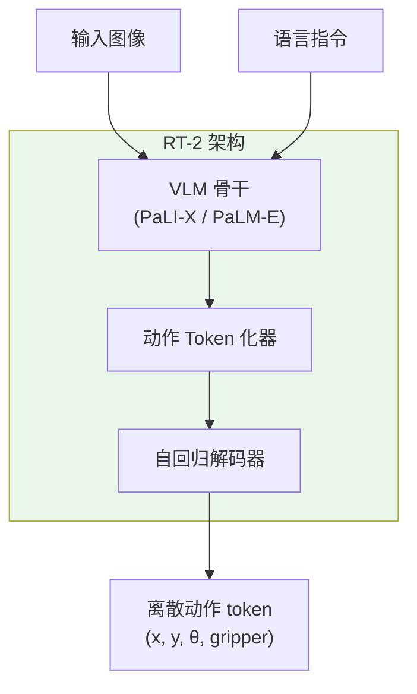

**关键突破：**

| 维度 | 创新点 |
|:---|:---|
| **动作表示** | 将连续动作离散化为 256 个 bin，映射为文本 token |
| **训练方式** | 在 VLM 预训练基础上做动作微调 |
| **涌现能力** | 展示了未见过的目标泛化、语义推理 |
| **规模** | 55B 参数 (PaLI-X) |

**对无人机的启示：**
- 证明大模型可以直接输出低层控制信号
- 但离散化损失精度，不适合精细飞行控制

---

## 三、第二代：开源与效率 (2024 上半年)

### 3.1 Octo (2024.01)

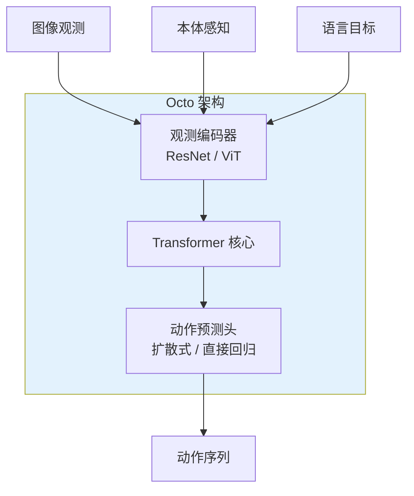

**关键特点：**

| 特性 | 描述 |
|:---|:---|
| **数据规模** | 930,000 条机器人轨迹，来自 Open X-Embodiment |
| **开源** | 完全开源，社区可复现 |
| **动作头** | 支持扩散式和直接回归两种 |
| **通用性** | 单模型可控制多种机器人 |

### 3.2 OpenVLA (2024.05)

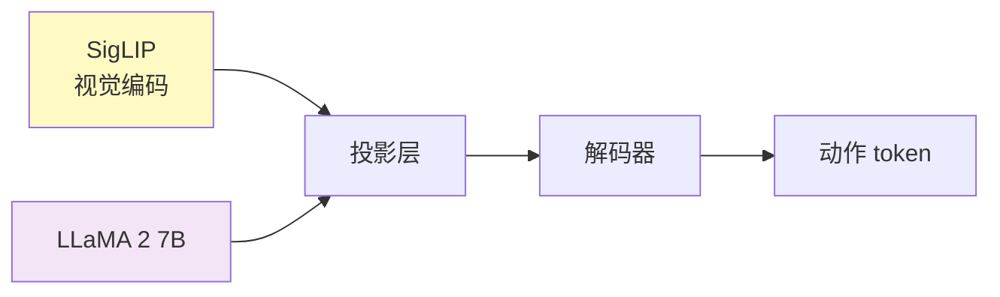

**里程碑意义：**

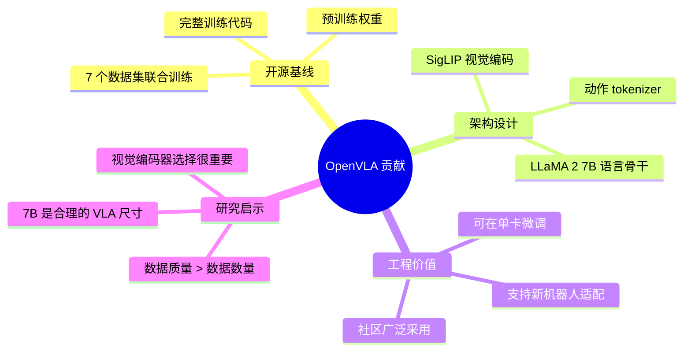

### 3.3 第二代的核心进步

| 对比维度 | 第一代 (RT-2) | 第二代 (OpenVLA/Octo) |
|:---|:---|:---|
| 开源程度 | 闭源 | 完全开源 |
| 参数规模 | 55B | 7B / 93M |
| 训练数据 | Google 内部数据 | 公开数据集 |
| 动作表示 | 离散 token | 离散 token / 连续 |
| 可复现性 | 不可 | 完全可复现 |
| 社区影响 | 学术启发 | 实际推动 |

---

## 四、第三代：连续动作与流匹配 (2024 下半年)

### 4.1 π₀ (2024.10)

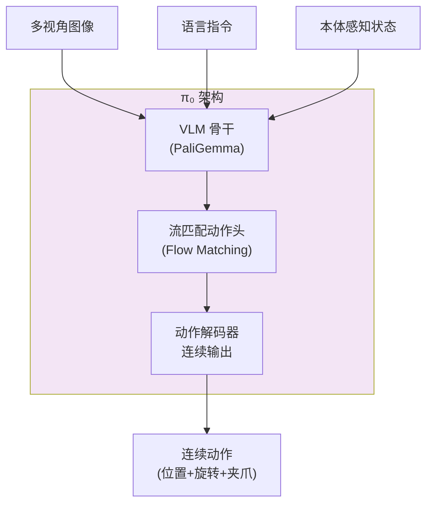

**核心创新：**

| 创新点 | 描述 | 优势 |
|:---|:---|:---|
| **流匹配动作头** | 使用 Flow Matching 代替离散 token | 保留动作连续性，精度更高 |
| **预训练策略** | 大规模异构数据预训练 | 跨机器人迁移能力 |
| **PaliGemma 骨干** | 高效的 VLM 基础 | 平衡性能与效率 |
| **多任务统一** | 单一模型处理多种操作任务 | 减少模型数量 |

**流匹配 vs 离散化对比：**

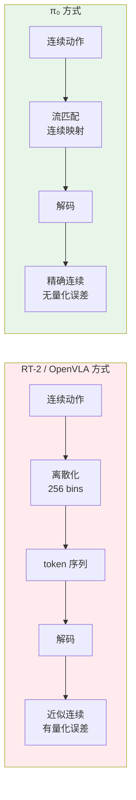

### 4.2 π₀ 的训练范式

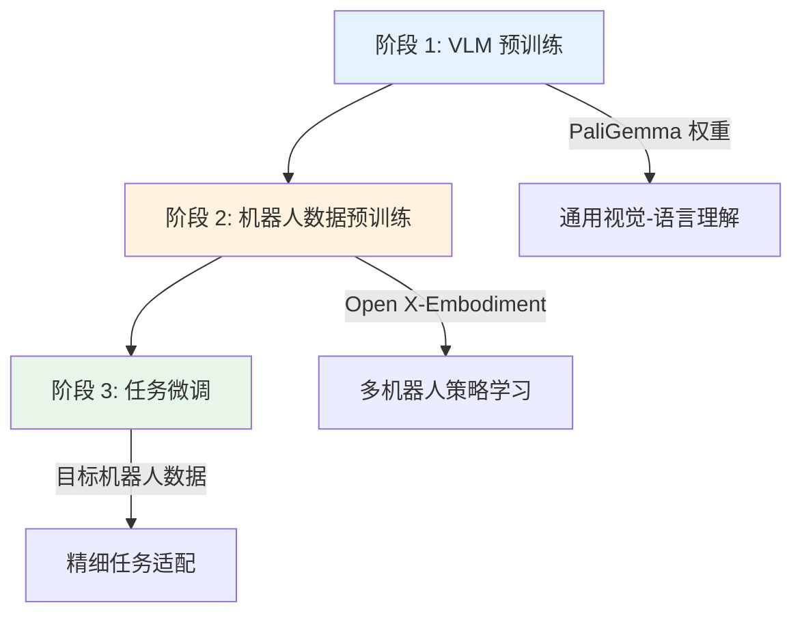

---

## 五、第四代：世界模型增强 (2025)

### 5.1 π₀.₅ (2025.01)

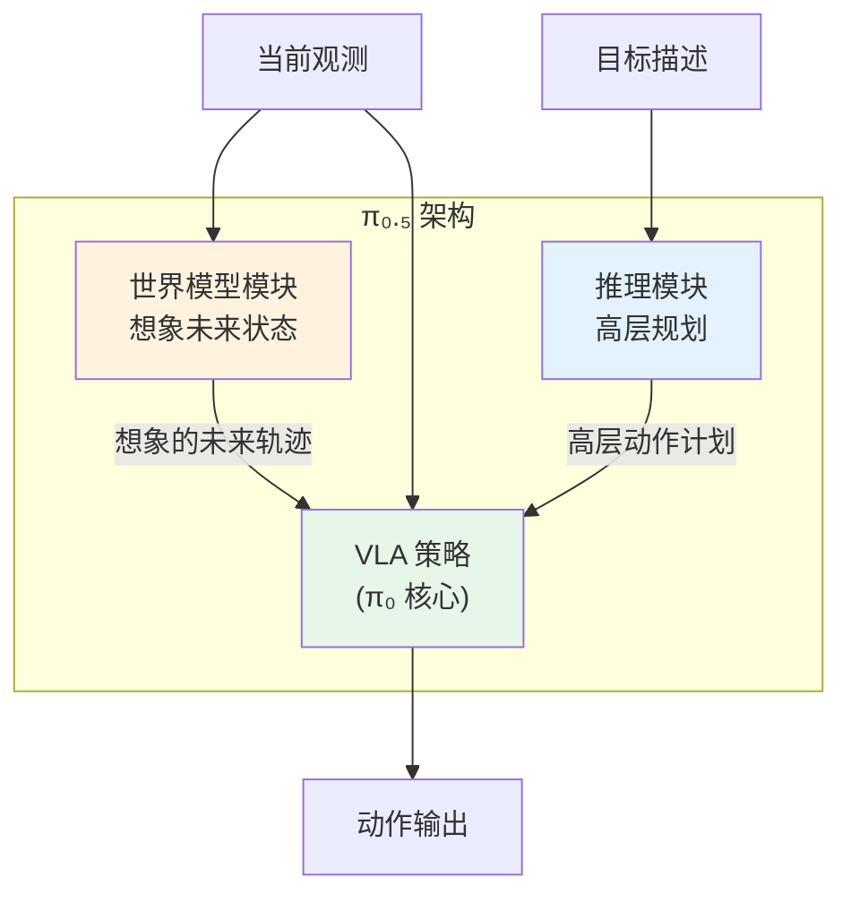

**关键突破：**

| 突破点 | 描述 |
|:---|:---|
| **世界模型融合** | 在 VLA 中嵌入世界模型进行"想象" |
| **推理能力** | 支持多步推理和长程规划 |
| **鲁棒性提升** | 通过想象对抗性场景提高鲁棒性 |
| **泛化能力** | 未见环境的零样本迁移 |

### 5.2 π₀ → π₀.₅ 的进化

```mermaid
graph LR
    Pi0["π₀<br/>2024.10"] -->|"添加世界模型"| Pi05["π₀.₅<br/>2025.01"]
    Pi0 -->|"添加推理模块"| Pi05

    subgraph π₀能力
        P1["流匹配动作"]
        P2["多任务预训练"]
        P3["连续动作输出"]
    end

    subgraph π₀.₅新增能力
        N1["世界模型想象"]
        N2["多步推理"]
        N3["长程规划"]
        N4["鲁棒泛化"]
    end

    π₀能力 --> π₀.₅新增能力
```

---

## 六、无人机专用 VLA (2025)

### 6.1 无人机 VLA 的挑战

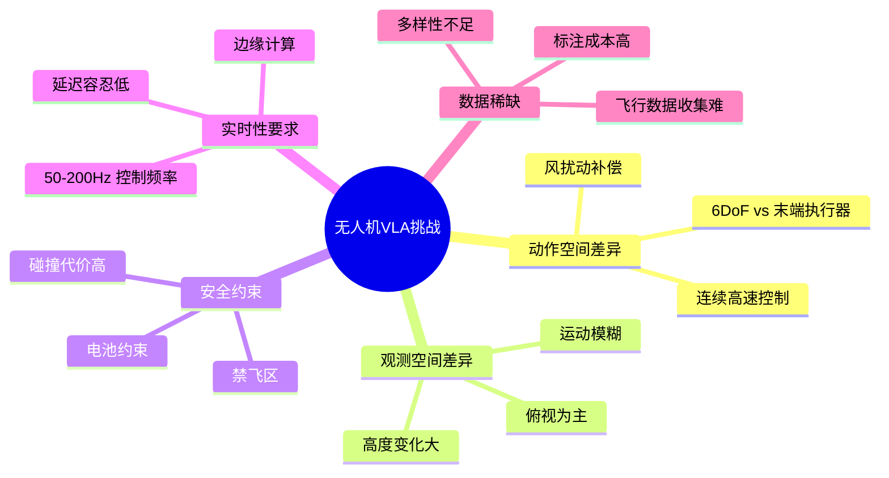

### 6.2 VLA-AN (2025.03)

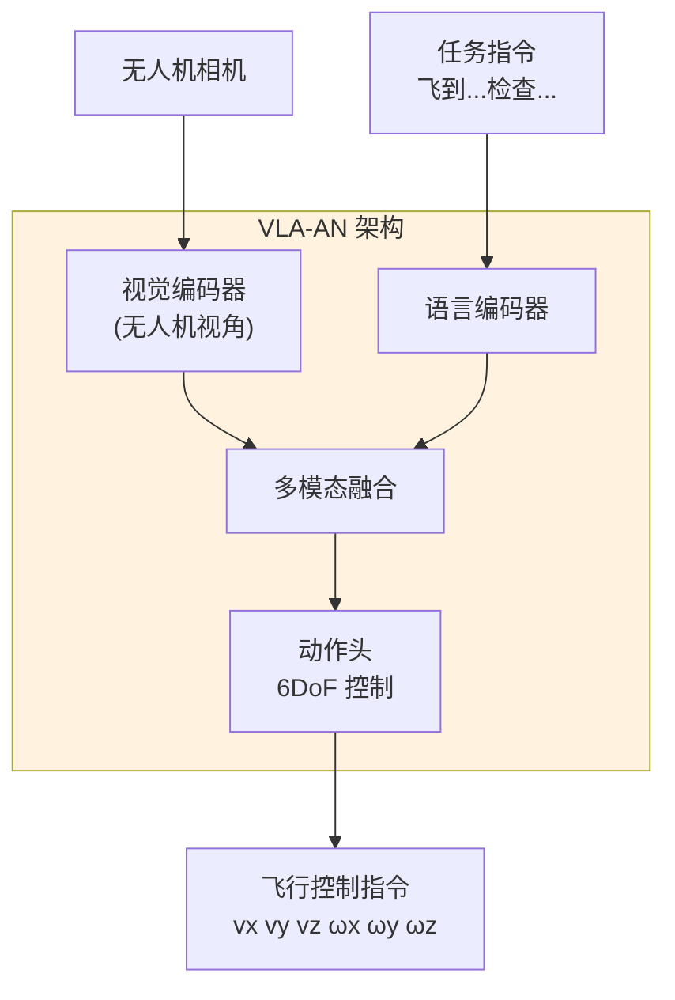

**VLA-AN 的创新：**

| 维度 | 创新 |
|:---|:---|
| **动作空间** | 适配无人机 6DoF 控制（非夹爪操作） |
| **视角编码** | 专门处理俯视/倾斜视角 |
| **动态补偿** | 隐式学习风扰动补偿 |
| **安全层** | 添加碰撞避免安全层 |

### 6.3 CognitiveDrone (2025.04)

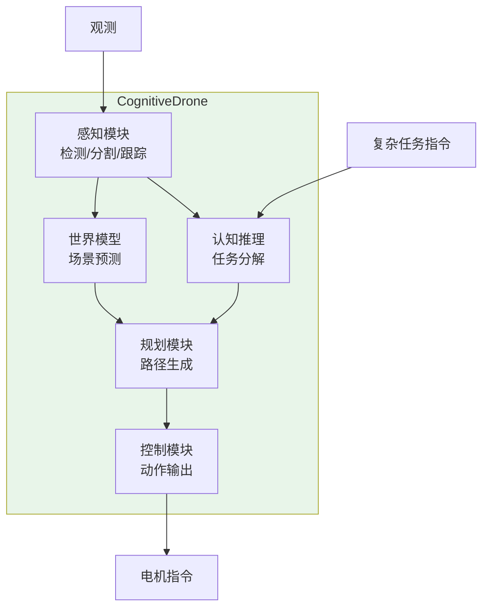

**核心特点：**
- **认知分层：** 将任务分解为感知-认知-规划-控制的层次结构
- **世界模型集成：** 用世界模型预测未来场景，辅助规划
- **复杂任务：** 支持多步骤任务（如"飞到建筑，环绕一圈，检查异常"）

### 6.4 UAV-TrackVLA (2025.05)

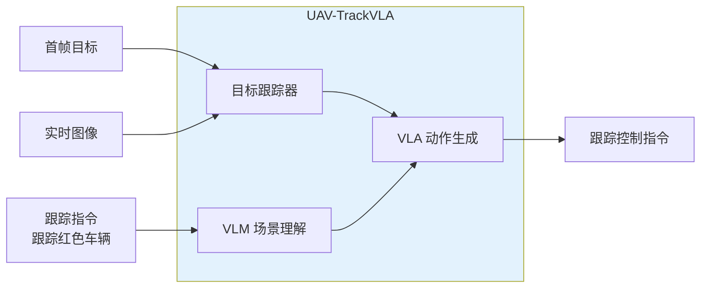

**应用场景：**
- 目标跟踪（车辆、行人、特定物体）
- 搜索与救援
- 安防巡逻

---

## 七、VLA 架构演进对比

### 7.1 五代 VLA 的架构对比

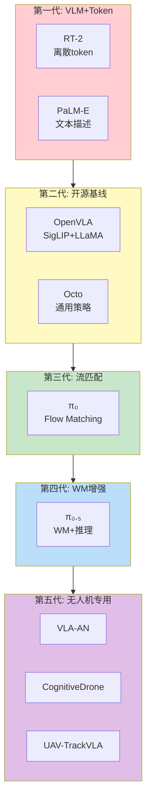

### 7.2 关键指标对比

| 模型 | 年份 | 参数量 | 动作类型 | 开源 | 世界模型 | 无人机适配 |
|:---:|:---:|:---:|:---:|:---:|:---:|:---:|
| RT-2 | 2023 | 55B | 离散 | 否 | 否 | 否 |
| Octo | 2024 | 93M | 离散/连续 | 是 | 否 | 否 |
| OpenVLA | 2024 | 7B | 离散 | 是 | 否 | 否 |
| pi_0 | 2024 | 3B | 连续(流匹配) | 部分 | 否 | 否 |
| pi_0.5 | 2025 | 3B+ | 连续(流匹配) | 部分 | 是 | 否 |
| VLA-AN | 2025 | ~3B | 连续(6DoF) | 是 | 否 | 是 |
| CognitiveDrone | 2025 | ~7B | 分层控制 | 部分 | 是 | 是 |
| UAV-TrackVLA | 2025 | ~3B | 连续跟踪 | 是 | 否 | 是 |

---

## 八、未来展望

### 8.1 VLA 的下一个前沿

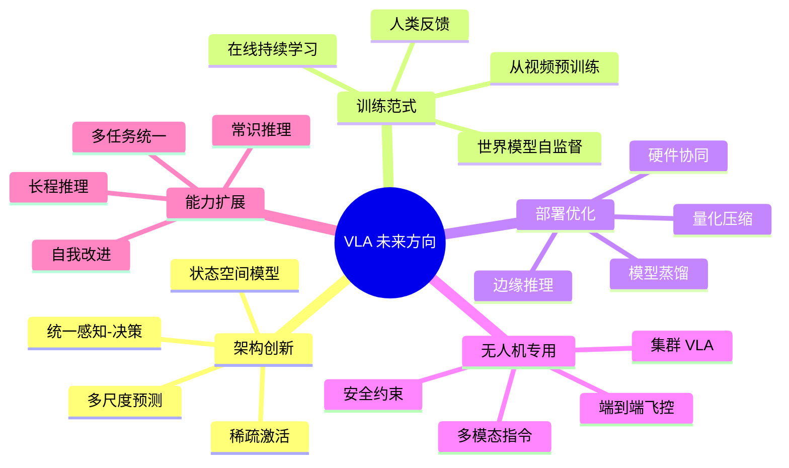

### 8.2 无人机 VLA 的技术路线预测

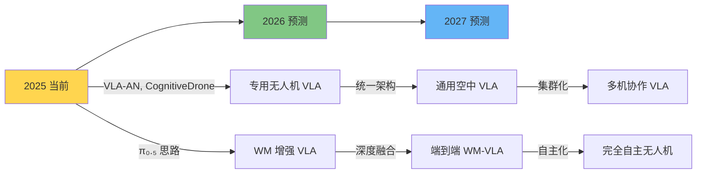

---

## 九、学习建议

| 学习目标 | 推荐阅读顺序 | 预计时间 |
|:---|:---|:---:|
| **理解 VLA 基本概念** | PaLM-E → RT-2 → OpenVLA | 1-2 周 |
| **掌握架构设计** | OpenVLA → π₀ → π₀.₅ | 2-3 周 |
| **专注无人机 VLA** | π₀.₅ → VLA-AN → CognitiveDrone | 2-3 周 |
| **全面深入** | 按时间线全部阅读 | 4-6 周 |

> 详细的论文阅读顺序请参考 [reading-order.md](reading-order.md)。
> 完整论文列表请参考 [../references/paper-list.md](../references/paper-list.md)。

---

*本文件为 UAV-WM-VLA-Learning 项目的一部分，最后更新：2026-05-10。*
