# VLA 演进时间线

> 本文以 Mermaid 时间线与思维导图，追踪视觉-语言-动作模型（VLA）从 2023 年至 2026 年的演进历程，并专门梳理无人机领域的 VLA 研究进展。
>
> 架构代际止于第四代（π₀.₅）。2026 年之后不再产出"下一代架构"，而是拆成五个各自独立的方向 —— 这条线见 [01-VLA架构演进 §7.3](../docs/03-VLA专题/01-VLA架构演进.md)。

---

## 一、VLA 发展全景时间线

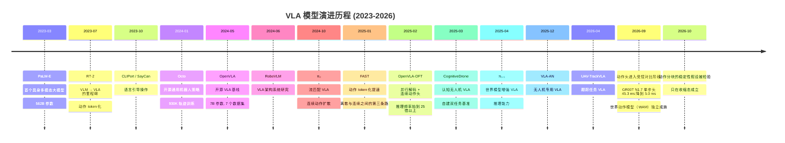
```mermaid
timeline
    title VLA 模型演进历程 (2023-2026)
    2023-03 : PaLM-E
             : 首个具身多模态大模型
             : 562B 参数
    2023-07 : RT-2
             : VLM → VLA 的里程碑
             : 动作 token 化
    2023-10 : CLIPort / SayCan
             : 语言引导操作
    2024-01 : Octo
             : 开源通用机器人策略
             : 930K 轨迹训练
    2024-05 : OpenVLA
             : 开源 VLA 基线
             : 7B 参数, 7 个数据集
    2024-06 : RoboVLM
             : VLA 架构系统研究
    2024-10 : π₀
             : 流匹配 VLA
             : 连续动作扩散
    2025-01 : FAST
             : 动作 token 化提速
             : 离散与连续之间的第三条路
    2025-02 : OpenVLA-OFT
             : 并行解码 + 连续动作头
             : 推理频率抬到 25 倍以上
    2025-03 : CognitiveDrone
             : 认知无人机 VLA
             : 自建双任务基准
    2025-04 : π₀.₅
             : 世界模型增强 VLA
             : 推理能力
    2025-12 : VLA-AN
             : 无人机专用 VLA
    2026-04 : UAV-TrackVLA
             : 跟踪任务 VLA
    2026-09 : 动作头进入受控对比阶段
             : GR00T N1.7 单步头 45.3 ms 降到 5.0 ms
             : 世界动作模型（WAM）独立成族
    2026-10 : 动作分块的稳定性假设被检验
             : 只在收缩态成立
```

---

## 二、第一代：奠基之作 (2023)

### 2.1 PaLM-E (2023.03)

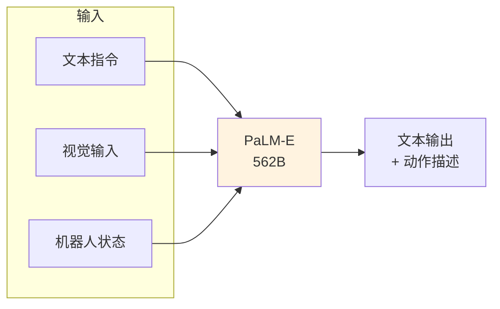
```mermaid
graph LR
    subgraph 输入
        Text["文本指令"]
        Image["视觉输入"]
        State["机器人状态"]
    end

    PaLME["PaLM-E<br/>562B"] --> Output["文本输出<br/>+ 动作描述"]

    Text --> PaLME
    Image --> PaLME
    State --> PaLME

    style PaLME fill:#fff3e0
```

**核心创新：**
- 将多种模态（文本、图像、状态）直接嵌入到大语言模型 PaLM 中
- 端到端训练，不需要单独的视觉编码器
- 562B 参数，展示了具身推理能力

**局限性：**
- 模型太大，无法实时部署
- 动作输出仍以文本描述为主，非直接控制

### 2.2 RT-2 (2023.07) — VLA 的开创者

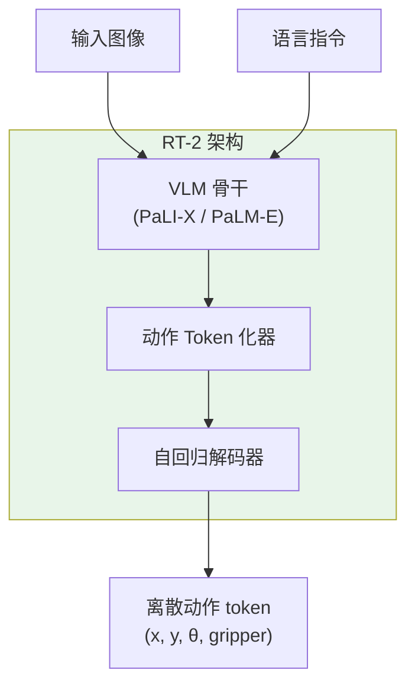
```mermaid
graph TB
    subgraph RT2["RT-2 架构"]
        VLM["VLM 骨干<br/>(PaLI-X / PaLM-E)"]
        Tokenizer["动作 Token 化器"]
        Decoder["自回归解码器"]
    end

    Image["输入图像"] --> VLM
    Instruction["语言指令"] --> VLM
    VLM --> Tokenizer
    Tokenizer --> Decoder
    Decoder --> Action["离散动作 token<br/>(x, y, θ, gripper)"]

    style RT2 fill:#e8f5e9
```

**关键突破：**

| 维度 | 创新点 |
|:---|:---|
| **动作表示** | 将连续动作离散化为 256 个 bin，映射为文本 token |
| **训练方式** | 在 VLM 预训练基础上做动作微调 |
| **涌现能力** | 展示了未见过的目标泛化、语义推理 |
| **规模** | 55B 参数 (PaLI-X) |

**对无人机的启示：**
- 证明大模型可以直接输出低层控制信号
- 但离散化损失精度，不适合精细飞行控制

---

## 三、第二代：开源与效率 (2024 上半年)

### 3.1 Octo (2024.01)

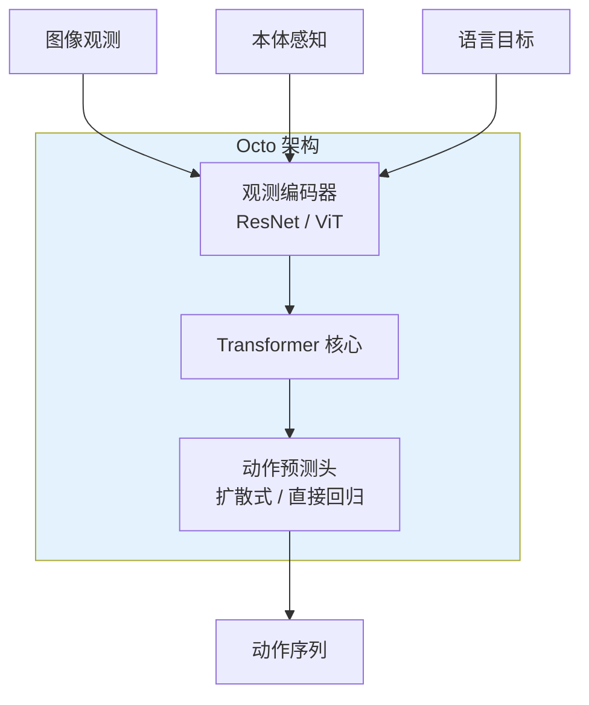
```mermaid
graph TB
    subgraph Octo["Octo 架构"]
        ObsEnc["观测编码器<br/>ResNet / ViT"]
        ActionPred["动作预测头<br/>扩散式 / 直接回归"]
        Transformer["Transformer 核心"]
    end

    ImageObs["图像观测"] --> ObsEnc
    Proprio["本体感知"] --> ObsEnc
    TextGoal["语言目标"] --> ObsEnc
    ObsEnc --> Transformer
    Transformer --> ActionPred
    ActionPred --> Actions["动作序列"]

    style Octo fill:#e3f2fd
```

**关键特点：**

| 特性 | 描述 |
|:---|:---|
| **数据规模** | 930,000 条机器人轨迹，来自 Open X-Embodiment |
| **开源** | 完全开源，社区可复现 |
| **动作头** | 支持扩散式和直接回归两种 |
| **通用性** | 单模型可控制多种机器人 |

### 3.2 OpenVLA (2024.05)

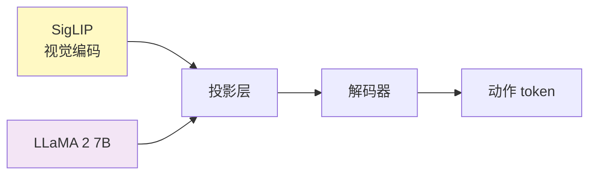
```mermaid
graph LR
    SigLIP["SigLIP<br/>视觉编码"] --> Proj["投影层"]
    LLM["LLaMA 2 7B"] --> Proj
    Proj --> Decoder["解码器"]
    Decoder --> ActionTokens["动作 token"]

    style SigLIP fill:#fff9c4
    style LLM fill:#f3e5f5
```

**里程碑意义：**

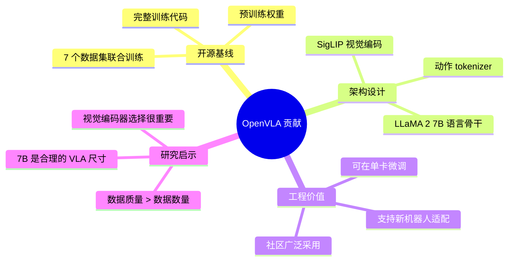
```mermaid
mindmap
  root((OpenVLA 贡献))
    开源基线
      完整训练代码
      预训练权重
      7 个数据集联合训练
    架构设计
      SigLIP 视觉编码
      LLaMA 2 7B 语言骨干
      动作 tokenizer
    工程价值
      可在单卡微调
      支持新机器人适配
      社区广泛采用
    研究启示
      视觉编码器选择很重要
      数据质量 > 数据数量
      7B 是合理的 VLA 尺寸
```

### 3.3 第二代的核心进步

| 对比维度 | 第一代 (RT-2) | 第二代 (OpenVLA/Octo) |
|:---|:---|:---|
| 开源程度 | 闭源 | 完全开源 |
| 参数规模 | 55B | 7B / 93M |
| 训练数据 | Google 内部数据 | 公开数据集 |
| 动作表示 | 离散 token | 离散 token / 连续 |
| 可复现性 | 不可 | 完全可复现 |
| 社区影响 | 学术启发 | 实际推动 |

---

## 四、第三代：连续动作与流匹配 (2024 下半年)

### 4.1 π₀ (2024.10)

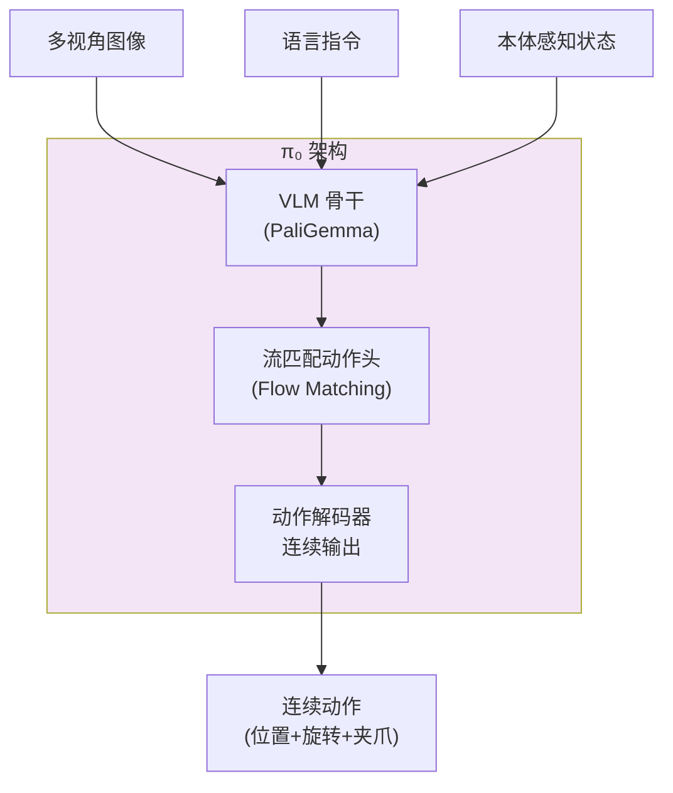
```mermaid
graph TB
    subgraph Pi0["π₀ 架构"]
        VLMBackbone["VLM 骨干<br/>(PaliGemma)"]
        FlowMatching["流匹配动作头<br/>(Flow Matching)"]
        ActionDecoder["动作解码器<br/>连续输出"]
    end

    Images["多视角图像"] --> VLMBackbone
    Language["语言指令"] --> VLMBackbone
    Proprioception["本体感知状态"] --> VLMBackbone

    VLMBackbone --> FlowMatching
    FlowMatching --> ActionDecoder
    ActionDecoder --> ContAction["连续动作<br/>(位置+旋转+夹爪)"]

    style Pi0 fill:#f3e5f5
```

**核心创新：**

| 创新点 | 描述 | 优势 |
|:---|:---|:---|
| **流匹配动作头** | 使用 Flow Matching 代替离散 token | 保留动作连续性，精度更高 |
| **预训练策略** | 大规模异构数据预训练 | 跨机器人迁移能力 |
| **PaliGemma 骨干** | 高效的 VLM 基础 | 平衡性能与效率 |
| **多任务统一** | 单一模型处理多种操作任务 | 减少模型数量 |

**流匹配 vs 离散化对比：**

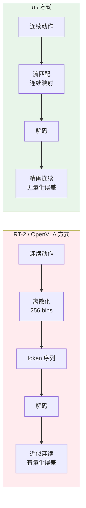
```mermaid
graph LR
    subgraph 离散化["RT-2 / OpenVLA 方式"]
        Cont1["连续动作"] --> Discretize["离散化<br/>256 bins"] --> Tokens["token 序列"] --> Decode1["解码"] --> Approx1["近似连续<br/>有量化误差"]
    end

    subgraph FlowMatch["π₀ 方式"]
        Cont2["连续动作"] --> Flow["流匹配<br/>连续映射"] --> Decode2["解码"] --> Exact["精确连续<br/>无量化误差"]
    end

    style 离散化 fill:#ffebee
    style FlowMatch fill:#e8f5e9
```

### 4.2 π₀ 的训练范式

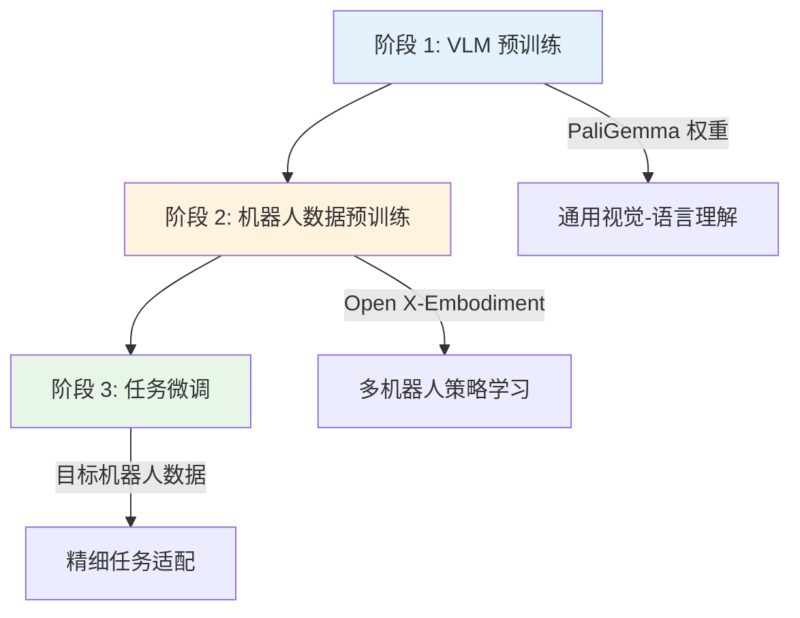
```mermaid
flowchart TD
    Stage1["阶段 1: VLM 预训练"] --> Stage2["阶段 2: 机器人数据预训练"]
    Stage2 --> Stage3["阶段 3: 任务微调"]

    Stage1 --> |"PaliGemma 权重"| S1Desc["通用视觉-语言理解"]
    Stage2 --> |"Open X-Embodiment"| S2Desc["多机器人策略学习"]
    Stage3 --> |"目标机器人数据"| S3Desc["精细任务适配"]

    style Stage1 fill:#e3f2fd
    style Stage2 fill:#fff3e0
    style Stage3 fill:#e8f5e9
```

---

## 五、第四代：世界模型增强 (2025)

### 5.1 π₀.₅ (2025.04)

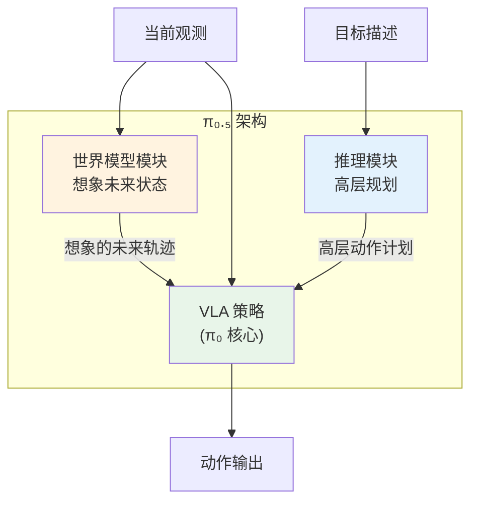
```mermaid
graph TB
    subgraph Pi05["π₀.₅ 架构"]
        WM["世界模型模块<br/>想象未来状态"]
        VLA["VLA 策略<br/>(π₀ 核心)"]
        Reasoning["推理模块<br/>高层规划"]
    end

    Obs["当前观测"] --> WM
    Goal["目标描述"] --> Reasoning
    WM --> |"想象的未来轨迹"| VLA
    Reasoning --> |"高层动作计划"| VLA
    Obs --> VLA
    VLA --> Action["动作输出"]

    style WM fill:#fff3e0
    style VLA fill:#e8f5e9
    style Reasoning fill:#e3f2fd
```

**关键突破：**

| 突破点 | 描述 |
|:---|:---|
| **世界模型融合** | 在 VLA 中嵌入世界模型进行"想象" |
| **推理能力** | 支持多步推理和长程规划 |
| **鲁棒性提升** | 通过想象对抗性场景提高鲁棒性 |
| **泛化能力** | 未见环境的零样本迁移 |

### 5.2 π₀ → π₀.₅ 的进化

```mermaid
graph LR
    Pi0["π₀<br/>2024.10"] -->|"添加世界模型"| Pi05["π₀.₅<br/>2025.04"]
    Pi0 -->|"添加推理模块"| Pi05

    subgraph "π₀ 能力"
        P1["流匹配动作"]
        P2["多任务预训练"]
        P3["连续动作输出"]
    end

    subgraph "π₀.₅ 新增能力"
        N1["世界模型想象"]
        N2["多步推理"]
        N3["长程规划"]
        N4["鲁棒泛化"]
    end

    "π₀ 能力" --> "π₀.₅ 新增能力"
```

---

## 六、无人机专用 VLA（2025–2026）

### 6.1 无人机 VLA 的挑战

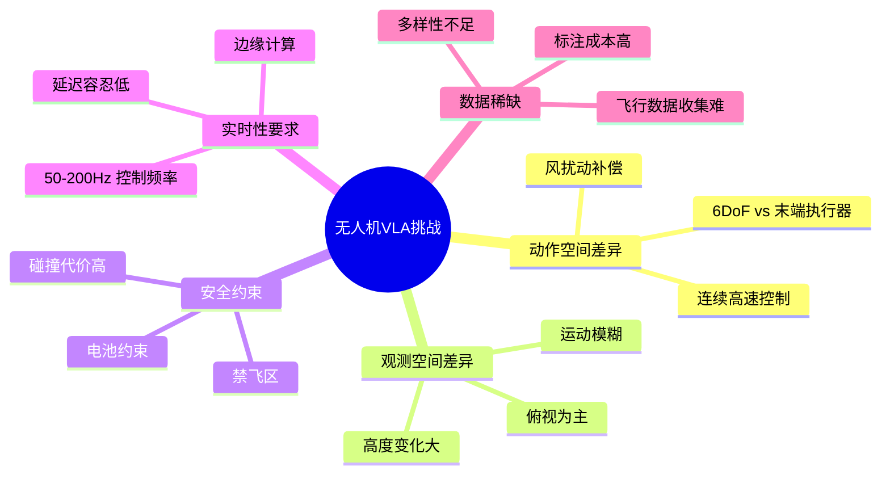
```mermaid
mindmap
  root((无人机VLA挑战))
    动作空间差异
      6DoF vs 末端执行器
      连续高速控制
      风扰动补偿
    观测空间差异
      俯视为主
      高度变化大
      运动模糊
    安全约束
      碰撞代价高
      电池约束
      禁飞区
    实时性要求
      50-200Hz 控制频率
      延迟容忍低
      边缘计算
    数据稀缺
      飞行数据收集难
      标注成本高
      多样性不足
```

### 6.2 VLA-AN (2025.12)

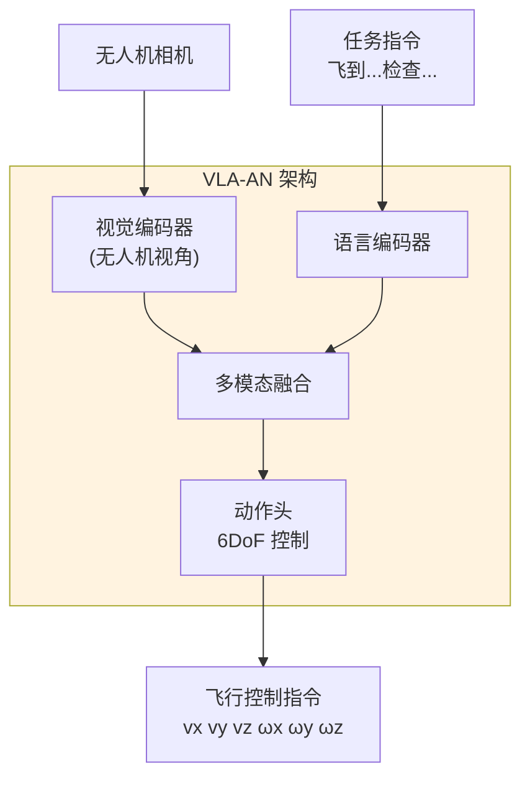
```mermaid
graph TB
    subgraph VLAAN["VLA-AN 架构"]
        VisEnc["视觉编码器<br/>(无人机视角)"]
        LangEnc["语言编码器"]
        Fusion["多模态融合"]
        ActionHead["动作头<br/>6DoF 控制"]
    end

    DroneCam["无人机相机"] --> VisEnc
    Task["任务指令<br/>飞到...检查..."] --> LangEnc
    VisEnc --> Fusion
    LangEnc --> Fusion
    Fusion --> ActionHead
    ActionHead --> FlightCmd["飞行控制指令<br/>vx vy vz ωx ωy ωz"]

    style VLAAN fill:#fff3e0
```

**VLA-AN 的创新：**

| 维度 | 创新 |
|:---|:---|
| **动作空间** | 适配无人机 6DoF 控制（非夹爪操作） |
| **视角编码** | 专门处理俯视/倾斜视角 |
| **动态补偿** | 隐式学习风扰动补偿 |
| **安全层** | 添加碰撞避免安全层 |

### 6.3 CognitiveDrone (2025.03)

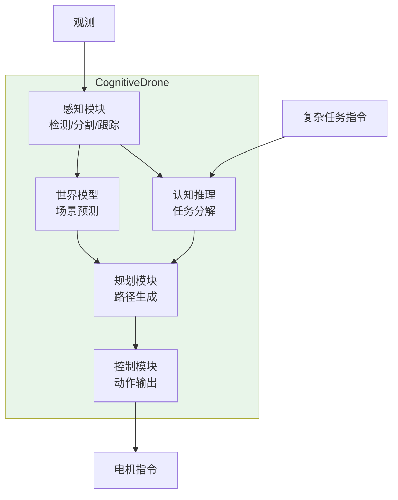
```mermaid
graph TB
    subgraph CogDrone["CognitiveDrone"]
        Perception["感知模块<br/>检测/分割/跟踪"]
        WM["世界模型<br/>场景预测"]
        Cognition["认知推理<br/>任务分解"]
        Planning["规划模块<br/>路径生成"]
        Control["控制模块<br/>动作输出"]
    end

    Obs["观测"] --> Perception
    Perception --> WM
    Perception --> Cognition
    Task["复杂任务指令"] --> Cognition
    WM --> Planning
    Cognition --> Planning
    Planning --> Control
    Control --> Motor["电机指令"]

    style CogDrone fill:#e8f5e9
```

**核心特点：**
- **认知分层：** 将任务分解为感知-认知-规划-控制的层次结构
- **世界模型集成：** 用世界模型预测未来场景，辅助规划
- **复杂任务：** 支持多步骤任务（如"飞到建筑，环绕一圈，检查异常"）

### 6.4 UAV-TrackVLA (2026.04)

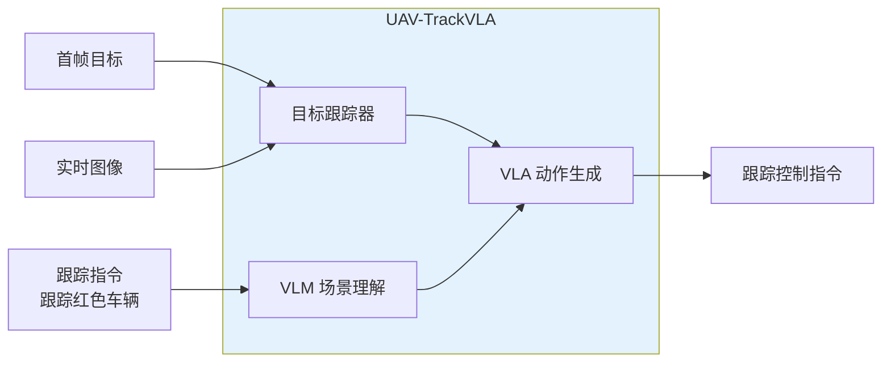
```mermaid
graph LR
    subgraph TrackVLA["UAV-TrackVLA"]
        Tracker["目标跟踪器"]
        VLM["VLM 场景理解"]
        VLA["VLA 动作生成"]
    end

    FirstFrame["首帧目标"] --> Tracker
    LiveFrame["实时图像"] --> Tracker
    Language["跟踪指令<br/>跟踪红色车辆"] --> VLM
    Tracker --> VLA
    VLM --> VLA
    VLA --> TrackCmd["跟踪控制指令"]

    style TrackVLA fill:#e3f2fd
```

**应用场景：**
- 目标跟踪（车辆、行人、特定物体）
- 搜索与救援
- 安防巡逻

### 6.5 AutoFly (2025)

前三者的共同前提是"先给一条指令，再去执行"。AutoFly 换了一个入口：只给粗粒度的位置或方向提示，**连续规划与避障由无人机自己完成**。

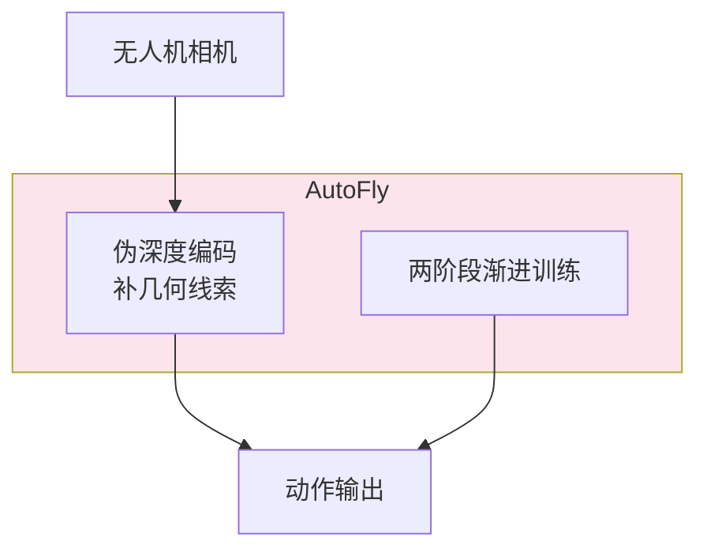
```mermaid
graph TB
    subgraph AutoFlyP["AutoFly"]
        PseudoDepth["伪深度编码<br/>补几何线索"]
        TwoStage["两阶段渐进训练"]
    end

    Cam["无人机相机"] --> PseudoDepth
    PseudoDepth --> Policy["动作输出"]
    TwoStage --> Policy

    style AutoFlyP fill:#fce4ec
```

**与前三者的差别：**

| 维度 | VLA-AN / CognitiveDrone / UAV-TrackVLA | AutoFly |
|:---|:---|:---|
| 任务形式 | 给定指令，执行 | 只有粗粒度提示，自主探索 |
| 核心任务 | 通用导航 / 认知飞行 / 视觉跟踪 | 野外自主导航 |
| 数据 | 用已有数据集（CognitiveDrone 8000+ 轨迹） | 自建自主导航数据集（数量未公开） |
| 推理范式 | 直接映射 / 显式推理 / 时序推理 | 端到端（伪深度 + 两阶段） |

三者到 AutoFly 的转折点是**指令粒度**：语言指令描述的是"去哪"，而探索任务里没有"哪"可描述。详见 [02-无人机VLA模型 §5](../docs/03-VLA专题/02-无人机VLA模型.md)。

---

## 七、VLA 架构演进对比

### 7.1 四代架构 + 一条领域轴

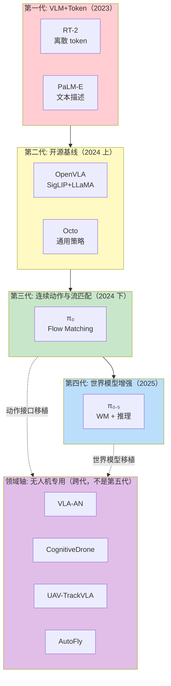
```mermaid
graph TB
    subgraph Gen1["第一代: VLM+Token（2023）"]
        RT2["RT-2<br/>离散 token"]
        PaLME["PaLM-E<br/>文本描述"]
    end

    subgraph Gen2["第二代: 开源基线（2024 上）"]
        OpenVLA["OpenVLA<br/>SigLIP+LLaMA"]
        Octo["Octo<br/>通用策略"]
    end

    subgraph Gen3["第三代: 连续动作与流匹配（2024 下）"]
        Pi0["π₀<br/>Flow Matching"]
    end

    subgraph Gen4["第四代: 世界模型增强（2025）"]
        Pi05["π₀.₅<br/>WM + 推理"]
    end

    subgraph Domain["领域轴: 无人机专用（跨代，不是第五代）"]
        VLAAN["VLA-AN"]
        CogDrone["CognitiveDrone"]
        TrackVLA["UAV-TrackVLA"]
        AutoFly["AutoFly"]
    end

    Gen1 --> Gen2
    Gen2 --> Gen3
    Gen3 --> Gen4
    Gen3 -.->|"动作接口移植"| Domain
    Gen4 -.->|"世界模型移植"| Domain

    style Gen1 fill:#ffcdd2
    style Gen2 fill:#fff9c4
    style Gen3 fill:#c8e6c9
    style Gen4 fill:#bbdefb
    style Domain fill:#e1bee7
```

**"无人机专用"不是第五代。** 把它排在 π₀.₅ 后面，是把**架构轴**和**领域轴**混在了一条线上：这条线上的"代"由动作表示与架构设计决定，而 VLA-AN、CognitiveDrone、UAV-TrackVLA、AutoFly 之间的差别不在动作表示上，在**应用领域与任务形式**上 —— 语言指令能给的是目标，探索任务里连目标都没有。所以无人机是一条**横跨各代的领域轴**，不是代际往下走的一步。同一个架构可以被搬到空中，搬过去之后失效的那部分另有原因（4 维 50–200 Hz 的动作空间、飞行数据量少一到两个数量级），见 [01-VLA架构演进 §7.3](../docs/03-VLA专题/01-VLA架构演进.md)。

### 7.2 关键指标对比

| 模型 | 年份 | 参数量 | 动作类型 | 开源 | 世界模型 | 无人机适配 |
|:---:|:---:|:---:|:---:|:---:|:---:|:---:|
| RT-2 | 2023 | 55B | 离散 | 否 | 否 | 否 |
| Octo | 2024 | 93M | 离散/连续 | 是 | 否 | 否 |
| OpenVLA | 2024 | 7B | 离散 | 是 | 否 | 否 |
| π₀ | 2024 | 3B | 连续(流匹配) | 部分 | 否 | 否 |
| OpenVLA-OFT | 2025 | 7B | 连续(并行解码) | 是 | 否 | 否 |
| π₀.₅ | 2025 | 3B+ | 连续(流匹配) | 部分 | 是 | 否 |
| VLA-AN | 2025 | ~3B | 连续(6DoF) | 是 | 否 | 是 |
| CognitiveDrone | 2025 | ~7B | 分层控制 | 部分 | 是 | 是 |
| AutoFly | 2025 | 未公开 | 连续 | 未公开 | 未公开 | 是 |
| UAV-TrackVLA | 2026 | ~3B | 连续跟踪 | 是 | 否 | 是 |

表里的"参数量"一列在 2025 年之后逐渐失去区分度（多数不公开），真正区分这些工作的是**动作接口、数据来源、后训练方式、评测口径和世界模型的接法** —— 这五个问题 2026 年已经各自独立成方向，见 [01-VLA架构演进 §7.3](../docs/03-VLA专题/01-VLA架构演进.md)。

---

## 八、未来展望

### 8.1 VLA 的下一个前沿

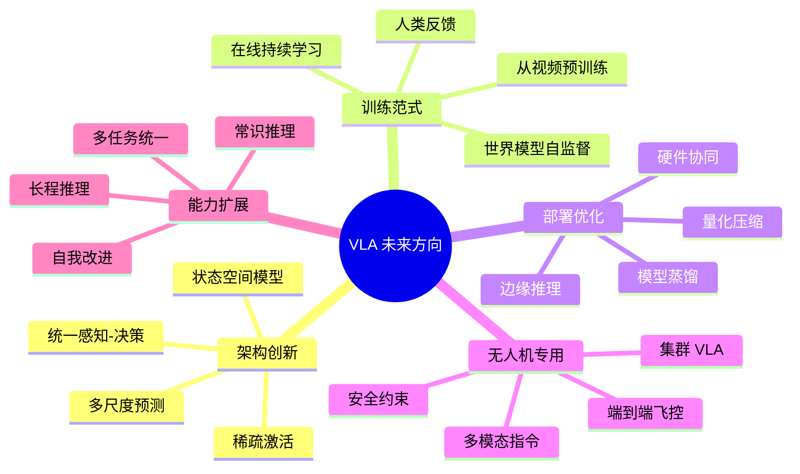
```mermaid
mindmap
  root((VLA 未来方向))
    架构创新
      统一感知-决策
      状态空间模型
      稀疏激活
      多尺度预测
    训练范式
      从视频预训练
      世界模型自监督
      在线持续学习
      人类反馈
    部署优化
      模型蒸馏
      量化压缩
      边缘推理
      硬件协同
    无人机专用
      端到端飞控
      集群 VLA
      多模态指令
      安全约束
    能力扩展
      长程推理
      多任务统一
      自我改进
      常识推理
```

### 8.2 无人机 VLA 的技术路线

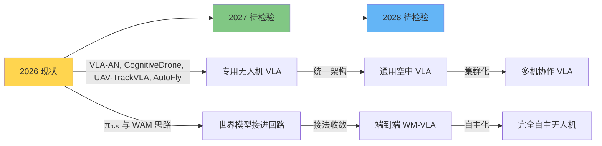
```mermaid
graph LR
    Now["2026 现状"] --> Y1["2027 待检验"] --> Y2["2028 待检验"]

    Now --> |"VLA-AN, CognitiveDrone, UAV-TrackVLA, AutoFly"| N1["专用无人机 VLA"]
    Now --> |"π₀.₅ 与 WAM 思路"| N2["世界模型接进回路"]

    N1 --> |"统一架构"| Y1_A["通用空中 VLA"]
    N2 --> |"接法收敛"| Y1_B["端到端 WM-VLA"]

    Y1_A --> |"集群化"| Y2_A["多机协作 VLA"]
    Y1_B --> |"自主化"| Y2_B["完全自主无人机"]

    style Now fill:#ffd54f
    style Y1 fill:#81c784
    style Y2 fill:#64b5f6
```

左侧那两个分支在 2026 年都已经有实物（专用无人机 VLA 有四篇，世界模型的四种接法见 [10-世界模型增强VLA](../docs/03-VLA专题/10-世界模型增强VLA.md)），所以 2027 之后的部分是**待检验的方向**而不是预测结论。

---

## 九、学习建议

| 学习目标 | 推荐阅读顺序 | 预计时间 |
|:---|:---|:---:|
| **理解 VLA 基本概念** | PaLM-E → RT-2 → OpenVLA | 1-2 周 |
| **掌握架构设计** | OpenVLA → π₀ → π₀.₅ | 2-3 周 |
| **专注无人机 VLA** | π₀.₅ → VLA-AN → CognitiveDrone → AutoFly | 2-3 周 |
| **按自变量深入** | [06 动作头](../docs/03-VLA专题/06-动作头与动作分块.md) → [07 数据](../docs/03-VLA专题/07-数据、预训练与跨具身.md) → [08 后训练](../docs/03-VLA专题/08-强化学习后训练与自我改进.md) → [09 评测](../docs/03-VLA专题/09-评测基准与报告口径.md) → [10 世界模型](../docs/03-VLA专题/10-世界模型增强VLA.md) | 4-6 周 |
| **全面深入** | 按时间线全部阅读 | 4-6 周 |

> 详细的论文阅读顺序请参考 [reading-order.md](reading-order.md)。
> 完整论文列表请参考 [../references/paper-list.md](../references/paper-list.md)。

---

*本文件为 UAV-WM-VLA-Learning 项目的一部分，最后更新：2026-10-08。*
