# 世界模型分类体系

> 本文从 **角色定位、架构设计、表征方式、无人机专用** 四个维度，系统梳理世界模型（World Model）的分类体系。配合 Mermaid 思维导图与分类表格，帮助读者建立清晰的认知地图。

---

## 一、总分类图谱

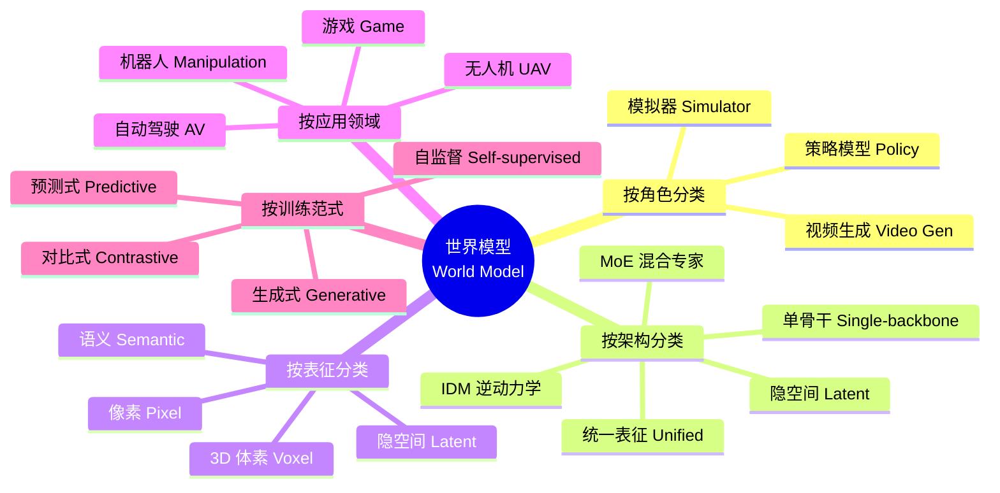

---

## 二、按角色分类

### 2.1 角色定义

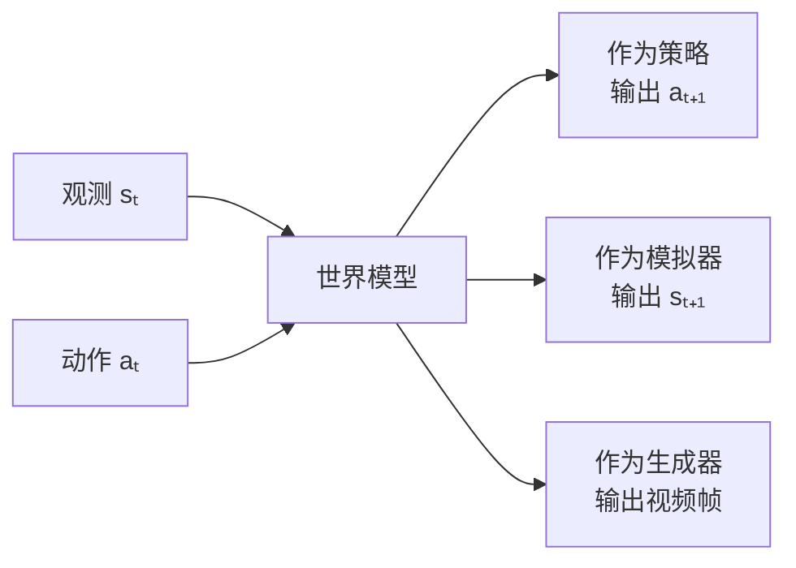

| 角色 | 输入 | 输出 | 典型损失函数 | 代表模型 |
|:---:|:---|:---|:---|:---|
| **策略模型** | 观测序列 | 动作序列 | 行为克隆 / RL 奖励 | IRIS (2023), DIAMOND (2024) |
| **模拟器** | 当前状态 + 动作 | 下一状态 | 状态重建 / 预测误差 | UniSim (2023), Cosmos (2025) |
| **视频生成** | 条件（文本/动作） | 视频帧序列 | 扩散去噪 / GAN | Sora (2024), GAIA-2 (2025) |

### 2.2 三种角色的协作关系

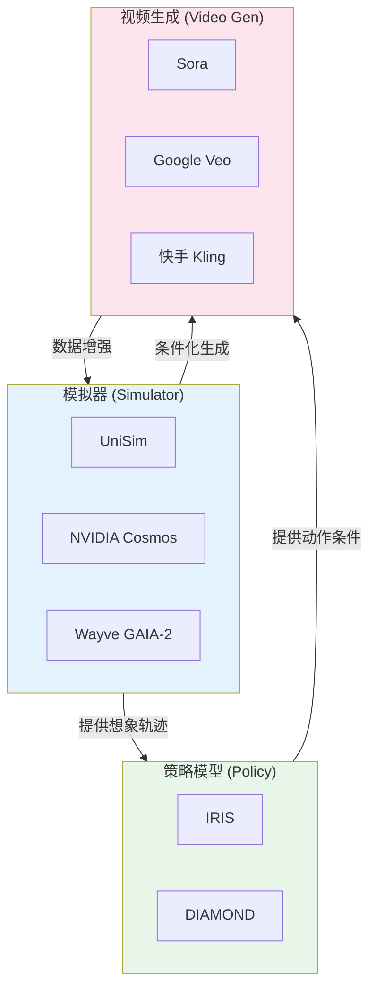

---

## 三、按架构分类

### 3.1 五大架构范式

```mermaid
mindmap
  root((架构分类))
    IDM 逆动力学模型
      原理: 从 (sₜ, sₜ₊₁) 推断 aₜ
      优势: 无需动作标签即可训练正向模型
      代表: VIPER, IRIS
      无人机应用: 从飞行视频学习动作
    单骨干模型
      原理: 一个模型同时预测状态和动作
      优势: 简单统一
      代表: DreamerV3, TD-MPC2
      无人机应用: 端到端飞行动作预测
    MoE 混合专家
      原理: 多个专家网络 + 路由机制
      优势: 处理多模态/多任务
      代表: MoE World Model (2024)
      无人机应用: 不同飞行模式切换
    统一表征
      原理: 语言+视觉+动作共享表征
      优势: 知识迁移
      代表: Unified World Model (2024)
      无人机应用: 多任务无人机智能体
    隐空间模型
      原理: 在压缩的隐空间做预测
      优势: 计算效率高
      代表: Dreamer系列, TD-MPC
      无人机应用: 嵌入式部署
```

### 3.2 架构对比表

| 架构 | 计算复杂度 | 预测质量 | 动作可控性 | 适合部署 | 代表模型 |
|:---:|:---:|:---:|:---:|:---:|:---|
| IDM | 中 | 中 | 低（需配合正向模型） | 中 | VIPER |
| 单骨干 | 中 | 中-高 | 高 | 中 | DreamerV3 |
| MoE | 高 | 高 | 高 | 低 | MoE-WM |
| 统一表征 | 高 | 高 | 高 | 低 | UWM |
| 隐空间 | 低-中 | 中 | 中 | 高 | TD-MPC2 |

### 3.3 关键模型的架构路线

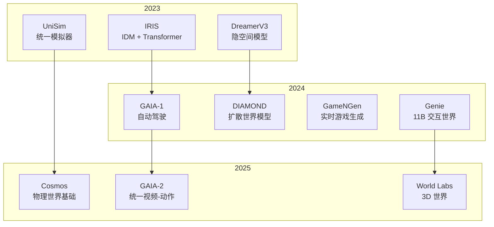

---

## 四、按表征分类

### 4.1 四种表征方式

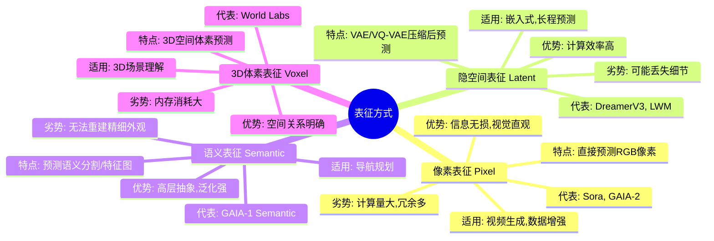

### 4.2 像素 vs 隐空间：详细对比

| 维度 | 像素表征 | 隐空间表征 |
|:---|:---|:---|
| **信息保真度** | 高（无损） | 中-低（有压缩损失） |
| **计算成本** | 高（H×W×3） | 低（h×w×d, h<<H） |
| **训练难度** | 中-高 | 中 |
| **可控性** | 高（可直接编辑像素） | 中（需解码器） |
| **物理一致性** | 中（需大量数据学习） | 低-中 |
| **适合任务** | 视频生成、数据增强 | RL 策略学习、嵌入部署 |
| **典型分辨率** | 256x256 ~ 1024x1024 | 16x16 ~ 64x64 |

### 4.3 隐空间模型的编码器选择

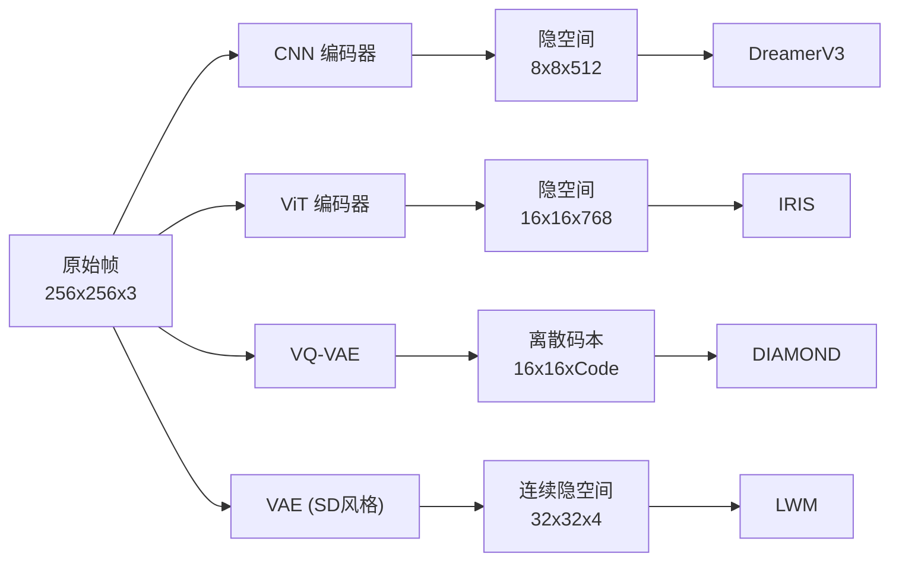

---

## 五、按应用领域分类

### 5.1 四大应用领域

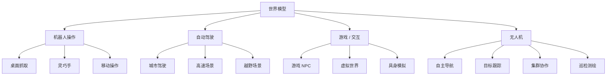

### 5.2 领域差异对比

| 维度 | 机器人操作 | 自动驾驶 | 游戏 | 无人机 |
|:---|:---|:---|:---|:---|
| **动作空间** | 6-7 DoF 末端 | 2D (转向+速度) | 键鼠/手柄 | 4-6 DoF (速度+姿态) |
| **观测空间** | 手眼相机 | 环视相机+LiDAR | 屏幕像素 | 机载相机+下视 |
| **动力学复杂度** | 中 | 中-高 | 低（规则驱动） | 高（6DoF） |
| **安全要求** | 高 | 极高 | 低 | 高 |
| **数据获取** | 需要机器人 | 大规模路采 | 海量日志 | 成本高 |
| **实时性** | 10-30Hz | 10-30Hz | 60Hz | 50-200Hz |

---

## 六、无人机专用世界模型

### 6.1 无人机世界模型的独特挑战

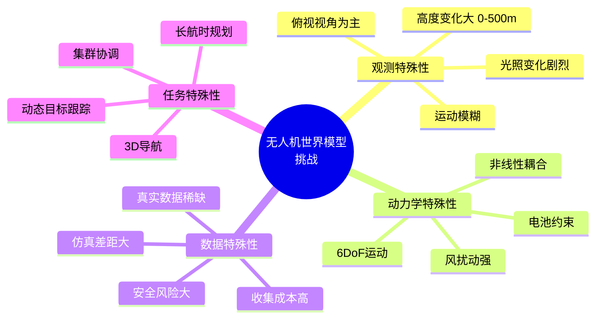

### 6.2 无人机世界模型的研究方向

| 方向 | 描述 | 代表/参考 |
|:---|:---|:---|
| **飞行视频预测** | 从无人机视频学习未来帧预测 | 基于 GAIA-2 的无人机适配 |
| **风场/动力学建模** | 隐式学习飞行器动力学与环境交互 | Neural Flyer (2024) |
| **3D 场景世界模型** | 从航拍构建可交互的 3D 世界 | 结合 NeRF/3DGS |
| **Sim2Real 桥梁** | 用世界模型弥补仿真与真实差距 | 域适应 + 视觉增广 |
| **多机协同模拟** | 多无人机交互的世界模型 | 多智能体世界模型 |

### 6.3 无人机世界模型技术栈

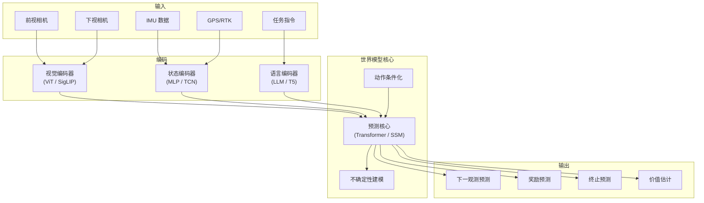

---

## 七、训练范式分类

### 7.1 四种训练范式

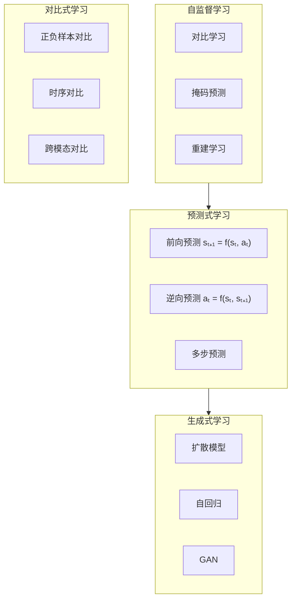

### 7.2 范式对比

| 范式 | 数据需求 | 训练稳定性 | 生成质量 | 适合场景 |
|:---:|:---:|:---:|:---:|:---|
| 自监督 | 大量无标注 | 高 | 中 | 表征预训练 |
| 预测式 | 带动作的轨迹 | 高 | 中-高 | RL 环境模型 |
| 生成式 | 海量视频 | 中-低 | 极高 | 视频/数据生成 |
| 对比式 | 多视角/时序对 | 高 | 低（非生成） | 表征学习 |

---

## 八、从经典到前沿的演进

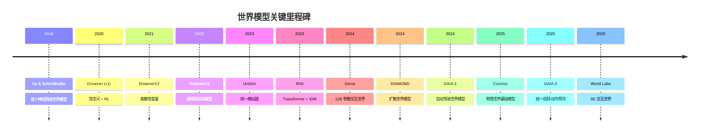

---

## 九、选择指南：哪种世界模型适合你的场景？

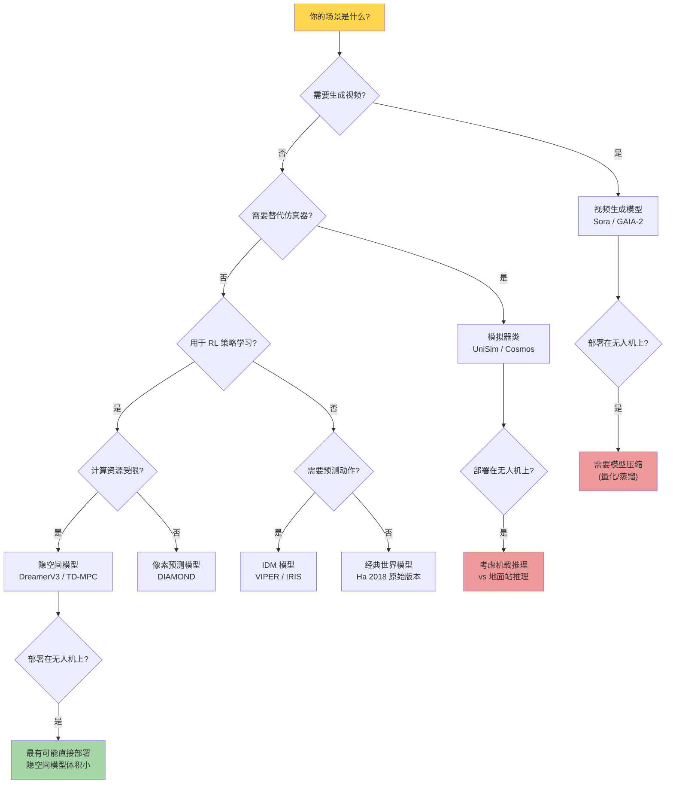

---

*本文件为 UAV-WM-VLA-Learning 项目的一部分，最后更新：2026-05-10。*
