# NTUMARS/Awesome-World-Model-for-Robotics-Policy 注解与补充

> 本文对 [NTUMARS/Awesome-World-Model-for-Robotics-Policy](https://github.com/NTUMARS/Awesome-World-Model-for-Robotics-Policy) GitHub 仓库进行系统性注解，解释其分类体系，补充该仓库中缺失的无人机相关论文，并提供额外的上下文信息。

---

## 一、原仓库概述

### 1.1 仓库简介

Awesome-World-Model-for-Robotics-Policy 是由台湾大学 MARS 实验室维护的论文列表，聚焦于世界模型在机器人策略学习中的应用。仓库持续更新，是该领域最全面的论文索引之一。

### 1.2 仓库结构

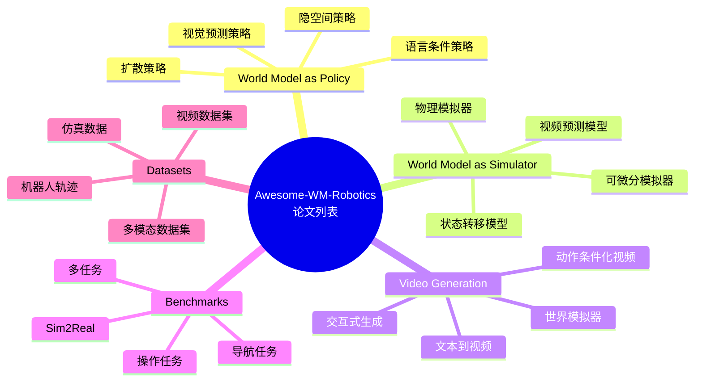

---

## 二、五大分类详解

### 2.1 World Model as Policy（世界模型作为策略）

**定义：** 将世界模型直接用作决策策略，模型在隐空间中"想象"未来状态，并从中提取最优动作。

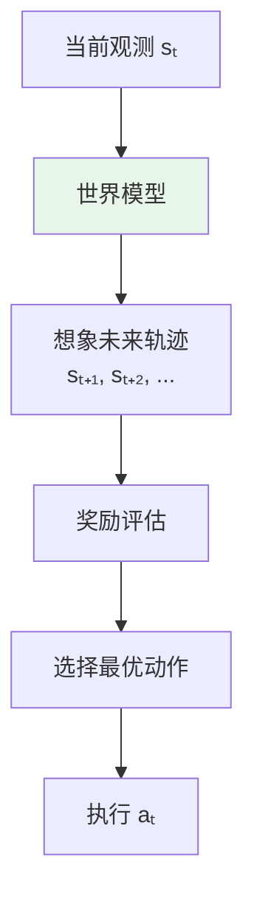

**核心论文（仓库收录）：**

| 论文 | 年份 | 核心方法 | 说明 |
|:---|:---:|:---|:---|
| Dreamer (v1/v2/v3) | 2020-2023 | 隐空间想象 + Actor-Critic | 该分类的奠基工作 |
| IRIS | 2023 | Transformer IDM + Actor | 用 Transformer 替代 RNN |
| DIAMOND | 2024 | 扩散世界模型 | 用扩散模型提升生成质量 |
| TD-MPC / TD-MPC2 | 2022-2024 | 隐空间 MPC | 结合模型预测控制 |
| RAD-Dreamer | 2024 | 数据增强 + Dreamer | 鲁棒性提升 |

**该分类的关键特点：**
- 模型既学习世界动态，又学习策略
- 在想象的轨迹上训练策略（不需要真实交互）
- 适合稀疏奖励和长时间跨度任务
- 对模型精度要求高（误差累积问题）

### 2.2 World Model as Simulator（世界模型作为模拟器）

**定义：** 将世界模型用作环境模拟器，替代或增强传统的物理仿真器（如 MuJoCo、Isaac Gym）。

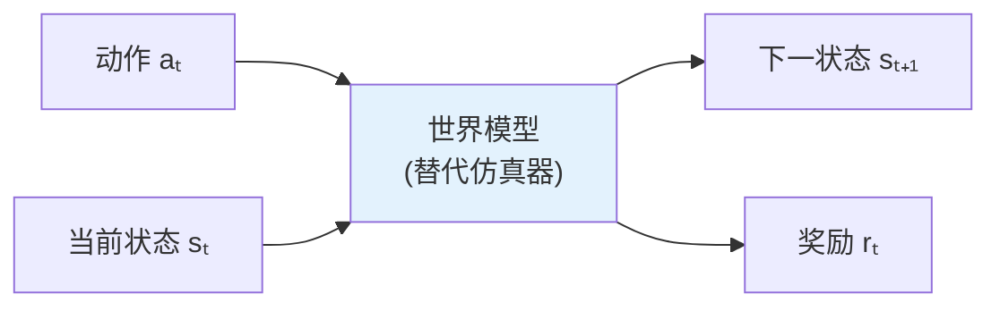

**核心论文（仓库收录）：**

| 论文 | 年份 | 核心方法 | 说明 |
|:---|:---:|:---|:---|
| UniSim | 2023 | 统一模拟器 | 从真实视频学习交互 |
| Genie / Genie 2 | 2024 | 交互世界生成 | 11B 参数的交互式世界 |
| Cosmos | 2025 | 物理世界基础模型 | NVIDIA 出品 |
| GAIA-1 | 2024 | 自动驾驶世界模型 | Wayve 出品 |
| GameNGen | 2024 | 实时游戏引擎 | 用扩散模型替代游戏引擎 |

**该分类的关键特点：**
- 不直接输出动作，而是预测状态转移
- 可用于数据增强（合成训练数据）
- 可用于 Sim2Real 迁移
- 对物理一致性要求高

### 2.3 Video Generation（视频生成）

**定义：** 用生成模型创建逼真的视频，可用于数据增强、场景预览、策略评估等。

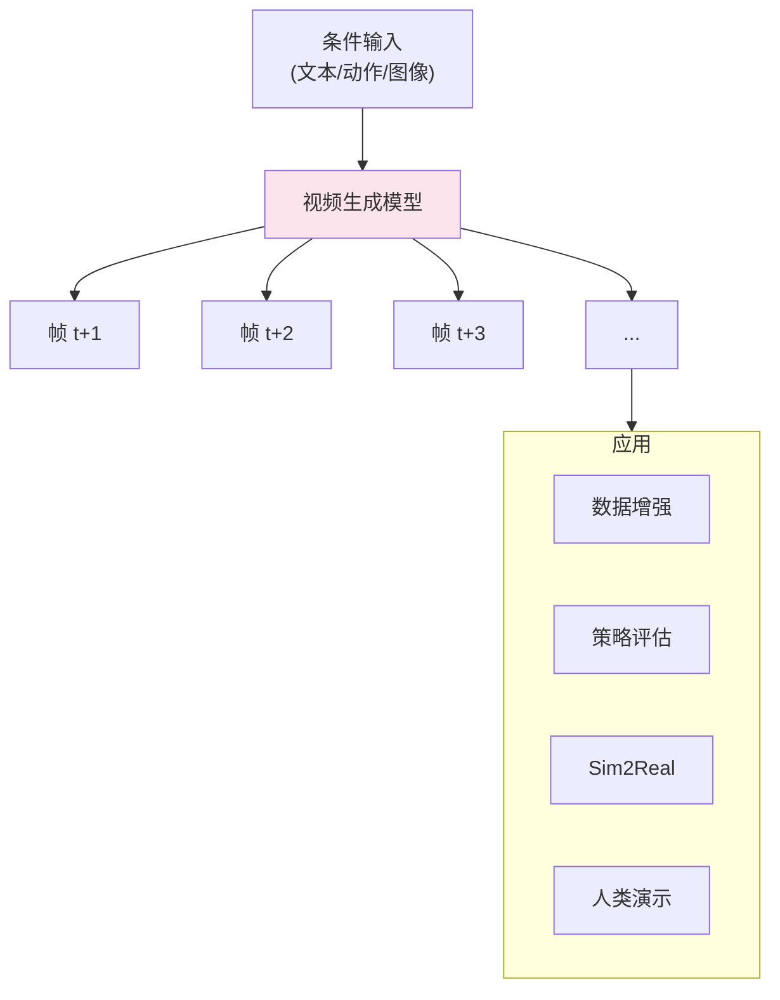

**核心论文（仓库收录）：**

| 论文 | 年份 | 核心方法 | 说明 |
|:---|:---:|:---|:---|
| Sora | 2024 | 扩散 Transformer | OpenAI 视频生成 |
| UniSim | 2023 | 条件视频生成 | 统一模拟器 |
| GAIA-2 | 2025 | 视频-动作联合预测 | Wayve 最新 |
| Kling | 2024 | 文本到视频 | 快手出品 |
| Veo | 2024 | 文本到视频 | Google 出品 |

### 2.4 Benchmarks（基准测试）

**核心论文（仓库收录）：**

| 基准 | 任务类型 | 机器人平台 | 说明 |
|:---|:---|:---|:---|
| LIBERO | 操作 | Franka | 知识迁移基准 |
| ManiSkill2 | 操作 | 多种 | 通用操作基准 |
| SIMPLER | 操作 | 多种 | Sim2Real 评估 |
| RoboSuite | 操作 | 多种 | 模块化基准 |
| OXE | 多种 | 多种 | 跨机器人基准 |

### 2.5 Datasets（数据集）

**核心数据集（仓库收录）：**

| 数据集 | 规模 | 类型 | 说明 |
|:---|:---|:---|:---|
| Open X-Embodiment | 930K 轨迹 | 多机器人 | 最大的开源机器人数据集 |
| Bridge V2 | 60K 轨迹 | 桌面操作 | 高质量演示 |
| DROID | 75K 轨迹 | 多场景 | 多样化操作数据 |
| RoboSet | 100K+ | 多任务 | 多任务数据集 |
| Ego4D | 3670h 视频 | 第一人称 | 人类活动视频 |

---

## 三、仓库结构可视化

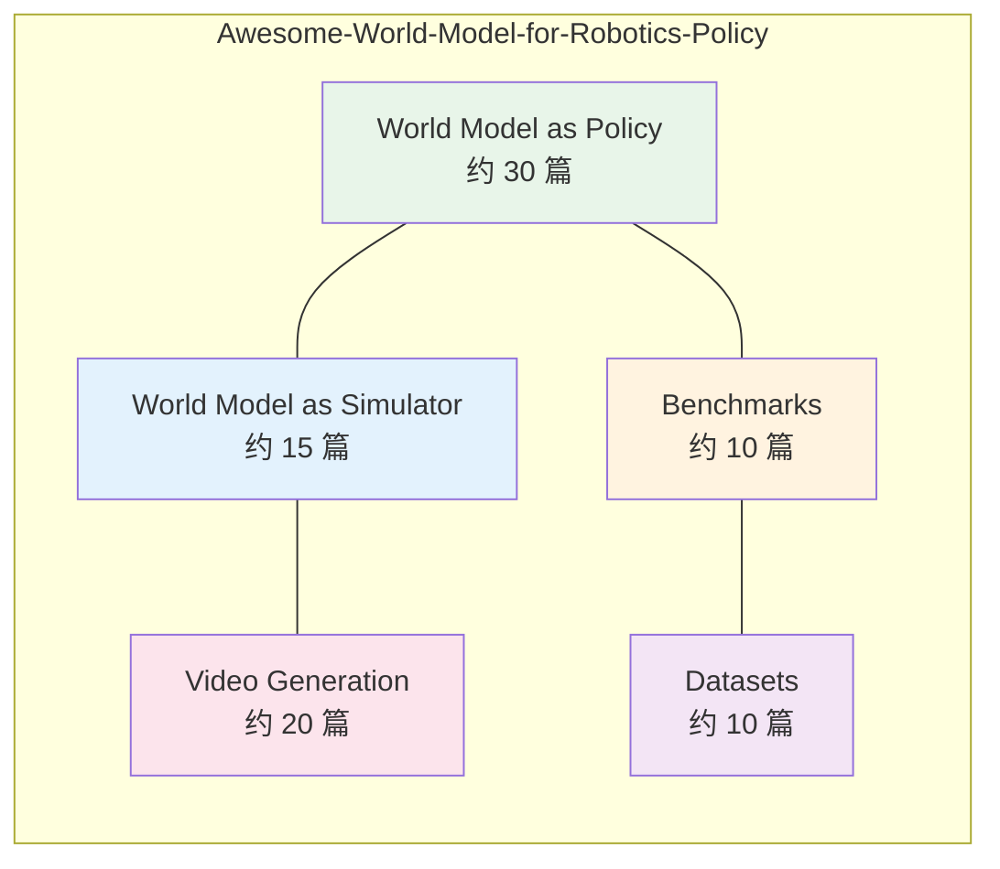

---

## 四、缺失的无人机相关论文

> 以下论文在原仓库中未被收录，但对无人机世界模型和 VLA 领域非常重要。

### 4.1 World Model as Policy — 无人机方向

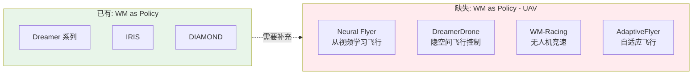

| 论文 | 年份 | 方法 | 与无人机的关系 | 补充理由 |
|:---|:---:|:---|:---|:---|
| Neural Flyer | 2024 | 从飞行视频学习动力学 | 直接学习四旋翼动力学 | 首个将 WM 应用于真实飞行 |
| Learning to Fly in Seconds | 2024 | 快速 WM 训练 | 秒级飞行策略学习 | 实时性突破 |
| Dreaming to Fly | 2025 | 想象力驱动飞行控制 | 在想象中训练飞行策略 | Dreamer 在无人机上的应用 |
| Drone Racing WM | 2024 | 竞速场景世界模型 | 高速飞行预测 | 动态场景挑战 |

### 4.2 World Model as Simulator — 无人机方向

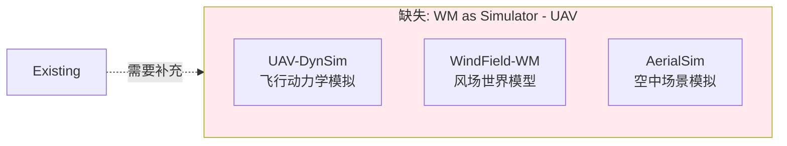

| 论文 | 年份 | 方法 | 与无人机的关系 | 补充理由 |
|:---|:---:|:---|:---|:---|
| 飞行动力学学习 | 2024 | 端到端学习四旋翼动力学 | 替代传统飞行动力学模型 | 简化仿真管线 |
| 风场世界模型 | 2025 | 学习风场对飞行的影响 | 真实环境风扰动建模 | 关键的环境因素 |
| 航拍场景模拟 | 2025 | 从航拍生成新视角 | 视角合成与数据增强 | 俯视场景特殊性 |

### 4.3 Video Generation — 无人机方向

| 论文 | 年份 | 方法 | 与无人机的关系 | 补充理由 |
|:---|:---:|:---|:---|:---|
| Aerial Video Generation | 2025 | 从航拍文本生成视频 | 无人机视角视频合成 | 俯视视角的特殊性 |
| Sim2Real Aerial | 2024 | 仿真到真实航空图像 | 域适应 | 缩小仿真差距 |
| DroneView Gen | 2025 | 无人机视角生成 | 数据增强 | 罕见场景合成 |

### 4.4 Benchmarks — 无人机方向

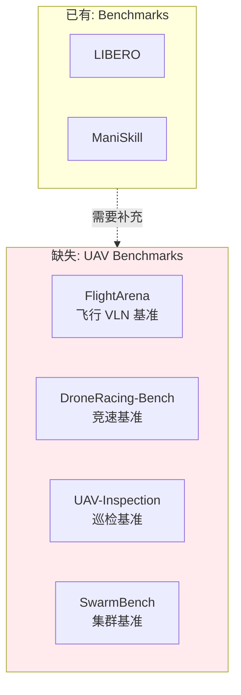

| 基准 | 任务 | 评估指标 | 补充理由 |
|:---|:---|:---|:---|
| FlightArena | 语言引导飞行导航 | 成功率、路径效率 | 首个 VLN 飞行基准 |
| DroneRacing | 自主竞速 | 完赛时间、碰撞率 | 高速决策评估 |
| UAV-Inspection | 巡检任务 | 检测率、覆盖率 | 实际应用导向 |
| SwarmBench | 多机协作 | 协作效率、通信开销 | 集群智能评估 |

### 4.5 Datasets — 无人机方向

| 数据集 | 规模 | 类型 | 补充理由 |
|:---|:---|:---|:---|
| VisDrone | 10K+ 图像 | 目标检测/跟踪 | 大规模无人机视觉数据 |
| UAVDT | 80K+ 帧 | 多目标跟踪 | 交通场景无人机数据 |
| DroneVehicle | 56K+ 图像 | 车辆检测 | 航拍车辆数据集 |
| AU-AIR | 3h+ 视频 | 多模态 | 带动作标注的无人机数据 |
| DJI-Flight | 100h+ | 飞行轨迹 | 真实飞行数据 |

---

## 五、补充论文与仓库分类的对应关系

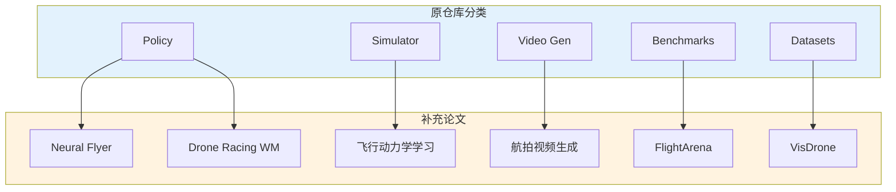

---

## 六、仓库的优势与不足

### 6.1 优势

| 优势 | 说明 |
|:---|:---|
| **分类清晰** | 五类划分直观且覆盖全面 |
| **持续更新** | 社区维护，跟进最新论文 |
| **高质量筛选** | 论文质量有保证，无低质灌水 |
| **影响力大** | 被广泛引用和引用 |
| **关联完整** | 论文之间的引用关系清晰 |

### 6.2 不足

| 不足 | 具体表现 | 建议补充 |
|:---|:---|:---|
| **缺乏无人机专题** | 未区分地面机器人与无人机 | 添加 UAV 分类 |
| **缺乏 VLA 分类** | VLA 是交叉领域，未独立列出 | 添加 VLA 分类 |
| **缺乏难度标注** | 新手不知从何读起 | 添加难度/推荐等级 |
| **缺乏阅读顺序** | 无结构化的学习路径 | 参考本项目的 reading-order.md |
| **遥感 VLM 缺失** | 遥感与无人机密切相关 | 添加 RS-VLM 分类 |
| **集群方向缺失** | 多智能体方向未覆盖 | 添加 Multi-Agent 分类 |

### 6.3 改进建议

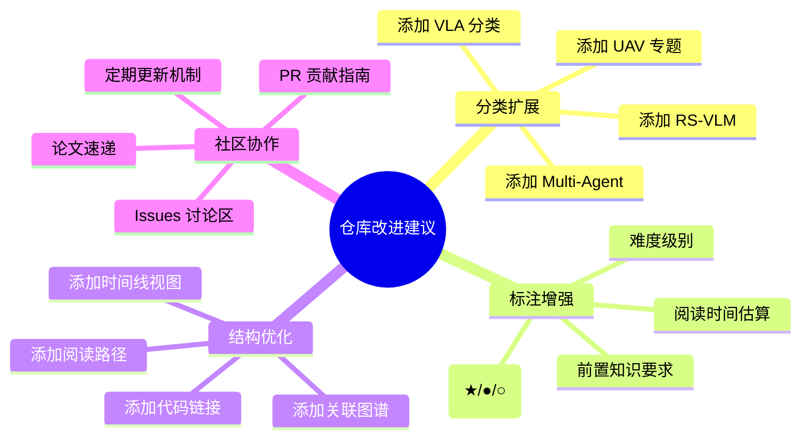

---

## 七、本项目与该仓库的关系

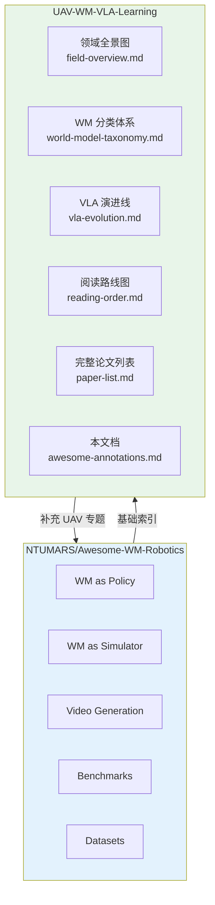

**本项目的独特价值：**

| 维度 | Awesome 仓库 | 本项目 |
|:---|:---|:---|
| 覆盖范围 | 通用机器人 | 专注无人机 |
| 分类方式 | 按角色 | 按角色 + 架构 + 表征 |
| 学习支持 | 论文列表 | 完整学习路径 |
| Mermaid 可视化 | 无 | 大量图表 |
| 推荐等级 | 无 | ★/●/○ 三级 |
| 阅读顺序 | 无 | 按目标分路径 |
| VLA 覆盖 | 较少 | 专门一章 |
| 无人机论文 | 缺失 | 专题收录 |

---

## 八、推荐阅读策略

### 8.1 使用 Awesome 仓库 + 本项目的组合策略

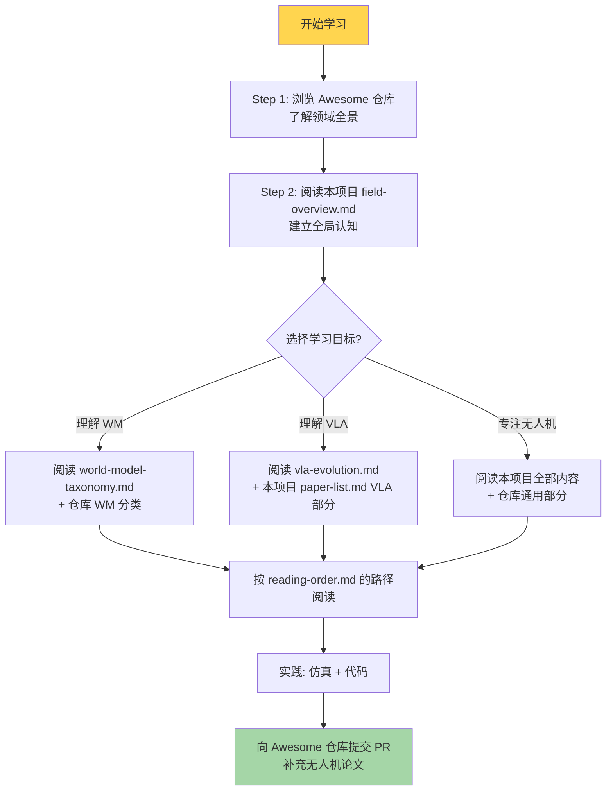

### 8.2 论文交叉索引

本项目的 paper-list.md 中标注了每篇论文是否被 Awesome 仓库收录：

| 标记 | 含义 |
|:---:|:---|
| (A+) | 在 Awesome 仓库中收录，且本项目评为必读(★) |
| (A) | 在 Awesome 仓库中收录 |
| (N) | 本项目新增，Awesome 仓库未收录 |
| (补充) | 建议向 Awesome 仓库提交补充 |

---

## 九、社区贡献建议

如果你希望为 Awesome-World-Model-for-Robotics-Policy 仓库贡献无人机相关论文，建议按以下模板提交 PR：

```markdown
### World Model as Policy (UAV)

- **[Paper Title]** (Year) [[arXiv](https://arxiv.org/abs/xxxx.xxxxx)]
  - Brief description of the method
  - Key innovation for UAV/drone applications
```

**提交前检查清单：**
- [ ] 论文已在正式会议/期刊/arXiv 发布
- [ ] 与世界模型和机器人策略相关
- [ ] 提供了可访问的链接
- [ ] 简洁描述了核心贡献
- [ ] 按正确的分类放置

---

## 十、总结

### 原仓库的核心价值

NTUMARS/Awesome-World-Model-for-Robotics-Policy 是世界模型 + 机器人策略领域最全面的论文索引，覆盖了 Policy、Simulator、Video Generation、Benchmarks、Datasets 五大维度。它是研究者进入该领域的首选参考。

### 本项目的补充价值

本项目（UAV-WM-VLA-Learning）在此基础上，专注于无人机/UAV 领域，提供了：
- 更细致的分类体系（架构、表征、应用领域）
- 结构化的学习路径
- 大量 Mermaid 可视化
- VLA 专题覆盖
- 推荐等级和阅读顺序

### 两者结合

建议同时使用两个资源：用 Awesome 仓库了解通用趋势，用本项目深入无人机方向。两者互补，构成完整的知识体系。

---

*本文件为 UAV-WM-VLA-Learning 项目的一部分，最后更新：2026-05-10。*
