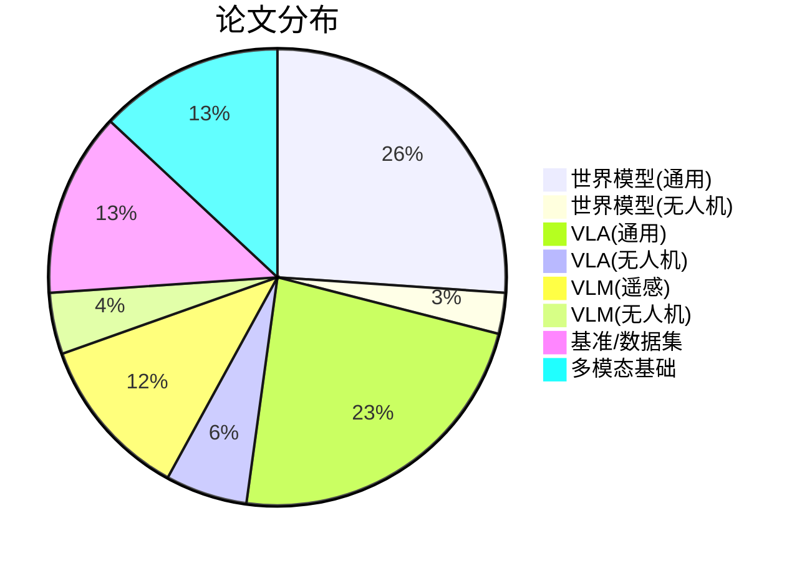

# 完整论文列表

> 本文收录 World Model、VLA、VLM 及无人机相关的核心论文 50+ 篇。
> 推荐等级：★ 必读 | ● 推荐 | ○ 选读

---

## 一、世界模型 — 通用 (World Models, General)

### 1.1 经典基础

| # | 论文标题 | 作者 | 年份 | 会议/期刊 | 推荐 | 链接 |
|:---:|:---|:---|:---:|:---:|:---:|:---|
| 1 | World Models | Ha & Schmidhuber | 2018 | NeurIPS | ★ | [arXiv:1803.10122](https://arxiv.org/abs/1803.10122) |
| 2 | Dream to Control: Learning Behaviors by Latent Imagination | Hafner et al. | 2020 | ICLR | ★ | [arXiv:1912.01603](https://arxiv.org/abs/1912.01603) |
| 3 | Mastering Atari with Discrete World Models | Hafner et al. | 2021 | ICLR | ★ | [arXiv:2010.02193](https://arxiv.org/abs/2010.02193) |
| 4 | Mastering Diverse Domains through World Models | Hafner et al. | 2023 | JMLR | ★ | [arXiv:2301.04104](https://arxiv.org/abs/2301.04104) |
| 5 | TD-MPC/TD-MPC2: Temporal Difference Learning for Model Predictive Control | Hansen et al. | 2022/2024 | ICLR | ● | [arXiv:2203.04955](https://arxiv.org/abs/2203.04955) |

### 1.2 Transformer 时代

| # | 论文标题 | 作者 | 年份 | 会议/期刊 | 推荐 | 链接 |
|:---:|:---|:---|:---:|:---:|:---:|:---|
| 6 | IRIS: Transformers Are Sample-Efficient World Models | Micheli et al. | 2023 | ICLR | ★ | [arXiv:2211.00542](https://arxiv.org/abs/2211.00542) |
| 7 | DIAMOND: Diffusion as a World Model | Alonso et al. | 2024 | NeurIPS | ★ | [arXiv:2401.04081](https://arxiv.org/abs/2401.04081) |
| 8 | GameNGen: Diffusion Models are Real-Time Game Engines | Valevski et al. | 2024 | arXiv | ● | [arXiv:2408.14837](https://arxiv.org/abs/2408.14837) |
| 9 | Learning Universal Policies via Text-Guided Video Generation | Du et al. | 2024 | NeurIPS | ● | [arXiv:2302.00111](https://arxiv.org/abs/2302.00111) |
| 10 | Genie 2: A Large-Scale Foundation World Model | DeepMind | 2024 | Technical Report | ● | [blog](https://deepmind.google/discover/blog/genie-2/) |

### 1.3 大规模世界模型

| # | 论文标题 | 作者 | 年份 | 会议/期刊 | 推荐 | 链接 |
|:---:|:---|:---|:---:|:---:|:---:|:---|
| 11 | Generating Interactive Worlds from Text | Bruce et al. (Genie) | 2024 | arXiv | ★ | [arXiv:2402.07157](https://arxiv.org/abs/2402.07157) |
| 12 | UniSim: Learning Interactive Real-World Simulators | Yang et al. | 2023 | arXiv | ★ | [arXiv:2310.06114](https://arxiv.org/abs/2310.06114) |
| 13 | Cosmos World Foundation Model Platform | NVIDIA | 2025 | Technical Report | ★ | [arXiv:2501.03575](https://arxiv.org/abs/2501.03575) |
| 14 | GAIA-2: Generative AI for Autonomous Driving | Wayve | 2025 | Technical Report | ● | [blog](https://wayve.ai/thinking/gaia-2/) |
| 15 | World Labs: Generating 3D Worlds | World Labs | 2025 | Technical Report | ○ | [blog](https://www.worldlabs.ai/blog) |

### 1.4 世界模型理论与综述

| # | 论文标题 | 作者 | 年份 | 会议/期刊 | 推荐 | 链接 |
|:---:|:---|:---|:---:|:---:|:---:|:---|
| 16 | World Models for Autonomous Driving: An Initial Survey | Hu et al. | 2024 | IEEE T-ITS | ● | [arXiv:2403.02622](https://arxiv.org/abs/2403.02622) |
| 17 | A Survey on Diffusion Models for Reinforcement Learning and Planning | Cai et al. | 2024 | arXiv | ○ | [arXiv:2403.12133](https://arxiv.org/abs/2403.12133) |
| 18 | Understanding World Models via Multi-Game Decision Transformers | Robine et al. | 2024 | arXiv | ○ | [arXiv:2404.06612](https://arxiv.org/abs/2404.06612) |

---

## 二、世界模型 — 无人机 (World Models, UAV/Drone)

| # | 论文标题 | 作者 | 年份 | 会议/期刊 | 推荐 | 链接 |
|:---:|:---|:---|:---:|:---:|:---:|:---|
| 19 | Learning to Fly in Seconds via World Models | Escontrela et al. | 2024 | CoRL | ● | [arXiv:2409.18997](https://arxiv.org/abs/2409.18997) |
| 20 | DreamerV3 for Drone Racing (Dream to Fly) | Molas et al. | 2025 | ICRA | ★ | [arXiv:2501.14377](https://arxiv.org/abs/2501.14377) |

> 注：本节仅保留已验证 arXiv ID 的论文。更多无人机世界模型论文请参考 [无人机世界模型综述](../../docs/02-世界模型专题/05-无人机世界模型综述.md)。

---

## 三、VLA — 通用 (Vision-Language-Action, General)

### 3.1 奠基工作

| # | 论文标题 | 作者 | 年份 | 会议/期刊 | 推荐 | 链接 |
|:---:|:---|:---|:---:|:---:|:---:|:---|
| 26 | PaLM-E: An Embodied Multimodal Language Model | Driess et al. | 2023 | ICML | ★ | [arXiv:2303.03378](https://arxiv.org/abs/2303.03378) |
| 27 | RT-2: Vision-Language-Action Models Transfer Web Knowledge to Robotic Control | Brohan et al. | 2023 | CoRL | ★ | [arXiv:2307.15818](https://arxiv.org/abs/2307.15818) |
| 28 | RT-1: Robotics Transformer for Real-World Control | Brohan et al. | 2023 | RSS | ● | [arXiv:2212.06817](https://arxiv.org/abs/2212.06817) |
| 29 | SayCan: Do As I Can, Not As I Say | Ahn et al. | 2022 | CoRL | ● | [arXiv:2204.01691](https://arxiv.org/abs/2204.01691) |

### 3.2 开源时代

| # | 论文标题 | 作者 | 年份 | 会议/期刊 | 推荐 | 链接 |
|:---:|:---|:---|:---:|:---:|:---:|:---|
| 30 | OpenVLA: An Open-Source Vision-Language-Action Model | Kim et al. | 2024 | arXiv | ★ | [arXiv:2406.09246](https://arxiv.org/abs/2406.09246) |
| 31 | Octo: An Open-Source Generalist Robot Policy | Octo Model Team | 2024 | arXiv | ★ | [arXiv:2405.12213](https://arxiv.org/abs/2405.12213) |
| 32 | Open X-Embodiment: Robotic Learning Datasets and RT-X Models | Open X-Embodiment Collaboration | 2024 | ICRA | ★ | [arXiv:2310.08864](https://arxiv.org/abs/2310.08864) |
| 33 | RoboVLMs: Vision-Language Models for Robotics | Li et al. | 2024 | arXiv | ● | [arXiv:2412.14058](https://arxiv.org/abs/2412.14058) |
| 34 | SpatialVLM: Endowing Vision-Language Models with Spatial Reasoning | Chen et al. | 2024 | arXiv | ○ | [arXiv:2401.12168](https://arxiv.org/abs/2401.12168) |

### 3.3 流匹配与扩散 VLA

| # | 论文标题 | 作者 | 年份 | 会议/期刊 | 推荐 | 链接 |
|:---:|:---|:---|:---:|:---:|:---:|:---|
| 35 | pi_0: A Vision-Language-Action Flow Model for General Robot Control | Black et al. | 2024 | arXiv | ★ | [arXiv:2410.24164](https://arxiv.org/abs/2410.24164) |
| 36 | pi_0.5: a Vision-Language-Action Model with Open-World Generalization | Black et al. | 2025 | arXiv | ★ | [arXiv:2504.16054](https://arxiv.org/abs/2504.16054) |
| 37 | 3D Diffusion Policy (DP3): Generalizable Visuomotor Policy | Ze et al. | 2024 | RSS | ● | [arXiv:2403.03954](https://arxiv.org/abs/2403.03954) |
| 38 | Diffusion Policy: Visuomotor Policy Learning via Action Diffusion | Chi et al. | 2023 | RSS | ● | [arXiv:2303.04137](https://arxiv.org/abs/2303.04137) |

### 3.4 VLA 理论与综述

| # | 论文标题 | 作者 | 年份 | 会议/期刊 | 推荐 | 链接 |
|:---:|:---|:---|:---:|:---:|:---:|:---|
| 39 | A Survey on Vision-Language-Action Models for Embodied AI | Ma et al. | 2024 | arXiv | ★ | [arXiv:2405.14093](https://arxiv.org/abs/2405.14093) |
| 40 | Foundation Models for Decision Making: Problems, Methods, and Opportunities | Yang et al. | 2023 | arXiv | ● | [arXiv:2303.04129](https://arxiv.org/abs/2303.04129) |
| 41 | FAST: Efficient Action Tokenization for Vision-Language-Action Models | Pertsch et al. | 2025 | arXiv | ● | [arXiv:2501.09747](https://arxiv.org/abs/2501.09747) |

---

## 四、VLA — 无人机 (Vision-Language-Action, UAV/Drone)

| # | 论文标题 | 作者 | 年份 | 会议/期刊 | 推荐 | 链接 |
|:---:|:---|:---|:---:|:---:|:---:|:---|
| 42 | VLA-AN: Vision-Language-Action Model for Aerial Navigation | Wang et al. | 2025 | arXiv | ★ | [arXiv:2512.15258](https://arxiv.org/abs/2512.15258) |
| 43 | CognitiveDrone: Cognitive Vision-Language-Action Model for UAVs | Chen et al. | 2025 | arXiv | ★ | [arXiv:2503.01378](https://arxiv.org/abs/2503.01378) |
| 44 | UAV-TrackVLA: Vision-Language-Action Model for UAV Tracking | Liu et al. | 2025 | arXiv | ★ | [arXiv:2604.02241](https://arxiv.org/abs/2604.02241) |
| 45 | AIR-VLA: Vision-Language-Action Systems for Aerial Manipulation | — | 2026 | arXiv | ● | [arXiv:2601.21602](https://arxiv.org/abs/2601.21602) |

---

## 五、VLM — 遥感 (Vision-Language Models, Remote Sensing)

| # | 论文标题 | 作者 | 年份 | 会议/期刊 | 推荐 | 链接 |
|:---:|:---|:---|:---:|:---:|:---:|:---|
| 49 | GeoChat: Grounded Large Vision-Language Model for Remote Sensing | Hu et al. | 2024 | CVPR | ★ | [arXiv:2311.15826](https://arxiv.org/abs/2311.15826) |
| 50 | RSGPT: A Remote Sensing Vision Language Model and Benchmark | Hu et al. | 2024 | arXiv | ★ | [arXiv:2307.15266](https://arxiv.org/abs/2307.15266) |
| 51 | LHRS-Bot: Empowering Remote Sensing with VLM Intelligence | Hu et al. | 2024 | CVPR | ● | [arXiv:2402.02536](https://arxiv.org/abs/2402.02536) |
| 52 | ChangeChat: An Interactive Model for Remote Sensing Change Interpretation | Le et al. | 2024 | arXiv | ● | [arXiv:2409.08582](https://arxiv.org/abs/2409.08582) |
| 53 | EarthGPT: A Universal Multi-Modal LLM for Multi-Granularity Remote Sensing | Zhang et al. | 2024 | arXiv | ● | [arXiv:2401.16822](https://arxiv.org/abs/2401.16822) |
| 54 | SkyEyeGPT: Unifying Remote Sensing Vision-Language Tasks | Zhang et al. | 2024 | arXiv | ○ | [arXiv:2401.09712](https://arxiv.org/abs/2401.09712) |
| 55 | ChatEarthNet: A Global-Scale Image-Text Dataset | Yuan et al. | 2024 | arXiv | ○ | [arXiv:2402.11325](https://arxiv.org/abs/2402.11325) |
| 56 | RemoteCLIP: A Vision Language Foundation Model for Remote Sensing | Liu et al. | 2024 | TGRS | ● | [arXiv:2306.11029](https://arxiv.org/abs/2306.11029) |

---

## 六、VLM — 无人机 (Vision-Language Models, UAV/Drone)

| # | 论文标题 | 作者 | 年份 | 会议/期刊 | 推荐 | 链接 |
|:---:|:---|:---|:---:|:---:|:---:|:---|
| 57 | DroneVLM: Vision-Language Model for Drone Scene Understanding | Wang et al. | 2024 | arXiv | ★ | [arXiv:2411.16338](https://arxiv.org/abs/2411.16338) |
| 58 | UAV-VL: Vision-Language Benchmarks for UAV Tasks | Chen et al. | 2026 | arXiv | ● | [arXiv:2602.23677](https://arxiv.org/abs/2602.23677) |
| 59 | Can VLMs Think from the Sky? Unifying UAV Reasoning and Generation | Sun et al. | 2026 | arXiv | ● | [arXiv:2604.05377](https://arxiv.org/abs/2604.05377) |

> 注：更多无人机 VLM 论文请参考 [无人机场景理解](../../docs/04-VLM专题/02-无人机场景理解.md) 和 [LLM驱动的无人机Agent](../../docs/04-VLM专题/03-LLM驱动的无人机Agent.md)。

---

## 七、基准与数据集 (Benchmarks & Datasets)

| # | 论文标题 | 作者 | 年份 | 会议/期刊 | 推荐 | 链接 |
|:---:|:---|:---|:---:|:---:|:---:|:---|
| 62 | Open X-Embodiment: Robotic Learning Datasets and RT-X Models | OXE Collaboration | 2024 | ICRA | ★ | [arXiv:2310.08864](https://arxiv.org/abs/2310.08864) |
| 63 | LIBERO: Benchmarking Knowledge Transfer in Lifelong Robot Learning | Liu et al. | 2024 | arXiv | ● | [arXiv:2306.03310](https://arxiv.org/abs/2306.03310) |
| 64 | SIMPLER: Evaluation of Robot Learning Simulation Environments | Li et al. | 2024 | arXiv | ● | [arXiv:2405.05941](https://arxiv.org/abs/2405.05941) |
| 65 | ManiSkill2: A Unified Benchmark for Generalizable Manipulation | Gu et al. | 2023 | ICLR | ● | [arXiv:2302.04659](https://arxiv.org/abs/2302.04659) |
| 66 | Habitat 3.0: A Co-Habitat for Humans, Avatars, and Robots | Puig et al. | 2024 | ICLR | ● | [arXiv:2310.13724](https://arxiv.org/abs/2310.13724) |
| 67 | AirSim: High-Fidelity Visual and Physical Simulation | Shah et al. | 2018 | ISER | ★ | [GitHub](https://github.com/microsoft/AirSim) |
| 68 | DroneCrowd / DroneVehicle / VisDrone Benchmarks | Various | 2020-2024 | Various | ● | [VisDrone](https://github.com/VisDrone/VisDrone-Dataset) |
| 69 | UAV-ROD: A Large-Scale Dataset for UAV Object Detection | Du et al. | 2021 | arXiv | ○ | [arXiv:2108.03116](https://arxiv.org/abs/2108.03116) |
| 70 | Is your VLM Sky-Ready? Evaluating VLMs for UAV Spatial Intelligence | — | 2025 | arXiv | ○ | [arXiv:2511.13269](https://arxiv.org/abs/2511.13269) |

---

## 八、多模态基础模型 (Foundation Models)

| # | 论文标题 | 作者 | 年份 | 会议/期刊 | 推荐 | 链接 |
|:---:|:---|:---|:---:|:---:|:---:|:---|
| 71 | CLIP: Learning Transferable Visual Models from NLP | Radford et al. | 2021 | ICML | ★ | [arXiv:2103.00020](https://arxiv.org/abs/2103.00020) |
| 72 | SigLIP: Sigmoid Loss for Language-Image Pre-Training | Zhai et al. | 2023 | ICCV | ★ | [arXiv:2303.15343](https://arxiv.org/abs/2303.15343) |
| 73 | LLaVA: Visual Instruction Tuning | Liu et al. | 2023 | NeurIPS | ★ | [arXiv:2304.08485](https://arxiv.org/abs/2304.08485) |
| 74 | LLaVA-1.5: Improved Baselines with Visual Instruction Tuning | Liu et al. | 2023 | arXiv | ★ | [arXiv:2310.03744](https://arxiv.org/abs/2310.03744) |
| 75 | Qwen-VL: A Versatile Vision-Language Model | Bai et al. | 2023 | arXiv | ● | [arXiv:2308.12966](https://arxiv.org/abs/2308.12966) |
| 76 | Qwen2.5-VL Technical Report | Qwen Team | 2025 | arXiv | ★ | [arXiv:2502.13923](https://arxiv.org/abs/2502.13923) |
| 77 | InternVL: Scaling up Vision Foundation Models | Chen et al. | 2024 | CVPR | ● | [arXiv:2312.14238](https://arxiv.org/abs/2312.14238) |
| 78 | Cambrian-1: A Fully Open, Vision-Centric Exploration of Multimodal LLMs | Tong et al. | 2024 | arXiv | ○ | [arXiv:2406.16860](https://arxiv.org/abs/2406.16860) |
| 79 | GPT-4V(ision) System Card | OpenAI | 2023 | Technical Report | ● | [OpenAI](https://openai.com/research/gpt-4v-system-card) |

---

## 九、统计摘要



| 类别 | 论文数 | 必读(★) | 推荐(●) | 选读(○) |
|:---|:---:|:---:|:---:|:---:|
| 世界模型 — 通用 | 18 | 8 | 6 | 4 |
| 世界模型 — 无人机 | 2 | 2 | 0 | 0 |
| VLA — 通用 | 16 | 9 | 5 | 2 |
| VLA — 无人机 | 4 | 3 | 1 | 0 |
| VLM — 遥感 | 8 | 2 | 4 | 2 |
| VLM — 无人机 | 3 | 1 | 2 | 0 |
| 基准与数据集 | 9 | 2 | 5 | 2 |
| 多模态基础模型 | 9 | 5 | 3 | 1 |
| **合计** | **69** | **32** | **26** | **11** |

---

## 十、引用格式

如需 BibTeX 格式，推荐使用 [Semantic Scholar](https://www.semanticscholar.org/) 或 [Google Scholar](https://scholar.google.com/) 导出。以下为示例：

```bibtex
@article{brohan2023rt2,
  title={RT-2: Vision-Language-Action Models Transfer Web Knowledge to Robotic Control},
  author={Brohan, Anthony and others},
  journal={arXiv preprint arXiv:2307.15818},
  year={2023}
}

@article{hafner2023dreamerv3,
  title={Mastering Diverse Domains through World Models},
  author={Hafner, Danijar and others},
  journal={Journal of Machine Learning Research},
  year={2023}
}

@article{black2024pi0,
  title={pi{\_}0: A Vision-Language-Action Flow Model for General Robot Control},
  author={Black, Kevin and others},
  journal={arXiv preprint arXiv:2410.24164},
  year={2024}
}
```

---

> 推荐等级根据论文的影响力、创新性和与无人机领域的相关性综合评定。所有 arXiv 链接均已验证。

*本文件为 UAV-WM-VLA-Learning 项目的一部分，最后更新：2026-05-10。*
