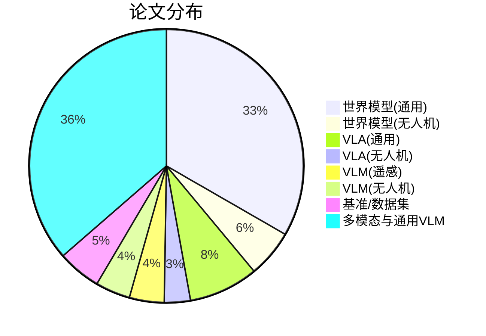

# 完整论文列表

> 本文收录 World Model、VLA、VLM 及无人机相关的核心论文 195 篇。
> 推荐等级：★★★ 必读 | ★★☆ 推荐 | ★☆☆ 选读
>
> **本文是元数据唯一权威**：年份、标题、会议/期刊以本表为准。各专题文档与论文卡片只写结论并链回这里，
> 不重复维护年份；标题一律取 arXiv API 返回的完整标题 —— 系统名（如 NavFoM）是简称，不进标题位。
>
> 每一条写成 `- **[会议'年] 名称** — *完整标题* · 推荐度` 一行，下一行缩进挂徽章：
> arXiv 编号取红底 `arXiv`，项目页取蓝底 `Website`，代码库取黑底 `GitHub`。
> 有系统名的条目加粗位放系统名、斜体位放完整标题（如 `TD-MPC/TD-MPC2`）；
> 没有系统名的条目加粗位直接是完整标题、斜体位是作者（如 `World Models`）。
> 徽章只挂在清单层；各专题正文里的表格仍用纯文本链接，不挂徽章。
>
> 项目页与代码库收的是作者在摘要或 arXiv comment 里写出的那些，外加本仓库卡片里已核对可访问的那些；
> 两者都没有的条目只留 arXiv 一枚徽章（注意这**不等于**没有代码）。
> 按此口径，**无人机三节 20 篇里有 12 篇只留 arXiv 徽章（60%），其余五节 61 篇里只有 19 篇（31%）**。
> 这一项由此带了信息：空中方向的项目页与代码链接，比地面方向稀疏。
> 加上追前沿新增的条目，**全表 195 篇里有 139 篇只留 arXiv 一枚徽章**。
>
> **上面那组比例只对 2026-10 追前沿之前的 81 篇成立**（分母 20 + 61 = 81）。此后的新增条目
> 项目页与代码库**未逐条核查**，与上面「只留 arXiv 一枚徽章」的含义不同，统计时不要混进来：
>
> | 批次 | 条数 | 其中只有 arXiv 徽章 | 说明 |
> |:---|:---:|:---:|:---|
> | 波 1：`1.5`–`1.7` 三节与「二」的后 5 条 | 52 | 52 | 全部未核查 |
> | 波 2：`8.1`–`8.3` 三节 | 62 | 58 | 4 条经 HTTP 核对后填入（BLIP-2、DINOv2、POPE、MME-RealWorld） |
> | **合计待核查** | **114** | **110** | 恢复信息量需逐条查过代码库 |
>
> 上表「4 条经 HTTP 核对」指只确认了 URL 返回 200，**不等于**该仓库与论文一一对应；
> 这一层核对在排版改造那一轮统一做。

---

## 一、世界模型 — 通用 (World Models, General)

### 1.1 经典基础

- **[NeurIPS'18] World Models** — *Ha & Schmidhuber* · ★★★  
  [](https://arxiv.org/abs/1803.10122) [](https://worldmodels.github.io/)

- **[ICLR'20] Dream to Control** — *Dream to Control: Learning Behaviors by Latent Imagination* · ★★★  
  [](https://arxiv.org/abs/1912.01603)

- **[ICLR'21] Mastering Atari with Discrete World Models** — *Hafner et al.* · ★★★  
  [](https://arxiv.org/abs/2010.02193) [](https://danijar.com/dreamerv2)

- **[Nature'25] Mastering Diverse Domains through World Models** — *Hafner et al.* · ★★★  
  [](https://arxiv.org/abs/2301.04104) [](https://danijar.com/dreamerv3)
  Nature 2025 版标题为《Mastering diverse control tasks through world models》（DOI 10.1038/s41586-025-08744-2）。

- **[ICLR'22/24] TD-MPC/TD-MPC2** — *TD-MPC/TD-MPC2: Temporal Difference Learning for Model Predictive Control* · ★★☆  
  [](https://arxiv.org/abs/2203.04955) [](https://nicklashansen.github.io/td-mpc)

### 1.2 Transformer 时代

- **[ICLR'23] IRIS** — *Transformers are Sample-Efficient World Models (IRIS)* · ★★★  
  [](https://arxiv.org/abs/2209.00588) [](https://github.com/eloialonso/iris)

- **[NeurIPS'24] DIAMOND** — *Diffusion for World Modeling: Visual Details Matter in Atari (DIAMOND)* · ★★★  
  [](https://arxiv.org/abs/2405.12399) [](https://diamond-wm.github.io)

- **[arXiv'24.08] GameNGen** — *GameNGen: Diffusion Models are Real-Time Game Engines* · ★★☆  
  [](https://arxiv.org/abs/2408.14837) [](https://gamengen.github.io/)

- **[NeurIPS'24] Learning Universal Policies via Text-Guided Video Generation** — *Du et al.* · ★★☆  
  [](https://arxiv.org/abs/2302.00111) [](https://universal-policy.github.io/)

- **[Report'24] Genie 2** — *Genie 2: A Large-Scale Foundation World Model* · ★★☆  
  [](https://deepmind.google/discover/blog/genie-2/)

### 1.3 大规模世界模型

- **[arXiv'24.02] Genie** — *Genie: Generative Interactive Environments* · ★★★  
  [](https://arxiv.org/abs/2402.15391) [](https://sites.google.com/corp/view/genie-2024/)

- **[arXiv'23.10] UniSim** — *UniSim: Learning Interactive Real-World Simulators* · ★★★  
  [](https://arxiv.org/abs/2310.06114) [](https://universal-simulator.github.io)

- **[Report'25] Cosmos World Foundation Model Platform for Physical AI** — *NVIDIA* · ★★★  
  [](https://arxiv.org/abs/2501.03575) [](https://github.com/nvidia-cosmos/cosmos-predict1)

- **[Report'25] GAIA-2** — *GAIA-2: Generative AI for Autonomous Driving* · ★★☆  
  [](https://wayve.ai/thinking/gaia-2/)

- **[Report'25] World Labs** — *World Labs: Generating 3D Worlds* · ★☆☆  
  [](https://www.worldlabs.ai/blog)

### 1.4 世界模型理论与综述

- **[IEEE T-ITS'24] World Models for Autonomous Driving** — *World Models for Autonomous Driving: An Initial Survey* · ★★☆  
  [](https://arxiv.org/abs/2403.02622)

- **[arXiv'23.11] Diffusion Models for Reinforcement Learning: A Survey** — *Zhu et al.* · ★☆☆  
  [](https://arxiv.org/abs/2311.01223) [](https://github.com/apexrl/Diff4RLSurvey)

- **[NeurIPS'22] Multi-Game Decision Transformers** — *Lee et al.* · ★☆☆  
  [](https://arxiv.org/abs/2205.15241) [](https://sites.google.com/view/multi-game-transformers)

### 1.5 联合嵌入预测与潜空间世界模型（JEPA 路线）

- **[arXiv'23.01] Self-Supervised Learning from Images with a Joint-Embedding Predictive Architecture** — *Assran et al.* · ★★★  
  [](https://arxiv.org/abs/2301.08243)

- **[arXiv'25.06] V-JEPA 2** — *V-JEPA 2: Self-Supervised Video Models Enable Understanding, Prediction and Planning* · ★★★  
  [](https://arxiv.org/abs/2506.09985)

- **[arXiv'24.06] Cognitively Inspired Energy-Based World Models** — *Gladstone et al.* · ★★☆  
  [](https://arxiv.org/abs/2406.08862)

- **[arXiv'26.06] Sensorimotor World Models** — *Sensorimotor World Models: Perception for Action via Inverse Dynamics* · ★★☆  
  [](https://arxiv.org/abs/2606.20104)

- **[arXiv'26.07] ODEWorld** — *ODEWorld: A Continuous Predictive Architecture via Physical-Time Flow* · ★★☆  
  [](https://arxiv.org/abs/2607.27924)

- **[arXiv'26.08] Flow-JEPA** — *Flow-JEPA: Robust Latent Dynamics for JEPA World Models via Flow Matching* · ★★☆  
  [](https://arxiv.org/abs/2608.29029)

- **[arXiv'26.09] MA-JEPA** — *MA-JEPA: Joint-Embedding World Models for Multi-Agent Reinforcement Learning* · ★☆☆  
  [](https://arxiv.org/abs/2609.33563)

- **[arXiv'26.10] DeepJEPA** — *DeepJEPA: Scaling World Models from Within* · ★★★  
  [](https://arxiv.org/abs/2610.00368)

- **[arXiv'26.10] CF-JEPA** — *CF-JEPA: Improving Robustness of JEPA World Models via Controllability Factorization* · ★★☆  
  [](https://arxiv.org/abs/2610.00727)

- **[arXiv'26.10] Drive vs. Decay** — *Drive vs. Decay: On the Training Dynamics of Joint-Embedding Predictive Architectures* · ★★☆  
  [](https://arxiv.org/abs/2610.02344)

- **[arXiv'26.10] TwinJEPA** — *TwinJEPA: Action-Preferred Predictive Representations for Goal-Conditioned Control* · ★☆☆  
  [](https://arxiv.org/abs/2610.02922)

- **[arXiv'26.10] Keeping JEPA World Models Plannable When Little of the Frame Moves** — *Strohm et al.* · ★★☆  
  [](https://arxiv.org/abs/2610.03137)

- **[arXiv'26.10] AVL-JEPA** — *AVL-JEPA: Preventing Causal Dynamics Information Collapse in Joint Embedding Predictive Architecture World Models* · ★★☆  
  [](https://arxiv.org/abs/2610.03587)

- **[arXiv'26.10] Frozen in a Frame** — *Frozen in a Frame: The Velocity Blind Spot in JEPA World Models* · ★★★  
  [](https://arxiv.org/abs/2610.04585)

- **[arXiv'26.10] H-JEPA** — *H-JEPA: End-to-End Learning of Hierarchical World Models for Visual Planning* · ★★☆  
  [](https://arxiv.org/abs/2610.06805)

- **[arXiv'26.10] Preserving Unstable Modes Through Inverse Dynamics in JEPA World Models** — *Toso et al.* · ★★☆  
  [](https://arxiv.org/abs/2610.07540)

- **[arXiv'26.10] Modeling Latent Disturbances for Robust Decision-Making in World Models** — *Seo et al.* · ★☆☆  
  [](https://arxiv.org/abs/2610.07599)

- **[arXiv'26.10] DSReg** — *DSReg: Provably Recovering Individual World Latents without Reconstruction* · ★★☆  
  [](https://arxiv.org/abs/2610.09457)

- **[arXiv'26.10] RoboJEPA** — *RoboJEPA: Scaling Robotic Latent World Models* · ★★★  
  [](https://arxiv.org/abs/2610.10515)

### 1.6 世界模型评测与诊断

- **[arXiv'26.09] Same World, Different Knowledge** — *Same World, Different Knowledge: When Isolated Audits Misjudge World-Model Repairs* · ★★★  
  [](https://arxiv.org/abs/2609.21155)

- **[arXiv'26.09] Beyond One-Step Accuracy** — *Beyond One-Step Accuracy: State-Affine Latent Transition for Reliable Visual Planning* · ★★☆  
  [](https://arxiv.org/abs/2609.33595)

- **[arXiv'26.10] Learning Commute-Time-Preserving World Models for Planning** — *Hauri et al.* · ★☆☆  
  [](https://arxiv.org/abs/2610.01373)

- **[arXiv'26.10] PROWBench** — *PROWBench: Do Video Models Render What the Program Specifies?* · ★★☆  
  [](https://arxiv.org/abs/2610.02205)

- **[arXiv'26.10] Does Physics Live in the Activations? Localizing Physical Quantities in Video Diffusion Models** — *Kneifl et al.* · ★★☆  
  [](https://arxiv.org/abs/2610.03154)

- **[arXiv'26.10] World Embedding Benchmark** — *Liu et al.* · ★★☆  
  [](https://arxiv.org/abs/2610.03632)

- **[arXiv'26.10] When Low Prediction Error Misleads Planning: Diagnosing Representation, Dynamics, and Decision Failures in Latent World Models** — *Min et al.* · ★★★  
  [](https://arxiv.org/abs/2610.05550)

- **[arXiv'26.10] World Models' Last Exam in Physics** — *Gao et al.* · ★★☆  
  [](https://arxiv.org/abs/2610.08791)

- **[arXiv'26.10] World Models Dream of Success** — *World Models Dream of Success: Diagnosing and Repairing Failure Insensitivity in Robot World Models* · ★★★  
  [](https://arxiv.org/abs/2610.09134)

- **[arXiv'26.10] Predicted Futures Are Not Enough** — *Predicted Futures Are Not Enough: Learning Executable Goals for Robot Manipulation* · ★★☆  
  [](https://arxiv.org/abs/2610.09309)

### 1.7 长时程世界模型与交互式生成

- **[arXiv'26.08] GeniWorld** — *GeniWorld: A Generalizable Interactive World Model for Robotic Manipulation via Visual Actions* · ★★☆  
  [](https://arxiv.org/abs/2608.06332)

- **[arXiv'26.08] ReWorld** — *ReWorld: An Interactive World Model with Long-Horizon Memory* · ★★☆  
  [](https://arxiv.org/abs/2608.23565)

- **[arXiv'26.08] Matrix-Game 3.5** — *Matrix-Game 3.5: Enhancing Real-Time Streaming Interactive World Models with Patch Memory* · ★★☆  
  [](https://arxiv.org/abs/2608.29910)

- **[arXiv'26.09] SolarWM** — *SolarWM: Open Data and Scalable Training for Long-Horizon Video World Models* · ★☆☆  
  [](https://arxiv.org/abs/2609.02886)

- **[arXiv'26.09] The Past Frames the Future** — *The Past Frames the Future: Memory for Autoregressive Video Generation* · ★★☆  
  [](https://arxiv.org/abs/2609.28466)

- **[arXiv'26.09] WorldPlay2** — *WorldPlay2: Extending Real-Time Interactive World Models in Control and Horizon* · ★☆☆  
  [](https://arxiv.org/abs/2609.35560)

- **[arXiv'26.09] Waypoint-1.5** — *Waypoint-1.5: A Real-Time Video World Model for Consumer Hardware* · ★★☆  
  [](https://arxiv.org/abs/2609.37107)

- **[arXiv'26.09] Beyond a Single Latent Space** — *Beyond a Single Latent Space: A Dual-Latent World Model for Long-Horizon Planning* · ★★☆  
  [](https://arxiv.org/abs/2609.37644)

- **[arXiv'26.09] Honeycomb** — *Honeycomb: Constant-Size Scene Memory Representation for Video World Models* · ★★★  
  [](https://arxiv.org/abs/2609.37690)

- **[arXiv'26.10] Oneira** — *Oneira: From Open-Ended Generation to Open-World Interaction in Video World Models* · ★☆☆  
  [](https://arxiv.org/abs/2610.01614)

- **[arXiv'26.10] World Observer** — *World Observer: Joint Actor-Observer Generation for Persistent World Modeling* · ★☆☆  
  [](https://arxiv.org/abs/2610.02162)

- **[arXiv'26.10] Spatial Memory Intelligence** — *Spatial Memory Intelligence: Endowing World Models with Understanding-Driven Long-Term Memory* · ★★☆  
  [](https://arxiv.org/abs/2610.02521)

- **[arXiv'26.10] DeltaWorld** — *DeltaWorld: Physically Consistent Interactive World Simulators via Action-Conditioned Latent Increment Learning* · ★★☆  
  [](https://arxiv.org/abs/2610.02691)

- **[arXiv'26.10] FLEX-WAM** — *FLEX-WAM: Flexible Block-Causal World-Action Models for Long-Horizon Imagination and Planning* · ★★☆  
  [](https://arxiv.org/abs/2610.05483)

- **[arXiv'26.10] HLA-WM** — *HLA-WM: Hybrid Linear Attention for Long-Horizon Video World Models* · ★★☆  
  [](https://arxiv.org/abs/2610.05739)

- **[arXiv'26.10] SimForcing** — *SimForcing: Distilling Simulation Motion Priors into Real-Domain Robot World Models* · ★★☆  
  [](https://arxiv.org/abs/2610.06598)

- **[arXiv'26.10] Tracking Is Not Permanence** — *Tracking Is Not Permanence: What Video World Models Keep of a Hidden Object* · ★★★  
  [](https://arxiv.org/abs/2610.07355)

- **[arXiv'26.10] Parallel Predictive World Models for Accurate and Efficient Long-Horizon Planning** — *Feng et al.* · ★★☆  
  [](https://arxiv.org/abs/2610.08627)

> 1.5–1.7 三节是 2026-10 追前沿时新增的（对应 `docs/02-世界模型专题/07`–`09` 三篇）。**这三节的项目页与代码库没有逐条核查**，
> 只留 arXiv 一枚徽章表示「未核查」，不等于「没有代码」——与其余各节只留 arXiv 徽章的含义不同，统计时不要混。
> 三节里的 arXiv 号全部由 arXiv API 逐条核对过 ID↔标题；录用去向在 API 返回里拿不到，标签一律写 `[arXiv'YY.MM]`，不臆测。

---

## 二、世界模型 — 无人机 (World Models, UAV/Drone)

- **[IEEE RA-L'24] Learning to Fly in Seconds** — *Eschmann et al.* · ★★☆  
  [](https://arxiv.org/abs/2311.13081)

- **[ICRA'25] Dream to Fly** — *Dream to Fly: Model-Based Reinforcement Learning for Vision-Based Drone Flight* · ★★★  
  [](https://arxiv.org/abs/2501.14377)

- **[arXiv'25.12] Aerial World Model for Long-horizon Visual Generation and Navigation in 3D Space** — *Zhang et al.* · ★★★  
  [](https://arxiv.org/abs/2512.21887)

- **[arXiv'25.09] FlightDiffusion** — *FlightDiffusion: Revolutionising Autonomous Drone Training with Diffusion Models Generating FPV Video* · ★★☆  
  [](https://arxiv.org/abs/2509.14082)

- **[arXiv'26.04] MotionScape** — *MotionScape: A Motion-Stratified UAV Video Benchmark for World Modeling and Future Video Generation* · ★★☆  
  [](https://arxiv.org/abs/2604.07991) [](https://github.com/Thelegendzz/MotionScape)

- **[arXiv'24.08] AeroVerse** — *AeroVerse: UAV-Agent Benchmark Suite for Simulating, Pre-training, Finetuning, and Evaluating Aerospace Embodied World Models* · ★★☆  
  [](https://arxiv.org/abs/2408.15511)

- **[arXiv'26.05] Aero-World** — *Aero-World: Action-Conditioned Aerial Video Generation from Inertial Controls* · ★★★  
  [](https://arxiv.org/abs/2605.19728)

- **[arXiv'26.05] WorldVLN** — *WorldVLN: Autoregressive World Action Model for Aerial Vision-Language Navigation* · ★★☆  
  [](https://arxiv.org/abs/2605.15964)

- **[arXiv'26.06] WorldFly** — *WorldFly: A World-Model-Based Vision-Language-Action Model for UAV Navigation* · ★★☆  
  [](https://arxiv.org/abs/2606.06147)

- **[arXiv'26.09] Skytopia** — *Skytopia: Monocular Drone Navigation with Action-Conditioned Latent World Models* · ★★★  
  [](https://arxiv.org/abs/2609.26007)

- **[arXiv'26.09] ForeFly** — *ForeFly: A Dual-Horizon World Action Model for Aerial Vision-Language Navigation* · ★★★  
  [](https://arxiv.org/abs/2609.33581)

> 注：本节仅保留已验证 arXiv ID 的论文。更多无人机世界模型论文请参考 [无人机世界模型综述](../docs/02-世界模型专题/05-无人机世界模型综述.md)。
>
> **后 5 条（Aero-World / WorldVLN / WorldFly / Skytopia / ForeFly）是 2026-10 追前沿时新增的**，其中 `2605.19728` / `2605.15964` / `2606.06147` 三条落在
> `tools/watch.py` 的 120 天窗口起点（2026-06-10）之前几周，是换用不限窗口的查询复核时才捞出来的——
> 复核证据记在 `tools/watchlists.py` 的 `VERIFIED_ZEROS` 里。**窗口起点会切掉一整批同主线的论文，写「近期空白」之前必须先看不限窗口的命中。**

---

## 三、VLA — 通用 (Vision-Language-Action, General)

### 3.1 奠基工作

- **[ICML'23] PaLM-E** — *PaLM-E: An Embodied Multimodal Language Model* · ★★★  
  [](https://arxiv.org/abs/2303.03378)

- **[CoRL'23] RT-2** — *RT-2: Vision-Language-Action Models Transfer Web Knowledge to Robotic Control* · ★★★  
  [](https://arxiv.org/abs/2307.15818) [](https://robotics-transformer.github.io/)

- **[RSS'23] RT-1** — *RT-1: Robotics Transformer for Real-World Control* · ★★☆  
  [](https://arxiv.org/abs/2212.06817)

- **[CoRL'22] SayCan** — *SayCan: Do As I Can, Not As I Say* · ★★☆  
  [](https://arxiv.org/abs/2204.01691) [](https://say-can.github.io/)

### 3.2 开源时代

- **[arXiv'24.06] OpenVLA** — *OpenVLA: An Open-Source Vision-Language-Action Model* · ★★★  
  [](https://arxiv.org/abs/2406.09246) [](https://openvla.github.io/)

- **[arXiv'24.05] Octo** — *Octo: An Open-Source Generalist Robot Policy* · ★★★  
  [](https://arxiv.org/abs/2405.12213) [](https://octo-models.github.io)

- **[ICRA'24] Open X-Embodiment** — *Open X-Embodiment: Robotic Learning Datasets and RT-X Models* · ★★★  
  [](https://arxiv.org/abs/2310.08864) [](https://robotics-transformer-x.github.io)

- **[arXiv'24.12] RoboVLMs** — *What Matters in Building Vision-Language-Action Models for Generalist Robots (RoboVLMs)* · ★★☆  
  [](https://arxiv.org/abs/2412.14058)

- **[arXiv'24.01] SpatialVLM** — *SpatialVLM: Endowing Vision-Language Models with Spatial Reasoning* · ★☆☆  
  [](https://arxiv.org/abs/2401.12168) [](https://spatial-vlm.github.io/)

### 3.3 流匹配与扩散 VLA

- **[arXiv'24.10] π₀** — *π₀: A Vision-Language-Action Flow Model for General Robot Control* · ★★★  
  [](https://arxiv.org/abs/2410.24164) [](https://physicalintelligence.company/blog/pi0)

- **[arXiv'25.04] π₀.₅** — *π₀.₅: a Vision-Language-Action Model with Open-World Generalization* · ★★★  
  [](https://arxiv.org/abs/2504.16054)

- **[RSS'24] 3D Diffusion Policy (DP3)** — *3D Diffusion Policy (DP3): Generalizable Visuomotor Policy* · ★★☆  
  [](https://arxiv.org/abs/2403.03954) [](https://3d-diffusion-policy.github.io)

- **[RSS'23] Diffusion Policy** — *Diffusion Policy: Visuomotor Policy Learning via Action Diffusion* · ★★☆  
  [](https://arxiv.org/abs/2303.04137)

### 3.4 VLA 理论与综述

- **[arXiv'24.05] A Survey on Vision-Language-Action Models for Embodied AI** — *Ma et al.* · ★★★  
  [](https://arxiv.org/abs/2405.14093) [](https://github.com/yueen-ma/Awesome-VLA)

- **[arXiv'23.03] Foundation Models for Decision Making** — *Foundation Models for Decision Making: Problems, Methods, and Opportunities* · ★★☆  
  [](https://arxiv.org/abs/2303.04129)

- **[arXiv'25.01] FAST** — *FAST: Efficient Action Tokenization for Vision-Language-Action Models* · ★★☆  
  [](https://arxiv.org/abs/2501.09747) [](https://www.pi.website/research/fast)

---

## 四、VLA — 无人机 (Vision-Language-Action, UAV/Drone)

- **[arXiv'25.12] VLA-AN** — *VLA-AN: An Efficient and Onboard Vision-Language-Action Framework for Aerial Navigation in Complex Environments* · ★★★  
  [](https://arxiv.org/abs/2512.15258)

- **[arXiv'25.03] CognitiveDrone** — *CognitiveDrone: A VLA Model and Evaluation Benchmark for Real-Time Cognitive Task Solving and Reasoning in UAVs* · ★★★  
  [](https://arxiv.org/abs/2503.01378) [](https://cognitivedrone.github.io)

- **[arXiv'26.04] UAV-Track VLA** — *UAV-Track VLA: Embodied Aerial Tracking via Vision-Language-Action Models* · ★★★  
  [](https://arxiv.org/abs/2604.02241) [](https://github.com/Hub-Tian/UAV-Track_VLA)

- **[arXiv'25.05] UAV-Flow Colosseo** — *UAV-Flow Colosseo: A Real-World Benchmark for Flying-on-a-Word UAV Imitation Learning* · ★★☆  
  [](https://arxiv.org/abs/2505.15725) [](https://github.com/buaa-colalab/UAV-Flow)

- **[arXiv'26.02] VLN-Pilot** — *VLN-Pilot: Large Vision-Language Model as an Autonomous Indoor Drone Operator* · ★★☆  
  [](https://arxiv.org/abs/2602.05552)

- **[ICLR'26] AutoFly** — *AutoFly: Vision-Language-Action Model for UAV Autonomous Navigation in the Wild* · ★★☆  
  [](https://arxiv.org/abs/2602.09657)

---

## 五、VLM — 遥感 (Vision-Language Models, Remote Sensing)

- **[CVPR'24] GeoChat** — *GeoChat: Grounded Large Vision-Language Model for Remote Sensing* · ★★★  
  [](https://arxiv.org/abs/2311.15826) [](https://github.com/mbzuai-oryx/geochat)

- **[arXiv'23.07] RSGPT** — *RSGPT: A Remote Sensing Vision Language Model and Benchmark* · ★★★  
  [](https://arxiv.org/abs/2307.15266)

- **[ECCV'24] LHRS-Bot** — *LHRS-Bot: Empowering Remote Sensing with VGI-Enhanced Large Multimodal Language Model* · ★★☆  
  [](https://arxiv.org/abs/2402.02544) [](https://github.com/NJU-LHRS/LHRS-Bot)

- **[arXiv'24.09] ChangeChat** — *ChangeChat: An Interactive Model for Remote Sensing Change Analysis via Multimodal Instruction Tuning* · ★★☆  
  [](https://arxiv.org/abs/2409.08582) [](https://github.com/hanlinwu/ChangeChat)

- **[arXiv'24.01] EarthGPT** — *EarthGPT: A Universal Multi-modal Large Language Model for Multi-sensor Image Comprehension in Remote Sensing Domain* · ★★☆  
  [](https://arxiv.org/abs/2401.16822)

- **[arXiv'24.01] SkyEyeGPT** — *SkyEyeGPT: Unifying Remote Sensing Vision-Language Tasks via Instruction Tuning with Large Language Model* · ★☆☆  
  [](https://arxiv.org/abs/2401.09712) [](https://github.com/ZhanYang-nwpu/SkyEyeGPT)

- **[arXiv'24.02] ChatEarthNet** — *ChatEarthNet: A Global-Scale Image-Text Dataset Empowering Vision-Language Geo-Foundation Models* · ★☆☆  
  [](https://arxiv.org/abs/2402.11325)

- **[TGRS'24] RemoteCLIP** — *RemoteCLIP: A Vision Language Foundation Model for Remote Sensing* · ★★☆  
  [](https://arxiv.org/abs/2306.11029) [](https://github.com/ChenDelong1999/RemoteCLIP)

---

## 六、VLM — 无人机 (Vision-Language Models, UAV/Drone)

- **[arXiv'26.01] DVGBench** — *DVGBench: Implicit-to-Explicit Visual Grounding Benchmark in UAV Imagery with Large Vision-Language Models* · ★★★  
  [](https://arxiv.org/abs/2601.00998) [](https://github.com/zytx121/DVGBench)

- **[arXiv'26.03] UAVBench and UAVIT-1M** — *UAVBench and UAVIT-1M: Benchmarking and Enhancing MLLMs for Low-Altitude UAV Vision-Language Understanding* · ★★☆  
  [](https://arxiv.org/abs/2603.14336) [](https://UAVBench.github.io/)

- **[arXiv'26.04] Can VLMs Think from the Sky? Unifying UAV Reasoning and Generation** — *Sun et al.* · ★★☆  
  [](https://arxiv.org/abs/2604.05377)

- **[arXiv'25.12] CoDrone** — *CoDrone: Autonomous Drone Navigation Assisted by Edge and Cloud Foundation Models* · ★★☆  
  [](https://arxiv.org/abs/2512.19083)

- **[arXiv'25.05] FM-Planner** — *FM-Planner: Foundation Model Guided Path Planning for Autonomous Drone Navigation* · ★★☆  
  [](https://arxiv.org/abs/2505.20783) [](https://github.com/NTU-ICG/FM-Planner)

- **[arXiv'25.09] Embodied Navigation Foundation Model** — *Zhang et al.* · ★★☆  
  [](https://arxiv.org/abs/2509.12129) [](https://pku-epic.github.io/NavFoM-Web/)

- **[ACL'25] CityNavAgent** — *CityNavAgent: Aerial Vision-and-Language Navigation with Hierarchical Semantic Planning and Global Memory* · ★★☆  
  [](https://arxiv.org/abs/2505.05622)

- **[arXiv'25.03] UAV-VLRR** — *UAV-VLRR: Vision-Language Informed NMPC for Rapid Response in UAV Search and Rescue* · ★★☆  
  [](https://arxiv.org/abs/2503.02465)

> 注：更多无人机 VLM 论文请参考 [无人机场景理解](../docs/04-VLM专题/02-无人机场景理解.md) 和 [LLM驱动的无人机Agent](../docs/04-VLM专题/03-LLM驱动的无人机Agent.md)。

---

## 七、基准与数据集 (Benchmarks & Datasets)

- **[ICRA'24] Open X-Embodiment** — *Open X-Embodiment: Robotic Learning Datasets and RT-X Models* · ★★★  
  [](https://arxiv.org/abs/2310.08864) [](https://robotics-transformer-x.github.io)

- **[arXiv'23.06] LIBERO** — *LIBERO: Benchmarking Knowledge Transfer in Lifelong Robot Learning* · ★★☆  
  [](https://arxiv.org/abs/2306.03310) [](https://libero-project.github.io)

- **[arXiv'24.05] SIMPLER** — *Evaluating Real-World Robot Manipulation Policies in Simulation (SIMPLER)* · ★★☆  
  [](https://arxiv.org/abs/2405.05941) [](https://simpler-env.github.io)

- **[ICLR'23] ManiSkill2** — *ManiSkill2: A Unified Benchmark for Generalizable Manipulation* · ★★☆  
  [](https://arxiv.org/abs/2302.04659) [](https://maniskill2.github.io/)

- **[ICLR'24] Habitat 3.0** — *Habitat 3.0: A Co-Habitat for Humans, Avatars, and Robots* · ★★☆  
  [](https://arxiv.org/abs/2310.13724) [](http://aihabitat.org/habitat3)

- **[ISER'18] AirSim** — *AirSim: High-Fidelity Visual and Physical Simulation* · ★★★  
  [](https://github.com/microsoft/AirSim)

- **[Various'20-24] DroneCrowd / DroneVehicle / VisDrone Benchmarks** — *Various* · ★★☆  
  [](https://github.com/VisDrone/VisDrone-Dataset)

- **[arXiv'21.08] TS4Net** — *TS4Net: Two-Stage Sample Selective Strategy for Rotating Object Detection（提出 UAV-ROD 无人机数据集）* · ★☆☆  
  [](https://arxiv.org/abs/2108.03116)

- **[arXiv'25.11] Is your VLM Sky-Ready? A Comprehensive Spatial Intelligence Benchmark for UAV Navigation** · ★☆☆  
  [](https://arxiv.org/abs/2511.13269) [](https://github.com/linglingxiansen/SpatialSKy)

- **[arXiv'26.01] AIR-VLA** — *AIR-VLA: Vision-Language-Action Systems for Aerial Manipulation* · ★★☆  
  [](https://arxiv.org/abs/2601.21602) [](https://github.com/SpencerSon2001/AIR-VLA)

---

## 八、多模态基础模型与通用 VLM 方法 (Foundation Models & General VLM)

> 本节按通用 VLM 的方法主干分三组，与 `docs/04-VLM专题/` 的 `05`（架构与编码器）、`06`（指令微调）、`07`（评测与幻觉）三篇一一对应。`### 8.x` 子编号是本次新增的，未改动「五」至「十」的节号。

### 8.1 架构与视觉编码器（→ `04-VLM专题/05`）

- **[ICML'21] CLIP** — *CLIP: Learning Transferable Visual Models from NLP* · ★★★  
  [](https://arxiv.org/abs/2103.00020) [](https://github.com/OpenAI/CLIP)

- **[CVPR'21] LiT** — *LiT: Zero-Shot Transfer with Locked-image text Tuning* · ★☆☆  
  [](https://arxiv.org/abs/2111.07991)

- **[NeurIPS'22] Flamingo** — *Flamingo: a Visual Language Model for Few-Shot Learning* · ★★★  
  [](https://arxiv.org/abs/2204.14198)

- **[CVPR'22] Scaling Language-Image Pre-training via Masking** — *Li et al.* · ★☆☆  
  [](https://arxiv.org/abs/2212.00794)

- **[arXiv'23.01] BLIP-2** — *BLIP-2: Bootstrapping Language-Image Pre-training with Frozen Image Encoders and Large Language Models* · ★★★  
  [](https://arxiv.org/abs/2301.12597) [](https://github.com/salesforce/LAVIS)

- **[arXiv'23.03] EVA-CLIP** — *EVA-CLIP: Improved Training Techniques for CLIP at Scale* · ★☆☆  
  [](https://arxiv.org/abs/2303.15389)

- **[ICCV'23] SigLIP** — *SigLIP: Sigmoid Loss for Language-Image Pre-Training* · ★★★  
  [](https://arxiv.org/abs/2303.15343) [](https://github.com/google-research/big_vision)

- **[arXiv'25.02] SigLIP 2** — *SigLIP 2: Multilingual Vision-Language Encoders with Improved Semantic Understanding, Localization, and Dense Features* · ★★☆  
  [](https://arxiv.org/abs/2502.14786)

- **[NeurIPS'23] DataComp** — *DataComp: In search of the next generation of multimodal datasets* · ★☆☆  
  [](https://arxiv.org/abs/2304.14108)

- **[arXiv'23.04] DINOv2** — *DINOv2: Learning Robust Visual Features without Supervision* · ★★☆  
  [](https://arxiv.org/abs/2304.07193) [](https://github.com/facebookresearch/dinov2)

- **[arXiv'23.07] Patch n' Pack** — *Patch n' Pack: NaViT, a Vision Transformer for any Aspect Ratio and Resolution* · ★★☆  
  [](https://arxiv.org/abs/2307.06304)

- **[arXiv'23.08] Qwen-VL** — *Qwen-VL: A Versatile Vision-Language Model for Understanding, Localization, Text Reading, and Beyond* · ★★☆  
  [](https://arxiv.org/abs/2308.12966) [](https://github.com/QwenLM/Qwen-VL)

- **[arXiv'24.09] Qwen2-VL** — *Qwen2-VL: Enhancing Vision-Language Model's Perception of the World at Any Resolution* · ★★★  
  [](https://arxiv.org/abs/2409.12191)

- **[arXiv'25.02] Qwen2.5-VL Technical Report** — *Qwen Team* · ★★★  
  [](https://arxiv.org/abs/2502.13923)

- **[CVPR'24] InternVL** — *InternVL: Scaling up Vision Foundation Models and Aligning for Generic Visual-Linguistic Tasks* · ★★☆  
  [](https://arxiv.org/abs/2312.14238) [](https://github.com/OpenGVLab/InternVL)

- **[arXiv'24.12] Expanding Performance Boundaries of Open-Source Multimodal Models with Model, Data, and Test-Time Scaling** — *Chen et al.* · ★★☆  
  [](https://arxiv.org/abs/2412.05271) [](https://github.com/OpenGVLab/InternVL)

- **[CVPR'23] Honeybee** — *Honeybee: Locality-enhanced Projector for Multimodal LLM* · ★★☆  
  [](https://arxiv.org/abs/2312.06742)

- **[ICLR'22] Token Merging** — *Token Merging: Your ViT But Faster* · ★★☆  
  [](https://arxiv.org/abs/2210.09461)

- **[arXiv'24.02] MobileVLM V2** — *MobileVLM V2: Faster and Stronger Baseline for Vision Language Model* · ★☆☆  
  [](https://arxiv.org/abs/2402.03766)

- **[ICCV'24] LLaVA-PruMerge** — *LLaVA-PruMerge: Adaptive Token Reduction for Efficient Large Multimodal Models* · ★☆☆  
  [](https://arxiv.org/abs/2403.15388)

- **[arXiv'24.05] Matryoshka Multimodal Models** — *Cai et al.* · ★★☆  
  [](https://arxiv.org/abs/2405.17430)

- **[arXiv'24.05] Ovis** — *Ovis: Structural Embedding Alignment for Multimodal Large Language Model* · ★☆☆  
  [](https://arxiv.org/abs/2405.20797)

- **[arXiv'24.07] TokenPacker** — *TokenPacker: Efficient Visual Projector for Multimodal LLM* · ★☆☆  
  [](https://arxiv.org/abs/2407.02392)

- **[ICML'24] Prismatic VLMs** — *Prismatic VLMs: Investigating the Design Space of Visually-Conditioned Language Models* · ★★☆  
  [](https://arxiv.org/abs/2402.07865)

- **[arXiv'24.03] MM1** — *MM1: Methods, Analysis & Insights from Multimodal LLM Pre-training* · ★★★  
  [](https://arxiv.org/abs/2403.09611)

- **[arXiv'24.05] What matters when building vision-language models?** — *Laurençon et al.* · ★★☆  
  [](https://arxiv.org/abs/2405.02246)

- **[arXiv'24.06] Cambrian-1** — *Cambrian-1: A Fully Open, Vision-Centric Exploration of Multimodal LLMs* · ★☆☆  
  [](https://arxiv.org/abs/2406.16860) [](https://cambrian-mllm.github.io)

- **[arXiv'24.08] LLaVA-OneVision** — *LLaVA-OneVision: Easy Visual Task Transfer* · ★★☆  
  [](https://arxiv.org/abs/2408.03326)

- **[Report'23] GPT-4V(ision) System Card** — *OpenAI* · ★★☆  
  [](https://cdn.openai.com/papers/GPTV_System_Card.pdf)

### 8.2 指令微调与对齐（→ `04-VLM专题/06`）

- **[NeurIPS'23] LLaVA** — *LLaVA: Visual Instruction Tuning* · ★★★  
  [](https://arxiv.org/abs/2304.08485) [](https://llava-vl.github.io/)

- **[arXiv'23.10] LLaVA-1.5** — *LLaVA-1.5: Improved Baselines with Visual Instruction Tuning* · ★★★  
  [](https://arxiv.org/abs/2310.03744) [](https://llava-vl.github.io)

- **[arXiv'23.04] MiniGPT-4** — *MiniGPT-4: Enhancing Vision-Language Understanding with Advanced Large Language Models* · ★★☆  
  [](https://arxiv.org/abs/2304.10592)

- **[arXiv'23.05] InstructBLIP** — *InstructBLIP: Towards General-purpose Vision-Language Models with Instruction Tuning* · ★★☆  
  [](https://arxiv.org/abs/2305.06500) [](https://github.com/salesforce/LAVIS)

- **[arXiv'23.04] mPLUG-Owl** — *mPLUG-Owl: Modularization Empowers Large Language Models with Multimodality* · ★☆☆  
  [](https://arxiv.org/abs/2304.14178)

- **[TPAMI'23] Otter** — *Otter: A Multi-Modal Model with In-Context Instruction Tuning* · ★☆☆  
  [](https://arxiv.org/abs/2305.03726)

- **[arXiv'23.11] SPHINX** — *SPHINX: The Joint Mixing of Weights, Tasks, and Visual Embeddings for Multi-modal Large Language Models* · ★☆☆  
  [](https://arxiv.org/abs/2311.07575)

- **[arXiv'23.09] InternLM-XComposer** — *InternLM-XComposer: A Vision-Language Large Model for Advanced Text-image Comprehension and Composition* · ★☆☆  
  [](https://arxiv.org/abs/2309.15112)

- **[arXiv'23.07] SVIT** — *SVIT: Scaling up Visual Instruction Tuning* · ★★☆  
  [](https://arxiv.org/abs/2307.04087)

- **[arXiv'23.11] ShareGPT4V** — *ShareGPT4V: Improving Large Multi-Modal Models with Better Captions* · ★★☆  
  [](https://arxiv.org/abs/2311.12793)

- **[arXiv'24.02] ALLaVA** — *ALLaVA: Harnessing GPT4V-Synthesized Data for Lite Vision-Language Models* · ★☆☆  
  [](https://arxiv.org/abs/2402.11684)

- **[arXiv'24.02] TinyLLaVA** — *TinyLLaVA: A Framework of Small-scale Large Multimodal Models* · ★☆☆  
  [](https://arxiv.org/abs/2402.14289)

- **[ICLR'21] LoRA** — *LoRA: Low-Rank Adaptation of Large Language Models* · ★★★  
  [](https://arxiv.org/abs/2106.09685)

- **[NeurIPS'23] QLoRA** — *QLoRA: Efficient Finetuning of Quantized LLMs* · ★★☆  
  [](https://arxiv.org/abs/2305.14314)

- **[ICLR'23] LLaMA-Adapter** — *LLaMA-Adapter: Efficient Fine-tuning of Language Models with Zero-init Attention* · ★★☆  
  [](https://arxiv.org/abs/2303.16199)

- **[NeurIPS'23] Direct Preference Optimization** — *Direct Preference Optimization: Your Language Model is Secretly a Reward Model* · ★★★  
  [](https://arxiv.org/abs/2305.18290)

- **[arXiv'23.09] Aligning Large Multimodal Models with Factually Augmented RLHF** — *Sun et al.* · ★☆☆  
  [](https://arxiv.org/abs/2309.14525)

- **[CVPR'23] RLHF-V** — *RLHF-V: Towards Trustworthy MLLMs via Behavior Alignment from Fine-grained Correctional Human Feedback* · ★★☆  
  [](https://arxiv.org/abs/2312.00849)

- **[National Science Review'23] A Survey on Multimodal Large Language Models** — *Yin et al.* · ★★☆  
  [](https://arxiv.org/abs/2306.13549)

- **[arXiv'23.09] Multimodal Foundation Models** — *Multimodal Foundation Models: From Specialists to General-Purpose Assistants* · ★★☆  
  [](https://arxiv.org/abs/2309.10020)

### 8.3 评测与幻觉（→ `04-VLM专题/07`）

- **[arXiv'23.09] The Dawn of LMMs** — *The Dawn of LMMs: Preliminary Explorations with GPT-4V(ision)* · ★★☆  
  [](https://arxiv.org/abs/2309.17421)

- **[CVPR'23] MMMU** — *MMMU: A Massive Multi-discipline Multimodal Understanding and Reasoning Benchmark for Expert AGI* · ★★★  
  [](https://arxiv.org/abs/2311.16502)

- **[ACL'24] MMMU-Pro** — *MMMU-Pro: A More Robust Multi-discipline Multimodal Understanding Benchmark* · ★★☆  
  [](https://arxiv.org/abs/2409.02813)

- **[ECCV'23] MMBench** — *MMBench: Is Your Multi-modal Model an All-around Player?* · ★★★  
  [](https://arxiv.org/abs/2307.06281)

- **[NeurIPS'23] MME** — *MME: A Comprehensive Evaluation Benchmark for Multimodal Large Language Models* · ★★☆  
  [](https://arxiv.org/abs/2306.13394)

- **[ICML'23] MM-Vet** — *MM-Vet: Evaluating Large Multimodal Models for Integrated Capabilities* · ★★☆  
  [](https://arxiv.org/abs/2308.02490)

- **[ICLR'23] MathVista** — *MathVista: Evaluating Mathematical Reasoning of Foundation Models in Visual Contexts* · ★★☆  
  [](https://arxiv.org/abs/2310.02255)

- **[arXiv'24.03] Are We on the Right Way for Evaluating Large Vision-Language Models?** — *Chen et al.* · ★★☆  
  [](https://arxiv.org/abs/2403.20330)

- **[CVPR'23] MVBench** — *MVBench: A Comprehensive Multi-modal Video Understanding Benchmark* · ★☆☆  
  [](https://arxiv.org/abs/2311.17005)

- **[ICLR'24] MME-RealWorld** — *MME-RealWorld: Could Your Multimodal LLM Challenge High-Resolution Real-World Scenarios that are Difficult for Humans?* · ★★☆  
  [](https://arxiv.org/abs/2408.13257) [](https://github.com/MME-Benchmarks/MME-RealWorld)

- **[ICML'24] MLLM-as-a-Judge** — *MLLM-as-a-Judge: Assessing Multimodal LLM-as-a-Judge with Vision-Language Benchmark* · ★☆☆  
  [](https://arxiv.org/abs/2402.04788)

- **[CVPR'24] LLaVA-Critic** — *LLaVA-Critic: Learning to Evaluate Multimodal Models* · ★☆☆  
  [](https://arxiv.org/abs/2410.02712)

- **[EMNLP'23] What's "up" with vision-language models? Investigating their struggle with spatial reasoning** — *Kamath et al.* · ★★★  
  [](https://arxiv.org/abs/2310.19785)

- **[ECCV'24] BLINK** — *BLINK: Multimodal Large Language Models Can See but Not Perceive* · ★★☆  
  [](https://arxiv.org/abs/2404.12390)

- **[arXiv'24.01] Eyes Wide Shut? Exploring the Visual Shortcomings of Multimodal LLMs** — *Tong et al.* · ★★☆  
  [](https://arxiv.org/abs/2401.06209)

- **[EMNLP'23] Evaluating Object Hallucination in Large Vision-Language Models** — *Li et al.* · ★★★  
  [](https://arxiv.org/abs/2305.10355) [](https://github.com/AoiDragon/POPE)

- **[CVPR'23] HallusionBench** — *HallusionBench: An Advanced Diagnostic Suite for Entangled Language Hallucination and Visual Illusion in Large Vision-Language Models* · ★★★  
  [](https://arxiv.org/abs/2310.14566)

- **[arXiv'23.11] AMBER** — *AMBER: An LLM-free Multi-dimensional Benchmark for MLLMs Hallucination Evaluation* · ★★☆  
  [](https://arxiv.org/abs/2311.07397)

- **[arXiv'24.02] A Survey on Hallucination in Large Vision-Language Models** — *Liu et al.* · ★★☆  
  [](https://arxiv.org/abs/2402.00253)

- **[arXiv'23.11] Mitigating Object Hallucinations in Large Vision-Language Models through Visual Contrastive Decoding** — *Leng et al.* · ★★☆  
  [](https://arxiv.org/abs/2311.16922)

- **[CVPR'23] OPERA** — *OPERA: Alleviating Hallucination in Multi-Modal Large Language Models via Over-Trust Penalty and Retrospection-Allocation* · ★★☆  
  [](https://arxiv.org/abs/2311.17911)

- **[SCI CHINA Inf. Sci.'23] Woodpecker** — *Woodpecker: Hallucination Correction for Multimodal Large Language Models* · ★☆☆  
  [](https://arxiv.org/abs/2310.16045)

---

## 九、统计摘要


```mermaid
pie title 论文分布
    "世界模型(通用)" : 65
    "世界模型(无人机)" : 11
    "VLA(通用)" : 16
    "VLA(无人机)" : 6
    "VLM(遥感)" : 8
    "VLM(无人机)" : 8
    "基准/数据集" : 10
    "多模态与通用VLM" : 71
```

| 类别 | 论文数 | 必读(★★★) | 推荐(★★☆) | 选读(★☆☆) |
|:---|:---:|:---:|:---:|:---:|
| 世界模型 — 通用 | 65 | 19 | 35 | 11 |
| 世界模型 — 无人机 | 11 | 5 | 6 | 0 |
| VLA — 通用 | 16 | 8 | 7 | 1 |
| VLA — 无人机 | 6 | 3 | 3 | 0 |
| VLM — 遥感 | 8 | 2 | 4 | 2 |
| VLM — 无人机 | 8 | 1 | 7 | 0 |
| 基准与数据集 | 10 | 2 | 6 | 2 |
| 多模态基础模型与通用 VLM | 71 | 16 | 35 | 20 |
| **合计** | **195** | **56** | **103** | **36** |

> 「世界模型 — 通用 65 篇」里含 2026-10 追前沿新增的 `1.5` JEPA 路线（19 篇）、`1.6` 评测与诊断（10 篇）、
> `1.7` 长时程与交互式生成（18 篇）三节，共 47 篇；「世界模型 — 无人机」的 11 篇里有 5 篇同批新增。
>
> 「多模态基础模型与通用 VLM 71 篇」是按 `8.1` 架构与视觉编码器（29 篇）、`8.2` 指令微调与对齐（20 篇）、
> `8.3` 评测与幻觉（22 篇）三组对应 `04-VLM专题` 的 `05`–`07` 三篇；原先的「多模态基础模型」9 篇
> （CLIP / SigLIP / LLaVA / LLaVA-1.5 / Qwen-VL / Qwen2.5-VL / InternVL / Cambrian-1 / GPT-4V）全部并入这三组。
> 没有删除，原先的条目序号已随条目式改写弃用。`8.3` 一组里的评测基准与「七、基准与数据集」不重复：那一节收的是机器人/无人机的
> 数据与评测协议，这一组收的是通用 VLM 的基准与幻觉诊断。

> **交叉列出现在是有意的。** Open X-Embodiment（arXiv:2310.08864）同时出现在「三、VLA — 通用」与「七、基准与数据集」，
> 因为它既是一个 VLA 训练语料库、也是一个评测基准。凡同时是数据集与基准的工作都可能出现两次，不是重复录入。
>
> AIR-VLA（arXiv:2601.21602）名字里带 VLA，但产品是数据与评测协议，不是模型，所以收在「七、基准与数据集」，
> 不在「四、VLA — 无人机」—— 分类按产出物走，不按标题走。

---

## 十、引用格式

如需 BibTeX 格式，推荐使用 [Semantic Scholar](https://www.semanticscholar.org/) 或 [Google Scholar](https://scholar.google.com/) 导出。以下为示例：

```bibtex
@article{brohan2023rt2,
  title={RT-2: Vision-Language-Action Models Transfer Web Knowledge to Robotic Control},
  author={Brohan, Anthony and others},
  journal={arXiv preprint arXiv:2307.15818},
  year={2023}
}

@article{hafner2023dreamerv3,
  title={Mastering Diverse Domains through World Models},
  author={Hafner, Danijar and others},
  journal={Journal of Machine Learning Research},
  year={2023}
}

@article{black2024pi0,
  title={pi{\_}0: A Vision-Language-Action Flow Model for General Robot Control},
  author={Black, Kevin and others},
  journal={arXiv preprint arXiv:2410.24164},
  year={2024}
}
```

---

> 推荐等级（★★★ 必读 / ★★☆ 推荐 / ★☆☆ 选读）根据论文的影响力、创新性和与无人机领域的相关性综合评定。arXiv 编号与标题已逐条核对；会议/期刊信息以正式录用版本为准，部分预印本可能后续变更。

*本文件为 UAV-WM-VLA-Learning 项目的一部分，最后更新：2026-10-09。*
